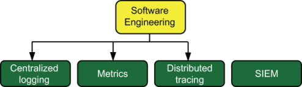

# 简介

本章涵盖

- 什么是遥测系统
- 遥测对不同技术团队意味着什么
- 遥测系统特有的挑战

遥测是你从生产系统获得的反馈，它告诉你那里正在发生什么，这些反馈可以提高你对生产系统做出决策的能力。对于 NASA 来说，生产系统可能是火星上的漫游车，但我们大多数人的生产系统就在地球上（有时在地球轨道上）。无论是流动站电池的剩余电量还是目前正在生产的集装箱数量，一切都是遥测的。现代计算系统，尤其是大规模运行的计算系统，实时遥测，这就是我们管理如此大型系统的方式。遥测在我们的行业中无处不在：

- 如果你曾经查看过描述网站点击量随时间变化的图表，那么你就使用过遥测技术。
- 如果你曾经在代码中编写过日志记录语句，然后在 Kibana 或 Loggly 等日志搜索工具中查找这些语句，那么你就使用过遥测技术。
- 如果你曾经研究过 Datadog 中的应用程序性能，那么你就使用过遥测技术。
- 如果你曾经配置过 Apache Web 服务器以将日志发送到关系数据库，那么你就使用过遥测技术。
- 如果你曾经编写过 Jenkinsfile 将持续集成测试结果发送到另一个可以更好地显示它的系统，那么你就使用过遥测技术。
- 如果你曾经将 GitHub 配置为发送存储库事件的 Webhook，那么你就使用过遥测技术。

如图 1.1 所示，软件遥测是一种为你提供遥测数据并以有助于你做出决策的方式显示遥测数据的系统。遥测来自各种各样的东西，从你的服务器（或云提供商的服务器）插入的配电单元到位于技术金字塔顶部的运行代码。遥测系统的工作是从发出遥测数据的任何地方获取遥测数据并对其进行转换，以便可以有效地显示你的遥测数据。软件遥测就是关于该系统以及如何使其耐用。


图 1.1 遥测系统在整体技术基础设施中的位置。我们运行的所有内容都会向我们提供一些有关其运行情况的指示。这些指示（此处的虚线）是遥测数据，而本书就是关于处理该遥测数据的。

遥测是一个广泛的主题，而且正在迅速变化。 2010 年至 2020 年间，我们的行业出现了指标（增加了运营团队已经在进行的监控）和分布式跟踪，它们与可观察性的三个支柱中的日志相结合。在过去的十年里，我们看到了两种新型的遥测系统：谁知道 2020 年至 2030 年我们会看到什么？本书将教你所有遥测系统（包括你尚未见过的遥测系统）如何运行的基础知识，这将为你实现当前系统的现代化并适应新的遥测风格做好准备。任何时候你教授信息传递和翻译（这就是遥测系统的作用）时，你都不可避免地必须涵盖人们如何传递信息。本书将教你维护和升级遥测系统的技术细节，以及在修改和完善遥测系统时需要与同事进行的对话。

所有遥测系统都具有类似的架构。图 1.2 是你在阅读本书第 1 部分和第 2 部分时经常看到的架构。


图 1.2 所有遥测系统通用的架构，尽管某些阶段通常组合在较小的架构中。发射阶段从生产系统接收遥测数据并将其传送到运输阶段。运输阶段处理并最终存储遥测数据。演示阶段是人们搜索和使用遥测技术的地方。发射和运输阶段可以将上下文相关的标记应用于遥测；运输和演示阶段可以通过提取其中编码的详细信息来进一步丰富遥测。

遥测是生产系统发出的数据，用于提供有关内部发生情况的反馈。遥测系统是处理、转换、存储和呈现遥测数据的系统。本书主要是关于系统的，所以让我们看一下当今使用的四种主要遥测风格：

- 集中式记录——第一个遥测系统创建于 20 世纪 80 年代初。这种风格从生产系统获取基于文本的日志记录输出并将其集中以方便搜索。请注意，此技术是硬件广泛支持的唯一技术。
- 指标——源自运营团队使用的监控系统，当软件工程师采用该技术时，更名为指标。该系统出现于 2010 年代初，侧重于数字而不是文本来描述正在发生的事情。与集中式日志记录相比，指标允许在线保存和搜索更长的时间范围。
- 分布式跟踪——直接关注跨分布式系统的许多组件的跟踪事件。 （顺便说一句，大型单体算作大型分布式系统。）这种风格出现于 2010 年代末，并且正在快速发展。
- 安全信息事件管理 (SIEM) - 供安全和合规团队使用的专用遥测系统，以及集中式日志记录和指标的专业化。该技术早在 2000 年代中期该术语正式正式使用之前就已被使用。

这些遥测样式在本书中随处可见，因此你会看到它们被多次提及。第 1.1 节为你提供了这些遥测样式的详细定义和历史，并展示了每种样式如何符合图 1.1 中的架构。

注意：在过去几年中，可观测性支柱的概念已经出现。可观测性一词最初用于定义遥测的特定风格，并演变为指标风格的复杂化。然而，如今，可观测性通常被认为是一种实践，而不是遥测风格。三大支柱是日志、指标和跟踪。如果你使用所有三种方式，你最好能够观察系统的运行情况。本书是关于支持提供可观察性的系统的。安全团队使用的 SIEM 系统是一种可观察性形式，可以告诉你谁做了什么、何时做、如何做以及何时发生了什么，就像支柱一样。

由于人员与我们的遥测系统处理的遥测数据一样重要，因此第 1.2 节详细介绍了技术组织内的许多团队以及每个团队更喜欢使用的遥测系统。本书的其余部分经常引用这些团队。

## 1.1 定义遥测的风格

本章简介中提供的遥测样式列表提供了每种遥测样式的用途的简要缩略图，并且在你阅读本书时将是一个很好的参考。本节提供了四种遥测样式的更详细定义，并给出了它们的实际示例。

### 1.1.1 定义集中式日志记录

集中式日志记录将生产系统生成的日志记录数据带到人们可以查询的中心位置。图 1.3 显示了目前使用的此类系统的示例。


图 1.3 使用 Fluentd、Elasticsearch 和 Kibana 作为主要组件的集中式日志系统。遥测数据由生产代码和思科硬件发出。然后，此遥测数据由 Shipping 阶段组件接收，集中在 Fluentd 中，并存储在 Elasticsearch 中。 Kibana 使用 Elasticsearch 存储为人们提供单一界面来搜索所有日志。

集中式日志记录不仅支持软件遥测，还支持硬件遥测！图 1.3 中的 Syslog 服务器框代表了一个系统的现代版本，该系统最初是在 1980 年左右首次编写的，作为来自 Berkley Software Distribution 3BSD 的古老 `sendmail` 程序的专用日志系统。到 2000 年，Syslog 几乎在 UNIX 和类 UNIX 操作系统中得到普遍使用。 2001 年的标准化工作产生了一系列评论请求 (RFC)，为传输协议和数据格式定义了 Syslog 格式。让 Syslog 成为标准为硬件制造商提供了一种发送遥测数据的选择，而这种选择在大多数硬件十年的使用寿命内不太可能改变。另一个选项是简单网络管理协议 (SNMP)，第 2 章对此进行了介绍。

我提出 Syslog 是因为它带来的概念很大程度上影响了我们对软件日志记录的看法。如果你曾经听说过“打开调试日志记录”这句话，那么你就听说过 Syslog 引入的概念。日志级别的概念起源于Syslog，它定义了表1.1中列出的八个级别。

表 1.1 Syslog 标准日志级别

|  ID  |  严重性  |    关键词     |
| :--: | :------: | :-----------: |
|  0   | 紧急情况 | emerg, panic  |
|  1   |   警报   |     alert     |
|  2   |  严重的  |     crit      |
|  3   |   错误   |  err, error   |
|  4   |   警告   | warn, warning |
|  5   |   提示   |    notice     |
|  6   |   信息   |     info      |
|  7   |   调试   |     debug     |

Syslog影响最大的是表1.1中的关键字。并非每个软件记录器都构建所有八个级别；有一些会向此表添加更多内容，例如 Java 中的 `fatal` 和 `trace` 。但几乎所有记录器都有一些调试、信息、警告和错误的概念：

```
logger.debug("Entering Dangerous::Function with #{args.count} params.")
logger.info("Dangerous::Function finished in #{timer.to_seconds} seconds.")
logger.warn("FIXME: Dangerous::Function was not passed a CSRF token.")
logger.err("Dangerous::Function failed with ArgumentError::InvalidType")
```

如果你编写过软件，那么你很可能在职业生涯的某个阶段使用过这些级别。日志级别的概念还引入了这样的想法：所有日志记录都有一些上下文：日志级别指示事件的严重程度，事件的文本描述发生的情况。从软件记录可以包含比简单的优先级和消息更多的上下文； 6.1 节更详细地描述了这个标记过程。

集中式日志记录的中间阶段（如图 1.3 所示）为 Fluentd 服务器，它以发出的格式（Cisco 硬件的 Syslog，无论生产代码的日志文件格式是什么）获取遥测数据，并将其重新格式化为 Elasticsearch 所需的格式。 Elasticsearch 需要一个哈希数据结构（一个数组，但每个元素都有名称而不是数字），因此 Fluentd 在将 Syslog 格式存储到 Elasticsearch 之前以 Elasticsearch 的格式重写。这个重新格式化的过程称为丰富，将在第 4 章中介绍。

管道的末端（如图 1.3 所示）为 Kibana 服务器，使用 Elasticsearch 作为查询数据库。 5.2 节更详细地介绍了如何构成一个好的集中式日志记录阶段系统。在这里，Kibana 用于访问遥测数据并协助分析。

### 1.1.2 定义指标

指标式遥测是使用数字（计数器、计时器、速率等）来获取有关生产系统中正在发生的情况的反馈。而集中式日志系统通常使用简单的语言来表明某件事花费了多长时间，例如

```
logger.info("Dangerous::Function finished in #{timer.to_seconds} seconds.")
```

度量系统通过对数字和一些附加字段进行编码以提供上下文来对相同的信息进行编码。在此示例中，为上下文添加了函数名称，并为数字使用了计时器：

```
metrics.timer("Dangerous_Function_runtime", timer.to_seconds)
```

图 1.4 是现实世界指标管道的示例。


图 1.4 一个指标系统，其中生产软件将指标从代码发送到 Prometheus StatsD 导出器进程中；操作系统有一个名为collectd的监控包，它收集系统指标并直接向Prometheus Graphite导出器报告。这些导出器向 Prometheus 提交汇总指标。 Grafana 服务器充当该指标系统所有用户的接口点。

图 1.4 显示了用于软件指标和系统指标的指标系统。系统指标由名为collectd 的监控工具收集，该工具能够将指标推送到Graphite API 中。 Prometheus 是一个定制的数据库，用于存储随时间变化的数据或时间序列数据。此类时间序列数据库是许多度量系统的基础，尽管其他数据库样式当然也可以成功使用。 Grafana 是一种广泛使用的开源仪表板系统，在本例中，运行基础设施的运营团队和管理生产软件的软件工程团队都使用该系统。

与集中式日志记录遥测一样，指标遥测几乎总是标记有与数字相关的附加详细信息。在图 1.4 之前的语句中，我们添加一个以 `Dangerous_Function_runtime` 作为值的字段。可以添加其他字段，但这样做会增加指标数据库的复杂性。这种复杂性称为基数。

> 定义 
>
> **基数**是索引复杂性的术语，具体来说，是索引中的字段可能产生的唯一组合的数量。如果有字段 A 和 B，其中 A 有两个可能的值，B 有三个可能的值，则该索引的基数为 A * B，或 2 * 3 = 6。无论数据存储系统是什么，基数都会显着影响搜索性能正在使用。

基数是指标如何成为其自己的离散遥测风格的重要组成部分。集中式日志记录及其编码的所有数据在我在本书中讨论的四种遥测风格中具有最高的基数；迄今为止，它也占用了最多的资源。由于这两个因素的结合，集中式日志记录需要最复杂的数据库和任何类型的最大数据量。然而，由于预算限制，集中式日志系统很少能够长时间保持数据在线和可搜索。将集中式日志记录与指标进行比较，由于其基数较低，并且专注于易于存储的数字，你就拥有了一个遥测系统，可以在线保存多年的遥测数据并可进行搜索，而成本只是集中式日志记录系统的一小部分！

在 2009-2012 年时期，当指标开始被称为软件遥测风格时（它长期以来一直在运营方面用作监控系统），与集中式日志记录相比，其较低的成本是采用的最大驱动力之一。集中式日志记录仍在使用，但为决策类型设计的专门遥测流程是一场革命，它建立了下一个遥测风格。

### 1.1.3 定义分布式跟踪

分布式跟踪是指标和日志记录的奇怪结合——日志记录的基数与指标的分析能力。当你查看执行期间发生的情况时，跟踪可以实现显式自动化，将整个执行流（图 1.5 显示了一个这样的流）添加到所呈现的上下文中。日志记录显示发生的特定事件，并使用一些属性来提供事件周围的上下文。指标可让你全面了解系统的运行情况。跟踪使用你记录的事件中应该拥有的额外上下文来创建执行的链接视图，如图 1.5 所示。这种可视化使人们更容易快速隔离感兴趣的地方进行调查。图 1.5 展示了分布式跟踪系统可以提供的执行流程显示类型。


图 1.5 分布式跟踪系统的显示示例，遵循类似于堆栈跟踪的执行流程。在这里，我们看到对 `upload_document` 的调用以及 `upload_document` 在执行期间调用的所有其他进程。当跟踪 `pdf_to_png` 流程中的错误时，你将看到导致该特定执行的事件的完整上下文。

跟踪不仅在微服务环境中有用，而且在以下方面也很有用：

- 许多团队向其贡献代码的大型整体代码库——产生的痕迹不尊重政治边界，从而减少故障排除的障碍。
- 具有几个大型应用程序一起工作的微整体环境 - 此类环境通常有单独的团队处理较大的应用程序，因此跨所有应用程序的跟踪可以打破团队之间的孤岛。
- 单体应用正在被分割，并且到目前为止只有一些额外的微服务——这种遥测风格通常是在不同系统之间提供共享上下文的最佳选择。

追踪技术也在 2010 年代末出现，并且正在快速发展。 OpenTelemetry 项目 (https://opentelemetry.io) 是美国科技行业主要参与者的一项努力，旨在为跟踪遥测提供通信和数据格式标准。 PHP、COBOL 和 Perl 等成熟且大多被美国科技行业巨头忽视的编程语言通常缺乏用于跟踪的软件开发工具包 (SDK)。软件工程师的挫败感是创新的主要驱动力，因此我预计这些服务不足的语言很快就会获得所需的支持。

尽管分布式跟踪很新颖，但我们今天还是有现实世界的例子可以看。图 1.6 显示了这样一个例子。


图 1.6 大约 2021 年的分布式跟踪系统示例。生产代码正在运行 OpenTelemetry SDK，它将事件发送到运行 Jaeger 开源跟踪系统的系统。然后 Jaeger 收集器将事件存储在数据库中。 Jaeger 前端提供了一个搜索和显示生产系统跟踪的地方。

> 应用程序性能监控怎么样？
>
> 应用程序性能监控 (APM) 是一个自 2010 年代初期以来就在业界使用的术语。 APM 最初是一种度量形式，但通过使用稳定增加的上下文量而演变为更多形式，就像今天的分布式跟踪系统一样。 APM 系统在业界开始对可观测性感到兴奋之前就已经存在了；因此，APM 系统大力进军该领域。如今，New Relic 和 Datadog 的 APM 系统是一站式购物系统，提供可观察性的所有三个支柱。换句话说，APM 系统将集中式日志记录、指标和分布式跟踪结合在一起。这些大公司已经存在很长时间了，因此期望他们能够跟上软件遥测市场思想的变化。
>
> 在本书中，每当我提到可观察性支柱时，请注意我也在谈论 APM 系统。

### 1.1.4 定义SIEM

许多公司和组织的运营都受到外部施加的限制，例如强制性股票市场报告、银行业的特定行业监管以及可选的合规框架（例如 ISO 标准定义的框架）。这些标准、法规和合规框架已经伴随我们数十年，并与技术行业一起成长。大多数这些外部控制都需要技术组织内部采用一套通用的监控技术，包括以下内容：

- 跟踪所有登录、注销和帐户锁定事件。
- 跟踪管理权限的所有使用情况。
- 跟踪对敏感文件和记录的所有访问。
- 跟踪密码复杂性和期限要求的合规性。

由于这些要求非常常见，并且跟踪和随后关联它们非常复杂，因此产生了一种单独的遥测样式，称为安全信息事件管理系统 (SIEM)。由于任务的复杂性，SIEM 几乎都是付费软件；很少有开源项目（如果有的话）来做这项工作。作为遥测风格的操作员，你将花费更多时间将遥测源连接到知道如何解释数据的系统。图 1.7 显示了一种将 SIEM 集成到更大的遥测系统中的可能架构，它是图 1.3 中所示的集中式日志记录系统的分支。


图 1.7 一种可能的 SIEM 系统。由于 SIEM 系统通常源自集中式日志记录系统，因此该图显示了集中式日志记录流和 SIEM 流的相同来源。当遥测进入 Fluentd 进程时，它会产生两个 feed；第一个 feed 进入 Elasticsearch 进行集中日志记录，第二个 feed 提交到 Splunk SaaS API。在本例中，Splunk 充当 SIEM。

架构有很多种；图1.7仅显示了一个。在另一种架构中，安全性具有在主机服务器上运行的可安装代理，这些代理以与集中式日志记录流完全不同的方式发出，从而形成一个完全独立的系统。两种方法都是可行的。

## 1.2 不同团队如何使用遥测数据

由于遥测用于支持有关生产系统的决策，因此你不可避免地必须考虑决策人员的组织方式以及这如何影响他们对遥测的使用。本节定义了技术组织中的主要团队，以供本书后面使用。你的角色可能会出现在这个列表中的某个位置，如果你已经在这个行业工作了很长时间，那么你可能已经在多个团队中工作过。例如，在我的职业生涯中，我一直从事客户支持、运营、DevOps 和站点可靠性工程 (SRE) 工作，并与安全团队密切合作。

注意：我使用术语“组织”而不是“公司”来包含创造技术的非公司组织，例如政府实体和非营利组织。这里列出的团队是广泛的类别，当你看到大写的团队名称（例如 Software Engineering）时，就知道我指的是本章中的定义。

### 1.2.1 运营、DevOps 和 SRE 团队使用遥测

尽管运营、DevOps 和 SRE 团队涵盖的领域有所不同，但他们有很多共同的背景。 （SRE 将在 1.2.3 节中再次提及，因为它们与软件工程团队共享背景。）

运营团队是这三个团队中最先出现的（20 世纪 70 年代）。如今，标题中带有“运营”的团队很可能来自 20 世纪 60 年代和 1970 年代计算机化的长期组织，尽管有时这些团队会添加“基础设施”一词来创建术语“基础设施运营”或使用术语“平台工程”。在本书中，我使用操作。具有此名称的团队通常负责保持机器运行和生产代码运行（云或硬件，包括操作系统）。

DevOps 团队出现于 2000 年代的第一个十年，旨在消除运营和软件工程团队之间形成的孤岛。如今，DevOps 团队经常代替运营团队，同时维护系统以确保代码满足最低质量标准（持续集成）并将其投入生产（持续部署）。在职位名称中使用 DevOps 是有争议的——DevOps 是一种哲学，而不是一个职位名称——但这并不妨碍它成为常见的做法。

在全球一些最大的科技公司中，SRE 与 DevOps 大致平行出现。最初，SRE 是负责确保客户可以按照客户需要的方式使用你的（基于 Web 的）软件的团队。对于每个拥有 SRE 团队的组织来说，该术语的含义有所不同，但所有这些组织都关心你的（通常基于 Web 的）软件是否可供客户使用。

运营团队从一开始就关心正常运行时间。 DevOps 关心软件质量，将其作为保障正常运行时间的一种方式。 SRE 团队明确负责可用性。所有这些融合的需求意味着这三个团队具有共同的遥测需求，如图 1.8 所示。


图 1.8 运营、DevOps 和 SRE 团队的首选遥测样式。使用集中式日志记录是因为这些团队管理的基础设施优先在那里发出，并且使用指标是因为它是跟踪站点可用性和一般监控的基础。可以使用其他两种样式，但集中式日志记录和指标是最常见的。

### 1.2.2 安全和合规团队使用遥测

安全性负责保护整个组织免受外部威胁。合规性负责确保你的组织遵守法定法规和可选的合规框架，例如服务和组织控制 (SOC 2) 标准。安全和合规团队通常是同一团队，直到组织决定将这些问题分开是个好主意。并非每个组织都拥有安全团队，尽管许多组织不应该这样做。然而，这些团队在某些行业中是不可避免的，尤其是涉及金融和健康的行业。支持安全和合规任务需要制定多项政策和程序，例如以下内容（并非详尽列表）：

- 漏洞管理计划，确保生产和遥测系统中使用的软件保持最新状态
- 定期审查谁有权访问生产和遥测系统的程序
- 确保迅速撤销生产和遥测系统中被解雇员工的访问权限的程序
- 报告以识别生产和遥测系统的登录失败
- 报告以跟踪一段时间内管理权限的使用情况
- 密码复杂性和身份验证策略，可充分防御密码猜测和其他凭据盗窃威胁

他们的职责不仅是制定政策，还要确保安全和合规团队遵守这些政策。这项任务正是遥测发挥作用的地方，因为它允许外部审计员确定这些政策是否有效。当这些团队无法确保遵守策略时，安全团队还面临着响应安全事件的艰巨任务。图 1.9 显示了安全与合规团队与遥测的关系。


图 1.9 安全与合规团队与遥测系统的关系。主要系统是 SIEM，但集中式日志记录提供了政策得到遵循的大部分证据。

安全事件是特殊情况，因此当它们发生时，每个遥测来源在调查过程中都可能有用。如果你属于其他团队，请准备好通过提供有关如何使用和搜索你负责的遥测数据的信息来支持事件响应人员。安全是每个人的工作。

遵守法规和自愿框架总是需要将某些类型的遥测技术保留多年（通常是七年，这是从会计行业继承的数字）。这种默认的长期保留要求在遥测样式中是独一无二的，指标是接近 SIEM 系统保留期的唯一其他样式。 （第 17 章详细讨论了保留策略。）

### 1.2.3 软件工程和 SRE 团队使用遥测

软件工程团队负责在你的生产环境中编写软件。我再次提到 SRE，因为 SRE 团队的使命是确保软件的可用性扩展到代码运行的基础设施（第 1.2.1 节）和代码本身（本节）。一些组织还将面向系统的 SRE 与面向软件的 SRE 分开。软件工程引入了遥测的指标和分布式跟踪方式，以更好地跟踪代码正在执行的操作，因此图 1.10 应该不足为奇。



图 1.10 软件工程团队（几乎所有团队）使用的遥测系统。可观察性的所有三个支柱都被使用。

软件工程团队关注的是代码在生产中的执行情况，而 SRE 团队关注的是代码是否满足承诺的性能和可用性目标。这项任务与软件工程的愿望相关，但区别很重要。软件工程关注的是故障以及它们如何影响一切，而 SRE 关注的是整体聚合性能。

### 1.2.4 客户支持团队使用遥测

客户支持团队拥有各种其他头衔，包括技术支持、客户成功、客户服务和支持客户管理。这些团队负责与你的客户（或用户或员工）合作并解决问题。他们拥有有关你的生产系统如何为人们工作的最佳信息，因此，如果你的软件工程和 SRE 团队不与他们交谈，那么你的组织中就会出现严重错误。这种沟通需要双向进行，因为当客户支持团队熟练使用软件工程使用的遥测系统时，问题报告的质量会显着提高。在客户支持无法访问遥测系统的组织中，问题报告听起来像这样：

> 账户 11213 于 2023 年 2 月 19 日 18:02 UTC 发生交易失败。他们说以前也发生过这种情况，但无法告诉我们具体时间。他们存在流失风险，年薪 21,000 美元的合同面临风险。

将此报告与你的客户支持团队在有权访问查询遥测系统的情况下可以制作的报告进行比较：

> 账户 11213 曾有多次交易失败。报告的交易ID为e69aed5a-0dfc-47e2-abca-8c11374b626f，当我查找时发现它失败了。此帐户又出现了四次该故障。我还看到其他五个帐户也发生了这种情况，并联系了所有五个帐户。其中两人回复了我，并感谢我们主动向他们通报了该问题。帐单代码为 Q 的帐户似乎受到了影响。

第二个问题报告客观上要好得多，因为隔离问题可能隐藏的位置的工作已经大部分完成。你想要增强你的客户支持团队的能力。图 1.11 展示了客户支持最充分利用的遥测系统类型。


图 1.11 最适合客户支持团队的遥测系统。由于这些团队对特定故障最感兴趣，因此依赖聚合（指标）的遥测样式并不那么有用。请注意，当客户支持更多地充当内部用户的帮助台时，SIEM 访问权限通常也会被授予并且很有用。

客户支持团队与客户合作找出问题所在，这意味着他们对最近发生的事件最感兴趣。依赖聚合（指标）的遥测系统没有用，因为单个有趣的事件不可见。依赖统计采样（分布式跟踪；参见第 17.3 节）的遥测系统可能有点用，但有趣的错误需要在样本中。你可以通过在统计样本之外（也许在第二个错误数据库中）保留错误事件来解决此问题。 （有关此技术的更多信息，请参阅第 17 章。）

### 1.2.5 商业智能使用遥测

商业智能 (BI) 团队很狡猾；他们致力于业务遥测而不是技术组织的遥测。他们的遥测版本包括营销转化率、帐户升级/降级率、注册率、功能使用以及电子邮件营销活动中的点击率等数据。尽管 BI 团队通常不被视为技术组织的一部分，但我在这里提到它们有两个原因：

- BI 团队内部的人员通常接受过统计方法方面的培训，因此当你开始将统计方法应用于技术遥测时，他们代表了你的内部资源。
- 如果你正在构建 SaaS 平台，BI 团队可能会与你联系，将遥测流与你技术组织已有的系统一起设计到他们的系统中。

如果你的组织已经拥有擅长处理和操作数据的人员，那么你在构建或升级数据处理系统时需要与他们交谈。他们会告诉你聚合数据的计划何时不会返回有效结果（获取一系列经过平均的数据的 `MAX` 值不会为你提供真实的 `MAX` 值）例如，源数据）。向完全不同部门的人寻求帮助可能会让人感觉很奇怪，但如果这样做，你就会构建更好的系统。

## 1.3 遥测系统面临的挑战

遥测系统面临着与生产系统相同的灾难：火灾、洪水、设备故障、信用卡意外过期、劳工诉讼、破产、流行病、内乱等等。遥测系统尤其容易受到遥测特有的灾难的影响，这就是本节介绍的内容。四大问题源于三点：

- 遥测系统不是收入系统（参见第 1.3.1 节）。
- 不同的团队需要从他们使用的遥测中获得不同的东西（参见第 1.3.2 节）。
- 遥测仍然是数据，即使它不是生产数据，许多人和组织对数据感兴趣（参见第 1.3.3 和 1.3.4 节）。

### 1.3.1 长期投资不足损害决策

到目前为止，遥测系统面临的最大威胁是资源投资不足。遥测系统是决策支持工具；它们以帮助你确定下一步该做什么的方式呈现你从生产环境发出的反馈。也许你会关注接下来几个冲刺的技术债务，因为你的可用性指标未达到服务级别协议目标。或者每秒处理 12,000 个连接时，你的负载均衡器节点开始响应很差，是时候为你的集群购买更多连接了。无论你在寻找什么，这些系统都会帮助你找到它。投资不足可能由多种因素造成：

- 遥测系统不是收入系统。 “如果他们不赚钱，那就是管理费用，所以要削减管理费用来盈利； QED”。这一论点表明，企业管理层对遥测系统为整个组织提供的价值有错误的理解。
- 不要修复没有损坏的东西。 “你现在所拥有的一切都很好；何必去改变呢？”这一论点表明，从精心设计的遥测系统中获得最大价值的人和愿意为精心设计的遥测系统花费时间和金钱的人之间存在脱节。
- 集中式日志记录就是我们所需要的。 “当我们只需要六次搜索就可以用我们当前的系统做同样的事情时，为什么还需要一个追踪系统呢？”几十年的计算机管理已经证明，集中式日志记录是一种强大的工具。集中式日志记录也可能被迫完成 SIEM、指标甚至分布式跟踪的工作，但它的表现比为这些任务设计的系统要差得多。你会发现自己花费大量时间编写胶水自动化以使这个方钉适合六角形孔，而不是设置一个新的专用系统可能会节省时间和金钱。
- 功能！功能！功能！ “我们没有时间这么做；我们需要推出下一组功能来促进销售！”这种观点更像是成长中的 SaaS 公司的一种病态，是企业管理层误解遥测系统为组织带来的价值的另一个例子。

总体趋势归结为不了解遥测的作用，以及感受到痛苦的人和愿意解决痛苦的人之间的脱节。对于团队中的简单技术人员来说，这些问题都不是容易解决的。根据你的组织文化，对于那些感到痛苦的经理来说，解决这两个问题可能是不可能的，因为像遥测系统这样的重大更新的批准需要在指挥链的高层进行，所以这并不重要。

当你面临这些逆风时，你仍然有机会做出改变。如果组织文化在其他方面都很好，那么投资不足很大程度上是由于无知造成的。你可以修复无知，如下所示：

- 解释改进的遥测系统将实现的决策类型。经理们都会使用这种语言。
- 解释一下现在向 SaaS 提供商付费将如何提高每个人做出决策的能力，比花费 24 个月构建自己的系统更快（并且可能会带来比 DIY 系统提供的更好的功能）。
- 解释新的遥测方式与当前系统的工作方式有何不同，提供一个框架，展示它将如何在现有生产系统中运行，并指出它将如何改进问题识别和工作优先级排序。

我在公共部门工作了 14 年，其中 7 年是在经济衰退期间，当时花新钱必须等待经济好转。许多组织都受到年度或半年预算流程的支配，在这个流程中，一群很少技术性的民选官员决定你是否会获得昂贵的新系统。对抗长期投资不足是一项艰巨的工作，但这是可以做到的。提出理由，做好事情，并提前足够长的时间（几个月，甚至几年）做好计划，这样，如果答案归结为“今年不行”，你就不会惊慌失措。

### 1.3.2 多样化需求抵制标准化

当你阅读第 1.2 节（其中描述了技术组织中的团队及其遥测需求）时，你可能已经注意到一些不同的目标。以下是一些顶级差异：

- 客户支持团队需要最近（几周内）的遥测数据，并且他们需要所有这些数据（没有聚合或总结），以防客户正在谈论的内容在那里。
- 安全团队需要他们的 SIEM 系统来保存七年或更长的遥测数据。
- 为了经济实惠，分布式跟踪系统需要对数据进行统计采样。
- 集中式日志系统的运营成本最高（按每天遥测费用计算），因此在线保存数年的遥测数据成本高昂。有时，数周的遥测对于组织来说太昂贵了。

图 1.12 提供了此处讨论的四种遥测样式的不同存储和保留需求的视图。


图 1.12 四种遥测样式的首选在线可用性时段图表。由于外部要求，SIEM 系统具有最长的保留时间。分布式追踪通过统计采样实现保留。指标通过聚合内部存储的数字来实现其持续时间。集中式日志记录的成本非常昂贵，因此它的在线保留期最短。

“一个策略适用于所有人”的方法根本不适用于遥测系统。你的保留策略需要以适应团队和遥测系统的不同需求的方式编写。 （第 17 章专门讨论这个主题。）遥测数据本身的形式也存在多样性：

- 硬件以两种标准化格式发出：Syslog 或 SNMP。如果你无法处理标准格式，你将无法获得遥测数据。
- 遥测 SaaS 提供商 SDK 可能不支持通过 HTTP 代理发出遥测数据，而这是许多生产环境中必需的功能。
- VMWare vCenter 等平台服务拥有自己的遥测处理系统。
- Amazon Web Services (AWS) 和 Digital Ocean 等基础设施提供商以自己的格式并在自己的位置提供遥测数据，由你来获取和处理它。
- 操作系统组件（Windows、Linux、FreeBSD、AIX、HP-UX、z/OS 等）以自己的格式发出，例如 Syslog 和 Windows 事件日志。如果你想要遥测，你需要处理这些格式。
- 编写生产系统所用的编程语言及其年龄可能会阻止你访问用于分布式跟踪的 SDK。

此类挑战增加了遥测系统的复杂性，但并非不可克服。我在第 3 章中介绍了移动遥测的方法，在第 4 章中介绍了转换格式的方法。如果你碰巧使用的语言或平台不受当前热门新技术行业的欢迎，那么你可能习惯于为新事物建立支持你自己。抱歉（她说，已经在 NetWare 上成功运行了 Tomcat 应用程序）。

### 1.3.3 信息泄露并清理以避免法律问题

信息泄露及其后果是有关隐私（个人身份信息 [PII]）和健康相关（个人健康信息 [PHI]）信息立法不断增加的直接结果。正如有毒废物监管直到 20 世纪下半叶才基本存在一样，21 世纪上半叶信息开始被归类为有毒物质。遥测系统接收来自生产系统的反馈，但如果生产正在处理隐私或健康相关数据，则遥测流也可能包含此类有毒数据。

你永远不想在遥测系统中看到与隐私或健康相关的数据，因为对遥测数据的访问必须遵循访问生产数据所需的所有严格（且繁琐）的访问控制和使用策略。使遥测数据的访问变得更加困难，通常会降低遥测系统的整体效用。很少有组织在文化和技术上具备轻松处理此类数据的能力，而且它们都是医疗保健或金融公司。对于我们其他人来说，将隐私和健康相关数据排除在遥测流之外是一场永无休止的战斗。信息泄露的来源主要有以下三个：

- 最大的泄漏源：带参数的异常日志记录——参数对于调试非常有用，但可以包含隐私和健康相关的数据，因此它们是迄今为止我在自己的系统中看到的最大的泄漏源。这种情况变得更糟，因为许多记录器模块没有内置修订概念（有关修订的更多信息，请参阅第 16 章），并且软件工程师不习惯将异常视为在发布之前需要代码内修订。使用结构化记录器（参见第 12 章）为你提供了编辑异常的方法。
- 不假思索地将 IP 地址和电子邮件地址包含在日志记录中 — IP 和电子邮件地址对于打击欺诈和隔离声明所涉及的帐户非常有用。不幸的是，IP 地址和电子邮件地址受到许多隐私法规的保护。如果必须包含这些详细信息，请考虑对它们进行哈希处理以提供相关性，而不需要提供直接值。第 14.2.1 节提供了另一种限制遥测中允许值的方法。
- 在日志语句中包含任何用户提交的任何类型的数据——用户将在字段中填充各种不应该填充的内容。对你来说不幸的是，许多隐私和健康数据法规要求你检测并响应此类泄漏。如果你所在的地方受此类法律约束（询问你的律师）并且有错误赏金计划，那么你应该向那些想方设法在不受保护的仪表板上显示用户提供的输入的错误猎人支付赏金。但最好首先不要在遥测流中发出用户提交的数据。

尽管这一事实非常令人烦恼，但你必须制定适当的政策和程序来追溯删除错误存储的隐私和健康相关信息。使这些类型的数据变得有毒的立法还没有出现足够长的时间，以至于遥测处理模块无法将飞行中的编辑作为日志级别的标准功能。我希望这种情况将来能够改变。在那之前，我们必须知道如何清理有毒泄漏物。第 16 章广泛讨论了这个主题。

### 1.3.4 法院命令打破了你的假设

地球上几乎每个国家都有司法规则，允许诉讼各方向对方索取相关业务记录。电子邮件和 Slack 消息是众所周知的业务记录，但遥测数据也是如此。如果你的组织是诉讼方，对方律师（另一方的律师）可以请求遥测数据。从提出请求到你采取行动之间发生的情况将由你所在组织的律师、对方律师和负责案件的法官决定，如图 1.13 所示。


图 1.13 与遥测数据相关的文档发现过程的流程大大简化。你的律师将代表你的组织努力减少你必须向另一方提供的遥测数据。你可以通过教导你的律师你的遥测系统在技术上可以生成什么以及不能生成什么来帮助完成此过程。在你能够生产什么的问题上向你的组织的律师撒谎将会导致你被解雇。让律师做好他们的工作；你只是作为技术顾问。

有两个法庭程序迫使你改变处理、存储和授予遥测数据访问权限的方式：

- 请求生成文档——此流程如图 1.13 所示，要求你创建遥测数据的摘录。你需要创建的格式将由律师协商，因此你可能会被要求咨询遥测系统的功能。
- 要求持有文件——在这两项要求中，这一项对你（遥测系统操作员）的影响更大。请求保留文档意味着你必须将某些遥测数据排除在聚合、汇总和删除策略之外。由于法律问题有时需要数年时间才能解决，因此在糟糕的情况下，你最终可能会存储数倍于常用遥测数据的数据。

并非每个组织都必须为诉讼做好准备，以至于需要经过充分测试的程序来生成和保存遥测数据，但某些行业容易发生诉讼，例如金融、药品制造和专利法。此外，某些类型的诉讼，例如因有毒数据泄露和内部破坏而提起的诉讼，更有可能涉及遥测数据。你至少应该有一个白板计划，说明当你面临法院命令时该怎么做。第 18 章介绍了这个主题。

## 1.4 你将学到什么

本书是帮助技术组织中的任何团队操作遥测系统的指南。它侧重于优化涉及处理和显示遥测数据的系统的操作，而不是优化遥测数据的整体使用。为了从本书中受益，你应该以某种方式使用过遥测系统，例如在仪表板中进行搜索或在代码中编写日志语句。你还应该使用代码来操作和搜索字符串，并在图形应用程序中构建查询。在本书中，你将学到

- 遥测系统的架构以及当前遥测系统如何遵循该架构
- 如何优化遥测处理以降低成本并增加在线搜索期限
- 如何确保遥测系统的完整性以支持法规和合规框架以及安全调查
- 作为法律程序一部分用于支持法院命令的技术
- 安全处理和处置受监管信息（例如 PII 和 PHI）的程序

为了帮助你学习这些技能，我将使用来自三种技术组织风格的示例。要知道，我在这里教授的内容适用于成长中的初创公司、成立于 1700 年代的公司，以及编写和运行软件支持业务但不是业务原因的组织。

# 概括

- 遥测是你从生产系统获得的反馈。
- 遥测是现代计算的工作方式，因为它告诉我们我们的生产系统正在做什么。
- 遥测最终支持你必须做出的有关生产系统的决策。如果你的遥测系统很差，你就会做出错误的决定。
- 集中式日志记录是第一种出现的遥测方式（在 20 世纪 80 年代中期），它将生产系统生成的所有日志记录都集中到一个中央位置。
- Syslog 等日志格式标准可确保硬件系统以标准格式发出，因此如果你希望从硬件系统进行遥测，则还需要支持这些格式。
- Syslog 向业界引入了日志级别（调试、信息、警告和错误等）的概念。
- 指标（出现于 2010 年代初期）侧重于可聚合的数字来描述生产系统中发生的情况。
- 基数是数据库中索引复杂性的术语。表的字段越多，其基数就越高。集中式日志记录是一个高基数系统；度量系统通常是低基数的。
- 分布式跟踪出现于 2010 年代末，专注于跨系统边界的执行流跟踪事件。
- 分布式跟踪在调查有趣的事件时提供整个执行流的上下文，这进一步提高了你隔离问题开始位置的能力。
- 由于分布式跟踪系统的复杂性，SaaS 公司在分布式跟踪领域占据主导地位。
- SIEM 系统是安全和合规团队的专业遥测系统；它们存储与安全用例相关的信息。
- SIEM 系统存储一致的信息，因为监管和自愿合规框架主要跟踪相同类型的数据，并且通常要求此类数据存储多年。
- 运营和 DevOps 团队使用遥测技术来跟踪其基础设施系统的运行情况，重点关注集中式日志记录和指标样式。
- 安全和合规团队关注集中式日志记录和 SIEM 系统，因为 SIEM 系统与集中式日志记录共享大量历史记录，并且集中式日志记录在审计合规性和外部合规性框架期间非常有用。
- 软件工程团队使用除 SIEM 系统之外的所有遥测系统来努力了解其代码在生产中的行为方式。
- 可观察性支柱是一个软件工程概念，描述了允许系统可观察的遥测：日志、指标和跟踪。
- SRE 团队在其任务中使用除 SIEM 之外的所有遥测系统，以确保组织的软件可用。
- 客户支持团队使用集中式日志记录和分布式跟踪方式来更好地隔离客户报告的问题并提高发送给工程人员的错误报告的质量。
- 商业智能团队很少属于技术组织，但负责构建业务遥测系统。当你部署新的遥测方式时，BI 人员是宝贵的资源，因为他们熟悉统计方法。
- 遥测系统面临的一个长期威胁是投资不足，这可能源于对遥测系统给组织带来的价值的误解，以及决策者和那些因遥测系统不良而感到痛苦的人之间的脱节。
- 不同的团队需要从遥测中获得不同的东西，不同的遥测风格受益于不同的保留期。你的遥测系统需要适应这些差异才能成为良好的遥测系统。
- 硬件、SaaS 提供商、基础设施提供商、第三方软件和操作系统都以相对固定的格式发出遥测数据。如果你想要遥测数据，你的遥测系统需要处理这些格式。
- 隐私信息 (PII) 和健康信息 (PHI) 需要特殊处理，而大多数遥测系统并不是为此目的而构建的。尽你所能将 PII 和 PHI 排除在遥测系统之外。
- 有毒信息泄漏的最大来源是包含参数的异常日志；在它们进入遥测管道之前尽你所能对其进行编辑。
- 遥测系统与你的生产系统一样受到法院命令的约束，因此你的律师可能会要求你因法律事务而提供遥测数据。
- 法院命令保留数据意味着受影响的数据不再受你的保留政策的约束，如果法律问题拖延多年，这可能会非常昂贵。