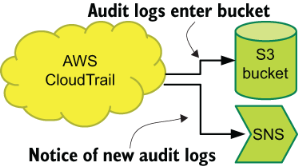

# 2 发射阶段：创建并提交遥测数据

本章涵盖

- 了解发射阶段的作用
- 从你正在开发的软件发出遥测数据
- 从硬件和第三方软件发出遥测数据
- 从 SaaS 和 IaaS 平台发出遥测数据

发射阶段（如图 2.1 所示）是管道中的第一个阶段，生产系统生成的遥测数据进入管道。第一阶段可以有很多内容：

- 你的生产代码本身。生产代码中的日志类提供了所需的格式和遥测传输（第 2.1 节）。以这种方式发出时，你可以使用多种技术。
- 你配置为发出遥测数据的硬件系统，例如 Cisco 网络设备或 Dell 服务器（第 2.2 节）。
- 软件即服务 (SaaS) 或基础设施即服务 (IaaS) 平台，例如能够提供遥测流的 Amazon Web Services (AWS)、Azure、Atlassian 产品或 GitHub（第 2.3 节）。


图 2.1 遥测系统管道阶段，首先显示发射阶段，说明它在整个遥测管道中的位置。发射阶段是遥测数据从生产系统进入管道的阶段。生产系统可以是代码，而发布阶段通常位于生产系统本身或硬件和软件即服务系统内部。

当此遥测数据从发射阶段发出时，它由运输阶段处理，其中遥测数据被转换为演示阶段使用的存储格式。由于发送遥测数据需要了解 Shipping 阶段，因此我们在本章中介绍了 Shipping 阶段的一些输入。为了帮助解释这些发射类型的实际用途，我们使用来自三种类型的技术组织的示例：

- 一家由 100 人组成的初创公司，正在构建在 AWS 中运行的 API 驱动的应用程序。此示例演示了你开发的软件的发射。
- 一家成立于 1848 年的全球物流公司，在 20 世纪 60 年代末实现了业务流程计算机化。此示例演示了从硬件基础设施发出的情况。
- 一家拥有 200 名员工的公司，提供面对面的继续教育课程，其招聘具有很强的季节性。此示例演示了从 SaaS 平台发出遥测数据。

## 2.1 从生产代码发出

在本节中，我们将讨论一家拥有 100 人的初创公司，该公司希望开始从其生产系统发出指标，并讨论实现此目标的三种方法。尽管我们在示例中讨论的是指标，但你可以使用相同的技术来发出日志记录数据。

在发出阶段，指标和日志记录之间的最大区别在于数据的格式：在指标与日志记录字符串的情况下，数字和一些额外的详细信息。图2.2描述了公司的生产系统。


图 2.2 在 AWS 中运行的 100 人初创公司的生产系统。生产代码部署到在虚拟私有云中运行的 EC2 虚拟机。这种架构使我们能够检查从生产代码发出遥测数据的几种技术。

这家初创公司正在 AWS 中运行代码，并选择在 EC2 虚拟机上运行该代码。虽然 Lambda 或 AWS 的容器服务（弹性容器服务和弹性 Kubernetes 服务）可能更适合此类公司，但使用 EC2 虚拟机可以让我演示更多遥测发射方法。本节讨论纯发射器的发射阶段技术，将遥测数据传送到运行代码的同一系统。将遥测数据发送到不同系统（可能是队列或数据库）的发射阶段是 Emitter/Shipper 阶段，我们将在 3.1 节中详细介绍。图 2.3 的上半部分描述了这两类发射器之间的差异。


图 2.3 直接从生产代码发出遥测数据的两种方式，显示了这些概念与结构化记录器的关系。左上角的纯发射器（第 2.1 节中描述）在与生产代码相同的盒子、容器或函数中发射遥测数据，右上角的发射器/运输器（第 3.1 节中描述）向外部系统发射遥测数据。

图 2.3 的下半部分演示了结构化记录器的组件以及它与发射器和发射器/运输器概念的关系。 （有关结构化记录器的完整检查，请参阅第 12 章。）大多数编程框架都有一个或多个可用的结构化日志记录选项。结构化记录器具有三个组件：

- 充当结构化记录器的可调用项的记录器。对于遥测管道，记录器是遥测进入发射阶段的方式。该组件的名称因编程语言而异。
- 格式化程序将接收到的遥测数据重新格式化为发射和运输阶段系统所需的格式。可以有多个格式化程序。
- 将重新格式化的遥测数据发送到下一步的编写器。在某些日志记录框架中，你可能只能发送到控制台或文件。其他框架有更多的交付选项（如果不可扩展的话），允许发送到数据库、队列、流、SaaS 提供商和更多目的地。

纯发射器需要运输级组件（请参阅第 4.1 节）以将遥测数据移动（运输）到遥测管道中更远的位置。在本节中，我们将介绍三种本地发射的方法：

- 发送到日志文件
- 发送到系统记录器
- 发送到标准输出

注：发射器/运输器功能向远离生产代码的系统上的遥测数据发送信号，并作为第 3.1 节运输阶段的一部分进行介绍。

本节介绍的三种方法是从程序正在执行的操作中获取反馈的最古老的方法之一。 “Hello world!”是有原因的。程序正在使用打印函数来回显 `Hello world!`

本章中的代码示例使用 Python 3 和默认的 Python 记录器来演示遥测发射概念。尽管我的代码示例中使用了 Python 3，但其他几个记录器对于不同的编程语言也有类似的行为：

- Python—structlog 模块 ( https://www.structlog.org/en/stable)
- Ruby — twp/logging gem ( https://github.com/twp/logging)
- PHP——Monolog 模块 ( https://github.com/Seldaek/monolog )
- NodeJS - Winston ( https://github.com/winstonjs/winston) 和 Bunyan ( https://github.com/trentm/node-bunyan) 模块
- Java—log4j 2 框架 (https://logging.apache.org/log4j/2.x)
- Go—Zerolog (https://github.com/rs/zerolog) 和 Zap (https://github.com/uber-go/zap) 模块
- .NET Core—内置 ILogger (http://mng.bz/ZYz5)
- Rust——Slog 模块 (https://docs.rs/crate/slog)

### 2.1.1 将遥测数据发送到日志文件中

这家拥有 100 人的初创公司希望在其代码中创建一个指标发布函数。本节介绍如何使用日志文件创建此函数，可以通过多种方式创建日志文件：

- 使用编程语言的文件读/写功能直接写入文件
- 使用附加模块（例如 Egg、gem、NuGet、npm、jar 依赖项或 PECL）提供功能齐全的日志记录库来抽象文件 I/O 并提供更高级别的日志记录接口

大多数任何规模的程序都会选择第二个选项：使用内置或附加日志记录库。你可能会问，“为什么我要使用日志记录库作为指标？”答案在第 2.1 节的介绍中给出：发射阶段系统都是为了为运输阶段准备遥测数据，当你计划将遥测数据发送到文件时，日志输出和指标输出之间几乎没有区别。

清单 2.1 中这家初创公司指标记录器的第一个版本是用 Python 3 编写的，并利用 `logging` Python 模块为我们提供了一个高级接口，用于将遥测数据发送到日志文件中。图 2.4 描述了写入日志文件条目之前的整体执行流程。


图 2.4 如何将调用 `metrics.counter("pdf_page", 2)` 写入位于 /var/log/metrics.log 的日志文件中。传递到metrics.counter函数后，格式化的字符串会以info优先级发送到预定义的记录器中。该字符串由格式化程序重新格式化以添加时间戳。然后，处理程序决定不将事件传播到其他处理程序，并将格式化行输出到 /var/log/metrics.log。

在清单 2.1 中，我们看到了完整的指标模块。

清单2.1 metrics.py：使用Python记录器将遥测数据发送到日志文件

```python
import logging
from logging.handlers import RotatingFileHandler
 
metlog  = logging.getLogger('metlog')           ❶
 
metfile = RotatingFileHandler(
  filename='/var/log/metrics.log',              ❷
  mode="a",                                     ❷
  maxBytes=8*1024*1024,                         ❷
  backupCount=5,                                ❷
  delay=False)                                  ❷
 
metlog.setLevel(logging.DEBUG)                  ❸
 
metfile.propagate=False                         ❹
 
metric_format = logging.Formatter(              ❺
  '[%(asctime)s] %(message)s',                  ❺
  )                                             ❺
 
metfile.setFormatter(metric_format)             ❻
 
metlog.addHandler(metfile)                      ❼
 
def counter(msg, count=1):                      ❽
  """Emits a metric intended to be counted or summarized.
 
  Example: counter("pages", "15")
  """
  metlog.info("[counter] [%s] [%s]", msg, count)
 
def timer(msg, time=0.0):                       ❾
  """Emits a metric for tracking run-times.
 
  Example: timer("convert_worker_runtime", "2.7")
  """
  metlog.info("[timer] [%s] [%s]", msg, time)
```

❶ 创建指标记录器

❷ 创建日志处理程序，在 8MB 后轮换日志文件

❸ 设置该设施处理的最低日志级别

❹ 确保该设施处理的事件不会也发送到根设施

❺ 创建日志格式

❻ 将格式化程序分配给处理程序

❼ 将处理程序分配给记录器并完成记录器设置

❽ 创建'metrics.counter'方法：'metrics.counter("executions", "2")'

❾ 创建'metrics.timer'方法：'metrics.timer("run_time", "3.8")'

当通过计数器函数调用清单 2.1 时，它启动了一系列事件，如图 2.4 所示：

1. Python 日志记录工具已设置并命名为 `metlog` 。
2. `metrics` 类中的 `counter` 函数调用 `metlog` 的 `info` 方法，将 `[counter] [pdf_pages] [2]` 提交给 `metlog` 设施。
3. 格式化程序重新格式化字符串以添加时间戳，使其成为 `[2026-02-19 02:28:22,192] [counter] [pdf_pages] [2]` 。
4. 使用 `RotatingFileHandler` 定义的处理程序不会将事件发送到任何其他处理程序，因为 `propagate` 已设置为 `False` 。
5. 处理程序打开 `/var/log/metrics.log` 。

该库通过 `import metrics,` 引入另一个 Python 程序，允许该初创公司的软件工程师通过如下函数调用发出指标：

- `metrics.counter("profile_image_uploaded")` 将上传的个人资料图片的数量增加 1
- `metrics.counter("pdf_pages", 2)` 表示遇到的 pdf_pages 数量为 2
- `metrics.timer("profile_image_convert_time", 0.9)` 表示将上传的个人资料图片转换为适当的图片尺寸需要 0.9 秒

像这样的函数调用将在 /var/log/metrics.log 文件中创建以下条目：

```
[2026-02-19 02:27:26,396] [counter] [profile_image_upload] [1]
[2026-02-19 02:28:22,192] [counter] [pdf_pages] [2]
[2026-02-19 02:28:27,921] [timer] [profile_image_convert_time] [0.9]
```

创建此日志文件后会发生什么取决于运输遥测阶段，这将在 4.1 节中讨论。如果只有一个 EC2 实例运行此代码，软件工程师可以通过观察 SSH 会话中的一个文件来观察指标的滚动，但我们从架构图中知道，该启动至少有 6 个实例在运行。相反，实现运输阶段的软件会读取该文件并传输、转换事件，并最终将事件存储在数据库中，该数据库允许作为演示阶段的一部分进行查询。

接下来发生什么？ /var/log/metrics.log 由 Shipping-stage 组件读取（参见第 4.1.1 节）。

### 2.1.2 将遥测数据发送到系统日志中

假设我们的 100 人初创公司希望将其指标发送到系统日志而不是日志文件中；本节介绍如何进行此更改。系统日志由操作系统管理。在类 UNIX 系统上，系统日志几乎肯定运行与 IETF 标准化 Syslog 兼容的内容。在Linux系统上，存在Syslog接口，但名为journald的Systemd日志记录组件可能正在运行系统日志。在 Windows 系统上，系统日志是事件日志。大多数旨在在服务器上执行的现代语言都包含一些将事件发送到系统日志的简单方法。

> 系统记录器和 Linux 系统
>
> 如果问任何 BSD 用户对 Linux 的看法，他们都会摇头。紧闭嘴唇和安静（或者，如果按下，则咆哮）的最大原因之一是每个主要 Linux 发行版都采用了名为 Systemd 的框架。 Systemd 是几个长期存在（意味着稳定且可靠）的 UNIX 子系统的替代品：
>
> - 用更加复杂的服务框架取代长期存在且广泛理解的基于脚本的启动序列，该框架难以推理，同样难以调整。具有更好的依赖管理的服务框架，可以更确定地对服务故障做出反应并更快地启动服务。
> - 将域名系统 (DNS) 名称转换为 IP 地址（以及其他解析器操作）所需的长期且经过实战检验的实用程序集替换为全新的实用程序，该实用程序需要十年时间才能消除错误（并且还没摇完）。
> - 用一个名为journald的新系统抽象出长期存在的系统记录器Syslog，该系统从根本上颠覆了数十年来关于系统日志文件的最终位置及其存储方式的假设。与旧的纯 Syslog 解决方案相比，此类系统具有更好的能力来审查来自特定服务的日志，提供更详细的元数据，并具有实际的访问控制系统。
>
> Systemd 最终成为成熟悖论的一个很好的寓言：
>
> - 我在生产环境中只使用成熟的系统。
> - Systemd 尚未成熟。
> - 因此，我不会在生产中使用Systemd。
> - 因此，Systemd 永远不会得到成熟所需的测试。量子ED。
>
> Systemd 为 Linux 生态系统带来了许多新功能，尽管老手们都承认这一点很痛苦。在我看来，Systemd 项目正朝着正确的方向前进，但我们至少还需要五到七年的抱怨和错误修复，以适应它所取代的系统的成熟度。
>
> 对我们来说幸运的是，journald 以与 Syslog 相同的方式监听操作系统，因此对于在 Linux 系统上运行的程序，系统记录器似乎没有任何变化。另一方面，对于人类来说，情况却截然不同。尽管 Systemd 带来了所有进步，但它故意留下了一个未构建的功能：将系统日志数据发送到运行它的服务器之外的某个位置的能力。奇怪的是，正是缺乏这个功能，Systemd 仍然允许将系统日志数据发送到实际的本地 Syslog 服务器。
>
> 是的，这意味着在许多 Linux 系统上，你可以通过两种方式查看系统记录器遥测数据。简单对于不同的人来说意味着不同的事情；我们就这样吧。

由于结构化日志记录的三层（记录器、格式化程序和编写器），更新将日志发送到文件的metrics.py函数以将它们发送到系统日志只需更改三行：导入新模块并更新格式化程序和处理程序。图 2.5 显示了更改后的遥测流程。


图 2.5 调用 `metrics.counter("pdf_page", 2)` 如何写入本地系统日志。在 `metrics.counter` 函数内部，通过 `info` 方法调用记录器，并传入格式化字符串。然后格式化程序重新格式化遥测数据。接下来，作者（在本例中为 `SysLogHandler` ）决定不将遥测数据发送到另一个设施；相反，它使用 LOCAL4 工具将遥测数据发送到本地 Syslog。

清单 2.2 显示了metrics.py 文件中这两个更改行的位置。

清单2.2 metrics.py：使用Python记录器将遥测数据发送到系统日志

```python
import logging
from syslog import LOG_LOCAL4
from logging.handlers import SysLogHandler
 
metlog  = logging.getLogger('metlog')
 
metfile = SysLogHandler(facility=LOG_LOCAL4)    ❶
 
metlog.setLevel(logging.DEBUG)
 
metfile.propagate=False
 
metric_format = logging.Formatter(
  '%(message)s',
  )                                             ❷
 
metfile.setFormatter(metric_format)
 
metlog.addHandler(metfile)
 
[...]
```

❶ 创建一个处理程序以将日志发送到 LOCAL4 Syslog 设施上的 Syslog

❷ 删除日期/时间戳，因为 Syslog 会自动插入它

清单 2.2 与清单 2.1 中的日志文件版本基本相同，但有三处变化：

- 我们从 Syslog 模块导入 LOG_LOCAL4 工具。
- 使用 LOCAL4 工具将处理程序更改为 Syslog 处理程序。
- 发出的指标的格式已更改以删除时间戳，因为 Syslog 会自动为它收到的所有内容添加日期和时间戳。

使用此修订后的指标库，对于与日志文件版本一起使用的三个示例，发出的遥测数据将如下所示：

```
Feb 19 02:26:26 ec2-host metrics[1212]: [counter] [profile_image_upload] [1]
Feb 19 02:28:22 ec2-host metrics[1212]: [counter] [pdf_pages] [2]
Feb 19 02:28:27 ec2-host metrics[1212]: [timer] [profile_image_convert_time] [0.9]
```

请注意，这些指标的日志文件版本包括毫秒分辨率，而 Syslog 则解析为秒。如果你正在构建使用 Syslog 的遥测系统并且需要时间戳的亚秒分辨率，则需要在发出的遥测数据中包含你自己的时间戳。但如果你的数据仅被聚合，那么二级分辨率就完全没问题了。

此示例函数将转到其运行所在机器上的 Syslog 设施。从功能上讲， `address=` 属性使用默认值 `localhost` 。如果我们有一个想要直接与之对话的集中式 Syslog 服务器，我们将像这样更新处理程序创建行：

```
metfile = SysLogHandler(facility=LOG_LOCAL4, address=("syslog.prod.internal", 514))
```

图 2.6 演示了此更新如何改变遥测流程。


图 2.6 图 2.6 的一个版本，其中 Syslog 事件通过 UDP/514 发送到远程 Syslog 服务器。该图是使用 Syslog 的发射器/发货器功能的示例。

文件的其余部分将是相同的。当以这种方式设置文件时，收到的任何指标都会导致通过 UDP 端口 514 将用户数据报协议 (UDP) 数据包发送到 `syslog.prod.internal` 主机。（另请参阅使用 UDP 发送遥测数据，请参阅第 13.2 节。）通过以这种方式配置指标库，运行代码不再需要创建文件或与在同一机器上运行的服务交互，这使得该库更能够在容器或无服务器框架内运行，例如作为 AWS Lambda。该函数是一个发射器/传送器函数（第 3.1 节），但我们需要做的就是向发射器函数添加一行。直接发送到集中式系统日志服务器的概念是集成硬件生成的遥测技术的核心。

接下来发生什么？运输阶段组件读取系统日志（参见第 4.1.2 节）。

### 2.1.3 将遥测数据发送到标准输出

在本节中，我们将介绍向标准输出 (stdout) 或控制台发送遥测数据。如果你在终端中运行该程序，则 stdout 就是你看到打印回来的内容。 `10 PRINT("Hello` `world!")` 在标准输出中发出。在标准输出中发出遥测数据意味着你的生产代码期望执行代码的某些东西来处理该遥测数据流。如果你的生产代码在 Linux 系统上运行，系统记录器（日志）将很乐意捕获你的所有输出，并为你提供一个方便的位置来翻阅它。函数即服务 (FaaS) 提供商（例如 AWS Lambda 和 Azure Functions）以及容器平台（例如 Docker 和 Kubernetes）可以捕获标准输出以进行显示和进一步传输。 （有关容器和 FaaS 的更多信息，请参阅第 13 章。）

标准输出是单通道。如果多个不同的线程通过标准输出发出遥测数据，则必须采取措施确保它们不会发生冲突；否则，你的输出可能会很乱。像我们在前两节中所做的那样使用日志库将有很大帮助，因为这些库（大部分）已经编写，以便至少单独发出每一行输出。

还有第二个标准输出：称为标准错误 (stderr) 的错误通道。用于报告错误消息的离散通道的想法出现于 20 世纪 70 年代，此后一直在类 UNIX 系统中使用。任务执行、命令执行和平台即服务 (PaaS) 框架（例如 Windows 任务管理器、Linux Systemd、Docker 和 Kubernetes）都监视这两个流。

> stdout、stderr 和文件句柄：POSIX 的幽灵
>
> 当你从类 UNIX 系统上的程序打开文件时，操作系统会授予你一个文件句柄。你对该文件的所有操作都是通过该句柄完成的。按照惯例，该值是一个数值。
>
> 标准输出 stdout 和 stderr 分别分配有句柄 ID 1 和 2。这些分配是按照惯例进行的，不太可能改变。
>
> 如果你曾经想知道 shell 编程 `my-program 2>&1` 的含义，它告诉 shell 将文件句柄 2 (stderr) 的内容发送到文件句柄 1 (stdout) 的流中，以提供单个任一句柄上的所有输出流。当执行程序的进程（例如 cron）认为 stderr 上的任何数据都是必须报告的问题时，此 shell 配方特别方便。此调用也适用于 Windows 系统的命令 shell 和 PowerShell。

如果我们想修改前两小节中的指标库以发送到标准输出，则需要更改清单 2.2 中的三行，再次更新格式化程序和处理程序。图 2.7 显示了更改后的流程。


图 2.7 计数器的调用方式与图 2.4-2.6 相同。使用 `info` 方法调用记录器并传递一个字符串。格式化程序重新格式化运输阶段的遥测数据，添加 `[metrics]` 标签。最后，作者将遥测数据发送到标准输出。发出的遥测数据将由监控标准输出的运输级系统收集。

清单 2.3 显示了函数中进行更改的位置。它使用 `StreamHandler` 将遥测数据发送到文件句柄，即标准输出：

清单2.3 metrics.py：使用Python记录器将遥测数据发送到控制台

```python
import sys
import logging
from logging import StreamHandler
 
metlog  = logging.getLogger('metlog')
 
metfile = StreamHandler(stream=sys.stdout)       ❶
 
metfile.setLevel(logging.DEBUG)
 
metfile.propagate=False
 
metric_format = logging.Formatter(               ❷
    '[%(asctime)s] [metrics] %(message)s',       ❷
)                                                ❷
 
metfile.setFormatter(metric_format)
 
metlog.addHandler(metfile)
 
[...]
def counter(msg, count=1):
    """Emits a metric intended to be counted or summarized.
    Example: counter("pages", "15")
    """
    metlog.info("[counter] [%s] [%s]", msg, count)
    metfile.flush()                                ❸
```

❶ 创建一个处理程序将日志发送到标准输出

❷ 添加时间戳和字段以提供消歧功能

❸ 添加显式流刷新以确保发出指标，这在关闭期间很有用

此版本的metrics.py 与清单2.1 和2.2 中的版本之间的主要变化是日志记录发送到的位置（标准输出）以及发出的字符串的格式。我们插入 `[metrics]` 是为了消除此函数的输出与其他也使用 stdout 的流的歧义。此函数的输出类似于日志文件发出版本的输出，但添加了第二个字段：

```
[2026-02-19 02:27:26,396] [metrics] [counter] [profile_image_upload] [1]
[2026-02-19 02:28:22,192] [metrics] [counter] [pdf_pages] [2]
[2026-02-19 02:28:27,921] [metrics] [timer] [profile_image_convert_time] [0.9]
```

stdout/stderr 的划分对于执行我们的生产代码的任何内容都很重要。对于 Linux 和 Journald， `journalctl` 命令用于查看服务的输出，并且 stderr 的任何输出都采用另一种颜色并以粗体显示，以便在视觉上将 stderr 输出与常规 stdout 输出分开。 Windows 上的 PowerShell 操作类似，但 stderr 显示不同。

> 颜色和标准错误
>
> 越来越多的 shell 和实用程序开始对标准错误的输出进行颜色编码，以允许 stdout 和 stderr 流之间的视觉分离。同样的约定也适用于处理和显示这两个流的许多其他程序。
>
> 系统选择的默认颜色绝大多数是红色，许多色盲人士将这种颜色视为灰色阴影。 （此外，红色是一种以美国为中心的颜色，用于显示错误消息。）许多系统都提供了更改颜色的方法，但默认颜色仍然是有问题的颜色。如果你发现自己对输出进行颜色编码，请考虑使用其他颜色或粗体。

如果我们的示例库在运行journald的Linux系统上运行，我们可以通过以下方式访问我们的日志流

```
journalctl --unit my-program --lines=100
```

这将使我们能够查看发送到我们程序标准输出的最新 100 行。

接下来发生什么？编写将遥测数据发送到标准输出的生产代码的软件工程师知道接收遥测数据的系统（运行生产代码的框架）能够用它做一些事情（参见第 4.1.3 节）。该问题是运输阶段问题。

### 2.1.4 设置排放遥测数据格式

前三节中的示例使用简单的格式进行发送，尽管时间戳的处理方式根据我们发送的内容而有所变化。对于指标记录器，简单的分隔格式（例如 `[metric-type] [metric-name] [metric-value]` ）是运输阶段中易于解析的格式。但是，如果你想要对比指标更复杂的遥测数据进行编码怎么办？或者，如果你想要一种可以在给定的遥测发射中发射多个指标的格式怎么办？本节涵盖这些主题。

当你编写自己的发射器时，你可以拥有自己的格式。硬件、已安装的第三方软件以及 SaaS 和 IaaS 提供商向你强加了一种格式——对于硬件来说，绝大多数是 Syslog，对于 SaaS 提供商来说，是 HTTP + JSON。但在你自己的软件中，你可以使遥测格式适合你的特定需求。

了解你的遥测管道有助于你决定格式。了解运输阶段的限制可以让你减轻处理遥测的负担。运输阶段本身可能会将排放完全转变为其他东西，如第 4.2.1 节所述。

前面几节中的代码将排放格式化为两行代码。第一次格式化在函数调用后立即发生，

```python
metlog.info("[counter] [%s] [%s]", msg, count)
```

这是设置 `[metric-type] [metric-name] [metric-value]` 格式的地方。如果我们想修改我们的类以接受指标的哈希值，我们需要更改 metlog.info 行周围的代码。给定输入

```python
pdf_metrics = { "pdf_pages": 2, "pdf_size" : 2.9 }
metrics.counters(pdf_metrics)
```

我们将重写 `def counters` 函数，如以下清单所示。

清单2.4 metrics.py：多值 `counter` 函数

```python
import json
[...]
 
def counter(msg):
    """Emits metrics intended to be counted or summarized.
    Example: counter( { "pages": 15, "words": 16272 } )
    """
    counter_metrics = {                              ❶
        "counters": msg                              ❶
    }                                                ❶
    counter_emission = json.dumps(counter_metrics)   ❷
    metlog.info(counter_emission)                    ❸
```

❶ 构建指标哈希

❷ 将Python字典转换为JSON字符串

❸ 发出 JSON 字符串

除了此函数之外没有其他更改，此指标发射器的 Syslog 版本将返回一行，该行将读取

```
Feb 19 02:26:26 ec2-host metrics[1212]: { "counters": { "pdf_pages": 2, "pdf_size" : 2.9 } }
```

两个指标，一个排放。运输阶段负责获取该字符串并将其转换为指标数据库中的两个条目。

警告 输入验证适用于日志记录库函数（例如此函数），就像它适用于任何接受不受信任的用户输入的函数一样。人们将最奇怪的东西塞进他们的日志函数调用中（包括不受信任的用户输入；不要这样做）。为了教学清晰起见，此处的示例不包括输入验证。完整函数将确保哈希不包含嵌套值，并且所有值都是数字类型，并且它将拒绝任何无效类型。

本示例中使用了 JSON，但它并不是对对象进行编码的唯一方法。该函数的单度量版本使用分隔格式而不是 JSON 的原因是，人眼解析分隔格式比解析 JSON 编码格式要容易得多。 JSON 是大部分现代 Web 的数据事务格式，因此尽管分隔格式是更简单的算法，但我们还是投入了大量精力来使 JSON 编码/解码操作变得非常快。 （有关遥测格式的更多讨论，请参阅第 4.2.1 节，该节检查了运输阶段中的字符串格式，并且比我在这里所做的更详细。）运输阶段必须将任何发射转换为存储系统可接受的格式，并且你可以通过确保你的排放格式能够有效解析来帮助加快该过程。以下是减轻运输阶段解析负担的三个技巧：

- 请记住，软件工程师可能需要在其开发环境中本地读取其排放。人眼对遥测数据的解析与运输阶段的算法完全不同，因此请考虑在开发环境中以人类可读的格式发出遥测数据，并在其他地方以机器可读的格式发出遥测数据。
- 使用对象编码格式（JSON、YAML、XML）对复杂对象进行编码。如果你发现自己将这些格式用于简单的键值对，请注意你正在为了速度而牺牲可读性。
- 分隔格式比你想象的更灵活。

以下几行是以不同分隔格式共享相同遥测数据的不同方法。第一个是逗号分隔值 (CSV) 列表，

```
"2026-02-26T17:52:01.002+0:00","pdf_pages exited with a fatal exception", "ip-172-16-0-12"
```

具有三个字段，解析器需要了解每个字段描述的位置。这种技术很快。接下来是一系列键值对：

```
timestamp="2026-02-26T17:52:01.002+0:00" message="pdf_pages exited with a fatal exception" host="ip-172-16-0-12"
```

键值格式将字段名称编码为字符串的一部分，因此解析器不必知道需要哪些字段。这种格式比 CSV 更灵活，但因此更长；它比 CSV 稍慢，但仍然非常快。

下一个格式有点不同，因为它是格式的组合：

```
[timestamp="2026-02-26T17:52:01.002+0:00" host="ip-172-16-0-12"] [pdf_pages exited with a fatal exception]
```

像这样的格式预计会在不止一次的过程中进行解析。第一个位置始终是主机详细信息和上下文（与上下文相关的详细信息；请参阅第 6 章）。第二个位置是消息。然后第一个位置被进一步重新解析为键值以获取这些字段。解析效率更多的是运输阶段的问题（详细信息请参阅第 4.2 节），但发出阶段是问题开始解决的地方。

> 练习2.1
>
> 你正在使用 Docker 开发程序。当你在开发过程中查看遥测数据时，你可以使用 `docker` `logs` 命令来查看已发出的内容。这是什么类型的遥测发射？
>
> - 发送到日志文件
> - 发送到系统日志
> - 发送到标准输出

> 练习2.2
>
> 将 A 列中的三个结构化日志记录组件与其在 B 列中的结构化记录器中的角色进行匹配。
>
> |    A 栏    |           B 栏           |
> | :--------: | :----------------------: |
> |   记录器   | 将遥测数据传送到运输阶段 |
> | 格式化程序 |   结构化记录器的入口点   |
> |    作者    |  重写遥测以适应运输阶段  |

## 2.2 从硬件发出

在本节中，我们将更改与我们合作的组织类型。在这里，该组织是一家成立于 1848 年的全球物流公司，与 100 人的初创公司不同，该公司自 1960 年代以来一直在使用计算机。如果说这家全球物流公司有一件初创公司没有的东西，那就是其数据中心的大量硬件。对于你编写的软件来说，任何与遥测有关的事情都会发生，而对于硬件系统来说，你只能受制于硬件系统所说的一切。

硬件系统发出遥测数据的原因与软件系统相同：人类需要有关正在发生的事情的反馈。对于硬件来说，这种情况尤其如此，因为硬件是真正的黑匣子（或米色、木炭色或漂亮的青色），而我们关于其中发生的情况的唯一线索是供应商文档以及硬件可以吐出的任何遥测数据。对于任何规模的物理基础设施，将遥测数据集成到一个地方对于该基础设施的运营商来说是一个很大的便利。绝大多数硬件制造商选择基于标准的发射方法，主要是 Syslog，但基于简单网络管理协议 (SNMP) 的系统通常用于网络设备。

### 2.2.1 解释 SNMP

SNMP 并不简单，也不仅仅用于网络管理。 SNMP 很简单，因为无需进行太多配置，协议的所有复杂性都集中在其使用方式上。 SNMP 的使用曾经很广泛，但如今，你很少在遗留基础设施和网络系统之外遇到它。我在本节中讨论它是因为你需要了解它，以防你的遥测维护职责使你接触到 SNMP。

与 Syslog 一样，SNMP 是基于 UDP 的协议。 SNMP有两种工作模式，如图2.8所示：

- 一种轮询模式，网络管理站轮询启用 SNMP 的设备并请求信息或设置配置。轮询模式用于分发配置和收集指标遥测（在网络管理界通常称为监控）。与用于 HTTP 的 `GET` 和 `PUT` 动词类似，SNMP 使用 `GET` 和 `SET` 。
- 陷阱模式，其中启用 SNMP 的设备将重要事件通知网络管理站，这是集中式日志记录和 SIEM 遥测的一种形式。


图2.8 SNMP的三种操作方式；配置、指标和日志记录。配置使用 `SET` 动词来推送配置。 Metrics 使用 `GET` （和 `GETNEXT` ，未显示）动词来获取指标数据。日志记录使用设备发出的 SNMP 陷阱来捕获事件。

在现代，SNMP 几乎仅由网络基础设施使用，尽管你可能仍然会在旧的、历史悠久的基础设施（例如我们在本节中讨论的全球物流公司）中遇到非网络使用。从历史上看，Windows、NetWare 和 Linux 等操作系统都具有 SNMP 服务，允许管理站作为监视系统的一部分轮询系统状态。旧的和已建立的系统有时会决定保留功能完善的指标系统，并升级其基于 SNMP 的指标系统以继续工作，但很少有新公司选择这样做。这种操作系统监视用途已很大程度上迁移到专用于特定平台的代理，例如监视器的 CollectD 系统和 Windows 的 WMI。然而，具体的网络系统保留了 SNMP 功能。该协议的第 3 版引入了加密通信和大大改进的身份验证功能。

> 我的第一个遥测脚本
>
> 1998 年，我进入大学后职业生涯已经两年了，当时我是负责一组 Novell NetWare 服务器的系统管理员小组的成员。我们所属的组织也有 Windows NT 和 Solaris，但管理 WinNT 和 Solaris 还不是我们的工作，所以这对我们来说并不重要。
>
> 有一天，我注意到所有关于磁盘配置的讨论都是深入检查，并且认为有这些东西的图表会很好。因此，在获得 CompSci 学位后，我开始了最长的编程挑战，并用 Perl 编写了一个磁盘空间轮询器。该脚本使用 NetWare 上运行的 SNMP 代理来提取总空间和可用空间，并计算每个网络卷的空间指标。它每天早上和晚上进行两次民意调查，周末不进行民意调查。它使用 Oracle 数据库来存储数据，因为 Oracle 数据库管理员的立方体就在我的对面，每天插入 28 行的表空间得到的反应是“让新孩子玩吧”。
>
> 数据库花了一段时间才拥有足够的数据来令人印象深刻，但是当 Excel 图表生成趋势线以及我们截获零可用空间标记之前的天数时，指标的力量得到了证明。该脚本中的数据推动了该工作的许多资源决策。
>
> 我把这个脚本带到了我的下一份工作中，即联合管理 NetWare 和 Windows 2000 系统。我添加了 Windows 支持（它还有一个 SNMP OID 来轮询空间）并转换为 MS-SQL 作为后端。这种方法一直很好，直到有一天我们最大的卷扩展到 2.3 TB，我发现 NetWare SNMP 代理返回了一个负数的空间详细信息。 32 位有符号整数溢出。我尽职尽责地更新了脚本，将数字转换为无符号整数。
>
> 我从来不知道当卷超过 4 TB 时发生了什么；在此之前，我们摆脱了 NetWare，并将所有文件服务转移到 Windows 2008。但我确实发现 Windows SNMP 代理还返回了一个signed int 来表示磁盘空间详细信息。这一发现促使我使用 SNMP 将脚本从 Perl 重写为 PowerShell 和 WMI，这实际上是 64 位的。该脚本是我编写的运行时间最长的遥测基础设施。

### 2.2.2 从 Cisco ASA 防火墙接收遥测数据

现在我已经解释了 SNMP，我将回到原来的全球物流公司。该公司已经运营数据中心数十年，并拥有大量网络硬件安装基础来支持这些数据中心。它正在向其基础设施添加一组新的 Cisco ASA 防火墙，安全团队需要这些防火墙生成的事件。由于 SNMP，网络运营团队已经拥有了这些事件，但这些事件位于该团队不想共享的专有系统中。

为了解决此问题，网络运营团队决定启用 Cisco ASA 的 Syslog 输出。图 2.9 演示了该过程。


图 2.9 配置 Cisco ASA 以使用 Syslog 将日志记录发送到特定服务器。虚线方向线是 UDP SNMP 流量；实线方向线是 UDP Syslog 流量。上面是之前的状态；中间是用于启用后状态（底部）的命令。双发射允许多个团队接收来自 Cisco ASA 防火墙的事件流。

我们需要在 Cisco ASA 上发出三个命令来启用 Syslog 输出，并将遥测数据发送到我们的 Syslog 服务器：

```
ASA1(config)# logging enable
ASA1(config)# logging host dmz1 192.0.2.2 udp/514
ASA1(config)# logging trap warnings
```

首先，我们启用日志记录。接下来，我们配置 Syslog 服务器的位置 - 在本例中为 IP 地址 192.0.2.2，可使用 dmz1 接口访问。最后，我们将 ASA 配置为向 Syslog 服务器发送警告和更高级别的事件。 （有关 Syslog 中可用的日志级别的更多信息，请参阅表 1.1。）以这种方式设置时，防火墙会将事件转发到中央 Syslog 主机，类似于清单 2.2 中的指标脚本。启用转发后，事件流入 Syslog 主机，按照 Syslog 标准进行格式化，并且看起来类似于 DNS 请求的记录：

```
Feb 19 02:26:26 asa1.net.prod.internal %ASA1: Teardown of UDP connection
162121 for outside:1.1.0.0/53 to dmz1:192.0.2.19/59232 duration 0:00:00
bytes 136
```

该硬件平台的管理框架也显示了这些事件，因为它们仍然通过 SNMP 发送到管理站，但将它们转发到中央系统允许比网络运营团队更多的团队访问事件流。这种拆分还使得数据丰富的可能性超出了管理系统本身提供的范围。第 5 章和第 6 章总体介绍了数据丰富。

图 2.9 中演示的技术（使用设备配置发送到 Syslog 服务器）对于大多数硬件系统来说都很常见。此示例使用 Cisco ASA，但许多其他硬件系统允许此类配置。以下列表并不详尽，仅表明了发送至系统日志功能的广泛程度：

- 思科硬件一般
- Hewlett Packard Enterprise ProCurve 网络硬件
- 配备 iDRAC Enterprise 的戴尔服务器
- 配备 iLO 的 HP 服务器
- 具有许可的 OOB/IPMI 的 Supermicro 服务器
- 运行 Vantara 的 Hitachi 存储系统
- APC 计量配电单元（还支持 SNMP）

如图 2.9 所示，对于硬件系统，过程很简单：

1. 启用系统日志输出。
2. 配置 Syslog 服务器以将输出发送到（通常是 IP 地址或 DNS 名称加端口号）。
3. 配置需要通过 Syslog 发送的事件类型。

> 练习2.3
>
> SNMP 和 Syslog 都通过什么网络协议发出？
>
> 1. TCP
> 2. UDP
> 3. TCP 和 UDP 的混合

## 2.3 从即服务系统发出

在本节中，我们将重点关注 200 人的继续教育公司，以描述使用 SaaS 和 IaaS 系统时遥测的工作原理。与前两个例子中的初创公司和老牌物流公司不同，这家公司尽可能少地开发软件，并将尽可能多的软件运营负担委托给外部公司，这使得公司能够专注于自己的业务。做得最好。 SaaS和IaaS平台使该公司能够专注于教学业务而不是编写软件业务。本节涵盖两种情况：

- 从 SaaS 系统发出事件
- 从 IaaS 系统发出事件

### 2.3.1 从 SaaS 系统发出事件

我们的继续教育公司在其业务中使用各种 SaaS 产品。由于业务的季节性很强，该公司在其开展业务的许多都市区广泛招募课程讲师。它使用申请人跟踪 SaaS 提供商来管理潜在讲师申请的生命周期。由于通过申请人系统的人员数量较多，我们公司希望将申请人跟踪系统中的事件源发送到用于集中事件的另一个 SaaS 提供商。此遥测 SaaS 提供商类似于 SumoLogic、Splunk 和 SolarWinds Loggly。对于 SaaS 系统，这些产品允许通过两种主要方式访问遥测源：

- 提供一个 API 端点，当使用 HTTP `GET` 动词访问时，会返回事件列表，要求你构建一个系统来定期轮询该端点。该方法是异步的。
- 提供一个接口，每次需要发出事件时调用配置的 URL，要求你接受 HTTP `POST` 请求。此方法称为 Webhook，并且是同步的。

与第 2.2 节中的硬件系统一样，你无法控制来自 SaaS 系统的排放格式。处理这些排放是运输阶段的一个问题，我们将在第 3、4 和 6 章中讨论。但是该公司已将这个问题委托给遥测 SaaS 提供商，因此不必担心。 SaaS 遥测提供商为此类情况提供了一个 HTTP 端点，在这种情况下，客户端需要从任意数量的源接收 Webhook 遥测数据。他们的 webhook 端点如下所示：

```
https://api.example.com/v3/submit-logs
```

当尝试将数据 `POST` 发送到此 URL 时，发送者（在本例中为申请人跟踪系统）需要进行自身身份验证，以便 SaaS 遥测提供商知道将遥测数据发送到其众多帐户中的哪一个。有几种有效的方法可以提供此身份验证：

- 在 `POST` 时将 URL 参数添加到 URL，例如 `?token=secretText` 。
- 对 `POST` 请求使用 HTTP 基本身份验证，例如 `https:// acccount:secretPW@api.example.com/v3/submit-logs` 。
- 将 HTTP 标头与 `POST` 请求一起使用，标头包含签名和密钥。此方法需要连接的两侧都支持标头。就我们的继续教育公司而言，遥测 SaaS 提供商需要支持申请人跟踪 SaaS 提供商的遥测。

事实上，遥测 SaaS 提供商没有为申请人跟踪提供商预先构建集成，因此它必须使用其他身份验证方法之一。现在我们知道了这一点，我们知道将接收 webhook 的 URL 将是

```
https://api.example.com/v3/submit-logs?token=atvhwpqxncrutndjfbtdf
```

接下来，我们配置申请人跟踪系统来发送 webhook。为此，请查看图 2.10 中的配置页面。


图 2.10 我们的继续教育公司使用的申请人跟踪 SaaS 提供商的出站 Webhook 配置页面。由于接收 Webhook 的系统没有与该 SaaS 提供商显式集成，因此密钥留空；相反，URL 参数用于提供身份验证。

由于格式由 SaaS 提供商决定，因此配置几乎与配置 Cisco ASA 防火墙以将遥测数据发送到另一个系统一样简单。你需要 Webhook 的名称，以便将其与其他 Webhook 区分开来、 `POST` 的 URL 以及要发送哪种遥测数据。就是这样。

此时，遥测 SaaS 供应商将开始从申请人跟踪 SaaS 提供商接收稳定的事件流。当事件出现在遥测提供程序中时，发射阶段的工作就完成了。

### 2.3.2 从 IaaS 系统发出事件

我们的 200 人继续教育公司无法避免运行一些服务器，因此它选择在 AWS 中运行所需的少数服务器，AWS 是一个 IaaS 提供商，在遥测方面与 SaaS 提供商（例如申请人跟踪系统）的运作方式略有不同。 Microsoft Azure 和 Digital Ocean 等 IaaS 提供商通常采用独特的方式来公开其遥测流，而不是提供 Webhooks 和 API 端点，因为他们的用户拥有适应每个 IaaS 提供商的独特性所需的技术技能。

我们公司需要将其 AWS 帐户的审核日志拉入其遥测 SaaS 提供商，以便可以轻松搜索事件。 AWS 中的相关功能是 CloudTrail，它允许将包含审核信息的文件发送到称为 S3 存储桶的对象存储系统。图 2.11 显示了 AWS 架构。


图 2.11 CloudTrail 配置为将所有审核日志发送到特定的 S3 存储桶。从存储桶中获取审核日志以供运输阶段组件摄取的工作留待另一天进行。

为了告诉AWS将审核日志发送到存储桶，我们公司需要在AWS命令行界面中完成两个步骤，如清单2.5所示：

1. 创建 S3 存储桶。
2. 清单 2.5 配置 CloudTrail 以发送到 S3 存储桶

```
aws s3api create-bucket --bucket ********* \
  --create-bucket-configuration \
  LocationConstraint=eu-central-1                      ❶
 
aws cloudtrail create-trail --name whole-audit-log \   ❷
  --s3-bucket-name ********* \                         ❷
  --include-global-service-events \                    ❷
  --is-multi-region-trail                              ❷
```

❶ 在 eu-central-1 区域创建一个名称模糊的存储桶

❷ 创建 CloudTrail 配置来存储来自各处的所有事件

很好；正在生成审核日志。然而，审计日志还没有什么用处，因为遥测 SaaS 提供商无法获取它们。更重要的是，遥测 SaaS 提供商不知道需要获取日志。

对于这家公司来说幸运的是，AWS 提供了一种配置通过称为简单通知服务 (SNS) 的服务发送的通知的方法。遥测 SaaS 提供商明确支持 AWS CloudTrail，因此所需的架构如图 2.12 所示。该公司修改了其 CloudTrail 配置，以将新审核日志的通知发送到 SNS 主题（清单 2.6）。



图 2.12 AWS CloudTrail 配置为将审核日志发送到 S3 存储桶并将新审核日志的通知发送到 SNS 主题。当定义 SNS 主题并发送新审核日志的通知时，你可以配置运输系统来订阅该主题，以便它知道从 S3 存储桶中获取新审核日志。

清单 2.6 配置 CloudTrail 以向 SNS 主题通知新的遥测数据

```
aws sns create-topic --name eu-audit-logs \           ❶
  --region eu-central-1
 
aws cloudtrail update-trail --name whole-audit-log \  ❷
  --sns-topic-name eu-audit-logs                      ❷
```

❶ 创建SNS主题

❷ 修改CloudTrail以使用SNS服务

现在已经生成审核日志并发布通知，最后一步是为 Shipping-stage 系统订阅 SNS 主题，这可以通过单个命令完成：

```
aws sns subscribe --topic-arn arn:aws:sns::*****:eu-audit-logs \
   --protocol https \
   --notification-endpoint \
   https://api.example.com/v3/cloud-trail-data?token=*****
```

遥测 SaaS 提供商自动执行订阅确认过程。然后 CloudTrail 遥测数据流入遥测 SaaS 提供商！图 2.13 显示了 CloudTrail 数据流动的最终架构。 AWS CloudWatch 日志现在可以在遥测 SaaS 提供商的仪表板中看到。


图 2.13 将 AWS CloudWatch 审核日志引入遥测 SaaS 提供商的审核日志流的顺序。日志首先发布到S3存储桶；然后将通知发布到 SNS 主题。遥测 SaaS 提供商订阅该主题并获取该通知，从而触发其对新审核日志的检索。此过程完成后，CloudWatch 日志将在 SaaS 提供商的仪表板中可见。

# 概括

- 编程语言通常提供复杂的方法来将遥测数据发送到系统日志、文件或其他端点。此功能称为记录器，可能是扩展而不是内置的。
- 日志记录方法可以扩展用于其他目的，例如创建用于跟踪和聚合基于数字的遥测数据的度量系统。
- 日志记录方法可能包括发送到各种目标的能力，例如文件、系统日志、Windows 事件日志、队列、流和 SaaS 提供商。
- 记录功能的遥测发射可以是简单语言的语句；分隔排放，例如 CSV、XML 和键值对；以及对象编码排放，例如 JSON、YAML 和 XML。
- 当你从代码构建发射阶段时，请考虑开发人员用例。单个工程师将直接查看日志，而在生产中，日志将被机器解析。使用不同的格式进行开发和制作会让每个人都更高兴。
- 网络硬件在很大程度上支持 SNMP，通常具有特定于供应商的专有管理框架，这使得与更大的遥测管道的集成变得更加困难。
- 大多数硬件系统都支持发送到 Syslog，因为 Syslog 是 RFC 定义的格式，因此不太可能快速更改。对于想要构建集成硬件和软件的遥测管道的组织，强烈建议支持 Syslog。
- SaaS系统不支持Syslog；相反，它们依赖 HTTP 方法进行遥测处理。
- SaaS 系统可以提供 API 端点来轮询其遥测数据或 Webhook 系统以将遥测数据发送给托运人。
- IaaS 系统通常需要遵守合规性和监管框架，因此它们具有详细的遥测排放。
- IaaS 系统具有通知方法，可以简化运输阶段从 IaaS 提供商吸收排放量的工作。