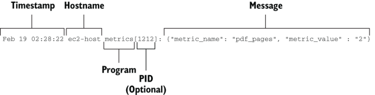

# 运输阶段：统一不同的遥测格式

本章涵盖

- 运送本地发射的遥测数据
- 与具有灵活和不灵活格式的发射阶段交互
- 选择运输遥测格式

本章是运输阶段的第二章。第 3 章介绍了遥测数据的移动和存储准备，而本章则介绍了运输阶段遥测数据的格式（和格式转换）。运输阶段发生了很多事情，这就是为什么这个阶段需要我用几章来描述：

- 遥测技术四处移动（第 3 章）。在较大的系统中，移动遥测可能非常复杂，涉及由不同团队拥有和控制的遥测系统（多租户；第 7 章）。
- 运输阶段需要处理发射阶段可以处理的任何格式，并且在不同的环境（硬件和软件）中，处理多种格式（第 4.1 节）。
- 运输阶段不仅需要移动遥测，还需要支持在运输阶段发生的任何标记和丰富（第 6 章）以及这些组件所需的格式（第 4.2 节）。

许多遥测新手的一个常见误解是，运输阶段是所有标记和丰富发生的地方。尽管运输阶段确实执行了相当多的任务，但标记可以在发出和运输阶段发生，并且丰富可以在运输和演示阶段发生。标记和丰富的端到端性质是该主题拥有自己的章节（第 6 章）的原因。

本章重点讨论两个主题：

- 从发送阶段（例如本地日志文件和系统记录器）接收遥测数据，并将它们沿着管道移动（第 4.1 节）。
- 确定你的运输阶段系统支持的遥测数据格式。这个过程既是技术性的，也是政治性的；将会有会议，因此请注意（第 4.2 节）。

为了帮助理解这些概念，我使用了第 2 章和第 3 章中相同的示例组织：

- 一家 100 人的初创公司，构建一个 API 驱动的应用程序，在 AWS 中运行，其技术组织完全由软件驱动。
- 一家成立于 1848 年的全球物流公司，在 20 世纪 60 年代末实现了业务流程计算机化。此示例演示了物理数据中心中的运输阶段，其中发送格式是可变的，并且在某些情况下不灵活。此外，这个例子是非技术（政治）讨论的重点；大公司有大的人才问题。
- 一家拥有 200 名员工的公司，提供面对面的继续教育课程，招聘季节性很强。该公司使用软件而不是生产软件。

## 4.1 发送本地发射的遥测数据

2.1 节描述了本地发射遥测数据的几种方法：

- 发送到日志文件（第 2.1.1 节）
- 发送到系统记录器（第 2.1.2 节）
- 发送到标准输出（第 2.1.3 节）

本节是关于将本地存储的遥测数据转移到更广泛的运输阶段管道中。第 3 章主要是关于移动遥测数据，从直接发送到存储（第 3.1.1 节），到发送到队列和流（第 3.1.2 节），再到直接发送到 SaaS 提供商（第 3.1.3 节）。我们将使用第 3 章中的技术来移动我们在本地获取的遥测数据：

- 第 4.1.1 节描述了将遥测数据从日志文件传送到流中。
- 第 4.1.2 节描述了将遥测数据从基于 Windows 的系统记录器传送到 SaaS 提供商。
- 第 4.1.3 节描述了将遥测数据发送到标准输出，然后直接发送到基于 Elasticsearch 的存储中。

### 4.1.1 从日志文件传送遥测数据

第 2.1.1 节描述了将遥测数据发送到日志文件。本节介绍从本地存储的日志文件中获取遥测数据并将其放入基于 Kafka 的流中（第 3.1.2 节）。为了帮助解释这些概念，我们将回顾 20 世纪 60 年代实现计算机化的全球物流公司。它的遥测系统很成熟，但即使是老公司也会偶尔尝试新事物。

网络运营团队最终更新了管理公司广泛的思科安装基础的基础设施，并希望将 Cisco Prime（用于管理思科安装的思科框架）生成的日志数据发送到集中日志记录。该公司自 20 世纪 90 年代末以来一直在编写 Java 软件，因此软件工程团队在集中式日志记录方面拥有长期的经验。此外，作为一家大公司意味着集中式日志记录系统已经设置为多租户，因此添加来自网络运营团队的遥测反馈对于系统来说并不难处理。问题是将基于日志文件的数据输入系统。图 4.1 显示了规划的架构。


图 4.1 网络运营团队计划的运输阶段组成部分。这些组件是填充的盒子。此运输阶段管道将事件插入到 noc_events 主题的流中。遥测数据从思科硬件（在本例中为生产系统）流出，并流入专有的 Cisco Prime 框架。然后 Cisco Prime 会生成各种日志文件。 Filebeat 将遥测数据从日志文件传送到流中。使用诸如此类的代理将基于文件和系统记录器的遥测技术转移到更高级的系统是很常见的。

我们物流公司的网络运营团队打算使用 Elastic.co 开发的 Filebeat 程序将遥测数据从日志文件转移到基于 Apache Kafka 的流中。 Filebeat 使用 YAML 作为配置格式。简单格式有两个部分：

```
filebeat.inputs:
output.kafka:
```

输入部分是你定义 Filebeat 应关注哪些文件的地方。输出部分定义 Filebeat 发送其处理的遥测数据的位置。

注意清单 4.1 并不打算被执行，但如果你想执行它，你将需要一个 Kafka 集群来与之通信。

清单 4.1 noc_beats.yml：网络操作托运人的 Filebeat 配置

```yaml
filebeat.inputs:                               ❶
- type: log                                    ❷
  paths:
    - /opt/CSCOlumos/logs/**                   ❸
  fields:
    environment: "production"                  ❹
    data_center: "EUC1"                        ❹
output.kafka:                                  ❺
  hosts: ["k7-euc1-1:9092", "k7-euc1-2:9092",
  "k7-euc1-3:9092"]                            ❻
  topic: "noc_events"                          ❻
  username: "nocevents_euc1"                   ❼
  password: *****                              ❼
  client_id: "cisco_prime"                     ❽
```

❶ 输入块定义 Filebeat 跟踪的内容。

❷ 为日志文件键入set to log。

❸ 要观看的路径数组，带有通配符

❹ 添加到所有事件的上下文相关字段

❺ 输出块定义遥测数据的发送位置（Kafka）。

❻ 定义要连接的 Kafka 主机数组和主题

❼ 定义 Kafka 的身份验证

❽ 定义唯一的客户端标识符

noc_beats.yml 中的 Filebeat 配置将使 Filebeat 监视 /opt/CSCOlumos/logs 中的所有文件，并将所有日志行发送到名为 noc_events 的 Kafka 主题。图 4.2 提供了有关配置每个部分的作用的更多上下文。


图 4.2 Cisco Prime 服务器上 Filebeats 的配置文件。此配置从 Cisco Prime 日志记录位置的所有日志文件中提取遥测数据，并将其发送到 Kafka 集群，将遥测数据注入 nocevents_euc1 主题。由软件工程团队运营的集中式日志记录平台最终将使用 nocevents_euc1 主题并将此遥测数据存储在集中式日志记录数据库中。

此处显示的模式（使用第三方托运商将遥测数据从日志文件移至更有用的位置）是一种常见模式。我在这个例子中使用 Filebeat 因为它是一个 Go 二进制文件，所以它很小并且相对跨平台，并且它完成了我需要它做的两件事。以下是几个包的列表，它们满足将基于文件的数据移动到其他地方的需要：

- Filebeat——Elastic.co 生成的这个基于 Go 的二进制文件旨在从日志文件、容器和其他一些来源中提取日志数据。它还可以直接将数据发送到队列、流和 Elasticsearch（毫不奇怪）。
- Fluentd/Fluentbit - 完全开源的产品和云原生计算基金会的成员，这些基于 Ruby (Fluentd) 和基于 C (Fluentbit) 的多用途日志传送程序可以从许多框架中提取数据并传送到队列、流和各种日志中。数据库。
- Logstash——Elastic.co 的另一款产品，这个基于 JVM 的框架是一个功能齐全的遥测传输系统。它可以从文件中读取，但在发送数据的位置方面的能力要强得多。你可以使用 Logstash 构建整个 Shipping 阶段，这使得简单地将文件发送到队列或流就显得有些过分了。
- Splunk Forwarder — 此 Splunk 产品以预编译的二进制文件形式提供，是遥测进入基于 Splunk 的遥测生态系统的入口点。它可以运送到 Splunk Cloud 产品以及本地托管的 Splunk 服务器中。 Splunk 作为现成的（现在基于 SaaS）集中式日志记录、指标和 SIEM 提供商而闻名。
- Telegraf——一款 InfluxData 产品，这个基于 Go 的多用途日志和指标传送器可以将日志发送到 Syslog 和 Kafka 流。它可以与 InfluxDB 时间序列数据库进行本机对话以获取指标，但对于基于文本的日志，它更适合作为遥测移动器。

> Filebeat 和它的朋友
>
> Filebeat 是 Elastic.co 提供的几个开源代理之一，用于将数据移动到其 Elasticsearch 数据库中。 Filebeat 被定制为从文件中移动字符串。但还有其他几个专门的代理：
>
> - Metricbeat — 以类似于collectd、telegraf 和 nagios 代理收集和发送指标的方式拉取系统级指标
> - Auditbeat — 提取与安全相关的信息，例如 Linux 系统上的audit.log
> - Winlogbeat — 提取 Windows 事件日志数据（包括安全日志）并将其发送
> - Journalbeat——从journald（Linux Systemd实用程序的一部分）中提取遥测数据并将其发送
> - Packetbeat — 监控和传送网络流量遥测
>
> 还有其他代理可供选择，而且每年都会有更多代理出现。 Elastic.co 通过销售企业计划赚钱，因此，如果这些开源托运商开箱即用地满足你的需求（无需企业计划），它们就可以很好地独立运行。对于许多遥测产品供应商来说，难题（也称为可以赚钱解决的问题）是分析遥测（Elasticsearch 和 Kibana for Elastic.co 的组合）而不是交付它（Filebeat 和朋友），因此这些产品亏损领导者的真正创收产品。

在许多方面，日志文件是设计用于在服务器上运行的现成生产系统的默认传送方法。容器和 FaaS 平台更喜欢标准输出（参见第 4.1.3 节）。培养处理日志文件的技能将为你的成功奠定基础。在这一领域中，从系统中获取遥测数据的问题在很大程度上已经得到解决，因此你不需要编写太多代码。使用代理来处理这部分要快得多。

### 4.1.2 从系统记录器发送遥测数据

第 2.1.2 节描述了向系统记录器发送遥测数据；本节介绍将遥测数据从系统记录器中提取到 SaaS 系统（第 3.1.3 节）。为了说明这个过程，我们将回到我们的继续教育公司，如果有帮助的话，该公司不会生产软件。图 3.12（此处转载为图 4.3）说明了该公司当前的软件遥测方法。


图 4.3 我们继续教育公司的运输阶段。它在生产和运输阶段系统上完全依赖云和 SaaS 供应商是有意为之的；并不是每个人都运行服务器，或者都想这样做。

公司有问题。其总部所在的美国州发布了针对教育公司的新要求，因此该公司需要审核更多有关教育笔记本电脑的活动。到目前为止，该公司对教育者笔记本电脑采取了一种善意的忽视方法，让老师做他们需要做的事情，同时强制提供最低限度的安全服务，例如防病毒和端点保护。它根本没有像大型知识产权公司那样进行端到端的员工监控，因此解决这一法规需要新的流程。

这家公司使用 Windows 笔记本电脑，因为它已经营业了二十年，并且一直使用 Windows 笔记本电脑。由于并非所有教师都在一个设施中教学，而是在其注册的所有州进行教学，因此公司不能依赖将每台笔记本电脑添加到 Active Directory 域并配置事件转发；笔记本电脑根本不经常出现在企业网络上。

计划的方法是在每台旅行笔记本电脑上安装 SumoLogic 收集器，并将该收集器配置为将事件发送到公司的 SumoLogic 帐户。图 4.4 描述了预期的架构。


图4.4 我们继续教育公司打算建立的遥测采集设计。该州要求集中捕获 Windows 事件日志中的某些事件，因此该公司在每台笔记本电脑上安装了 SumoLogic 收集器，并将该收集器配置为将事件发送到现有的 SumoLogic 云。此设置不需要通过虚拟专用网络 (VPN) 连接到企业网络，因此非常适合高度移动的教学组织。

首先，我们的继续教育公司需要在各处安装收集器，这是一个两步过程：

1. 安装软件。
2. 配置。

安装过程是一个命令行命令：

```
SumoCollector.exe -console -q "-Vsumo.accessid=[redacted]" \
  -"Vsumo.accesskey=[redacted]" \
  -"Vsources=C:\\HQ_Data\\sumo_sources.json"
```

该命令会触发以下行为：

1. 将所有输出发送到控制台 ( `-console` )
2. 以安静模式安装 ( `-q` )
3. 配置 SumoLogic 云所需的登录凭据（ `sumo .accessid` 和 `sumo.accesskey` ）
4. 将安装程序指向一个配置文件，该文件定义该收集器将发送到 SumoLogic 云中的遥测数据 ( `C:\HQ_Data\sumo_sources.json` )

该文件的内容如清单 4.2 所示。

清单 4.2 sumo_sources.json：定义 Windows 遥测收集

```json
{
  "api.version": "v1",                         ❶
  "sources": [
    {     
      "sourceType": "LocalWindowsEventLog",    ❷
      "name": "TeacherLaptop",                 ❸
      "renderMessages": true,                  ❹
      "logNames": [                            ❺
        "Security",                            ❺
        "ApplicationBestClassroom"             ❺
      ]                                        ❺
    }
  ]
}
```

❶ 设置SumoLogic API版本

❷ 定义源类型，收集本地Windows事件

❸ 该来源的名称（每个收集器都是唯一的）

❹ 设置为 true 时，从 Windows 事件收集所有元数据

❺ 定义要收集的事件日志，包括特殊的应用程序

通过此配置，我们的继续教育公司将两个系统日志的内容发送到 SumoLogic 云：

- 内置安全日志，其中包括为教师笔记本电脑配置的所有安全事件。此事件流包括登录、注销、安全策略更改以及许多其他详细信息。根据公司推行的安全策略，这种事件流可能会很大。
- 一个特殊的应用程序日志称为ApplicationBestClassroom，它是由现成的课堂软件直接生成的事件日志。该事件日志是由软件而不是系统使用 Windows 事件日志功能生成的。

如果我们稍微调整图 4.4，我们可以看到该公司感兴趣的两种类型的事件流（图 4.5）。


图 4.5 为我们的继续教育公司配置的遥测收集。在这里我们看到 SumoLogic 收集器提取 Security 和 ApplicationBestClassroom 事件日志数据并将其注入 SumoLogic 云中。

对于处理大量移动性较高的计算机的公司来说，使用已安装的本地代理向 SaaS 提供商发送数据非常有意义。尽管此案例显示在桌面系统上收集遥测数据，但它也适用于 Windows 服务器。在 Active Directory 域内，你有更多选择，因为可以进行远程事件日志收集（与我们此处的示例不同），这减少了组织中需要运行的收集器的数量。

### 4.1.3 从标准输出发送遥测数据

第 2.1.3 节描述了将遥测数据发送到标准输出（stdout）、控制台或打印语句的默认输出，相信启动我们的生产软件的任何程序都会监听该输出。本节介绍处理此类输出并将其直接发送到存储（第 3.1.1 节）。为了帮助完成这个过程，我们将回到 100 人的初创公司。

在第 3.1 节中，我们研究了这家初创公司的架构，该架构在公共云提供商中运行 Kubernetes 集群，并看到该公司重写了其发射函数以将遥测数据直接发送到 Elasticsearch。在 3.2 节中，我们重写了发送到队列或流的函数，以允许下游进程批量写入 Elasticsearch。现在我们将研究减少 Elasticsearch 集群上写入负载的第三种方法：让 Kubernetes 集群机器处理写入。图 4.6 描述了预期的架构。


图 4.6 从 Kubernetes 和 Containerd 中为我们 100 人的初创公司获取遥测数据。 Containerd 容器（不是容器内的软件）配置为将 stdout 发送到 Kubernetes 主机的日志。从那里，Journalbeat 将遥测数据发送到 Elasticsearch。由于 Journalbeat 批量写入，因此与容器限制的软件直接写入相比，Elasticsearch 集群面临着减少的写入事务。

我们的 100 人初创公司运行基于 Linux 的 Kubernetes 集群。因此，Kubernetes 自动将 stdout 从 Containerd 发送到名为 Journald 的 systemd 系统中。 （如果你在 Kubernetes 之外运行 Docker，则 Docker 配置中的 `--log-driver=journald` 会执行相同的操作。）为了将遥测数据从 Kubernetes 主机上的日志获取到 Elasticsearch，该公司从 Elastic 安装并配置 Journalbeat .co. （有关其他 Beats 的列表，请参阅第 4.1.1 节的末尾。）默认情况下，Journalbeat 会拉取整个系统的日志并将其发送，但需要告诉 Journalbeat 将日志放在哪里；我们想将其发送到 Elasticsearch。清单 4.3 显示了配置文件。与之前的 Filebeat 一样，我们看到一个输入部分和一个输出部分。

注意此列表并不是为了执行，但如果你想运行它，你需要在 Linux 系统上运行它，并且有一个 Elasticsearch 集群可以与之通信。

清单 4.3 kate_beat.yml：将日志遥测数据发送到 Elasticsearch

```yaml
journalbeat.inputs:
  - paths: []                                     ❶
output.elasticsearch:
  hosts: [ "http://log-es.prod.internal:9200" ]   ❷
  index: "kates-%{+yyyy.MM.dd}"                   ❸
```

❶ 从默认日志位置获取

❷ 指定要连接的Elasticsearch服务器

❸ 指定将数据发送到哪个Elasticsearch索引

索引名称的编码很特殊。 `kates-%{+yyyy.MM.dd}` 在索引名称后附加一个日期戳，例如 `kates-2023.02.19` 表示 2023 年 2 月 19 日。此代码将每天自动创建一个索引。通过这种方式每天创建一个索引，我们公司可以非常轻松地设置保留策略。要在线保留 90 天的索引，请每天删除一次早于该时间的索引。

第 3.1.2 节询问如果公司拥有 100 个 Kubernetes 集群而不是一个，会发生什么。虽然我们在第 3.2 节中编写的代码将生产代码发送遥测数据到单个队列或流，但 Journalbeat 可以配置为将遥测数据发送到基于 Redis 的队列或基于 Kafka 的流。我们在第 4.1.1 节中看到了 Kafka 输出示例作为代码的一部分：

```yaml
output.kafka:
  hosts: [ "k7-euc1-1:9092", "k7-euc1-2:9092", "k7-euc1-3:9092"]
  topic: "noc_events"
  username: "nocevents_euc1"
  password: *****
  client_id: "cisco_prime"
```

相同的设置也适用于 Journalbeat。输出到 Redis 更简单，因为 Redis 是一个更简单的系统：

```yaml
output.redis:
  hosts: [ "prod-logs.prod.internal:6379" ]
  key: "kates"
```

指定要发送遥测数据的主机名以及要写入所有内容的密钥。服务此队列的系统将从 `kates` 键中弹出事件以进行进一步处理。

> 练习4.1
>
> 对于现成的软件（下载并安装），你必须处理的最常见的遥测发射格式是什么？
>
> 1. 日志文件
> 2. 系统记录器，例如 Syslog 或 Windows Events
> 3. 标准输出

## 4.2 统一不同的发射格式

本节涵盖选择遥测格式的技术和政治挑战。发射级系统的多样性意味着不存在标准的发射格式。大多数发射阶段系统都是用字符串来实现的，但与人类语言一样，这些字符串的格式与编写字符串的人一样可变。最终，遥测数据需要存储在某个地方，并且该位置还对遥测数据的格式有自己的看法。在遥测管道中，运输阶段通常负责统一遥测数据的存储格式，尤其是在涉及硬件和 SaaS 系统的管道中具有不灵活的发射格式。

由于大多数遥测系统使用字符串来传递数据，因此有多种方法可以将复杂的数据结构编码为字符串。对于具有一两个发射器并且只有一个存储遥测数据的系统的简单遥测系统，你不需要太关注这一问题。对于具有多种发射器（硬件、多种软件、来自 SaaS 系统的源等）的复杂遥测系统，统一格式的问题是真实存在的。以下部分帮助我们解决这些问题：

- 第 4.2.1 节研究了将遥测数据编码为字符串以供运输的多种方法。
- 第 4.2.2 节介绍了为具有不同需求的遥测系统选择传输格式的过程。
- 第 4.2.3 节是将 Syslog 中发出的遥测数据转换为更适合在运输阶段使用的对象编码格式的示例。
- 第 4.2.4 节提供了选择运输格式的指南，着眼于减少数据库基数，以保持低成本和高搜索性能。

### 4.2.1 将遥测数据编码为字符串

我们已经完成了几个将遥测数据编码为字符串以供运输的示例，但本节介绍了可供你使用的各种广泛使用的字符串格式。这些格式不是普通语言格式，而是以易于转换回结构化数据（反序列化）的方式对结构化数据进行编码（序列化）的方法。我们需要传输数据结构的能力，因为在发射和运输阶段标记和丰富遥测数据（参见第 6 章）的行为为演示阶段的成功奠定了基础。我们检查两种类型的格式：

- 编码相对简单的结构的分隔格式，这些结构更易于人类阅读，并且序列化和反序列化的速度往往非常快
- 允许对复杂结构进行编码的对象编码格式

#### 编码为分隔格式

本节介绍最常见的分隔格式，其中最著名的是逗号分隔值 (CSV) 列表。分隔格式通过使用字符（或字符串）来标记单独的字段。将它们视为一种对数组或简单的单级哈希进行编码的方法。为这些格式构建解析器相对容易，对于 CSV 这样的常见格式，通用编程语言通常都有内置的解析函数。 （即使是古老的 COBOL 也有读取 CSV 的本机方式。）通用的 Shipping 阶段平台 — Elastic 的 Logstash 和开源 Fluentd，两者都基于 Ruby — 具有可以处理这些格式的解析器，因此你不需要编写一个解析器。以下是要检查的三种分隔格式：

- 逗号或制表符分隔的值列表，其中每个位置都分配有一个字段名称，并且该分配必须预先共享给发射器和解析端。分隔符也可以是其他字符；我也看到过使用分号和竖线字符。
  - ```"2023-02-19T23:04:55.293+0:00",pdf_pages,2 ```
- 键值对，允许灵活的字段映射但采用平面字段结构（无子键）。这种格式允许在不预先了解字段的情况下对简单的一级哈希进行编码。
  - ```time="2023-02-19 23:04:55.293" metric_name="pdf_pages" metric_value=2```
- 位置分隔，分隔值列表的变体，最常用的是方括号。这种格式通常用作其他格式的包装（或容器）格式，期望该字符串将被解析多次。
  - ```[2023-02-19T23:04:55.293+0:00] [pdf_pages=2]```
  - 这里，第一个括号语句是时间戳；第二个括号语句是一个键值对，将在第二遍中通过键值解析器运行。

分隔格式的解析计算成本通常较低，因此适合优化遥测管道中的解析步骤。它们通常具有足够的表现力和足够的人类可读性，使得在虚拟机或 Docker 中进行开发的人类可以查看原始格式，并且它们也可以很容易地被机器解析以在演示阶段系统中显示与生产系统遥测。

但是，如果需要处理复杂的数据结构（例如多级哈希），则分隔格式的表达能力不够。对于分隔格式过于受限的情况，你可以使用三种对象编码格式中的任何一种：

- JSON
- XML
- YAML

> 解析速度令人惊讶
>
> 尽管解析键值流背后的算法比解析 JSON 等对象编码格式所需的算法更简单，但它们不一定更快。为了进行演示，以下是我使用 Logstash 运行的解析速度测试的结果，以测试键值、CSV、JSON 和 XML 解析器的性能。相同的 10 元素散列以每种格式进行编码，然后进行解码。我跟踪了解码器处理 100 万个哈希值所需的时间（以毫秒为单位）：
>
> - JSON—每 10 元素哈希 0.011 毫秒
> - 键值—每 10 元素哈希 0.069 毫秒
> - CSV — 每个 10 元素哈希 0.198 毫秒
> - XML—每个 10 元素哈希 3.700 毫秒

JSON 和 XML 这两个复杂的对象编码解析器的性能为何相差三个数量级？为什么 JSON 会打败其他一切？答案与 Logstash 的编写方式有关。 Logstash 是用 JRuby 编写的，JRuby 是在 Java 之上运行的 Ruby。对于 JSON，Logstash 使用本机 Java JSON 引擎，但对于其他三种格式，使用原始 Ruby 构造。因为 JSON 解析不需要从 Ruby 重新编译为 Java 再编译回 Ruby，而是一直停留在 Java 中，因此解析过程更加高效。鉴于这一事实，易于解析的键值集在原始 Ruby 解析器中表现最佳是有道理的。

当你为 Shipping 阶段构建解析阶段时，值得花时间测试各种格式的解析速度。你的假设可能是错误的；我的当然是。

#### 编码为 JSON

JSON（JavaScript 对象表示法）始于 JavaScript 生态系统，并已被许多其他系统所接受。 JSON 提供了对字符串和数字类型的简单编码，以及散列和数组中复杂的子键结构。 NodeJS 是一种 JavaScript 语言，所有数据结构都采用 JSON 格式。大多数新的基于 Web 的 API 使用 JSON 作为交易格式。 Logstash 是 Elastic 构建的 Shipping-stage 引擎，它使用 JSON 对象作为其内部排队系统的一部分。

当你的遥测系统需要传递高度丰富的遥测数据时，对复杂数据结构进行编码的能力使 JSON 变得非常有价值。回到我们的指标示例，下面是指标的 JSON 编码版本，它在同一遥测中传递两个单独的指标值，而不是单个值：

```json
{
    "metrics" : [ 
        { "metric_name" : "pdf_pages", "metric_value" : 2 },
        { "metric_name" : "file_size", "metric_value" : 292.5 }
    ]
}
```

此示例在一次发射中对两个单独的指标 `pdf_page` 和 `file_size` 进行编码。这种格式在选项卡或 CSV 列表中将具有挑战性，对于需要每行多个指标的键值系统来说更容易，并且依赖于第二个解析器来实现位置分隔方法。

#### 编码为 XML

XML（可扩展标记语言）提供了一种用于移动数据的复杂格式。在 JSON 抢尽风头之前，XML 是 API 首选的数据交换格式。由于这段历史，许多（通常是较旧的）系统仍然优先生成 XML。与 JSON 不同，XML 并不是为了编码数据结构而显式构建的，而是作为一种对任何类型的数据进行编码的多用途方式。

出于遥测目的，XML 缺乏对呈现数据结构的关注，这使得它比 JSON 更强大且更难使用。这种额外的能力还使得 XML 易于对数据结构如何定义进行特定于解析器的假设。你可以对与使用 JSON 所做的同一对指标进行编码：

```xml
<MetricsEmission>
  <DateTime>2023-02-19T23:04:55.293+0:00</DateTime>
  <MetricsItems>
    <MetricItem>
      <MetricName>pdf_pages</MetricName>
      <MetricValue>2</MetricValue>
    </MetricItem>
    <MetricItem>
      <MetricName>file_size</MetricName>
      <MetricValue>292.5</MetricValue>
    </MetricItem>
  </MetricsItems>
</MetricsEmission>
```

此示例将 `pdf_pages` 和 `file_size` 指标编码为 JSON 示例。两个 `<MetricItem>` 条目形成一个哈希数组。 `<MetricsEmission>` 形成一个散列。与 JSON 不同，XML 对于每个组件的命名更加直观。

#### 编码成 YAML

YAML（另一种标记语言）是这三种格式中最新的一种。 （在科技行业，一个事物的三分之一经常会加上另一个事物的前缀；传统！）YAML 允许对比 JSON 更复杂的结构进行编码，并且具有传递字符串的机制，而无需 JSON 样式的转义，这使得如果你的数据包含大量特殊字符、双引号或斜杠，则为更安全的格式。 YAML 具有 XML 的一些能力，不仅可以呈现数据结构，还可以呈现复杂数据。 YAML 最常被视为一种配置语言和数据事务语言。

尽管它对于遥测没有用处，但 YAML 允许将注释放入其结构中，这就是为什么你会看到它大量用作配置语言。 YAML 支持 JSON 之外的数据类型的能力使其比 JSON 更具表现力。再一次，让我们看看我们用 JSON 和 XML 编码的一对指标的 YAML 版本：

```yaml
---
metric_emission:
  time: "2023-02-19T23:04:55.293+0:00"
  metrics:
    - metric_name: "pdf_pages"
      metric_value: 2
    - metric_name: "file_size"
      metric_value: 292.5
```

这种格式感觉比 JSON 更紧凑，而且肯定比 XML 更短。 `pdf_pages` 的值被检测为整数，因为该值中没有小数，而 `file_size` 的值被检测为浮点数，因为它包含小数。要将 `pdf_pages` 的值显式转换为浮点数，只需将 `.0` 添加到数字或在数字前添加 `!!float` ，如 `metric_value:` `!!float` `2` 。 YAML 代表了 XML 的表现力和 JSON 的严格简单性之间的中间立场。

所有三种对象编码格式都允许对复杂的数据结构进行编码，而无需在单行上换行或不需要的空格，这种格式称为“缩小”。这种缩小的行通常不是人类可读的，所以我不打算在这里呈现一个例子，但当人们不希望人类以视觉方式解析它们时，它们确实节省了大量的空间。不管是否缩小，对象编码格式在算法上比分隔字符串更复杂，如果你的运输管道每秒处理数千或数十万个排放，这一事实可能非常重要。

也就是说，使用现代网络上像 JSON 这样普遍存在的格式意味着 JSON 解析器自 2010 年以来已经进行了大量优化。在 JSON 或其他对象编码格式之间做出决定时，一定要测试你的管道以验证性能是否合适正如你所期望的。分隔格式在视觉上易于解析、易于创建且易于编写，但这种易用性并不能保证性能优势。

> protobuf的问题
>
> 协议缓冲区（protobuf）是一个起源于 Google 的概念。该公司想要一种比 XML 更快的序列化/反序列化数据的方法，因此按照经典的 Google 风格，它发明了自己的方法。与 JSON、XML 和 YAML 都序列化为字符串不同，protobuf 在序列化时不是基于字符串的； protobuf 是基于二进制的。
>
> 作为一种二进制格式确实使 protobuf 的序列化/反序列化操作非常快。但这确实意味着无论你使用什么技术来传递 protobuf，也都需要支持二进制文件。
>
> Protobuf 类似于逗号/制表符分隔的值列表，因为在通信开始之前需要预先共享消息的架构。这种共享加快了 protobuf 的速度，但也使它们与 JSON、XML 和 YAML 不同，后者无法对任意数据结构进行编码。如果你的遥测管道创建任意数据结构，protobuf 将很难适合你。但是，如果你可以使用二进制格式并使用静态模式，那么 protobuf 是处理数据的最有效方法之一（只要你可以传输该格式）。
>
> Protobuf 在遥测管道中非常出色，但需要在双方定义对象格式，这使得该格式有些不灵活——对于指标和跟踪来说非常有用，但对于集中式日志记录来说就不太好了。尽管使用 protobuf 很痛苦，但预计在未来的遥测系统中会看到更多的 protobuf。

### 4.2.2 选择运输格式

本节介绍选择遥测运输格式的过程。你必须支持的运输格式越少，总体上维护你的运输阶段系统就越容易，因此值得你花时间尝试将遥测格式集中到几种。为了帮助完成这一过程，我们将检查本章介绍和第 4.1.1 节中提到的全球物流公司的复杂遥测运输阶段。正如引言中所警告的那样，这个过程既是技术性的，也是政治性的。

关于选择运输格式，首先要了解的是，你可以使用多种运输格式。将遥测数据存储起来比以一种真实格式传送遥测数据更重要。如果将遥测数据传输到存储中需要混合使用 JSON 和键值，那就这样吧。你对格式的选择不仅与你的技术组织的政策有关，还与你的生产系统的能力有关。你需要兼顾两者。

运输阶段，尤其是在大型技术组织中，迫使遥测系统操作员与技术组织中的许多团队进行交互。图 4.7 显示了我们在几章中使用的全球物流公司的大型组织类型。


图 4.7 我们全球物流公司感兴趣的四个团队正在为其遥测系统选择运输格式。我们看到Java软件运行在实际的数据中心中，而Go软件运行在公共云中。弥合这一分歧是谈判过程的关键部分。

在这个例子中，我们看到四个团队：两个类似运营的团队和两个构建在完全不同平台上的软件工程团队。这种分离是高级技术管理层有意而为之的（我们稍后将讨论其原因），并且团队已经达到了需要统一方法的地步。为了帮助设定场景，图 4.8 说明了这两种架构。


图 4.8 用于 Java-on-data-center 和 Go-on-cloud 环境的现有遥测系统。左边是Java系统；右边是基于 AWS 的 Go 系统，它直接提供指标和分布式跟踪。此外，AWS 日志本身会发送到物理数据中心的 CloudTrail 存储库。全球规模的公司通常拥有几乎完全独立的计算系统，就像这个例子一样。 （有关这种计算方式的更多信息，请参阅第 10.3 节。）

在像本示例这样的遥测运输管道中，我们将物理数据中心组件（VMware 和 Cisco）发送到 Syslog。 Java Spring Boot 应用程序也会发送到 Syslog 中。 Syslog 服务器已配置为传送两种集中式日志记录，并将事件发送到将指标数据存储在第三个数据库中的指标传送器。与此同时，AWS 中正在组建一个不同的团队。 CloudOps 团队将基础设施日志提取到由物理数据中心的运营团队维护的数据库中，而软件工程团队正在 Elastic Kubernetes Services 中构建基于 Go 的应用程序，直接从代码传送到指标和分布式跟踪系统中。他们想要访问的系统如图 4.9 所示，这是一个相当重大的变化！


图 4.9 我们全球物流公司的统一遥测系统，其核心是使用流系统作为统一的数据管道。特定于团队的运输阶段组件订阅流主题来处理每个团队的遥测数据并最终将其存储在数据库中。

在图 4.9 中，我们看到一个包含多个组件的运输管道：

- 流服务充当物理和云生产系统中整个遥测系统的统一事件流。
- 物理数据中心的系统日志服务器充当数据中心中所有内容的集中运输点，将遥测数据发送到流中。
- Go 应用程序中的 Emitter/Shipper 函数直接发送到流中。
- CloudOps 团队维护的专用托运程序将 AWS 事件移至流中。
- 四个专用运输系统消耗来自流的遥测数据，每个系统由不同的团队操作。

该图还显示了五个遥测存储系统：

- 三个日志存储库，一个由运营团队和 CloudOps 团队共享，以及一个供 Java 工程和 Go 工程团队使用的专用日志存储库
- 在 Java 和 Go 工程团队之间共享的指标存储库
- Go 工程团队使用的分布式跟踪存储库

这个复杂的示例演示了在确定支持的运输格式时需要进行的技术和政治权衡。对于此示例，触发需要统一格式的事件是决定实施遥测流服务。为了开始确定受支持或可支持的格式列表的过程，我们首先查看三个方面：

- 每个组件的排放和运输能力
- 现有航运管道
- 哪些团队管理哪些排放和运输组件，以及团队（而非组件）如何进行交互

利用我们在这里收集的信息，我们进入下一阶段：谈判。最后一个阶段是在单一格式与易于集成之间进行权衡的阶段。

> 全球公司的分裂本质
>
> 真正的全球化公司通常是一群穿着风衣的小公司，各个小公司在某种程度上甚至完全独立地运营。一个业务部门可能会全力投入公有云和无服务器架构，而另一个部门的大型机故事已经有 60 年的历史，并且没有停止的计划。作为一家公司的一部分并不能保证该公司内部各处都有共同的技术基础！该领域的全球物流公司也不例外，但它正在努力变得更好。你将在第 2 部分中看到另外几个类似的案例。

#### 确定现有系统的发射能力以提供基线

本节涵盖识别遥测运输格式的第一个领域：识别每个生产系统的排放能力。我们需要这些信息为我们后期的格式谈判提供技术基础。对于图 4.8 中描述的基础设施，我们可以看到几个主要的发射组件：

- Cisco 和 VMware 系统，仅在 Syslog 中发出
- Java Spring Boot 软件，可以在任何内容中发出，但目前在 Syslog 中发出
- AWS CloudTrail 基础设施日志，以 JSON 文件形式发出
- Go 软件，可以发出任何东西

尽管 Java Spring Boot 可以发出任何内容，但在这种特定情况下，Java 应用程序本身是在 1999 年首次编写的，并且从那时起就一直通过偶尔的重大重写进行维护。早期的 Java 应用程序被连接到 2000 年左右运营团队使用的相同 Syslog，每次维护和升级工作都确保这种功能将继续下去。这里的 Syslog 历史悠久而深厚；对于使用它的团队来说，这是一种易于理解且最重要的舒适格式。

Elastic Kubernetes Services 中运行的 Go 软件是全新的，推出还不到一年。在 AWS 中部署的决定是由高级工程管理人员做出的，作为该公司的一个实验——一个看起来很有前途的实验。该公司正在寻求将这些新软件和部署平台集成到现有的遥测系统中。我们面临三个主要限制：

- 需要 Syslog 且不支持其他任何功能的硬件
- Spring Boot 应用程序中的深度 Syslog 集成
- AWS CloudTrail 服务发出的 JSON

Go 应用程序在此阶段不会提供约束！接下来，我们看看现有的运输管道。

#### 检查运输阶段的能力以缩小变更范围

本节涵盖识别遥测传输格式的第二个领域：确定采用哪种遥测处理。这些信息将告诉我们需要花费多少精力来进行更新，具体取决于谈判阶段同意的更改。该公司最成熟的运输管道位于 Java 环境的物理数据中心。正如有关识别发射功能的部分中所讨论的，由于二十年的历史和固执己见的硬件的存在，该管道是强烈基于 Syslog 的。所有硬件和软件系统都会发送到 Syslog。然后Syslog服务器发送到三个独立的存储系统，如图4.10所示：

- 运营团队的集中日志存储库
- Spring Boot 软件的集中日志存储库
- Spring Boot 软件使用的指标存储库


图 4.10 基于数据中心的 Java 团队使用的现有基于 Syslog 的遥测管道。所有内容都会发送到系统日志中。 Syslog 服务器传送到两个独立的日志数据库（一个用于操作，一个用于 Java 应用程序），以及由 Java 团队构建的指标传送器，该传送器将遥测数据发送到指标数据库中。此示例展示了运营团队和 Java 团队之间的紧密集成。

AWS 环境中的管道还没有那么详细，因为它尚未发布到生产环境中，但它确实有一些运输元素，如图 4.11 所示：

- 充满由 CloudTrail 发出的 JSON 文件的 S3 存储桶，该存储桶被拉入物理数据中心
- Go 软件使用的指标存储库
- Go 软件使用的分布式跟踪存储库
- 通过 AWS EKS 控制台查看 Go 日志（因为 Go 工程团队正在尝试尽可能使用跟踪日志进行集中日志记录）


图 4.11 基于 AWS 的工程团队的合并前遥测管道。基于 Go 的软件直接发送到两个遥测系统。与此同时，CloudOps 团队将 AWS 遥测数据发送到物理数据中心的数据库中。 CloudOps 和 Go 工程团队之间的集成不如 Java/数据中心环境那么强大。

通过分析，我们可以看出，对 Java Spring Boot 遥测管道的任何更改都会涉及很多惯性。 Java 管道已经存在了二十多年，并且多年来一直针对特定用例进行定制。合并后的 Syslog 平台支持大部分业务，因此进行更改存在一定风险，但该过程是我们下一步分析的一部分。

#### 确定团队沟通链接，为政治谈判提供范围

本节涵盖确定遥测传输格式的第三个领域：确定哪些团队将参与遥测管道以及团队如何沟通。这些信息告诉我们哪些遥测传递会很容易（因为它复制现有的通信链接），哪些遥测传递会很困难（因为它需要建立新的通信链接）。查看图 4.8，我们可以识别参与此遥测讨论的四个团队：

- 编写 Java Spring Boot 软件的软件工程团队
- 编写 Go 软件的软件工程团队
- 支持 Spring Boot 软件底层的物理数据中心硬件的运营团队
- CloudOps 团队支持 Go 软件底层的 AWS 基础设施

当我们深入了解组织时，我们会学到更多东西：

- Spring Boot软件团队在两大洲开发软件，并将其软件部署在三大洲的三个数据中心。
- 运营团队遍布三大洲，为部署 Java Spring Boot 软件的数据中心提供支持。
- Go 软件团队由 30 名工程师组成，他们在德国汉堡的办公室工作。
- CloudOps 团队位于 Go 团队的对面，三名远程团队成员在新加坡办公室工作。

对于团队沟通的讨论很重要，Go 团队的一半成员由前 Java 工程师组成，他们被抽调来参与这个新项目。 Go 团队的另一半由专门为该团队聘请的工程师组成，之前没有在该公司工作的经验。不受公司历史影响的观点的注入已经引发了关于最佳实践和重构/重写的下一个目标的激烈对话（辩论）。

两个团队开发的软件支持全球物流公司的业务。这些团队编写销售支持软件，以允许不同国家的托运人和收货人处理舱单和文书工作。他们编写库存跟踪软件来跟踪运输途中、海关等待或等待转运的所有物品。他们编写软件来预测未来需求，以便公司可以改进运营商资产的路线以满足这些需求。

Java 软件驱动了大多数开发案例，这赋予了 Java Spring Boot 软件工程团队在管理会议中很大的政治影响力。与此同时，Go 工程团队看到了一片绿地，可以从根本上更新该公司的软件实践。每个人都同意拥有单一遥测管道可以实现许多业务决策，但对于如何最好地实现这一点存在强烈分歧。进入谈判。

#### 协商标准格式以制定变革计划

本节讨论将前三节中的元素结合在一起来决定官方遥测格式。因为我们需要做出决定，所以是时候开始谈判过程了。技术要求只是做出此决定的一部分；业务部门和团队之间的谈判是标准文档的批准方式。这个过程正是康威定律 (http://www.melconway.com/Home/Conways_Law.html) 发挥作用的地方：

> 任何设计系统（广义定义）的组织都会产生其结构是组织通信结构的副本的设计。

寻求连接组织不同部分的遥测系统可能会反映组织的通信结构。拥有两个互不沟通的团队的技术组织不太可能共享遥测系统。相反，寻求为不进行通信的团队创建遥测系统的人也必须创建这些团队间通信链接作为流程的一部分。在获得新的沟通链接时，你还需要协商团队之间的关系。

当你进行这样的谈判时，可能涉及与同事发送几封电子邮件，或者在产品组之间进行数月长达一小时的会议，请记住以下几个关键点：

- 目标是让人们使用新的遥测系统。错误的使用通常比不使用要好。错误的可以稍后改正。
- 简单是相对于观察者而言的。对你来说简单的事情对另一个团队来说可能会相当复杂，反之亦然。对所有相关人员抱有同理心。
- 对目标和约束的共同理解有助于每个人达成共识。教导、指导，然后引导对话。
- 你可以使用多种遥测运输格式。你希望人们使用这些标准，并且允许多种格式可以降低遥测生产商采用的障碍。

我们的全球物流公司正在寻求在其遥测系统中添加基于流的管道并将基于 AWS 的 Go 系统纳入该管道，但面临着一些问题：

- Java Spring Boot 软件工程团队规模庞大、分布广泛且历史悠久。
- Go 软件工程团队处于真正的绿地，可以尝试新事物，以期刺激创新。
- 尽管 Go 团队的一些成员来自 Java 方面，但许多人没有 Java 方面或公司其他大部分成员的经验；因此，他们对一贯的做事方式没有任何依恋。

我们已经可以看到两个软件工程团队之间可能存在沟通问题。这个问题的部分原因在于 Go 团队周围的故意隔离，从一开始就这样做，以避免团队成员因接触现有流程而产生偏见。问题的另一部分是完全不同的软件开发方法的出现。

与此同时，各方正在努力支持统一的遥测管道。 Go 团队并不是凭空建立的。人们是专门聘请来加入该团队的，因此某处的一位高管已批准预算来尝试这个新想法。使用新的基础设施、AWS 云而不是物理数据中心，也代表了批准的预算和高管的支持。尽管 Java 团队规模庞大且具有很大的政治影响力，但管理层已表现出明确、明显的意图，即探索实现业务目标的新方法。首先，让我们看看图 4.12 中 Java 团队现有的遥测管道：

1. 从代码发送到在同一主机上运行的 Syslog 进程。
2. 主机 Syslog 转发到中央 Syslog，Spring Boot 遥测发射编码在 Syslog 的消息部分中。对于 Cisco 和 VMware，供应商定义的遥测被编码为消息部分。
3. 中央 Syslog 比基于主机的 Syslog 进程复杂得多，它采用 Syslog 编码的遥测数据并将其发送到 Elasticsearch 集群中。
   1. 运营团队使用一个索引，Spring Boot 应用程序开发团队使用第二个索引。
4. 指标传送器实用程序使用指标流并将它们发送到时间序列数据库 (InfluxDB)。


图 4.12 Java Spring Boot 传输管道，显示遥测数据如何转移到存储。该架构展示了 Java 和运营团队之间的广泛协作。

尽管代码的发射很简单，但这个示例包含很多复杂的内容。现在再看一下 Go 工程团队中出现的遥测管道和图 4.11（此处转载为图 4.13）：

- Go 应用程序发出并直接发送到基于 Jaeger 的分布式跟踪存储库；从AWS控制台查看日志。
- Go 应用程序还直接发出并发送到基于 Prometheus 的度量系统，Prometheus（与 Kubernetes 一样）是云原生计算基金会的成员，因此这两个系统可以轻松协同工作。
- 云运营团队编写了一个托运程序，用于将 AWS CloudTrail 日志发送到物理数据中心运营团队运营的 Elasticsearch 实例中。


图 4.13 基于 AWS 的工程团队的合并前遥测管道。集中式日志记录并不集中，软件和运营团队将日志发送到不同的地方。软件团队使用指标和分布式跟踪，直接从 Go 软件发送到存储。

在某些方面，Go 应用程序团队的遥测管道比 Java 团队的更简单，也更复杂。管道更简单，因为管道肯定更短； Go 应用程序直接发送到存储库中。更复杂的是，Go 团队正在使用一种新的遥测技术，即分布式跟踪。

为了统一这两个系统并使其遥测处理整体现代化，Java 和 Go 团队开始进行谈判。在架构分析过程中，Java 环境的中央 Syslog 服务被认为是未来架构中的关键角色，因为它已经集中了 Java 和硬件驱动环境的排放。此外，尽管两个团队为了同一目标使用不同的平台（InfluxDB 和 Prometheus），但他们都采用了类似的指标方法。

鉴于管理层对现代化的渴望，两个团队都会审视其整体遥测处理架构，并考虑如何处理不同的操作模式。他们选择了基于流的系统，如第 3.1.2 节（和第 4.1.1 节）中所述，作为处理这些不同用例的有效方法。该提案需要进行一些更改：

- Go 应用程序将直接发送到专用于 Go 环境的流上的主题。
- Java 团队将继续向 Syslog 发送数据，并计划慢慢地将 Java 应用程序转移到直接向流上的主题发送数据。
- 运营和 Java Spring Boot 团队的中央 Syslog 服务器将分为两个独立的主题：一个用于 Java 应用程序，另一个用于物理运营团队的使用。
- 云运营团队将创建一个托运人，将 CloudTrail 事件发送到运营团队使用的同一主题中。
- 所有四个团队（Java 工程、Go 工程、运营和云运营）都将创建托运人，使用其主题中的事件并将处理后的事件发送到他们选择的存储中。
- Go 和 Java 团队的托运人都会将指标发送到基于时间序列数据库 InfluxDB 的同一指标系统中，因为 InfluxDB 已经进行了扩展，可以处理 Java 团队更大的负载。 InfluxDB 将与 Prometheus 连接器一起运行以支持 Go 团队。 （抱歉，完全开源的 Prometheus。）
- Go 团队使用的 Jaeger 分布式跟踪工具将保留，但将由 Go 团队的托运人提供，而不是直接从 Go 应用程序提供。

在此过程中，团队对遥测格式进行了很多讨论。由于该架构允许专用主题来支持每个团队的专用托运人，因此 Java 和 Go 架构团队不需要具有相同的格式。两个团队都支持相同的指标系统，因此两个托运人都需要以相同的格式向 InfluxDB 发送遥测数据。

由于用于解析 Syslog 编码消息的广泛现有逻辑，Java 和运营团队使用的遥测格式将继续是该主题的 Syslog 编码字符串。但对未来自定义格式的能力的兴奋促使 Java 团队重写其日志记录功能，以直接发送到主题并尝试对象编码格式（例如 JSON）。

在 Go 团队中，对于运送到流而不是继续直接运送到存储存在一些阻力。但是，当有人指出流架构可以在发生黑客攻击时使遥测系统更具弹性，抱怨就降到了背景水平。流的遥测编码格式由分布式跟踪工具的遥测格式驱动，即 JSON；为简单起见，Go 团队选择将所有遥测数据作为 JSON 传递到流主题上。

实施完成后，物流公司的商业智能部门会注意到新的数据流，并要求获取指标源。也许两个团队都会考虑发布新的指标来减轻 BI 团队的数字处理工作。实现更好的业务决策的目标已经实现。图 4.14 显示了最终的架构和交付格式。


图 4.14 一个大型统一遥测管道，有四个团队参与，使用三种遥测传输格式。使用多种格式使该遥测系统能够支持不同的需求并满足未来的需求。

### 4.2.3 将 Syslog 转换为 JSON 或其他对象编码格式

本节解决了将基于标准的 Syslog 转换为 JSON 或其他对象编码格式的需求。按照互联网时间标准，系统日志是一种古老的格式。 （诞生于 1980 年左右就有这种影响。）但这种稳定性意味着 Syslog 是大多数非 100% 公共云提供商服务的基础设施至少具有一定处理能力的一种格式。就像4.2.2节中的物流公司一样，许多使用硬件的公司需要将Syslog转换成其他东西作为运输管道的一部分。

清单 4.4 演示了 Syslog-ng 的最小配置文件，使用了第 4.2.1 节中物流公司用于将其 Syslog 服务器连接到基于 Apache Kafka 的流的方法。

清单 4.4 用于 JSON 到 Kafka 的 Syslog-ng 托运程序

```java
@module mod-java                             ❶
@include scl.conf                            ❶
 
source s_syslog {
  syslog(                                    ❷
    ip(fdb5:48de:c615:15::192)               ❷
    transport(tls)                           ❷
    tls(                                     ❷
      peer-verify(require-trusted)           ❷
      ca-dir('/etc/pki/home-ca/')            ❷
      key-file('/etc/pki/syslog.key')        ❷
      cert-file('/etc/pki/syslog.pem')       ❷
    )
  );
};
 
destination d_kafka {
  kafka (
    client-lib-dir("/opt/syslog-ng/lib/syslog-ng/java-modules: /[path to kafka libs]")
    kafka-bootstrap-servers(
        "[fdb5:48de:c615:15::42]:9092,[fdb5::48de:c615:b2::42]:9092")    ❸
    topic("${PROGRAM}")                      ❹
    template("$(format-json --scope rfc5424 --exclude DATE --key ISODATE)")    ❺
  );
};
```

❶ 使用 Kafka 导出器需要这两个。

❷ 使用 TCP over IPv6 和 TLS 设置 Syslog 侦听器

❸ 关于在哪里找到 Kakfa 服务器的提示

❹ Topic 是发布事件的通道。

❺ 将日志行重新格式化为 JSON 编码的字符串

清单 4.4 配置了单个输入和单个目标。在主题配置中使用 `${PROGRAM}` 宏允许根据 Syslog `PROGRAM` 字段的内容将事件发送到不同的通道/主题。在第 4.2.2 节示例的上下文中，Java Spring Boot 团队的新托运人将监听带有程序名称的主题。 `d_kafka` 部分中的 `template` 参数将标准 Syslog 格式重新编码为一种可通过 JSON 解析的格式。图 4.15 演示了此遥测流程。


图 4.15 将 Java Web 主机发送的 Syslog 格式的消息转换为发送到 Kafka 主题的 JSON 格式的消息的过程。此示例转换软件发出的 Syslog 行，但相同的过程适用于硬件发出的 Syslog 行。

进行此转换的另一种方法涉及使用单独的实用程序。 Elastic 的 Filebeat 和 Logstash 实用程序都允许读取 Syslog 生成的文件并将其转换为其他格式，例如 JSON。 Filebeat 使用的格式将类似于 Syslog-ng 生成的格式，因为 Syslog 的 `message` 组件也将位于标记为 `"message"` 的 JSON 字段中。 Logstash 能够在将 Syslog 文件传递到管道的下一阶段之前进一步转换和解析它们。以下清单是一个最小的 Logstash 管道配置，它接收单个 Syslog 格式的文件，对其进行解析，如果 `program` 字段正确，则有条件地重新解析 `message` 字段，并将其发送到与清单 4.4 相同的 Kafka 主题。由于此代码涉及解析字符串，因此在阅读代码时请记住以下 Syslog 输出示例：

```
Feb 19 02:28:22 ec2-host java_metrics[1212]: {"metric_name": "pdf_pages", "metric_value" : "2" }
```

清单 4.5 Logstash 将 Syslog 转换为 JSON 并发送到 Kafka

```java
input {
  file {
    path => "/var/log/syslog"
    mode => "tail"                                ❶
    type => "syslog"                              ❷
  }
}
 
filter {
  if [type] == "syslog" {
    dissect {
      mapping => {
        "message" => "%{time} %{+time} %{+time} %{host} %{program}[%{pid}]: %{syslog_message}"
      convert_datatype => {
        "pid" => "int"                            ❸
      }
    }
 
    date {
      match => [
        "time", "MMM dd HH:mm:ss"                 ❹
      ]
    }
 
    if [program] == "java_metrics" {
      json {
        source         => syslog_message
        tag_on_failure => "_bad_java_metrics"
        remove_field   => [ "syslog_message" ]    ❺
      } 
    }
  }
}
 
output {
  if [program] == "java_metrics" and
     "_bad_java_metrics" not in [tags] {
    kafka {
      topic_id          => "%{program}"
      codec             => "json"                 ❻
      bootstrap_servers => "[fdb5:48de:c615:15::42]:9092, [fdb5::48de:c615:b2::42]:9092"
    }
  }
}
```

❶ ‘tail’ 跟踪文件更新

❷ 后面用在条件句中

❸ 进程标识符（PID）始终是整数。

❹ 从事件中提取事件的时间戳

❺ 从中提取 syslog_message 后将其删除。

❻ 确保事件在发送到 Kafka 时采用 JSON 编码

Logstash 配置文件的内部管道有三个阶段：输入 > 过滤器 > 输出。输入接收发射的遥测数据。过滤器改变遥测技术。输出船舶遥测数据。过滤器按照它们在文件中出现的顺序运行，因此我们的 `dissect {}` 块会解析并提取稍后使用的几个字段：

- `time` — 由 `date {}` 过滤器使用来设置事件的时间戳以匹配 Syslog 行的时间戳
- `program` - 在条件中使用以确定哪些字段需要进一步处理
- `syslog_message` — 在条件语句中使用，解析 JSON 数据

当进入过滤器的数据中的时间戳与现在显着不同时， `date {}` 过滤器非常有用。对于全球物流公司使用的托运人来说，时间戳通常接近现在。但是，当 Logstash 进程重新启动并且 Syslog 继续向文件发送数据时，Logstash 将为传入的事件设置正确的时间戳。

下一个块是条件块，仅当解析的程序字段是正确的值时才应用 `json {}` 过滤器。如果 Syslog 解析器位于代码之前，则运行此过滤器后，事件将填充 `metric_name` 和 `metric_value` 字段。然后， `syslog_message` 字段将从事件中删除，因为它仅包含 JSON 字符串，否则没有用处。如果 JSON 解析失败，Logstash 会在事件上设置特定标签。为了演示解析是如何工作的，图 4.16 引导我们完成了解析阶段。


图 4.16 清单 4.5 中 Logstash 配置的解析流程。最终的 JSON 块被发送到 Kafka 主题中，该主题将由稍后的 Shipping 阶段系统进行解析并最终插入到数据库中。此示例说明了丰富（从遥测中提取详细信息），这将在第 6 章中详细介绍。

输出块使用 `program` 字段和 `json {}` 过滤器设置的标签来确定事件是否将发送到 Kafka。与之前的 Syslog-ng 示例一样，Kafka topic_id 设置为 `program` 字段的值。

### 4.2.4 设计时考虑基数

本节讨论丰富遥测和可维护性之间的权衡。具体来说，基数是索引中的字段可能产生的唯一组合的数量。如果有两个字段 A 和 B，其中 A 有两个可能值，B 有三个可能值，则该索引的基数为 A * B，即 2 * 3 = 6。无论如何，基数对搜索性能都有重大影响正在使用数据存储系统。第 14 章深入讨论基数，但在选择遥测格式时需要考虑该主题。 Syslog 文件格式有 5 个字段，其中 1 个字段是可选的，如图 4.17 所示。



图 4.17 Syslog 格式字符串的五个字段。进程标识符 (PID) 可以选择编码在附加到 `Program` 字段的括号中，以便你能够区分排放与同一程序的多次执行。

在这五个字段中，有两个字段是唯一的：时间戳和消息。 Syslog 消息具有五个字段，会创建相当高的基数，因此保存 Syslog 消息的数据存储系统将需要处理高基数。有些数据库（例如 Elasticsearch）就是为这种全文搜索而设计的。其他数据库，例如 InfluxDB 和 Prometheus 等时间序列数据库，最终在处理如此高的基数方面表现不佳。

当索引中的字段数量变大或大多数事件不具有所有可用字段时，Elasticsearch 会遇到不同但相关的问题。问题出在 Elasticsearch 的工作原理上；索引中的每个事件都会获取其上的每个字段，但空字段保存一个 `null` 值。如果你的事件有 15 个字段，但索引中有 15,000 个字段可用，则该事件将有 15 个具有定义值的字段和 14,985 个具有 `null` 值的字段。 `null` 字段完全有可能比15个已定义值的字段占用更多的存储空间。

如果你有一个存储 Syslog 格式数据的 Elasticsearch 索引，则索引中的每个事件都将定义所有五个字段。包含此类事件的 Elasticsearch 索引可能会紧凑地存储，但代价是必须依赖 `message` 字段中的字符串搜索来查找有关所发生事件的详细信息。在 4.2.3 节的指标示例中，在这样的 Syslog 格式的 Elasticsearch 索引中查找 `metric_name` 和 `metric_value` 将依赖于字符串搜索，与查找 `metric_name` 字段直接位于事件中。

清单 4.5 和图 4.17 中所示的 Logstash 示例可能会在事件通过 Logstash 管道的过滤器阶段时将 `metric_name` 和 `metric_value` 添加到事件中。但并非每个通过的事件都是指标或都会获取这些值，因此包含通过该管道的所有内容的 Elasticsearch 索引将包含带有和不带有这两个字段的事件。你需要做出决定，平衡 `null` 值字段的微小成本与搜索中巨大的性能改进，但这里有一些建议可以帮助你：

- 如果你的流量由单个遥测生成器主导，例如总体事件的一半以上，则当该生成器发出的遥测数据发送到不与其他遥测共享的单独索引时，你的遥测存储系统可能会表现得更好。 （有关此方法的更多信息，请参阅第 14.2.2 节。）高速率系统和其他系统的遥测数据将被有效存储，你将节省金钱和空间。
- 如果你能够在运输阶段修改遥测字段，则采取措施确保不同遥测格式在字段上重叠将提高效率。 （有关此方法的更多信息，请参阅第 14.2.1 节。）许多日志记录格式都有一个 `priority` 字段，因此如果你可以将所有优先级字段放入同一数据类型中，你将节省字段计数。
- 如果你有一个生成大量字段的遥测生成器（可能是因为它以对象编码格式发出），则将该遥测数据发送到单个索引将隔离对该特定生产系统的性能影响。 （参见第 14.2.2 节。）
- 如果你的大型遥测生成系统是你的组织开发的软件，那么花时间与你组织的软件的软件工程团队合作，教他们如何优化遥测系统可以帮助减少现场蔓延。 （第 12 章和第 14.2.1 节详细讨论了这个主题。）

# 概括

- 遥测管道中的运输阶段是从发射阶段接收遥测数据的阶段，可以选择修改遥测数据，并将其存储以供稍后在演示阶段演示。
- 运输阶段通常充当从发射阶段接收的遥测格式和呈现阶段使用的遥测格式之间的转换器。
- 运输阶段可以是任何东西，从代码中的单个功能到具有专门工程师的整个多系统基础设施。
- 从日志文件收集遥测数据是最古老的遥测系统问题之一，因此有很多现成的方法可以解决它。
- 一些开源和开放核心代理会将遥测数据从日志文件转移到更有用的东西（如果不是存储到存储中）。
- 遥测系统中最困难的问题之一是遥测的分析和呈现，因此公司可以免费提供日志托运服务。
- 不编写软件的组织仍然使用遥测系统，使它们看起来更像是商业遥测。此类组织通常优先使用 SaaS 平台，因为他们不从事运行数据中心或管理软件的业务。
- 大多数运输阶段基础设施将遥测数据作为字符串传递，这些字符串可以采用多种格式中的任何一种进行编码，包括分隔格式（例如 CSV 列表和键值对）和对象编码格式（例如 JSON、XML 和 YAML） 。
- 使用协议缓冲区 (protobufs) 是编码（序列化）复杂格式遥测数据的另一种方法。此格式与 JSON、XML 和 YAML 的不同之处在于它是二进制格式。与基于字符串的格式不同，protobuf 需要编码和解码系统知道 protobuf 的格式。
- 选择遥测格式需要了解生产系统和现有遥测系统的技术能力，以及维护每个组件的团队的通信能力。
- 你可以支持不止一种遥测格式。目标是使用遥测技术；对格式的规定可能会导致一些团队不使用遥测系统，而是构建自己的遥测系统。
- Syslog 格式由 RFC 定义，被认为是稳定的。硬件供应商允许以 Syslog 格式进行遥测发射，因为该格式是标准化的。
- 将 Syslog 格式的遥测数据转换为其他格式通常在运输阶段完成。
- 基数是数据库索引复杂性的度量，通过将字段中唯一值的数量乘以其他字段中唯一值的数量来计算。
- 某些遥测存储系统（例如 Elasticsearch）是为处理高基数数据而构建的，非常适合集中式日志记录系统。
- 其他遥测存储系统，例如指标时间序列数据库 InfluxDB 和 Prometheus，处理高基数的能力很差。
- 当你使用高基数系统时，你必须在可用字段的数量、索引的大小和搜索性能之间进行权衡。更少的字段表现更好。
- 如果你的遥测系统涉及由你的组织构建的软件生成的数据，那么教软件工程师如何减少现场蔓延将有助于组织节省遥测处理成本。