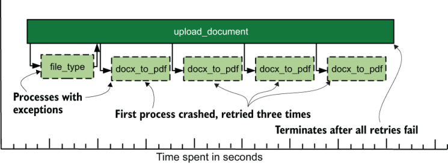

# 演示阶段：显示遥测数据

本章涵盖

- 展示台的功能
- 如何聚合和显示指标数据
- 集中式日志记录和安全系统所需的功能
- 相关性如何驱动分布式跟踪

演示阶段是遥测管道的最后一个阶段，也是技术组织（及其外部）中的大多数人用来与遥测进行交互的阶段。对于遥测 SaaS 公司来说，演示阶段是销售其产品的地方。本章介绍如何在前几章中介绍的四种遥测系统样式中呈现遥测：

- 第 5.1 节介绍了度量系统以及如何生成图表和聚合。
- 第 5.2 节介绍了集中式日志记录系统以及一个好的集中式日志记录呈现系统应该具备哪些功能。
- 第 5.3 节涵盖安全系统及其专门的演示需求。
- 第 5.4 节介绍了分布式跟踪系统以及相关性如何驱动其提供的价值。

当遥测到达呈现阶段系统时，它已经流经遥测管道的发射和运输阶段，如图 5.1 所示。生产系统首先通过发射阶段发送遥测数据，该阶段执行遥测数据的初始格式化以进行处理（第 2 章）。遥测数据流经运输阶段，可以选择进一步将其转换为存储在运输阶段存储系统中（第 3 章和第 4 章）。最后，希望支持决策的人们使用演示阶段系统，从运输阶段存储中提取遥测数据并显示它。


图 5.1 遥测管道阶段，最后是演示阶段。演示阶段消耗运输阶段的存储并将其呈现给人们以支持决策。演示阶段可以访问所有运输阶段存储，使其能够丰富遥测功能，超出前两个阶段所能提供的范围

演示阶段系统的工作是过滤、转换、聚合并选择性地提供对运输阶段数据的复杂分析，所有这些都是为了生成人们做出决策所需的表格、图表、仪表板和报告。演示阶段系统越来越获得定义实时警报的能力，这些警报用于在关键事件发生时通知待命轮换。当请求表格、图表、仪表板或报告时，大部分转换工作是在人们等待时发生的。因此，演示阶段系统背后的工程是整个遥测管道中最复杂的工程之一 - 如此复杂，尤其是在分布式跟踪的情况下，以至于开放核心（需要付费支持计划和许可才能启用的开源软件）大多数功能）和 SaaS 提供商主导了这一领域。

由于演示阶段是人类使用遥测技术的方式，因此拥有正确的演示系统来做出需要的决策非常重要。对于技术组织中的许多人来说，演示阶段系统将是他们与遥测管道交互的唯一地方。在许多方面，演示阶段系统是遥测生态系统的可交付“服务”。本章介绍了遥测的主要用例、每种遥测风格常用的演示系统类型，以及每种风格中需要寻找的理想演示阶段功能。

通过这些演示阶段系统，可观察性的支柱（日志、指标和跟踪）变得有用。当所有三个支柱一起使用时，使用非常适合其任务的演示系统，你的技术组织将能够最好地了解你的系统是如何运行的。

> 演示阶段认知的危险
>
> 无论好坏，技术组织中的大多数人都认为你的演示阶段系统是整个遥测系统，因为这些系统是他们与整个遥测系统交互的地方。这种看法对大多数人来说很好，但对操作员来说确实有一些不幸的副作用。
>
> 你会看到，当管理层对演示阶段系统的工作方式感到满意时，就很难获得资源来解决发布和运输阶段的问题。如果你要处理的遥测数据量由于增长而增加（这是一个很大的“问题”），那么只要演示系统仍然运行，你为保持运输阶段系统运行所做的巨大英勇行为就可能不会被看到。行为。
>
> 与任何平台或很大程度上隐藏的服务一样，你必须做更多的工作才能让决策者意识到问题如何级联到收入驱动系统中。我的职业生涯是在类似平台的系统上度过的，所以我对这个问题有长期的经验。

## 5.1 在度量系统中显示遥测数据

本节概述了显示指标样式的遥测数据。指标系统以数字（其主要数据类型）为主，并使用少量文本字段来提供可搜索性。使用易于压缩的数据形式（数字）使得指标式遥测成为长期存储最便宜的方法之一。在长期运行基于指标的遥测系统的组织中，你通常能够搜索过去的几年。

指标系统与用于实时轮班警报的监控系统非常相似（如果不是直接的一部分）。警报通常设置有阈值，超过该阈值（或低于该阈值）就会传呼人员来处理问题。当图表和图形用于跟踪一段时间内的行为时，警报使用相同的计算来得出将与阈值进行比较的当前指标。我在本节中介绍的统计技术同样适用于警报：

- 第 5.1.1 节概述了从指标遥测生成图形和图表以及成功指标呈现系统的共同特征。
- 第 5.1.2 节深入研究了大多数指标显示系统使用的遥测转换技术：聚合函数。
- 第 5.1.3 节将前两节中的概念与第 2-4 章中以各种风格编写的 `pdf_pages` 度量函数联系起来。

有关待命和警报的更多信息，请参阅 Jeffrey D. Smith 的《操作反模式、DevOps 解决方案》（Manning，2020 年；http://mng.bz/RKED）。

### 5.1.1 利用遥测技术制作漂亮的图片

本节涵盖了最具魅力的指标展示：图表，如图 5.2 所示。在计算机发明之前，方框中的波浪线就已经出现在商业报告中，而计算机无疑使它们更容易生成。当你查看图表时，你的大脑会绘制（可能不准确）趋势并识别数据中的模式。在没有任何其他类型的高级分析的情况下，图表可以独立存在并提供大量信息。


图 5.2 图表指标示例，显示按应用程序划分的 HTTP 命中率以及值得调查的异常事件。显示遥测数据通常会揭示以其他格式（例如报告）隐藏的功能。这里，尖峰一目了然。以图形方式显示数据使人类分析系统可以减轻显示自动化的一些负担。

任何度量系统都需要创建图表的能力。如果你的遥测系统不提供这种能力，人们无论如何都会找到制作图表的方法。也许你的工程师将从遥测系统中导出数字，将其导入到 Microsoft Excel（或 Google 文档）中，并在那里制作图表。几十年前，Excel 一直是业务流程的数字演示平台；如果 Excel 是唯一能够满足软件工程师所需的工具，请不要想象他们会有什么不同。

对于硬件系统，进入发射阶段仅限于操作和其他硬件维护团队。对于软件系统，软件工程团队是唯一有权访问的人。对于运输阶段的系统，与之交互的团队再次仅限于维护管道的运营和软件工程团队。然而，技术组织中的任何人都可能与演示阶段系统进行交互。这种广泛的使用为度量风格的呈现系统提供了限制。最成功的指标呈现系统具有共同特征：

- 它们允许各种用户创建图表和图形，为任何需要的团队提供决策支持或故障排除。
- 他们提供了用于构建图表和图形背后的查询的指导用户界面，因此用户不必记住查询语法，并且可以轻松构建复杂的查询。
- 他们能够组织图表和图形的集合（通常称为仪表板），以提供团队所需的决策点的概览视图。
- 他们能够组织仪表板，从而轻松找到合适的仪表板。否则，你会得到一大堆难以使用的仪表板。
- 它们允许创建临时仪表板而无需保存，允许用户立即调查某些内容，而不必将仪表板列表与将使用一次的仪表板混淆。

一个人使用的仪表板可以采取任何形式，只要该人得到他们想要的东西就可以成功。由多个人使用的仪表板，或者作为例行报告和审查支持工程和支持目标的一部分的仪表板，需要可供所有用户使用。以下是构建支持多个用户的仪表板的一些准则：

- 请注意暗/亮模式主题如何影响对比度。如果演示系统支持更改背景颜色，请选择颜色，以便具有深色和浅色背景的用户能够看到线条。例如，黄色在黑色上很突出，但在白色上几乎看不见，而深蓝色在白色上显示得很漂亮，但在黑色上却消失了。
- 对于具有多个图表的仪表板，请将最重要的图表放在顶部。人们不喜欢滚动。
- 注意信息密度。如果页面上有太多图表，不熟悉仪表板显示内容的用户将不知道该看什么。

如果你有兴趣构建美观、信息丰富的仪表板，以下一些资源将有所帮助：

- 有关运营、DevOps 和 SRE 仪表板的关注点，请参阅 Jeffrey D. Smith 的《运营反模式、DevOps 解决方案》中的第 4 章“数据而不是信息”（Manning，2020 年；http://mng.bz/2zj9） 。
- 有关使用图形和可视化查找问题点的信息，请参阅 Nina Zumel 和 John Mount 的《Practical Data Science with R》第二版中的第 3.2 节“使用图形和可视化发现问题”。 （曼宁，2019 年；http://mng.bz/1Ajy）。
- 要深入了解一般可视化理论，请参阅 Corey L. Lanum 的可视化图数据（Manning，2016 年；http://mng.bz/PaWg）。
- 有关如何在管理敏捷团队的背景下处理指标和图表的建议，请参阅 Christopher W. H. Davis 的《Agile Metrics in Action》（Manning， 2015 年；http://mng.bz/Jv1P）。

### 5.1.2 使用聚合函数提供图表

本节介绍指标系统用于对数据集进行简单统计分析的技术，使人们能够识别可能隐藏在原始数据中的趋势。对于时间序列数据，你选择一个时间段并选择要对结果指标运行的聚合函数以生成一个数字。聚合函数是一种数学函数，在对一组数字运行时返回单个数字。当图表中的每个像素代表多于一项收集的数据时，表示阶段系统使用聚合函数。聚合函数产生可以绘制图表或用于其他分析的聚合值。以下是大多数指标显示系统都可以支持的一些简单聚合函数，其中几个在 5.1.3 节中使用：

- 最小值 - 期间内的最小数字由 `minimum` 返回。
- 最大值 - 期间内的最大数字由 `maximum` 返回。
- 平均值 - 一段时间内的平均数（算术平均值）由 `mean` 返回。
- 中位数 - 如果一段时间内的所有数字均按从最低到最高排序，则为排序列表的中间位置。
- mode - 期间最常见的值由 `mode` 返回。
- sum - 周期内的所有数字加在一起表示 `sum` 。
- count - 期间内的事件数由 `count` 返回。
- 百分位数 - 如果一段时间内的所有数字都按从最低到最高的顺序排序，并且该列表被分成相等的部分，则百分位数是该组的特定相等部分。中位数是第 50 个百分位。

每个聚合函数都会告诉你有关其聚合的遥测数据的一些不同信息。你还可以使用聚合函数来平滑有噪声的遥测数据，例如将包含函数处理时间的一组遥测数据从无法绘制的噪声转换为平滑的线。图 5.3 演示了平滑处理，其中暗线是噪声较大的亮线的运行平均值，即该线的每个像素之前的一致时间段的平均值。阴影表示图表下方的区域，并提供对比度，使用户能够挑选出更多细节。


图 5.3 使用聚合函数平滑线条的示例，其中深色线是浅色线的平滑版本，显示了温度的总体趋势。将噪声数据与平滑数据配对可以让查看者了解正在发生的事情和总体趋势。如果你曾经在 Excel 中添加过趋势线，那么你就提供了一种平滑线的形式。

除了提供简单的平滑之外，每个聚合函数还告诉你有关遥测的不同信息：

- `mean` 和 `median` 是查找给定时间段内遥测数据中间值的不同方法。
- 第 50 个 `percentile` 相当于 `median` ，就像第 0 个 `percentile` 相当于 `minimum` 和第 100 个 `percentile` 相当于 `maximum` 。
- 如果遥测具有长尾（例如响应时间指标，其中大多数值在 0.5 到 1.5 之间，但极少数事件达到 30），则 `maximum` 值可能没有用，但第 95 个 `percentile` 可以更好地捕获有趣遥测的顶部边缘。
- 与简单的平均值/中线相比，显示第 5、50 和 95 个百分位数可以让你更好地了解遥测数据的形状。

> 警告
>
> 谨防进一步聚合聚合数据，因为这种技术几乎总是会导致谎言。尽可能使用原始值，因为它们会告诉你准确的信息。如果你正在处理的数据已经聚合过一次，除非你小心选择合适的函数，否则后续函数会将你看到的数据变成谎言。对已运行过 `sum` 的数据运行 `sum` 函数将是准确的，但对已运行过 `mean` > 函数将是谎言。如果你正在使用预先聚合的数据，则危害最小的方法是对已经通过聚合函数处理的数据使用相同的聚合函数。总结你的总和是安全的，但其他任何东西都将是谎言——看起来有点像你的数据但在统计上不有效的谎言。我已经记不清必须修复的图表数量了，因为他们在 `sum` 上使用了 `mean` 函数，而寻求帮助的人想知道为什么要扩展图表从一周到一个月，图表中的数字没有增加。 17.2 节更详细地讨论了这个问题。

一些演示系统还提供附加功能，可以提供对未来的预测或处理特殊类型的数据。这些附加功能因演示系统而异，但有两个值得仔细研究： `derivative` 和 `spread` 。

导数给出了图表上两点之间的变化率。导数对于磁盘空间等遥测最有用，每次轮询时报告的值都是一个很大的数字，或者是随着时间推移累积值的指标。对于磁盘空间等指标，显示卷上剩余空间的图表本身就很有趣，但导数函数将允许你生成显示该卷填充速度的图表。显示变化率的图表将有助于使峰值更加明显。

点差为你提供给定时间段内 `minimum` 和 `maximum` 值之间的差异。从功能上讲，价差是从 `maximum` 聚合中减去 `minimum` 聚合。当你想要引起人们对窄范围不成立的事件的注意时，传播对于遥测来说是一个有用的函数，通常在窄范围内流动。

聚合函数不仅仅在Presentation阶段有用；在Presentation阶段也有用。它们在运输阶段也很有用，作为聚合策略的一部分。第 17.2 节介绍了以在演示阶段系统中使用时保持统计有效性的方式构建聚合策略。

### 5.1.3 使用 pdf_pages 的聚合

在第 2-4 章中，我们构建了 Emitting 和 Shipping 阶段组件来处理来自名为 `pdf_pages` 的函数的指标。生产系统使用清单 2.3 中的发射阶段组件写入标准输出（stdout），指示名为 `pdf_pages` 的函数处理的页数。运输阶段组件读取此文件和指标（请参阅第 4.1.1 节），并将其发送到数据库。图 4.6 演示了该架构，此处将其复制为图 5.4。


图 5.4 生成 `pdf_pages` 指标图表背后的遥测数据的发送和传送架构。遥测数据从容器化生产代码发送到标准输出中。 Kubernetes 将此遥测数据发送到日志。 Elastic.co 程序 Journalbeat 已安装并配置为将日志遥测数据直接发送到 Elasticsearch。根据 Elasticsearch 中的指标，将使用演示阶段系统来制作下一系列的数据。

本部分向你展示一组 `pdf_pages` 指标与各种函数聚合时的外观。图 5.5 显示了通过简单求和汇总的所有 `pdf_pages` 指标的值。


图 5.5 演示了 60 分钟 `pdf_pages` 遥测的总和函数，揭示了许多波峰和波谷。原始计数的总和聚合得出该时间段内的页面总数。通过将汇总周期延长至 60 秒，我们可以平滑噪声数据并显示较长时间范围内的趋势。

图 5.5 展示了一组有噪声的数据。在图表显示的一小时内处理的 PDF 页面数量变化很大，从一分钟 134 页的最低点到 418 页的最高点。显示处理的页面总数很有趣，但如果我们想更多地了解每个函数调用处理的页面范围，我们需要使用不同的方法。图 5.6 显示了在其上运行平均值/平均函数的相同数据。


图 5.6 演示 60 分钟 `pdf_pages` 遥测的 `mean` 或平均聚合函数，揭示中间数据的一个版本。数据的“中间”有不同的版本；均值/平均值只是一种版本。当你想要数值平均情况时，请使用 `mean` 。

PDF 页面的 `mean` 告诉我们更多关于我们的 `pdf_pages` 函数（调用我们的指标函数来发出遥测数据）正在处理的流量类型。大多数情况下，平均页数在 4 到 5 之间。为了进一步探索，让我们看看图 5.7 中的 `median` 或中间值聚合函数告诉我们什么。


图 5.7 比较 60 分钟 `pdf_pages` 遥测中的 `mean` 和 `median` 聚合函数，其中 `median` 是较暗的线。当 `median` 低于平均值时，你就知道数据包含一些高值。

图 5.7 将 `mean` 显示为较浅的上线，将 `median` 显示为较暗的下线。 `median` 线明显低于 `mean` ！ `median` 值大部分为2，但有时会弹出3，并且在13:52处有一个1。因为 `median` 显示了中间值，所以让 `mean` 更高告诉我们两件大事：

- 大多数页数在 1 到 2 之间。
- 大量页面计数相当高，因此 `mean` 也随之增加。

为了更好地了解 `pdf_pages` 数据的整体形状，我们对数据使用 `percentiles` 函数来生成图 5.8。


图 5.8 演示了 60 分钟的 `pdf_pages` 遥测中的第 25、50、75 和 95 个 `percentiles` 聚合函数，揭示了数据的大致形状。如果在每个时间片中数据都是有序的，那么百分位数会向我们显示有序列表的该部分如何随时间变化。当我们绘制多个百分位数的图表时，线条的变化告诉我们数据的形状在显示的时间段内如何变化。

图 5.8 显示了 `pdf_pages` 的四个百分位数，其中第 50 行 `percentile` 与图 5.7 中显示 `median` 的行相匹配。该图上的第 95 个 `percentile` 近似于我们的函数处理的页数的顶端，并表明我们正在处理一些高页数。所有三张图的一个共同特征是 13:52 左右出现低点。 `sum` 图表显示了一个低点， `mean` 显示了一个低值， `median` 在此期间唯一一次为 1，但第 95 次 `percentile` 当时很低。我们可以看到较高值的页数如何影响整体图表。

为了完成对 `pdf_pages` 数据的探索，我们引入一种新型图表：热图。想象一下图 5.8 没有彩色线条但有轴。这个只有光导的裸图将矩形图分成了块。热图根据每个块中的遥测量对每个块进行着色。计数越大，颜色越深，计数越小，颜色越浅。基于 `pdf_pages` 数据的热图可以让我们更好地了解数据的形状。图 5.9 演示了 `pdf_pages` 数据的热图。


图 5.9 演示了 60 分钟 `pdf_pages` 遥测的热图，显示了数据的形状和分布。热图绘制了每个给定框中的数据密度，X 轴上以时间为界，在本例中 Y 轴上以计数为界。与图 5.8 中的百分位数示例类似，此示例详细介绍了图表期间数据的形状。

图 5.9 底部的黑框线告诉我们，我们的函数生成的绝大多数指标都适合最小的页数。事实上， `median` 和 `mode` 是不同的，如图 5.7 所示，这告诉我们这个结果是可能的。图 5.8 中的 `percentiles` 告诉我们，一小时内存在大量页面计数指标，如第 95 个百分位数线所示。热图显示页数超过 50！

## 5.2 在集中式日志系统中显示遥测数据

在本节中，我们将处理在集中式日志系统中显示遥测数据的问题。与主要是数字的指标遥测不同，集中式日志记录遥测主要是字符串。你绝对可以基于集中式日志遥测生成图表，这对于跟踪某些排放的发生率特别有用，正如我将在本节中向你展示的那样。然而，与集中式日志系统的大多数交互都涉及挖掘事件的上下文，这需要查看字符串。

集中式日志记录是本书中介绍的系统中存储最密集的遥测系统，并且通常是用于维护长期可搜索历史记录的最昂贵的方式。由于这种成本，集中式日志记录系统通常会以可在线搜索的格式维护较短的时间，该时间最常以周和天而不是月和年来衡量。图 1.12（此处复制为图 5.10）演示了这个问题。


图 5.10 四种遥测类型及其首选在线保留期。由于外部要求，SIEM 系统具有最长的保留时间。分布式追踪通过使用统计采样来实现其保留。指标通过聚合内部存储的数字来实现其持续时间。集中记录。 。 。嗯，它只是很贵，所以它的在线保留期最短。

指标和分布式跟踪通过使用聚合和采样来实现较长的保留时间，而 SIEM 通过选择性地存储内容并且不允许数据离线来实现较长的保留时间。尽管其他类型的遥测（例如指标和分布式跟踪）会牺牲灵活性来专注于遥测的特定方面并对其进行优化，但集中式日志记录在许多方面都是包罗万象的系统，如果没有更好的东西可用，所有内容都会流向该系统。

尽管存储了如此多的遥测数据，但直接查看遥测数据的每个单独项目是极其不可能的。如果引用此类遥测数据，则通常会作为类似事件趋势线的一部分间接汇总访问。在极少数情况下，数十亿数据中的一个包含调查的关键，因此你会很高兴保存了它。大多数集中式日志记录系统中的遥测数据都会发送到那里，以备以后需要时使用。以防万一，集中式日志记录功能异常强大，但也需要大量资源。

用于集中日志记录的显示系统主要基于字符串，需要三个主要来源的帮助：

- 发射和运输阶段的额外标记和丰富（参见第 6 章）
- 用于集中日志记录的数据库中发现的搜索优化（参见附录 A）
- 演示阶段系统中的正则表达式引擎

第 4.2.2 节中的清单 4.5 是作为运输阶段一部分进行标记和解析的基本示例，在该示例中丰富和解析 Syslog 格式的遥测数据以生成附加字段。你可以使用与其他格式相同的遥测技术。第 6 章详细介绍了这种丰富。在本节中，我们假设这些字段已经存在。我将在第 6 章中介绍如何创建这些字段。接下来的两小节将帮助你确定一个好的集中式日志记录演示系统：

- 第 5.2.1 节解释了你希望在集中记录显示系统中看到的功能。
- 第 5.2.2 节提供了全功能显示系统的演练。

### 5.2.1 在显示系统中选择集中记录所需的功能

集中式日志记录系统的显示系统具有一组通用功能，这些功能源于使用任何集中式日志记录系统的必要性以及许多组织使用集中式日志记录作为各种遥测的包罗万象的系统。

为了进行度量，显示系统需要创建可视化。为了进行分布式跟踪工作，显示系统必须能够基于各种且可能唯一的搜索条件构建数据表。集中式日志显示系统对于这些情况来说至少已经足够好了，但是专用于指标和分布式跟踪用例的专用系统将更加实用。许多想要实现遥测管道多样化的技术组织最初会寻求现有的集中式日志系统来填补这些角色。

选择集中式日志显示系统来满足集中式日志记录的所有需求意味着选择支持多样化需求的显示系统。软件工程团队需要一些功能来帮助他们深入查找故障代码并隔离故障路径。支持团队需要挑选特定的故障来引起工程人员的注意。运营团队寻找需要他们关注的基础设施事件。这些不同的使用模式意味着一个好的集中式日志记录显示系统必须具有以下功能：

- 按字段内容搜索的能力——我接触过的所有集中式日志系统都具有字段的概念，并允许用户使用这些字段构建查询。使用字段（搜索 `priority:"high"` 与 `"high"` ）内容将大大提高搜索性能。
- 能够支持复杂的搜索逻辑——有时，你所需要的只是一个字符串。在其他时候，获得你需要的东西需要一个复杂的“如果这个，那么那个，除了这些其他的东西，但确实包括这一件事”这样的陈述。
- 自定义字段显示的能力——集中式日志记录系统中的事件可能包括数十个甚至数百个字段，将每个字段显示在一个表格中，该表格通常显示搜索者不关心的信息。自定义结果表以显示特定字段的功能允许搜索者扫描表以查找感兴趣的事件。
- 能够保存搜索和表格布局供以后使用 - 如果你想了解足够的知识来构建搜索和表格布局，那么你很可能会再次需要它。保存布局供以后使用的功能将节省你将来的工作量。
- 能够在用户之间共享已保存的搜索/布局 - 在遥测系统的用户之间共享搜索可以共享分析工具，从而提高组织响应问题的能力，而不是依赖少数熟练的搜索人员来完成工作。
- 能够共享搜索 URL 并显示相同的搜索和布局 - 与共享已保存的搜索相关，在问题响应期间共享即兴搜索或临时搜索至关重要。如果遥测显示系统的 URL 没有重新创建搜索，其他响应者将不得不做更多工作才能看到有趣的结果。一个好的显示系统将减轻这项工作。
- 需要登录才能使用——集中式日志系统通常包含公司敏感信息，有时还包含个人身份信息 (PII) 等受监管信息。绝对最低的要求是在使用显示系统之前要求身份验证和授权。第 15 章详细介绍了这个安全主题。

### 5.2.2 演示集中日志显示

在本节中，我们将介绍一个演示阶段系统，该系统满足第 5.2.1 节中列出的集中式日志显示系统功能的所有标准。 Kibana（此处显示的是版本 7）由 Elastic.co 作为其 Elasticstack 系列工具的一部分发布，提供了这些功能。这里使用的示例数据取自第 2.2 节，涉及 Cisco ASA 防火墙的排放。此示例遥测线路是从防火墙发出的：

```
Feb 19 02:26:26 asa1.net.prod.internal %ASA1: Teardown of UDP connection
➥ 162121 for outside:1.1.0.0/53 to dmz1:192.0.2.19/59232 duration 0:00:00 
➥ bytes 136
```

图 3.8（此处重现为图 5.11）演示了将事件从 Cisco 防火墙传送到存储的传送阶段。本节介绍如何在演示阶段系统 Kibana 中显示 Cisco 防火墙遥测。


图 5.11 将防火墙数据发送到 Syslog 的运输管道，最终显示在从 Elasticsearch 绘制的演示阶段系统中，并从中显示数据。此示例演示了多租户，因为两个独立的团队使用相同的遥测数据来满足自己的需求。安全团队使用它来填充 SIEM；网络运营团队将其用于存储在 Elasticsearch 中的集中式日志系统。

图 5.12 演示了在 Kibana 中搜索防火墙数据，并显示了 2025 年 3 月 22 日发生的一系列事件。所有这些事件都是对 CloudFlare 管理的一对 DNS 服务器（1.1.0.0 和 1.1.1.1）的各种 DNS 查找。让我们仔细看看这个仪表板是如何创建的以及它还告诉我们什么。


图 5.12 Kibana 7 发现页面演示了在功能齐全的演示阶段系统中搜索防火墙数据以进行集中日志记录。我们可以选择要包含在报告中的字段以及搜索遥测，选择要搜索的时间范围，以及选择用于保存和打开仪表板的按钮。所有这些功能都在第 5.2.1 节中列为所需功能。

图 5.13 指出了此处使用的搜索。此示例使用一个名为 `tags` 的字段，该字段是在 Shipping 阶段创建的。我们的运输阶段系统将 `firewall` 值添加到 `tags` 字段，以获取来自 Cisco ASA 防火墙的遥测数据。添加此字段和值允许我们通过在演示阶段系统中使用单个搜索来查看所有防火墙流量。让我们看看我们得到了什么样的数据。


图 5.13 搜索 Kibana，使用字段来发现特定于防火墙的遥测数据。 Kibana 使用 Lucene 语法进行搜索，如下所示。可以生成更复杂的查询。添加过滤器按钮提供了另一种构建搜索查询的方法。

图 5.14 给出了 Shipping 阶段放入事件中的字段类型的示例。从思科端获取的初始日志行存储在 `message` 字段中，该字段在图 5.12 中被截断。解析消息字段（丰富）为我们提供了几个新字段：

- `conn_bytes` — 此连接中处理的字节数
- `conn_duration` — 此连接花费了多少小时、分钟和秒
- `firewall_action` —从包装格式中提取的 Cisco 日志行
- `firewall_conn` — 此连接的号码
- `firewall_proto` — 用于连接的协议（在本例中为 UDP）
- `host` — 生成事件的主机
- `source_ip` ——打开连接的内部资源的IP地址
- `source_port` — 连接 `source_ip` 侧的 IP 端口
- `source_zone` —内部资产所属的防火墙区域
- `target_ip` —内部资源打开连接的 IP 地址
- `target_port` —内部资源连接的IP端口
- `target_zone` —source_ip 所属的防火墙区域


图 5.14 演示运输阶段丰富的防火墙事件的返回字段，在 Kibana 中展开表行时显示。这里的字段是由运输阶段生成的，这允许我们的演示阶段在搜索中使用任何这些字段。 `tags:` `firewall` 突出显示，因为它是当前搜索词。

`tags` 字段的值突出显示，因为我们的搜索字段引用了它。 Kibana 提供突出显示作为搜索本身请求的信息的视觉提示。如果我们希望某个特定字段在整个报告中可见 - 如图 5.12 所示，其中包含 `source_name` 、 `source_ip` 、 `target_zone` 、 `target_ip` 和 `target_ port` 字段——我们需要从字段侧边栏添加它们，如图 5.15 所示。


图 5.15 在 Kibana 侧栏中选择字段会使它们成为结果面板中的列。列也可以从右向左移动并单击进行排序。在此视图中，当前排序是按时间排序，但显示的任何字段都可以用作排序。

接下来，我们优化搜索词以定位异常的 DNS 活动。因为我们有一个 `target_ip` 字段，所以我们可以排除已知良好的 IP。正如我们在图 5.12 中看到的，我们的大部分流量都流向两个不同的 IP 地址。图 5.16 演示了排除这两个地址来获取有趣的事件。


图 5.16 Kibana 搜索排除了两个知名 IP，以将搜索范围缩小到感兴趣的结果。此示例演示使用过滤器来扩展现有搜索 - 在本例中，排除两个 IP 地址。随着绝大多数事件被删除，我们留下了那些值得我们关注的事件。

排除完毕后，图 5.17 显示了一个不寻常的事件！有人访问了 Google 管理的 DNS 服务器，而不是我们通常使用的 DNS 服务器。此事件可能值得调查，因此我们保存此图表供以后使用。


图 5.17 演示图 5.16 中的搜索结果：单个事件。深入了解单个有趣的事件是用于集中日志记录的演示阶段系统的核心功能。

要保存此图表以供同事使用，我们单击图 5.12 中突出显示的“保存”按钮。单击“保存”会弹出一个对话框，允许我们为图表命名，如图 5.18 所示。


图 5.18 Kibana 保存对话框，允许同事使用此图表。保存和打开仪表板和图表的能力是支持集中式日志记录的演示阶段系统的一个关键功能。

保存此仪表板后，同事可以单击“打开”按钮（图 5.12），弹出另一个对话框，允许他们搜索我们创建的仪表板。当保存了许多搜索后，Kibana 允许用户搜索已保存搜索的列表。找到所需内容后，单击该项目，将加载已保存的搜索，包括搜索词、两个排除项以及要显示的所有选定字段。

其他解决方案提供与 Kibana 类似的功能。 SaaS 系统 Splunk 和 Sumo Logic 都有与 Kibana 类似的仪表板，可以与它们维护的运输阶段存储系统进行交互。当你查看演示阶段系统来显示集中式日志记录数据时，请记住第 5.2.1 节中的功能列表。

> 新兴趋势：让演示阶段完成大部分丰富工作
>
> Grafana Labs 的 Loki 集中式日志记录解决方案是新的（2018 年），不需要像 Kibana 那样进行大量预处理。 Loki 是一种更加云原生的解决方案，依赖于 S3 等云提供商数据存储和 DynamoDB 等数据库。 Kibana 假设它正在搜索的数据已经完全丰富——我们刚刚查看的所有字段。另一方面，Loki 在查询时进行丰富。只要摄取的遥测数据已经采用易于解析的格式（例如 JSON），Loki 就会实时反序列化和查询。
>
> 随着计算技术的进步，这种趋势是遥测长期趋势的一部分。当 Kibana 在 2010 年代初出现时，存储大部分仍位于磁盘上，因此速度较慢，因此它受益于摄取时预处理来加速查询时访问。十年后，这种计算方式发生了变化：现在进行最少的预处理并依赖查询时处理是经济的。
>
> 此外，依靠云提供商进行存储和信任查询时处理可以大大降低保持遥测数据在线和可搜索的成本。在 Loki 等系统中，在线保存一年的遥测数据比旧式遥测系统便宜得多。看看这种情况在 2020 年代如何演变将会很有趣！

## 5.3 在安全系统中显示遥测数据

在本节中，我们将详细介绍安全团队使用的遥测系统中的遥测数据显示。安全团队将使用集中式日志记录，如第 5.2 节中所述，但安全团队独有的遥测系统是安全信息事件管理 (SIEM)。 SIEM 系统专为安全团队调查事件并验证外部法规合规性的用例而设计。 SIEM 系统包含的遥测技术通常由法规（直接或间接）强制执行，其中包括针对个人隐私和个人健康信息的《通用数据保护条例》(GDPR) 和《健康保险流通责任法案》(HIPAA)。此外，萨班斯-奥克斯利法案 (SOX) 和服务组织控制 2 (SOC 2) 等合规框架为组织的整体技术实践设定了最低标准。

SIEM 系统与第 5.2 节中讨论的集中式日志系统具有许多相同的功能，但在关键方面与它们有所不同，如表 5.1 所示。

表 5.1 集中式日志记录和 SIEM 系统之间的差异

|                                    |                        集中记录                        |                             SIEM                             |
| :--------------------------------: | :----------------------------------------------------: | :----------------------------------------------------------: |
|        主要数据类型是什么？        |         字符串（也可以是数字，但主要是字符串）         |          字符串（数字出现很多，但字符串是主要类型）          |
|         **主要用户是谁？**         |                         每个人                         |                     安全团队和外部审计员                     |
|          **使命是什么？**          |             帮助人们隔离问题并了解生产系统             | 帮助安全事件响应人员跟踪整个系统内采取的操作，并向外部审计员证明存在此类功能 |
|      **谁决定添加哪些事件？**      | 任何在连接到集中式日志系统的生产系统中编写日志语句的人 | 监管和合规框架提供最低限度的事件覆盖；安全和合规团队推动其他活动。 |
| **遥测在线和可搜索的时间有多长？** |   几天到几周，主要是由于在线保存大量数据的成本造成的   |                 年，根据法规和合规框架的要求                 |

SIEM 系统和集中式日志记录系统主要以字符串形式工作，至少在管道的发射端是如此。与指标和分布式跟踪系统相比，这两个系统都可以处理大量遥测数据。集中式日志记录因其作为包罗万象的遥测系统的作用而可以处理大量遥测数据； SIEM 系统处理大量数据，因为跟踪事件中发生的情况需要大量遥测。你绝对可以从现有的集中式日志系统中构建一个基本的 SIEM，但是为该角色构建的系统将更好地满足你的需求。

尽管发送到集中式日志系统的大多数遥测数据都是为了以防万一有人需要某些东西而发出的，但 SIEM 系统会摄取专门要求支持安全团队需要执行的某些工作流程的数据。其中一些常见的工作流程是

- 向审核员证明具有提升权限的用户的操作被跟踪
- 跟踪生产系统中的身份验证和帐户锁定事件
- 评估数据保留政策的合规性
- 评估用户激活和停用策略的合规性
- 识别未通过适当的变更请求执行的变更
- 跟踪入侵者在生产系统中的路径
- 识别未经授权人员访问的生产数据

作为 SIEM 系统出售的遥测系统具有许多集中式日志系统所没有的功能：一种将来自生产系统不同部分的事件关联起来的强大方法。例如，SIEM 系统应该能够将登录事件与用户的进程执行历史记录相关联。关联引擎需要处理各种各样的输入，这为提供该价值创造了巨大的赚钱机会，这意味着很少有开源 SIEM 系统可以完成这项工作。 SIEM 系统通过多种方式为安全团队提供可观察性支柱，让他们能够跟踪、跟踪和监控技术系统的用户。

由于 SIEM 系统都存在集中式日志系统的问题，即必须维护潜在的大量数据存储，因此 SIEM 系统操作员必须权衡遥测可以保持在线和可搜索的时间与提供在线搜索功能的成本。与集中式日志记录相比，安全团队工作的性质会激励更长的在线时间，因此安全团队相应地花费更多时间来管理发送到 SIEM 系统的遥测数据。

在 SIEM 系统中显示遥测数据与集中式日志系统（如第 5.2 节中描述的系统）具有类似的要求。第 5.2.1 节中集中式日志系统所需的功能列表也适用于 SIEM 系统，但 SIEM 系统添加了更多项目：

- 定义警报的能力——集中式日志系统旨在提出你以前可能没有想到过的问题，而 SIEM 系统则作为监控系统的一部分发挥作用。因此，创建警报以通知人们问题的能力是一项关键功能，而在集中式日志系统中，它只是可选的。
- 能够定义警报优先级——按优先级自动对警报进行分类，使响应人员能够安全地延迟较低优先级的警报，从而获得更好的睡眠和更好的工作乐趣。

除了 SIEM 系统之外，安全团队还负责处理生产系统中的漏洞。大多数监管和合规框架所要求的漏洞管理计划是用于处理第一方和第三方软件中的错误的政策和程序。漏洞通知的主要来源是 Mitre 运营的常见漏洞和披露 (CVE) 列表 (https://cve.mitre.org)，但这些通知也来自 Microsoft、Adobe 和 VMware 等供应商。

漏洞管理程序的一部分是分析生产系统中 CVE 的软件，称为漏洞扫描。生成漏洞列表后，每个漏洞发现都需要解决，通常由操作系统和硬件漏洞的运营和 DevOps 团队解决，但越来越多的软件工程团队正在将这项工作作为软件模块维护的一部分。管理漏洞需要专门的工具，这些呈现系统具有共同的特征：

- 跟踪漏洞的能力 - 这些漏洞主要来自 CVE 列表，但可能包括特定于供应商的公告，例如 Adobe 和 Microsoft 的公告。漏洞管理计划是监管和合规框架的常见要求，因此漏洞管理系统必须支持该角色。
- 跟踪已接受风险和误报的能力——与跟踪漏洞相关，漏洞管理系统必须跟踪组织已接受的漏洞（风险），以及显示为适用但被认为是误报的漏洞检测。这种跟踪允许持续的漏洞管理计划。

> 漏洞管理程序中的软件模块
>
> 每个软件开发平台都有一些导入外部开发的模块或库的方法：
>
> - Eggs for Python
> - Gems for Ruby
> - NuGets for .NET
> - NPMs for NodeJS
> - Modules for Perl
> - Pecls for PHP
> - Packages for Elixir
>
> 尽管大多数漏洞扫描软件都专注于操作系统中使用的软件包，但较新的扫描程序可以扫描软件模块列表，以识别哪些模块上有开放的 CVE。虽然修复和修复漏洞过去完全是运营团队的职责，但现在软件工程团队通常必须强制更新模块，否则他们更愿意将其设置为特定版本。
>
> 随着越来越多的软件以容器化格式部署，大大减少了操作系统级软件包的影响，漏洞管理程序必须关注软件模块生态系统。理想情况下，你的持续集成环境包括用于软件模块中新漏洞的扫描器，并且在解决这些漏洞之前构建将失败。我们荣辱与共！

SIEM 和漏洞管理程序很少出现在同一个软件中。满足这两种需求的产品套件的一个示例是与 Splunk 结合使用的 Nessus Cloud。 Nessus Cloud 提供漏洞管理功能并具有一定的设置警报的能力，而 Splunk 则提供 SIEM 所需的集中式日志记录和警报功能。这两种产品共同满足安全团队的基本遥测需求。还存在其他组合，例如用于漏洞管理的 AWS Inspector 以及用于 SIEM 和集中日志记录功能的 Sumo Logic。随着时间的推移，其他选择将会出现；寻找他们。

## 5.4 显示遥测分布式追踪系统

分布式跟踪提供了一个更正式的框架，用于从软件发出遥测数据，旨在克服集中式日志记录的一些限制。集中式日志记录的主要限制之一是其内置的遥测事件将相互关联的假设。在分布式跟踪系统中，事件以易于发现的方式链接。对于集中式日志系统，这项工作由提出问题的人进行繁琐的手动操作。分布式跟踪系统通过在运输和演示阶段中的生产代码事件之间自动创建链接来克服这一限制，从而允许演示阶段系统轻松且廉价地显示链接的事件。

让我们看看有人调查为什么系统用户上传 Microsoft Office .docx 文件后无法转换为 PDF。我们的人员正在使用集中式日志系统进行故障排除。他们的研究步骤如下：

1. 搜索并查找 `docx_to_pdf` 进程失败的进程异常。
2. 使用传递给 `docx_to_pdf` 进程的文件标识符来查找哪些代码将作业发送到失败的 `docx_to_pdf` 进程，并查找发送作业的 `upload_document` 进程。
3. 在 `upload_document` 进程的日志记录中搜索一些有趣的内容，发现它在等待文件转换时超时，并将相同的文件标识符发送到 `file_type` 进程。
4. 搜索使用该队列标识符获取作业的 `file_type` 进程，并找到一个。
5. 搜索 `file_type` 进程中的日志记录以查找任何有趣的内容，发现异常和已识别的 .docx 类型。
6. 读取 `file_type` 的代码，发现它有一个错误：对于它无法识别的任何内容，它将文件类型显示为 .docx。

尽管在半小时的过程中，搜索可能是一次令人兴奋的旅程，揭示了有趣的细节，但你的眼睛可能会盯着列表并跳到最后。现实情况是，仅使用集中式日志记录进行这项研究的人需要充分了解其遥测系统的架构，才能知道如何表达正确的查询。对于不熟悉集中式日志记录系统中可用的遥测类型的人来说，从步骤 1 转到步骤 2 可能需要等待几个小时才能找到合适的人回答有关如何查找步骤 2 的问题。

分布式跟踪系统通过在任何人查看之前完成所有链接来简化此过程。同一个人在分布式跟踪系统中进行相同的研究将需要更少的步骤：

1. 打开用户的跟踪流并查找带有异常的跟踪，找到一个包含五个单独异常的跟踪，其中四个来自 `docx_to_pdf` 。
2. 打开带有异常的跟踪，如图 5.19 所示，显示 `file_type` 和四个不同 `docx_to_pdf` 执行中的异常。此外， `upload_ document` 由于文件转换中的重试次数过多而失败。
3. `file_type` 中的异常很有趣，因为它抛出了异常，但仍然返回了文件类型。
4. 读取 `file_type` 的代码，发现它有一个错误：对于它无法识别的任何内容，它将文件类型显示为 .docx。



图 5.19 显示 `file_type` 和 `docx_to_pdf` 中的异常（虚线框）的跟踪， `docs_to_pdf` 的三次重试也失败。 `upload_document` 进程在第一个 `docs_to_pdf` 进程中检测到失败，并在放弃之前重试该进程 3 次。此模式告诉我们， `docx_to_pdf` 中的崩溃可能与随机机会无关，而是与正在转换的特定文档有关。

有了分布式跟踪系统，进行搜索的人就不需要太了解遥测技术，就能快速到达问题区域（行为不端 `file_type` ）。为了进行比较，图 5.20 显示了此工作流程的正常、无异常执行。


图 5.20 一个正常（无例外）的分布式跟踪示例，显示了 .docx 文件的转换，该文件生成了三个页面。此示例演示了针对此特定执行的服务（而不是函数或类）形式的调用堆栈。两个函数 `docx_to_pdf` 和 `pdf_pages` 除了将结果返回到其父服务之外，还会对 `save_file` 函数进行第二次调用。像这样格式的图表为想要解决问题的人提供了广泛的上下文，并且上下文可以加快解决速度。

图 5.20 与图 5.19 有很大不同， `docx_to_pdf` 需要更长的时间来运行，它本身调用一个名为 `pdf_pages` 的新进程（创建第 5.1.3 节中所示图形的进程），它进一步调用 `pdf_to_png` 进程来构建由 `docx_to_pdf` 创建的 PDF 的每页图像。尽管存在所有这些额外的活动， `upload_document` 的运行时间较少，因为它不必处理重试级联。

生成这样的图表需要执行链中涉及的每个进程在接受 API 调用、从队列中弹出作业、将作业推入队列或进行 API 调用时跟踪和传递相关标识符。关联标识符是唯一标识特定执行或工作流的字符串或数字。分布式跟踪系统的运输阶段组件将事件与相同的相关标识符链接起来，从而允许演示阶段系统轻松生成如图 5.19 和 5.20 所示的图表。相关标识符可以显式创建或抽象为生产代码使用的跟踪库的一部分。开放遥测项目正在为此类工作构建与供应商无关的库。这些跟踪库充当遥测管道的发射阶段组件，类似于我们在第 2-4 章中编写的各种metrics.py 函数。

当你在图 5.20 中选择特定进程时，大多数用于跟踪的演示系统都会提供一个窗口，显示给定进程的特定遥测数据。图 5.21 显示了可以显示的遥测类型的示例。


图 5.21 分布式跟踪详细信息页面的示例，显示了用于创建图 5.20 中的图表和特定于流程的遥测的许多相关标识符。这里使用了各种各样的相关标识符，每个标识符都允许调查单独的相关性。

图 5.21 中的所有相关标识符使软件工程团队可以提出各种问题：

- 从 .docx 转换的文档与生成页面图像的本机 PDF 的转换时间有何不同？将事件之间的 `avg_convert_wait_time` 指标与 .docx 和 .pdf 的 `source_doc_type` 进行比较。
- 对于帐户 12497714，有多少百分比的页面转换花费的时间超过 1,000 毫秒？计算 `account_id` 12497714 的 `pdf_page` 次执行总数；然后计算 `account_id` 12497714 的执行次数，其中 `avg_convert_wait_time` 的执行时间超过 1,000 毫秒。
- 在特定登录会话期间，帐户 12497714 的哪些进程出现错误？获取 `account_id` 12497714 和 `session_id` sassqnrfoploqje 的进程，其中 `errors` 大于零。

> 跟踪和用户提供的数据
>
> 用户上传的文件名从未出现在图 5.20 的任何字段中。我是故意这样做的。尽管文件名是在执行链中的进程之间传递的值，但记录它的风险太大，因为隐私法规对 PII 和健康信息越来越严格。记录用户提供的数据可能会让你面临法律风险。尽管该产品可能会在每个字段标题上以粗体字表示“不要在这些字段中提交私人信息”，但仍然会有一个用户提交其社会保障卡的扫描件并使用其社会保障号作为文件名。最好不要记录用户提供的字段。如果你无法选择是否记录用户提供的数据，第 15 章和第 16 章将介绍如何安全处理此类数据并清理数据溢出。

图 5.20 中的流程执行是分布式跟踪为软件工程团队提供的示例。图 5.21 回答的问题是现代 SaaS 跟踪系统和 Jaeger 开源跟踪系统可以为软件工程团队提供什么的示例。当与日志和指标结合使用时，跟踪极大地改进了收集的遥测数据的功能。

第 5.1 节（度量系统）和第 5.2 节（集中式日志记录系统）讨论了长时间搜索能力与存储经济性之间的成本权衡：

- 指标系统存储遥测数据成本低廉，但缺乏太多细节，而集中式日志系统充满细节，但存储成本昂贵。
- 分布式跟踪系统也存在集中式日志记录的一些问题，因为它们也充满了细节，并且面临着与集中式日志系统相同的存储成本问题。
- 相关标识符的使用允许分布式跟踪系统受益于统计采样以降低成本。

第 16 章更详细地介绍了采样，但采样是存储一小部分但具有代表性的事件，你可以从中得出有效的结论。从最广泛的形式来看，分布式跟踪系统在对执行链进行采样时效果最佳。

## 5.5 在大型组织中显示遥测数据

大型组织的每个职能组内都有许多独立的团队，例如九个软件工程团队致力于自己的产品部分。当遥测处理是一个足够大的问题，需要专门的团队来负责遥测管道时，可承受的定义就会在关键方面发生变化。为了减轻构建遥测管道的工作量，小型组织必须默认使用现成的或 SaaS 系统。当组织变得更大时，经济学开始转向有利于定制或内部解决方案。

当以下情况时，内部开发一些东西开始看起来是个好主意

- 关键 SaaS 或购买现成演示系统的成本变得足够大，足以引发这个问题。
- 该组织的遥测需求发生变化，进一步适应现有的现成解决方案会引发对其适用性的质疑。
- 对遥测呈现的不满迫使组织对遥测处理进行重新评估。

看起来是个好主意和实际是个好主意是不同的事情，所以这里有一些关于区分差异的建议。在大多数情况下，成为好主意的先决条件是拥有一批可用于开发产品的软件工程师以及能够支持该产品的 DevOps/运营/SRE 人员。如果没有专用池，从头开始创建和维护新系统将降低对遥测演示系统的总体满意度。

正如本章简介中提到的，演示系统是大多数人与遥测管道的唯一交互。作为唯一的交互点，演示系统似乎成为唯一重要的组件。当你决定制作自己的演示系统时，请考虑新的定制演示系统将比当前系统提供哪些改进的用户体验。对于那些没有感受到痛苦并一开始就推动变革的人来说，使用新的定制系统降低用户体验似乎是一种退步，这将导致组织冲突。

如果成本是推动定制系统的驱动因素，请考虑遥测系统的主要作用：为管理和工程提供决策支持。转向定制系统可能会节省直接成本，但构建不良的演示系统会降低技术组织的决策能力。糟糕决策的成本影响很难量化，但仍然存在，需要在决策中加以考虑。

# 概括

- 遥测管道中的演示阶段是人类用来与遥测交互的阶段。
- 演示阶段的作用是消耗运输阶段准备的存储并将其翻译给人类。
- 对于技术组织中的许多人来说，演示阶段系统是他们与遥测管道交互的唯一场所，因此与任何其他阶段的用户相比，更多的用户将与演示阶段系统进行交互。
- 度量系统旨在获取数字，这些数字的存储效率比字符串高得多，并且可以长期存储它们。
- 图形或图表是人类期望的遥测格式。深思熟虑你所展示的内容，并让人们能够构建自己的图表和图表。
- 如果不允许人们构建自己的图表或图表，你可能会发现他们使用可用的任何工具（例如 Excel）构建自己的图表或图表。
- 聚合函数汇总给定时间段内的数据，允许构建平滑源数据或揭示原始数据模式的图表。
- 当绘制已经通过聚合函数运行的遥测数据时（可能在运输阶段），在遥测数据上运行第二个聚合函数将会给你带来扭曲的结果（也称为谎言）。第二次使用相同的聚合函数（意思是你的平均值，分钟是你的分钟）会让你了解数据的形状，但不要认为你得到了真实的形状；为了获得这个结果，你需要处理原始值。
- 指标显示系统需要某些功能（如第 5.1.1 节中所列）才能完全满足你的需求。
- 集中式日志记录系统是围绕字符串处理而设计的，这使得它们成为保持遥测在线和长时间可搜索的最昂贵的系统。
- 集中式日志系统通常是包罗万象的系统，如果没有更好的东西可用，所有内容都会流向该系统。
- 发送到集中式日志系统的遥测数据通常会在需要时发送到那里，这使得集中式日志系统成为极其强大的工具（尽管资源匮乏）。
- 集中式日志显示系统需要某些功能（如第 5.2.1 节所列），以充分满足用户的需求。
- 安全团队使用 SIEM 系统，其功能与集中式日志系统类似。
- 集中式日志记录系统侧重于以防万一信息，而 SIEM 系统侧重于团队明确需要的数据，从而实现监管和合规框架所需的更长保留期。
- 安全团队还需要遥测系统来支持大多数监管和合规框架所要求的漏洞管理计划。
- 分布式跟踪工具对相关标识符进行操作，允许演示系统显示跨越许多系统的执行链。
- 记录用户提供的任何类型的数据都会使你面临不遵守有关私人信息的监管框架的风险。
- 当达到使用改编或现成的演示系统与构建自己的演示系统之间的临界点时，请确保新系统的用户体验至少接近旧系统。如果你不这样做，改变的决定将被许多人视为倒退。
- 