# 标记和丰富遥测数据

本章涵盖

- 标记和丰富之间的区别
- 标记和丰富发生的地方
- 每种遥测样式如何处理标记和丰富

遥测管道的大部分功能源自发射阶段从生产系统接收遥测数据和演示阶段将遥测数据显示给人类之间的遥测转换。遥测管道的三个阶段——发射（第 2 章）、运输（第 3 章和第 4 章）和演示（第 5 章）——都有机会增强遥测。两种最大的附加值形式如图 6.1 右侧所示：

- 通过添加有关遥测数据起源的上下文来标记遥测数据，为人们询问某些事件发生的地点和时间的问题提供线索。该上下文可以包括执行详细信息，例如浏览器会话、服务器标识符和生成遥测数据的软件版本，以及业务详细信息，例如支付级别、用户类型和团队标识符。
- 通过转换格式来丰富遥测，以提高演示阶段回答问题的能力并提供事件之间的关联性，例如采用类似processed 2 Pages的短语并解析它以生成名为 `pages` 的数据库字段，其中 `2` 的值。

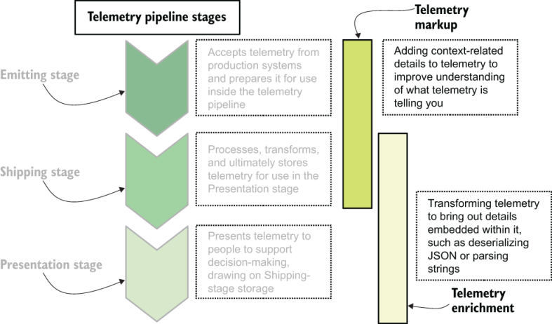

图 6.1 遥测管道阶段。遥测标记发生在发射和运输阶段，而遥测丰富发生在运输和演示阶段。标记和丰富发生在所有管道阶段，这是本章的重点。

我们在第 5 章讨论集中式日志记录的演示阶段系统时看到了一个很好的丰富示例。图 5.14 为我们提供了遥测管道能够从 Cisco 防火墙的发射中提取的一长串字段：

```
Mar 22 19:50:51 asa1.net.prod.internal %ASA1: Teardown of UDP connection 162121 for outside:1.1.0.0/53 to dmz2:192.0.5.119/49522 duration 0:00:00 bytes 136
```

图 6.2 显示了我们的遥测管道能够从这一日志行中提取的大量详细信息。

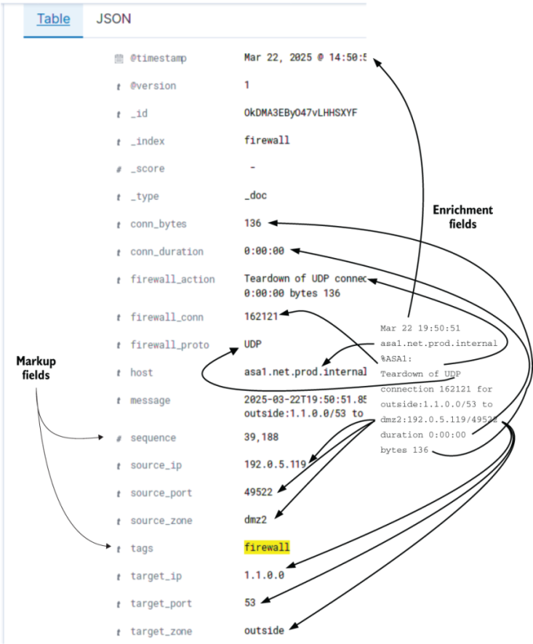

图 6.2 运行完整个遥测管道后，Cisco ASA 日志行（位于右侧所有箭头的中间）变成此处显示的所有字段。箭头从源文本指向左侧显示的丰富字段。字段列表左侧的箭头指向两个标记字段——由遥测管道组件创建的上下文详细信息。该图是来自硬件系统的遥测丰富的典型示例。

在彻底丰富之后，思科生成的日志行为我们提供了包含大量详细信息的事件，更重要的是，提供了大量可搜索和索引的详细信息，这将使执行涉及防火墙数据的研究变得更加容易。本章介绍我们的遥测管道产生的附加价值：

- 第 6.1 节深入探讨了发射阶段应用的标记类型。
- 第 6.2 节描述了运输阶段的标记和丰富技术。
- 第 6.3 节介绍了演示阶段提供的丰富内容。
- 第 6.4 节介绍了四种遥测风格中的每一种，并简要描述了每种风格如何偏好标记和丰富。

## 6.1 发射阶段的标记

在本节中，我们将介绍可以在遥测管道的第一阶段（发射阶段）中完成的各种标记和丰富。发射阶段是生产系统生成的遥测数据进入遥测管道的阶段，它可以从任意数量的源执行此操作。软件生成的遥测数据是最多样化的遥测数据之一，而硬件系统发出的遥测数据是最标准化的（几乎总是使用 Syslog，尽管某些硬件系统更喜欢 SNMP）。图 6.3 将图 6.1 放大到本节的重点。

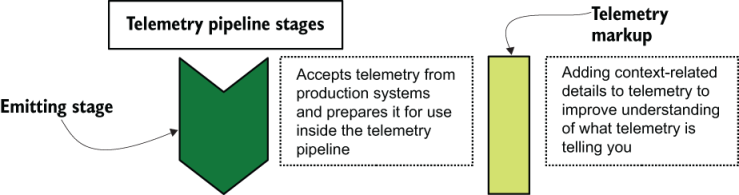

图 6.3 发射阶段和遥测标记。发射阶段是应用标记的最佳位置，因为它最接近生产系统及其上下文。

发射阶段是应用标记（已发射事件上下文的线索）的最佳位置，因为发射器拥有围绕正在发射的内容的最可用上下文。应用标记的绝对最佳位置是生产系统本身内部，例如我们在第 2.1、3.1 和 4.1 节中看到的发射器和发射器/发货器函数。当你为软件系统添加上下文时，有用的上下文项可以包括发出遥测数据时代码所在的类、方法和函数调用，以及有用或有趣的参数（只要它们不是隐私或隐私）健康相关）。对于硬件系统，有用的上下文可能由接收遥测数据的 Syslog 服务器应用，这更多的是运输阶段的功能（在 6.2 节中详细介绍）。对于 SaaS 平台，排放格式和遥测可能是由平台设置的，你必须适应；同样，运输阶段可能是最有用的标记和丰富注入点。本节主要涵盖软件系统并标记其排放。

在第 3.1.2 节中，我们研究了一个实现度量记录器的 Python 模块，该模块装入基于 Redis 的列表结构（清单 3.2）。该部分中的代码在列表中生成类似于以下 JSON 结构的条目：

```json
{
  "metric_name": "pdf_pages",
  "metric_value": 3
}
```

该 JSON 被插入到名为 `counters` 的 Redis 列表（队列的一种形式）中。 JSON 和列表名称为我们提供了清单 3.2 生成的三个遥测点：

- 列表名称 ( `counters` )
- 指标的名称 ( `pdf_pages` )
- 指标的值 ( `3` )

三项构成了遥测的最小列表；有关代码执行发生位置的唯一上下文以度量名称进行编码。在演示阶段，调查执行情况的人员无法深入了解生成示例 JSON 的特定主机上运行的代码。要深入了解运行代码的主机，我们需要将 `hostname` （至少）添加到指标记录器发出的遥测数据中。如果我们想更深入地研究，我们可以添加进程标识符 ( `pid` ) 来告诉提问者哪个主机上的哪个进程发出了我们的指标。如果代码具有该信息，那么最好知道我们的软件的哪个版本或版本发出了该指标（ `version_id` ）。清单 6.1 重写了清单 3.2，添加了三个新的与上下文相关的遥测数据，并使用一个名为 `metadata` 的特定于程序的数据结构，其中包含有关特定用户交互的上下文。

注意此列表需要先安装 `redis` 模块才能执行。在目录中创建一个名为 version.py 的文件，并在其中定义 `__version__` 。

清单 6.1metrics.py：发送到 `redis` ，带有上下文相关的遥测

```python
import redis
import json
import socket                                      ❶
import os                                          ❶
from version import __version__                    ❶
 
redis_client = redis.Redis( host=’log-queue.prod.internal’)
 
def __context_telemetry(metadata):                 ❷
  context = {
    "hostname" : socket.gethostname(),
    "pid" : os.getpid(),
    "version_id" : __version__,
    "payment_plan" : metadata['payment_plan']
  }
  return context
 
def counter(msg, metadata, count=1):
  """Emits a metric intended to be counted or summarized.
 
  Example: counter("pages", metadata, "15")
  """
  base_metric = {
    "metric_name" : msg,
    "metric_value" : count
  }
  context = __context_telemetry(metadata)          ❸
  metric = { **base_metric, **context }            ❹
  redis_client.rpush('metrics_counters', json.dump(metric))
 
def timer(msg, metadata, count=1):
  """Emits a metric for tracking run-times.
 
  Example: timer("convert_worker_runtime", metadata, "2.7")
  """
  base_metric = {
    "metric_name" : msg,
    "metric_value" : time
  }
  context = __context_telemetry(metadata)          ❺
  metric = { **base_metric, **context }            ❻
  redis_client.rpush('metrics_timers', json.dump(metric))
```

❶ 导入获取上下文相关遥测所需的模块

❷ 生成上下文相关遥测数据的私有方法

❸ 获取上下文相关的遥测数据

❹ 合并两个哈希以创建具有上下文遥测的统一哈希

❺ 获取上下文相关的遥测数据

❻ 合并两个哈希以创建具有上下文遥测的统一哈希

清单 6.1 生成的 JSON 文档比清单 3.2 生成的文档具有更多遥测数据：

```json
{
    "hostname": "ebulent-gnu.euc1.prod.internal",
    "pid": 13221,
    "version_id": "2025.02.19.8cd321b9",
    "payment_plan": "2023a1cdb4",
    "metric_name": "pdf_pages",
    "metric_value": 3
}
```

图 6.4 描述了这个哈希是如何构建的。

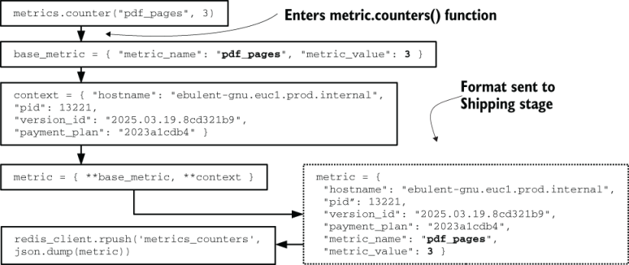

图 6.4 如何使用额外的上下文相关详细信息（标记）构建指标发射。 `metrics.counters()` 函数向该函数的所有调用添加一组标准详细信息（主机名、进程标识符、软件版本号和付款计划标识符）。然后标记的哈希值被发送到 Shipping 阶段（在本例中为 `redis` ）。我们之所以能够添加这些细节，很大程度上是因为该功能是在生产软件本身内部运行的。

这里生成的 JSON 包含更多有关生成指标的详细信息，这使得此遥测比清单 3.2 生成的版本更加有用。更重要的是，添加额外的上下文在 CPU 或 RAM 成本方面是便宜的：

- `hostname` 由单个系统调用获取，该系统调用从操作系统内核检索（大部分）静态值。在大多数情况下，此调用没有磁盘访问权限。
- `pid` 是环境中所有正在运行的进程都具有的遥测数据，并被视为静态标识符。
- `version_id` 在代码中静态定义。在编写此指标记录器时花额外的时间添加上下文可以极大地提高所生成指标的实用性。
- `payment_plan` 在指标发出之前就已设置，并且是指标发出时的简单哈希查找。

这种添加上下文相关遥测技术的技术是分布式跟踪如何提供其价值的秘密之一。让我们再看一下图 5.20，此处复制为图 6.5。

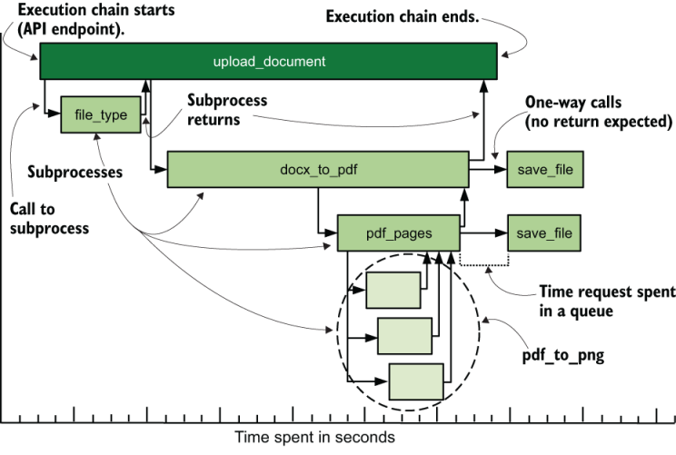

图 6.5 分布式跟踪图表示例显示了包括 `pdf_pages` 在内的执行流程，生成了 .png 格式的三个页面图像。该图表是通过使用作为分布式跟踪软件库的一部分应用的相关标识符而实现的。这些关联标识符通常包括用户添加的与上下文相关的遥测，例如 `process-id` （用于关联来自特定运行实例的遥测）和浏览器 `session-id` （用于关联来自特定运行实例的所有遥测）登录会话）。

图 6.5 中的图表从开始到结束显示了 API 调用 `upload_document` 的单个流程。在 `upload_document` 完成执行之前，执行流程经历了几个阶段。我们可以显示这条链，因为我们在发射时跟踪了与上下文相关的遥测，作为分布式跟踪系统应用的上下文遥测的一部分。发射阶段标记允许构建演示阶段图。清单 6.2 显示了 OpenTelemetry（http://mng.bz/gxJ8）（一个开源跟踪框架）如何标记 `pdf_pages` 的 `perform()` 函数。使用 `pip install opentelemetry` 安装该模块。

清单 6.2 `pdf_pages` ：OpenTelemetry 示例

```python
import os
import socket
from opentelemetry import trace
 
tracer   = trace.get_tracer(__name__)              ❶
hostname = socket.gethostname()
pid      = os.getpid()
 
# Called by queue system
def perform(options)
  attributes = {                                   ❷
    "session_id" : options[session_id],
    "document_id" : options[document_id],
    "process_id" : pid,
    "account_id" : options[account_id],
    "host" : hostname
  }
  with tracer.start_as_current_span("pdf_pages", attributes=attributes):   ❸
    pages = convertPages(options)
    metrics.counter("pdf_pages", pages)
  # end trace                                      ❹
# end perform()
```

❶ 实例化跟踪基础设施

❷ 设置我们的相关标识符和上下文

❸ 使用我们的属性开始跟踪，称为跨度

❹ 导致跨度关闭并发出遥测信号

在清单 6.2 中，我们有一段较大的代码的 `perform()` 函数，它将作业从队列中拉出。这些作业带有一个有效负载：一个名为 `options` 的哈希值。当进入 `perform()` 方法时，我们首先在 `attributes` 哈希中设置相关标识符，并将一些本地上下文放入跟踪方法中。接下来，我们打开一个跨度，一个分布式跟踪术语，用于定义将跟踪其开始和停止时间的代码段。然后我们通过调用 `convertPages()` 来完成 `pdf_pages` 的工作。尽管执行离开了 `perform()` 方法的范围，但它仍然被视为跨度的一部分。在 `convertPages()` 中，如图6.5所示， `pdf_to_png` 被调用了3次。当 `convertPages()` 返回多个页面时，我们使用清单 6.1 中的 metric 函数使用该数字发出一个指标值。当执行离开 `with` 语句时，跨度将关闭，并向 Shipping 阶段报告两种形式的遥测：

- 跨度和属性将报告给分布式跟踪 Shipping 阶段。
- 页面指标的计数是通过清单 6.1 中的 `metrics.counter` 函数报告的。

图 6.6 说明了哪种遥测与上下文相关以及何时应用它。

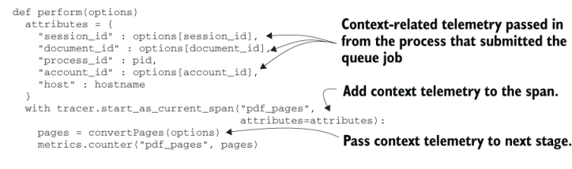

图 6.6 上下文相关元数据如何在清单 6.2 中移动。在这里，我们使用从父函数传递到函数中的与上下文相关的遥测数据，并添加我们自己的遥测数据 ( `process_id` )。该属性散列用于与跨度（记录跟踪上下文的分布式跟踪概念）相关联。请注意，我们还将相同的选项哈希传递给另一个函数。从总体上看，等待子进程完成的速度会很快递归，从而可以构建图 6.5。

这里演示的技术是将相关标识符与队列中的作业负载一起传递。你可以使用远程过程调用模式或将它们用作 API 的一部分来构建传递标识符并等待返回的相同技术。如果你没有分布式跟踪系统，则通过工作请求（队列、过程调用、API 调用等）传递相关标识符仍然可以让你对遥测系统提出更深入的问题。

> 练习6.1
>
> 检查你使用的程序中产生的一些遥测数据。
>
> 程序正在应用什么标记？
>
> 哪些附加标记将使此遥测更有用？

## 6.2 运输阶段的加价和丰富

运输阶段是遥测管道中的第二阶段，接受来自发射阶段的遥测数据。 （有关“运输”阶段的详细信息，请参阅第 3 章和第 4 章。）本节涵盖可在“运输”阶段添加的标记以及“运输”阶段可能应用的丰富类型。当排放阶段不受你控制的软件（例如硬件排放或来自 SaaS 平台的排放）时，运输阶段尤其重要。运输阶段的另一个主要功能是重新格式化遥测数据以存储在呈现阶段使用的存储系统中。图 6.7 说明了运输阶段加价和丰富的重叠性质。

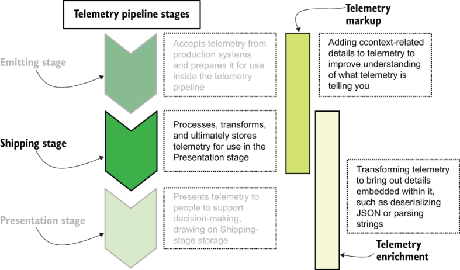

图 6.7 运输阶段负责标记和遥测，并且是唯一同时完成这两项工作的阶段。将遥测数据转换为可存储的格式是一种丰富形式，这就是为什么在从遥测数据中提取详细信息的同时进行格式转换的原因。

本节涵盖以下主题：

- 第 6.2.1 节介绍了添加与生成遥测的上下文相关的遥测，从而极大地增强人们查找相关事件的能力。
- 第 6.2.2 节介绍了遥测中的解码和提取含义以创建字段以提高可搜索性。
- 第 6.2.3 节介绍了将遥测类型从发送格式转换为运输阶段存储系统所需的格式。这些转换操作提高了演示阶段系统分析遥测的能力。

### 6.2.1 在运输阶段应用上下文相关的遥测

发射阶段最适合应用上下文相关的遥测。但是直接从发射阶段接收的运输阶段组件可以应用一些与上下文相关的遥测技术，即使发射系统无法添加它。可以通过第一个运输阶段系统向硬件和 SaaS 生成的遥测添加上下文。本节展示了运输阶段如何应用上下文相关的遥测。让我们看一下一些运输阶段的架构。图 4.1 演示了服务器上存在的 Shipping 管道的组件，如图 6.8 所示。


图 6.8 从无法执行任何其他操作的生产软件传送日志文件。 Cisco Prime 创建日志文件并将其留给本地管理员进行处理。此处，名为 Filebeat 的 Elastic.co 程序被配置为摄取日志文件并将遥测数据发送到名为 `noc_events` 主题的基于 Kafka 的流中。此配置允许本地网络运营团队从集中式日志系统查看 Cisco Prime 遥测数据。

图 6.8 显示了 Cisco Prime，这是用于管理思科网络设备的专有软件包，将遥测数据发送到一组日志文件中。这些发出的日志文件由 Filebeat 使用，后者将遥测数据发送到 `noc_events` 主题上的 Kafka 流中。查看清单 6.1 中生成的与上下文相关的遥测数据，我们可以找到主机名、进程标识符、软件版本和付款计划。 Filebeat 可以提供大部分上下文项目，即使发出程序本身无法这样做：

- 主机名 - Filebeat 在同一主机上运行，因此将此字段添加到从 Cisco Prime 接收的遥测数据中很简单。事实上，Filebeat 默认添加了它。
- 进程标识符—此遥测是最难的，因为它需要 Filebeat 轮询正在运行的进程以确定程序的进程 ID。
- 版本 - Filebeat 与 Cisco Prime 在同一主机上运行，因此可以获取程序的版本。如果版本不经常更改，Filebeat 可以静态配置为应用版本遥测。或者，生产软件部署过程可以更新 Filebeat 配置文件以添加像这样的静态值。
- payment_plan——与清单 6.1 中的 emitter-shipper 函数不同，Filebeat 无法像清单 6.2 那样直接从生产软件接收数据结构。在四种与上下文相关的遥测类型中，这一种是 Filebeat 本身无法提供的。 （事实上，Cisco Prime 并不产生这种遥测数据，即使是在内部也是如此。）

让生产程序应用这些与上下文相关的遥测项目会更好，但如果程序无法生成此遥测数据，或者如果允许此功能的更新被禁止，则运输阶段可以获得此列表的大部分内容。与现成的 Filebeat 不同，针对用例定制编写的交付阶段组件可能会为无法自行添加上下文详细信息的程序应用非常详细的上下文相关遥测。仅当你的不可修改程序是生产系统功能的核心时，这种努力才真正合理，因为维护定制运输组件的软件是一项必须持续支付的维护成本。

> 处理软件中不灵活的日志文件格式
>
> 对于那些希望为其遥测发射提供尽可能多的本地背景的工程师来说，现成的软件根本不提供这些信息，这一直是一个烦恼。如果你正在使用此类软件，一些技术可能可以让你获得所需的内容：
>
> - 将日志记录设置为调试模式。通常，现成的软件能够启用详细模式和调试模式，调试模式会提示发出某些内容时软件所处的内部功能。这里的权衡是调试模式会降低软件性能，并且你将必须处理可能数量大得多的日志数据。
> - 在Linux 主机上使用systemd 和journald。如果你可以将日志流定向到标准输出，则日志将由现代 Linux 主机上的日志处理。 Journald 将提供一个 PID 值，因为它的格式与 Syslog 格式非常相似。
> - 在 UNIX 主机上使用 Syslog。与journald 一样，如果你可以以某种方式将日志流定向到Syslog，你将免费获得主机名和PID。
> - 在 Windows 主机上通过 `sc create` 将程序作为服务运行。 sc 程序会将 stdout 定向到应用程序事件日志，该日志将添加其他几个遥测数据，例如事件的时间戳、运行该事件的用户以及生成该事件的计算机的名称。
> - 在 Docker 下运行程序。如果你已经在使用 Docker 并且熟悉它，那么这种方法效果最佳，但 Docker 的构建目的是捕获标准输出并将该流发送到多个位置，包括系统记录器（即使在 Windows 中）。

对于硬件系统，在与发射器相同的硬件上安装运输组件几乎是不可能的；这种方法减少了运输阶段可能从发射阶段收集的上下文感知遥测数据的数量。图 6.9 演示了一个基本的运输架构，其中 Cisco 防火墙向 Syslog 服务器发送信息。 Syslog 的标准化性质使其成为对硬件制造商有吸引力的运输格式（当他们不将定制遥测系统作为其附加管理平台（例如 Cisco Prime）的一部分时）。采用标准化、基于字符串的遥测并将其转化为现代演示阶段系统可以使用的东西是运输阶段的工作。

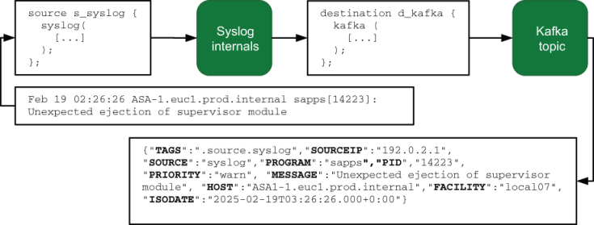

图 6.9 思科防火墙直接向 Syslog 服务器（运输阶段的一部分）发出信号，Syslog 服务器重新格式化收到的遥测数据以发送到 Kafka 主题。这里的转换是从 RFC 定义的 Syslog 格式到订阅该主题的另一个 Shipping-stage 系统将使用并进一步处理的 JSON 编码格式。哈希中的所有属性都来自 Syslog 服务器本身或包含发射的 UDP 数据包。

当 Syslog 服务器接收 Syslog 事件（由图 6.9 中的 Cisco 防火墙发出）时，Syslog 服务器已经具有 Syslog 标准定义的许多遥测数据：

- `date` —创建事件时的月、日、小时、分钟和秒
- `facility` —Syslog 标识符，在 Cisco 防火墙上设置 Syslog 转发时静态设置
- `host` —生成事件的防火墙设备的 IP
- `message` ——发射的全文

`date` 和 `host` 是协议中内置的与上下文相关的遥测的有价值的部分。 Syslog 协议本身对多个字段进行编码（如果设备配置为使用它们）。对于具有更完整 Syslog 支持的设备，我们还可以获得 `severity` （事件紧急程度的排名）、 `process-id` （与清单 6.1 中发出的相同）和 `program tag` （识别盒子上的众多进程中的哪一个发出了事件）。不过， `message` 字段的内容很重要。通过 Syslog 发出的程序和硬件知道 Syslog 的局限性，并且经常将与上下文相关的遥测数据插入到 Syslog 事件的纯文本部分中。为了解码这种嵌入式遥测技术，我们需要谈论丰富。

### 6.2.2 提取和丰富飞行中的遥测数据

运输阶段的部分工作是从格式不太好的遥测中提取有趣的遥测，并丰富遥测的每个项目，以提高其在演示阶段的实用性。本节介绍了在运输阶段提供提取和浓缩所需的技术。在大多数情况下，我们解析现有的遥测字段以填充更多字段，尽管某些系统能够根据多个事件中保存的数据来丰富遥测。首先，我们使用第 2 章中的示例，即 Cisco ASA 防火墙的示例输出：

```
Teardown of UDP connection 162121 for outside:1.1.0.0/53 to dmz1:192.0.2.19/59232 duration 0:00:00 bytes 136
```

我们可以在这个字符串中看到一些有趣的项目：

- `Teardown of UDP connection` 为我们提供了一个事件字符串。
- `UDP connection` 为我们提供了所使用的协议 (UDP)。
- `connection 162121` 为我们提供了一个连接号 162121，这可能对关联有用。
- `outside:1.1.0.0/53` 为我们提供了一些详细信息：
  - 使用的接口（外部）
  - 连接到的IP地址（1.1.0.0）
  - 连接到 (53) 的端口
- `dmz1:192.0.2.19/59232` 为我们提供了内部身份的类似详细信息。
- `duration 0:00:00` 告诉我们连接花费了多长时间（一点也不长）。
- `bytes 136` 告诉我们处理了多少数据（136 字节）。

短短的空间里塞满了相当多的信息！从像这样的长字符串中获取遥测数据是集中式日志传输系统的基础，并且有几种主要方法可以实现这一点。第一种方法是使用正则表达式和捕获组。清单 6.3 显示了一个 Logstash 过滤器配置示例，它将提取所有这些详细信息。 （Logstash 是一个 Elastic 程序，旨在成为专用的运输阶段系统。）

清单 6.3 使用 Logstash 提取防火墙字段 `grok{}`

```
filter {
 
  if [facility] == 'local07' and [syslogmessage] =~ “^Teardown” {      ❶
    grok {                                                             ❷
      match => {
        "syslogmessage" => "^%{DATA:firewall_action} %{NUMBER:conn_id} for 
        %{NOTSPACE:target} to %{NOTSPACE:source} duration %{TIME:duration} bytes %{NUMBER:bytes}$"
      }
    }
 
    grok {                                                             ❸
      match => {
        "source" => "^%{WORD:source_int}:%{IP:source_ip}:%{NUMBER:source_port}$"
        "target" => "^%{WORD:target_int}:%{IP:target_ip}:%{NUMBER:target_port}$"
        "firewall_action" => "for %{WORD:protocol} connection"
      }
    }
  }
}
```

❶ 尝试仅解析正确行的条件

❷ 首遍解析

❸ 第二遍解析

当你需要将正则表达式应用于文本并提取字段时，请使用 Logstash `grok {}` 过滤器插件 (http://mng.bz/5W17)。与所有正则表达式引擎一样，匹配模式可能变得难以理解的复杂性，即使对于那些据称维护它们的人（例如我）也是如此。第 11 章介绍了大规模优化正则表达式的使用，第 11.3 节介绍了专门针对此遥测技术的优化。这里的两个 `grok {}` 语句解析出许多字段，并且可以组合成一个 `grok {}` 语句，但会将已经很长的行变成更长的行（你将在第 11 章中看到） ; 这是一个愚蠢的）。第一个语句对数据进行第一次传递，捕获多个字段。图 6.10 显示了它的工作原理。

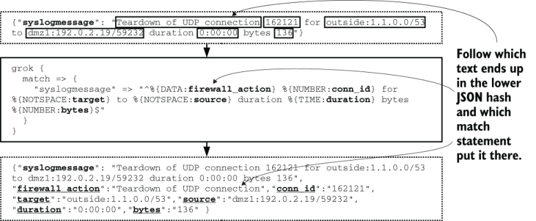

图 6.10 我们的防火墙发射如何通过第一个 `grok{}` 语句转换为具有更明确细节的散列。原始哈希中与 `grok{}` 匹配的文本被装箱；最终哈希中的新属性带有下划线。

第一个 `grok` `{}` 语句为我们提供了六个新字段： `firewall_action` 、 `conn_id` 、 `source` 、 `target` 、 `duration` 和 `bytes` 。然后处理转移到第二个 `grok {}` 语句，该语句添加了更多字段（图 6.11）。

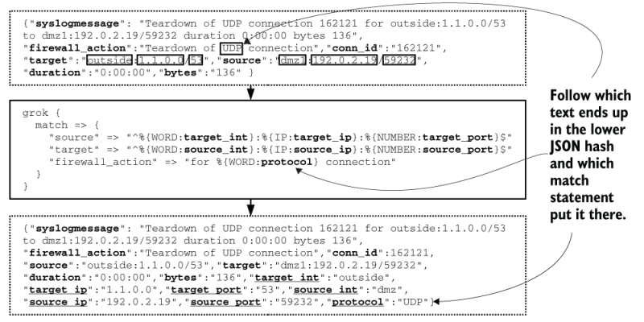

图 6.11 我们的防火墙发射如何被第二个 `grok{}` 语句进一步转换。 `grok{}` 语句捕获的原始哈希中的文本被装箱。最终声明中的新字段带有下划线。添加了七个新字段，这些字段源自从第一个 `grok{}` 语句解析的字段。所有 13 个字段都可以源自一个庞大且几乎难以理解的 `grok{}` 语句，但将它们分开可以使流程更易于遵循（如果处理速度较慢）。

在这两个 `grok {}` 语句之后，我们向遥测添加了 13 个新字段：

- `firewall_action` ——UDP连接的拆除
- `conn_id`—162121
- `target` —外部：1.1.0.0:53
- `source`—dmz:192.0.2.19:59232
- `duration`—0:00:0
- `bytes`—136
- `source_int`—dmz
- `source_ip`—192.0.2.19
- `source_port`—59232
- `target_int`—outside
- `target_ip`—1.1.0.0
- `target_port`—53
- `protocol`—UDP

由于 Logstash 的 `grok {}` 过滤器的工作方式，所有这些字段都将是字符串数据类型。如果我们想将数字转换为整数，我们可以通过修改捕获语句来实现，例如捕获 `conn_id` ：

```
%{NUMBER:conn_id:int}
```

将所有这些字段放入存储后，演示阶段系统将能够使用丰富的数据构建可视化和报告。对于防火墙事件源，能够排除已知的事件有助于隔离感兴趣的事件。图 5.16（此处复制为图 6.12）演示了排除已知 DNS 服务器以帮助查找接触未知 DNS 服务器的内部用户。

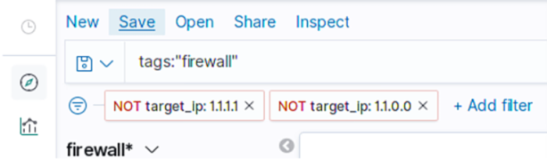

图 6.12 排除已知的 DNS 服务器以查找感兴趣的事件。基本过滤器查找所有防火墙事件 ( `tags:"firewall"` )。然后使用两个显式排除修改搜索，删除 `target_ip` 设置为 1.1.1.1 或 1.1.0.0 的事件。此后，只有 `target_ip` 地址不是两个众所周知的值的事件才会可见并值得调查。

尽管正则表达式很强大，但它们却以速度慢而闻名。在防火墙发射等格式众所周知且不变的情况下，我们有其他方法来有效地生成这些字段。 Logstash 有另一个名为 `dissect {}` 的过滤器，它不依赖正则表达式；相反，它依赖于更简单的捕获表达式。清单 6.4 重写了 Logstash 配置以使用 `dissect` 而不是 `grok` 。

清单 6.4 使用 `dissect` 提取防火墙字段

```
filter {
 
  if [facility] == 'local07' and [syslogmessage] =~ “^Teardown” {
    dissect {
      mapping => {
        "syslogmessage" => "Teardown of %{protocol} connection %{conn_id} 
        %{source} to %{target} duration %{duration} bytes %{bytes}"
      }
    }
 
    dissect {
      mapping => {
        "source" => "%{source_int}:%{source_ip}:%{source_port}"
        "target" => "%{target_int}:%{target_ip}:%{target_port}"
      }
    }
  }
}
```

清单 6.4 比清单 6.3 更易于阅读，提高了可维护性并且执行速度更快。性能改进来自 `dissect` 解析 Syslog 字符串的方式。不在大括号内的所有内容都被视为分隔符，分隔符之间的字符串是字段；就是这样。不过， `dissect` 并不是与 `grok` 一对一等价的；我们缺少 `firewall_action` 字段。我们缺少该字段，因为该字符串无法将字符串的该部分与其余部分分开（定界）。 `dissect` 更简单且更易于维护，但灵活性有所下降。

> 为可维护性而编写是好的；你应该这样做
>
> 可维护的系统是一种理解系统正在做什么的障碍较低的系统。几十年来，正则表达式一直被认为对于那些不知道每个符号含义的人来说是胡言乱语，而对于我们这些知道这些含义的人来说，它们仍然可能是胡言乱语。需要时间来描绘那里发生的事情。正则表达式的功能非常强大，但是使用这种功能会限制在出现问题时修复表达式的人员。如果你可以在不使用复杂的正则表达式的情况下解决字符串解析问题，则可能会提高整个系统的可维护性。
>
> 这个概念一般适用于软件系统。任何旧的代码库几乎肯定都有一个函数/类/方法太长，做得太多，并且在其顶部有一条注释说
>
> ```
> # Number of people who tried to refactor this and gave up: 7
> ```
>
> 这样的代码几乎总是与边缘情况相关的多年积累的疤痕组织的结果。像这样的代码能够在风格重构中幸存下来，因为可维护性的暗算意味着将所有代码放在一个地方是最不坏的选择，而不是将其全部隐藏在分散在整个代码库中的八个一次性函数中，这需要白板和大量的粘性标签跟踪逻辑流程的注释。最不坏并不好，但有时，现实意味着最不坏就是你能做到的最好的。面对可能难以维护的复杂代码时，需要考虑以下两点：
>
> - 如果你必须在时尚和可维护之间做出选择，请倾向于可维护。智力的纯洁性不值得为维护而烦恼。
> - 作为专家，你认为可维护的内容对于不了解你的全部背景的人来说通常是无法维护的（另请参阅：撰写本书）。让其他人做出可维护性决策（另请参阅：所有参与本书工作的编辑和校对人员）。当你离开后，你的代码仍然存在；为它制定计划。

`dissect` 也缺乏像 `grok` 那样将字段转换为特定数据类型的方法，但 Logstash 提供了一种将任意字段转换为特定类型的方法。由于每种数据类型所施加的限制，数据类型对于存储和表示阶段系统非常重要。许多系统很乐意将字符串 `"12"` 添加到字符串 `"13"` 中以产生 `"1213"` 之和，但是整数 12 可以添加到整数 13得到25。

> 练习6.2
>
> 给定以下遥测样本，请尽可能多地识别可丰富的遥测数据。
>
> ```
> 2025-02-19T00:59:26.142  INFO  9202 --- [expl-http-api] c.a.s.s.t.CallbackWorker : API callback triggered for account 3671 using APPID 9285861, response 403
> ```

### 6.2.3 运输阶段转换字段类型

在本节中，我们将介绍 Shipping 阶段中可能执行类型转换的位置，并讨论为什么要转换类型。将字符串添加在一起会产生不一致的结果，如第 6.2.2 节末尾所述，因此将数字的字符串表示形式转换为数字将使稍后的数学运算更容易。清单 6.5 给出了一个示例，它将清单 6.4 中解析的字符串值转换为适当的数据类型。

清单 6.5 将 `dissect` 编辑字段转换为其正确的数据类型

```
filter {
  if [facility] == 'local07' and [syslogmessage] =~ "^Teardown" {
    dissect {
    [... Listing 6.4 code ...]
    }
 
    mutate {
      convert => {
        "conn_id"     => "integer"
        "bytes"       => "integer"
        "source_port" => "integer"
        "target_port" => "integer"
      }
    }
  }
}
```

让我们看看这个 `mutate {}` 语句对图 6.11 中的 JSON 哈希做了什么。现在我们的遥测数据类型正确，如图 6.13 所示，我们可以对此遥测数据执行的分析得到了放大。在运输管道中创建一个步骤来确保字段数据类型符合存储的期望是一个好主意，如果运输阶段技术允许，你应该实现它。

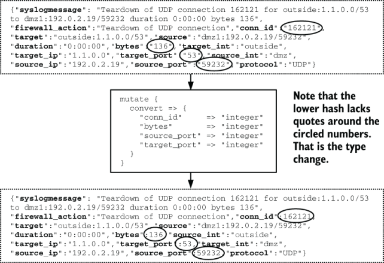

图 6.13 对我们的防火墙遥测进行类型转换，将重要值转换为数字而不是字符串。此 `mutate {}` 语句将四个值转换为整数。由于 JSON 格式化数字的方式，这段代码所做的似乎就是删除数字周围的引号。当这种重新输入的遥测数据到达运输阶段存储时，差异将是巨大的；你可以对基于数字的数据而不是基于字符串的数据执行不同的分析。将遥测数据转换为正确的类型非常强大。

合理化数据类型是一个好主意的一个经典原因可以通过查看布尔值及其转换方式来解释。布尔值是 `true` 或 `false` 。然而，将真值表示为字符串或数字有几个约定。在某些情况下，所有这些值都相当于 `true` （但重要的是，并非全部）：

- 整数 1
- 整数 0（不常见）
- 大于零的整数或浮点值
- 不等于零的整数或浮点值（可能为负数）
- 字符串 `'t'`
- 字符串 `'true'`
- 字符串 `'y'`
- 字符串 `'yes'`
- 任意长度大于零的字符串

运输阶段的主要作用之一是将数据类型转换为存储系统可以处理的类型，因此请务必在可行的情况下将类型转换为字符串。当你转换为具有布尔类型的存储系统时，最好在传送管道中进行类型转换，而不是依赖于存储系统的布尔转换逻辑。在管道中进行类型转换使转换变得明确，并将转换逻辑放在更易于维护的位置（请参阅第 6.2.2 节中的侧边栏）。

第 2.1.4 节介绍了使用 JSON 和 YAML 等对象编码格式作为发射的一部分的概念，第 4.2 节介绍了一般选择遥测发射格式的决策过程。运输阶段是将格式从协商的标准化格式（第 4.2 节）转换为存储系统所需的格式的主要场所之一。一般来说，对象编码格式，如 JSON、YAML 和 XML（有关 protobuf 的讨论，请参阅第 4.2 节中的边栏）适合表示多种数据类型：

- Strings
- Numbers
- Arrays
- Hashes

虽然字符串是一种简单类型，但数字却不是。整数与浮点数不同，某些存储系统对这两种类型的处理方式有所不同。这种存储差异对你是否重要取决于你的数据，但你应该意识到这种差异是可能的。布尔类型在这些对象编码格式中并不是唯一表示的，因此如果存储使用布尔值，则某些东西（可能是存储系统本身）将需要将字符串和数字转换为适当的 `true` 和 `false` 值。

> 数据类型和数字
>
> 整数（不带小数的数字）和浮点（带小数的数字）类型是基本的计算数字类型，甚至可以追溯到真空管时代之前。对整数执行数学运算与对浮点数执行数学运算需要不同的逻辑，因此 CPU 在一项任务上的表现可能比另一项任务更好或更差。推出 IBM PC 的 Intel 8088 CPU 擅长处理整数，但快速进行浮点计算需要额外的芯片：称为 8087 的数学协处理器。如今，常规的 Intel 或 AMD CPU 可以进行广泛的浮点数学运算芯片上，但数学协处理器的角色已转移到图形处理单元，例如 NVidia 生产的图形处理单元。 IEEE 794 标准 (1985) 定义了浮点数学在硬件内部的发生方式。
>
> 程序员熟悉的另外两个概念是精度和溢出，它们与分配用于保存数字的位数有关。 8 位宽整数可以保存 2 的八次方或 2 的七次方（如果该值需要包含正数和负数）。尝试存储无法用八位保存的数字会导致整数溢出。 2038 年问题的存在是因为那时 UNIX Epoch 计数器将溢出 32 位有符号整数并变为负数。
>
> 精度适用于浮点数。浮点数不像整数那样容易溢出；它们只是变得不那么精确。浮点数的位宽决定了该数字精确到的小数位数。
>
> 当谈到遥测时，数字具有不同的含义。一些遥测系统制造商注意到，当人类绘制数字（尤其是浮点数）时，他们很少会查看第七位数字之后的数字。对遥测系统数字执行的操作很少是精度问题放大和复合的复杂多级分析功能，而是简单的方法，其中不精确性被未显示的数字隐藏。
>
> 由于这一观察结果，遥测存储系统中开始出现缩放浮子的想法。缩放浮点数是一个整数，带有第二个整数来记录小数位。作为执行复杂数学函数的真正格式，缩放后的浮点数非常不精确，但对于仪表板来说它绝对足够好。缩放浮点数比真正的浮点数存储效率更高，这在资源配置方面很重要。如果你存储大量浮点数，则尽可能使用缩放浮点数会节省金钱。

你可以在多个位置转换数据类型，并且某些（更大、更长、相当复杂）管道在最终存储数据之前会多次转换数据。清单 6.5 演示了管道中间的转换。但是类型转换也可以在运输阶段开始时发生，此时发出的遥测数据进入运输系统。在清单 6.6 中，我们使用 Logstash 来获取由运行代码页 1256（不是 Unicode）的旧阿拉伯语言 Windows 系统生成的文件。

清单 6.6 使用 Logstash 将旧的 Windows 阿拉伯语转换为 UTF-8

```
input {
  file {
    path => "C:/Program Data/AppLog/output.txt"    ❶
    codec => plain {
      charset => "Windows-1256"                    ❷
    }
  }
}
```

❶ 摄取文件的路径

❷ 告诉Logstash什么字符集字符串将被编码为

该文件由生产系统生成，并由 Logstash 摄取。 `file {}` 插件告诉 Logstash 期望该文件位于 Windows 代码页 `Windows-1256` 中。 Logstash 始终在内部将字符串转换为 UTF-8；因为 Logstash 知道字符串进入管道的格式，所以它知道如何将文本转换为 UTF-8。任何更高版本的 `filter {}` 和 `output {}` 插件都将处理 UTF-8 数据。

> 警告 
>
> 并不是每个人都有幸能够单独使用 UTF-8 字符串。 Java 程序员比使用其他编程语言的程序员更频繁地看到 UTF-16 字符串，并且 Windows 在 Windows-NT 后的大部分历史中都优先使用 UTF-16 方言。运行在 20 世纪 60 年代和 1970 年代首次编写并不断更新的代码的大型机和其他系统通常根本不会以 Unicode (EBCDIC) 形式发出。了解如何转换字符串编码将使你能够构建遥测管道来支持更多的生产系统。

类型转换通常也发生在运输阶段存储系统和向其发送数据的系统之间的接口处。将遥测数据插入存储系统的适配器可以转换类型，存储系统本身也可以转换类型。在清单 6.7 中，我们有一个 Logstash 输出适配器，将遥测数据发送到 InfluxDB 时间序列数据库中，我们将类型作为适配器的一部分进行转换，而不是信任 InfluxDB 正确转换类型。

清单 6.7 使用 `influxdb` 输出适配器执行数字的类型转换

```
output {
  influxdb {
    host => "influxdb.euc1.prod.internal"    ❶
    db => "app_metrics"                      ❷
    measurement => "java_metrics"            ❸
    data_points => {                         ❹
      "host" => "%{host}",                   ❹
      "pid" => "%{pid}",                     ❹
      "version_id" => "%{version_id}",       ❹
      "name" => "%{counter_name},            ❹
      "value" => "%{counter_value},          ❹
      "type" => "counter"                    ❹
    }
    send_as_tags => [                        ❺
      "host",                                ❺
      "pid",                                 ❺
      "version_id",                          ❺
      "name",                                ❺
      "type"                                 ❺
    ]
 
    coerce_values => {                       ❻
      "value" => "float",                    ❻
      "pid"   => "string"                    ❻
    }
  }
}
```

❶ InfluxDB 服务器的主机名

❷ 将指标发送到的数据库

❸ 将指标发送到的测量（表）

❹ 发送到 influx 的字段列表

❺ 视为索引值的字段列表

❻ 将字段类型转换为特定的 InfluxDB 类型。

清单 6.7 中的 `coerce_values` 部分强制 `value` 字段的数据类型为浮点型，将 `pid` 字段的数据类型强制为字符串型。虽然进程标识符是一个数字，但它在这个数据库系统中的值是充当标识符，因此将其转换为字符串将使其更强大。图 6.14 显示了这个转换过程。

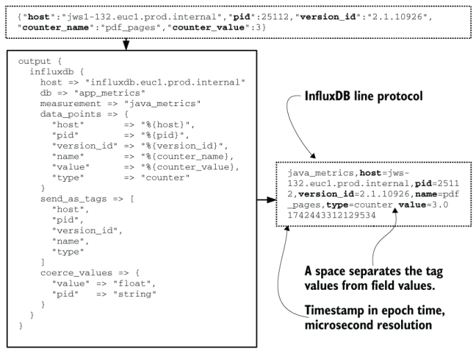

图 6.14 作为 `influxdb` 输出适配器的一部分执行的类型转换。我们在顶部的 JSON 哈希中看到传入数据，其中 `pid` 和 `counter_value` 设置为数字类型。在右侧，我们看到 `output` `{}` 块如何将此数据结构转换为 InfluxDB 线路协议。 `value` 被类型转换为浮动作为适配器的一部分。如果指定为整数，则 `value` 将表示为 `3` ，不带小数点。

要查看存储系统本身进行类型转换的示例，让我们看一下 Elasticsearch，它提供了一种以预定义字段类型的索引模板的形式转换类型的方法。在清单 6.8 中，我们将 `priority` 字段设置为关键字 `type` ，将 `percent_cpu` 字段设置为特殊类型。

清单 6.8 Elasticsearch 模板定义类型和类型转换行为

```
{
  "mappings": {
    "_doc": {
      "properties": {
        "percent_cpu": {
          "type": "scaled_float",
          "scaling_factor": 1000
        },
        "priority": {
          "type": "keyword"
        }
      }
    }
  }
}
```

`keyword` 类型是一种特殊形式的字符串，索引较少，但生成可视化效果更有效。 `scaled_float` 类型是浮点数的自定义形式，它存储为整数，但允许小数值；在本例中，它被设置为包括小数点后三位。在 Elasticsearch 中，当新事件插入数据库时，数据类型会发生转换。对于 `percent_cpu` ，Shipping 阶段将源指标从它开始使用的字符串转换为双精度浮点值。当指标被引入 Elasticsearch 时，它会进一步转换为缩放后的浮点数。

## 6.3 演示阶段的丰富

遥测管道的演示阶段是为人类显示遥测数据的阶段，也是遥测系统的公众形象。第 5 章详细介绍了演示阶段，但本节重点介绍演示阶段可以提供的标记和丰富类型。作为遥测管道的最后一个阶段，演示阶段使用已由发射和运输阶段标记和丰富的遥测数据来提供更多详细信息。

遥测的分布式跟踪风格充分利用了遥测的表示阶段丰富，因为它侧重于使用相关标识符来链接遥测。根据技术细节，遥测的链接可能会作为存储的一部分发生在运输阶段，但呈现阶段会获取这些相关性并显示它们，以改进人们的决策和故障排除。图 6.5 给出了清单 6.2 所完成工作的背景，是分布式跟踪系统可以基于相关数据生成的显示类型的示例，并且大部分这种丰富都发生在演示阶段。图 6.5 在此复制为图 6.15。


图 6.15 一个正常的、无异常的分布式跟踪示例，显示了 .docx 文件的转换，该文件生成了三个页面。该图演示了此特定执行的调用堆栈（以服务的形式，而不是函数或类的形式）。像这样格式的图表为想要解决问题的人提供了广泛的上下文，并且上下文可以加快解决速度。

演示阶段的丰富不是为了修改遥测以获得更好的性能，而是更多地创建对人类有用的视觉显示。图表和图形与带有精选列的表格一样都是视觉显示。图表上的趋势线和通过遥测构建的报告的预测列是演示阶段系统产生的另一种丰富形式。

第 5.1.3 节提供了一系列图表，探索当你通过清单 6.1 中的metrics.py 文件操作 `pdf_pages` 函数生成的指标数据时，通过使用聚合函数可以丰富的可能性。每个聚合函数都提供了一组遥测数据的不同视图，使研究人员能够了解数据的形状以及可能存在的模式。这里的丰富是由显示指标数据的系统提供的。

对于集中式日志记录数据，主要是由发射和运输阶段丰富和标记的字符串，可以进行不同形式的丰富。给定一组集中式日志记录遥测数据，以下是你可以制作的一些示例图表和报告：

- 将特定错误消息随时间的发生情况绘制图表，以确定在最近的软件发布后错误是增加还是减少。
- 为特定应用程序绘制优先级为 `CRITICAL` 的消息的出现情况，以识别尖峰模式。
- 绘制来自特定功能的 `INFO` 与 `CRITICAL` 消息的比率，以隔离故障率较高的时段。
- 绘制来自特定客户的 API 调用计数的图表，以了解他们的请求模式。
- 将发出最多 `CRITICAL` 消息的代码类绘制成图表，以确定技术债务工作的重点领域。
- 报告与公共 Ruby Gems 服务器建立连接的主机，以识别未配置为使用代理系统的软件。
- 绘制与恶意软件命令和控制服务器建立网络连接的内部主机的数量，以确定有多少受感染的主机。
- 报告运营团队使用 sudo 以确保遵循变更控制程序。

图 5.12（此处再现为图 6.16）为我们提供了演示阶段系统中丰富数据的一个示例。

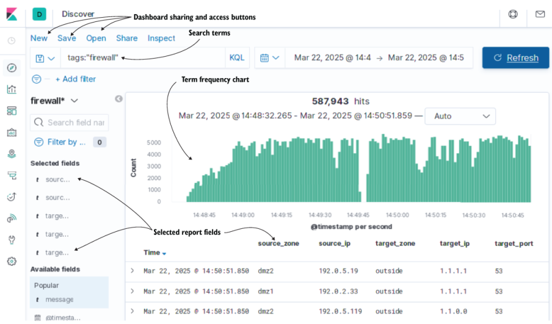

图 6.16 提供丰富的遥测视图，显示频率图表和结果报告。该仪表板软件（来自 Elastic.co 的 Kibana 7）提供了用于集中日志记录的良好演示阶段系统所需的所有功能。

图 6.16 为我们提供了几分钟内发出的 DNS 请求的视图，使用由运输阶段丰富的遥测数据（有关说明，请参阅第 6.2.2 节）来提供我们在报告中看到的字段。发出的字符串没有标记或丰富，因此当新事件流经管道时，运输阶段提取并丰富了遥测数据。报告中的每个字段都可以在搜索查询中使用，以将图形限制为感兴趣的遥测数据。

大型 SaaS 供应商使用的集中式日志记录技术（例如 Splunk 和 Sumo Logic）实现了更明确的演示阶段丰富。当你运行大型分布式系统的目的是向大量客户提供集中式日志记录服务时，某些规模问题就会开始出现，例如基数。 （有关系统中该问题的更多信息，请参阅第 14 章。）对于 SaaS 提供商的规模而言，一种经济的方法是在演示过程中处理对象编码格式（如 JSON）的解码，而不是作为运输阶段的一部分。你提供一个查询，广泛选择你需要的数据；作为查询第二阶段的一部分，包含 JSON 数据的字段将转换为字段（反序列化）。此过程生成的字段可在以后的查询中使用或作为报告的一部分。清单 6.9 提供了 Sumo Logic 查询的示例。

清单 6.9 在 Sumo Logic 中使用运输阶段标记

```
(_collector="FrankfurtDC”)                         ❶
| json field=_raw "syslog.severity" as severity    ❷
| json field=_raw "syslog.facility" as facility    ❷
| json field=_raw "syslog.hostname" as host        ❷
| where severity = "WARN”                          ❸
```

❶ 选择要操作的数据集

❷ 通过解析JSON向数据集添加字段

❸ 使用添加的字段作为条件来减少返回的数据集

第一行选择我们感兴趣的数据集，并在用户界面中选择时间范围（此处未显示）。第二、第三和第四行使用管道运算符来解析 `_raw` 字段中的 JSON blob，以提取三个字段并使它们成为所显示事件的一部分。第五行是使用创建的字段之一的条件。所有三个提取的字段均可用于报告。

这种演示阶段的丰富功能可能很强大，但是演示阶段系统要做的转换工作越多，对于提出问题的人来说，它们似乎就越慢。 SaaS 提供商允许这种系统，因为他们的演示系统销售他们的产品，因此他们投入多年的工程技术来快速提供这种体验。诸如此类的功能尚未在开源解决方案中广泛使用，但这种情况正在改变； GrafanaLabs 相对年轻的 Loki 产品已经专门使用这种演示阶段丰富风格！

## 6.4 遥测风格如何影响标记和丰富

第 6.1 节到第 6.3 节介绍了如何在遥测管道的每个阶段进行标记和丰富。本节重点介绍四种遥测样式及其对标记和丰富发生位置的偏好。我们关注的风格是

- 集中式日志记录——第一个从多计算机基础设施中出现的遥测系统
- 安全信息事件管理 (SIEM) — 一种集中式日志记录形式，专门用于涉及事件响应和合规性的安全团队工作负载
- 指标——一种在线存储信息并通过关注数字和一些标签来搜索更长时间的信息的方法
- 分布式跟踪——专门用于跟踪跨分布式系统的执行流和相关遥测事件

我们将依次讨论每种样式，并解释它们为什么要丰富和标记它们所做的事情。最先进的技术在不断变化，因此当你阅读本书时，可能会有一些新的样式未在此列表中。如果你发现自己想知道新风格可能适合哪里，请阅读接下来的几节以发现趋势。

> 为什么时间戳格式和正确时间很重要
>
> 遥测系统有一个简单的规则：生成时间戳的所有时钟必须同步到同一源，以确保你的演示系统可以正确排序来自所有系统的遥测数据。
>
> 此规则有一个推论：时间戳格式必须尽可能精确（如果需要，精确到毫秒、微秒或纳秒），以改进演示系统的排序。
>
> Syslog RFC 3164 指定了精确到秒并忽略年份的时间戳格式。任何解析这些时间戳的东西都必须猜测遥测数据是在哪一年发出的——对于毫秒很重要的高分辨率遥测系统来说，这不是一个好的选择。
>
> Syslog RFC 5424 阐明了 Syslog 时间戳格式，以允许更准确的时间戳，例如符合 ISO8601 的时间戳。
>
> ISO8601 是负责像 2025-02-19T19:57:18.922-01:00 这样的时间戳的格式，表示 2025 年 2 月 19 日 19:57、18 秒、922 毫秒，与 UTC 的时区偏移量为 –1。
>
> ISO8601 是一种方便的时间戳格式，因为它对每个数字使用固定宽度，允许解析器采取捷径来加速解析。这种格式是一种高度机器可解析的格式，你应该在任何允许的地方使用它。
>
> 请注意：时间戳越精确，时钟漂移就越明显。 NTP 协议非常擅长保持服务器同步，但其精确度存在下限。当你具有微秒或纳秒分辨率时，你将开始看到事件的发生与实际发生的顺序有点不一样，并且你无法判断情况是否如此。

### 6.4.1 通过集中日志记录进行标记和丰富

集中式日志记录是第一个程序的现代后代，它发出面向操作员和开发人员而不是程序用户的输出流。集中式日志记录系统获取整个生产系统中程序的日志输出，并将其集中到一个地方，以便操作员、工程师和经理进行搜索和提问。它是最古老的遥测风格，可以追溯到 1980 年左右的 Berkeley Software Distribution。

Syslog、Windows 事件日志和 Systemd 的日志是基于操作系统的平台，旨在收集给定服务器上的日志并有选择地将其发送到其他地方。应用程序可以选择构建自己的遥测传输系统；也许他们将遥测数据发送到队列或流中，或者直接发送到数据库中。所有这些交付方法的一个共同因素是集中式日志记录涉及传送、操作和搜索字符串。图 6.17 提供了图 1.3 中的示例。

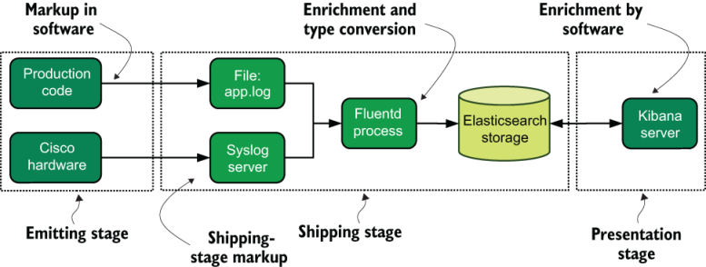

图 6.17 图 1.3 包含指向集中式日志记录首选进行标记和丰富的位置的指针。我们在这条管道中看到了软件和硬件生成的遥测技术。软件执行自己的标记，而思科硬件则依赖运输阶段组件来完成该工作。丰富主要作为运输阶段的一部分进行处理，其余部分由演示阶段软件提供。集中式日志记录更多地依赖于运输阶段的丰富而不是指标。

对于集中式日志系统，以下是有关何时何地丰富和标记遥测数据的一些指南：

- 如果 Emitting 阶段无法进行上下文相关的标记（请参阅第 6.2.1 节），例如对于硬件系统，则 Shipping 阶段可用于根据记录的字符串提取和丰富遥测数据，如清单 6.4 和 6.5 所示。
- 如果软件正在发送遥测数据，则它具有在发送遥测数据时（即在发送阶段之前或期间）添加上下文相关标记的最佳上下文。标记可以在发射时直接添加到事件中。
- 如果硬件正在发出遥测数据，它通常会在记录的字符串中包含与上下文相关的遥测数据。运输阶段可以提取上下文相关的遥测数据并丰富演示阶段的遥测事件，如第 6.2.2 节中所做的那样。
- 时间戳和其他日期/时间结构对于集中式日志系统正常运行至关重要。运输阶段应将各种日期/时间字符串从其源格式转换为演示阶段系统所需的格式。
- Syslog 的协议故意将年份从时间戳中去掉，因为当一行被发出时，它应该是显而易见的。如果你正在以任何方式处理 Syslog 格式的遥测数据，请考虑在记录的行中添加时间戳（如果可能），或制定如何添加年份的规则。
- 可能需要正则表达式来从字符串中提取有趣的遥测数据——该功能主要由运输阶段完成。
- JSON、YAML 和 XML 等对象编码格式是以字符串形式传送遥测对象的一种方法，并由传送阶段将其转换回对象（丰富）。

你的环境中几乎肯定存在集中式日志记录系统；它们自然地出现在任何多系统环境中。集中式日志记录是遥测系统类型中资源最密集的类型，因此花时间优化管道将节省资金并改善每个人的体验。

### 6.4.2 使用 SIEM 系统进行标记和丰富

SIEM 是集中式日志记录的专门版本，专注于安全团队在事件响应、合规性和监管相关活动期间遇到的工作流程。当集中式日志系统处理软件工程和运营团队感兴趣的遥测数据时，安全团队则专注于特定的众所周知的遥测类型。 SIEM 系统是为了支持这些工作流程而构建的，本节介绍 SIEM 系统更喜欢在何处进行标记和丰富。

由于问题的规模，SIEM 系统几乎总是购买软件，包括云选项。为满足不同需求提供可行的解决方案所需的工程量使其成为你可以用来为公司融资的附加值。一个糟糕的 SIEM 可以从集中式日志系统中拼凑出来，但是当组织达到合规性或监管要求的水平时，功能齐全的 SIEM 就变得必要了。购买的约束限制了发射和运输阶段中标记和丰富的有效性，因为SIEM本身可能是运输阶段。购买附加组件以增强相关性是你应该考虑的一个有价值的选择。图 6.18 是图 1.7 中 SIEM 系统更喜欢的标记和丰富区域。

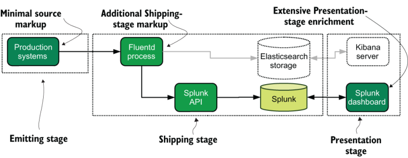

图 6.18 第 1 章中的示例 SIEM 系统，其中包含指向标记和丰富发生位置的指针。发射阶段有一些标记，但运输阶段完成了它。由于此示例使用 SaaS 系统，因此遥测数据将发送到 SaaS 提供商，在那里进行广泛的丰富。 SIEM 系统的仪表板由复杂的分析系统支持。

使用以生产系统代码编写的生产数据的生产系统内部的安全性和异常检测与使用遥测技术的安全性和异常检测之间存在区别。前者更多的是一种产品功能。后者是一个遥测系统，负责跟踪旧的备用安全问题：确保具有提升权限的用户正确使用它们，跟踪生产环境的登录，并捕获外部访问点的过多登录尝试。传统上，SIEM 遥测系统是第二种安全系统。

对于有能力聘请全职软件工程师来编写内部 SIEM 系统的大公司来说，计算方式会发生很大变化。对于这种规模的公司来说，进入 SIEM 的数据量可能足够大，以至于几个软件工程师的年薪可能比重新许可购买的解决方案的成本还要便宜。当 SIEM 是内部开发的产品时，发射阶段的标记可能非常强大。一般来说，对于安全事件响应来说，更多的上下文总是好的。真正的工程挑战存在于运输和演示阶段，其中发生关联和显示。

### 6.4.3 使用指标进行标记和丰富

指标源于运营团队运行的监控系统和软件工程团队跟踪其代码执行情况的愿望之间的结合。早期的指标系统使用 Nagios 和 Xenoss 等直接监控系统。 2010 年左右，Mindshare 开始转向称这种模式为指标，并且第一个专用时间序列数据库开始发布。本节介绍指标系统希望在何时何地进行标记和丰富。

指标是对集中式日志记录的改进，因为数字可以很好地压缩，从而可以以类似的成本在线和搜索更长的时间尺度（集中式日志记录需要数年而不是数周）。这个时代的指标仅包含一些与上下文相关的遥测数据，因为支持指标系统的数据库并不是为无限基数而构建的。指标经常被总结以进一步提高其存储效率，这必然会丢失上下文。

早年使用的监控系统仍然存在，而现代的等效系统，例如 InfluxData 的 Telegraf，可以直接发送到存储中——用旧术语来说就是基于推送的监控。 （要详细了解拉式与推式的监控系统选择，请参阅第 9.3 节。）此类系统通常与基于软件的指标并行存在。系统指标和程序指标之间的结合可以使我们深入了解代码更改对环境的影响。图 1.4 显示了系统和软件指标的联合，此处再现为图 6.19，并描述了标记和丰富点。

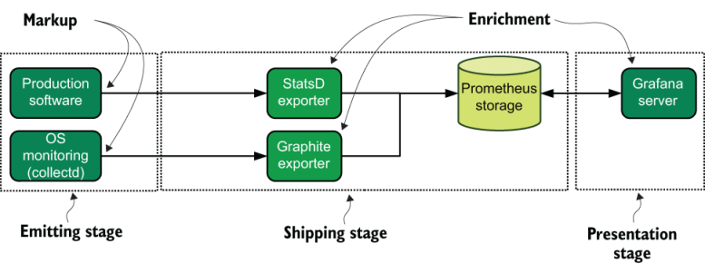

图 6.19 第 1 章中的示例指标管道，其中突出显示了标记和发射点。指标和监控在发射阶段广泛依赖于标记。在这里，我们看到生产软件由 Prometheus StatsD 导出器聚合（丰富），操作系统监控软件正在与 Prometheus Graphite 导出器通信。演示阶段的 Grafana 服务器为监控和指标系统提供了广泛的丰富。

2.1 和 3.1 节使用指标作为发射阶段和运输阶段架构的教学模式，因为它们易于使用。 2.1 节中介绍的metrics.py 列表变体演示了将指标发送到集中式日志系统的几种方法；清单 6.1 是添加了上下文相关遥测的版本；第 6.2 节描述了如何将这些指标转化为数字。然后，运输阶段将数字插入时间序列数据库，与用于系统指标的数据库相同。对于指标式遥测系统，以下是关于何时何地应进行标记和丰富的一些准则：

- 发射阶段系统添加与上下文相关的遥测，例如类路径、主机名、程序名称或其他广泛的详细信息，如清单 6.1 所示。
- 运输阶段系统将发出的遥测数据转换为数字并将其传送到指标数据库，如清单 6.7 所示。
- 运输阶段系统可以根据在管道中观察到的遥测数据自行生成指标，例如优先级设置为 `WARN` 的遥测计数。
- 发射器/传送器功能，即第 3.1.1 节中的直接存储模式，在一个地方完成所有这些事情。
- 指标数据库通常对基数有限制，因此在选择与上下文相关的遥测数据时要有选择性。
- 演示系统使用聚合函数来丰富显示的遥测数据，如第 5.1 节中深入介绍的。

### 6.4.4 使用分布式跟踪系统进行标记和丰富

随着数据库开始满足未满足的基数需求，并且存储系统默认变为 SSD，分布式跟踪系统在 2010 年代中期慢慢出现。第一个跟踪系统，被容易混淆地称为可观察性系统，只是将相关标识符添加到指标中，并使用演示阶段分析来制作复杂的图表。到 2010 年代末，分布式跟踪这个名称得到了巩固，跟踪成为可观察性的第三个支柱（另外两个支柱是日志和指标）。跟踪系统允许关联整个系统（微服务、整体系统或变体）中的事件；这并不重要——极大地扩展了技术组织理解完整工作流程的能力。图 6.20 提供了这种样式的标记和丰富发生位置的视图。

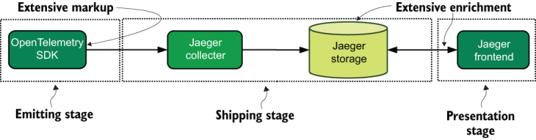

图 6.20 分布式跟踪的标记和丰富点，此处使用 Jaeger 跟踪平台。这些遥测样式严重依赖于遥测在发出时设置的标记。演示阶段系统对数据进行深入分析并提供大部分丰富内容。

分布式跟踪在很大程度上依赖于上下文相关的遥测，特别是在发射阶段添加的相关标识符的形式。分布式跟踪系统的 SDK 添加自己的相关标识符作为协议的一部分，但它们也允许发出额外的遥测数据。事实上，跟踪鼓励在发射阶段发射额外的遥测数据，以提高操作员理解（观察）生产系统的能力。

2020 年代初期可用的分布式跟踪平台并不像集中式日志记录和指标那样依赖通用的运输阶段平台。分布式跟踪平台通常直接发送到专用跟踪服务，而不必先通过队列或流。但运输阶段在一种架构中发挥着重要作用：像 COBOL 这样的编程语言没有用于分布式跟踪平台的 SDK。

对于缺少用于跟踪平台的 SDK 的软件，你可以使用 Shipping 阶段将来自此类软件平台的遥测事件转换为可由跟踪平台摄取的事件。图 6.21 演示了一种架构，其中缺少 SDK 的软件平台仍然可以向跟踪系统发出信号。

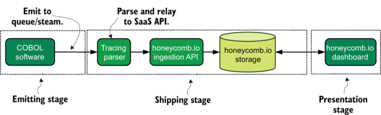

图 6.21 从非 SDK 软件平台进行跟踪并引入 SaaS 跟踪提供商。此示例依赖于扩展生产软件来提供跟踪数据，然后通过队列/流传送该数据。跟踪解析器读取此跟踪数据并将其转发到 SaaS API。从那里开始，管道看起来与受支持的平台相同。像这样的架构允许跟踪原本无法跟踪的系统。

为分布式跟踪检测 COBOL 软件（不直接支持分布式跟踪 SDK）仍然可以通过以下几个步骤来完成：

1. COBOL 将遥测数据发送到流中，如第 3.1.2 节所示。
2. 运行受支持平台的跟踪解析器读取跟踪数据，对其进行适当标记，并将其转发到 SaaS 提供商的 API。

支持这样的架构需要你设计一种传送格式，跟踪解析器可以使用该格式来创建与你正在使用的跟踪平台兼容的事件。当生产环境中不允许直接使用分布式跟踪 SDK 时，你可以使用此类方法。某些在高度安全的环境中工作的生产系统不允许建立当前跟踪 SDK 所需的网络连接，因此通过队列或流代理这些连接是有意义的。

# 概括

- 遥测管道的大部分分析能力来自于遥测从生产系统发送到人们将其作为演示阶段的一部分查看之间的转换，从而大大简化了人们回答问题所需的工作问题并获得见解。
- 标记为遥测添加了有关事件发生时间和地点的上下文。添加标记后，你可以提高人们了解特定遥测项目周围环境的能力。
- 丰富正在改变遥测的格式，使遥测中的详细信息更易于搜索。当你丰富内容时，你还可以提高人们理解遥测特定项目的内容的能力。
- 发射阶段是应用标记的最佳位置，因为发射阶段最接近发射遥测数据时生产系统的上下文。
- 对于主要依赖 Syslog 的硬件系统，发出阶段不受你的控制，因此你应该将标记作为运输阶段的一部分进行处理，该阶段由你控制。
- 遥测的常见添加上下文（称为标记）包括生成事件的类、模块或函数；进程标识符；以及生成事件的软件版本。这些额外的上下文相关详细信息可以帮助人们隔离哪些代码或特定执行负责给定事件。
- 运输阶段对于丰富来自你无法控制的发射阶段（例如来自硬件或 SaaS 平台）的遥测数据尤其重要，使你能够提取含义以轻松理解发生的情况。
- Shipping 阶段负责将遥测发送的格式转换为 Shipping 阶段存储使用的格式，这意味着 Shipping 阶段执行遥测管道中的大部分丰富操作。
- 在 Shipping 阶段中转换数据类型（通常从字符串到某种形式的数字）是 Shipping 阶段执行的主要丰富功能之一。当它转换为数字时，基于数字的遥测比它最初的字符串格式更强大。
- 在Shipping阶段进行布尔类型转换比依赖存储系统中的自动类型转换更好。这样做可以使类型转换更加明确并且更易于维护。
- 在适配器将数据类型注入存储时对其进行转换，使类型转换更加明确且更易于维护。
- 演示阶段利用发射和运输阶段完成的所有标记和丰富来提供可视化和报告。
- 将基于字符串的时间戳转换为专用的日期/时间格式允许你在演示阶段构建基于时间的报告。
- 对于指标样式的遥测，Presentation 阶段通过使用由 Shipping 阶段执行的类型转换启用的聚合函数来提供广泛的丰富。
- 