# 处理多租户

本章涵盖

- 多租户系统是如何产生的
- 如何使用队列和流来移动遥测数据
- 你需要哪些演示阶段功能

多租户系统是一种不同所有者控制或拥有整个系统不同部分的权利的系统。像 Digital Ocean 这样的系统是多租户系统的一个例子，其中每个帐户所有者都在 Digital Ocean 基础设施内操作某些资产。对于遥测生态系统，多租户可以像在仪表板系统上拥有强大的访问控制框架一样简单，也可能涉及复杂的事件路由基础设施，以将遥测事件传递到不同团队拥有和运营的存储和演示系统。

核心多租户功能是能够向其他租户和数据所有者隐藏遥测数据。由于遥测数据可以通过多种方式隐藏，因此多租户遥测生态系统对于不同的技术组织来说意味着不同的事情。本章将帮助你了解这对你意味着什么：

- 7.1 节介绍了组织如何转变为多租户架构。
- 7.2 节介绍了多租户遥测系统的设计。
  - 7.2.1 节介绍了使用两种不同技术向所有者提供遥测数据的运输阶段：队列和流系统。
  - 7.2.2 节介绍了多租户演示阶段系统以及在演示阶段实现系统时希望拥有的功能。

## 7.1 多租户架构是如何产生的

所有遥测系统都会随着时间的推移而发展，适应生产系统的变化，添加新的遥测系统，升级或删除旧的遥测系统，并适应不断变化的监管环境。诸如此类的变化可能会迫使遥测系统进入多租户状态，而这是以前没有的。本节介绍了这种变化发生的几种方式。对于某些系统，多租户在一夜之间就会出现，例如在宣布公司合并时。对于其他系统，多租户悄然出现，当前的系统与以前的系统有何不同，只有老前辈坐下来思考时才能看到。为了了解演变是如何发生的，我们需要了解一些单一所有者系统及其遥测系统的样子：

- 早期初创公司，技术组织中只有软件工程师（其中一位可能是创始人）
- 具有免费共享遥测文化的组织
- 一家历史悠久的公司内部的组织，技术组织的成员团队之间保持着严格的分离

### 7.1.1 早期初创企业中不断发展的多租户

对于早期创业公司来说，整个技术组织几乎都是由软件工程师组成，不到10人。这么小的技术组织非常灵活，因为几乎没有组织惰性可以激励人们坚持到底。一家初创公司，尤其是在现代，几乎可以保证在某种形式的公共云中运行其基础设施，例如 AWS、Digital Ocean 或 Azure。本节将展示像这样一家小到每个人都认识的公司如何发展为多租户。

这家早期初创公司运行的软件堆栈几乎可以是任何东西，这对遥测系统的实现细节有一定影响。也许该公司正在一个单一的 Ruby on Rails 应用程序中运行所有内容，以便尽快将可行的产品推向市场。或者它可能在无服务器平台（例如 AWS Lambda 或 Azure Functions）中运行，以提供轻松的扩展。无论生产系统是什么样子，重要的事实是单个团队正在操作、维护和构建生产系统。

图 7.1 表明生产和遥测系统均由单个团队控制。事实上，早期创业公司根本就没有其他团队。这里的概念是小型组织通常不关心多租户。他们还不需要提供隔离来容纳不同的业主；只有一个所有者，而那个所有者就是“我们”。

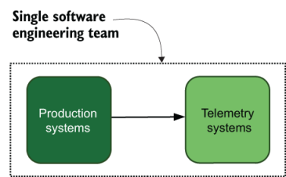

图 7.1 早期初创公司的生产和遥测系统，由单个团队管理。单个团队可以在整个组织（团队）中共享上下文，并且每个人都可以访问所有内容。当添加更多团队时，这种简单性就会消失。

对于早期初创企业来说，多租户最有可能的驱动力是增长。初创公司需要成长或消亡，因此你可以预测问题出在哪里。尽管这个示例初创公司在早期阶段只有不到 10 名软件工程师，但当它成为中期初创公司并开始寻求大合同时，除了聘请 DevOps 之外，它可能拥有 5 到 7 个软件工程团队或沿途的 SRE 团队，以及早期的安全团队。图 7.1 中的简单遥测系统已不复存在。有关初创公司的成长如何影响遥测系统的更多信息，请参阅第 8 章。

### 7.1.2 在自由共享文化中不断发展的多租户

本节介绍我们正在研究的下一个组织：具有免费共享遥测文化的组织。该组织与 7.1.1 节中的早期启动不同，它规模更大、更复杂。我们在第 4.2 节中看到了一个像这样的免费共享组织的示例，其中讨论了遥测传输格式。在那次讨论中，较早的软件开发团队自 20 世纪 90 年代以来一直在交付 Java 软件，并从那时起一直与运营团队合作。图 4.10（此处复制为图 7.2）演示了该环境。

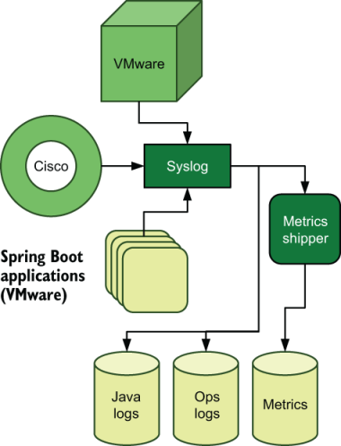

图 7.2 由软件和运营团队共享的遥测系统，遥测事件流由方向箭头表示并以存储系统（圆柱体）结束。软件团队负责维护 Spring Boot 应用程序软件，运营团队负责维护其余大部分软件。即使涉及多个团队，这个共享系统也向所有参与者开放。

在这里，我们有一个遥测系统，它将运营团队的硬件（包括 Cisco 和 VMware 基础设施）与软件工程团队的应用程序遥测相结合。在这种情况下，架构的出现是因为两个系统携手共进。使用相同的基于 Syslog 的遥测管道使该组织在其集中式日志记录遥测系统中提高了效率，并且团队共享一个指标系统。尽管日志存储在不同的系统中，但没有什么可以阻止软件工程师探究虚拟机启动/停止事件或操作工程师调查来自 Java 环境的错误。尽管两个完全不同的团队正在与这个遥测管道进行交互，但他们的共享文化却随着他们的成长而成长。图 7.3 展示了遥测系统的联合程度。

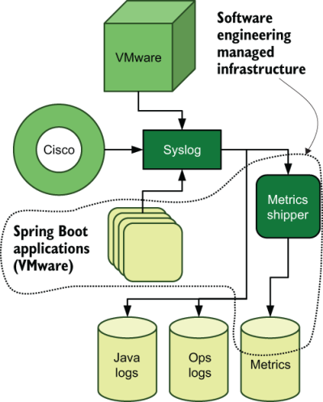

图 7.3 由运营和软件工程共享的遥测系统，并标记了由软件工程管理的系统，展示了共享系统的范围。箭头指示事件的方向和流程，最终存储在三个存储系统之一中。软件工程负责维护和操作软件和运营团队使用的指标托运程序，并且两个团队共同操作指标存储系统。该系统是共享的，而不是多租户的。

软件工程团队管理指标托运人和指标的部分数据存储；运营团队管理 Syslog 和两个集中日志存储库。运营团队使用指标系统并提供有关如何使指标系统更持久的咨询。这个技术组织可能相当大。

对于具有免费共享文化的组织，向多租户的转换可以来自多个来源。第 4.2 节描述了一种可能的方法，其中讨论了选择运输格式。在那次讨论中，我们发现管理层使用不同的软件平台（Go 而不是 Java）创建了一个新的软件工程团队，并聘请了不同的运营团队在不同的基础设施（AWS 而不是物理数据中心）上运行，所有这些都在一个力图激发公司内部的创新。实验成功了，两个独立的基础设施协商建立了一个共享遥测系统，该系统可以支持长期存在的 Java 环境和新的基于 Go 的环境。

当具有共享文化的组织决定进入医疗保健市场并承担管理健康信息处理的所有法规时，可能会发生第二种方式。大多数管理健康信息获取的法律都对谁可以获取什么信息以及在哪里可以获取信息采取了一种可以理解的排他性方法。如果健康信息有可能出现在遥测管道中，则需要锁定该管道。进入受监管的市场时，通常有很多工作要做，遥测系统也不排除在这些工作之外。

共享文化转变为请求许可文化的第三种方式是合并。突然必须与另一个技术组织集成是发现自己的局限性的好方法；更重要的是，两种不同的技术文化极大地激励了所有者之间的某种分离。公司两个部门之间的整合活动可能需要数年时间才能解决。

> 经历合并，第 1 部分
>
> 我为 HelloSign 构建和维护的单租户遥测系统看起来很像这个组织；应用程序和操作遥测位于同一个系统中，每个人都可以看到一切。这种安排一直很有效，直到我们被 Dropbox 收购为止。
>
> 我们没有立即将我们的遥测系统与 Dropbox 合并，因为与合并相关的问题需要解决，而不是对我们的遥测基础设施进行重复数据删除。合并后，Dropbox 拥有了两个遥测系统孤岛：他们的东西和我们的东西。我们看起来更像是第 7.1.3 节的组织！

### 7.1.3 在强分离文化中不断发展的多租户

本节介绍我们的第三个组织，该组织在团队及其支持遥测基础设施之间保持牢固的分离。该组织在很多方面与第 7.1.2 节中描述的共享基础设施相反。软件工程团队管理运营团队无法看到的集中式日志记录、指标和分布式跟踪基础设施。运营团队管理集中式日志记录和指标系统（称为监控系统）。此外，安全团队还使用来自操作基础设施的事件源，这些事件由安全团队管理的 SIEM 系统处理。图 7.4 展示了这种分离的基础设施。

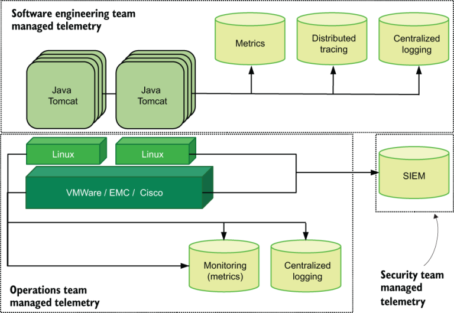

图 7.4 三个团队，三个独立的遥测系统，没有共享。遥测事件流是指示遥测数据存储位置的方向箭头。指标和集中式日志记录在软件工程和运营团队之间重复，因为它们不共享，而且两个系统都不是多租户的。团队不想分享；每个人都认为对方团队很讨厌。

通过图 7.4 中的两个独立的集中式日志系统，很容易对任一系统都是集中式的断言提出质疑。然而，对于不同的人来说，词语的含义是不同的，在这个特定的技术组织中，团队之间几乎没有合作，软件工程和运营团队分别认为他们的集中式日志系统是集中的。

对于我们共享最少的组织来说，变革不太可能自然发生。这家公司历史悠久且地位稳固，这反过来意味着大量的组织惯性正在阻止这一举动。向多租户的转变必须以某种方式从外部强制实施。

一种实施方法是管理层推动 DevOps 转型，努力为技术组织带来敏捷性。 DevOps 转型有多种类型，但 DevOps 的核心概念之一是让技术组织的不同部分相互交流。不要只让每个团队的经理互相交谈；也让工程师们谈谈。当人们开始交谈，了解其他人在做什么，习惯于帮助别人而不必被老板告知可以提供帮助时，就会开始提出一些问题。其中一个问题可能是“我们有两个指标和集中式日志系统。为什么我们需要两个？我敢打赌，如果我们合并为一个，我们可以省钱！”

多租户诞生了。此时，该公司开始寻求整合其系统，从而引发了关于格式（第 4.2 节）和跨团队遥测标准（第 12 章）的讨论。

从外部实施多租户的另一种方法与共享文化的方法相同：与更大的组织合并。该组织已经完全是分离的，因此将技术组织与父组织分开是第二天性。但如果母公司想要将两者合并怎么办？打破这样的文化充满了危险，但如果打破是在对各方的同理心和关心的基础上完成的，那么只需最少的愤怒的工程师和工程经理就可以实现这一目标。结果是某种形式的多租户。

> 经历合并，第 2 部分
>
> Dropbox 和 HelloSign 遥测系统最初是孤岛，这是可以理解的，因为它们以前从未一起工作过。两年后，我们的系统已经非常独立了。原因不是我所描述的文化例子；而是原因。 Dropbox 和 HelloSign 工程（以及平台工程）相处得很好。问题是技术性的。
>
> Dropbox 和 HelloSign 在不同的平台和假设上构建了他们的产品。规模大得多的 Dropbox 为工程师编写了遥测库，以方便将遥测数据输入中央系统 - 这些库不是用 HelloSign 使用的任何语言编写的。 HelloSign 的遥测方法更多地基于库存 API，而不是抽象 API/RPC 管理的库。
>
> 随着时间的推移，某种程度的统一将是不可避免的，这很好。另外，我之前提到过，真正的跨国公司往往是许多穿着风衣的小公司。合并是这类事情的重要推动因素。

你可能从你自己的历史中认识到这三个系统之一；这些模式很常见。每个组织的多租户路径都不同。你可能认为多租户是不可避免的，这并不是完全错误的。对于小型技术组织来说，多租户不值得付出努力。对于较大的系统，你可以通过为每个人维护通用的遥测系统来长期避免多租户。但市场限制、监管和顽固的政治常常迫使技术组织在其遥测系统中采用多租户。

## 7.2 设计多租户遥测系统

多租户遥测系统有两个主要设计点，你在设计系统时需要考虑：

- 构建运输阶段来处理来自不同所有者和系统的遥测数据。
- 构建演示阶段来处理对遥测的分离访问。

构建如图 7.4 所示的完全分离的遥测系统不是多租户，也就是说，访问孤岛不会跨越边界。图 7.4 可以无情地重写为图 7.5。

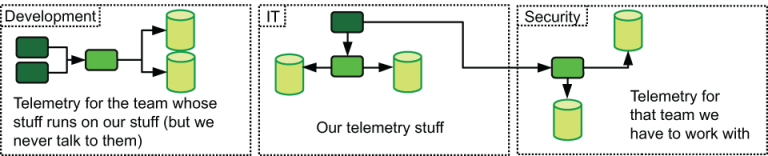

图 7.5 编辑性地重写了图 7.4，展示了此处代表的三个团队之间的沟通问题。最黑的盒子是队列或流；打火机盒是遥测解析器；气缸是遥测存储。虽然这个数字显示了一些轻微的多租户，但它显然是勉强的，并且只要有可能就保持严格的边界。

真正的多租户系统具有运输或演示阶段，允许（并单独）访问多种类型的团队。其中一个版本是允许来自不同产品的软件工程师从同一界面查看其单独系统的指标；另一种是集中式日志记录系统，它具有单个摄取点，但可以将日志传送到支持单独的演示阶段系统的许多存储系统。

在某些组织中，像运营或 DevOps 这样的团队可能会维护统一的运输阶段。在其他情况下，团队可能致力于维护遥测管道。个人的方法会有所不同，这很好。

以下两节讨论运输（第 7.2.1 节）和演示（第 7.2.2 节）阶段的多租户。

### 7.2.1 运输阶段的多租户

本节介绍多租户对运输阶段的影响。正如前面章节中提到的，从生产系统将遥测数据发送到发射阶段以及人类在演示阶段审查遥测数据时，运输阶段负责遥测数据转换的很大一部分。在多租户系统中，运输阶段通常负责将遥测数据传送到正确的存储系统。

运输阶段必须能够在多租户系统中执行两项任务，如图 7.6 所示：

- 将遥测数据路由到正确的存储系统
- 分叉遥测数据以允许将相同的遥测数据传递给多个接收者

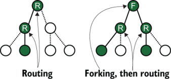

图 7.6 两个遥测系统示例。虚线代表遥测可能采取的路径；实线是选择的路径；实心圆圈通过或存储遥测数据。左侧执行路由，通过一跳或多跳将遥测数据发送到单个位置。右侧执行分叉以创建两个流，然后在第二跳中路由两个分叉。

路由遥测似乎很明显，但分叉却不是。想一想安全团队及其感兴趣的遥测的情况。安全团队非常关心描述帐户登录和注销、权限的使用以及谁何时访问什么内容的事件。通常，包括此事件列表的遥测数据捆绑在运维或 DevOps 团队维护的遥测数据中，作为来自操作系统的事件流的一部分。两支球队都对这些赛事感兴趣，因此两支球队都需要能够接收这些赛事。多租户运输系统将实现遥测数据的双重传送。

遥测路由适用于本书讨论的大多数遥测系统样式。集中式日志记录和指标都从多租户系统中受益匪浅。安全部门使用的 SIEM 系统通常是遥测系统必须容纳的第一个多租户系统。当前可用的分布式跟踪系统（2021 年初）需要直接连接到专用的运输阶段组件；随着 OpenTelemetry 项目及其支持生态系统的成熟，这种情况可能会改变。

有两种技术允许进行路由和分叉：队列（点对点消息传递）和流（解耦的发布者/订阅者消息传递）。接下来的两节讨论使用这两个系统的运输阶段架构。使用两者的混合运输阶段绝对是可能的；当你阅读这些部分时，请考虑如何混合这些概念以及如何将其应用于你自己的遥测系统。

注意 有关此处描述之外的多租户运输系统的更多示例，请参阅第 2 部分的三个章节。第 2 部分中的每一章都包含大型遥测系统的示例。此类系统几乎总是具有多租户的某些方面。

#### 使用队列设计架构

多租户运输阶段使用队列来缓冲事件流并在事件生产者和消费者之间提供隔离。此外，排队系统比常见的流系统更容易构建和维护，因此它们对于路由遥测来说是一项有吸引力的技术。因为队列是一个 FIFO 系统，所以队列支持分叉的能力似乎值得怀疑，但这种态度忽视了真正的架构。图 7.7 是基于队列的路由系统的一种版本。

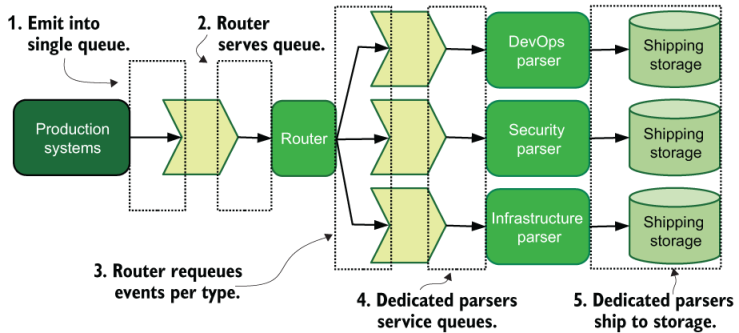

图 7.7 基于队列的遥测路由系统，包括路由层和多个允许路由和分叉的解析器。遥测流程用方向箭头描述。像这样的架构降低了发射阶段对复杂性的需求。

在图 7.7 中，离开生产系统的遥测数据通过遥测管道遵循以下路径：

1. 来自所有来源的所有遥测数据都会发送到单个队列中。
2. 专用遥测路由系统可以是水平扩展的系统组，它将遥测从路由队列中拉出并做出路由决策。
3. 专用路由系统根据遥测数据的类型将遥测数据推送到正确的队列中。
4. 每个团队的专用解析器从队列中提取遥测数据。
5. 每个团队的专用解析器解析、转换、重新格式化并将最终的遥测数据提交到存储。

需要注意的是，此过程的第 2 步可能会发生分叉。生产系统记录的 SSH 登录事件将被路由到 DevOps 解析器和安全解析器。这个系统很简单，但仍然很强大。图 7.7 中的设计做出了几个假设：

- 发射阶段系统在编写时考虑了最终的路由阶段，尽可能添加与上下文相关的遥测（第 6.1 节）以简化路由决策阶段。
- 所有发射阶段系统直接发射到队列中（第 3.1.2 节），或者生产系统上的辅助传送程序从发射阶段可以生成的内容中提取数据并将遥测数据注入路由队列（第 4.1.1 节）。
- 路由系统期望以可预测的格式接收遥测数据，因此发射阶段和辅助程序需要将遥测数据生成/转换为该格式（第 4.2 节）。
- 路由系统执行最少的标记和丰富（第 6.2 节），更愿意让专用解析系统处理该任务，这让路由系统每秒处理更多事件。
- 专用解析系统及其发送遥测数据的存储由各自的团队控制。

图 7.8 显示了另一种架构，该架构使路由决策更接近生产系统。

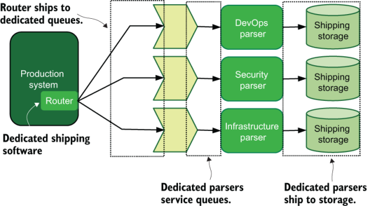

图 7.8 基于队列的遥测路由系统，包括生产系统中的路由软件，可直接减少遥测到达存储的时间。遥测流程是实线，以专用存储系统结束。这种架构将路由决策置于与生产软件的竞争中——这是一种潜在的不良寄生负载。

图7.8将路由器直接带入生产系统。在此架构中，路由系统以日志文件或第 13 章中的非文件技术之一的形式从生产系统收集遥测数据，然后直接将收集的遥测数据发送到专用队列。在这种架构中，只有专用路由器需要发送到队列；所有其他发射级组件都可以发射，但最适合它们。该系统是一个更简单的系统，因为每个遥测项目必须花费更少的跳跃才能到达其存储目的地。不过，这种简单性也有一些代价：

- 生产系统上的路由软件正在与生产软件竞争 CPU 和 RAM 资源，如果生产系统是多产的遥测生成器，则寄生负载可能会非常大。
- 访问生产系统的攻击者可以通过检查路由软件的配置来很好地了解遥测系统的外观。
- 当路由软件位于每个生产系统上而不是位于专用系统层上时，将配置更改推送到路由软件是一项复杂得多的任务。

> 该寄生负载的寄生程度如何？
>
> 确定寄生遥测操作在生产节点上的情况需要进行一些分析。遥测操作可能会在三个方面使你的生产系统变慢：
>
> - CPU 成本——如果你对遥测数据所做的唯一事情就是重新发送它，没有其他更改，那么这个区域可能不会很重要。然而，如果你确实执行了更改（可能是第 15 章中确保遥测完整性的技术之一），则此费用可能会很高。在大型硬件实例中，你可能不会注意到这些成本。但在容器或 FaaS 环境中，容器或函数的运行时间增加可能会很明显。
> - RAM 成本 - 根据你的运输软件的工作方式，你需要 RAM 来执行更改操作并批量发送下游事件。在大型硬件实例或虚拟机上，此更改可能并不重要。对于计量 RAM 使用情况的容器或 FaaS，这些影响可能会很明显。
> - I/O 成本——将一大堆遥测数据写入磁盘会产生 I/O 费用；通过遥测软件读取它也是如此。如果你的存储速度很慢，遥测 I/O 绝对会与生产 I/O 竞争。如果你的存储运行速度较慢，那么将日志放在与生产操作不同的磁盘上会更好。或者，也许你可以重新设计你的遥测系统，以使用第 13 章技术之一并完全避免使用文件。在我的职业生涯中，我见过遥测 I/O 使生产操作生成的 I/O 相形见绌的案例！
>
> 实际上，确定遥测操作对生产系统影响的最佳方法是运行实验。尝试不同的方式来发出遥测数据（避免文件）或在生产环境中提供的丰富量，然后看看会发生什么。

基于队列的系统可以完全取消路由层。图 7.9 演示了一个将解析层和路由层组合在一起的系统。

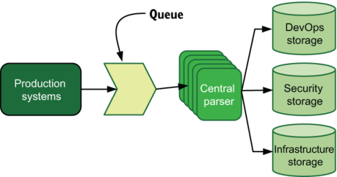

图 7.9 基于队列的遥测路由系统，其中路由层和解析层合并。遥测事件流是结束于存储系统的方向箭头。所有遥测数据继续发送到由一组集中式解析器节点提供服务的单个队列中。该解析器组根据正在处理的遥测数据类型将遥测数据路由到专用存储。

图 7.9 显示了与图 7.7 相同的中央队列。然而，与前图中的架构不同，图 7.9 中的路由系统也负责所有解析。该架构与 3.1.2 节中讨论的架构类似。通过这种集中解析的方式，所有遥测解析都需要由单层系统完成。如果技术组织有专门的遥测工程团队，那么这样的系统很可能由该团队维护。

图 7.9 中的架构可以是从共享生态系统向所有者生态系统演变的第一步。该过程如图 7.1 所示，将生产系统运送到单个团队拥有的遥测系统中。随着遥测系统的发展，新的存储系统被添加。然后，随着技术组织的发展和新团队的添加，将创建专用的演示阶段系统，同时保留现有的运输阶段。从那时起，遥测系统可以进一步发展为图 7.7 中的系统，不同的团队从中央解析器接管一些解析职责。

注意 将所有遥测数据发送到队列并在稍后阶段而不是在生产系统上解析它背后的一个中心思想是尽快从生产系统中获取遥测数据。这个想法与多租户无关，而是让攻击者更难在遥测进入管道之前对其进行操纵。对生产系统进行最少的标记和丰富并及时将其发送到队列将使你的生产系统在遭受攻击时更具防御能力。如果你足够幸运，能够向法庭提出起诉（第 18 章是关于帮助你的法律团队的），那么你的遥测数据的有效性将更容易得到证明，因为攻击者只需花很少的时间来摆弄它。第 15 章提供了有关使遥测系统具有防御能力的更多指导。

#### 使用流系统设计架构

使用流的多租户遥测生态系统具有超出队列提供的选项，我们将在本节中介绍这些选项。流是 Kafka 项目 (https://kafka.apache.org) 流行的一项相对较新的创新。流背后的基本概念是发布者将数据发送到流中的主题中，并且不知道订阅该主题的数据的任何消费者。重要的区别是每个消费者独立跟踪它到达流主题中的位置。队列作为先进先出系统工作；当一条数据到达队列的前面时，第一个请求数据的系统将获取该数据。大多数流系统允许消费者组在该组内启用类似队列的行为，同时允许其他消费者组也这样做。基于队列的系统可能需要生产者将数据推送到多个队列中以处理不同的消费者，而在基于流的系统中，生产者只需推送一次。在多租户遥测系统中，流提供了真正的力量。图 7.10 显示了基于队列的系统和基于流的系统之间的差异。

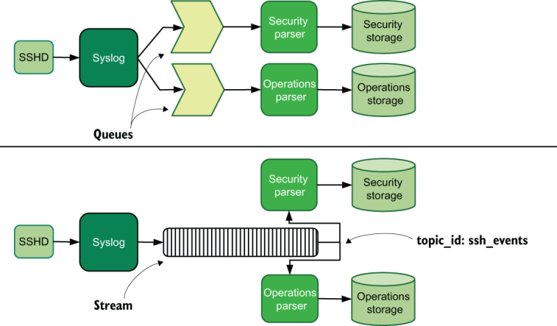

图 7.10 基于队列的多租户系统（顶部）和基于流的多租户系统（底部），显示了传送遥测数据的不同方法。方向实线表示遥测流。在基于队列的系统中进行分叉需要意识到在排队系统中进行分叉的必要性，而在基于流的系统中，分叉决策是由流的消费者端而不是生产者端做出的。

在图 7.10 所示的两个遥测系统中，我们看到 SSHD 进程生成事件，这些事件被 Syslog 拾取并继续发送。在基于队列的系统中，Syslog 将遥测数据注入两个单独的队列：一个用于操作，第二个用于安全。在基于流的系统中，Syslog 仅向名为 `ssh_events` 的流主题注入一次遥测数据。安全和操作解析器订阅该主题，并且都接收完整的事件流。由于 Syslog 不必知道下游解析器需要哪些事件，因此流版本中的 Syslog 配置比队列版本中的更简单。

流的一个问题是该技术相对较新，因此并非所有遥测发射系统都支持它们。对于需要容纳不支持流的发射器的遥测生态系统，例如发出 Syslog 的硬件和只能发送到日志文件的第三方软件，使用支持更好的队列作为临时中途站是非常允许的。图 7.11 演示了一个混合基础设施，其中硬件通过 Syslog 发出，程序不支持流。

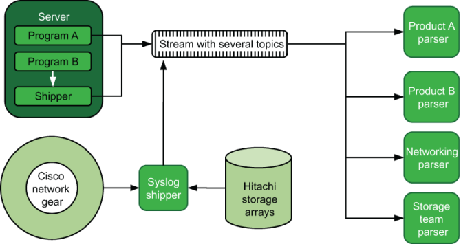

图 7.11 支持硬件和软件发射器的基于流的多租户遥测系统，显示了功能较差的发射器如何发送到流中。方向实线表示遥测流。硬件系统（思科和日立）向 Syslog 系统发送数据，作为遥测的入口点，然后将接收到的遥测数据注入到各种主题的流中。程序 A 通过代码中的发射器/传送器函数直接发送到流，而程序 B 发送到日志文件并依赖传送器程序将遥测数据移动到流中。

在图 7.11 中，我们有多个生产系统，其中包含两个程序：思科网络设备和日立存储阵列。只有其中一个生产系统（程序 A）具有直接流支持。程序 B 是第三方软件，仅支持发送到日志文件，服务器上的托运程序将其摄取并注入到流的主题中。在硬件方面，我们有一个 Syslog 传输系统，该系统接收来自 Cisco 和 Hitachi 硬件的排放，然后根据硬件的适当 `topic_id` 设置将其重新提交到流。在流系统的另一侧，我们有四个解析器，一个用于左侧的每个生产系统。该架构是图 7.8 中基于队列的架构的流版本，其中路由决策是在发送端做出的。

图 7.10 和 7.11 显示了流的强大功能，但它们也是可以从一线生产系统访问流系统的架构，这反过来意味着获得一线生产访问权限的攻击者也可以访问它们系统。一些技术组织认为这种风险是完全可以接受的；其他人则需要在流系统和发射器之间有一个缓冲区。图 7.12 显示了队列和流相结合的混合架构。

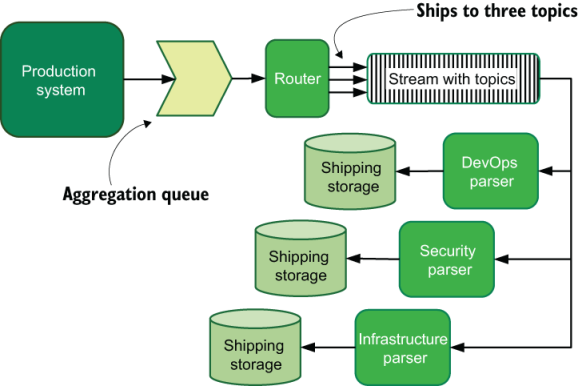

图 7.12 使用基于队列的路由器来保护流系统免受潜在攻击者的遥测系统。方向实线表示遥测流。生产系统将所有遥测数据发送到单个队列中，该队列在移动到流之前由路由器提供服务。

图 7.12 和图 7.7 之间有很多相似之处，图 7.7 是该传送架构的完全基于队列的版本。图 7.7 中的路由器通过流将遥测数据发送到各个队列，而路由器则将遥测数据发送到由专用解析器拾取的各个主题。图 7.12 中的方法将生产系统遥测时基于队列的系统的保护与处理解析任务的流的灵活性结合起来。在图 7.12 架构中，如果安全团队想要解析所有进入 DevOps 和基础设施的遥测数据，很容易在每个主题中设置一个消费者组并摄取所有内容。无需更新路由器来分叉事件，以便安全性可以获得组合的提要！

队列和流之间的一个区别在于谁可以吸收什么遥测数据。通过流，可以轻松设置额外的消费者组来分叉遥测提要，而无需打扰任何上游开发团队来添加该支持。当你在多租户生态系统中管理流系统时，管理访问控制列表和用户至关重要。上一段中的安全团队可以使用两个主题，因为流系统上的用户允许该活动。另一方面，DevOps 解析器只被允许访问一个主题。多租户系统需要管理访问控制，通常在管道本身内部。 （第 15.2 节介绍了运输阶段内的 ACL 管理，以防御攻击者。）

### 7.2.2 展示阶段的多租户

本节介绍多租户如何在演示阶段体现，这是大多数遥测使用者认为是遥测系统的阶段。对于集中式日志记录和指标等遥测系统，演示阶段可以满足真正的多租户所需。目前，开源分布式跟踪系统缺乏提供真正多租户所需的访问控制功能，但这种情况可能会在 2020 年代发生变化，因为 SaaS 分布式跟踪供应商已经提供了这些功能。

当你拥有显示技术（例如用于指标的 Grafana 或用于集中日志记录的 Kibana）时，演示阶段的多租户就会发生，该技术可以访问不同团队拥有的遥测存储系统，但允许在用户不在时拒绝访问存储系统合适的团队。如果演示阶段软件提供支持多租户的功能，你可以通过运行单个系统来节省维护开销，而不是运行同一软件的多个版本。你希望看到支持多租户的演示阶段系统中的某些功能，这扩展了为第 5.1 节中的指标、第 5.2 节中的集中日志记录和第 5.3 节中的 SIEM 提供的功能列表：

- 定义角色的能力——任何访问控制系统的核心都是定义具有权限的角色或组的能力。
- 能够使用单点登录 (SSO) 框架，例如 SAML 和 OpenID Connect (OIDC) - 演示系统可以连接到由技术组织维护的现有身份验证框架。
- 按角色限制对数据源的访问的能力 - 你可以阻止不同角色的成员访问他们不应该访问的数据库，从而减少受监管数据泄漏的清理范围。
- 能够将用户分配给多个角色——用户应该能够担任多个角色，例如需要担任多个团队角色的工程经理。
- 能够按角色限制对仪表板的访问 - 并非每个仪表板都适合系统的每个成员使用，因此限制访问适用于访问仪表板，从而为每个人提供不那么拥挤的体验。
- 能够按角色限制谁可以创建或修改仪表板 - 仅查看用户可以发现现有仪表板非常强大，并且限制编辑访问权限可以减少仪表板蔓延。

需要记住的一件事是，Kibana (Elastic.co) 和 Grafana (GrafanaLabs) 等开源仪表板供应商考虑将广泛的访问控制和单点登录支持作为付费附加组件；项目需要以某种方式赚钱，而足够大的组织需要这些功能，也足够有能力支付这些功能。对于 Kibana，开源版本支持基本身份验证，但将身份验证与 SSO 系统（例如 SAML 或 LDAP）绑定的能力需要付费附加组件。 Grafana 在开源版本中还支持基本和 SSO 身份验证，但限制对特定数据源的访问需要付费附加组件。运行 SaaS 系统的要求意味着 SaaS 供应商默认提供这些功能，但开源的全部丰富性，尤其是 SSO 支持，可能只能以企业价格水平购买。

软件在演示系统中工作的实际情况迫使我们在多租户架构中做出某些选择。图 7.13 展示了使用免费和低成本系统与具有付费企业功能的系统之间的差异。

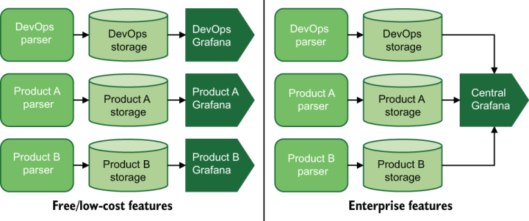

图 7.13 基于功能成本的两种不同的演示阶段设计。遥测数据被解析并发送到存储，该存储由 Grafana 消耗。

左侧是Grafana指标展示系统的免费版本（https://grafana.com）。每个感兴趣的团队都运行自己的 Grafana 安装，以保持其遥测技术与其他团队的遥测技术之间的分离。这个分离的版本在演示阶段不是多租户的，因为多租户是在运输阶段单独处理的。

右侧是 Grafana 的企业（付费）版本，它具有通过对数据源使用访问控制规则来实现遥测分离的功能，只需要安装一个 Grafana。中央版本是多租户的，因为多个租户共享一个访问系统。

对于具有许多租户的大型遥测系统，演示阶段的多租户可以使整个遥测系统更易于维护。从政治上讲，中央系统可能由专门的遥测团队管理，但也可以由 DevOps 或 SRE 团队管理，作为开发人员支持和可用性任务的一部分。

例如，让我们看一下图 7.14，它显示了所有四种遥测样式的四个演示阶段系统：指标、日志记录、跟踪和 SIEM。其中有两家 SaaS 提供商。 SaaS 提供商使用多租户功能作为其服务的关键部分。另外两个演示阶段系统 Kibana 和 Grafana 需要企业计划来提供公司所需的多租户功能。 Grafana 还可以显示日志记录数据和指标数据，因此它从日志记录数据存储系统中提取。通过在大型遥测系统前部署四个系统，该公司只需管理一次演示阶段系统，从而节省了资金和员工时间。另一种选择是，与我们在图 7.5 中看到的高度孤立的系统一样，在不同的地方维护许多相同的演示阶段系统，这些系统由不同的存储系统（可能在不同的软件版本中）提供服务，这会放大管理演示阶段的成本整个技术组织的系统。

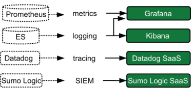

图 7.14 大型基于云的初创公司的演示阶段系统，其中运输阶段项目以虚线表示，演示阶段系统以实线表示。这种类型的架构可能会集中管理，为许多团队提供服务，并使用 Grafana 和 Kibana 的企业支持计划。

# 概括

- 多租户系统是一种不同所有者控制或拥有整个系统不同部分的权利的系统。
- 遥测系统通常从单租户开始，并随着组织的发展和变化而演变为多租户。当你尝试对新的遥测系统进行更改时，此历史记录非常重要。
- 小型组织通常不会考虑多租户，因为他们还不需要它。
- 如果中型甚至大型技术组织具有团队之间开放共享的文化，那么它们可以保持单租户。共享通常是组织内健康沟通的标志。
- 外部力量（例如新的法规或合规框架以及合并）可能会迫使单租户遥测系统采用多租户。
- 一些技术组织运行单独的遥测系统，而不是在团队之间共享它们。这种安排是单租户的。
- 在 DevOps 转型或公司合并等外部事件发生后，团队之间严格分离的组织可能会被迫采用多租户模式。
- 多租户遥测系统需要考虑如何设计运输阶段来处理针对多个所有者的遥测，以及如何在展示阶段系统中分离访问。
- 为了支持多样化的团队，运输阶段的多租户需要支持将遥测数据路由到正确的存储系统和分叉遥测数据的能力，以允许遥测数据的多次交付。
- 运输阶段的分叉是指能够将相同的遥测数据发送给多个所有者，并可能在此过程中经历单独的转换。
- 将遥测数据从生产系统传送到专用路由队列或流主题，使生产系统上的发射阶段更易于维护，并提供隔离以防御攻击者。
- 将执行路由决策的运输阶段系统放在生产系统上意味着路由器正在与生产软件竞争 CPU 和 RAM。
- 流系统因 Apache Kafka 项目而普及，与基于队列的 Shipping-stage 系统相比，它提供了更多的遥测系统灵活性。
- 流系统中的消费者组允许消费者组内进行类似队列的行为，同时仍然向所有消费者组提供所有事件。
- 流是相对较新的技术，因此软件对它们的支持不如队列那么强大。
- 在流前面使用队列是从仅支持队列的系统将遥测数据获取到流中的有效方法。
- 在运输阶段管理多租户通常需要不同所有者进行某种程度的访问控制管理。
- 当你有多个所有者通过公共系统访问遥测数据，同时阻止一个所有者看到另一所有者的遥测数据时，演示阶段的多租户就会发生。这种安排类似于 SaaS 提供商的运作方式。
- 支持多租户的演示阶段系统需要定义和实施用户角色、访问数据源以及限制对定义的仪表板的访问的功能。
- SSO 支持（例如 SAML 或 OIDC）通常是一项企业功能，需要为许多演示阶段软件平台提供更高级别的付费计划。 Elastic.co 和 Grafana Labs 都使用此模型作为主要收入来源。
- 大型技术组织发现，与让每个团队独立于技术组织的其他部分管理自己的系统相比，使用集中式多租户演示阶段系统可提供更优惠的成本和更高水平的整体功能。
