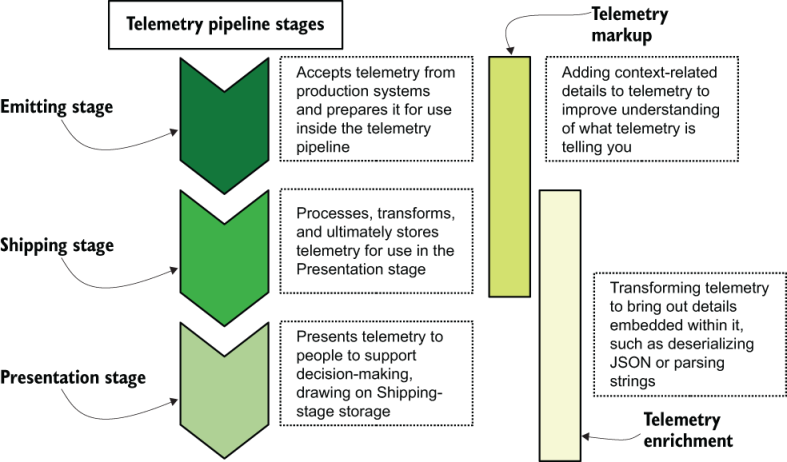

# 遥测系统架构

第 1 章中描述的每个遥测系统都遵循相同的通用架构。每个生产系统都会发出遥测数据。然后，这些数据被传送到某种形式的数据存储中，该数据存储可以是关系数据库、NoSQL 文档存储、SaaS 提供商，甚至是对象存储（如果不是多个的话）。从那里，它以这样一种方式呈现，人们可以使用处理后的遥测数据来支持决策，这可以是报告或按需图表的形式。在此过程中，遥测数据会被标记上与上下文相关的详细信息，然后进行丰富以提取遥测数据中编码的详细信息。图 1 描述了这种架构。

图 P1.1 遥测系统管道阶段及其定义。发射阶段打包运输阶段的遥测数据，该阶段处理、转换和存储供演示阶段使用的遥测数据。标记在发射和运输阶段添加了与上下文相关的遥测数据，其中充实转换遥测数据以提高其在运输和演示阶段的有用性。

第 1 章讨论了遥测的四种类型：

- 集中式日志记录——将来自硬件、云提供商和软件的所有日志记录输出放入单个可搜索系统中。这种风格通常是第一个构建的遥测系统，具有高基数和高成本。
- 指标 - 将基于数字的遥测（例如速率、计数和集合）引入中央系统，并用字段标记以提供图表和分析的基础。这种风格基数低，成本低。
- 安全信息事件管理 (SIEM) — 一种特定于安全与合规团队需求的集中式日志记录形式。由于外部限制，这种样式需要支持多年的存储。
- 分布式跟踪——使用新的数据库和呈现时间处理，跟踪旨在通过功能、微服务、宏服务和不同租户实现以下执行链。这种风格具有高基数，但统计方法有助于降低成本。

第 1 章中讨论的每种遥测样式的遥测都遵循图 1 中的阶段。图 2 提供了用于指标、集中式日志记录和分布式跟踪（也称为可观测性支柱）的遥测管道的三个现实示例。

所有遥测都有一个发射系统，可以准备遥测以供在运输阶段使用（第 2 章）。接收排放的系统（运输阶段系统）处理和转换遥测数据以准备存储（第 3 章和第 4 章）。最后，展示阶段系统使用运输阶段存储的遥测数据来提供支持决策所需的可视化和分析（第 5 章）。第 6 章描述了遥测系统在管道的所有三个阶段应用的标记和丰富。最后，第 7 章介绍了多租户，描述了当涉及多个所有者时遥测系统发生的变化。

图 P1.2 三种遥测样式的遥测管道示例，指标位于顶部，集中式日志记录位于中间，跟踪位于底部。黑色方向线表示遥测流。每个管道分为三个阶段：发出、运输和演示。这些技术各不相同，但相同的数据处理流程显示了这些遥测样式的相似之处。