# 10 历史悠久的商业IT

本章涵盖

- 从纸张和墨水开始的组织中使用遥测技术
- 如何在成熟的组织中采用现代遥测系统
- 大型机在现代基础设施中的作用

在本章中，我们将介绍一种略有不同的组织类型：一种在纸墨时代开始运作，后来在 IBM PC 革命之前实现计算机化的组织。在这种情况下，组织可能意味着政府，有些政府已经运作了几个世纪。欧洲的一些公司的成立日期可以追溯到 1600 年代，这远远早于打字机，更不用说任何电子计算设备了。在组织只有一台计算机、占据整个房间并需要八名工作人员操作的时代，将业务运营计算机化，会在组织的技术方法上留下不可磨灭的印记。当计算机化发生变化时，遥测方法也会发生变化。

注意第 2 部分的所有章节都是为了使用第 1 部分中的技术来讲述遥测故事，旨在提供集成遥测系统的更具体示例。如果你觉得需要更多现实世界的示例来了解这些系统的工作原理，那么这些章节就是你的最佳选择。如果你觉得自己已经很好地掌握了这些概念，可以跳过这些章节并转到第 3 部分。

与第 8 章和第 9 章不同，我们不会讨论这种组织类型的小型版本。正如第 9 章中提到的，小型组织对计算机化的变化反应最灵敏，因为它们在采用变化时需要克服的组织惯性最小。一家 1951 年在法国注册成立的 30 人公司很可能直到 20 世纪 80 年代才开始计算机化，这使其更适合第 9.1 节。一家在 20 世纪 70 年代中期采用了几台计算机的小公司可能会在 20 世纪 80 年代末和 90 年代办公自动化兴起期间淘汰它们，转而使用运行成本低得多的基于英特尔的计算机。

20 世纪 60 年代和 1970 年代对于这个行业来说已经是一个职业生涯了，所以那个时代的计算的记忆开始消失。它当然早于我，但我职业生涯的前七年都是和当时长大的人一起度过的。这些是计算 Back When 的属性：

- 每个拥有一台或三台计算机的组织都拥有一个机房来存放计算机，并配有特殊的冷却、电力和可能的管道系统。 （那个时代的一些计算机系统是水冷的。）
- 那是 TCP/IP 之前的时代，因此与计算机通信需要大量串行连接（具体来说，RS-232 标准）。
- 计算机以批处理模式运行，这需要计算机操作员安装和拆卸磁带来加载数据和存储结果，并确保批处理作业按时无问题地执行。
- 有些计算机可以在在线模式和批处理模式之间切换。白天使用在线模式，此时系统必须处理大量交易，例如在满屋子的数据录入员中输入昨天的停车罚单。批处理模式用于运行报告。这种模式切换是预定的，你不能同时进行这两种操作。
- 计算机操作员也上夜班，因为那是大多数批处理作业运行的时间。你的 Cron 守护进程名叫 Kathy，如果你早到的话，有些早晨你会看到她。
- 计算机操作员为计算机提供磁带（用于加载程序、读取输入和记录程序的输出）。夜间操作员 Kathy 也是你的辅助 I/O 控制器。
- 系统程序员编写计算机操作员运行的批处理作业，而计算机操作员通常有一份系统程序员名单，如果出现任何问题，可以打电话给他们。夜间接线员凯西也是你的警报系统。
- 系统程序员还提供了有关每项作业预期输出类型的文档。夜间操作员凯西也是你的监控系统。
- 系统分析师管理系统程序员并跟踪批处理作业如何交互。系统分析师可能见过夜间接线员凯西几次，但除此之外并不认识她。

事实证明，没有人喜欢上夜班，因此自从 .com 热潮兴起以来，计算行业每年都在努力让夜间接线员凯西失业，而且大部分都成功了。现在，我们可以自动化批处理作业，跟踪遥测数据，并在出现问题时自动进行标注，并且编写代码的系统程序员 EDP 分析开发软件工程师可以自行查找作业输出，而无需打扰其他任何人。现在的世界很美好，几乎没有人需要通宵工作了。

除了那些当年实现计算机化的组织之外，凯西和她工作的世界的幽灵仍然存在于他们所做的一切中（包括像高级系统分析师三这样的职位）。尽管凯西现在可能是一位处于退休边缘的 IT 总监，但要驱除夜间接线员凯西的鬼魂，需要进行深思熟虑的提升和转移操作，以摧毁过去并在新平台上重建。许多组织在 20 世纪 90 年代和 2000 年代就这样做了，并摆脱了大型机、小型机和批处理系统，转而在 Solaris、AIX 甚至 Windows 上构建新的系统。或者，他们等到 2010 年代初才升级并转向早期的公共云产品，例如 AWS。但遗留的计算操作模式仍然存在，我们将在接下来的三个部分中看到。也就是说，所有这些组织编写供内部使用的软件已有 40 多年的历史。本章将介绍三种不同规模的组织的故事：

- 第 10.1 节讨论了中型组织中遥测的使用。
- 第 10.2 节讨论了国家组织中遥测的使用。
- 第 10.3 节讨论了全球组织中遥测的使用。

## 10.1 中型组织中遥测的使用

就本节而言，中型组织与第 9.2 节中描述的组织类似，只是中型组织一开始的人数接近 150 人，而不是 50 人，最后发展到大约 500 人。在本章的三种规模的组织中，中型组织是最有可能忘记过去并继续前进的人。忘记的组织看起来像第 9.2 节中的组织；那些还没有完全做到的就是我们在本节中讨论的内容。延续大型机模式的组织拥有中型组织的资源，因此他们不太能够跟上大型机式计算的最新趋势。当你查看第 10.2 和 10.3 节中的大型组织时，你将看到在这种规模的组织中，大型机的运行会受到多么的限制。

与第 9.2 节中的中型软件消费组织不同，这些传统计算组织内部肯定仍在进行软件开发。因此，我们对软件遥测使用的检查将重点关注两个主要用例：

- 遥测在办公室 IT 中的应用
- 遥测技术在生产系统中的应用

我们的示例组织是美国某州的失业保险办公室。该政府机构负责管理工资失业保险费和失业人员付款的收入。与所有美国社会支持系统一样，它有复杂且不断变化的规则，涉及谁获得什么、何时获得、人们需要做什么才能获得它、获得频率以及在什么条件下他们可能被拒绝福利再次。 2020-21 年的 COVID-19 经济衰退迫使我们做出更多改变，因为某些规则突然放松，福利增加（直到事实并非如此）。任何失业保险系统都需要对不断变化的立法做出快速反应，这需要程序员和软件分发系统。

由于问题的规模巨大以及需要在合理的时间内对全州范围内的资金支付系统进行核算，像这样的福利系统很早就实现了计算机化。早期的批处理模式计算机非常适合，因此美国许多州采用大型机和小型计算机（比大型机小，比玩具计算机大）来自动化其福利管理系统。当时的 20 世纪 70 年代，福利申请是在纸上完成的，然后（由数据输入职员）输入计算机，福利被批量检查打印机，然后邮寄或保存在意志窗口。在 2020 年代，纸质申请已被门户网站取代，纸质支票（大部分）已被电子资金转账或可充值借记卡取代。在许多情况下，大型机/小型机模型至今仍在使用，而不是转向自动扩展微服务集群和水平扩展分片数据库。也就是说，当 20% 的劳动力因大流行而突然失业以及相应的福利工作量增加 7 倍时，两种计算方式都面临着不同的扩展问题。

### 10.1.1 遥测在办公室 IT 中的使用

本节讨论我们假设的美国某州失业保险机构中软件遥测的使用情况，该机构须遵守州政府的 IT 指南。由于政府机构的多样性，此类指导方针往往比较自由。我们的失业保险机构与任何其他组织一样拥有办公室业务，包括软件开发和其他组织中所谓的客户服务代表。我们将研究该组织如何管理其办公室运营自动化。该组织与我们在第 9.2 节中讨论的组织在几个方面有所不同：

- 它正在开发软件并使用成熟、可靠的技术来实现。
- 自 20 世纪 70 年代以来，办公室的计算机就直接放在办公桌上，或者以串行终端的形式间接连接到数据中心的计算机。
- 它正在继续管理服务器。
- 它非常愿意在员工的机器上安装专业软件，并且这样做已经有 30 多年了。
- 这是一家政府雇主，因此员工往往会长期留任。
- 在 SaaS 革命发生之前很久很久，它就拥有内部人力资源、会计和其他业务流程，因此它使用的 SaaS 比其他同等规模的组织要少得多。 （很难放弃一个完全满足你需要的定制系统，因为系统可以满足你的大部分需要，但需要你改变其余部分的工作方式。）
- 他们的员工根本不移动，任何远程访问都是通过 VPN 完成的。

这支员工队伍看起来就像 1995 年至 2010 年时代的组织：以服务器为中心，使用 Microsoft 文件服务器共享文档，员工 Windows 台式机集中登录，勉强采用笔记本电脑和移动设备，以及雇主的全视之眼的监视圆形监狱。

图 10.1 显示了办公室 IT 遥测生态系统。该图看起来有点像图 9.15（企业规模的软件消费组织），但它描述的是一个中等规模的组织。我们的失业保险部门几十年来一直在运行服务器，因此当出现新的遥测需求时，它首先会触及现有的基础设施：服务器。企业规模的组织自行托管其集中式日志系统有一个奇怪的相似之处：较大的组织为此角色编写了自己的软件，但中型组织则使用安装在自己的服务器上的现成软件 (Splunk)。即便如此，我们还是看到了那个更大的组织和这个组织之间的一些差异：

- SharePoint 和文件服务的存在，这是不使用云服务时保存和共享文件的两种不同方式。这些服务器中可能有二十五年的文件在 Office 365 存储中并不存在。
- 用于跟踪员工网页浏览的新遥测系统，需要在员工端点上安装代理，并提供专用报告界面供经理使用。
- 没有苹果硬件。该失业保险部门显然希望对员工端点进行广泛的控制。希望对端点进行尽可能多的控制的小型组织很少有足够的组织带宽来支持多个操作系统。如果说对苹果硬件的支持确实存在的话，那么对于高管等特别值得信赖的员工来说，这种支持也是半生不熟的。

正如我们在所有办公室 IT 遥测系统中看到的那样，该组织的遥测主要关注集中式日志记录系统。报告系统还可以从日志数据中导出类似指标的图表，但这仍然不是我们在第 1 部分中讨论的指标方式；这是集中式日志记录，它可以代替它可以做的指标，即使不是那么好。这种集中的日志记录焦点如何转化为软件开发方面？

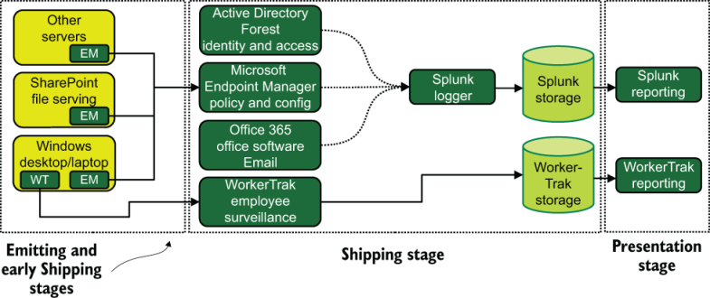

图 10.1 我们的中型传统计算组织的办公室 IT 遥测生态系统。该 IT 生态系统从所有 Windows 系统（服务器和员工端点）收集事件日志遥测数据，并使用 Endpoint Manager 推送配置和策略。员工监控在该组织中是一项新功能，它存储网络浏览遥测数据，以便在演示阶段的报告界面中进行审查。如此详细且无 SaaS 的遥测是该组织数十年内部运行服务器历史的结果。

> 我在中型组织的经验
>
> 我大学毕业后的第一份工作是在市政府工作。尽管我受聘帮助为基于 Windows 的办公室（带有 NetWare 文件服务器）提供桌面支持，但驱动薪资和人力资源的系统却是一台小型计算机。这台小型机是 Pr1me Systems 制造的（1970 年以后出生的人可能从来没有听说过它），于 1978 年购买，并在 80 年代升级了几次，到 1999 年仍在工作。它运行 Oracle 4（1984 年发布） 。
>
> 最终导致 Pr1me 系统死亡的是 2000 年的问题。该市知道最后期限即将到来，并在 1997 年和 1998 年尝试将工资和人力资源系统转换为现成的解决方案。在可行性研究确定该项目可以在预算的顶部引入所需功能的底部后，该项目被放弃。市议会因做出停止的决定而陷入各种悲痛（“你把所有的钱都扔掉了！这是浪费纳税人的资源！”），但这是正确的决定。
>
> 该市在 1998 年和 1999 年重写了基于 Pr1me 的工资和人力资源系统，用 COBOL 和 Oracle 4 编写，使其能够在 Windows 计算机上运行。帮助这个过程的一个事实是，1978 年编写该程序的原始程序员仍然在职并领导了重写工作。我帮助指定了托管重写软件的硬件，该软件仍然运行 COBOL，但使用 Oracle 8i。
>
> 我们没有赶上发货期限（2000 年 1 月 1 日），因此 Pr1me 不得不将时钟拨回 1973 年，因为那一年的日历与 2000 年相同。别担心，我们的薪水仍然有对他们来说是正确的年份。 （我检查过。）但是，当薪资部门在新系统上运行第一个薪资时，每个人都欣喜若狂。
>
> 数据输入完成后，生成工资单需要 15 分钟，而过去需要 4 个小时。
>
> 二十年后，如果 1978 年首次编写的定制系统仍在运行，我一点也不会感到惊讶。

### 10.1.2 生产系统中遥测的使用

第 10.1.1 节中的 Office IT 展示了许多自托管解决方案，使用集中式日志记录作为唯一使用的遥测系统。我们失业保险部门的生产软件方面肯定是使用遥测技术。本节展示了遥测技术如何在专注于自托管并于 20 世纪 70 年代开始计算机运营的组织中发挥作用。图 10.2 说明了我们政府机构的生产软件环境。

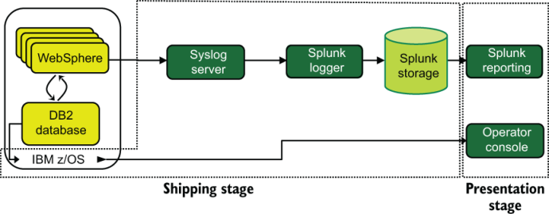

图10.2 我们失业保险部门生产软件的遥测系统。 Web 服务和数据库在运行 z/OS 的 IBM 大型机上运行。 WebSphere 软件具有熟悉的 Splunk 遥测提要，但 z/OS 是新的：操作员控制台。

我们的失业保险部门使用运行 z/OS 的单个 IBM 大型机来处理事务。该大型机正在运行 Web 和应用程序服务器 (IBM WebSphere) 集群，并使用 IBM DB2 数据库进行存储。图中未显示作业控制语言 (JCL) 中指定的分配收益的批处理作业。我们看到 WebSphere 服务器（功能虚拟机）遵循熟悉的模式，发送到 Syslog 服务器，最终发送到 Splunk 进行集中日志记录。另一方面，DB2 和 z/OS 遥测遵循一个新流程：将其发送到操作员控制台。

操作员控制台是前 PC 时代的产物，传统上是一台打印机，可以在系统事件发生时将其打印出来，或者是一个显示事件的监视器。更现代的版本可以对事件进行颜色编码，以便操作员可以快速判断哪些事件是重要的。 （将其视为一种具有日志记录功能的大型机监控和警报系统。）在我们的失业保险案例中，操作员控制台是可以查看与数据库和 JCL（在 z/OS 内运行的业务自动化）事件相关的遥测数据的地方。 。这种查看可以由操作员在数据中心物理地完成，也可以通过正确类型的远程终端连接来完成。

我们在这里看到的是一个盒子里的系统。这是一个大盒子，被称为大型机是有原因的，但它也支持整个州的失业保险系统。该部门仍然相对较小，因此它尽其所能地使用供应商组件以节省资金。此外，作为美国的政府部门意味着长期资金不足，因此运营不太符合大型机的最新技术水平。 （我们将在第 10.3 节中了解最先进的技术。）与办公室 IT 一样，所有遥测操作都是集中式日志记录的变体。

他们的生产软件和办公 IT 之间唯一的融合点是 Splunk 基础设施。我们在这里看到，该机构在运行服务器方面的经验表明，它不仅适用于办公自动化，也适用于生产系统。该机构仅对办公室 IT 和生产系统遥测进行集中日志记录；它的开发模式不提供深入研究指标或跟踪的激励。

## 10.2 大型组织中遥测的使用

我们在本节中介绍大型组织 - 具有一个中央办公室和许多分支机构或其他小型访问节点的传统计算类型。想象一家总部位于中央但分支机构分布在五个州的地区银行，或者一家在三个州设有工厂的汽车零部件制造商。中型组织在一个地点开展大量工作，而大型组织则在多个地点开展工作。更重要的是，大型组织比中型组织拥有更多的软件开发资源。本节展示大型组织如何将大型机式计算与更传统的计算混合在一起。

以下是遗留计算领域中型组织和大型组织之间的一些主要区别：

- 大型组织拥有更多的开发资源，因此其生产软件环境也相应更加复杂。
- 他们在远离所有服务器的多个地点管理员工。
- 他们同时管理传统计算和更传统的计算。
- 一般来说，他们有更多的人，因此他们能够更好地跟上最佳实践。

在本章中，我们将研究一家在三个州经营工厂的汽车零部件制造商，该制造商向汽车制造商和零售连锁店发送汽车零部件。看似这些过程中涉及的软件并不多，但实际上涉及的软件相当多。图 10.3 显示了我们的汽车零部件制造商正在管理的软件使用和开发的各个区域。

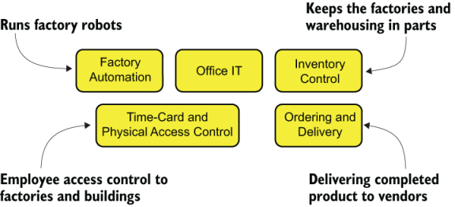

图 10.3 我们的汽车零部件制造商正在管理的软件使用和开发的五个领域。工厂自动化是用于控制工厂中涉及的机器的软件。 Office IT 用于企业办公自动化。库存控制用于管理工厂的供应和成品的存储。订购和交付用于管理完成产品的运输过程。考勤卡和物理访问控制 (PACS) 用于跟踪对设施的访问并管理每小时的员工计时。诸如此类的多个区域在制造产品的公司中很常见。

图10.3中唯一的方框是工厂自动化；本专栏主要介绍监控和数据采集 (SCADA) 系统以及它们如何与公司中的人员和其他计算机系统进行交互。 SCADA系统控制硬件；它们处理和显示由硬件组件（例如焊接机器人、冷却液泵和装配线电机）生成的遥测数据。因为这本书是关于软件遥测的，所以我们将研究由运行 SCADA 系统的监控计算机提供的遥测，而不是来自工厂车间的八个 enframulators 的遥测，如图 10.4 所示。

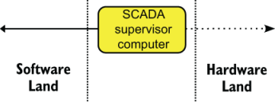

图 10.4 SCADA 系统以及硬件和软件方面的分离。硬件域是监控计算机控制所有硬件系统并管理来自硬件的遥测数据的地方。软件域是非 SCADA 软件与 SCADA 系统通信的地方。我们将重点关注该图表的左侧。

我们汽车零部件制造商的历史对于如何整合其他基础设施至关重要。该公司成立于 20 世纪 50 年代，自那时起一直为美国三大汽车制造商提供服务。第一个计算机化系统是 20 世纪 60 年代中期的库存、订购和交付系统。 20 世纪 70 年代初，工厂自动化开始采用机器人技术。考勤卡系统在 20 世纪 80 年代初实现计算机化，此时办公室 IT 开始出现。 20 世纪 80 年代，工厂机器人变得更加复杂，因此引入了第一个 SCADA 系统。 20 世纪 80 年代末，工厂的出入方式从钥匙和看守系统改为感应卡，从而实现了考勤卡系统与 PACS 的合并。 20 世纪 90 年代，作为公司内部重组的一部分，订购和交付从库存控制中分离出来。

图 10.5 展示了这五个软件区域如何连接以及每个区域位于总部、工厂和仓库之间的位置。它还展示了两种不同的 CPU 架构：大型机式 IBM POWER9 和基于 amd64 的商用硬件系统。与我们的中型组织不同，该组织在其生产系统中管理不同的硬件。要开始了解软件遥测的使用，让我们看看工厂自动化组。

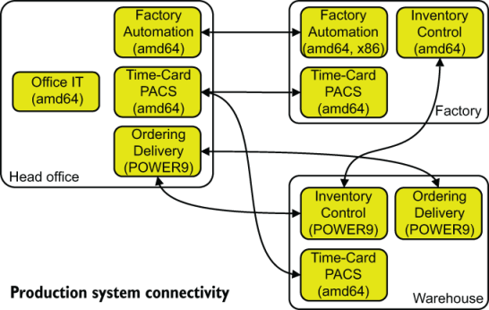

图 10.5 我们的汽车零部件制造商的五个软件区域之间的生产系统连接（和 CPU 架构）。尽管我们确实有五个独立的区域和软件堆栈，但它们彼此之间有很多交流（宏服务，如果你愿意的话）。

> 哪个是：amd64 还是 x86？那么 x86_64 呢？
>
> Intel 和 AMD 生产的芯片所针对的 CPU 架构你怎么称呼取决于你问的是谁。如果你问 Debian 它运行什么 CPU 架构，你会得到 `amd64` 的变化。询问 SuSE，你会得到 `x86_64` 。大型机领域专门将 Intel 和 AMD 的 CPU 称为 `x86` ，并且几十年来一直如此，尽管行业其他领域的术语发生了变化。我对这些数字使用 amd64，因为本书的读者可能会更熟悉这个术语。然而，它之所以被称为 amd64，是因为 AMD 为 PC 市场构建了第一个广泛采用的 64 位规范。
>
> Intel 拥有 64 位架构（称为 Itanium 或 IA64），但从未得到市场的广泛接受。英特尔授权 AMD 的 64 位架构是因为市场似乎更喜欢它。在普遍使用 Intel 和 AMD CPU 的领域，x86 有时仍被用作通用术语，但在大多数情况下，CPU 架构并没有出现。有时，如果需要区分，x86 用于指代 32 位 Intel/AMD CPU。
>
> 然而，随着苹果发布运行在 ARM CPU（而不是英特尔）上的硬件，CPU 架构的讨论再次开始发生，即使是在坚定的英特尔环境中。当本书需要第二版时，我想将会有更多的双架构（amd64 加 ARM）环境。

首先，让我们关注工厂自动化组。图 10.6 展示了其遥测系统，分为总部和工厂两部分。

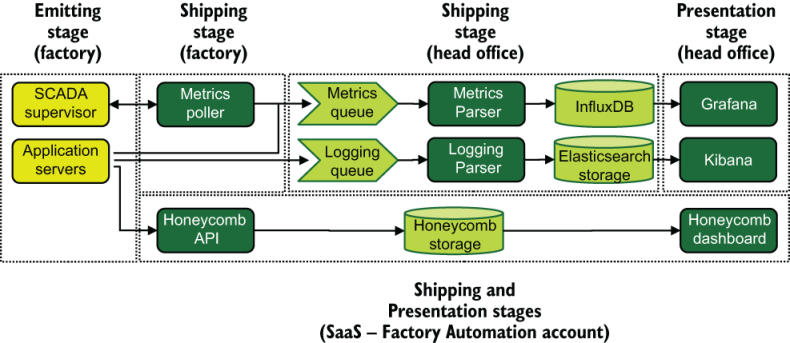

图 10.6 我们的汽车零部件制造商工厂自动化小组的遥测系统流程。我们看到这里使用了三种遥测系统：指标、集中式日志记录和跟踪。通过该小组编写的指标轮询器从 SCADA 系统中提取指标。指标通过 WAN 提交到总部的队列。日志记录遵循类似的路径，日志行通过 WAN 提交到总部的队列。跟踪正在使用 Honeycomb.io SaaS 产品。在与分支机构合作的组织中，将遥测集中在一处是很常见的。

尽管需要使用 SCADA，但我们工厂自动化团队的遥测管道与我们在第 8 章中看到的软件生产公司的遥测管道惊人地相似。在他们的例子中，SCADA 管理程序在 32 位硬件（x86 而不是 amd64）上运行，并作为其职责的一部分与 16 位和 8 位硬件进行通信。然而，它为汽车零部件制造商提供了请求指标的接口，这使得我们的汽车零部件制造商能够将工厂车间的遥测数据集成到其整体管理框架中。总部指标和日志记录基础设施对我们来说很有趣，因为该基础设施是在团队之间共享的。现在让我们看看另一个基于 amd64 的组：Time Card/PACS。

如图 10.7 所示，时间卡/PACS 组的遥测与工厂自动化组使用的遥测有显着不同。尽管两个小组都使用集中式指标和日志记录管道，但遥测数据进入这些管道的方式是不同的。员工考勤卡系统和 PACS 系统都是购买的软件框架，这意味着考勤卡/PACS 团队主要管理的软件不是自己编写的。该小组确实创建了一个与 PACS 系统一起使用的日志轮询器；该轮询器查询每个远程设施中 PACS 上的 API 端点以获取事件，然后重新打包这些事件以提交到日志记录队列。总部的考勤卡系统部分是现成的软件，部分是内部开发的软件，这就是为什么该系统能够直接向队列发出指标和日志记录。与工厂自动化小组不同，该小组不使用 Honeycomb.io 进行跟踪；而是使用 Honeycomb.io 进行跟踪。它的大部分功能都是购买的软件，因此追踪并不是一个足够大的需求，不需要费心去构建。

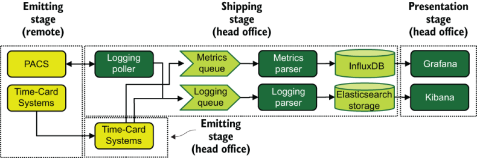

图 10.7 考勤卡/PACS 组的遥测系统流程。远程是指仓库和工厂位置。我们看到考勤卡系统在生产软件内部滚动到总部，其中指标和日志记录被发送到我们工厂自动化团队使用的相同基础设施中。 PACS 系统需要在总部运行的专用日志轮询器来获取日志数据，然后将其发送到集中式系统中。与工厂自动化组不同，考勤卡/PACS 组不使用跟踪。由于PACS和考勤卡系统都是购买软件，因此使用追踪的能力大大降低。

我们将一起研究库存控制以及订购和交付组的架构。尽管这两个团队在 20 世纪 90 年代因重组而分拆，但两个团队都继续遵循以大型机为中心的开发模式。我们汽车配件厂使用的库存软件是外购的CPU授权软件，所以库存控制组有自己的小型主机，以降低公司的整体成本。订购和交付小组在总部运营其主机，库存控制小组直接在仓库运营。订购和交付使用库存控制组主机的一个小分区进行仓库本地操作，隔离该分区，这样就不会增加软件许可成本。 （这种分区是大型机的核心功能。）库存控制在每个工厂运行一小组 amd4 机器，充当其系统的接口。

图 10.8 显示了库存控制和订购和交付组的遥测架构。该图是我们第一次看到大型机向日志队列发送数据，这是通过在订购和交付大型机上的分区（逻辑分区或 LPAR）中运行 Linux 来完成的。这些 Linux 分区运行由我们的汽车零部件制造商开发的软件，该软件与 z/OS 中运行的软件交互，并且还充当供应商和客户的 Web 前端。通过使用更传统的构建软件（采用 amd64 系统上更常见的现代语言），订购和交付小组能够使用全方位的遥测数据，但由于大型机上的悠久历史使该小组产生偏见，因此选择仅使用日志记录仅针对该方法。

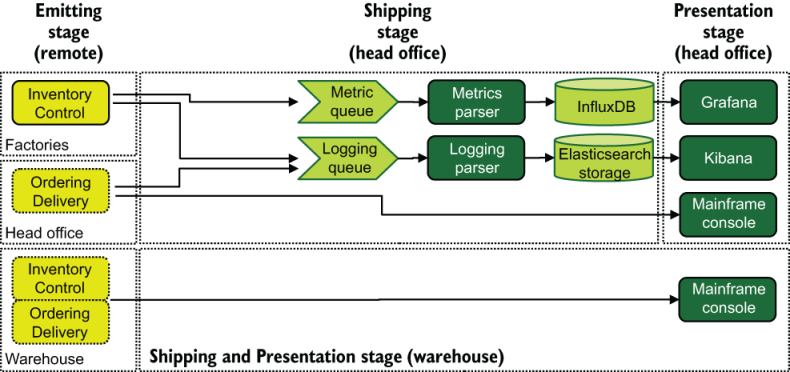

图 10.8 库存控制和订购和交付组的遥测架构。左边的实心框是基于 amd64 的生产系统；左侧的点填充框是基于 IBM POWER9 的生产系统。每个 POWER9 系统都会向大型机控制台发出信号。总部订购和交付系统还通过大型机上的 Linux 分区向日志队列发送数据。每个工厂运行的库存控制系统继续向总部托管的队列发送指标和记录数据。我们再次看到大型机操作强烈倾向于使用控制台进行所有遥测。

与此同时，库存控制小组采取了略有不同的方法。确实，它购买的软件仅向控制台发送信息，但它围绕购买的库存管理软件构建了包装自动化，以消除界面上的一些尖锐边缘。该小组在三个工厂中分别运行基于 amd64 的系统，这些系统通过 WAN 与仓库的大型机连接。基于 amd64 的系统会发送到总部的集中日志记录和指标管道。

这让我们转向 Office IT。这家公司的总部办公桌上早在 20 世纪 70 年代就已经有计算机或串行终端（通常在 80 年代和 90 年代都有），并且还有一个机房来放置服务器。我们看到的 Office IT 遥测系统出于同样的原因，第 10.1.1 节中的中型组织非常注重本地托管的基于服务器的解决方案，大型组织也不例外。不同之处在于，大型组织的办公室IT还需要管理三个工厂和一个仓库，而中型组织只有一个办公室。

图 10.9 中最引人注目的一点是，它与我们迄今为止为汽车零部件制造商看到的软件遥测设计不共享基础设施。这种分离的原因是历史性的。早在 20 世纪 80 年代，当 PC 革命开始时，这家公司就已经拥有了大型机。 IBM PC 当时被认为是微型计算机（这个名称已被放弃），除了替代打字机之外没有明确的商业用途，因此我们汽车零部件制造商现有的软件和硬件运营团队懒得管理它。新电脑不断出现在办公桌上。最终，该公司了解到个人电脑可以取代串行终端，并且当个人电脑联网时，共享电子文件比共享纸质文件更有效。该办公室聘请了某人来管理这些新的联网计算机，从而创建了一个不同的部门。这种分离已经维持了 30 多年。

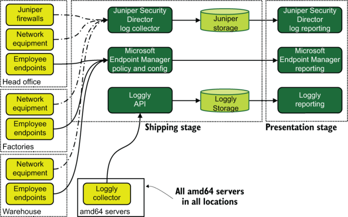

图 10.9 我们大型遗留计算环境中 Office IT 的遥测架构。与图 10.1 中中型组织的版本不同，此设计考虑了多个办公地点。我们看到网络遥测数据被收集在特定于供应商的框架中，而端点遥测数据则通过 Microsoft Endpoint Manager 进行移动。我们还看到所有 amd64 服务器（Windows 和 Linux）都安装了 SaaS 供应商的收集器，它将日志数据发送到 Loggly 云。该架构没有指标遥测，但它具有三种不同的方式来处理集中式日志记录！

与我们在第 8.4 节中看到的大型软件生产组织不同，该组织逐步停止使用 SaaS 提供商进行日志记录，而该公司仍在拥抱它。我们的汽车零部件制造商正在使用 Loggly 云平台进行集中日志记录，但仅限于 Office IT。与大型软件生产组织不同，它可以侥幸逃脱惩罚，因为制造汽车零部件所需的计算机总体数量比运行 SaaS 提供商所需的计算机少。规模仍然对公司有利，因此它正在拥抱规模——而且几乎是公司中唯一这样做的团队。 （另一个是工厂自动化组，使用 Honeycomb 进行跟踪。）

总而言之，我们大型组织的遥测系统比我们为中型提供商检查的遥测系统复杂得多。更多的人组成了更多的部门，这反过来又导致更多的软件被编写和更多的遥测系统被使用。与第 8 章中的软件生产组织相比，这家公司数十年的计算历史无疑在遥测技术方面产生了显着差异：

- 更多地使用集中式日志记录
- 几乎没有使用追踪
- 继续使用 SaaS 产品

## 10.3 全球组织中遥测的使用

与我们在第 9.4 节中讨论的企业组织非常相似，我们在本节中讨论的全球组织在许多法律管辖区运营。本章讨论的是 1981 年之前实现计算机化的大型组织，因此它们在英特尔主导 CPU 市场之前就实现了计算机的广泛采用。这些组织很可能帮助制定了其市场中的计算机化标准（例如银行、航空公司和保险），并且从那时起就一直继承着这一传统。正如我们将看到的，这种规模的组织仍然广泛使用基于 amd64 的计算。以下是全球组织与我们在 10.2 节中讨论的大型组织之间的主要区别：

- 全球组织在国际上运营，因此它们在每个国家都有不同的法人实体，受不同的法律管辖，并具有不同的工作场所文化。
- 他们在计算机化之前就已经很强大了，所以在那个拥有多台计算机已经是一件大事的时代，他们能够在计算机上做大做强。
- 就像 9.4 节中的企业组织一样，他们生产了大量的软件。与第 9.4 节组织不同，他们几十年来一直在生产和改进相同的软件。
- 大型组织设有分支机构，而全球组织则在世界各地设有分支机构。

我们在这里将重点关注的是一家欧洲航空公司，该公司于 20 世纪 50 年代开始运营航班，经历了七十年的监管、放松管制、与竞争对手合并、罢工以及围绕航空旅行不断加强的安全机构。该航空公司不仅经受住了商业环境的变化，而且经受住了计算机化预订系统、向航空当局提交计算机化飞行计划、GPS航班跟踪、在飞行中引入互联网连接以及部署移动应用程序以便乘客可以访问的爆炸式增长。 - 使用自己的设备进行飞行娱乐。航空公司已经深入科技领域，而且做得很早。

尽管该航空公司的移动和网络应用程序开发看起来很像第 8 章中的软件创建组织，但预订、库存和航空当局系统是最早实现计算机化的系统之一。因为我们公司成立于 20 世纪 50 年代，所以这些第一批计算机化系统与第 10.1 和 10.2 节中的组织安装在同一类型的大型机上。这些大型机仍然存在，并构成了所有在线、移动和旅行社预订系统的（深埋的）基础。为了理解它是如何工作的，让我们看看图 10.10 中可用航班查询所遵循的假设路径：

1. 用户向边缘 Web 服务提交请求。
2. 边缘 Web 服务向内部容量 API 发送 API 调用。
3. 内部容量 API 将请求发送到容量查询者以完成。
4. 容量查询器在 Db2 数据库中查询匹配的记录。
5. Db2 数据库将记录返回给容量查询者。
6. 容量查询器通过内部容量 API 返回结果。
7. 内部容量 API 将调用返回到边缘网络。
8. 边缘 Web 服务开始为用户呈现结果。

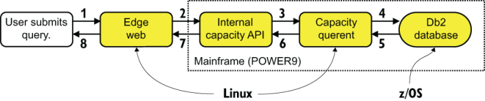

图 10.10 当用户提交可用航班查询时发生的请求流（如果你愿意的话，可以是跟踪）。前端 Web 服务是一个现代的自动缩放服务器池，但它用来满足用户请求的容量 API 位于大型机上。请注意，该大型机正在运行 Linux 和 z/OS 应用程序。

图 10.10 中的边缘网络盒可能是一组地理上分布的机器（为了更接近最终用户），每台机器都将查询发送到位于法国的同一个 Db2 数据库。该架构中的大型机是中央事务处理系统。从历史上看，大型机非常擅长处理高交易率。在 10.1 节中，我们看到了一个包含在单个大型机上的系统。在 10.2 节中，我们看到了一个由多个大型机和基于 amd64 的系统协同工作的生态系统。在本节中，大型机只是大型复杂软件生态系统的另一部分。然而，就像我们在第 9.4 节中看到的企业规模的软件消费组织一样，我们的航空公司由许多消费和使用软件的部分组成，如图 10.11 所示。

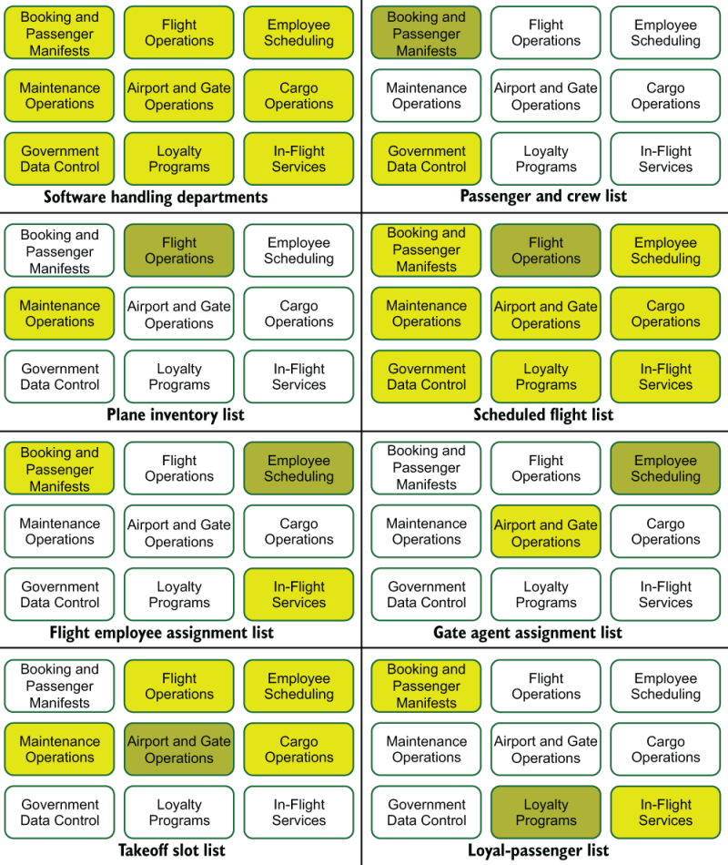

图 10.11 我们全球航空公司的软件消费和生产部门，其中包含航空公司内部生产和消费的七个数据示例。生产部门是暗箱；消费部门是较轻的盒子。

图 10.11 中的每个部门都拥有某些类型的数据并将其提供给其他部门，就像一组较小的公司在一个较大的公司内部运营一样。以下是图 10.11 中的一些示例：

- Booking and Passenger Manifests 拥有每个航班上的乘客和机组人员名单，政府数据控制会使用该名单，以确保遵守相关国家的运输安全法律。
- 航班运营部门拥有飞机库存清单，该清单由维护和货运运营部门使用。
- 航班运营部还拥有定期航班列表，该列表被其他所有内容所消耗。
- 员工调度拥有分配到航班的员工列表，该列表由预订、乘客清单和机上服务使用。
- 员工调度还拥有登机口代理列表，该列表由机场和登机口运营部门用于员工登机口。
- 机场和登机口运营部门拥有起飞时刻和指定登机口列表，供航班运营、货运运营、维护运营和员工调度使用。
- 忠诚度计划拥有注册乘客的列表，该列表由预订、乘客清单和机上服务使用。

我们将仔细研究两个部门使用的软件遥测：

- 第 10.3.1 节研究了预订和乘客舱单部门的遥测生态系统，该部门在 20 世纪 70 年代实现了计算机化操作。
- 第 10.3.2 节研究了忠诚度计划的遥测生态系统，该系统的计算机化要晚得多。

### 10.3.1 预订和乘客舱单部门中遥测的使用

我们欧洲航空公司的预订和乘客舱单部门负责维护乘客数据，包括预订以及包括机组人员在内的航班舱单。该部门处理真正的全球运营，接受其他航空公司的转机，从全球每个登机口获取值机数据，实现整个航空公司运营的票价结构自动化等等。这个部门有很多事情要做，本节介绍它如何跟踪其自动化。该部门混合使用大型机和传统计算方法。与中型组织不同，该部门采用最先进的计算和遥测方法。

在深入研究遥测架构之前，我们需要先了解一下生产系统。我们将研究两个主要工作流程。第一个是预订工作流程，它是一个（大部分）传统的 Web 应用程序，以大型机作为数据库。第二个是登机口检查流程，扫描登机牌并建立乘客清单。

图 10.12 显示了这两个工作流程，它们与 IBM 大型机上运行的三个 API 系统交互。区域网络集群支持航空公司的预订系统。每个机场登机口装载乘客的登机口计算机负责提供数据，以构建航班清单，最终将随飞机一起运送给飞行中的工作人员，发送给民航当局进行航班跟踪，并交付法律要求接收此类数据的其他政府安全实体。

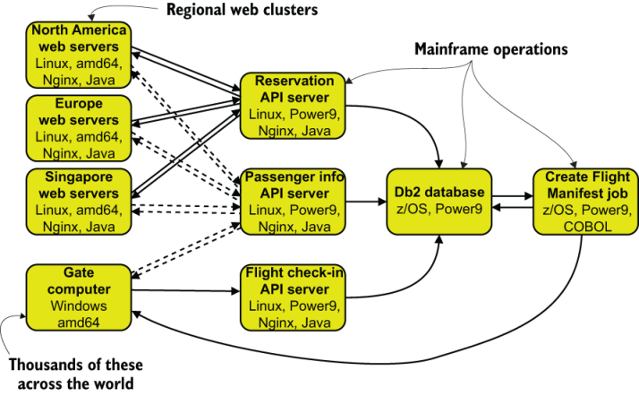

图 10.12 我们的预订和乘客舱单部门的两个工作流程：第一个用于接受预订，第二个用于办理乘客登机手续以生成航班舱单。该航空公司运营着三个区域网络服务器集群，支持北美、欧洲和新加坡的预订。每个机场登机口都有一台登机口计算机装载乘客。预订服务器和登机口计算机与欧洲中央主机上托管的最多三个 API 进行通信。所有乘客办理登机手续后，航班舱单将作为批处理作业创建。我们将在后面的图中查看此生产环境。

图 10.13 向我们展示了从预订和乘客舱单部门的生产服务器流出并进入遥测管道的记录数据流。这里发生了很多事情，所以让我们逐步完成：

1. 事件由三个生产系统发出。
   1. 位于全球的预订 Web 服务器使用后端应用程序代码中的发送器/发送器功能，通过 Webhook 将事件发送到巴黎数据中心托管的 Webhook 接收器。 （有关通过 HTTP `POST` 发送遥测数据的示例，请参见第 3.1.3 节。）
   2. 在 Paris 大型机上的 LPAR 中运行的 API 服务器将事件直接发送到logging_raw 主题上基于 Kafka 的流中，也使用发射器/发送器函数。 （有关将遥测数据发送到流中的示例，请参阅第 3.1.2 节。）
   3. 巴黎大型机上的“创建飞行清单”批处理作业将作业输出发送到大型机系统的控制台中。
2. 来自 Web 服务器和批处理作业的事件发送到流中。
   1. Webhook 接收器重新格式化来自预订 Web 服务器的遥测并将其注入 `logging_raw` 流主题（类似于第 3.1.2 节描述的发送到流中的方式）。
   2. 来自大型机控制台的数据传送到 IBM Common Data Provider 中。
   3. Common Data Provider 将控制台遥测数据发送到在大型机分区中运行的 Logstash。
   4. Logstash 将事件发送到 `logging_raw` 流主题中。
3. 日志解析器订阅 `logging_raw` 流主题并丰富事件。 （有关运输阶段的丰富信息，请参阅第 3.1.2 节和第 6.1 节中的“在运输管道中使用流”。）
4. 日志解析器将丰富的遥测数据发送到称为日志提交队列的队列上。
5. 日志编写器将事件从日志提交队列中弹出。
6. 日志编写器将事件聚合并批量插入到 Hadoop 集群中。
7. 可以通过航空公司编写的自定义日志记录界面查看日志记录数据。

图 10.13 我们的全球欧洲航空公司示例的集中日志记录遥测流程，显示了预订/预订系统遥测（预订 Web 服务器和 API 服务器）和航班值机遥测流程（API 服务器和创建航班清单批处理作业）。这里使用了三种发射和运输技术。该图演示了大型机批处理作业如何将日志记录数据贡献给遥测管道。

指标管道看起来很相似。

图 10.14 显示了一个指标遥测流程，看起来与图 10.13 中的日志记录流程几乎相同，但更改了一些名称。这里，指标数据存储在 OpenTSDB 而不是 Hadoop 中，这有点谎言，因为 OpenTSDB 位于 Hadoop 之上。让指标管道与日志记录管道非常相似（事实上，Webhook 接收器在两个管道中的功能相同，根据遥测类型具有不同的端点）使得每个人都可以更轻松地理解整个管道生态系统，并减轻维护负担。

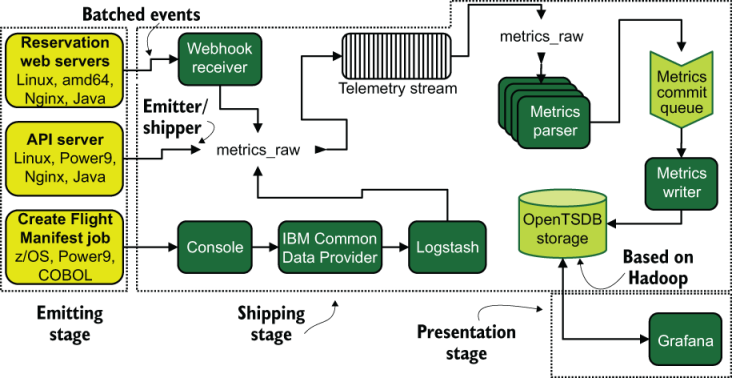

图 10.14 我们全球欧洲航空公司的指标遥测流程。该流程与日志记录流程的步骤相同，但流入 OpenTSDB 而不是 Hadoop。但OpenTSDB基于Hadoop，针对时序数据进行了优化。遥测流程与日志记录的相似性使支持两者的团队更容易理解，从而减轻了维护负担。

我们的预订和乘客舱单部门正在进行现代网络开发，因此它也使用分布式跟踪技术。他们的 COBOL 组件在关键的预订工作流程中不起任何作用，但在大型机上运行的 API 服务器对此流程至关重要。图 10.15 显示了跟踪遥测流程。

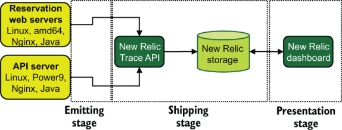

图 10.15 我们欧洲航空公司预订系统的分布式跟踪流程。该部门选择了 New Relic SaaS 平台来提供追踪服务。以这种规模使用 SaaS 提供商是经过深思熟虑的选择。我们的航空公司拥有在内部托管追踪管道的技术能力，但选择不这样做。

图 10.15 显示了这种规模的公司意想不到的事情：SaaS 产品的使用！当如此规模的软件生产公司正在积极摆脱任何 SaaS 的使用时，为什么要以如此规模使用 SaaS？首先，该公司仍然在其 SIEM 系统中使用 SaaS，这是当你有足够的流量来支付七到八位数的年度续订成本时战略性使用 SaaS 产品的一个示例。其次，这家航空公司和第 8.4 节中的公司都选择在特定地点使用 SaaS，因为他们相信，通过付费让其他人构建和维护系统比自己完成系统可以获得更好的价值。第 8.4 节中的软件生产公司拥有如此多的软件工程师，可以在内部处理分布式跟踪，而这家传统计算航空公司认为该角色最好外包给长期合作伙伴。

> 大型机不仅仅用于批处理作业
>
> 10.3.1节展示了在大型机上运行的Linux服务器。大型机的旧标准角色是批处理作业引擎，其中调度作业运行（用作业控制语言编写），对数据库运行查询并返回结果。然而，如今大型机的数量要多得多。关键卖点之一是可靠性；大型机的设计可以保证重启间隔时间长达数年。大型机系统允许你用备用 CPU 热插拔，而不会降低计算负载，而这只是可靠性功能之一。
>
> 正如我们在第 10.3 节中看到的，使用大型机的组织仍然需要与作为分布式系统提供可靠性的系统共存，而不是与一个高度可靠（且大型）的机器共存。并非所有工作负载都可以分配；它需要让一个盒子不会宕机，但仍然需要与可以分布式的系统通信。为了提供帮助，大型机提供了与 z/OS 组件快速通信的内置方法（内存中网络和类似的优化路径），并且还为外部系统提供了与大型机系统的接口。逻辑分区是类似于VMware ESX提供的虚拟化环境；它们允许运行其他操作系统，从而允许将传统软件系统移至大型机的高可用性区域。
>
> 在获得 Linux 的地方，你还可以获得其他开源产品。大型机是开源产品最后支持的环境之一，但它确实受到支持。 Kubernetes和containerd都可以在大型机上运行，这意味着你可以在大型机上做微服务！托管临时容器似乎与大型机相反，但业界其他许多公司转向容器的原因与大型机商店转向容器的原因相同。大型机只是组织技术生态系统的组件（高度可用的组件）。

### 10.3.2 忠诚度计划部门中遥测的使用

我们欧洲航空公司的忠诚度计划部门负责管理该航空公司所有品牌的常旅客和奖励计划。该角色需要跟踪使用品牌信用卡、在飞行期间赚取的积分或里程的忠实客户的消费模式，并安排积分或里程的奖励使用。常旅客计划是比商业航空旅行更新的创新，于 1972 年至 1982 年间出现，使这个故事看起来像第 9 章中的软件消费组织。本节展示了该部门的遥测使用与我们通过第 10.3.1 节中的预订和乘客舱单部门。

主要客户界面是航空公司主网站和航空公司移动应用程序上的子网站。尽管预订和旅客舱单部门负责维护该网站，而忠诚度计划部门则作为租户，但在移动应用程序中，角色却颠倒了。这个组织的效率并不是很高，但政治却做出了看似奇怪的选择。奇怪的组织结构的存在总是有原因的，但这个原因不一定是好的原因。

首先，我们需要查看忠诚度计划部门的生产系统。与必须向民航和政府安全部门提供数据的预订和乘客舱单部门不同，忠诚度计划部门仅与其他航空公司和金融机构共享数据。作为与其他航空公司的数据交换协议的一部分，它提供 API 来查找忠诚度详细信息，以供内部和外部联盟使用。

图 10.16 显示了一个具有应用程序、API、数据库和批处理层的多层生产系统。虽然严格来说这个系统并不是微服务，但它确实表现出了将角色拆分到不同代码库的趋势。我们还看到两种不同的软件堆栈正在使用，Java 用于预订 Web 服务器和信用卡接口，.NET Core 用于所有 API 层系统。我们还第一次看到移动开发。让我们看看这对遥测系统意味着什么。首先是记录流量。

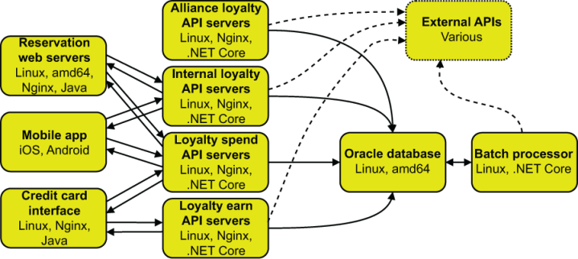

图 10.16 我们的忠诚度计划部门的生产系统。支持的主要应用程序是基于 Java 的预订 Web 服务器上的子应用程序、Google 和 Apple 应用程序商店中的移动应用程序以及信用卡接口系统。这些应用程序使用四个 API，这些 API 使用 Oracle 数据库。批处理处理器运行计划的作业，而不是大型机应用程序。批处理器和各种API还与不属于本部门管理的API进行通信；有些是内部的，有些是外部的，例如联盟航空公司的忠诚度计划 API。这种使用现代软件实践的架构甚至可以出现在百年老公司中。

图10.17显示了测井遥测系统，它使用三种传送方法。预订 Web 服务器使用与图 10.13 中的预订和乘客清单系统相同的传递方法，将事件发送到 Webhook 接收器。同时，在 Azure 和 .NET Core 中运行的 API 服务器将遥测数据直接提交到 Azure 管理的流服务（称为事件中心）。移动应用程序不会从应用程序记录日志，但崩溃报告服务会将应用程序崩溃数据发送到崩溃报告 API。他们还运行一组日志解析实例，为日志记录事件中心和崩溃事件中心提供服务，以丰富遥测数据，然后将其插入由 Azure 维护的 Elasticsearch 集群。

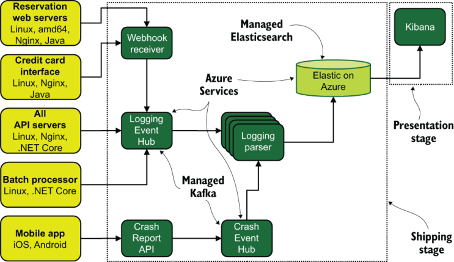

图 10.17 记录我们欧洲航空公司忠诚度计划部门生产系统的遥测流程。虽然生产系统可能不会全部托管在公有云中，但该部门的遥测系统肯定是托管在公有云中，这表明即使是老公司在某些情况下也会使用公有云系统。

这种架构与我们迄今为止在本章中看到的任何架构都有根本性的区别，因为遥测系统全部位于公共云 (Azure) 中。像我们欧洲航空公司这样规模的组织足够大，以至于可以产生计算孤岛，而这些计算孤岛从整个组织的历史中汲取的信息很少。在这种情况下，它不是将所有内容托管在航空公司运营的长期数据中心之一，而是将所有内容托管在公共云中。到目前为止，我们已经看到这家航空公司内部是 API 驱动的，只要保持 API 支持，公司的不同部门就可以在完全不同的堆栈上运行。

图 10.18 显示了忠诚度计划部门使用的分布式跟踪系统，我们在这里看到了多样性。请记住，忠诚度计划正在预订 Web 服务器上运行一个子网站，该服务器由预订和乘客舱单部门管理。由于该子站点，该部门别无选择，只能使用 New Relic 跟踪系统作为预订和乘客舱单管理的帐户中的租户。对于信用卡、API 和批处理系统，它使用 Azure 托管的跟踪服务（称为 Azure Monitor）。最后，对于移动应用程序，它构建了一个 AppTrace API 系统来接收移动应用程序生成的跟踪遥测数据，并将其馈送到定制的解析、存储和表示系统中。

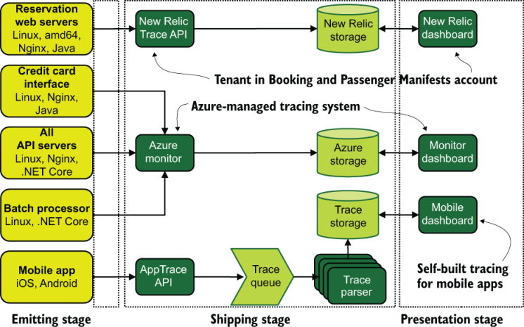

图 10.18 跟踪我们欧洲航空公司忠诚度计划部门的遥测流程。我们在这里看到三个独立的追踪系统！尽管将所有内容都集中到一个桶中并有一个地方可以查看事物固然很好，但这并不总是可能的。

这个系统绝对不是我们在8.4节中看到的企业级软件生产组织的融合跟踪系统！收敛并不总是可能的；关键是要知道什么时候分割遥测数据是个好主意。忠诚度计划决定拆分其追踪基础设施有以下几个原因：

- 该网站的追踪系统是其他部门设置的，所以它没有选择。
- 来自移动应用程序的跟踪与来自在你自己的网络上运行的应用程序的跟踪具有不同的限制，例如狡猾的网络、隐私设置或阻止某些类型的遥测数据到达家庭的过滤器，以及破坏功能的操作系统更新。
- 该部门希望除了移动应用程序内的软件流之外还跟踪用户操作，因此编写聚合跟踪流需要定制的解决方案。

此外，该部门没有指标遥测系统；它不久前就决定追踪可以为它提供所需的一切，所以它从来没有费心去构建一个。如果有人需要查看系统指标，则可以在 Azure 仪表板中看到它们，但该部门没有采取任何特殊措施来收集、整理和丰富指标遥测数据。

# 概括

- 小公司对计算的变化反应最灵敏，因此历史悠久的小型 IT 公司更有可能遵循第 9.1 节中讨论的模式。
- IBM PC 时代之前的计算机与我们现在所使用的计算机不同，这使得推理它们的使用方式（以及它们对 40 年后公司技术使用的影响）变得更难预测。
- 早期的计算机通常以批处理模式运行，按计划运行预定义的作业，没有交互性。大型机是那些早期计算机的后代，并且仍然是在大型数据集上运行大批量作业的最佳系统之一。
- 由于这一遗留问题，在 20 世纪 60 年代和 1970 年代实现计算机化的组织通常仍然拥有小型数据中心（有时称为机房）。
- 打破本地计算的习惯需要管理层深思熟虑地决定与过去决裂，我们在 20 世纪 90 年代和 2000 年代初看到了这一点，人们转向 UNIX 或 Windows 平台，而在 2010 年代，人们转向公共云计算。
- 较早实现计算机化的组织也很早就养成了编写定制软件的习惯，因此本章中的所有组织都在编写软件。
- 中型组织很早就实现了计算机化，因为他们有一个需要快速解决财务会计问题的问题，因此批处理模式大型机很有意义。这种规模的组织通常仍然以大型机的方式运行，因为它们缺乏提升并转移到新平台的组织人才。
- 中型组织早在 SaaS 革命之前就已经实现了人力资源和会计等业务流程的自动化，因此他们使用的 SaaS 平台比第 9.2 和 8.2 节中的中型组织少。
- 中型组织中的办公室 IT 遥测使用遵循我们在第 9 章中看到的模式，主要关注集中式日志记录。
- 大型机的系统日志是操作员控制台，它代表集中式日志记录。
- 大型组织是指拥有一个中央办公室和许多分支机构的组织，这与托管在单个位置的中型组织形成鲜明对比。随着规模的扩大，必须处理 WAN，这改变了大型组织使用遥测技术的方式。
- 大型组织比中型组织拥有更多的人员来开发软件，因此它们在遥测使用方面的复杂程度往往更高。
- SCADA 系统控制工业流程，并处理整个设施中机器人和传感器的详细物理遥测数据。软件遥测与监控计算机上的 SCADA 系统连接，可以公开用于指标轮询的 API。
- 大型机中使用的现代 CPU 架构是 POWER，而不是 amd64/x86_64 或 x86，如果你在大型机上运行 Linux，这非常重要。你的 Linux 发行版（以及你编写的任何软件）需要针对 POWER 进行编译。
- 以总部加分支机构模式运营的组织通常将遥测数据从分支机构位置滚动到总部，从而简化其在分支机构位置的计算足迹。
- 与第 8.3 节中的大型软件生产组织不同，大型组织仍然在遥测系统中使用 SaaS 产品。尽管大型组织仍在生产软件，但还没有达到第 8.3 节组织的规模，因此 SaaS 的经济学仍然有利于使用。
- 与大型组织不同，全球组织在国际上运作，这使得它们受到许多法律环境的约束。
- 在 IBM PC 革命之前，全球组织已大规模实现计算机化，因此如果他们想要废除大型机，他们需要克服最大的惯性。
- 全球最大的组织都位于金融、航空旅行和保险等受到严格监管的行业，这使得改变商业实践变得更加困难。
- 现代 Web 开发仍然可以使用基于大型机的数据库作为其架构的一部分，这使得在查看网站如何工作时很难识别大型机。
- 大型机允许创建允许运行不同操作系统的 LPAR，类似于 VMWare ESX 的虚拟化工作方式。实际上可以通过在 LPAR 中使用 Linux 在大型机上运行 Kubernetes！
- IBM 制作了一个 Common Data Provider，可以将大型机控制台数据传送到其他位置（例如流和队列），从而使其能够参与集中式日志记录和指标管道。
- 全球组织足够大，计算孤岛可以独立存在，并且不会意识到更大组织在早期计算实践中的历史。这就是一个部门可以是大型机和一些 Linux，而另一个部门在 Azure 中托管整个基础设施的方式。
- 移动应用程序开发在跟踪方面有非常不同的限制，包括狡猾的网络、隐私过滤器阻止操作，以及谷歌或苹果以破坏遥测的方式改变操作系统。由于这些原因，移动设备的跟踪看起来与服务器部署的软件的跟踪不同。
