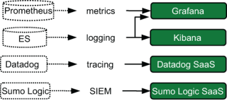

# 8 成长中的基于云的初创公司

本章涵盖

- 处于多个成长阶段的初创遥测架构
- 不同成长阶段推动变革的力量
- 遥测架构如何随着快速增长而变化

本章介绍遥测系统设计在基于云的技术初创公司的生命周期中如何变化。这家公司正在从头开始构建一切——一张空白的画布来发展其伟大的想法。出于教学目的，这家公司陷入了困境。现在它变成了一家小公司；它向企业的成长就是现在。事实上，当一家科技公司从三个人拥有一个伟大的想法转变为一个拥有自己的总部大楼的人时，每次做出新的决策时，它都会容纳十年或更长时间的技术决策。

注意第 2 部分的所有章节都是为了使用第 1 部分中的技术来讲述遥测故事，作为提供集成遥测系统的更具体示例的一种方式。如果你觉得需要更多现实世界的示例来了解这些系统的工作原理，那么这些章节适合你。如果你觉得自己已经很好地掌握了这些概念，则可以跳过这些章节并继续进行第 3 部分。

基于云的技术初创公司有几个显着特征：

- 它很年轻。这家公司成立还不到10年。如果它比 10 早得多，它开始看起来更像第 9 章中的组织。
- 之前什么也没有发生。这家公司是从零开始建设的；没有之前的工作过去或重构。
- 它发展得很快，至少在开始时是这样。当你没有历史时，历史不能强迫你坚持到底，所以你可以很快改变方向。但随着公司的老化，这种优势就会消失。
- 科技行业喜欢它。这一事实有很多影响，例如缓解财务状况和提高公司雇用技术人才的能力。受欢迎有它的好处，这就是为什么本章是第 2 部分的第一章。

从遥测系统的角度来看，初创公司、非软件组织（第 9 章）和历史悠久的计算组织（第 10 章）之间的主要区别在于存在一群需要使用遥测来完成工作的技术员工——从第一天起就一直在那里的一群人。对于非软件公司来说，这样的群体只有在公司达到一定规模后才会出现（参见第 9.3 节）。对于一家历史悠久的公司来说，这群技术员工从 20 世纪 70 年代就已经存在，也就是公司成立很久之后。对于初创公司来说，遥测处理是产品推向市场之前需要解决的一长串问题之一。

本章的每一节都有两个小节：

- 对示例组织的生产和遥测系统的描述，以突出不同规模公司之间的变化
- 对遥测系统正在使用的遥测技术进行分析（取自第 2 章至第 7 章），以演示这些技术如何在完整的遥测系统中组合在一起

本章旨在展示你在第 2 章至第 7 章中学到的技能如何在这些规模和类型的组织中使用。当你了解每种类型的公司时，问自己几个问题：

- 所展示的遥测架构是什么？
- 有哪些激励措施可以使所描述的遥测架构成为所选择的架构？
- 技术组织结构的哪些要素推动了遥测架构设计？

这些问题的答案将告诉你当你的职业生涯将你带到此类组织时会发生什么。当你被要求集成新的遥测系统时，你将能够将其正确放置在现有遥测系统和业务驱动程序的上下文中。请记住：人类的政治与遥测系统设计的关系与你所使用的技术的现实关系一样大。

## 8.1 小公司阶段的遥测

小型基于云的初创公司是指尚未发布产品或只有少数人支持其产品的初创公司。本节介绍了具有专门软件工程师的这种规模的组织如何解决遥测问题。这个组织可能是由三名从事其他工作的软件工程师创办的，但他们有一个伟大的想法，并在空闲时间开始研究它。在某种程度上，这个伟大的想法看起来具有一定的市场潜力，因此三个人决定冒险并成立公司，开始向投资者出售这个伟大的想法。

当投资者认为这个大创意具有一定的市场价值时，种子轮（初始投资）可以让三位创始人开始发展他们的新公司，而不必担心资金耗尽。聘请更多的工程师来帮助实现这个伟大的想法；聘请一些客户客户经理来维持与客户的关系并完成交易。

在此阶段，公司面临的业务挑战是寻找市场契合点——任何市场契合点，无论在哪里都能找到。诸如最小化可行产品（MVP，即能够被市场接受的最简单的产品）等概念被多次提及，并且 MVP 模型会根据销售和支持的反馈进行调整。每一笔完成的交易都会受到庆祝，当高合同价值的客户变得暴躁时，每个人都会关注。企业面临的最大风险是资金耗尽。

> 最低限度可行的产品
>
> 小型初创公司的大部分精力都花在弄清楚 MVP 是什么上。有些公司很幸运，一开始就找到了解决办法；有些公司则很幸运。其他人则必须调整他们的产品以适应目标市场的需求，或者对意外的市场做出反应，认为他们的产品非常适合。如果之前的观点不清楚，一家小型初创公司一直担心在找到 MVP 之前就耗尽资金。
>
> 但这还不是全部。 MVP 概念也适用于公司试图进入的任何市场。它表现良好的第一个市场可能是一到三人的房地产办公室。然而，多办公室房地产代理机构有更高级的要求需要满足，这意味着这些公司的 MVP 更具挑战性。 MVP 概念永远不会随着初创公司的消失而消失。即使是那些轻松地向财富 500 强公司销售产品的公司，在向市场推出新产品以使销售产品多样化时，仍然会谈论 MVP 产品。

对资金耗尽的恐惧和寻找市场契合点的动力强烈激励小型但不断发展的技术组织将所有精力集中在生产系统上。如果可能的话，其他一切都需要委托给第三方，这就是为什么这种规模的公司几乎总是将其生产系统托管在某种形式的公共云中。他们的遥测系统要么是公共云附带的本机选项，要么是管理尽可能多的遥测管道的第三方选项。图 8.1 显示了这种完全委托遥测方法的示例。

图 8.1 基于 AWS Elastic Container Services (AWS ECS) 产品的早期启动生产/遥测架构。通过将运输和演示阶段委托给 SaaS 提供商，我们初创公司的软件工程团队可以完全专注于生产生产系统并更快地实现盈利。

### 8.1.1 描述小公司的遥测系统

在图 8.1 中，我们看到了一个小型初创公司可能用于其生产和遥测系统的示例架构。该公司选择遥测 SaaS 供应商 Datadog 来提供其遥测生态系统。该公司在 AWS ECS 中运行其代码，并在其生产代码中使用发射器/发货器功能（请参阅第 3.1.3 节）将遥测数据发送到 Datadog API。当人们想要与遥测进行交互时，他们会使用 SaaS 平台 Datadog 来实现。这种架构使软件工程团队只需担心与 Datadog API 的兼容性，而不用担心自己构建和维护整个遥测生态系统。

这种形式的架构，通过委托遥测技术，使技术组织能够将精力集中在生产代码上。在公共云中，尤其是对于 AWS ECS 和 Fargate 等高度托管的服务，技术组织可以免于管理操作系统和生产系统的网络组件的麻烦。尽管像 Datadog 这样的遥测服务提供商通常根据摄取的数据量来定价，但小型初创公司可能没有足够的流量，因此此类成本还不足以成为主要问题。

对于遥测样式，ECS 控制台可能是集中式日志记录的唯一来源。 Datadog 提供指标和可选的分布式跟踪。这种规模和历史的公司可能完全依赖分布式跟踪来满足其集中式日志记录需求，并使用 AWS 控制台来实现特定于 AWS 的遥测。

这种规模的公司在其技术组织中通常只有软件工程师，因为其他一切都已委托给第三方。不需要运营团队，因为云提供商几乎包揽了所有事情；剩下的可以由软件工程师来处理。 DevOps 团队可能存在，但它可能由软件工程师组成，他们更关注测试和部署工具而不是生产软件，并且可能不认为自己是一个独立的团队。仅当公司试图销售的市场需要高安全性解决方案时，安全团队才会出现。技术组织结构图与生产/遥测系统架构一样精简：一个盒子。

### 8.1.2 分析小公司的遥测系统

让我们看一下这家小型初创公司的遥测管道的发射、运输和演示阶段是如何处理遥测的。从图 8.1 中我们看到该公司使用两种遥测方式：

- 指标，来自软件本身
- 集中式日志记录，来自 AWS 本身以及软件向标准输出发出的任何内容

#### 发射阶段

本节重点介绍我们小型初创公司遥测管道的发射阶段。小产品的占地面积也很小，如图 8.2 所示。

图 8.2 小型基于云的初创公司的发射阶段，将两种遥测样式（指标和日志记录）发送给 SaaS 提供商。发射级组件是填充框和实线。 Fargate 集群发送到 AWS 控制台，生产任务的任何输出也发送到 AWS 控制台。生产任务中的 Datadog 功能将指标发送到 Datadog SaaS 云。我们的初创公司直接维护的唯一组件是生产代码内指标的发射器/发货器函数。保持尽可能少的发射阶段，以最大限度地关注生产代码。

该架构中恰好有两个排放源：

- 生产系统发布的指标
- AWS ECS 控制台中显示的任何内容，包括 AWS 和 Fargate 特定的遥测数据以及生产软件的输出

他们的生产软件在代码中使用了发射器/运输器功能，这是第 3.1.3 节中的技术。此代码使用在生产软件中运行的 Datadog SDK 发送到 Datadog API 端点。尽管 Datadog 支持跟踪，但该公司的生产系统对于该功能来说还不够复杂。

集中式日志记录完全由 AWS 进行端到端处理。第 2.1.3 节描述了如何使用标准输出来发出遥测数据，该公司正在使用 AWS ECS 和 Fargate 来实现这一点。 AWS ECS 本身使用第 4.1.3 节中的技术来捕获输出，这将我们引导到运输阶段。

#### 运输阶段

本节重点介绍我们小型初创公司的运输阶段。由于遥测管道高度委托给第三方，因此本节主要关注遥测如何转移到 Datadog 和 AWS 系统中。图 8.3 展示了其系统的运输阶段组件。

图 8.3 小型基于云的初创公司的运输阶段。装满的盒子是运输阶段的组件；虚线框是发射级组件。 SaaS 提供商及其代码构成了整个运输阶段，使我们的小型初创公司能够完全专注于使其产品实现盈利。

对于指标遥测，发射器/托运人功能仍然是运输系统的一部分。发送者/发送者代码将指标发送到 Datadog 云。指标运输管道是

1. 从生产软件中的发射器/运输器功能发射
2. 由生产代码中的Datadog代理接收，然后发送到Datadog云

对于集中式日志记录，当遥测数据发送到标准输出时，它会进入 AWS 平台，这就是我们现在关心的。这个系统故意简单，因为我们公司更注重实现盈利，而不是确保其软件完全配备了日志记录、指标和跟踪。

#### 展示阶段

本节介绍我们小型初创公司的演示阶段，该初创公司的系统非常小。该公司将Presentation阶段委托给第三方，因此其Presentation阶段系统是外部系统。对于指标，Datadog SaaS 门户提供演示阶段所需的所有指标。对于集中式日志记录，AWS ECS 控制台可以满足所有演示阶段日志记录需求。

## 8.2 中型公司阶段的遥测

一家中型基于云的初创公司是指已经弄清楚如何向至少一个市场销售产品并成立的初创公司。该公司有足够的收入来平息小阶段资金耗尽的恐惧。对金钱的担忧并没有完全消失——在初创企业中从来没有——但企业死亡的前景现在是几年后而不是几个月后。内部人士更担心的是通过裁员来将支出纳入收入。本节介绍的是一家已经确定了自己的市场并正在寻求扩大其市场份额的公司。

这家公司从小公司阶段以来已经发展了很多。过去它只有一个由软件工程师组成的大型团队，但现在它的技术组织中有足够的人员来拥有多个团队。在这个阶段，DevOps 团队很可能已经获得独立，并且是一个正式的团队。 （他们的团队名称是否包含 DevOps 一词取决于技术组织中的人员。）。该团队专注于改进开发工作流程并使软件部署尽可能简单。这个阶段是 SRE 团队可能出现的第一个阶段，可能代替 DevOps 团队，从客户的角度使产品稳定。单独的安全团队仍然不太可能存在，但如果市场需要这样一个团队，你就会看到这样的团队。

尽管该公司有持续的收入，但该公司很可能已经用完了外部投资者在初始投资中提供的资金。在此阶段的公司通常会寻求第二轮或第三轮投资（A 和 B 系列投资），以继续入不敷出并加速产品开发。一般来说，如果一家公司不是超级明星，其维持运营所需的外部投资越多，投资者对其运营的影响力就越大。这种影响有时会指导技术基础设施的发展方式。

该公司花了数年时间来构建、完善和增强其产品。更多的功能意味着更多的代码和生产系统中的更多复杂性。图 8.4 显示了该架构与图 8.1 相比有何变化。

图 8.4 中型基于云的初创公司的示例生产和遥测系统架构。存在两个而不是一个遥测服务外部提供商。 （Sumo Logic 是新的。）我们还看到了专用的持续集成/部署 Fargate 集群。 SaaS 提供商仍然是唯一的遥测系统，使软件工程能够继续专注于产品。

### 8.2.1 描述中型公司的遥测系统

比较图 8.4 和图 8.1 时，我们看到该公司扩大了 AWS ECS 的使用范围，并以 Sumo Logic 的形式添加了第二个遥测 SaaS 产品，并且现在使用多个 Fargate 集群来托管生产代码。该公司添加了一个新的 Fargate 集群，专用于其持续集成和部署服务，用于在部署前测试代码质量（持续集成 [CI]）并自动化部署过程（持续部署 [CD]）。小公司使用 AWS ECS 控制台进行集中日志记录，而中型公司已经意识到该系统的局限性，并订阅了 Sumo Logic SaaS 产品，为生产系统和 CI/CD 系统提供集中日志记录。它保留了 Datadog 继续提供指标，现在还提供分布式跟踪服务。与小公司一样，几乎所有遥测管道都是承包给外部方而不是拥有的。

该公司继续在生产系统中使用发射器/运输器功能。这些功能现在发送到两个独立的管道中，每个管道用于处理遥测的 SaaS 公司。 CI/CD 集群发送到 Datadog，因为它使用指标和跟踪数据来验证新代码不会引入性能回归。

在这个阶段，对外部方遥测服务的依赖开始体现在公司的盈利中。到目前为止，使用第三方提供遥测服务使该公司能够专注于真正重要的事情：制造能够赚钱的产品。既然该产品正在赚钱，通过降低运营成本来提高盈利能力开始看起来很有吸引力。每家公司都是不同的，面临着不同的力量，但如果我们的中型初创公司开始耗尽投资资金并且必须依靠直接收益生存，那么将这些委托的遥测服务引入内部就开始有意义。

图 8.5 展示了这种遥测转变的不同架构。推动这一变革的是 DevOps 或 SRE 团队，他们通常拥有基础设施管理经验。

图 8.5 中型基于云的初创公司的变体，在 AWS 而不是另一个 SaaS 应用程序中处理集中日志记录。将集中式日志记录转移到内部表明对使用 SaaS 服务进行最昂贵的遥测方式（集中式日志记录）的成本敏感度。

在图 8.5 中，我们看到图 8.4 中 Sumo Logic 所扮演的集中式日志记录角色已被 AWS (SQS)、AWS Elastic Kubernetes Services (EKS) 和 AWS Elasticsearch 组合托管的不同系统所取代。在这里，生产 ECS 任务中的发送器/发送器功能已更新为直接发送到 SQS，这是一种类似于第 3.1.2 节中介绍的架构。从那里，Fluentd 已配置为从 SQS 队列中提取项目。 Fluentd 完成事件处理和转换后，会将它们存储在 Elasticsearch 中。 Kibana 作为 AWS Elasticseach 产品的一部分提供，用作集中式日志记录系统的演示阶段。

最后，在图中看到 EKS 表明该公司开始感受到 AWS ECS 平台的限制。 ECS固执己见；它使特定类型的应用程序设计变得容易，并且与该模式不同需要大量工作。这种安排对于刚刚起步的公司来说非常有用，因为它不必浪费时间构建部署自动化或花时间决定应用程序设计模式。然而，在仍然使用容器的同时走出 ECS 框，通常意味着采用 EKS 来提供额外的灵活性。 EKS 比 ECS 需要更多的维护，这就是 DevOps 和 SRE 团队发挥作用的地方。概括起来，中小企业到中型企业的变化包括：

- 一个更大的技术组织分为多个团队。
- 生产系统要复杂得多，现在包括 CI/CD 系统。
- 遥测系统添加了第三种遥测方式：跟踪。
- 基于 SaaS 的遥测系统的成本现在已经足够大，足以引起人们的关注，并且可能会引发内部遥测系统的迁移。

### 8.2.2 分析中型公司的遥测系统

让我们看一下遥测管道的三个阶段中的每个阶段如何处理遥测。让事情变得更加复杂的是该公司在中型阶段中进行的转变，其中集中式日志记录最初作为 SaaS 解决方案的一部分（早期中期阶段），但在内部转移到了不同的公共云容器管理产品上（后期）中期）。

#### 发射阶段

本节介绍我们中型初创公司的发射阶段以及强制进行更改的驱动因素。排放继续更多地关注排放者/运输者功能，但这些功能现在的工作方式变得越来越复杂。图 8.6 显示了 Emitting 阶段在中途如何变化。

图 8.6 中型基于云的初创公司的发射阶段组件。发射级组件具有固体填充。该图显示了遥测处理中的早期/晚期分裂；这家早期的中型公司使用 SaaS 提供商进行集中日志记录，但在中型公司后期出于成本原因转向内部解决方案。后期是该公司首次承担直接创建和维护遥测系统的重担。

早期阶段的系统看起来与小公司中的系统很相似，生产软件使用代码中的发射器/发货器功能来发送指标，现在将遥测数据记录到 SaaS 提供商。但现在有三个独立的发射器/发货器功能：

- 该公司使用 Datadog SDK 编写了一个特定的指标发送函数，该函数发送到 Datadog 代理。
- 它还使用 Datadog SDK 来检测其跟踪代码，用于分布式跟踪，同时也会发送到 Datadog 代理。
- 将 AWS ECS 日志配置为直接发送到 Sumo Logic 后，该公司编写了特定的记录器，将事件发送到标准输出（请参阅第 2.1.3 节）。

在公司发展为中型公司后期后，集中式日志记录转移到内部。这样做需要改变第三个发射器/传送器功能，不再将所有内容都放入标准输出，而是直接发送到 AWS 中的 SQS——第 3.1.2 节中的直接到队列模式。

#### 运输阶段

本节介绍了我们中型初创公司在成长过程中的运输阶段部分。与该公司的小型版本不同，后期中型公司开始维护部分运输阶段（图8.7）。

图 8.7 中型基于云的初创公司早期和后期的运输阶段组件。虚线和方框是发射阶段组件和事件流程；实线和填充框是运输阶段组件和事件流。该公司维护自己的遥测系统和运输阶段组件的举措是通过财务安全和技术组织技能的提高而实现的。

与发射阶段一样，早期和后期遥测架构之间存在显着差异。早期的架构很像小公司的架构，有指标、分布式跟踪和集中式日志管道，如下所示：

1. 指标、跟踪和日志记录从发送者/发送者功能发出。
   1. 跟踪和指标直接发送给 SaaS 提供商。
   2. 日志记录通过标准输出发出并由 Fargate 日志记录捕获。
   3. Sumo Logic 轮询 Fargate 日志记录。
2. 指标、跟踪和日志记录由 SaaS 提供商云获取。

将集中式日志记录引入内部标志着该公司运输阶段的第一个真正的变化。新的管道涉及端到端的自我管理标记和丰富（第 6 章）。管道阶段是

1. 生产代码中的发射器函数添加上下文相关的遥测数据（请参阅第 6.1 节）并将遥测数据发送到 AWS SQS 队列（请参阅第 3.1.2 节）。
2. Fluentd 在 AWS 上的 EKS 中运行，配置为从队列中提取事件。
3. Fluentd 丰富了遥测数据（请参阅第 6.2.2 节），并在将遥测数据发送到 Elasticsearch 中的存储之前根据需要转换数据类型（请参阅第 6.2.3 节）。

如果仔细观察图 8.7，你将看到来自 Fluentd 并进入 SQS 队列的虚线（发出阶段事件流）。该虚线事件流表示由遥测系统本身发出并被摄取的遥测数据。 Elasticsearch 和 Kibana 组件没有这条虚线，因为它们是托管 AWS Elasticsearch 服务的一部分。

#### 展示阶段

本节介绍我们中型初创公司使用的遥测系统的演示阶段，并展示它如何随着部分运输阶段转移到内部管理系统而发生变化。早期和后期中型公司架构的一个关键区别在于，后期架构首次拥有由公司而不是SaaS提供商管理的演示系统。这家早期公司在其演示阶段系统中使用了两个 SaaS 提供商：用于指标和跟踪的 Datadog，以及用于集中日志记录的 Sumo Logic。然而，后期公司使用第 5.2 节中的功能列表，使用 AWS Elasticsearch 提供的 Kibana 来开发用于集中日志记录的演示阶段系统。

## 8.3 大公司阶段的遥测

大型基于云的初创公司是在中小型企业市场中站稳脚跟的初创公司，并且正在寻求进入高端市场以获得财富 500 强等公司的合同。中小型企业对他们的合作伙伴并不挑剔。选择供应商，但大公司通常要求任何新供应商完成供应商评估，以确保与新供应商安全地开展业务。在中小型企业市场中相当可行的产品在大公司中甚至根本不可行。 MVP 已经改变，因此要进军高端市场，产品必须再次改变。本节介绍大公司给生产和遥测架构带来的变化。

该公司已从一家中型公司发展壮大，目前收入已高达数千万（如果不是更多）。随着公司巩固其在中小型企业领域的地位，技术组织也变得更加复杂。现在软件工程师的数量足够多，全体会议需要一个礼堂，而且每个人都不认识其他人。如果 SRE 没有在中等规模阶段到达，则会作为一个新团队创建，从而为产品开发带来技术纪律。向企业的迁移以及随之而来的所有供应商评估第一次刺激了安全团队的创建（如果安全团队尚未到位的话）。现在存在 DevOps 或运营团队，因为维护生产系统运行的平台是一项足够大的工作，需要整个团队的支持。

这个阶段也是从公共云到在数据中心运行实际计算机的第一个大型出口。即使对于生产系统的一部分，做出这种转变的决定也是焦点的重大转变，因此并非轻率做出的。如果产品涉及大量存储，运行充满存储系统的数据中心可以提供足够的规模效率来击败公共云选项。或者，市场可能会受益于公共云根本不提供的专业硬件。无论原因是什么，此时都可能会转向物理硬件，从而将真正的运营团队带入技术组织。

随着规模经济开始影响平台决策，公共云选项的使用也可能在这个阶段发生变化。 AWS ECS 非常适合将代码快速推向市场，其完全托管的系统使技术组织能够专注于他们最擅长的事情：编写代码。当技术组织超过 250 人时，成本计算就会发生变化，因为其中一些人可能非常擅长构建和维护以前外包的系统。或者，也许托管选项只是相当不错，而公司需要很棒的服务，因此它在 AWS 或 Azure 等通用云中构建了自己的版本。

目前的生产系统完全适合中小型企业空间，旨在挑战大型企业。该系统具有漂亮的 Web UI、用于以编程方式与系统交互的 API 以及移动体验。可能有多个数据库支持不同的功能。

从代码角度来看，公司规模较小时做出的选择将再次困扰着大公司，从而造成日益严重的技术债务问题。当公司只有三个人有一个伟大的想法时，所选择的尖端技术现在已经接近主流，而这家公司甚至可能是这一推动背后的推动者之一。所有这些因素与客户的增长一起考虑，需要对产品进行重大重新设计，以改变设计假设。巨石四分五裂；微服务被合并；技术机构进行了重组；数据库被拆分或合并；遥测系统被重新审视。

组织变革的最终驱动力是与财富 500 强公司签订合同的愿望。此类公司所需的供应商评估是一个扩展的面试过程，以确保潜在的供应商具有安全的数据处理流程，可能在常见的灾难中幸存下来，并且可能在五年或十年内仍在营业。通过遵守美国注册会计师协会的服务运营控制 2 (SOC 2) 框架等框架，可以大大缩短甚至消除此面试过程。

SOC 2 等合规性框架要求组织满足内部流程、程序和数据处理政策的某些标准，并按计划由第三方审核员进行审核。向潜在客户提供第三方发布的报告，详细说明贵公司遵守安全操作程序的情况，可以大大提高达成大额销售交易的速度。这种情况固然美妙，但要达到这一点是一项巨大的工程，往往需要数年时间。

SOC 2 和其他合规框架迫使技术组织达到以前可能不存在（或不统一存在）的特定最低组织成熟度水平。虽然拥有五名工程师的小公司允许每个工程师直接将代码推送到生产环境并直接探究生产系统的工作方式，但受合规性框架约束的公司必须大大减少或消除编写代码的人员修改生产的能力直接系统。必须制定一个流程来确保转移到生产的代码已经过测试并批准部署，并且对生产系统的更改也经过了类似的审查。这个过程是一个变更管理过程。

> 注：遥测系统对于第三方审核员评估程序合规性至关重要。当你检查项目以实现合规性时，你的遥测系统将看到大量更新。你会发现你需要向遥测流添加比以前更多的内容。做好准备。

尽管中小型公司的基础设施图表非常相似，易于识别，但大型公司的基础设施图表却截然不同，因为进入企业市场所需的所有变化。图 8.8 显示了生产系统。

图 8.8 大型基于云的初创公司的生产系统架构，显示了 AWS 托管服务（AWS EKS、RDS 和 RabbitMQ）的广泛使用以及通用系统（使用 Linux 的 AWS EC2）的新使用。使用RabbitMQ取代了中型公司架构中使用的SQS。 EKS 中的容器和 EC2 中的实例与遥测服务进行通信（图 8.9）。该图表明生产环境日益复杂，操作大型系统的技能不断提高。

我们看到该公司自中型时期以来就扩大了对 AWS 的使用，扩展了 EKS 的使用并添加了 AWS 关系数据库服务 (RDS) 数据库和 AWS RabbitMQ 队列。该公司正在运行一个指向 EKS 资源的 API 网关。由于空间原因，此处未显示现在在 AWS EKS 中运行的 CI/CD 系统，与生产系统相同。

与遥测系统发生的变化相比，生产系统中的重大变化很小。图 8.9 显示了遥测变化。

图 8.9 大型基于云的初创公司的遥测系统架构，显示了生产系统中使用的四种遥测样式和事件流。 SaaS 提供商现在仅提供分布式跟踪和 SIEM 服务；集中式日志记录和指标已被引入内部。事实上，指标已被引入内部，这表明该公司的指标遥测需要比 SaaS 提供商能够支持的更复杂的内容。

### 8.3.1 描述大公司的遥测系统

Sumo Logic 曾经是中型公司早期的中心化日志服务，但后期由于成本压力，公司将其移除。为什么又回来了？新的安全团队需要 SIEM，而 Sumo Logic 拥有适合该团队的功能，为 Sumo Logic 提供来自集中式日志记录流的经过高度过滤的遥测数据流，并在此处作为路由器服务的一部分进行处理。

该公司还删除了 Datadog 作为指标服务，但保留了它以用于更昂贵的分布式跟踪遥测样式。这一变化表明，该公司认为 Datadog 指标服务在中小型阶段表现良好，但其功能不足以满足其现在的需求，因此决定构建自己的指标服务。新的指标服务建立在 Prometheus 时间序列数据库的基础上，具有定制的自动化功能，可提供聚合和报告。

中型和大型遥测架构之间的另一个区别是队列的作用。中型架构使用 Amazon 的 SQSa 作为运输中心点，但在大型架构中，该角色由 Amazon 的托管 RabbitMQ 服务填补。是什么导致了这种变化？特征。 SQS 是一个简单的队列，但该公司需要一个真正的消息代理，并选择了 RabbitMQ，因为它使用了良好支持的高级消息队列协议 (AMQP) 并能够支持分布式架构。

这种新的遥测架构还首次展示了多租户技术，Sumo Logic 中的安全团队完全独立。路由器的使用是一种多租户技术，在第 7.2.1 节中详细讨论，尽管这里它更多地用于将遥测定向到特定于样式的队列。也就是说，种子是为了支持更全面的多租户而播下的。

这里没有显示流经该生态系统的遥测数据的绝对数量。合规框架有明确的任务，能够追踪（并证明他们可以追踪）谁做了什么、何时、何地以及如何进行；满足这一任务需要捕获比以前捕获的更多的系统级遥测数据。处理所有这些跟踪遥测数据需要专用的安全软件：SIEM。

这是一个很大的变化！以下是推动大部分变化的一些快速点击：

- 对合规框架通过审计报告的需求正在推动生产和遥测系统发生重大变化。
- 消息路由的复杂性正在成为遥测系统变化的驱动因素。
- 技术组织规模的扩大也增强了组织的能力，使公司能够直接处理过去外包的任务。
- 生产系统技术日益复杂，开始促使该公司从原来的云提供商转向支持其所需定制级别的提供商。

### 8.3.2 分析大公司的遥测系统

在本节中，我们将了解三个遥测管道阶段如何在中型和大型公司阶段之间演变。作为中型阶段的一部分，我们看到了将遥测服务移入内部的过程的开始，并且该过程在大型阶段中进一步推进。

#### 发射阶段

本节介绍了我们大型初创公司的发射阶段组件，并展示了它如何进行更改以支持新的计算平台。这些组件（图 8.10）是后期中型公司所熟悉的，因为该公司继续尽可能使用发射器/运输器功能。

图 8.10 大型云公司的发射阶段组件，现在在两个公共云中运行代码

发射阶段最大的演变是添加了基于 EC2 的 Linux 服务器作为生产系统中的部署平台，但即使是容器代码也继续遵循生产代码内的发射器/传送器功能的模式。虽然该公司在中型阶段仍在使用 Datadog 来衡量指标，但现在它已将指标引入内部并构建了内部维护的 SDK，供软件工程师用来提供其代码中的指标排放。然而，随着指标转向自托管以及队列从 SQS 更改为 RabbitMQ，发射器/传送器功能发生了微妙的变化：

- 对于在 AWS EKS 中运行的代码，所有集中式日志记录和指标发送都会提交到基于 RabbitMQ 的队列而不是 SQS 队列。
- 对于来自基于 EC2 的 Linux 服务器本身的遥测数据，Fluentd 安装在本地，以将系统遥测数据从日志发送到 RabbitMQ。
- 在 EC2 实例上运行的遥测系统是新的，并且还会将集中日志记录发送到基于 RabbitMQ 的队列。
- 基于 EKS 和 EC2 的生产系统继续使用 Datadog。

最重要的阶段是安全和合规性问题开始真正引起关注：管理操作系统附带的系统日志现在必须包含在遥测流中，因为新的安全团队需要该遥测。系统日志遥测（无论是 Syslog 还是 Windows 事件日志）发生的情况是运输阶段的故事。

#### 运输阶段

本节介绍我们大型基于云的初创公司的运输阶段组件，并展示它如何适应新平台和合规性要求。随着我们公司进一步完善遥测技术的使用方式，中型系统的复杂性显着提高。图 8.11 显示了运输阶段组件。

图 8.11 大型基于云的初创公司的运输阶段组件。发射阶段组件和事件流使用虚线，运输阶段组件被填充，事件流使用实线。所有遥测源继续使用 Datadog 进行跟踪。该系统以 SIEM 系统的形式演示了多租户。

大型公司的运输阶段比中型公司的运输阶段复杂得多。虽然中型公司有一个使用 SQS 进行运输遥测的集中式日志系统，但大型系统

- 将队列移至 RabbitMQ 而不是 SQS，以节省资金并提高灵活性。 （与 SQS 不同，RabbitMQ 允许复杂性。）
- 采用第 7.2.1 节中的路由器概念，容器专门用于决定哪个遥测系统或所有者需要成为下一个来处理每一项遥测数据。路由器使用专用队列进行日志记录和指标遥测样式。基于队列的路由可以简化生产代码中所需的 SDK。 （将所有内容发送到队列，然后让路由器对其进行排序。）
- 新解析器上的分叉日志记录遥测。安全团队也需要此源，因此解析器将与安全相关的遥测数据发送到两个地方。
- 使其解析器系统多样化，添加用于日志记录和指标的专用容器组，以根据其基础设施的规模进行扩展。

使用组合流进行集中式日志记录和指标，并在路由器上进行拆分，是第 7 章中的多租户概念。尽管该公司只有两个政治所有者（安全人员和其他所有人），但每种遥测风格的系统（指标和集中式日志记录） ，在本例中）是功能所有者。该遥测系统演示了运输阶段的多租户。指标管道的功能与集中式日志记录管道类似，具有专用的指标解析器。跟踪管道保持不变。 （将遥测数据直接发送到 Datadog。）

#### 展示阶段

本节介绍我们大型基于云的初创公司的演示阶段组件以及添加的新型遥测技术。与中型公司不同，大型公司管理许多系统来呈现其遥测数据。图 8.12 显示了组件。

图 8.12 大型基于云的初创公司的演示阶段组件。展示阶段的组件已被填充，并且它们的数据源（运输阶段的一部分）被点缀。 SaaS 提供商提供跟踪和 SIEM 演示阶段，而内部管理的遥测系统则使用 Grafana 进行指标和日志记录，并使用 Kibana 进行日志记录。与你将在第 9 章和第 10 章中看到的组织不同，该公司已成功将每种遥测风格的遥测集中到一个系统中。

随着指标从 Datadog 转移到内部系统，该公司必须为其指标提供演示阶段软件。 （有关指标遥测的演示系统的讨论，请参阅第 5.1 节。）它选择 Grafana (https://grafana.com) 仪表板系统作为指标的演示阶段。 Grafana 对该公司的指标数据库 Pro-metheus 提供了强大的支持，它允许创建仪表板并拥有访问控制系统。 Grafana 还支持提取日志数据以与仪表板中的指标配对，因此该系统也从 Elasticsearch 中提取。

集中式日志记录继续使用托管 AWS Elasticsearch 服务附带的 Kibana，就像对后期中型公司所做的那样。合规性要求的增加促使该公司在 Kibana 中采用基于 SAML 的 SSO 和访问控制，以便能够跟踪谁查看了遥测数据以及何时查看。使用支持 ACL 的演示系统使公司能够将应用程序遥测与由 DevOps/SRE 团队管理的不断增长的操作系统遥测分开，从而在演示阶段演示多租户。 （有关演示阶段多租户的讨论，请参阅第 7.2.2 节。）

尽管跟踪数据量正在成为预算问题，但跟踪数据仍由 Datadog 提供服务。 Sumo Logic 为安全团队提供 SIEM 功能。

## 8.4 企业阶段的遥测

我们基于云的初创公司的企业阶段是最后阶段。能够达到这一阶段的公司（很少有公司能做到）不仅已经弄清楚如何向财富 500 强公司销售产品，而且在该细分市场中也表现出色。该公司在大公司领域享有盛誉，同时也为其中小型企业提供服务。剩下的市场很少，例如政府和国际销售。

自大公司时代以来，这家公司已经成长了很多，而且不仅仅是在财务上。仅技术组织的人数就高达数百至数千人，使得产品框架远远超出任何一个人的头脑所能容纳的范围。技术组织分布在多个办事处，甚至可能已经扩展到国际范围；时区现在是跨团队合作的主要障碍。

该公司不再是一家初创公司，而是该领域的老牌企业之一。创始人花了十年或更长时间，从三个拥有伟大创意的人，晋升为一家收入突破 10 亿美元的公司的首席执行官、首席信息官和首席运营官。该公司不再是一家初创公司，而是独角兽（百万分之一的成功率）。

企业阶段是指公司的生产系统足够大，建立数据中心来运行它们是完全合理的立场。公共云的发展很远，但总有一天，向 AWS 或 Azure 等提供商支付费用来为你运行数据中心的吸引力不如你自己运行这些数据中心。一些公司欣喜若狂地享受节省下来的资金；而另一些公司则欣喜若狂。其他人则非常乐意继续向其公共云提供商的专业人员支付费用。无论云状态如何，生产系统都足够大，需要付出艰苦的努力来确保区域灾难（例如大地震或飓风）不再能够摧毁一切。

遥测系统与生产系统一样发生了巨大的变化。企业级遥测的规模意味着任何 SaaS 提供商都可能是利基参与者或全面战略合作伙伴；没有中间阶段。遥测系统现在的构建是为了处理与生产系统相同的区域容灾能力，这需要与生产系统中一样多的服务镜像和复制，这一要求会淘汰不支持该可用性级别的遥测服务组件。与之前任何阶段相比，更多的遥测生态系统是在内部开发和维护的。在这个阶段，公司考虑开源其内部遥测工具以帮助更广泛的社区。

自大公司时代和合规推动以来的三大变革驱动力是

- 进军国际市场，使公司面临不同的监管框架、合同和劳动法
- 从区域性灾难中幸存下来（与某些公司开展业务的要求）
- 扩大一切规模以应对全球用户群

该产品比大公司时代更加复杂，具有自动扩展池、处理故障转移的复杂网络路由、代码本身的故障转移逻辑以及生产系统中实际硬件的存在。新员工不知道该产品如何在单个 ECS Fargate 集群中运行。

图 8.13 显示我们的企业规模公司正在运营三个物理数据中心：两个在美国，一个在德国。它仍在广泛使用 AWS。这两个美国数据中心和两个 AWS 区域位于东海岸和西海岸，并配置为相互复制。数据中心是热备用的，这意味着故障转移到另一个数据中心的过程很快，但仍然会发生短暂的中断。欧洲正在建设故障转移功能。客户在美国或欧盟的数据中心进行配置，并使用高级网络将客户酌情路由到美国或欧盟。

图 8.13 企业级云初创公司使用的数据中心和 AWS 区域。首次使用物理数据中心，并配置美国系统进行复制。 AWS 仍受支持。遥测系统也被复制——这是我们第一次在遥测系统中看到复制。

遥测系统遵循相同的总体架构，但有一些差异：

- 由于错误传输私人用户数据会受到法律处罚，欧盟和美国运行完全独立的集中式日志系统。在欧盟记录的日志数据保留在欧盟，而在美国记录的数据将复制到其他美国数据中心，但不会发送到欧盟。
- 指标在美国和欧盟数据中心之间复制，并且可以从任一数据中心访问，但从远程数据中心查看指标时会出现复制延迟。
- 分布式跟踪不再由 SaaS 提供商处理。

为了开始研究他们的遥测系统，让我们看一下图 8.14 中的发射阶段（和早期运输阶段）组件。

图 8.14 企业规模公司的发射（实线、黑框）和早期运输阶段（虚线、灯箱）组件，显示了三种发射技术（从代码发射到流、发射到 API 和发射到 Syslog） ，将遥测数据发送到流中，以写入流 `topic_id` 遥测数据的形式演示部分基于发射器的路由架构。

#### 发射和早期运输阶段

本节介绍我们企业规模的基于云的初创公司的发布和早期运输阶段，其中首次包括硬件。一切最终都会在一个有主题的流媒体系统中结束。 （有关基于流的运输阶段的讨论，请参阅第 7.2.2 节。）该遥测系统具有以下几个功能：

- 所有生产代码都包含一个发射器函数，用于将日志记录和指标遥测数据发送到 API 包装器，以获取不支持流的代码或直接发送到遥测流系统中的主题（有关这种发送方式的讨论，请参阅第 3.1.2 节）适用于在 AWS 或硬件上运行的代码。
- 所有生产代码还包括基于 OpenTelemetry SDK 的跟踪库，该库将跟踪遥测数据发送到 API 包装器（对于不支持流的代码）或直接发送到遥测流（对于支持流的代码）。
- 数据中心的思科网络设备配置为发送到系统日志服务器。 （有关从硬件发出遥测数据的讨论，请参阅第 2.2 节。）
- 生产服务器配置为将其 IPMI 事件（直接从服务器硬件发出的遥测数据）发送到 Syslog，类似于 Cisco 硬件。
- 四个包装器被配置为接受遥测并将其注入遥测流系统：一个用于来自生产代码的遥测的 API 包装器，一个用于来自 Windows 系统的事件的 EventLog 包装器，一个用于来自 Systemd 的事件的日志包装器，以及一个用于处理来自 Systemd 的事件的 Syslog 包装器。来自硬件系统的事件。

日志包装器安装在所有 Linux 系统上，并直接从操作系统中的进程传送到流。任何 Windows 系统都会有一个类似的事件日志包装器。

已为该公司使用的每个软件框架创建了标准化日志记录库。该日志记录库包含帮助程序函数，允许软件工程师编写代码以轻松地将遥测数据发送到日志记录或指标管道中。由于该公司已放弃使用 Datadog 进行跟踪，因此它已成为 OpenTelemetry 的企业赞助商，并改用 OpenTelemetry SDK 来提供跟踪。日志记录库的一部分包含将跟踪遥测数据发送到流中的函数。

生产代码直接发送到流中，但四个包装器中的每一个也发送到专用主题：

- API 包装器接受 API 调用并将它们作为 `logging` 、 `metrics` 和 `tracing` 主题的一部分注入到日志记录流中。
- 在所有 Windows 主机上运行的 EventLog 包装器使用系统、应用程序、安全性和任何配置的附加事件日志流，并将事件以及适当的上下文相关标记（请参阅第 6 章）注入到日志记录流中，作为 < b0> 或 `metrics` 主题。
- 在所有 Linux 主机上运行的日志包装器使用本地系统日志，并将事件（带有适当的上下文相关标记）注入到日志记录流中，作为 `linux` 或 `metrics` 主题的一部分。
- Syslog 包装器接受来自硬件系统的事件，使用上下文相关的遥测对其进行标记，将格式丰富到下游托运人支持的格式，并将它们作为 `syslog` 主题的一部分注入到日志记录流中。

该流正在处理六个主题：

- 包含应用程序日志记录的 `logging` 主题
- 包含应用程序和操作系统指标的 `metrics` 主题
- 包含 OpenTelemetry 遥测的 `tracing` 主题
- 包含 Linux 操作系统日志记录的 `linux` 主题
- 包含 Windows 事件日志遥测的 `windows` 主题
- 包含来自硬件系统的日志记录的 `syslog` 主题

#### 整个运输阶段

本节介绍我们企业规模的基于云的初创公司的运输阶段，特别是中央流系统之后的运输阶段的部分，并展示它如何满足跨区域高可用性的使命。现在我们已经足够深入地研究了遥测数据，了解了它是如何汇集到单个管道系统中的，接下来让我们看一下遥测数据集中到流系统中后的整个运输阶段。这个阶段是国际架构开始显现的阶段。首先，让我们看一下图 8.15，它显示了集中式日志记录是如何处理的。

图8.15 集中日志记录的日志解析和存储组件 运输阶段，包括复制到远程数据中心。事件进入四个主题中任何一个的遥测流，并在美国最终被运送到远程数据中心进行复制。该集中式日志记录系统展示了高效批量写入存储的专用系统和高可用性复制。

正如我们在发射阶段和早期运输阶段架构中看到的那样，该公司广泛使用流。让我们跟踪集中式日志记录遥测从四个集中式日志记录主题（ `logging` 、 `syslog` 、 `windows` 和 `linux` ）中获取的路径：

1. 一大群执行日志解析的机器位于一个消费者组中，并订阅 `syslog` 、 `linux` 、 `windows` 和 `logging` 主题的遥测流。
2. 日志解析器进一步丰富遥测数据，统一格式并将其发送回 `log_commit` 主题下的流中。
3. 一小群专门用于存储遥测数据的机器位于消费者组中，并订阅 `log_commit` 和 `log_replicate` 主题，其中 `log_replicate` 是即将到来的事件流来自远程数据中心（仅限美国）。
4. 日志编写器组根据日志解析器编码的遥测数据将遥测数据存储在许多存储目标中，充当路由器（请参阅第 6.2.1 节）。
5. 在美国，并计划在欧盟，另一组专用于日志导出的机器位于消费者组中，并且也订阅 `log_commit` 主题，仅向其提供由本地生成的遥测数据日志解析器。
6. 日志导出计算机通过广域网 (WAN) 链接将数据发送到 `log_replicate` 主题中的远程美国数据中心中的流。
7. （未图示）订阅 `log_replicate` 主题的远程美国数据中心的日志编写器还存储来自第一个美国数据中心的遥测数据。

集中式日志遥测遵循许多步骤，但这里的设计允许远程数据中心（大部分）完整地记录两个数据中心发生的情况。当我们从整体上看 Shipping 阶段时，我们发现生成的遥测数据的每一位都需要三到四跳才能存储在本地，如图 8.16 所示：

1. 来自代码、操作系统或硬件的发射被发送到包装器（能够直接发射到流的代码除外，该代码直接发射到流并跳过步骤 2）。
2. 包装器将遥测数据发送到流中。
3. 日志解析器机器丰富并转换了遥测数据，将其传送回新主题中的流。
4. 日志写入器根据遥测数据中的详细信息将遥测数据写入存储。

图 8.16 集中式日志记录事件从发送到存储的流程，包括复制流程。该架构在两个区域之间提供了（大部分）完整的日志存储镜像。

随着集中式日志系统的出现，让我们看一下指标系统及其运输阶段。与集中式日志记录不同，指标遥测可以在美国/欧盟区域之外复制，因此有一个由美国数据中心运行的指标中央系统。图 8.17 显示了两个区域的指标架构。

图 8.17 指标 Shipping 阶段的指标解析和存储组件。此示例将写入集中到美国，并在美国东/西数据中心之间进行复制以实现高可用性。

指标排放的早期生命周期在欧盟和美国都很常见：

1. 指标发送到遥测流中的 `metrics` 主题。
2. 订阅 `metrics` 主题的使用者组中的指标解析器接收遥测流。
3. 指标解析器丰富并转换遥测数据，并将遥测数据提交到 `metrics_commit` 主题。

当指标遥测位于 `metrics_commit` 主题中时，我们开始看到美国和欧盟之间的不同处理：

- 在美国和欧盟，专门的出口商订阅 `metrics_commit` 将收到的指标发送到不同地区的流。欧盟有两家出口商，美国数据中心各有一家。美国有一个出口商，出口到美国的另一个数据中心。
- 美国的两个数据中心都有一组指标编写器机器，它们订阅所有三个 `metrics_commit` 、 `metrics_commit_eu` 和 `metrics_remote` 主题来存储来自所有区域的遥测数据。

该公司选择将指标数据存储在单个位置有几个原因。首先也是最重要的是，指标数据很小且存储（以及跨大西洋传输）成本低廉，使得单个大型存储库可行。其次，指标数据不太可能包含受出口管制的信息（例如 PII 和健康信息）。

自从该公司加入 OpenTelemetry 的开发工作以来，该公司的跟踪数据尚未发送到 Datadog。不将跟踪数据发送给 SaaS 提供商最终可以节省大量成本，但加入行业标准化跟踪技术的努力将为整个行业带来红利。

与日志记录和指标不同，该公司的跟踪数据不会在数据中心之间复制。原因是开发工作的一部分：该公司正在帮助编写组件，以实现这种跨越海洋的架构并保存大量跟踪数据。复制尚未准备好投入生产。图8.18展示了每个区域的追踪架构。

图 8.18 跟踪 Shipping 阶段的解析和存储组件。作为 OpenTelemetry 开发工作的一部分，仍在开发对通过专用编写器进行复制和批量写入的支持。这种规模的公司使用相对不成熟的技术可以从根本上加速该技术的成熟。

与集中式日志记录和指标架构相比，跟踪更简单。无需构建复制拓扑极大地简化了遥测流程。该公司没有大力推动复制到位还有另一个原因，这个原因与分布式跟踪遥测的本质有关。跟踪对于软件工程师来说最有用，使他们能够分析特定工作流程中出现的问题，并了解不同软件版本之间的性能变化。故障排除通常是根据最近的数据（不到几周的数据）进行的。软件版本分析需要回溯数月甚至数年的遥测数据，但不需要发生的每一个工作流程；它只需要经过统计采样的遥测数据。 （有关采样的更多信息，请参阅第 17.3 节。）

未来，该计划是为软件工程师提供用于跟踪数据的单一访问点，但该计划正在等待处理复制的软件更加成熟。在此之前，工程师需要记住他们的数据正在哪个数据中心运行并到达该跟踪端点。

我们需要关注的下一个遥测系统是安全 SIEM 在该公司的企业时代如何演变。在大的阶段，SIEM 是集中式日志系统的附录，在解析之前接受来自集中式日志记录的遥测数据并将其保存在 Sumo Logic 中。在企业阶段，尽管内部保存了大量 SIEM 数据，但分叉仍在发生（图 8.19）。

图 8.19 企业组织的 SIEM 架构。用于存储在 SIEM 中的遥测数据以与日志解析器中的日志记录数据相同的方式进入管道。解析器将 SIEM 相关事件分叉为两个新主题。最终，SIEM 数据同时到达复制的自托管存储和 Sumo Logic。这种拆分使用表明我们的企业规模公司开始将一些 SIEM 组件引入内部。 SIEM 是企业级公司继续使用 SaaS 提供商的最后一种遥测方式。

该架构与图 8.15 中的集中式日志架构非常相似。事实上，SIEM 遥测管道的第一步直到遥测进入日志解析器时都是相同的。然后，日志解析器路由遥测数据，集中日志记录重新输入 `log_commit` 主题 ID 上的流，以及 `siemapp_commit` 和 `siemos_commit` 主题上的安全遥测数据。从那里开始，SIEM 遥测遵循与集中式日志记录遥测类似的路径，但通过不同的组件。最大的区别是 Sumo Logic 还接收遥测数据源： `siemos_commit` 主题，这是该遥测系统中剩余的最后一个 SaaS 产品。

Sumo Logic 仍然存在的原因与 SIEM 系统的总体性质有关。合规性和监管框架要求在 SIEM 系统中保留某些常见类型的遥测数据 - 遥测数据，例如登录、注销、锁定、权限使用、提升的命令使用以及操作系统通常收集的其他相关详细信息。将所有这些事件关联起来并以有用的方式显示它们是一个复杂的问题，你可以围绕这个问题建立一家公司。因此，我们的企业规模公司正在使用外部供应商来为操作系统和硬件生成的常见安全相关遥测数据提供关联和演示。

然而，安全团队已将对安全事件的监控扩展到主应用程序内部。与操作系统和硬件事件不同，应用程序生成该公司独有的事件，因此公司直接处理这些事件是有意义的，这就是 `siemapp_commit` 流主题发挥作用的地方。软件工程团队内置了对发出 SIEM 相关事件的支持，这些事件作为日志记录流的一部分发出。日志解析器将这些事件路由到 SIEM 管道中。安全团队的专门软件工程师已经为这种额外的内部遥测反馈构建了表示层系统。

如果感觉公司的大型规模和企业规模之间存在巨大的变化，那么你就大错特错了。生产系统和技术组织本身日益复杂的双重问题使得从中型到大型的转变变得非常重要，并且在这里更加深刻。对于像企业这样庞大的技术组织，从头开始构建自己的遥测系统的前景变得具有成本优势。此外，在多个数据中心和不同大陆运行的技术复杂性给定制系统带来了巨大的压力。

#### 展示阶段

本节介绍我们企业级基于云的初创公司的演示阶段组件（除了历史之外，无论如何都不再是初创公司）。企业遥测的巨大规模在该公司的演示系统上留下了印记。让我们依次看看每种遥测风格。这个系统并不是一个干净的系统；如果不带上一些过去的经历，你就不可能取得如此大的成就。

对于集中式日志记录，该公司基本上已经放弃了 Kibana；每年的更新成本足够高，足以资助专门的软件工程师构建自己的演示系统，他们已经开始这样做了。 Kibana 在某些地区仍然存在，但已被视为已弃用。基于 Kibana 的系统保留作为旧数据的恢复目标，以支持外部审计员提出的恢复请求，作为年度合规工作的一部分。 （有关保留策略以及支持不再使用的遥测系统如何影响此类策略的更多信息，请参阅第 17.1 节。）

对于指标来说，随着不同的产品所有者构建自己的数据库，数据库出现了很大的分裂。企业规模公司的运输管道允许这种类型的多租户，甚至提供复制。然而，多租户和复制的存在意味着公司的演示系统需要处理它们。 Grafana 仍在广泛使用，具有多租户功能。但其他指标演示系统，包括该公司构建的系统，也在使用中。

对于 SIEM 工作，Sumo Logic 仍然是与通用操作系统和公共云系统相关的安全事件的主要接入点。对于来自生产代码本身的安全事件，该公司已编写新的演示系统并完全在内部存储。

对于分布式跟踪，该公司正在积极开发演示阶段的开源软件，作为更广泛的 OpenTelemetry 项目和生态系统的一部分。这些系统托管在每个数据中心，并具有特定于区域的 URL 进行访问。未来的路线图上正在规划一个宏伟的统一接入点，并着眼于将其作为开源软件发布。

## 8.5 回顾所有这些增长

基于云的初创公司必须成长或消亡，这使其成为遥测系统如何在新技术公司生命周期中发展的一个很好的例子。如果你在小型阶段被录用并一直坚持到企业阶段，你可以直接看到遥测处理方面的所有变化。很少有公司能在十年内从三个拥有伟大想法和日常工作的人发展成为每个人都认可的名字。

一开始遥测的指导原则是尽可能少地使用它，因为构建生产系统更为重要。尽可能使用云提供商的工具来处理所有事情，这样你就不会在不会直接带来收入的事情上浪费精力。企业面临的最大风险是运营资金耗尽，因此完善（例如拥有良好的遥测系统）是一个需要稍后解决的问题。

当收入增长得足够快时，或者当没有一个好的遥测系统造成足够的伤害时，不要自己发明该系统；相反，请使用第三方提供商。是的，这需要花钱，但在小公司阶段，最低的开发商价格计划就可以满足你的需求。你无需自己编写即可获得专业完善的演示系统。

“让其他人去做”的原则在中等规模阶段仍然适用，尽管收入不再那么令人担忧。工程资源稀缺，自己构建会让人远离产品开发。即便如此，这个阶段是第一个阶段，第三方解决方案的成本可能开始迫使一些遥测系统进入内部。成本最高的遥测方式（集中式日志记录）通常是第一个被引入内部的。

中等规模阶段是生产系统通常开始获得专用发射器/运输器组件的阶段，例如专用日志记录库。这些发射器/运输器组件通常不被认为是遥测系统的一部分，但它们是生产系统和第三方遥测系统之间的自制接口。这些组件表明遥测操作正在受到软件工程的关注。

大公司阶段是遥测系统中变革开始真正爆发的阶段。至此，公司已相当成熟，技术组织规模不断壮大。现在，支付其他人进行遥测系统处理的成本已成为预算的重要组成部分。集中式日志记录本来可以在中型阶段引入，但在大型阶段，该决策就成为战略的一部分。大阶段也是重新评估其他遥测方式（例如指标和分布式跟踪）的成本的地方。

大型阶段的业务需求通常会触发安全团队的创建，作为进入企业细分市场的一部分，这会激励采用合规框架以轻松进入该市场。尽管公司以前可能没有考虑过 SIEM，但进行合规性工作保证了它必须对 SIEM 功能采取一些措施。此阶段也代表了遥测系统中多租户的第一个主要实例，因为安全团队需要确保任何维护现有遥测系统的基础设施团队都无法更改 SIEM 系统内的遥测数据。

企业阶段给遥测系统带来了更加根本性的变化，因为在这个阶段，有足够的内部技术实力将所有遥测操作纳入内部。此外，组织复杂性已达到遥测系统别无选择，只能处理多个级别的多租户的程度。使用第三方遥测系统当然可以，但这样做是一种战略选择，而不是因为没有人想到改变事情而发生的事情。

作为在企业阶段进行遥测的副作用，该公司足够大并且做足够复杂的事情来考虑开源其技术。 LinkedIn 采用了 Kafka（一种流技术），并将其变成了我们的示例企业公司广泛使用的工具。 Etsy 发布了 StatsD 指标程序。 OpenTSDB 时间序列数据库来自 StumbleUpon，旨在解决指标问题。并非每家公司都选择开源一项技术，但那些做到这一点的公司有机会这样做。或者，如果无法自行发布项目，公司可以加入行业努力（例如 OpenTelemetry 为分布式跟踪提供广泛标准的努力），以有用的方式推进现有项目。

# 概括

- 基于云的初创公司很年轻，从头开始建设，并且发展迅速。由于没有任何技术遗产可以继承，这些公司可以立即使用最新的技术。
- 这家小型基于云的初创公司的生产系统基于公共云，以加快开发速度，这使初创公司不必担心其计算平台的运行，并使其能够专注于构建创收产品。
- 这家小型基于云的初创公司的遥测处理工作被委托给 SaaS 提供商，以便该公司可以专注于开发创收产品。
- 对于小型云初创公司来说，最大的风险是资金耗尽，因此在这个增长阶段需要承担大量技术债务。
- 这家基于云的小型初创公司使用 SaaS SDK 来编写指标库——直接与 SaaS 提供商对话的发射者-发货者功能（第 3.1.3 节）。
- 基于云的小型初创公司的日志记录由公共云提供商处理，并且尚未完善。
- 这家中型基于云的初创公司拥有更复杂的生产系统，并引入了 CI/CD 遥测等概念，导致该公司添加了新的 SaaS 提供商来满足其集中式日志记录需求。
- 在中等规模的基于云的初创公司中，与基于 SaaS 的遥测系统相关的成本可能开始变得很大，因此该公司选择将集中式日志记录（最昂贵的遥测方式）引入内部并进行自我管理，
- 同样在中等规模阶段，专门的 DevOps 或 SRE 团队会成为离散团队，加入到现有的软件工程团队中。这些新团队推动了遥测系统的不同用例，并实现了遥测系统的自托管。
- 大型基于云的初创公司变革的最大驱动力是需要实现合规性（例如 SOC2），以便与最大的公司签订合同。
- 合规性需要安全团队的存在，而安全团队又需要 SIEM 系统的存在。
- 遥测系统对于审核员评估程序合规性至关重要，这通常会在数年的时间里推动重大的遥测变化。
- 这家基于云的大型初创公司拥有足够的内部技术知识来管理多个遥测系统，从而减少对昂贵的 SaaS 提供商的依赖。
- 基于云的初创公司的企业阶段是最后阶段。该公司是你认可的公司。几乎没有一家初创公司能够独自走到这一步。
- 在企业阶段，多区域服务和国际托管等概念开始出现在生产和遥测系统中。
- 国际化还使该公司面临不同的数据处理法律，这迫使他们在每个法律边界而不是全球范围内集中记录遥测数据。
- 企业阶段的公司仅将 SaaS 产品用于利基或专门的用例，例如提供用于安全的 SIEM 系统。现阶段使用SaaS产品是一个深思熟虑的选择。
- 企业阶段的演示阶段系统由于迁移到新的演示系统需要很长时间以及内部标准的不完全采用而支离破碎。
- 企业阶段的技术技能足够高，该公司能够参与全行业的开源工作并做出重大贡献。