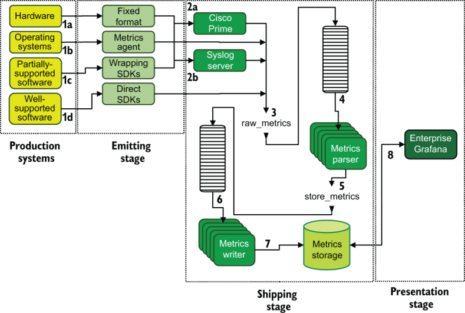

# 非软件业务

本章涵盖

- 遥测在不销售软件的公司中的使用
- 企业规模如何改变遥测的使用
- 业务 IT 如何使用遥测技术

注意第 2 部分的所有章节都是为了使用第 1 部分中的技术来讲述遥测故事，作为提供集成遥测系统的更具体示例的一种方式。如果你觉得需要更多现实世界的示例来了解这些系统的工作原理，那么这些章节适合你。如果你觉得自己已经很好地掌握了这些概念，则可以跳过这些章节并继续进行第 3 部分。

虽然第 8 章介绍了软件生产初创公司中遥测技术的使用，但随着初创公司从三个拥有伟大创意的人到知名独角兽成长的每个阶段遥测技术使用的变化，本章涉及的内容要大得多。技术行业的组织：使用软件但生产软件仅供内部使用的组织。你了解这些组织；他们无处不在。这里有一些例子：

- 当地拥有的披萨店，拥有用于管理订单的销售点系统、一批送货司机和营销人员
- 你带宠物去看兽医，拥有面向动物的患者追踪系统以及药品和实验室订购平台
- 你签约重建主浴室的设计工作室，及其建筑软件、数字归档和客户沟通系统
- 国家承包的建筑公司重建你附近的高速公路立交桥（该项目需要三年时间）以及完成该项目所需的所有项目管理、供应商管理、分包商管理和人力资源系统
- 无钥匙进入锁匠以提供钥匙锁而闻名一个世纪，你选择更换前门上的钥匙锁，并配备支持面向移动的无钥匙进入系统所需的所有嵌入式编程、服务器基础设施和 API 系统。

这些软件消耗组织中最小的可能一点也不关心遥测，这很好。我们对那些确实感兴趣的组织感兴趣，因为他们更有可能雇用像我们这样的人来保持他们的遥测系统井井有条。这些组织规模越大，他们就越有可能创建支持业务的软件；无钥匙进入锁匠是前面列表中的一个主要例子。作为一个广泛的经验法则：

- 中小型组织最关心的是业务遥测（认为办公室 IT 与商业智能交叉），就我们的目的而言，这与软件遥测相同。第 9.1 节和第 9.2 节涵盖了这种规模的组织。
- 大型企业组织仍然关心业务遥测，但也可能进行与软件开发相关的遥测。第 9.3 节和第 9.4 节涵盖了这种规模的组织。

与第 8 章讲述一家公司从成立到全球主导地位不同，本章重点关注四个组织，以强调每个组织如何使用遥测技术。初创公司“要么成长，要么灭亡”的要求在这里并不适用。这些组织已经实现盈利并且对现状感到高兴。

在我们深入探讨之前，最后一句话是：雇用人员管理台式机和笔记本电脑的公司比雇用软件工程师的公司还要多。事实上，对于消费软件的中小型组织来说，办公室IT是一个比软件工程更大的部门（如果存在软件工程的话）。我们在第 1 部分中介绍的遥测概念也适用于这些组织。

## 9.1 遥测在小型组织中的使用

小型组织是指人数不超过 20 人的组织。他们提供由软件支持的服务或产品，但他们自己并不制造软件。这种规模的软件消费组织有一些我们感兴趣的属性：

- 它尽可能地使用 SaaS 产品。
- 它不太可能管理其台式机或笔记本电脑群，让每个人在自己的计算机上做他们需要做的事情，只要他们有一个支持所有 SaaS 应用程序的浏览器。
- 专业安装的软件，例如会计或数值分析软件，仅安装在少数计算机上。
- 它不会以任何方式管理服务器——也就是说，如果它可以避免这样做的话。如果公司必须运行服务器，则该服务器位于复印机/打印机旁边的壁橱中；每八年左右升级一次；由布伦特 (Brent) 运营，他已在公司工作了 20 年（作为员工、员工的配偶或长期志愿者）。

SaaS 革命在这种规模的组织中发生了最大的变化，这意味着该组织的遥测生态系统充满了 SaaS 平台。图 9.1 让我们体验了一个版本。

图 9.1 一个小型组织的生产（和遥测）生态系统。该组织几乎所有运营都使用 SaaS 产品。

图 9.1 显示了我们的小型组织使用的五个 SaaS 系统，管理会计 (QuickBooks)、支付处理 (Square)、客户关系 (Microsoft Dynamics CRM)、办公运营 (Office 365) 和招聘 (LinkedIn)。笔记本电脑和台式机的少量管理（端点管理）由 Office 365 处理，而该公司尚未进行大量管理。正如本节前面所建议的，台式机/笔记本电脑管理包括在需要时在线订购一台新计算机，并让获得计算机的人几乎可以用它做任何他们想做的事情。

该组织与第 1 部分中提到的四种遥测样式中的任何一种最接近的是 QuickBooks，它从 Square 接收付款源，与客户关系管理 (CRM) 系统集成，并将报告以 Excel 电子表格的形式导出到Office 365。即便如此，LinkedIn 仍然是一个不与其他任何东西集成的孤岛，坦率地说，这个组织也不需要它。

该组织没有集中日志记录。其指标完全包含在每个 SaaS 供应商的围墙花园内。不进行端点管理意味着该公司不需要 SIEM，并且它不开发软件，因此不需要分布式跟踪。那么我们为什么要谈论这个组织呢？

> 提示 小型组织有时会变成更大的组织，当你帮助这些组织适应增长时，你需要了解之前发生了什么。

现在让我们看看需要使用遥测技术的行业中的另一种小型组织：小镇医生办公室。该办公室有两名医生、三名护士和六名各类辅助人员。一家咖啡店的员工数量与这家办公室一样多，但医疗保健法规要求的计算机化程度远高于咖啡店。图 9.2 让我们了解了该实践的生产系统。

图9.2 一个11人的小镇医生办公室的生产环境，一切都使用SaaS应用程序。我们看到三种正在使用的 SaaS 产品，但与图 9.1 不同的是，计算机是集中管理的。该实践管理软件在单个产品中提供了所有与医疗保健相关的需求，包括所有遥测需求。 Office 365 用于强制执行保护该办公室使用的所有笔记本电脑上的健康信息隐私的设置。

当你在医疗保健等高度监管的市场中经营企业时，外部力量通常需要这种规模的组织不会在意的做法。图9.2中的医生办公室正在做三件街对面更随意的生意所做不到的事情：

- 强制执行笔记本电脑设置 - 保护健康信息需要最少的设置。如果医生忘记将治疗机器留给病人，那么该病人就不能查看任何其他记录。诸如令人烦恼的短屏幕锁定超时之类的设置是这里的关键。
- 实施端点保护软件——健康信息需要软件来防御恶意软件攻击。由于这些笔记本电脑（端点）运行 Windows，因此许多恶意软件是为它们编写的。
- 审查访问日志——大多数国家/地区都对健康信息的访问进行监管，因此实践管理软件会跟踪并报告哪些用户访问了任何审核期间可能需要的记录。此外，Office 365 管理系统会跟踪所有笔记本电脑上的登录情况。

我们在这里看到了一些遥测技术的使用！使用的是集中式日志记录，但它是可识别的，与图 9.1 中描述的组织不同。图 9.3 描述了集中式日志记录的两种用途。

图 9.3 我们小镇医生办公室集中记录的用途。 Office 365 和实践管理软件进行事件的内部报告。这种使用并不是真正集中的，但它代表了软件消费组织首次一致使用遥测技术。

我们医生办公室的主要遥测存储是由其实践管理软件提供的，该软件管理私人健康信息的存储库。在这种规模的组织中使用遥测技术，当它发生时，通常发生在一体化产品中，例如我们在这里看到的产品。之所以会发生集中化，是因为这种规模的组织很少有需要或技能来设计和构建从多个 SaaS 产品中提取数据的集中式日志记录系统。 （不过总有例外。）

对于这种规模的组织，我需要提及的最后一件事是，它们对行业变化的反应最为灵敏。这种类型的小型组织可能已经存在了 50 年，但他们使用 SaaS 产品，因为没有足够的惯性来维护复印机房中的服务器。你会时不时地遇到类似的服务器，但它们几乎总是很旧并且运行着同样旧的软件。

## 9.2 遥测在中型组织中的使用

中型组织是指员工人数在 30 到 500 人之间的组织。 （这个定义与小型组织的定义不重叠；这些界限很模糊。）这种规模的组织面临着小型组织很少面临的复杂情况，这会影响他们使用遥测技术的方式。我们将在本节中介绍这些复杂情况。与小型架构相比，中型架构有一些变革驱动因素：

- 专业 IT 的存在——现在有足够多的人遇到计算机问题，解决问题的特定人员或部门已成为核心业务需求。 （再见，布伦特。）这种需求从根本上改变了端点管理的完成方式，并推动了遥测技术的采用和成熟。
- 人力资源的存在——30人以下的组织可以避免设立专业的人力资源部门，但人越多，福利管理和人员管理的问题就变得越困难。随着专用人力资源信息系统 (HRIS) 的出现，人力资源使正在使用的业务系统的数量变得复杂。
- 不断变化的业务规则——法律因国家/地区而异，但员工人数通常存在一个阈值，达到该阈值后，企业就会开始受到法规和法律的区别对待。例如，在某些国家/地区，如果你的员工数量少于一定数量，则无需提供健康保险。

这种规模的软件消费组织有几个影响其遥测技术使用的属性：

- 专业 IT 正在管理端点，这为集中式日志记录和 SIEM 系统打开了大门。
- SaaS 应用程序的使用仍然是完成工作的主要手段。
- 仍然尽可能避免由专业人士安装的软件，但专业 IT 的存在使这一挑战不那么严峻。
- 软件开发（如果存在）可能仅限于支持专业 IT 构建的脚本。
- 托管服务器出现在此级别。这些服务器数量很少，如果可能的话，它们在云端运行，并且支持端点管理和由专业 IT 管理的其他系统。

这个小型组织将以软件为中心的遥测技术隐藏在其所有业务遥测技术中，但在这里，我们有机会看到更像我在第 1 部分中解释的系统。专业IT确实可以带来不同！图 9.4 向我们展示了有助于遥测系统的生产系统。

图 9.4 有助于我们中型软件消费组织遥测的生产系统。与小型组织相比，端点（员工计算机）管理框架相当全面。专业 IT 还引入了 Sumo Logic Cloud SaaS 产品形式的集中日志记录，该产品集中来自 Azure Active Directory（登录、注销和其他安全详细信息）、Microsoft Intune（策略执行操作）、Office 365（文档使用）的日志，以及员工的计算机本身。软件专业人员 (IT) 以真实的方式引入遥测技术。

图9.4所示的所有端点管理系统都集中在员工的计算机上，系统中的每个组件都将日志数据报告给Sumo Logic云。该系统是我们在第 1 部分中介绍的一种软件遥测系统，由专业 IT 部门提供。起初，集中式日志记录仍然是 IT 部门和端点管理的领域，但整个公司的经理都会意识到，拥有一个单一位置来跟踪谁做了什么是一种强大的能力。 IT 部门进行了一些演示后，不久之后就会接入更多 SaaS 系统（图 9.5）。

图 9.5 中型组织已将其每个 SaaS 产品配置为将遥测数据发送到 Sumo Logic 云，作为集中式日志记录系统的一部分。这种集中式日志记录系统由专业 IT 和业务运营人员使用，远远超出了图 9.4 所示的端点管理系统。该系统是一个真正的集中式日志系统。

像图 9.5 所示的遥测系统与我们在第 8 章中看到的软件开发驱动的遥测系统非常不同，第 8 章检查了一家成长中的初创公司中遥测的使用情况。我们的中型软件消费公司集中了许多 SaaS 供应商提供的源，为管理人员提供决策和调查所需的支持。这个遥测系统主要是关于业务运营的，这个架构中涉及到很多软件。

> 业务运营和专业 IT 对初创公司也很重要
>
> 现在应该很明显，本章的遥测故事重点关注组织的业务运营部分。当你阅读本章时，请思考一下第 8 章中讨论的初创型组织中组织的业务运营方面是如何工作的。软件开发公司中的软件工程师是摇滚明星，是让企业做事的人才。它需要做，并且他们赢得了很多关注。
>
> 但在中型、大型和企业规模的创业型公司中，业务运营也很重要。维护它们的专业IT部门可能永远不会与软件工程部门或其经理交谈，但IT和软件工程一样有很多遥测需求。在软件生产组织中，专业IT包括重大内部软件开发的可能性高于纯软件消费组织，但是否允许内部开发使用与软件工程相同的遥测系统取决于组织的文化。
>
> 如果有帮助的话，请将本章中描述的每家公司视为初创型企业非工程部分的遥测故事。大型企业规模的初创企业仍然需要担心工资处理、费用管理和 HRIS。

## 9.3 遥测在大型组织中的使用

大型组织最初拥有约 500 名员工，很难与企业规模的组织分开。就我们的目的而言，大型组织专注于单个大型办事处或地区，而企业规模的组织则在多个地区（甚至多个国家）设有办事处。更进一步，本节涵盖 1981 年（IBM PC 发布的那一年，在全球办公室发起英特尔革命）之后成立的大型组织。第 10.2 节涵盖 1981 年之前成立的大型组织。

这种规模的组织很少能在一夜之间独自成长起来，因此我们正在寻找一个在 2000-10 时代可能至少是中等规模的组织。这个时代出现在 SaaS 爆炸之前，因此这种规模的公司通常在某处运行服务器来支持业务运营。这些公司现在运行的服务器数量可能比前几十年少，因为过去需要服务器安装软件（例如电子邮件）的任务已转移到云和 SaaS 中，但组织历史仍然存在。大型组织中变革的主要驱动力是

- 该公司拥有管理服务器的经验，并且可能仍然拥有托管服务器的设施。如果没有，该公司在进行“直接迁移”操作后，将在公共云中运营，将所有物理服务器转移到AWS或Azure等公共云中，同时仍然保持服务器操作的流畅性。
- 专业 IT 历史悠久。该公司拥有专业 IT 历史，部分员工很可能是 20 年的资深员工。这种组织历史既是福气（深厚的组织背景）也是祸根（10 年前有效；现在仍会有效）。
- 服务器在进入云之前就位于本地。在组织历史中进行服务器管理会产生许多微妙的影响，其中最重要的一个是一个不可动摇的假设，即每个端点都接触内部网络 - COVID-19 告诉世界的情况绝对不是这样。此类组织中预计会出现大量虚拟专用网络 (VPN) 需求。
- 它有更多需要管理的设备。员工人数越多意味着需要管理的端点越多。但不仅如此，除了运行 Windows 的计算机之外，Apple 和 Google 硬件等端点也更加多样化。

我们将会发现，前 SaaS 时代的年龄和存在会产生很多影响。当谈到遥测技术的使用时，以下是推动这家大公司使用遥测技术的主要组织属性：

- 该公司迄今为止已经管理服务器数十年，因此它有一个监控系统（也称为指标系统，但可能不这么叫）。
- 管理服务器数十年意味着该公司已经掌握了集中日志记录的一些技能。
- 年龄和规模意味着该公司面临着一定程度的安全事件，因此它有一个安全团队和一个 SIEM 系统。
- 该公司在 2000 年代初部署了 Microsoft Active Directory (AD)，并在过去十年中通过安全断言标记语言 (SAML) 集成将 SaaS 服务与 AD 身份验证绑定在一起。
- 内部软件开发在这种规模的公司中很常见，因此我们将第一次看到软件开发风格的遥测。

大型组织拥有成熟的 IT 组织，用于管理服务器及其附带的遥测系统，并根据这些遥测需求进行内部软件开发。这两个遥测系统是否统一取决于技术组织的文化。如果系统不统一，你最终会得到如图 7.5 所示的遥测系统，此处再现为图 9.6。

图 9.6 对 IT 和开发团队之间存在严格分离文化的大型组织的遥测系统的无情审视。我们专业的IT团队是中层；软件开发团队左侧面板；安全性是右侧面板。此示例是进行遥测的可行方法，但会导致大量重复工作。

大型软件消费组织比软件生产组织更有可能没有经历 DevOps 转型，这使得它们更有可能在软件开发 (Dev) 维护的遥测系统和专业 IT (Ops) 维护的遥测系统之间存在难以逾越的障碍。 ）。首先，我们将了解专业的IT遥测系统，其次是软件开发遥测系统。然后我们将讨论统一环境的外观。

图 9.7 显示了 2000-10 年代运行的各种内部机房的相当传统的遥测生态系统（我花了整整十年时间使用这样的系统），并将其提前到 2020 年代。我们看到正在使用集中式日志记录，重点关注本地安装的 Splunk 软件以及 Splunk 的 Syslog 集成（用于其他所有内容）。我们看到正在使用的监控系统（对于开发人员来说也称为指标系统）基于 SolarWinds 监控产品构建。尽管由于空间原因，发射阶段组件没有出现在图中，但运输和呈现阶段已被标记。这个生态系统为整个组织提供了相当多的价值：

- 由于所有 SaaS 产品都使用 SAML，来自 AD 的访问日志为整个生产系统提供了广泛的访问跟踪。
- 通过在员工计算机上安装完整的 AD 和 Splunk 转发器，该组织可以获取有关员工计算机上发生的情况的高分辨率跟踪数据。
- 服务器硬件中的故障是集中的，允许与其他事件关联以发现故障链并加快根本原因分析。
- 服务器指标是集中的，允许资源使用和硬件上运行的负载之间的关联。

图 9.7 我们专业 IT 部门为大型软件消费组织构建的遥测生态系统。该图显示了正在使用的两种遥测样式：集中式日志记录和指标。集中式日志记录集中了来自员工计算机群和部门管理的服务器的事件。

这种全分辨率遥测在服务器和数据中心运营高度成熟的组织中很常见。接下来，我们需要查看内部软件开发团队使用的遥测系统，该团队负责编写软件以加快业务速度，但始终由内部团队运行。该软件可供客户或与公司互动的其他人使用，例如在供应商管理门户或建筑许可备案系统（在县书记员办公室的情况下）。大多数公司网页都属于内部开发的软件，并且通常是公司拥有的最大的开发软件。

> SolarWinds？他们没有遭到大规模黑客攻击吗？
>
> 是的，确实，SolarWinds（特别是 SolarWinds Orion）是广为人知的民族国家攻击的目标。为什么我将其包含在示例中？ SolarWinds 确实因这次入侵而损失了大量业务，但它并没有消失。它的网络监控平台是市场的主导者，这样的组织不会轻易被推翻。未来几年，你将在遥测堆栈中看到 SolarWinds 产品。那些不会杀死你（或让你破产）的事情会让你变得更强大。

尽管这个内部软件开发团队可能看起来像第 8.2 节中的中型初创公司，专门使用公共云和 SaaS 产品，但我们的内部团队正在与知道如何在服务器上运行事物的 IT 部门合作。因此，为了实现多样性，图 9.8 演示了内部开发团队如何使用不完全基于 SaaS 的遥测技术。

图 9.8 一家大型软件消费公司内部开发团队的遥测系统。与启动示例中的体系结构不同，此体系结构使用内部管理的服务设施来托管生产系统。这里使用了日志记录、指标和跟踪，但只有跟踪使用了 SaaS 提供商；日志记录使用现有的 Splunk 日志记录管道，并且指标在内部进行管理。

我们看到可观察性的三个支柱（日志、指标和跟踪）与生产软件挂钩。首先是集中式日志记录，它使用与 IT 系统相同的基于 Splunk 的流程，甚至使用相同的存储和呈现系统。用于记录的遥测流程是

1. 记录遥测数据从生产代码中的发射器函数发送到文件中。 （有关此模式，请参阅第 2.1.1 节。）
2. Splunk 转发器从文件中提取日志行。 （有关此模式，请参阅第 4.1.1 节。）
3. Splunk 转发器将摄取的日志行发送到内部运行的 Splunk 日志记录服务器。
4. Splunk 报告使用日志记录系统中的存储来为集中日志记录提供演示阶段。

跟踪管道的步骤更短，因为它使用 SaaS API：

5. 跟踪遥测数据直接从集成到生产软件中的 Honeycomb SDK 发出，并将遥测数据发送到 Honeycomb API SaaS 端点。
6. 从 Honeycomb 仪表板中搜索跟踪遥测，以提供用于跟踪的演示阶段。

Metrics 遥测托管在类似于 Splunk 的内部管理软件上，但该软件是开源的。该指标体系仅适用于软件开发，不适用于 IT。尽管它是内部托管的，但步骤数与用于跟踪的 SaaS 管道相匹配：

7. 指标遥测数据直接从生产软件中的指标函数发出，这是发射器/发送器函数的示例（有关此模式，请参阅第 3.1.1 节），直接发送到 InfluxDB 开源时间序列数据库中。
8. 指标遥测的呈现系统是 Grafana 开源仪表板系统。

我们有两个小组共享一个遥测系统（集中式日志记录），但除此之外别无其他。这两个小组如何改进他们的遥测系统共享？最明显的一点是找到一种方法，将 SolarWinds（IT 部门的监控系统）和 InfluxDB/Grafana（软件开发的指标系统）之间的当前分歧统一为新的东西。尽管软件开发广泛使用指标系统，但始终致力于削减成本的 IT 管理层提出了一个关键问题：“InfluxDB 和 Grafana 能否减少 SolarWinds 的年度许可续订？” IT 指出 SolarWinds 和 InfluxDB/Grafana 使用不同的方法来收集指标：

- 基于拉动的指标 — SolarWinds 维护其正在跟踪的所有内容的列表，并按计划轮询该列表。需要明确告知 SolarWinds 轮询引擎要查找什么、在哪里查找以及查找的频率。
- 基于推送的指标——InfluxDB/Grafana 不知道自己正在跟踪什么；相反，它依赖系统将指标直接发送到 InfluxDB。这种风格依赖于生成指标的系统来知道将它们发送到哪里。

尽管生产软件已编写为将指标推送（传送）到 InfluxDB 中，但 IT 管理的 Windows 和 UNIX 操作系统尚不具备该功能。经过研究，IT 发现了 InfluxData 提供的 Telegraf 系列代理，该代理提供了可安装的软件，该软件知道如何从操作系统、数据库、缓存和基础设施的其他组件中提取系统级指标，并将这些收集到的指标发送到 InfluxDB。这些代理的使用不如 SolarWinds 生产的代理方便——免费开源通常会花费更多时间——但金钱成本是无可争辩的。图 9.9 演示了一种从 Windows 获取系统指标并进入 InfluxDB 的方法。

图 9.9 使用 Telegraf 代理从 Windows 服务器获取系统指标并将指标发送到 InfluxDB。 IT 配置 Telegraf 代理以按计划轮询指标并将指标推送到 InfluxDB，InfluxDB 为采用基于轮询的指标方法的系统（在本例中为 Windows）提供基于推送的指标支持。

图 9.9 显示了将 Windows 系统指标移至 InfluxDB 的三步过程：

1. 按照计划（默认情况下每 10 秒一次，但此设置是可配置的），轮询 Windows 性能计数器以获取指标。
2. 从 perf 子系统接收指标。
3. 重新打包指标并将其发送到 InfluxDB。

最终，我们公司确定Telegraf/InfluxDB/Grafana不是其现有系统的完全替代品，但与SolarWinds相比，它确实提供了一些成本效益。SolarWinds是为网络运营而保留的——网络工程师不愿意为了省钱而放弃所有这些不错的功能——但SolarWinds在应用和系统监控中的作用大大缩小了。然后，专业的IT接管了InfluxDB系统的管理，这导致了大量的高可用性工程工作，以使InfluxDB和Grafana足够可靠，可以为公司下注。结果是，软件开发和专业的IT正在使用相同的遥测组件进行集中日志记录和（大多数）度量。

图 9.10 显示了我们大型软件消费组织作为指标/监控统一工作的一部分而构建的统一遥测系统。我们看到网络团队继续使用 SolarWinds，因为该平台比节省成本更能满足公司的需求，这是公司员工做出的政治决定。如果你面临这个选择，你可能会做出不同的决定，这很好。由内部软件开发团队开发的软件仍然是唯一使用跟踪的系统，这并不奇怪，因为跟踪（至少在 2020 年代初的形式）是一个纯软件概念。

图 9.10 我们大型软件消费组织的统一遥测生态系统。软件开发管理生产软件盒，并且是 Honeycomb API 的唯一发射者。网络硬件仍然保留在 SolarWinds 上，这是该组织在指标/监控统一工作期间做出的政治决定。与第 8 章中初创公司使用的系统不同，该遥测系统在更早期的阶段就涉及硬件。

## 9.4 遥测在企业组织中的使用

企业组织是我们在本章中讨论的最大、最分散的软件消费组织。这些组织在多个地区拥有主要业务，可能在芝加哥和亚特兰大设有大型办事处，或者在国际上开展业务。本节中的组织与 10.3 节中描述的组织不同，因为它们是在 1981 年（即 IBM PC 发布的那一年）之后才出现的。

与第 9.3 节中的大型组织一样，公司不会在一夜之间达到这种规模，因此我们正在研究在 20 世纪 80 年代末到 2000 年代初实现业务运营自动化的组织。在此期间，自动化使这些公司成长为企业规模，同时在员工休息室、复印机间、机房和小型数据中心运行服务器。与第 9.3 节中的大型组织不同，这些组织在处理不同地区的业务运营（和计算）时完成了所有这些事情。大型组织和企业规模组织之间变革的主要驱动力是

- 企业规模的公司习惯于使用广域网 (WAN) 进行操作。由于业务是跨区域的，因此其计算方法也是如此。当广域网链接昂贵且缓慢时，它很可能一直在处理多区域操作，并推动了这些方法的发展。
- 多地区意味着多文化。不同的地区，甚至像美国这样的大国的不同地区，都有不同的文化。该组织已经适应了地区性假期、不同的假期标准和不同的劳动力市场。
- 它习惯于在不同的劳动法下运作。跨区域，尤其是国际性，意味着该组织必须在同一组织内根据不同的劳动法运作。国际化意味着适应不同的国家假期并继续运营。
- 它至少使用一些公共云进行操作。该公司的历史是运行计算机，它绝对拥有这些技能。但公共云的好处非常明显，该公司已经在进军该领域取得了一些进展。
- 它正在开发大量供内部使用的软件。一家公司如果不需要创建定制的解决方案，就无法达到这种规模。软件复杂性当然可以与我们在第8.4节中在企业规模的软件生产组织中检查的复杂性相媲美，如果不是完全达到相同的水平规模的话。

该列表的前三点构成了企业公司与其他公司之间的主要文化差异之一：内部分歧更加明显，导致软件遥测孤岛在无知（或反对）的情况下建立；永远不要低估驱动程序创新（称为恶意）组织中的其他系统。第四点，公共云使这些遥测孤岛比以前需要将服务器放在复印机房间或备用隔间中时更容易实现。这些遥测岛看起来很像我们在第 8 章中讨论的中型（第 8.2 节）和大型（第 8.3 节）遥测系统。

图 9.11 描述了全球企业组织的最坏情况，显示了 12 个几乎没有共享的遥测岛——其中三个用于基于区域的 Office IT，九个用于不同的业务功能。这种分离的遗留问题还意味着，由于同一问题被许多人通过多种方式解决，组织可能会在内部管理更加多样化的技术。这种规模的组织通常是由许多穿着风衣的较小组织组成。它们看起来像一个大组织，但实际上是一群紧密合作的较小组织。该组织可以体验到的一些多样性包括

- 也许网站工程部门遵循来自湾区公司的现代软件开发实践，这些公司的仓库运营继续使用基于 IBM AIX 的终端系统，因为它从 20 世纪 90 年代开始使用，并且一直没有放弃它们。
- 也许办公室 IT（美洲）管理的员工计算机群 70% 是 Apple 计算机，但办公室 IT（欧洲/中东/非洲）则 100% 使用 Windows。
- 也许商业智能和网站工程操作大型数据库执行繁重的事务负载，但共享零基础设施或管理支持。

图 9.11 企业级软件消费组织中遥测孤岛的示例。这个例子是一个严重的孤立案例，但大多数企业级软件消费公司都有某种类型的孤岛。

许多组织开始意识到他们已经支离破碎，并决定尝试统一事物，或者至少提供一些标准来防止进一步的分裂。在本节中，我们将研究该环境：该组织提供的一组预先构建的遥测服务，允许软件开发人员快速添加遥测，并推动他们使用集中式服务，而不是重新发明遥测轮。

我们将这项工作称为“铺装道路项目”，为软件开发人员提供易于访问的铺装道路以连接到遥测技术，以防止他们从头开始建造新道路。开发人员喜欢简单；它让他们专注于他们想做的事情。我们已经知道需要铺设哪些道路：

- 应用程序的集中日志记录 - 为可以直接发射的应用程序提供发射标准，为必须间接发射的应用程序（例如必须通过 Syslog 发射的应用程序）提供包装格式标准，并提供易于访问的摄取点和一个获取它们的界面。
- 系统的集中日志记录——物理数据中心更容易控制，因此提供硬件标准和配置运行手册，以确保硬件在应有的位置发出信号。对于可以在硬件或公共云上运行的操作系统，提供软件和端点来发送事件。还将公共云遥测连接到这些系统中。
- 应用程序和系统的指标 - 为可以直接排放的应用程序提供排放标准，为只能间接排放的应用程序提供包装格式。还提供操作系统代理和仪表板系统来绘制指标，以及警报功能以使指标系统能够充当监控系统。
- 应用程序跟踪——操作系统和硬件不需要这些功能，因此这些功能仅适用于开发的软件。这里的最佳路径需要为组织中每种受支持的编程语言（可能太多）创建和部署库，这是一项繁重的工作，但从长远来看是有回报的。

这项工作的大部分重点是构建运输和演示阶段组件，这些组件可以处理来自生产系统的各种遥测数据。大多数情况下，发射级组件不受构建统一遥测产品的部门的控制。我们的遥测操作员需要提供易于使用的构建块并希望人们使用它们。 （请使用它们。）只要构建软件的开发人员决定使用这些构建块，他们就能以较低的工作成本获得高水平的遥测成熟度。与第 8.4 节中的软件生产企业组织不同，该组织不担心将遥测数据复制到多个区域，因此它将遥测数据保留在区域内。

图 9.12 抽象地显示了铺好的道路的样子。运输和展示阶段系统进行集中管理，并调整大小以适应处理一切的规模。发射阶段是政治发生的地方；因为我们需要鼓励软件开发团队使用我们的系统，所以我们需要这些 SDK 和库变得成熟。并非所有生产系统都可以使用 SDK 或库；硬件和操作系统都有自己的发射格式，这些格式并不灵活。对于这些不灵活的发射器，我们需要代理，例如 Syslog 服务器，它可以接受我们不灵活的发射器可以发出的格式的遥测数据，然后将遥测数据转换为我们的运输阶段格式（第 4.2 节）。为了灵活性，我们使用流式系统，其中一组系统订阅流式主题以丰富遥测并将其注入存储中。最后，报告界面会消耗人们提出问题的存储空间。

图 9.12 用于遥测的铺砌道路的抽象渲染。运输和展示阶段是集中管理的。发射阶段的 SDK 提供给生产系统的创建者。对于无法直接与流对话的生产系统，提供格式桥接系统（或系统组）以生产系统能够使用的格式来代理连接。这条铺好的道路可容纳良好支持和部分支持的软件，以及具有固定发射格式的硬件和操作系统发射器。

让我们看一下实际的实现，这次是为了指标（图 9.13）。

图 9.13 遵循铺装道路标准的八阶段指标管道。生产系统以其能够发送的格式发送。该管道提供了多种将指标输入集中式系统的方法，并且应该减少组织中指标遥测孤岛的数量。

图 9.13 显示了该组织中用于指标遥测的 Paved Roads 架构。让我们来看看：

1. 指标由生产系统发出。
   1. 硬件系统以其固定格式发出。
   2. 操作系统安装了指标代理，该代理以自己的格式发出。
   3. 部分支持的软件以包装格式提交遥测数据，并将其发送到系统日志。
   4. 支持良好的软件直接发送到流。
2. 固定格式的遥测通过代理系统运行以解包指标。
   1. Cisco Prime 用于转换来自网络基础设施的遥测数据。
   2. Syslog 用于以固定格式发出的所有其他内容，包括部分支持的软件。
3. 代理和受良好支持的软件会发送到 `raw_metrics` 主题的流中。
4. 一组度量分析器订阅raw_metrics主题，并将度量格式解析为其最终形式。
5. 指标解析器将最终指标提交到 `store_metrics` 主题。
6. 一组指标编写者订阅 `store_metrics` 主题并准备用于存储的指标。
7. 指标编写器将指标存储到指标存储（即基于 Hadoop 的 OpenTSDB）中。
8. Enterprise Grafana 系统使用指标存储来呈现指标。

这里的指标系统包括几个可扩展性和供许多部门使用的功能：

- 流缓冲指标，因此处理速率问题不会阻止来自生产系统的指标。
- 度量解析器组机器可水平扩展以处理突发。
- 使用 OpenTSDB（基于 Hadoop）利用 Hadoop 的内部经验来提供时间序列数据库的水平可扩展性。
- 管道的指标解析器阶段的丰富对用于多租户的属性进行编码。
- 指标编写器使用指标解析器创建的属性将指标遥测数据写入不同的 OpenTSDB 数据库以支持多租户。
- Grafana 通过付费订阅运行，以增强其多租户支持。

多租户——系统根据角色和组分离对系统各部分的访问的能力（参见第 7 章）——是 Paved Roads 项目的基本功能。出于政治原因需要多租户，因为并非每个部门都能相处融洽，这使得部门数据之间的强隔离成为一项硬性要求。企业组织的“许多穿着风衣的小型组织”性质再次影响了遥测设计。

现在让我们看一下用于追踪的 Paved Roads 架构。与指标不同，跟踪旨在仅支持软件，因此不再需要支持硬件和操作系统。然而，复杂性并没有降低那么多，如图 9.14 所示。该架构与指标架构类似，使用分离的丰富和写入阶段来提高整体吞吐量。

图 9.14 我们企业级软件消费组织中分布式跟踪的八阶段管道。该架构使用 Jaeger 项目在内部提供跟踪功能。支持良好的软件（具有本机 Jaeger SDK）将遥测数据直接发送到 `raw_metrics` 主题的流中。部分支持的软件（需要以另一种格式包装跟踪数据）发送到 Syslog，Syslog 服务器将在其中解开跟踪遥测并将其发送到 `raw_metrics` 流中。从那里，Jaeger 收集器转换来自流的跟踪数据，并将其提交回 `store_tracing` 主题上的流，以便 Jaeger 摄取器插入到存储中。 Jaeger 查询用于拉取痕迹。在指标版本降低复杂性的唯一示例中，该系统接受来自较少系统的输入。

由于第 9.1-9.3 节大量讨论了办公室 IT 风格的遥测，因此我们公平地介绍办公室 IT 如何在这种规模的组织中处理遥测。每个组织都以不同的方式进行遥测。如果你的跨国公司不这样做，那也没关系。我们在图 9.4 中看到了这个中型组织的示例。图 9.15 更为复杂，因为我们的企业规模组织在其员工计算机上运行的不仅仅是 Windows，而且运行的是物理服务器而不是 Azure 中的云服务器。

图 9.15 我们企业级软件消费组织中端点的集中日志记录遥测。此设计同时支持Apple和Microsoft端点，并为Apple端点提供两个管理框架，以增加部门使用集中式系统的机会。安装在端点上的代理将遥测数据发送到服务器，服务器重新打包遥测数据以发送到基于 Splunk 的集中式日志记录系统。除了发送到 Splunk 的日志记录之外，JAMF 和 Microsoft Endpoint Management 都在其软件产品中提供报告工具。

中型组织中仅使用 Azure 的 Microsoft Intune 将被企业规模组织中的 Microsoft Endpoint Manager (EM) 取代，因为 EM 在你管理的服务器上运行。该图表中的新增内容是 JAMF Pro，它是针对 Apple OSX 系统的功能强大的管理框架。在这个企业规模的组织中，Apple 端点可以由 EM 或 JAMF Pro 进行管理，具体取决于当地办公室 IT 部门的偏好。该系统仍然是铺装道路系统，因为管理灵活性是内置的。

这种规模的软件消费组织内部的高度多样性使其与我们在 8.4 节中讨论的软件生产组织截然不同。与软件生产组织相比，遥测系统更像是一种市场化服务，而在其他组织中，遥测是由所生产的软件的需求驱动的。尽管方法不同，但这两个组织都重视软件工程师的速度。

# 概括

- 业务运营主导中小型组织的遥测增长；软件开发仅成为大型企业规模组织的一个因素。
- 小型软件消费组织尝试尽可能只使用 SaaS 产品，以避免管理软件。
- 小型组织避免尽可能安装软件，或者只在几台计算机上安装软件。
- 小型组织通常不会费心管理员工计算机（端点），而是让每个人做自己的事情，只要他们拥有可与 SaaS 产品配合使用的浏览器即可。
- 在某些行业（例如医疗保健）工作的小型组织通常有外部要求，迫使他们关心遥测，例如生成健康记录访问审核日志的能力。
- 小型组织对行业变化的反应最为灵敏。在本章中的所有组织中，SaaS 革命使他们受益最多。
- 中型组织足够大，需要有人来回答“为什么我的电脑坏了？”问题，这就是为什么他们有专业的 IT 团队。
- 中型组织中的专业 IT 团队通常会引入第一个可识别的遥测系统：集中式日志记录，通常是端点事件的日志记录。
- 中型组织尝试尽可能使用 SaaS 软件，但如果无法避免使用已安装的软件，专业 IT 可以减轻痛苦。
- 中型组织中的端点管理可能由云选项驱动（Windows 主导的组织使用 Azure 和 Office 365，Apple 主导的组织使用 JAMF），所有这些都是为了避免管理服务器。
- 与中小型组织不同，大型组织在 SaaS 革命之前管理服务器，并且可能仍在某个地方管理它们。与中型组织相比，这种体验使他们对基于服务器的解决方案更加满意。
- 与中小型组织不同，大型组织通常在内部生产软件。
- 大型组织拥有更多端点，但也有更多端点多样性； Apple 和 Google 硬件经常加入 Windows 端点，这使端点管理变得复杂。
- 大型组织首先拥有安全团队和 SIEM 系统。较小的组织只有在监管等外部力量要求的情况下才会拥有它们。
- 在大型组织中，办公室 IT 和软件开发并不总是共享遥测系统，因为软件遥测系统通常独立于办公室 IT 使用的系统而发展，从而导致重复工作。
- 企业软件消费组织是最大的组织，并且在多个地区（甚至多个国家）拥有主要业务。
- 企业规模的组织习惯于跨区域进行计算，因为他们在网络速度较慢时就这样做了。
- 就不同的地区传统、假期和劳动法而言，企业规模的组织不可避免地具有多元文化。这些文化差异增加了与组织其他部分的分离感，从而影响了跨组织协调的水平。
- 企业规模的组织正在开发大量供内部使用的软件，因此拥有完整的软件工程团队及其遥测系统。
- 与第 8.4 节中相同规模的软件生产组织相比，规模庞大且部门之间有分离的历史，导致技术的内部多样性要高得多。
- 企业规模的组织通常是一群穿着企业规模风衣的较小组织，这使得集中式遥测标准更难实现。
- 在企业规模的组织中构建一套集中式遥测系统需要构建一个在易用性方面能够与基于 SaaS 的系统竞争的系统，从而促使软件开发人员尽可能使用中央系统。
- 多租户是软件消费企业组织中任何集中式遥测系统的核心功能，因为它允许部门之间的分离，从而在整个系统中建立信任。