# 11 大规模优化正则表达式

本章涵盖

- 了解遥测中使用正则表达式的位置
- 优化正则表达式的使用
- 改变你的排放量以加速正则表达式

大规模优化正则表达式的最佳方法是不使用正则表达式。但我们可用的遥测工具有时无法让我们选择避免使用正则表达式，但无论如何我们都必须处理它们。本章是关于如何使你必须使用的正则表达式发挥最佳性能。与编程非常相似，在遥测管道中使用正则表达式有两个原因：

- 控制程序流程——如果字符串与正则表达式匹配，则执行某些操作，例如尝试以某种方式进行解析。
- 从字符串中提取字段 - 使用正则表达式，你可以捕获表达式以将字段添加到正在处理的遥测中，这称为丰富。 （有关一般强化的更多信息，请参阅第 6 章。）

第 6.2.2 节提供了这两种用途的示例，包括代码，因此如果你尚未在遥测系统中使用正则表达式，我建议你在继续此处之前阅读该部分。正则表达式是非常强大的工具，但强大的功能也带来了巨大的隐藏复杂性，这会在很多方面损害你的性能。与许多强大的工具一样，易于理解的简单表达式通常比更复杂但范围更严格的表达式表现更差。在构建可维护的代码时，正则表达式很糟糕，因为对于不熟悉特定用例的人来说，性能最好的代码是最难推理的。为了证明这一点，以下正则表达式可以匹配任何 IPv4 地址，例如 192.0.2.241：

```
(?<![0-9])(?:(?:[0-1]?[0-9]{1,2}|2[0-4][0-9]|25[0-5])[.](?:[0-1]
?[0-9]{1,2}|2[0-4][0-9]|25[0-5])[.](?:[0-1]?[0-9]{1,2}|2[0-4][0-9]
|25[0-5])[.](?:[0-1]?[0-9]{1,2}|2[0-4][0-9]|25[0-5]))(?![0-9])
```

不管你相信与否，这个三行的庞然大物比这个更具可读性的单行代码表现得更好，并且可以处理更多的边缘情况：

```
[0-9]{1,3}.[0-9]{1,3}.[0-9]{1,3}.[0-9]{1,3}
```

尽管我使用这样的东西，但当我试图深入研究像第一个那样复杂的正则表达式时，我会揉我的额头。我当然可以做到，但我不喜欢这样做，而且你不太可能需要构建像那样难以阅读的模式。本章的目标是向你展示正则表达式的足够强大功能，以构建性能良好且具有可读性的表达式。

> ***注意*** 无法避免正则表达式的最大原因是处理来自硬件、第三方软件和 SaaS 平台等来源的遥测排放。这些源以其自己的格式发出遥测数据，并由你将这些生成的字符串转换为丰富的遥测数据。第 11.3 节详细介绍了解析此类遥测的一个示例。如果你的遥测丰富引擎仅包含正则表达式，那么本章适合你。

使正则表达式快速执行的方法是构建它们，以便正则表达式引擎知道停止尝试尽快查找匹配项。对于优化不佳的表达式，匹配失败可能会比完全匹配消耗更多的资源。我介绍了使正则表达式性能更好的三种技术：

- 11.1 节描述了一个称为锚定的简单技巧，可以使正则表达式执行得更快。
- 11.2 节介绍了一个不太简单的技巧，用于向正则表达式引擎提供提示以使其停止匹配。
- 11.3 节应用你在第 11.1 节和 11.2 节中学到的知识来深入研究来自 Cisco ASA 防火墙的熟悉的遥测数据。
-  11.4 节讨论了更改发射（针对你控制的代码），以使它们更容易执行正则表达式，并使你的表达式更容易让更多人理解。

> ***警告*** 本章中的正则表达式使用 Ruby 风格的正则表达式，因为两个主要的 Shipping-stage 引擎 Fluentd 和 Logstash 都是用 Ruby 编写的。我知道这是与迄今为止使用的 Python 相比的一个变化，但如果你最终使用任一平台，你可能需要至少生成一些 Ruby。

## 11.1 迅速锚定表达式

本节向你展示一种称为锚定的简单技术如何使现有的正则表达式表现得更好。当我在遥测管道中部署锚定时，我发现每个节点解析遥测的总体吞吐量提高了 12%，当你每秒处理 20,000 个事件时，12% 非常重要。当你每秒处理 100,000 个事件时，增加 12% 可以节省资金。并不是每个人都会看到 12%——这种增长更多地与我们的正则表达式的编写方式有关——但你会看到一些改进。

> 定义 锚定是使用字符串开头标记（ `^` 或脱字符号）和字符串结尾标记（ `$` 或美元符号）作为正则表达式的一部分。

为了解释锚定的工作原理，我们需要查看一组简单语言的日志记录语句，这些语句是软件工程师在其应用程序中不使用高度复杂的日志记录框架时编写的。如果你有五名工程师在同一个代码库中工作，尤其是使用英语，那么你将有七种方式来表达同一想法。以下是我们将使用的列表：

```
Added account 1141 in zone 42 with email twitterbot@example.com
Account 1141 deleted from zone 37
Suspended zone 42 account 1141 for excessive email volume
Created new zone: 99
Zone 98 deleted
```

这五行日志以不同的方式讲述了略有不同的事情，是在三年的时间里添加的。首先，让我们看一下与第一行匹配的正则表达式。

图 11.1 显示了一个正则表达式，它将解析五行列表中的第一行。该正则表达式使用 Ruby 正则表达式，因为市场上两大开源日志传送器 Fluend 和 Logstash 都是 Ruby 项目。 Logstash Grok 插件使用 Oniguruma Regex (http://mng.bz/6N1R)，它是 Ruby，但添加了对正则表达式模式库的支持（除此之外，我们不需要在这里讨论） 。该图展示了正则表达式丰富化的核心概念：命名捕获组。我们有四个捕获组，当遥测数据经过运输和演示阶段时，它们会填充遥测数据中的四个字段。

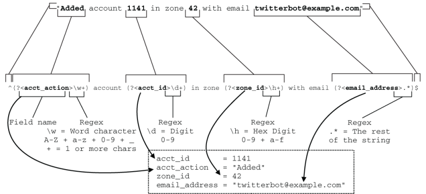

图 11.1 匹配第一个示例日志条目的正则表达式。此表达式包含四个单独的捕获组（字段，用于丰富），名为 `acct_action` 、 `acct_id` 、 `zone_id` 和 `email_address` 。

> 提示 本章清单中的示例是用 Ruby 编写的。如果你本地没有安装 Ruby，https://rubular.com 上的在线 Ruby 正则表达式测试器对于测试捕获和其他概念将非常有帮助。

图 11.2 给出了一个与第二个示例日志条目相匹配的表达式。由于此日志条目中编码的有用上下文相关遥测数据较少（它缺少第一个日志行中的 `email_address` 字段），因此表达式较短。我们还从第一个表达式中看到三个重用的捕获组。

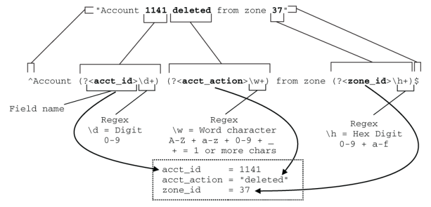

图 11.2 匹配第二个示例日志条目的正则表达式。该日志条目具有三个可捕获的信息；所有这三个都在图 11.1 的第一个表达式中。由于原始日志行的自然语言性质，区分这组字段与图 11.1 中的字段的唯一方法是缺少电子邮件地址和 `acct_action` 的内容。这种差异在具有大量自然语言日志记录的软件中很常见。

图 11.3 提供了其他三个日志行的匹配表达式，完成了示例日志行的匹配正则表达式的列表。我们看到两个新字段： `suspension_reason` 和 `zone_action` 。但是用于捕获这些新字段的正则表达式模式与我们在其他字段中看到的相同； `email_address` 与 `suspension_reason` 相同， `acct_action` 与 `zone_action` 相同。

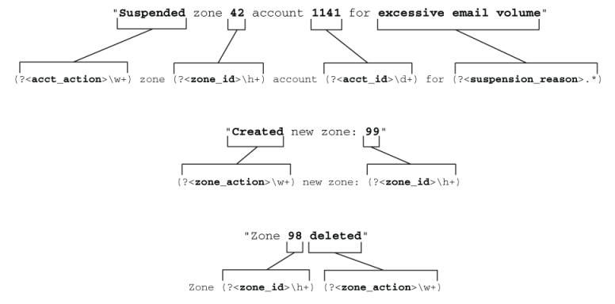

图 11.3 为示例集的剩余三个日志行匹配正则表达式。这种自然语言日志记录很容易在视觉上解析，但当我们尝试通过计算机解析它时，还有很多不足之处。

现在我们已经有了所有五个表达式，让我们在一些代码中使用它们。清单 11.1 是一个基准测试脚本，我将用它来描述锚定我们的正则表达式如何将我公司的 Shipping 阶段的吞吐量提高 12%。清单 11.1 中的基准测试脚本有四个测试用例，我们将分段查看：

- 未锚定的正则表达式，直接匹配其日志行，不会失败。
- 锚定正则表达式，直接匹配其日志行，不会失败。
- 未锚定的正则表达式，其中每个日志行都与所有五个正则表达式模式匹配。字典模式有很多匹配失败的情况。
- 锚定正则表达式，遵循非锚定表达式测试用例的字典模式。

清单 11.1 使用锚定和字典对正则表达式进行基准测试

```ruby
#!/usr/bin/env ruby
require 'benchmark'
 
log_examples = [
  'Added account 1141 in zone 42 with email twitterbot@example.com',                                        ❶
  'Account 1141 deleted from zone 37',                             ❶
  'Suspended zone 42 account 1141 for excessive email volume',     ❶
  'Created new zone: 99',                                          ❶
  'Zone 98 deleted',                                               ❶
 ]
iter = 1000000                                                     ❷
 
rbase = [
  Regexp.new('(?<acct_action>\w+) account (?<acct_id>\d+) in zone
  (?<zone_id>\h+)with email (?<email_address>.*)'),               ❸
  Regexp.new('Account (?<acct_id>\d+)                              ❸
  (?<acct_action>\w+) from zone (?<zone_id>\h+)'),                ❸
  Regexp.new('(?<acct_action>\w+) zone (?<zone_id>\h+) account     ❸
  (?<acct_id>\d+)for (?<suspension_reason>.*)'),                  ❸
  Regexp.new('(?<zone_action>\w+) new zone: (?<zone_id>\h+)'),     ❸
  Regexp.new('Zone (?<zone_id>\h+) (?<zone_action>\w+)')           ❸
]
 
ranchor = [
  Regexp.new('^(?<acct_action>\w+) account (?<acct_id>\d+) in
  zone (?<zone_id>\h+) with email (?<email_address>.*)$'),        ❹
  Regexp.new('^Account (?<acct_id>\d+)                             ❹
 (?<acct_action>\w+) from zone (?<zone_id>\h+)$'),               ❹
  Regexp.new('^(?<acct_action>\w+) zone                            ❹
(?<zone_id>\h+) account (?<acct_id>\d+) for                        ❹
 (?<suspension_reason>.*)$'),                                    ❹
  Regexp.new('^(?<zone_action>\w+) new zone:                       ❹
 (?<zone_id>\h+)$'),                                             ❹
  Regexp.new('^Zone (?<zone_id>\h+)                                ❹
 (?<zone_action>\w+)$')                                          ❹
]
Benchmark.bmbm do |rep|
  rep.report("Plain Regex-match") {                                ❺
    for m in 1..iter                                               ❺
      for q in 0..4                                                ❺
        log_examples[q].match?(rbase[q])                           ❺
      end                                                          ❺
    end                                                            ❺
  }                                                                ❺
  rep.report("Anchored Regex-match") {                             ❻
    for m in 1..iter                                               ❻
      for q in 0..4                                                ❻
        log_examples[q].match?(ranchor[q])                         ❻
      end                                                          ❻
    end                                                            ❻
  }                                                                ❻
  rep.report("Plain Regex-dictionary") {                           ❼
    log_examples.each do |sl|                                      ❼
      for m in 1..iter                                             ❼
        rbase.each do |relist|                                     ❼
          sl.match?(relist)                                        ❼
        end                                                        ❼
      end                                                          ❼
    end                                                            ❼
  }                                                                ❼
  rep.report("Anchored Regex-dictionary") {                        ❽
    log_examples.each do |sl|                                      ❽
      for m in 1..iter                                             ❽
        ranchor.each do |relist|                                   ❽
          sl.match?(relist)                                        ❽
        end                                                        ❽
      end                                                          ❽
    end                                                            ❽
  }                                                                ❽
end
```

❶ 我们的示例日志行

❷ 运行中循环的迭代次数

❸ 用于测试的非锚定正则表达式，预编译以确保我们在测试期间不会编译

❹ 用于测试和预编译的锚定正则表达式

❺ 测试用例 1：非锚定直接匹配

❻ 测试案例2：锚定直接匹配

❼ 测试用例 3：字典中未锚定的正则表达式

❽ 测试用例 4：字典中的锚定正则表达式

锚定是将字符串开头 ( `^` ) 和字符串结尾 ( `$` ) 标记放入模式中的简单操作。在模式的开头和结尾放置两个字符，你可以看到速度的显着提高。此更改是你可以对正则表达式进行的最简单的更改，以提高速度。

> 注意 仅当你匹配整个字符串时，锚定才起作用。如果你的模式与子字符串匹配，则锚定的帮助就会小得多。如果你的子字符串始终位于字符串的开头 ( `^` ) 或结尾 ( `$` )，则使用其中一个锚点仍然会有帮助。

我们的四个测试用例中有两个提到了字典模式，其中每个已知的正则表达式都与通过的每个日志行进行匹配以进行丰富。在我们的例子中，有 5 行日志和 5 个表达式，测试用例 3 和 4 循环通过基准测试，并将导致 25 次匹配尝试。图 11.4 说明了这个字典模式过程。

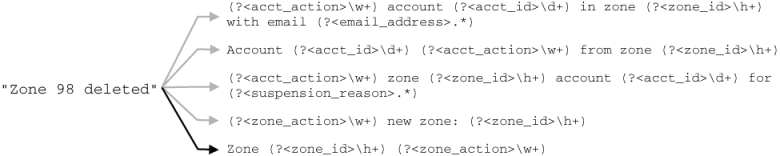

图11.4 正则表达式匹配的字典模式。每个传入的遥测数据都会与正则表达式集进行比较。在这里，我们看到在四次失败后最后一个正则表达式匹配（深色箭头）。使用字典模式时，你希望将匹配可能性最高的正则表达式放在顶部，将匹配可能性最低的正则表达式放在下面。

图 11.4 中的字典模式看起来效率极其低下，事实确实如此。但是，如果你的丰富工具在尝试将字符串与其精确的正则表达式进行匹配之前无法过滤字符串，则此技术将为你提供所需的丰富功能。有更好的方法可以做到这一点，这些方法需要做更多的工作，第 11.4 节提供了对你管理的代码的排放使用正则表达式的最佳方法（如果你必须使用正则表达式）。

现在让我们看一些基准测试结果，这些结果显示锚定如何影响性能。图 11.5 比较了使用 Ruby 3.0 的直接匹配模式和字典匹配模式的性能，并显示了锚定如何改变这两种模式。

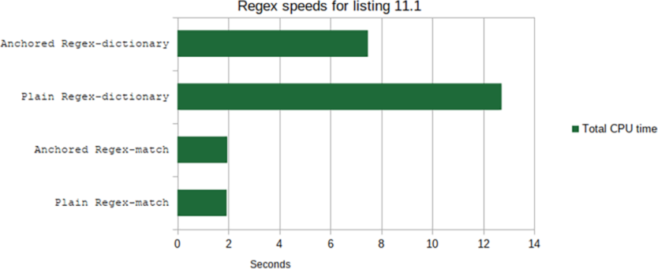

图 11.5 清单 11.1 中的基准测试结果显示了四种不同测试的速度结果。我们发现，对于 Ruby 正则表达式引擎，使用正则表达式字典时，与非锚定相比，锚定提供了根本性的速度改进，对于直接匹配，性能差异可以忽略不计。

请记住，正则表达式匹配测试将每个日志行直接与其匹配的正则表达式进行比较，因此它们不会有失败的匹配。这种情况代表了最好的情况，我们可以看到锚定没有提供显着的好处。该基准测试使用 Ruby 正则表达式引擎，但其他语言中的正则表达式引擎的执行情况略有不同。如果你正在构建自定义的 Shipping-stage 解析器，请务必测试你平台的正则表达式引擎，以了解性能有何不同。

正则表达式字典测试遵循图 11.4 所示的模式。每个日志行都会与所有五个正则表达式进行比较，因此每个日志行将导致四次匹配失败和一次匹配成功。这种情况代表了最坏的情况，我们看到使用锚点时速度显着提高，性能提高了 41.2%！当我们执行此优化时，我们看到了 12% 的改进，因为我们对正则表达式字典进行了排序，以便最常见的日志行位于列表的顶部，并且我们的整个字典不需要像每行那样频繁地解析。和...之间的不同

```
Zone (?<zone_id>\h+) (?<zone_action>\w+)
```

和

```
^Zone (?<zone_id>\h+) (?<zone_action>\w+)$
```

可以显着提高性能，并且是一个很小的变化。这种速度的提高完全归功于锚点，因为它们告诉正则表达式引擎从字符串的开头开始匹配，而不是遍历字符串寻找任何匹配的内容。快速故障可以实现更快的遥测管道。我们还有其他方法来实现更快的故障，我们将在 11.2 节中讨论。

> 从技术上讲， `email_address` 不是个人身份信息吗？我们为什么要关注这个？
>
> 根据欧洲隐私法规，电子邮件地址现在被视为 PII，因此需要遵守特殊处理程序，因此你应该停止在日志记录中使用电子邮件地址。第 16 章涵盖了处理电子邮件地址等受监管数据的主题，但要很好地处理受监管数据，你需要知道它的存在。
>
> 你在本节中进行的正则表达式解析将为你留下一个名为 `email_address` 的字段。然后你的运输阶段可以根据需要直接处理编辑或屏蔽该字段。最好不要发出这些数据，但如果你正在改掉坏习惯，这里的技巧可以帮助你做得更好。

> 练习11.1
>
> 使用 https://regex101.com，构建一个与以下两行匹配的正则表达式。将这两行复制到测试字符串字段中，并在正则表达式字段中构建正则表达式。匹配信息字段将告诉你匹配项是什么，并且该网站将为你匹配的字符串着色。使用命名捕获组来获取操作、应用程序 ID、响应代码和日志级别。
>
> ```
> [INFO] Sent API callback to APPID 1141, response 200
> [WARN] Sent API callback to APPID 96821, response 503
> ```
>
> 左侧是一个正则表达式调试器，它将向你显示表达式达到匹配所需的步骤。

## 11.2 构建快速失败的表达式

快速正则表达式是告诉正则表达式引擎停止尝试尽快匹配错误字符串的正则表达式。通过减少正则表达式引擎必须处理的选项来提高速度。使用字符串锚点，例如字符串开头 ( `^` ) 和字符串结尾 ( `$` ) 标记（如 11.1 节中所述），是一种快速获取字符串锚点的有效方法。失败。本节介绍更多使你的正则表达式引擎更快地停止匹配尝试的方法。

在讨论具体技术之前，我需要先谈谈匹配如何与正则表达式引擎一起工作。这些引擎会努力在给定字符串中查找任何匹配项，并会在字符串中回溯以查找匹配项（如果需要的话）。让我们看一个简单的正则表达式，看看它如何处理字符串的匹配过程。下面是图 11.6 中的正则表达式和它将匹配的字符串：

```
.*Account: (?<acct_id>\d+?).*Zone: (?<zone_id>\h+?)
2028-02-19T14:08.232 Account: 1121 Region: EMEA Zone: 42
```

图 11.6 显示了正则表达式引擎为与我们的示例字符串进行匹配而进行的 49 次尝试。我们还看到，大多数尝试都是由字符串开头的 `.*` 引起的，因为表达式的这一部分与整个字符串匹配，并且正则表达式引擎必须在字符串中返回一个字符找到表达式下一部分的匹配项之前的时间。这个例子说明了贪婪；它会抓住一切并慢慢地返回角色，直到下一场比赛发生。

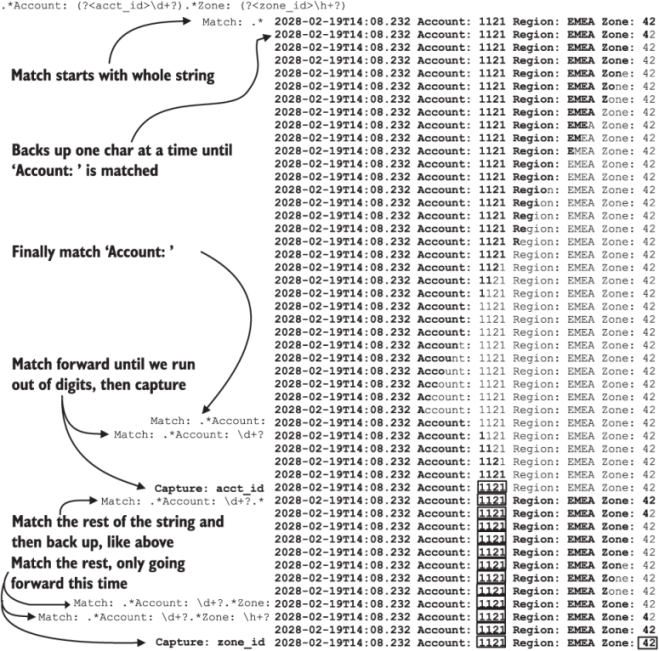

图 11.6 我们的示例正则表达式和给定字符串的一系列匹配尝试。匹配尝试以粗体显示；占领的田地周围有方块。我们看到 `.*` 立即匹配整个字符串，并且正则表达式引擎一次支持一个字符的匹配，直到找到 `'Account: '` 。对第二个 `.*` 重复该过程，直到它与 `'Zone: '` 匹配。

另请注意作为 `acct_id` 捕获一部分的 `\d+?` 表达式发生了什么。这匹配以 10 为基数的数字，并且 `?` 修饰符使其一次前进一个字符，直到用完数字。加号运算符也是贪婪的，但是添加问号运算符使其变得懒惰；它一次需要一个额外的字符，直到下一个匹配发生。

> 警告 使用像 `.*` （点星）和 `.+` （点加）这样的贪婪运算符对性能来说非常危险。如果你正在构建用于遥测丰富的正则表达式，并且你的意思是“匹配过去的所有内容”，则仅使用 `.*` （或任何其他格式，例如 `\d*` 或 `\w*` ）这点。”更好的是，使用 `.*$` 或 `.+?` ，配对 `.*` 或 。 `+` 带有字符串结尾标记 ($)，以进一步提示正则表达式引擎你打算匹配其他所有内容。在大多数情况下，在表达式中间的任何位置使用 `.*` 或 `.+` 都会降低性能。考虑使用 `.+?` （点加问号）；该运算符是惰性运算符，因此它将在字符串中向前迈进，直到找到下一个匹配项。

不管你相信与否，图 11.6 是所发生情况的简化视图！当你给出匹配的字符范围时，例如 `0-9` 的 `\d` 和 `0-9 & a-f` 的 `\h` ，正则表达式引擎将尝试匹配下一个字符与范围内的每个字符，直到找到匹配项。图 11.7 直观地显示了 `\h+?` 与 `Zone: 42` 的匹配情况。

图 11.7 范围的正则表达式匹配，这里使用 `\h` 来匹配 16 进制数字。我们看到正则表达式引擎迭代数字，直到它与字符串匹配，然后再继续处理下一个字符。过大的字符范围会损害正则表达式引擎的性能，因此使用狭窄的范围来提高性能。

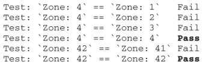

我们在图 11.7 中看到，示例正则表达式引擎进行了六次尝试来匹配 `42` 。如果我们将贪婪和惰性运算符与注意限制字符集结合起来，我们可以为正则表达式引擎提供许多线索，表明它应该停止尝试为永远不会匹配的字符串查找匹配项。只要我们知道我们将使用什么样的遥测数据，我们就可以提供更多帮助。我们的示例匹配的字符串 `Account: 1121 Region: EMEA Zone: 42,` 在 `acct_id` 和 `zone_id` 的两个捕获语句中间有一个 `Region:` 条目。我们在图 11.6 中测试的正则表达式有一个贪婪的 `.*` 来跳过我们不关心的遥测，这导致在找到 `Zone:` 之前匹配失败。如果我们知道 `Region:` 将具有什么值，我们可以调整正则表达式引擎以更快地匹配（粗体更改）：

```
.+?Account: (?<acct_id>\d+?) Region: .{2,4} Zone: (?<zone_id>\h+?)
```

`.{2,4}` 构造告诉正则表达式引擎接受任何两到四个字符的组，并且我们不捕获这些字符。以这种方式放置，引擎将匹配空格字符之间的任何字符。使用这个正则表达式，图 11.6 变成图 11.8。

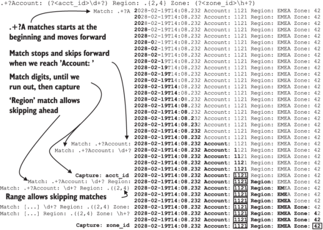

图 11.8 我们更好优化的正则表达式的正则表达式匹配尝试。匹配项以粗体显示；现场捕获有框。与图 11.6 不同，我们没有看到任何证据表明正则表达式引擎在处理过程中在字符串中回溯；进步总是向前的。通过处理正则表达式中的 `Region:` 数据，我们减少了正则表达式引擎确认匹配的尝试次数。

图 11.6 在匹配整个字符串之前需要 49 次匹配尝试，而图 11.8 中我们修改后的正则表达式只需要 35 次。大部分节省来自于以 `.+?` （点加问号）开始表达式，而不是 `.*` （点星），其余部分来自我们对 `Region:` 的优化。这个正则表达式针对成功的案例进行了很好的优化，但如果我们想优化它以使其快速失败，我们将在字符串前面包含时间戳并应用锚定：

```
^2.+?Account: (?<acct_id>\d+?) Region: .{2,4} Zone: (?<zone_id>\h+?$
```

当我们将 `^2` 添加到字符串的开头时，我们的正则表达式引擎可以在两次尝试内判断是否值得匹配该字符串。那很快就会失败，好吧！如果 Java 堆栈转储位于遥测流中，以制表符或其他空格开头，则将 `^2` 添加到正则表达式的开头将使这些行极其快速地失败。

当使用字典模式时，此方法非常有用。将每个遥测行与正则表达式列表相匹配，如第 11.1 节所述。由于字符串开头标记后跟 2 测试起来非常简单且快速，因此你可以将其用作更复杂的字典正则表达式的过滤器。清单 11.2 展示了使用正则表达式插件 Grok 在 Logstash 中如何工作的模型。

清单 11.2 由使用正则表达式的过滤器控制的示例 Grok 语句

```ruby
filter {
  if [message] =~ "^2" {                ❶
    grok {
      match => {
        "message" => [                  ❷
          "regex1"                      ❷
          "regex2"                      ❷
          "regex3"                      ❷
        ]                               ❷
      }
      tag_on_failure => "_regex_fail"   ❸
    }
  }
}
```

❶ 此正则表达式测试必须成功才能让 grok {} 块运行。

❷ 字典模式

❸ 标记失败可以轻松改进正则表达式和过滤器。

`grok {}` 块是 Logstash 正则表达式插件，仅当被测试的字符串以数字 `2` 开头时才会运行。 Grok 按顺序运行，因此每个正则表达式都会被测试，直到有一个匹配为止；其余模式将不进行测试。通过在 Grok 块之前应用过滤器，我们可以确保字符串仅测试一次，然后失败，然后执行其他事情，而不是让三个正则表达式每次测试并失败。图 11.9 显示了该条件的实际效果。

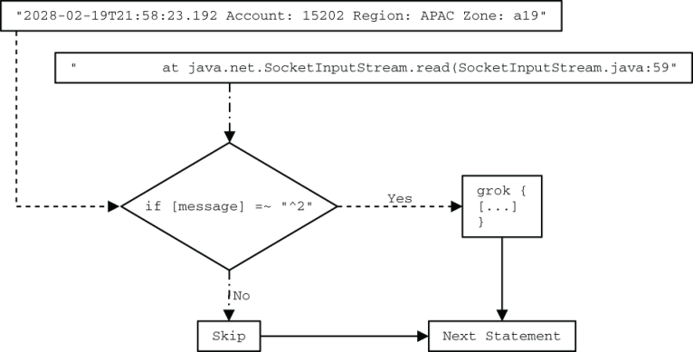

图 11.9 我们的 Logstash 配置正在测试两个字符串：一个常规日志语句（虚线）和一个 Java 堆栈转储组件（点划线）。因为我们的常规日志语句以 `2` 开头字符串，所以它被发送到 Grok 进行解析。我们的 Java 堆栈转储组件不以 2 开头，因此 Logstash 会跳过该语句的 Grok。该条件阻止了在堆栈转储上运行相当复杂的正则表达式，并加快了日志记录管道的速度。

> 提示 使用简单、快速的正则表达式来测试是否尝试更复杂的正则表达式是减少使用正则表达式对性能的影响的有效方法。

## 11.3 深入研究 Cisco ASA 防火墙遥测

现在我们已经了解了锚定（第 11.1 节）和快速失败（第 11.2 节），本节将研究如何使用正则表达式和我们在第 1 部分中使用的一些遥测数据：来自 Cisco ASA 防火墙的遥测数据。 （要了解此丰富工作的功能，请参阅第 5.2 节。）我们将研究解析此遥测数据的三种方法，包括第 6.2.2 节中的方法。本节将展示简单的正则表达式和复杂的优化正则表达式之间的性能差异，并讨论为什么过度优化并不总是能带来改进。

> 警告 本节将向你展示为什么要对正则表达式进行基准测试。优化表达式以便正则表达式引擎能够以最少的步骤找到（或无法找到）匹配项是有用的，但有时，编程语言的开销会更昂贵。

我们的 Cisco ASA 防火墙遥测通过 Syslog 进入管道，这就是 Cisco ASA 所说的。下面是一个示例字符串（ `%ASA` 后面的冒号是 Syslog 遥测数据和 Cisco 遥测数据之间的分隔符）：

```
Feb 19 02:26:26 asa1.net.prod.internal %ASA1: Teardown of UDP connection
162121 for outside:1.1.0.0/53 to dmz1:192.0.2.19/59232 duration 0:00:00
bytes 136
```

6.2.2 节中的清单 6.3 提供了解析该字符串的 `grok {}` 示例。 （第 6.2.2 节还给出了一种更快的非正则表达式解析字符串的方法。）。但是该正则表达式对于适应页面和教学效率很低，因此我们将使用本章前面学到的内容来了解如何更改与此示例字符串匹配的正则表达式。表 11.1 显示了三个正则表达式，它们提取相同数量的字段，但以日益优化的方式编写。

- 3-pass - 匹配第 6.2.2 节中使用的方法，其中正则表达式引擎执行第一遍匹配，然后对第一遍中提取的字段执行第二遍和第三遍。 这种表达方式最容易理解，但性能最差。
- 1-pass - 此表达式使用相同的正则表达式捕获组在单个表达式和单遍中收集 3-pass 所做的所有字段。
- 1-pass slimmed - 1-pass 版本，为每个正则表达式组件指定长度，以进一步指导正则表达式引擎期望得到什么样的字符串。这个表达式是最复杂的语句，应该是性能最好的（但事实并非如此）。

表 11.1 与 Cisco ASA 遥测匹配的三个正则表达式变体

|    要匹配的字符串     | 3-pass (first pass) | 3-pass (second and third passes) |        1-pass        |          1-pass slimmed 1          |
| :-------------------: | :-----------------: | :------------------------------: | :------------------: | :--------------------------------: |
|    ‘Teardown of ‘     |   ‘Teardown of ‘    |                                  |    ‘Teardown of ‘    |           ‘Teardown of ‘           |
|          UDP          | (?<protocol> \w+?)  |                                  |  (?<protocol> \w+?)  |       (<protocol> [A-Z]{3})        |
|    ‘ connection ‘     |  `’ connection ‘`   |                                  |    ’ connection ‘    |           ’ connection ‘           |
|        162121         |  (?<conn_id> \d+?)  |                                  |  (?<conn_id> \d+?)   |         (?<conn_id> \d+?)          |
|       ’ for ‘‘        |       ’ for ‘       |                                  |       ’ for ‘        |              ’ for ‘               |
|  outside:1.1.0.0/53   |  (?<source> \S+?)   |                                  |                      |                                    |
|        outside        |                     |       (?<source_int> \w+?)       | (?<source_int> \w+?) |        (?<source_int> \w+?)        |
|        1.1.0.0        |                     |        (<source_ip> \S+?)        |  (<source_ip> \S+?)  |      (?<source_ip> \S{7,15})       |
|          53           |                     |       (?<source_port> \d+)       | (?<source_port> \d+) |      (?<source_port> \d{1,5})      |
|        ’ to ‘         |       ’ to ‘        |                                  |        ’ to ‘        |               ’ to ‘               |
| dmz1:192.0.2.19/59232 |  (?<target> \S+?)   |                                  |                      |                                    |
|         dmz1          |                     |       (?<target_int> \w+?)       | (?<target_int> \w+?) |      (?<target_int> \w{4,8})       |
|      192.0.2.19       |                     |       (?<target_ip> \S+?)        | (?<target_ip> \S+?)  |      (?<target_ip> \S{7,15})       |
|         59232         |                     |      (?<target_port> \d+?)       | (?<target_port> \d+) |      (<target_port> \d{1,5})       |
|     ’ duration ‘      |    ’ duration ‘     |                                  |     ’ duration ‘     |            ’ duration ‘            |
|        0:00:00        | (?<duration>``\S+?) |                                  |  (?<duration> \S+?)  | (?<duration> \d{1,2}:\d{2}: \d{2}) |
|       ’ bytes ‘       |      ’ bytes ‘      |                                  |      ’ bytes ‘       |             ’ bytes ‘              |
|          136          |   (?<bytes> \d+)    |                                  |    (?<bytes>\d+)     |           (?<bytes>\d+)            |

为了展示这三个正则表达式的执行情况，我们将它们与四个字符串进行比较：

- Hardfail——明显失败的匹配
- halfmatch — TCP 连接拆除 113121 语法错误
- substringmatch—2 月 19 日 02:26:26 asa1.net.prod.internal %ASA1：拆除外部的 UDP 连接 162121：1.1.0.0/53 到 dmz1:192.0.2.19/59232 持续时间 0:00:00 字节 136
- fullmatch - 拆除外部的 UDP 连接 162121：1.1.0.0/53 到 dmz1:192.0.2.19/59232 持续时间 0:00:00 字节 136

我们还将比较每个正则表达式的锚定版本（有关说明，请参阅第 11.1 节），以演示锚定如何与此处的优化一起工作。正如第 11.1 节中提到的，锚定对于让正则表达式引擎停止尝试匹配不匹配的字符串最有用，但会使与真正匹配的匹配稍微慢一些。

图 11.10–11.13 是根据本书 Git 存储库 (http://mng.bz/oGJD) 的 CH11 文件夹中的 `cisco-regex.rb` 脚本的数据生成的。该脚本在形式上与清单 11.1 中看到的类似，但针对我们在本章中测试的情况而设计。它针对前面描述的四个字符串测试所有三个正则表达式模式。

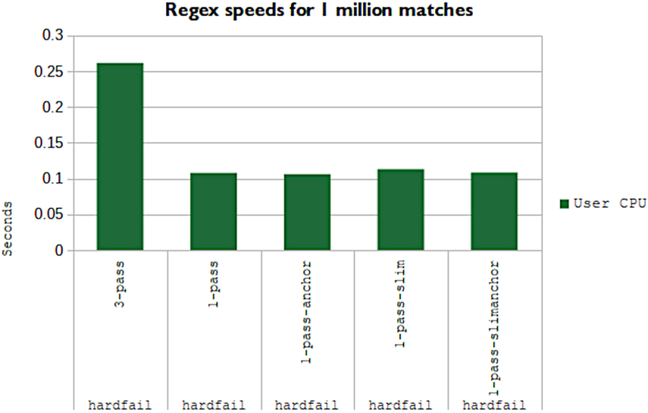

图 11.10 `hardfail` 字符串的正则表达式计时。此示例测试每个正则表达式在快速失败方面的效率。我们发现 3 遍正则表达式在这项任务上表现得很糟糕。不同的正则表达式引擎的行为不同，所以一定要测试你的。

图 11.10 显示了三个正则表达式（包括另外两个用于测试锚定的正则表达式）如何针对 `hardfail` 字符串执行操作。 6.2.2 节中使用的 3 遍变体的性能是最差的。测试是否尝试执行第二遍和第三遍所需的额外代码（非正则表达式）条件需要足够的额外时间，使匹配速度慢两倍以上。锚定版本和非锚定版本之间的差异是可见的，尽管差异很小。当我使用旧版本的 Ruby 运行此测试时，差异就消失了。

但 1-pass-slim 变体（使用 `\w{2,6}` 等范围表达式而不是 `\w+?` 等惰性运算符的变体）比 1-pass 变体表现更差。影响很小，大约4.8%，但也有。解释原因需要研究匹配过程中发生的情况。

所有 1 遍正则表达式变体均以字母 `T` 或锚定表达式 `^T` 开头。锚定版本将查找字符串的开头，后跟“ `Obvious` `failing` `match` ”没有的 `T,` ；两步后匹配失败。非锚定版本会从“ `Obvious` `failing` `match` ”开头开始，一步一步前进一个字母，不会找到 `T` 情况下是这样。一定要测试你的正则表达式引擎，看看它的性能如何！让我们看看这个问题是否仍然存在。

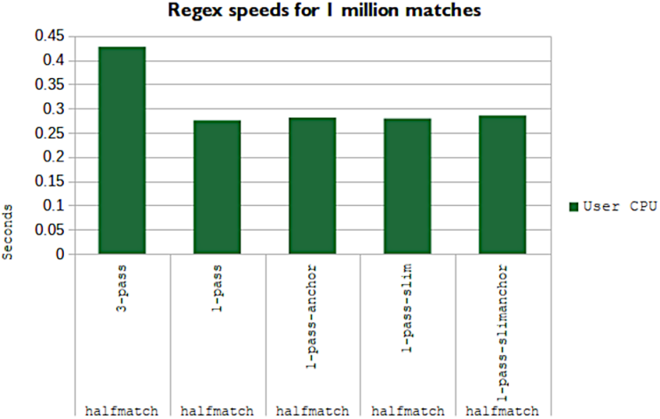

图 11.11 包含完整字符串一部分的 `halfmatch` 的正则表达式速度。此示例测试每个正则表达式在具有部分（但不是全部）匹配的字符串中快速失败的效率。再次强调，三遍正则表达式是迄今为止最慢的。锚定表达式的表现比非锚定版本稍差。

图 11.11 显示了三个正则表达式如何针对 `halfmatch` 字符串执行操作，其中包括完整字符串的第一部分。此测试是一种不同的匹配失败情况，其中被测试的字符串符合正则表达式期望（在某种程度上）。我们不期望锚定对这个测试有帮助，因为字符串的开头匹配正则表达式中的一些组件，并且我们发现锚定表达式的执行速度比未锚定版本慢一些（大约 2.1%，稍微慢一些）。高于误差范围）。

我们是否在精简版中看到了相同的性能下降？你在图 11.11 中看不到它，但 1-pass 精简版本比更简单的 1-pass 慢 1.4%，这正好在误差范围内。然而，“更复杂的正则表达式会降低匹配速度”假设在锚定表达式中找到了新数据。在这里，锚定只是在开始时添加了一个步骤，因此影响应该很小，但这不是我们看到的。与非锚定版本相比，性能下降 2.1% 可以用较长的正则表达式本身的开销来解释。

下一个字符串是我们的 `substringmatch` 。图 11.12 显示了每个正则表达式与 `substringmatch` 字符串的性能，其中测试的字符串包含我们的遥测数据，但整个字符串不匹配。锚定在这里没有帮助，因为我们不期望正则表达式的整个字符串匹配，因此锚定变体的表现应该与前面图中的失败模式类似。正如我们所看到的，这里就是这种情况。

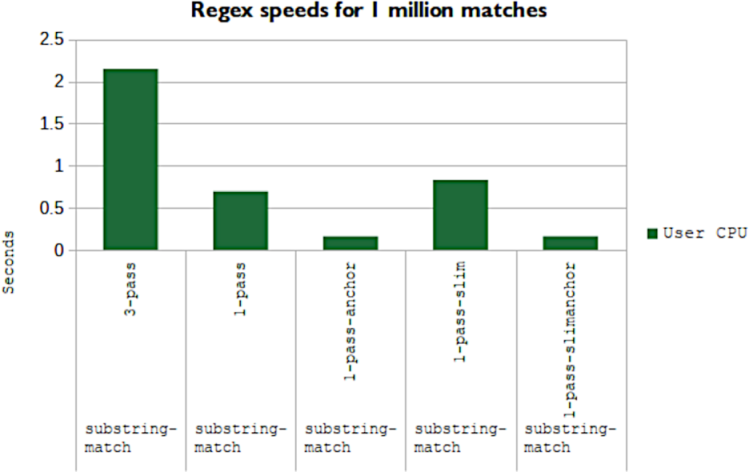

图 11.12 `substringmatch` 的正则表达式速度，其中字符串包含未锚定正则表达式所期望的内容，但不包含锚定版本。此示例测试部分字符串匹配的性能。锚定版本应该会失败，因为锚定意味着全字符串匹配。我们发现最优化的表达式 1-pass-slim 的性能并不比 1-pass 版本更好！

我们还发现匹配的变体的性能出现了意想不到的差异。 3 遍仍然是最慢的，但现在速度非常慢，速度是 1 遍变体的三倍。我们在 1-pass-slimmed 变体中对角色期望进行的优化会损害整体性能；该版本的执行速度比 1-pass 慢 19%。显然，对于子字符串匹配情况，我们花在优化 1-pass-slim 变体上的时间是不值得的；该变体会减慢一切。

最后，让我们看看全弦匹配性能，这是所有五个版本的快乐之路。图 11.13 显示了每个正则表达式如何针对与其完全匹配的字符串执行操作。我们看到了与图 11.11 和 `substringmatch` 中看到的相同的一般模式，但这次锚定表达式的性能与未锚定版本相同。与其他版本相比，易于理解的 3 遍版本的性能非常糟糕。再次强调，1-pass-slimmed 的性能比 1-pass 差（大约差 22%）。

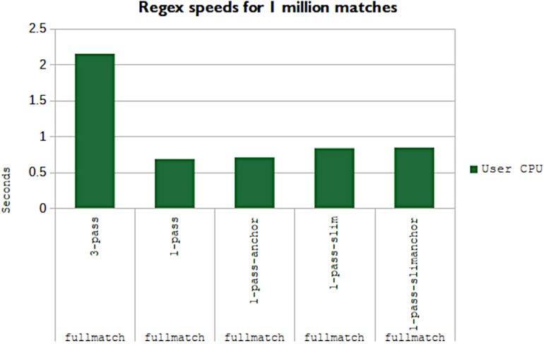

图 11.13 `fullmatch` 字符串的正则表达式速度，测试完全匹配情况。所有正则表达式在此测试中均成功。

我在这里展示的性能是 Ruby，Fluentd 和 Logstash 都是用 Ruby 编写的。对于 Ruby，较短的正则表达式比较长但范围更紧密的正则表达式性能更好。当你构建自己的遥测系统时，绝对要对你的编程语言在这些条件下的性能进行基准测试！假设可能是错误的，过度优化会让事情变得更糟。

鉴于我们在这里看到的情况，我们学到了一些东西：

- 正则表达式越优化，就越难理解它在做什么。
- 当你使用链式正则表达式时，3 遍正则表达式模式的性能非常糟糕。如果你重视速度而不是可维护性，最好将这些模式合并为一个模式（1-pass 模式）。
- 在正则表达式中提供长度期望（例如 `[a-z]{3,8}` 表示三到八个小写字符）意味着正则表达式引擎与惰性运算符（ `+?` ；从 1 开始并向前移动）。
- 当被测试的字符串的一部分与正则表达式匹配时，锚定非常有效；它可以更快地将软故障转变为完全故障。如果你只想匹配完整的字符串，锚定将显着加快速度。
- 正则表达式的大小会影响整体性能，因此请对你的系统进行基准测试以确定问题的严重程度。至少对于 Ruby 来说，简短比减少正则表达式步骤更重要。

> 练习11.2
>
> https://regex101.com 上的正则表达式可视化工具对于优化表达式非常有用。使用它来亲自查看四个 1-pass 变体如何针对四个测试字符串执行。提示：将分隔符从正斜杠 ( `/` ) 更改为波浪号 ( `~)` ，以避免在正则表达式中转义正斜杠。
>
> 测试字符串
>
> - Hardfail——明显失败的匹配
> - halfmatch — TCP 连接拆除 113121 语法错误
> - substringmatch—2 月 19 日 02:26:26 asa1.net.prod.internal %ASA1：拆除外部的 UDP 连接 162121：1.1.0.0/53 到 dmz1:192.0.2.19/59232 持续时间 0:00:00 字节 136
> - fullmatch - 拆除外部的 UDP 连接 162121：1.1.0.0/53 到 dmz1:192.0.2.19/59232 持续时间 0:00:00 字节 136
>
> 正则表达式。
>
> - *1-pass*—`Teardown of (?<protocol>\w+?) connection (?<conn_id>\d+?) for (?<source_int>\w+?):(?<source_ip>\S+?)/(?<source_port>\d+?) to (?<target_int>\w+?):(?<target_ip>\S+?)/(?<target_port>\d+?) duration (?<duration>\S+?) bytes (?<bytes>\d+)` 1 遍 — `Teardown of (?<protocol>\w+?) connection (?<conn_id>\d+?) for (?<source_int>\w+?):(?<source_ip>\S+?)/(?<source_port>\d+?) to (?<target_int>\w+?):(?<target_ip>\S+?)/(?<target_port>\d+?) duration (?<duration>\S+?) bytes (?<bytes>\d+)`
> - *1-pass-anchored*—`^Teardown of (?<protocol>\w+?) connection (?<conn_id>\d+?) for (?<source_int>\w+?):(?<source_ip>\S+?)/ (?<source_port>\d+?) to (?<target_int>\w+?):(?<target_ip>\S+?)/ (?<target_port>\d+?) duration (?<duration>\S+?) bytes (?<bytes>\d+)$`
> - *1-pass-slimmed*—`Teardown of (?<protocol>[A-Z]{3}) connection (?<conn_id>\d+?) for (?<source_int>\w{1,8}):(?<source_ip>\ S{7,15})/(?<source_port>\d{1,5}) to (?<target_int>\w{4,8}): (?<target_ip>\S{7,15})/(?<target_port>\d{1,5}) duration (?<duration>\d{1,2}:\d{2}:\d{2}) bytes (?<bytes>\d+)`
> - *1-pass-slimmed-anchored*—`^Teardown of (?<protocol>[A-Z]{3}) connection (?<conn_id>\d+) for (?<source_int>\w{1,8}): (?<source_ip>\S{7,15})/(?<source_port>\d{1,5}) to (?<target_int>\w{4,8}):(?<target_ip>\S{7,15})/(?<target_port>\d{1,5}) duration (?<duration>\d{1,2}: \d{2}:\d{2}) bytes (?<bytes>\d+)$`
>
> Regex101 的左侧是一个指向 Regex 调试器的链接，可让你逐步完成每个表达式在尝试匹配时遵循的所有匹配步骤。 Regex101 默认使用 Perl 风格的正则表达式，它与 Ruby 风格足够接近，因此这些表达式不需要翻译。

## 11.4 优化排放以加速正则表达式性能

加速正则表达式性能的最佳方法是摆脱正则表达式并使用不同的方法来丰富遥测。不幸的是，并不是每个人都可以在更换遥测系统主要部分的情况下工作。本节讨论如何充分利用你所拥有的资源，让你有时间解决更困难的问题，即改变在生产代码中处理集中式日志记录的方式。这里的技术适用于你管理的代码，因此你可以控制发射格式。

第 11.1-11.3 节为我们提供了几种加速正则表达式性能的技术：

- 如果要匹配整个字符串，则在使用正则表达式字典时，使用字符串开头 ( `^` ) 和字符串结尾 ( `$` ) 标记可以显着提高性能。
- 在字符串末尾使用贪婪运算符（* 和 `+` ）可以防止性能大幅下降。相反，请使用惰性运算符（ `+?` 用于一个或多个匹配； `*?` 用于零个或多个匹配）进行中字符串匹配。
- 在正则表达式中指定长度（例如 `\d{3,7}` 表示三到七个以 10 为基数的数字）将缩短正则表达式引擎进行的匹配尝试次数。这一优势通过较长的正则表达式字符串本身的成本来平衡；过度优化会降低速度，基准测试是判断你是否找到了正确平衡的唯一方法。
- 在应用复杂的、优化的正则表达式字典之前，使用简单的正则表达式（例如 `^20[2-3][0-9]` 只匹配以年份时间戳开头的行）预先测试字符串，可以减少昂贵的匹配失败。

第 11.1 节还为我们提供了一组五个日志发射示例，我用它们来讨论锚定如何加快速度：

```
Added account 1141 in zone 42 with email twitterbot@example.com
Account 1141 deleted from zone 37
Suspended zone 42 account 1141 for excessive email volume
Created new zone: 99
Zone 98 deleted
```

如果你控制的唯一遥测组件是发射本身以及与其匹配的正则表达式，那么你可以采取哪些措施来提高事件吞吐量？当五位软件工程师发现需要编写日志语句并使用当时浮现在脑海中的语法当场写下他们的语句时，这五个示例就应运而生了。除了自然语言之外，没有其他标准。查看五个日志行，我们发现前三个涉及帐户操作：

```
Added account 1141 in zone 42 with email twitterbot@example.com
Account 1141 deleted from zone 37
Suspended zone 42 account 1141 for excessive email volume
```

下面两个涉及区域上的操作：

```
Created new zone: 99
Zone 98 deleted
```

如果我们在前面添加一个字符串来指示帐户或区域，然后根据这些字符串预先测试每个日志行会怎么样？

```
[account] Added account 1141 in zone 42 with email twitterbot@example.com
[account] Account 1141 deleted from zone 37
[account] Suspended zone 42 account 1141 for excessive email volume
[zone] Created new zone: 99
[zone] Zone 98 deleted
```

我们可以将帐户正则表达式置于测试 `^\[account\]` 的条件下，并将区域正则表达式置于测试 `^\[zone\]` 的条件下，这意味着永远不会比较有关区域操作的日志行与帐户正则表达式。当我们测试精确的字符串而不是范围并使用字符串开头标记（ `^` ）时，我们使这些预测试变得非常快。

清单 11.3 是另一个基准测试脚本的摘录，我将用它来显示我们在第 11.1 节中看到的性能与我们针对两个正则表达式字典预测试字符串后发生的情况之间的性能差异。清单11.3提供了拆分版本的基准测试用例的关键代码。

清单 11.3 显示帐户/区域分割的 `[appendix script]` 摘录

```ruby
[...]
split_examples = [
  '[account] Added account 1141 in zone 42 with email 
➥ twitterbot@example.com',
  '[account] Account 1141 deleted from zone 37',
  '[account] Suspended zone 42 account 1141 for excessive email volume',
  '[zone] Created new zone: 99',
  '[zone] Zone 98 deleted',
]
 
raccount = [                                                        ❶
  Regexp.new('^\[account\] (?<acct_action>\w+) account              ❶
➥ account (?<acct_id>\d+?) in zone (?<zone_id>\h+?) with email     ❶
➥ (?<email_address>.*)$'),                                         ❶
  Regexp.new('^\[account\] Account (?<acct_id>\d+?)                 ❶
➥ (?<acct_action>\w+?) from zone (?<zone_id>\h+)$')                ❶
  Regexp.new('^\[account\] (?<acct_action>\w+?) zone                ❶
➥ (?<zone_id>\h+?) account (?<acct_id>\d+?) for                    ❶
➥ (?<suspension_reason>.*)$'),                                     ❶
]
 
rzone = [
  Regexp.new('^\[zone\] (?<zone_action>\w+?) new zone:              ❷
➥ (?<zone_id>\h+)$'),                                              ❷
  Regexp.new('^\[zone\] Zone (?<zone_id>\h+?)                       ❷
➥ (?<zone_action>\w+)$')                                           ❷
]
 
isaccount = Regexp.new('^\[account\]')
iszone    = Regexp.new('^\[zone\]')
 
[...]
 
  rep.report("Account/Zone split regexes") {
    split_examples.each do |sl|
      for m in 1..iter
        if sl.match?(isaccount)                                     ❸
          raccount.each do |relist|
            sl.match?(relist)
          end
        elsif sl.match?(iszone)                                     ❸
          rzone.each do |relist|
            sl.match?(relist)
          end
        end
      end
    end
  }
```

❶ 账户正则表达式词典

❷ 区域正则表达式词典

❸ 预测试条件以确定测试哪个正则表达式集。

现在让我们看看性能有何不同！图 11.14 提供了测试所有五个正则表达式与基于前置字符串分组测试的比较。

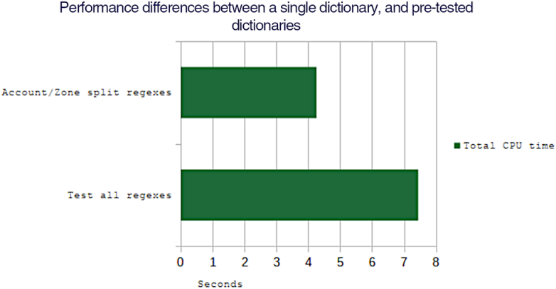

图 11.14 将正则表达式应用于包含五个示例日志项的列表的两种技术。在尝试从日志数据捕获遥测数据之前，顶部栏正在对 `[account]` 或 `[zone]` 执行字符串开头测试。下方的栏正在针对每个日志行测试所有正则表达式。通过预测试和拆分正则表达式，我们发现处理示例日志行所需的时间得到了根本性的改善。

简单地通过在前面添加一个字符串来分割我们的字典，花费了使用每个锚定正则表达式运行每个日志行的 57% 的时间。像这样的性能改进足以证明对日志发送和日志丰富系统进行更改是合理的。但我们可以从这组日志行中获得更高的性能。前置字符串给我们带来了很多好处，但我们的语言仍然是自然语言，并且是由许多软件工程师编写的。我们的三个帐户日志行

```
[account] Added account 1141 in zone 42 with email twitterbot@example.com
[account] Account 1141 deleted from zone 37
[account] Suspended zone 42 account 1141 for excessive email volume
```

从英语的角度来看，它们的表达很清晰，但它们传达的信息相似。我们在每个区域都有帐户和区域 ID，对于其中两个，我们有一些额外的信息。如果我们重新措辞我们的日志行以提高正则表达式的性能，我们会得到

```
[account] Added account 1141 in zone 42 with email domain example.com
[account] Deleted account 1141 in zone 37
[account] Suspended account 1141 in zone 42 for excessive email volume
```

此步骤是查看你正在记录的内容并进行更改的好地方。在这里，我们不再记录用于创建帐户的电子邮件地址，因为电子邮件地址现在是私人信息。这仍然是自然语言，但用正则表达式解析起来也容易得多。

```
^\[account\] (?<acct_action>\w+?) account (?<acct_id>\d+?) in zone (?<zone_id>\h+?)\S?(?<acct_extra>.*)$
```

此代码有些复杂，但请注意 `\S?` 表示“匹配零个或多个空白字符”，最后的 `(?<acct_extra>.*$)` 表示“匹配字符串中的其他所有内容”。此结构允许匹配没有额外文本的 `Deleted` 日志行，同时还匹配 `Added` 和 `Suspended` 情况。根据正则表达式引擎的具体情况， `acct_extra` 将是 `null` ，未定义，或者如果不匹配则为空字符串，如 `Deleted` 情况。表 11.2 提供了这个统一正则表达式的并排视图，并显示了它如何匹配所有三个日志行。

表 11.2 捕获所有三个日志行的统一帐户正则表达式

|            日志行 1             |   日志行 2   |           日志行 3           |      正则表达式      |
| :-----------------------------: | :----------: | :--------------------------: | :------------------: |
|          ‘[account] ’           | ‘[account] ‘ |         ‘[account] ‘         |   ‘^\[account\] ‘    |
|             ‘Added’             |  ‘Deleted’   |         ‘Suspended’          | (?<acct_action>\w+?) |
|           ‘ account ‘           | ‘ account ‘  |         ‘ account ‘          |     ‘ account ‘      |
|             ‘1141’              |    ‘1141’    |            ‘1141’            |   (?<acct_id>\d+?)   |
|           ‘ in zone ‘           | ‘ in zone ‘  |         ‘ in zone ‘          |     ‘ in zone ‘      |
|              ‘42’               |     ‘37’     |             ‘42’             |   (?<zone_id>\h+?)   |
|               ‘ ‘               |      ’’      |             ‘ ‘              |         \S?          |
| ‘with email domain example.com’ |      ’’      | ‘for excessive email volume’ |  (?<acct_extra>.*)$  |

现在让我们对一对区域日志行执行相同的操作：

```
[zone] Created new zone: 99
[zone] Zone 98 deleted
```

这些行可以很容易地变成

```
[zone] Created zone 99
[zone] Deleted zone 98
```

这使得正则表达式非常简单：

```
^\[zone\] (?<zone_action>\w+?) zone (?<zone_id>\h+)$
```

如果我们更新基准测试脚本以添加第三种情况，使用这些单一的统一正则表达式代替前置的正则表达式，我们可以比较所有三种情况的工作原理。清单 11.4 显示了清单 11.3 中添加的代码，其中添加了我们的新测试用例。

清单 11.4 添加统一正则表达式案例的基准测试脚本摘录

```ruby
[...]
 unified_examples = [                                     ❶
   '[account] Added account 1141 in zone 42 with eamil    ❶
➥ domain example.com',                                   ❶
   '[account] Deleted account 1141 in zone 37',           ❶
   '[account] Suspended account 1141 in zone 42 for       ❶
➥ excessive email volume',                               ❶
   '[zone] Created zone 99',                              ❶
   '[zone] Deleted zone 98'                               ❶
 ]                                                        ❶
 
[...]
 
eaccount = Regexp.new('^\[account\] 
(?<acct_action>\w+) account (?<) in zone 
➥ (?<zone_id>\h+?)\S?(?<acct_extra>.*)$')               ❷
ezone    = Regexp.new('^\[zone\] (?<zone_action>\w+?) 
➥ zone (?<zone_id>\h+?)$')                              ❸
 
isaccount = Regexp.new('^\[account\]')
iszone    = Regexp.new('^\[zone\]')
 
[...]
 
  rep.report("Account/Zone unified regexes") {
    unified_examples.each do |sl|
      for m in 1..iter
        if sl.match?(isaccount)
          sl.match?(eaccount)
        elsif sl.match?(iszone)
          sl.match?(ezone)
        end
      end
    end
  }
```

❶ 要测试的示例日志行

❷ 帐户式日志行的正则表达式

❸ 区域式日志行的正则表达式

首先，每个日志行都会被预先测试，看看它是帐户类型的日志行还是区域类型的日志行；然后将其与该类型的单个统一正则表达式进行比较。这个示例应该表现得更好，因为它没有为每个日志行尝试多个正则表达式。让我们看看它有什么不同。图 11.15 提供了三个测试用例的性能细分。

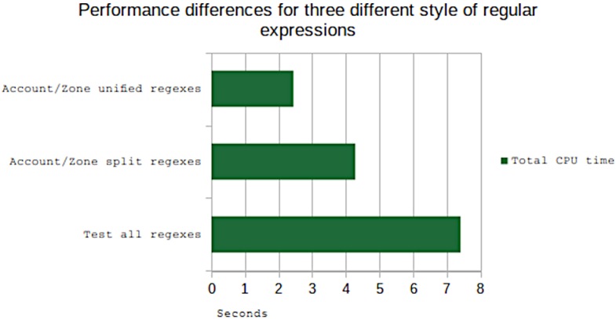

图 11.15 用于根据匹配的正则表达式测试五个日志行示例集的三种技术。顶部栏是最有效的，在尝试使用调整为捕获所有帐户或区域的单一正则表达式进行捕获之前，在字符串的开头使用 `[account]` 或 `[zone]` 进行预测试检查遥测。底部栏是最坏的情况，其中每个日志行都针对每个正则表达式进行测试。

性能再次显着提高！使用统一正则表达式的执行时间为 56%，而不是简单地在前面添加字符串并拆分测试。此外，与针对所有五个正则表达式测试每个日志行的字典模式相比，统一正则表达式的执行时间为 32%。如果你的生产代码和遥测系统在这种程度上使用正则表达式，那么非常值得你花时间进行此处列出的优化。

达到最大改进的状态是一个跨越多个阶段的项目。不幸的是，你的代码库的大小和年龄将决定你需要做多少工作。代码库存在的时间越长，为其做出贡献的工程师越多，你需要研究的自然语言日志记录的细微差异就越多。主要项目阶段是

1. 同意一组前置字符串。
2. 与你的团队同意可正则语法。
3. 更新你的遥测系统以处理前置和非前置日志数据。
4. 将每个前置字符串的统一正则表达式添加到遥测系统中。
5. 将现有的日志排放转换为新语法。
6. 转换所有日志发射后，从遥测系统中删除对旧语法的支持。

让我们进一步深入研究每个阶段。

#### 第 1 阶段：同意一组前置字符串

前面的字符串是上面示例中的 `[account]` 和 `[zone]` ，但你需要查看当前的日志记录语句（由正则表达式检查的语句）以确定哪些常见集合你有。如果你的软件产品很大，则此分析将是一项跨团队的活动。如果你的组织使用设计审核流程，请绝对使用该流程来完成这项工作。

#### 第 2 阶段：与你的团队就可正则语法达成一致

现在你已经有了日志记录组（第一阶段的前置字符串），检查每个组以了解如何重新措辞每个语句以允许单个正则表达式语句。查看日志语句文本和正则表达式复杂性的重新措辞。你可能会发现一些日志语句需要拆分（或组合）才能在建议的语法下工作，这很好，将在稍后阶段修复。

#### 第 3 阶段：更新你的遥测系统以处理预置和非预置的日志数据

你的遥测系统需要在一段时间内处理这两种情况，因此此阶段为处理迁移奠定了基础。在稍后的阶段，你将完全转向仅前置。当你这样做时，现在是评估你将电子邮件地址等私人数据发送到日志流中的位置并停止这样做的好时机。 （有关私人数据和其他受监管数据的更多信息，请参阅第 16 章。）

#### 第 4 阶段：将每个预置字符串的统一正则表达式添加到遥测系统

根据你的项目，此阶段可以与阶段 3 结合使用。具有前置字符串的日志数据将与统一的正则表达式之一进行匹配；未前置的字符串将与当前（低效）处理进行匹配。

#### 第 5 阶段：将现有日志排放转换为新语法

开始将现有日志语句转换为新语法。你可以一次在一个前置字符串、一次一个类中进行此转换 — 无论什么对你有效。在这个过程中你可能会发现你的语法不够复杂。没关系;根据需要更新遥测系统正则表达式，然后继续前进。

#### 第 6 阶段：当所有日志发射都转换后，从遥测系统中删除对旧语法的支持

此阶段是迁移过程的最后一步。当所有日志记录数据都转换为新语法后，请从遥测系统中删除对旧语法的支持。这一阶段使遥测系统的效率稍微提高了一些，因为在处理遥测数据时，需要执行的比较次数会减少。

当这个项目完成并且你的遥测运行得更快时，我希望这个效率项目将为你在组织中赢得足够的声誉，以便你能够推动采用新的遥测模式。正如我们在本节中所做的那样，使用正则表达式来丰富集中式日志记录遥测数据的组织正在解决其遥测系统中的限制。更好的方法不是传递稍后必须解析的单个字符串，而是提供字符串和属性哈希（相关标识符，使用分布式跟踪术语），从而减轻遥测系统的解析负担。字符串

```
“Added account 1411 to zone 42”
```

变成

```
"Added account -- acct_id=1141 zone_id=42"
```

在本例中，日志记录字符串与键值对字符串通过双破折号分隔。 （如果你想阅读更多内容，第 12 章将介绍这种标准编码。）这个字符串很容易分成日志数据和丰富数据，比正则表达式容易得多，并且具有更大的灵活性。祝你好运！

> 练习11.3
>
> 将以下三个日志行重写为可正则语法，并提供与所有三个日志行匹配的正则表达式：
>
> ```
> Converted 0.192 MB pdf file in 0.89 seconds
> Took 1.2 seconds to digitally sign a 0.192 MB pdf file
> Successfully uploaded type:pdf size:0.192 time:0.019
> ```

## 11.5 其他正则表达式资源

本节向你介绍可用于探索一般正则表达式的工具。许多在线工具可用于测试正则表达式。尽管本章中的所有示例都使用 Ruby，但不能保证当你开始修复遥测系统中的正则表达式时，你将使用 Ruby。

- https://regex101.com 为 PHP/Perl、JavaScript、Golang 和 Python 风格的正则表达式提供基于浏览器的体验。 该网站还提供了匹配表达式的视觉指南，并解释了你粘贴的正则表达式的组件。
- https://rubular.com 为 Ruby 风格的正则表达式提供基于浏览器的体验。 如果你本地没有安装 Ruby，并且想了解我的列表中的正则表达式如何工作，这个网站将会提供很大的帮助。
- http://www.regexplanet.com 提供了 Regex101 中未显示的多种语言，例如 .NET、Java 和 Haskel。

如果你想深入了解正则表达式，这些书将会有所帮助：

- 正则表达式简介，作者：Thomas Nield（O’Reilly Media，2019）
- 掌握正则表达式，第 3 版，作者：Jeffrey Friedl（O’Reilly Media，2016 年）
- JavaScript 正则表达式，作者：Loiane Groner 和 Gabriel Manricks（Packt Publishing，2015 年）
- Java 9 正则表达式，作者：Anubhava Srivastava（Packt Publishing，2017 年）

## 概括

- 优化正则表达式的最佳方法是停止使用正则表达式，因为正则表达式是丰富遥测数据的最慢方法。
- 有时，你无法选择使用正则表达式，例如当你重新丰富来自硬件和 SaaS 平台的遥测数据时。
- 在遥测系统中，正则表达式用于控制流（确定将接收哪些处理和路由事件）和丰富流（从遥测数据中提取有用的字段）。
- 正则表达式很难维护，因为性能良好的严格作用域表达式通常比简单表达式复杂得多，从而减少了可以维护它们的人员数量。
- 优化正则表达式的目标是让正则表达式引擎停止尝试匹配不匹配的字符串。你希望尝试快速失败。优化不佳的正则表达式与优化良好的正则表达式之间的性能改进非常显着。
- 对于优化不佳的正则表达式，正则表达式引擎在失败匹配时比在成功匹配时花费更多时间。你希望尽可能避免这种情况。
- Logstash 和 Fluentd 是具有正则表达式支持的开源遥测运输平台。两者都使用 Ruby（以及 Ruby 的正则表达式库）作为基础，尽管 Logstash 正在慢慢转向直接 Java。
- 如果你正在进行整个字符串匹配，则在表达式中添加锚点（字符串开头 ( `^` ）和字符串结尾 ( `$` ) 标记）将为你提供当你为每个事件测试多个正则表达式时，性能会显着提高。
- 如果你总是将字符串与其精确匹配的表达式进行比较，锚点会稍微减慢你的速度。
- 贪婪的正则表达式运算符（ `*` 和 `+` ）将匹配字符串的末尾，并一次后退一个字符，直到找到它要查找的内容。仅当你打算匹配字符串的其余部分时，才使用贪婪运算符（例如 `.*` ）。在这种情况下， `.*$` 明确表达了该意图。
- 惰性运算符 ( `?` ) 修改贪婪运算符以添加字符，直到用完匹配项。像 `.*?` 这样的表达式将匹配零个或多个字符，一次添加一个。当在正则表达式中间使用时，该运算符通常比贪婪版本表现得更好。
- 在尝试更复杂的正则表达式之前使用简单的正则表达式来测试适合性是防止针对不匹配的字符串执行复杂的正则表达式（以及它们带来的测试失败）的有效方法。
- 在捕获表达式中提供明确的长度指导（例如使用 `[a-z]{3,8}` 表示三到八个小写字符）可以减少正则表达式引擎进行的匹配尝试，但可能会因为使正则表达式本身更加复杂而导致匹配速度变慢。
- 重新措辞你的日志记录语句以减少你需要使用的正则表达式的数量也可以大大提高性能。