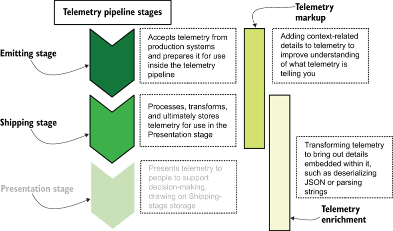

# 12 标准化日志记录和事件格式

本章涵盖

- 结构化记录器的组件
- 在代码中构建对遥测发射格式的支持
- 在运输阶段解析遥测发射格式

本章重点介绍从生产代码发出（和解析）事件。第 2 章大体上是关于发射阶段的，如果你还没有读过，那么这一章就没那么有意义了。标准化集中日志记录和指标发射的遥测格式使你的遥测系统更易于整体维护。建立标准有明显的前期成本——特别是如果你将标准改造到现有的软件组中——但结果应该提供增长的空间。

如果你已阅读第 1 部分，图 12.1 应该很熟悉；它描述了遥测的各个管道阶段以及每个阶段所扮演的角色。我们在本章中讨论的标准在发射阶段进行编码，并在运输阶段进行解码。此编码/解码过程还提供了一个很好的机会，可以添加特定于上下文的详细信息（遥测标记）作为发射阶段工作的一部分，并使从现有遥测（遥测丰富）中提取额外遥测的过程在运输中更加高效。和演示阶段。演示阶段在所有这些标准工作中扮演着次要角色，因为它被动地消耗成品。



图 12.1 日志记录和事件标准涉及的遥测管道阶段。发射和运输阶段通过标准紧密相连，因为这是标准编码（发射）和解码（运输）的地方。此外，遥测标记（特定于上下文的遥测）和遥测丰富（从现有遥测中提取详细信息）的概念在事件标准的构建和实施中发挥着关键作用。演示阶段仅消耗所有这些标准工作的结果。

标准化你的发射格式有很多好处：

- 一套精心编写的标准可以减少你在运输阶段系统中包含正则表达式的需要，这将使你的遥测系统整体更加高效。 （有关正则表达式使用的影响，请参阅第 11 章。）
- 采用结构化日志记录技术（在第 2 章中部分提及，但在第 12.1 节中进行了深入探讨）为你的发射阶段提供了更多关于发送遥测数据的位置并启用多个遥测流的选项。结构化日志发射器允许直接通过 TCP 套接字等新颖通道发送数据，如第 13 章所述。
- 系统地了解日志记录标准为你提供了解决集中式日志记录和指标数据存储中的索引基数问题的工具。第 14 章将深入探讨基数问题的管理。
- 结构化日志格式化程序（第 12.1 节中详细介绍了该主题）是你可以开始使遥测防篡改的地方，从而防止攻击者干预遥测。第 15 章详细探讨了如何使遥测技术能够抵御攻击。
- 通过提供一种系统的方法来添加上下文相关的详细信息（标记）作为发射阶段的一部分，演示阶段中的遥测将更加详细地了解事件发生的时间和方式，从而提高你堵住监管信息泄漏的能力。 （有关数据泄漏后清理的更多信息，请参阅第 16 章。）

标准化日志记录格式是真正强大且高效的遥测管道基础的一部分。为了涵盖这个基础主题，本章分为三个部分：

- 第 12.1 节介绍了什么是结构化日志记录、它的组成部分以及如何构建结构化记录器。
- 第 12.2 节介绍了使用结构化日志记录来实现两个示例日志记录标准。
- 第 12.3 节介绍了使用专用的运输阶段产品 (Logstash) 和通用编程来解码运输阶段的两个示例日志记录标准。

## 12.1 在代码中实现结构化日志记录

本节介绍为生产代码创建标准发出格式以及使用结构化日志记录来支持该标准。结构化日志记录是处理来自应用程序的日志记录数据的系统方法的名称。日志数据可以是集中式日志记录、度量系统的一部分，甚至支持跟踪。第 2 章简要介绍了结构化日志记录。事实上，图 2.3 分解了结构化记录器的组件。该图的一部分在此处复制为图 12.2。


图 12.2 结构化记录器的组件：记录器、格式化程序和编写器。结构化日志记录是大多数现代编程语言的内置功能；如果不是，可以通过模块轻松添加支持。

结构化记录器具有三个组件：

- 记录器，遥测数据进入记录系统的地方。当需要发出遥测数据时，生产代码会调用此对象或函数。
- 格式化程序获取从记录器接收到的遥测数据，并将其转换为遥测系统稍后需要的任何格式。这是建立遥测标准的第一个地方。
- 编写器将格式化的遥测数据发送到遥测管道的下一阶段，甚至可能直接发送到演示阶段系统使用的最终存储。

记录器、格式化程序和编写器这三个名称是结构化记录器主要角色的通用名称；每个结构化日志记录框架都可以将这些角色称为不同的名称。这里重要的概念是三个组成部分。尽管我们在第 2 章和第 3 章中查看了一些日志记录示例，但让我们看一下新的 Python 列表。清单 12.1 为我们提供了一个使用 structlog 模块的基于 Python 的结构化记录器。

> 注意 要运行清单 12.1，你需要安装为 Python 3 编写的 structlog 模块 ( `pip3 install structlog` )。 structlog 模块用于本章中的许多清单。

清单 12.1 使用 structlog 模块进行结构化日志记录的 Python 示例

```python
import logging
import datetime                                    ❶
import sys                                         ❶
import socket                                      ❶
import os                                          ❶
from structlog import (
  get_logger,
  configure,
)
from structlog.stdlib import (
  LoggerFactory,
  BoundLogger,
  add_log_level
)
from structlog.processors import (
  KeyValueRenderer,
  JSONRenderer,
  UnicodeDecoder,
  TimeStamper
)
 
logging.basicConfig(                               ❷
  format="%(message)s",                            ❷
  stream=sys.stdout,                               ❷
  level=logging.INFO,                              ❷
)                                                  ❷
 
__release__ = "0.7.1"
__commit__ = "f0d00b1"
 
configure(
  processors=[
    TimeStamper(fmt="iso"),                        ❸
    UnicodeDecoder(),                              ❸
    add_log_level,                                 ❸
    KeyValueRenderer(key_order=[                   ❸
      'timestamp', 'metric_name',                  ❸
      'metric_type', 'metric_value'])              ❸
  ],                                               ❸
  context_class=dict,
  logger_factory=LoggerFactory(),                  ❹
  wrapper_class=BoundLogger,                       ❺
  cache_logger_on_first_use=False
)
 
logger = get_logger()                              ❻
 
def __add_context(event):                          ❼
  event = event.bind(                              ❼
    hostname=socket.gethostname(),                 ❼
    pid=os.getpid(),                               ❼
    release_id=__release__,                        ❼
    commit=__commit__                              ❼
    )                                              ❼
  return event                                     ❼
 
def __do_metric(metric, value, mtype, metadata):   ❽
  event = logger.bind(                             ❾
    payment_plan=metadata['payment_plan'],         ❾
    metric_name=metric,                            ❾
    metric_value=value,                            ❾
    metric_type=mtype)                             ❾
  event = __add_context(event)                     ❿
  return event 
 
def counter(msg, value, metadata):                 ⓫
  event = __do_metric(msg, value, 'c', metadata)
  event.info()                                     ⓬
 
def timer(msg, value, metadata):
  event = __do_metric(msg, value, 't', metadata)
  event.info()
 
counter('pdf_pages', 3, {'payment_plan': "alpha"})
counter('pdf_pages', 19, {'payment_plan': "thunderdome"})
timer('page_convert_time', 0.92, {'payment_plan': "alpha"})
```

❶ 支持上下文相关遥测的模块

❷ 配置默认的Python记录器发送到stdout

❸ structlog 的格式化程序，添加时间戳并以键值格式结束

❹ 告诉 structlog 使用之前定义的基本记录器进行写入

❺ 告诉 structlog 使用基本记录器类

❻ 实例化structlog；运行配置块

❼ 添加通用上下文相关遥测的内部函数

❽ 计数器和定时器调用的基本指标函数

❾ 从实例化对象创建一个新的记录器对象，添加上下文

❿ 将与上下文相关的静态遥测数据注入到事件中

⓫ 计数器类，从代码中调用

⓬ 导致记录数据发出

清单 12.1 将发送到标准输出（控制台）并生成以下内容：

```
timestamp='2023-02-19T17:47:30.712266Z' metric_name='pdf_pages' 
➥ metric_type='c' metric_value=3 payment_plan='alpha' hostname='k8s-
➥ 14.euc1.prod.internal' pid=32595 release_id='0.7.1' commit='f0d00b1' 
➥ level='info'
timestamp='2023-02-19T17:47:30.712449Z' metric_name='pdf_pages' 
➥ metric_type='c' metric_value=19 payment_plan='thunderdome' hostname='k8s-
➥ 14.euc1.prod.internal' pid=32595 release_id='0.7.1' commit='f0d00b1' 
➥ level='info'
timestamp='2023-02-19T17:47:30.712591Z' metric_name='page_convert_time' 
➥ metric_type='t' metric_value=0.92 payment_plan='alpha' hostname='k8s-
➥ 14.euc1.prod.internal' pid=32595 release_id='0.7.1' commit='f0d00b1' 
➥ level='info'
```

要了解如何从 `counter('pdf_pages',` `3,` `{'payment_plan': "alpha"})` 转到上面的第一行日志，我们必须了解如何添加与上下文相关的遥测以及什么发生在 `configure` `()` 块中的处理器堆栈中。每次调用 `.bind(key=value)` 时，我们最终都会向输出添加另一个键值对。

图 12.3 描绘了我们调用 `counter()` 到创建的日志行之间的执行流程。在此过程中，我们在两个位置向记录器添加键值对，捕获作为 `counter()` 调用一部分提交的值以及添加到所有遥测中的静态信息。当记录器被告知写入信息时，执行将转移到 structlog 中。四个不同的处理器（格式化程序）修改事件哈希，最后一个 `KeyValueRenderer()` 将所有内容转换为充满键值对的单个字符串值。最后，该字符串值被发送到 `LoggerFactory` （编写器），其中该字符串值被发送到控制台。


图 12.3 如何从初始函数调用（顶部虚线框）创建最终日志条目（底部虚线框）。执行栈是从上到下运行的。记录器对象在 `__do_metric()` 中创建，并作为对象传递到 `__add_context()` 中，其中该函数添加更多上下文。执行返回到 `counter()` ，其中对记录器对象调用 `.info` 方法（从 `__do_metric()` 返回）。从那里，日志对象传递三个格式化程序（调用此处的处理器），它添加了 ISO8601 格式的时间戳，确保字符串正确处理 Unicode，并格式化为键值对列表，字符串前面有某些键。最后，这个格式化的字符串被传递给 < b5> ，将字符串写入控制台。

现在，如果我们将 `KeyValueRenderer()` 行替换为 `JSONRenderer()` （一行更改），我们的输出将更改为

```json
{
    "payment_plan": "alpha",
    "metric_name": "pdf_pages",
    "metric_value": 3,
    "metric_type": "c",
    "hostname": "k8s-14.euc1.prod.internal",
    "pid": 2371,
    "release_id": "0.7.1",
    "commit": "f0d00b1",
    "timestamp": "2023-02-19T17: 47: 30.712266Z",
    "level": "info"
}
```

Python 的 structlog 模块支持开箱即用的键值和 JSON。 structlog 支持构建你自己的处理器（格式化程序），我们将在第 12.2 节中深入研究该过程。这段代码直接发送到控制台，但它不是必须的；使用内置的 Python 记录器作为日志发射器意味着我们可以发送到 Syslog、Windows 事件日志和许多其他地方。

尽管我在这里使用 Python 作为具体示例来教授这些概念，但请记住其他编程语言也支持结构化日志记录。本书的 git 存储库包含我的 Python 清单的 Java 版本。有些语言有多个扩展来支持结构化日志记录！以下是语言及其结构化日志记录选项的非详尽列表：

- Python—structlog 模块 ( https://www.structlog.org/en/stable)
- Ruby — twp/logging gem ( https://github.com/twp/logging)
- PHP——Monolog 模块 ( https://github.com/Seldaek/monolog )
- NodeJS - Winston ( https://github.com/winstonjs/winston) 和 Bunyan ( https://github.com/trentm/node-bunyan) 模块
- Java—log4j 2 框架 (https://logging.apache.org/log4j/2.x)
- Go—Zerolog (https://github.com/rs/zerolog) 和 Zap (https://github.com/uber-go/zap) 模块
- .NET Core—内置 ILogger（http://mng.bz/n2Jd 第 17 章）
- Rust——Slog 模块 (https://docs.rs/crate/slog)

## 12.2 在代码中实施标准

第 12.1 节介绍了结构化日志记录，而本节则是关于将遥测标准写入结构化日志记录系统。我在第 4.2 节中谈到了在技术组织内协商标准，因此我建议在那里查找有关如何选择标准的更长时间的讨论。遥测格式标准不是必需的，但它们使你作为遥测系统操作员的工作变得更加容易。简单来说：

- 你可以支持多个遥测标准；人们使用一种标准比只使用一个真正的标准更重要。此外，某些格式比其他格式更容易用特定的编程语言实现，因此有多个标准可供选择将阻止人们以难以支持的方式进行即兴创作。
- 对象编码格式（JSON、YAML 和 XML）的用途非常广泛，并且自 2010 年以来 JSON 解析得到了彻底的优化。即便如此，CSV 和键值等分隔格式在算法上也更简单。在选择格式时一定要测试解析速度以验证你的性能假设。
- 选择遥测格式标准的过程不仅与支持生产技术系统的人员有关，也与实际技术系统本身有关。有时，最佳的技术解决方案并不是最佳的政治解决方案。这个协商过程就是我鼓励支持多种格式的原因。

当你有了标准后，就可以在你的生产代码中（以及你的运输阶段，但我们将在第 12.3 节中介绍）中构建对它们的支持。我们将扩展清单 12.1 中构建的结构化记录器来讨论这些概念。清单 12.1 将键值对发送到标准输出，作为指标记录器的一部分，但我们还将考虑修改该基础以使其成为集中式日志记录的一部分。首先，我们需要检查清单 12.1 中处理器的角色。

```python
 processors=[
    TimeStamper(fmt="iso"),
    UnicodeDecoder(),
    add_log_level,
    KeyValueRenderer(key_order=[
      'timestamp', 'metric_name',
      'metric_type', 'metric_value'])
  ],
```

正如我们在图 12.3 中看到的，这个有序列表描述了我们的指标遥测所经历的转换顺序：

1. `TimeStamper` - 使用 ISO 格式 (ISO8601) 将时间戳值添加到遥测数据中
2. `UnicodeDecoder` — 将遥测中的字符串转换为统一
3. `add_log_level` - 将日志记录级别（调试、信息、警告、错误、严重等）添加到遥测中
4. `KeyValueRenderer` — 将遥测的一维哈希转换为单个字符串，采用键值格式，四个键按顺序排列在字符串的开头

这里的最后一个值 `KeyValueRenderer` 编码了该函数编写时所依据的指标标准：

```
timestamp='2023-02-19T17:47:30.712266Z' metric_name='pdf_pages' 
➥ metric_type='c' metric_value=3 payment_plan='alpha' hostname='k8s-
➥ 14.euc1.prod.internal' pid=32595 release_id='0.7.1' commit='f0d00b1' 
➥ level='info'
```

将这一行替换为 `JSONRenderer` 即可为我们提供 JSON 编码的遥测数据：

```json
{
    "payment_plan": "alpha",
    "metric_name": "pdf_pages",
    "metric_value": 3,
    "metric_type": "c",
    "hostname": "k8s-14.euc1.prod.internal",
    "pid": 32595,
    "release_id": "0.7.1",
    "commit": "f0d00b1",
    "timestamp": "2023-02-19T17:47:30.712266Z",
    "level": "info"
}
```

对于指标发射器来说，这两种格式都相当完整。它有一个带有值的指标名称，并且与上下文相关的详细信息与指标一起打包。然而，与上下文相关的细节是静态的。我们如何更新清单 12.1 以容纳可选的上下文散列，以便也随指标一起发出？现在，指标是通过如下调用发出的：

```python
counter('pdf_pages', 3, {'payment_plan': "alpha",'account_id': "1121"})
```

元数据的哈希值是第三个参数，它由日志记录函数（例如清单 12.1 中的函数）使用。在清单 12.1 的情况下，只有 `payment_plan` 从元数据哈希中提取并发出；其他的，例如 `release_id` ，是为所有内容发出的一组静态详细信息。让我们重写清单 12.1，以便调用我们的指标函数的人可以指定 `metadata` 哈希中的哪些字段包含在其指标中，如下所示：

```python
context_fields = ['payment_plan', 'account_id', 'region', 'datacenter']
counter('pdf_pages', 3, metadata, context_fields)
```

首先，我们的 `counter()` 函数的定义需要重写

```python
def counter(msg, value, metadata):
```

到一个可以处理额外参数的版本，并且元数据是可选的（在清单 12.1 中是强制性的）：

```python
def counter(msg, value, metadata = [], fields = []):
```

另外，因为 `counter()` 是 `__do_metric()` 的包装器，我们还需要重写该函数的定义，从

```python
def __do_metric(metric, value, mtype, metadata):
```

到

```python
def __do_metric(metric, value, mtype, metadata = [], fields = []):
```

现在我们已经进入了 `__do_metric()` ，我们需要更新其中的逻辑来处理变量字段。原始版本仅从 `metadata` 哈希静态分配单个值：

```python
def __do_metric(metric, value, mtype, metadata):
    event = logger.bind(
        payment_plan=metadata['payment_plan'],
        metric_name=metric,
        metric_value=value,
        metric_type=mtype)
    event = __add_context(event)J
    return event
```

我们的新版本需要根据 `fields` 数组中传入的内容从 `metadata` 哈希添加变量遥测。在这里，我们循环遍历传入的 `fields` ，如果 `metadata` 哈希具有任何字段，它们将作为上下文添加。清单 12.2 显示了清单 12.1 中重写的 `__do_metric` 函数，但所有其他代码保持不变。

清单 12.2 修改 `__do_metric` 以接受变量遥测

```python
[...]
def __do_metric(metric, value, mtype, metadata = [], fields = []):
  event = logger.bind(
    metric_name=metric,
    metric_value=value,
    metric_type=mtype)
  context_fields = {}                         ❶
  for f in fields:                            ❷
    if f in metadata:                         ❷
      context_fields[f]=metadata[f]           ❷
 
  event = event.bind(**context_fields)        ❸
  event = __add_context(event)
  return event
```

❶ 创建一个空的 context_fields 哈希来填充

❷ 循环字段并将任何匹配的元数据值添加到 context_fields

❸ 将 context_fields 应用于遥测

现在我们已经更新了 `__do_metric()` ，我们应该能够看到遥测处理发生了怎样的变化。让我们看看当我们向修订后的指标记录器输入以下调用时会得到什么：

```python
metadata1 = {'payment_plan': 'alpha', 'account_id': '1121'}
metadata2 = {'payment_plan': 'thunderdome', 'account_id': '23b9c1'}
metadata3 = {'payment_plan': 'skyfall', 'account_id': 'a3953021'}
 
counter('pdf_pages', 3, metadata1, ['payment_plan'])
counter('pdf_pages', 19, metadata2, ['payment_plan', 'account_id'])
timer('page_convert_time', 0.92, metadata3, ['account_id'])
timer('page_convert_time', 1.22)
```

四个不同的调用，每个调用指定略有不同的字段。对 `timer()` 的最后一次调用根本没有指定任何遥测数据，因此该调用发出的遥测数据不应具有 `payment_plan` 或 `account_id` 。为了提供帮助，我将发出的可变遥测字段加粗：

```
timestamp='2020-09-24T00:43:37.659549Z' metric_name='pdf_pages' 
➥ metric_type='c' metric_value=3 payment_plan='alpha' hostname='k8s-
➥ 14.euc1.prod.internal' pid=19661 release_id='0.7.1' commit='f0d00b1' 
➥ level='info'
timestamp='2023-02-19T00:43:37.659707Z' metric_name='pdf_pages' 
➥ metric_type='c' metric_value=19 payment_plan='thunderdome' 
➥ account_id='23b9c1' hostname='k8s-14.euc1.prod.internal' pid=19661 
➥ release_id='0.7.1' commit='f0d00b1' level='info'
timestamp='2023-02-19T00:43:37.659833Z' metric_name='page_convert_time' 
➥ metric_type='t' metric_value=0.92 account_id='a3953021' hostname='k8s-
➥ 14.euc1.prod.internal' pid=19661 release_id='0.7.1' commit='f0d00b1' 
➥ level='info'
timestamp='2023-02-19T00:43:37.659954Z' metric_name='page_convert_time' 
➥ metric_type='t' metric_value=1.22 hostname='k8s-14.euc1.prod.internal' 
➥ pid=19661 release_id='0.7.1' commit='f0d00b1' level='info'
```

成功！现在，软件工程师可以向他们的指标添加任意上下文！赋权！

我们如何将其重写为通用记录器而不是指标发射器？首先，我们需要删除 `counter()` 和 `timer()` 的函数定义，因为我们不再需要它们了。取而代之的是，我们需要添加新函数来处理不同的日志级别，但我们希望保留软件工程师可以向他们创建的每个日志添加自定义上下文的想法：

```python
def counter(msg, value, metadata = [], fields = []):
  [...]
 
def timer(msg, value, metadata = [], fields = []):
  [...]
 
def info(event, metadata=[], fields=[]):
  [...]
 
def warning(event, metadata=[], fields=[]):
  [...]
 
def error(event, metadata=[], fields=[]):
  [...]
```

这为我们提供了三种不同的日志级别来向应用程序的其余部分公开：信息、警告和错误。我们仍然使用指标记录器中相同的任意上下文方法，接受哈希值和哈希值中的字段列表作为这些函数的参数。我们想要的是接受这样的输入

```python
metadata = {
    'account_id': '1515323',
    'payment_plan': 'Enterprise Plus',
    'region': 'euc1',
    'feature_flags': { 'new_login': True, 'new_profile': False }
}
 
info("Profile image updated", metadata, ["account_id", "feature_flags"])
```

并将其转换为如下所示的 JSON 哈希，其中动态上下文以粗体显示：

```json
{
    "hostname": "k8s-14.euc1.prod.internal",
    "pid": 23030,
    "release": "0.7.1",
    "commit": "f0d00b1",
    "account_id": "1515323",
    "feature_flags": {
        "new_login": true,
        "new_profile": false
    },
    "event": "Profile image updated",
    "timestamp": "2023-02-19T14:41:22.918238Z",
    "level": "info"
}
```

清单 12.3 显示了为实现此目的而对清单 12.2 所做的更改。

清单 12.3 允许添加任意上下文相关遥测的通用记录器

```python
[...]
configure(
  processors=[
    TimeStamper(fmt="iso"),
    UnicodeDecoder(),
    add_log_level,
    JSONRenderer(),
  ],
  context_class=dict,
  logger_factory=LoggerFactory(),
  wrapper_class=BoundLogger,
  cache_logger_on_first_use=False
)
 
logger = get_logger()
 
def __add_context():                                      ❶
  context = {
    'hostname': socket.gethostname(),
    'pid': os.getpid(),
    'release': __release__,
    'commit': __commit__
  }
  return context
 
def __filter_metadata(metadata, fields):                  ❷
  fcontext = {}                                           ❷
  for f in fields:                                        ❷
    if f in metadata:                                     ❷
      fcontext[f] = metadata[f]                           ❷
 
  return fcontext
 
def __merge_context(metadata, fields):                    ❸
  base_context = __add_context()
  filter_context = __filter_metadata(metadata, fields)
  merged_context = {**base_context, **filter_context}     ❹
  return merged_context
 
def info(eventdata, metadata=[], fields=[]):
  event = logger.bind(**__merge_context(metadata, fields))    ❺
  event.info(eventdata)                                   ❻
 
def warning(eventdata, metadata=[], fields=[]):
  event = logger.bind(**__merge_context(metadata, fields))
  event.warning(eventdata)
 
def error(eventdata, metadata=[], fields=[]):
  event = logger.bind(**__merge_context(metadata, fields))
  event.error(eventdata)
```

❶ __add_context() 与清单 12.1 和 12.1 相比没有变化。

❷ 从元数据哈希中提取请求的字段并以新哈希返回它们

❸ 将从 _add_context() 获取的上下文合并到从 __filter_metadata() 获取的上下文

❹ 合并两个哈希值

❺ 将所有上下文绑定到新的记录器

❻ 在“信息”级别发出事件，并在前一行中添加上下文

我们来看看遥测执行流程，如图 12.4 所示。


图 12.4 清单 12.4 中的执行流程，一个具有三个优先级的记录器函数，可接受任意上下文相关的遥测数据。我们的元数据哈希和字段列表作为 `__add_context` 的一部分进行处理，我们在最终的 JSON 中看到了这一点。

图 12.4 显示了执行如何流经堆栈以及如何收集与上下文相关的遥测数据。当上下文添加到日志记录对象时，发出的字符串 `"Profile` `image` `uploaded"` 通过四个处理器运行。最终的 `JSONRenderer` 处理器将遥测数据和上下文相关的遥测数据格式化为 JSON 哈希，并通过 `LoggerFactory()` 发送到标准输出。

到目前为止，我们已经看到了标准的键值和 JSON 格式的遥测，但由于每个参与者的技术（和政治）要求，标准协商过程有时会产生奇怪的结果。我们将要讨论的下一种格式就是这种平衡行为的产物。让我们看一个示例，使用与上面所示相同的输入，但采用新格式，将时间戳和记录的语句放在 JSON 字符串之外：

```
2023-02-19T14:41:22.918238Z Profile image updated -- {"hostname": "k8s-
➥ 14.euc1.prod.internal", "pid": 23030, "release": "0.7.1", "commit": 
➥ "f0d00b1",  "account_id": "1515323", "feature_flags": {"new_login": true, 
➥ "new_profile": false}, "level": "info"}
```

从表面上看，它非常清楚：一个时间戳，后跟简单语言的日志语句、双破折号，然后是用于任何其他上下文的 JSON 数据结构。如果你的编程语言未针对 JSON 进行优化，那么像这样的奇怪格式就很有意义；初始时间戳和日志行反映了该组织中集中式日志记录的状态，直到最近为止，并且受到任何可以构建字符串的东西的良好支持。

在这种情况下，我们不能使用 `KeyValueRenderer` 或 `JSONRenderer` ，因此我们需要制作一个自定义处理器。为此，我们创建一个类，如清单 12.4 所示。我们将此文件命名为 `internalrenderer.py` 以方便在其他代码中导入。

清单 12.4 为 Python structlog 创建自定义处理器类

```python
import json
 
class InternalRenderer(object):
 
  def __init__(self, serializer=json.dumps):       ❶
    self._dumps = serializer                       ❷
 
  def __call__(self, logger, name, event_dict):    ❸
    timestamp = event_dict.pop('timestamp')        ❹
    event = event_dict.pop('event')                ❹
    context_json = self._dumps(event_dict)         ❺
    return timestamp + " " + event + " -- " + context_json   ❻
```

❶ \_\_init\_\_ 在configure() 块中被调用。

❷ 如果需要，这允许更改 JSON 序列化方法。

❸ 每当遥测数据发出时，都会调用 \_\_call\_\_ 。

❹ 提取时间戳和事件哈希条目，以便它们不包含在 JSON 部分中

❺ 构建发射的 JSON 部分

❻ 渲染整个字符串的排放

这个类有两个功能。第一个函数 `__init__()` 在 `configure()` 块中调用，该块定义了记录器的所有处理器。我们的函数可以接受另一个 JSON 序列化器的名称，以防内置序列化器由于某种原因不够好。这将作为 `configure()` 块的一部分完成。

每当遥测准备好发出时，就会调用第二个函数 `__call__()` 。此函数格式化发出的遥测数据，并且是我们内部标准格式的编码地方。图 12.5 显示了新的 `InternalRenderer` 类如何与我们在本章中构建的日志框架交互。


图 12.5 在遥测工作流程中如何调用新的 `InternalRenderer` 类。 `__init__()` 函数在 `configure()` 块期间调用，接近程序第一次启动时。每当发出遥测数据时都会调用 `__call__()` 函数并执行最终格式化。这种提前创建/延迟调用的过程很常见。

清单 12.5 更新了清单 12.3 以使用 `InternalRenderer` 而不是 `JSONRenderer` 。要在本地运行此清单，请将清单 12.4 中的代码放入名为 `internalrenderer.py` 的文件中以获取我们的自定义格式化程序。

清单 12.5 更新清单 12.3 代码以使用 `InternalRenderer`

```python
import logging
import datetime
import sys
import socket
import os
from internalrenderer import (InternalRenderer)   ❶
from structlog import (
  get_logger,
  configure,
)
[...]
configure(
  processors=[
    TimeStamper(fmt="iso"),
    UnicodeDecoder(),
    add_log_level,
    InternalRenderer(),                           ❷
  ],
  context_class=dict,
  logger_factory=LoggerFactory(),
  wrapper_class=BoundLogger,
  cache_logger_on_first_use=False
)
[...]
```

❶ 将我们的自定义类导入此范围

❷ 定义我们的InternalRenderer作为最终处理器，实现我们的标准格式

清单 12.5 不需要进行太多更新即可使用清单 12.4 中的 `InternalRenderer` ，仅需要额外的两行。通过这些更改，我们得到了所需的遥测发射：

```
2023-02-19T14:41:22.918238Z Profile image updated -- {"hostname": "k8s-
➥ 14.euc1.prod.internal", "pid": 23030, "release": "0.7.1", "commit": 
➥ "f0d00b1",  "account_id": "1515323", "feature_flags": {"new_login": true, 
➥ "new_profile": false}, "level": "info"} 
```

> Python 只是一个例子；考虑更大的前景
>
> 我使用 Python 来深入探讨结构化日志记录和标准，因为这就是我在本书的大部分内容中使用的。这些概念并不是 Python 所独有的。第 12.1 节末尾提供了各种语言的结构化日志框架的缩写列表。如果 Python 不是你的选择，我希望这些框架之一适合你。请记住结构化日志记录的基本组件：
>
> - 记录器 - 从生产代码进入结构化记录器的入口点。在所有这些示例中，它都是我们清单中的函数定义。
> - 格式化程序 - 修改遥测数据以使其为运输阶段做好准备。在所有这些示例中，这是 `configure()` 块中的 `processors` 列表。所有良好的结构化记录器都有一个等效的记录器。
> - 写入器 - 将完全格式化的遥测数据发送到发送阶段。在这些示例中，这是 structlog 位于其之上并直接发送到标准输出的基本 Python 记录器。
>
> 如果你不编写 Python，请考虑查找你更熟悉的语言的结构化记录器，并查看是否可以构建与我在此展示的功能等效的功能。

> 练习12.1
>
> 前两个清单演示了如何向我们的结构化记录器添加新的格式化程序（处理器）。清单 12.3 显示了将上下文添加到我们的遥测中，作为记录器的一部分（遥测的入口点）。你将如何重写列表以使用格式化程序来执行上下文添加，而不是将其作为记录器的一部分来执行？

到目前为止，我们只发送到标准输出。运送到更直接的地方（例如队列）怎么样？ structlog 模块位于基本 Python 记录器之上，如清单 12.1 和 12.5 开头所示：

```python
logging.basicConfig(
    format="%(message)s",
    stream=sys.stdout,
    level=logging.INFO,
)
```

碰巧，我们在第 3 章中研究了几种将数据传送到有用位置的方法。现在，让我们重点关注将遥测数据发送到基于 Redis (https://redis.io) 队列所需的更改。尽管 Python 中的基本日志记录模块未附带 `RedisHandler` 或等效项，但 `RedisListHandler` 扩展可作为模块使用 ( https://github.com/lobziik/rlog ) 。我们可以使用这个模块来更新我们的记录器以发送到 Redis 列表。

> 注意 要编译此清单，你需要安装 rlog 模块 ( `pip3 install rlog` )。为了发挥作用，此清单需要一个 Redis 服务器，我不希望你设置该服务器。此实现是一个示例。

清单 12.6 更新我们的记录器以发送到基于 Redis 的列表

```python
[...]
from rlog import RedisListHandler              ❶
[...]
redis_config = {                               ❷
  'host': 'logqueue.euc1.prod.internal',       ❷
  'port': 6379,                                ❷
}                                              ❷
 
logging.basicConfig(
  format="%(message)s",
  handlers=[                                   ❸
    RedisListHandler(key='central_queue',      ❸
    **redis_config)                             ❸
  ],                                           ❸
  level=logging.INFO,
)
[...]
```

❶ 从其模块中导入我们需要的RedisListHandler

❷ 配置RedisListHandler需要Hash并告诉它去哪里找到Redis服务器

❸ 配置 RedisListHandler 以告诉它要发送到哪个键并提供配置哈希

我们在清单 12.6 中看到，我们正在用新的 `RedisListHandler()` 替换 `stream=sys.stdout` ，这是我们在整个脚本中进行的唯一配置更改。通过这一更改，我们一直发送到标准输出的遥测数据将被发送到 Redis 列表。

图 12.6 显示了我们在基本 Python 记录器中使用 `RedisListHandler` 时的遥测流程。我们看到遥测数据正在网络上流动，而不是发送到标准输出，希望其他东西配置为接收该流并将其发送到有用的地方。


图 12.6 我们的指标记录器发送到基于 Redis 的列表而不是标准输出。内置 Python 记录器已更新为使用 `RedisListHandler` 而不是 `sys.stdout` 。此更改的效果是将日志记录重定向到新位置：通过 TCP 连接到 Redis 服务器。像这样的架构将在第 3 章中讨论，但是将遥测从生产代码本身内部移动到远程位置意味着需要与生产代码竞争资源的遥测系统组件更少。

在通过标准输出本地发送（需要另一个遥测系统将遥测数据进一步移入管道）和远程发送到队列、流或 API 之间需要进行权衡。第 2 章和第 3 章广泛讨论了该主题，但简要介绍如下：

- 本地发送（例如发送到文件或标准输出）对于生产代码本身来说既简单又轻量。这种便利的代价是需要额外的运输阶段系统，例如 Fluentd 或 Elastic 的 Filebeat 或 Journalbeat，来接收本地遥测数据并继续运输。
- 远程发送（例如发送到队列、流或 API）意味着遥测数据在生成它的机器上花费的时间最少，从而使攻击者有更少的时间来修改它。使用此方法时，你不需要在本地使用其他软件来移动遥测数据。但生产代码必须能够以本地排放无法处理的方式处理遥测网络和服务中断，这会增加代码的复杂性。

现在我们已经了解了整个结构化记录器，你可以使用它做更多的事情，而不仅仅是实现你的日志记录标准：

- 深入研究直接从盒子中发出，就像我们对 Redis 所做的那样。第 13 章介绍了技术。
- 如果你非常关心遥测数据的完整性，为什么不构建一个格式化程序（前面示例中的处理器）来计算关键字段的校验和并将它们与遥测数据一起发送？第 15 章介绍了遥测完整性。
- 如果你正在处理个人身份信息 (PII) 或电子个人健康信息 (ePHI) 等受监管信息，结构化记录器是你的第一道防御点，可防止此类受监管数据进入你的遥测管道。构建一个格式化程序，可以自动编辑（或彻底拒绝）受监管的遥测字段，例如电子邮件或诊断代码。作为发射阶段的一部分这样做将帮助你避免第 16 章中提出的问题：当此类受监管的信息泄露时该怎么办。
- 异常是包含受管制信息的风险最高的字符串之一，因为它们通常包含传递给失败函数的参数值。考虑为异常日志构建第二个结构化记录器，它比常规的集中式日志记录流量进行更彻底的清理。

> 练习12.2
>
> 在你日常生活中使用的软件中，如何跟踪异常情况？你现有的日志系统将如何处理它们？根据你在这里学到的知识，通过新路径处理异常需要做多少工作？

## 12.3 运输阶段执行标准

本节是关于解析我们在 12.2 节中发出的遥测数据并查看它在运输阶段的样子。在大多数现代语言中，解析 JSON 等标准格式是一种本机的一步操作，并且所有开源 Shipping-stage 系统都有简单的方法来解析它：

- 使用 Fluentd， `<parse> @type json </parse>` 将完成输入工作。
- 使用 Logstash，你只需在输入上使用 `codec => json` 即可。
- 对于 Filebeat，它读取日志文件，并且不是像前两个那样的通用运输阶段包，使用 `decode_json_fields` 处理器将在继续遥测之前执行解析。

更有趣的是非 JSON 格式以及如何为它们构建解析器。我们将研究解析键值格式的遥测数据（如清单 12.1 发出的内容）以及我们在第 12.2 节中构建的自定义格式（清单 12.4 和 12.5）。我们将研究像 Logstash 这样的专用运输阶段框架和解析这些格式的通用编程方法。提醒一下，我们在第 12.2 节中构建的自定义格式对于集中式日志记录如下所示：

```
2023-02-19T14:41:22.918238Z Profile image updated -- {"hostname": "k8s-
➥ 14.euc1.prod.internal", "pid": 23030, "release": "0.7.1", "commit": 
➥ "f0d00b1",  "account_id": "1515323", "feature_flags": {"new_login": true, 
➥ "new_profile": false}, "level": "info"}
```

格式是 ISO8601 格式的时间戳，后跟纯文本字符串、双破折号和 JSON 数据结构。指标发射器的键值版本如下所示：

```
timestamp='2023-02-19T14:41:22.918238Z' metric_name='pdf_pages' 
➥ metric_type='c' metric_value=3 payment_plan='alpha' hostname='k8s-
➥ 14.euc1.prod.internal' pid=19661 release_id='0.7.1' commit='f0d00b1' 
➥ level='info'
```

首先，我们将了解自定义格式以及使用 Logstash 进行解析会是什么样子。 Logstash 是 Elastic.co 推出的一个开源、专用的 Shipping-stage 框架，最出名的是 ELK Stack 中的 L（另外两个字母代表 Elasticsearch 和 Kibana）。 Logstash 是用 JRuby（它最初是一个 Ruby 平台）和 Java 的组合编写的，并且正在慢慢转向直接的 Java 实现。

清单 12.7 是一个完整的 Logstash 配置文件，它将测试解析我们的标准格式字符串。如果你想自己运行它，请确保更改 `file{}` 输出中的 `path =>` 值以适合你的系统。

清单 12.7 使用 Logstash 解析标准格式

```
input {
  generator {                                           ❶
    message => '2023-02-19T14:41:22.918238Z Profile 
➥ image updated -- {"hostname": 
➥ "k8s-14.euc1.prod.internal", "pid": 23030, 
➥ "release": "0.7.1",  "commit": "f0d00b1",  
➥ "account_id": "1515323", "feature_flags": 
➥ {"new_login": true, "new_profile": false}, 
➥ "level": "info"}'                                   ❷
    count => 10                                        ❸
  }
}
 
filter {
  if [message] =~ / -- / {                             ❹
    dissect {                                          ❺
      mapping => {                                     ❺
        "message" => "%{plain_part} -- %{json_part}"   ❺
      }                                                ❺
      remove_field => [ "message" ]                    ❺
    }                                                  ❺
  } else {
    mutate {                                           ❻
      copy => {                                        ❻
        "message" => "plain_part"                      ❻
      }                                                ❻
      add_field => {                                   ❼
        "json_part" => ""                              ❼
      }                                                ❼
      remove_field => [ "message" ]
    }
  }
 
  dissect {                                            ❽
    mapping => {                                       ❽
      "plain_part" => "%{timestamp} %{event}"          ❽
    }                                                  ❽
    remove_field => [ "plain_part" ]                   ❽
  }                                                    ❽
 
  json {                                               ❾
    source => "json_part"                              ❾
    remove_field => [ "json_part" ]                    ❾
  }                                                    ❾
 
  date { match => [ "timestamp", "ISO8601" ] }         ❿
}
 
output {
  file {
    path => "/tmp/standard-format.log"
    codec => json_lines{}
  }
}
```

❶ 生成测试字符串，以便我们可以测试解析

❷ 我们的测试字符串

❸ Generator{} 输入生成字符串的次数

❹ 确保我们在字符串上运行正确的字段分割器

❺ 将字符串拆分为plain_part和json_part；稍后会进一步解析

❻ 如果我们不进行字段分割，请将消息字段重命名为 plain_part。

❼ 将 json_part 字段设置为空，这样后面的解析器就不会因缺少字段而崩溃

❽ 将 plain_part 字段分解为时间戳和事件文本，完成后删除 plain_part 字段。

❾ 解析 json_part 字段，完成后删除 json_part 字段。

❿ 解析时间戳字段，将事件日期更改为字符串中的日期。

正如所写的，清单 12.7 中的代码将创建一个包含十行 JSON 分隔字符串的文件。输出应如下所示（ `sequence` 和 `@timestamp` 字段由 Logstash 内部添加）：

```
{"sequence":0,"feature_flags":{"new_login":true,"new_profile":false},"commit"
➥ :"f0d00b1","level":"info","@version":"1","@timestamp":"2023-02-
➥ 19T14:41:22.918Z","pid":23030,"account_id":"1515323","hostname":"k8s-
➥ 14.euc1.prod.internal","release":"0.7.1","event":"Profile image 
➥ updated","timestamp":"2023-02-19T14:41:22.918238Z"}
{"sequence":1,"feature_flags":{"new_login":true,"new_profile":false},"commit"
➥ :"f0d00b1","level":"info","@version":"1","@timestamp":"2023-02-
➥ 19T14:41:22.918Z","pid":23030,"account_id":"1515323","hostname":"k8s-
➥ 14.euc1.prod.internal","release":"0.7.1","event":"Profile image 
➥ updated","timestamp":"2023-02-19T14:41:22.918238Z"}
```

我们使用一个名为 `dissect {}` 的过滤器来分解字符串。 Dissect 使用分隔符从字符串中提取字段，这使得它比正则表达式更快，但灵活性也较差。这就是为什么 `if` `[message]` `=~` `/` `--` `/` `{` `{}` 之前存在分隔符。第一个 `dissect` `{}` 创建我们稍后将使用的 `plain_part` 和 `json_part` 字段。如果条件失败，我们只需将消息字段重命名为 `plain_part` 并为 `json_part` 设置空白值。第二个 `dissect` `{}` 将 `plain_part` 字段分解为 `timestamp` 和 `event` 字段。

之后，我们使用 `json {}` 过滤器解析 `json_part` 字段，使用 `date` `{}` 过滤器解析 `timestamp` 字段。过滤器，我们就完成了解析！我们以 `output` `{}` 部分结束，将完全解析的事件发送到有趣的地方（在本例中为文件）。图 12.7 描绘了这个执行流程。


图 12.7 清单 12.7 的 Logstash 解析流程。第一步是确定我们是否需要使用 `dissect {}` 还是 `mutate {} on` 字符串。第二步创建 `plain_part` 和 `json_part` 字段。第三部分解析 `plain_part` 字段以创建时间戳和事件字段。第四部分解析 `json_part` 字段以将编码字段添加到对象中。第五部分解析 `timestamp` 字段，将对象的时间戳设置为事件的时间戳。最后，我们移动到 `output {}` 块，将解析后的对象发送到有趣的地方。这个解析器编写起来相对较小，并且对于 Logstash 新手来说很容易理解——这是一个关键的可维护性功能。

现在我们已经了解了 Logstash 如何解析字符串，让我们看一下 Python 解析器。清单 12.8 显示了一个完整的 Python 解析器，它接受我们的测试字符串并发出一个 JSON 块，以便在 Shipping 阶段的其他地方使用。执行流程与Logstash版本类似。

清单 12.8 使用直接的 Python 解析我们的日志标准遥测数据

```python
import json
 
test_string = '2023-02-19T14:41:22.918238Z Profile image updated -- 
➥ {"hostname": "k8s-14.euc1.prod.internal", "pid": 23030, "release": 
➥ "0.7.1", "commit":  "f0d00b1",  "account_id": "1515323", "feature_flags":
➥ {"new_login":  true, "new_profile": false}, "level": "info"}'
 
if ' -- ' in test_string:                                  ❶
  plain_part, json_part = test_string.split(' -- ', 1)     ❷
else:
  plain_part = test_string                                 ❸
  json_part = ''                                           ❸
 
timestamp, event = plain_part.split(' ', 1)                ❹
fields = json.loads(json_part)                             ❺
fields['event'] = event                                    ❻
fields['timestamp'] = timestamp                            ❻
print(json.dumps(fields))
```

❶ 如果我们的分隔符字符串存在，则会改变我们解析字符串的方式

❷ 在第一次出现“--”时分割字符串，分配 plain_part 和 json_part

❸ 如果我们的分隔符字符串不存在，则将 plain_ 部分指定为整个字符串，并将 json_part 指定为空

❹ 通过 plain_part 中的第一个空格将 plain_part 拆分为时间戳和事件变量

❺ 解析我们的 json_part 以创建字段哈希

❻ 将事件和 json 变量添加到字段哈希中

清单 12.8 中的执行流程与图 12.7 和清单 12.7 中所示类似。此处 `dissect {}` 在 Logstash 中扮演的角色由 `.split(pattern, 1)` 担任。唯一缺少的步骤是解析 `timestamp` 字段，因为 Logstash 保留了一个单独的 `@timestamp` 字段，该字段被认为是事件的权威；我们这里没有 `@timestamp` ，因此我们可以安全地避免日期解析。

> 练习12.3
>
> 我们已经看到了为这种日志标准格式构建解析器的两个版本。你将如何用你选择的语言为此标准构建解析器？请记住，它需要处理“ `--` ”不在字符串中的情况。
>
> ```
> 2023-02-19T14:41:22.918238Z Profile image updated -- {"hostname": "k8s-
> ➥ 14.euc1.prod.internal", "pid": 23030, "release": "0.7.1", "commit": 
> ➥ "f0d00b1",  "account_id": "1515323", "feature_flags": {"new_login": true, 
> ➥ "new_profile": false}, "level": "info"}
> ```

接下来，我们将查看遥测的键值版本，如上面我们的指标记录器中所示。提醒一下，它是这样的：

```
timestamp='2023-02-19T14:41:22.659549Z' metric_name='pdf_pages' 
➥ metric_type='c' metric_value=3 payment_plan='alpha' hostname='k8s-
➥ 14.euc1.prod.internal' pid=19661 release_id='0.7.1' commit='f0d00b1' 
➥ level='info'
```

Logstash 有一个用于键值格式遥测的本机过滤器，因此我们在构建支持这种方式格式化的遥测的 Logstash 配置文件时可以采取更少的步骤。清单 12.9 显示了一个完整的 Logstash 管道配置，它将测试我们的遥测和解析。

清单 12.9 使用 Logstash 解析键值格式的遥测数据

```
input {
  generator {
    message => "timestamp='2023-02-19T14:41:22.659549Z' 
➥ metric_name='pdf_pages' metric_type='c' metric_value=3 
➥ payment_plan='alpha'  hostname='k8s-14.euc1.prod.internal' 
➥ pid=19661 release_id='0.7.1' commit='f0d00b1' level='info'"
    count => 10
  }
}
 
filter {
  kv {                                      ❶
    source => "message"                     ❶
    remove_field => [ "message" ]           ❶
  }                                         ❶
 
  date {                                    ❷
    match => [ "timestamp", "ISO8601" ]     ❷
  }                                         ❷
}
 
output {
  file {
    path => "/tmp/kv-format.log"
    codec => json_lines{}
  }
}
```

❶ 告诉 Logstash 在“message”字段上运行 kv {} 过滤器、键值，并删除 message 字段

❷ 解析‘timestamp’字段并用该值填充‘@timestamp’字段

清单 12.9 比清单 12.7 简单得多，清单 12.7 解析了标准格式的遥测数据！一个过滤器 `kv {}` 完成所有解析。处理标准格式遥测需要条件检查，然后是两个解析阶段；对于键值遥测，我们正在进行单个解析阶段。以下是此配置创建的两行内容：

```
{"release_id":"0.7.1","@timestamp":"2023-02-
➥ 19T14:41:22.659Z","hostname":"k8s-14.euc1.prod.internal",
➥ "payment_plan":"alpha","pid":"19661","commit":"f0d00b1","@version":"1",
➥ "sequence":0,"level":"info","metric_value":"3","metric_type"
➥ 14.euc1.prod.internal",:"c","timestamp":"2023-02-19T14:41:22.659549Z",
➥ "metric_name":"pdf_pages"}
{"release_id":"0.7.1","@timestamp":"2023-02-19T14:41:22.659Z",
➥ "hostname":"k8s-14.euc1.prod.internal",
➥ "payment_plan":"alpha","pid":"19661","commit":"f0d00b1","@version":"1",
➥ "sequence":1,"level":"info","metric_value":"3","metric_type"
➥ :"c","timestamp":"2023-02-19T14:41:22.659549Z","metric_name":"pdf_pages"}
```

拥有适合你的遥测格式的预制过滤器非常方便。 Logstash 的键值过滤器能够处理带引号的值，例如 `key=”value with spaces”` ，并更改分隔符，例如 `key:value` 。处理这种便利性的代码有些复杂（http://mng.bz/ve1a），但这有时就是便利性的本质。将此与 Python 版本的解析器进行对比，如清单 12.10 所示。它可以完成工作，但不够灵活。

清单 12.10 使用 Python 解析键值分隔的遥测数据

```python
import re
import json
 
test_string="timestamp='2023-02-19T14:41:22.659549Z' 
➥ metric_name='pdf_pages' metric_type='c' metric_value=3 
➥ payment_plan='alpha' hostname='k8s-14.euc1.prod.internal' pid=19661
➥ release_id='0.7.1' commit='f0d00b1' level='info'"
 
splitter = re.compile("(\S+)=(\S+)")            ❶
quote_chars = "'\""                             ❷
 
fields = {}
for kv in splitter.findall(test_string):        ❸
  if kv[1][0] in quote_chars:                   ❹
    trim_v = kv[1][0]                           ❺
    value = kv[1].strip(trim_v).rstrip(trim_v)  ❺
  else:
    if '.' in kv[1]:                            ❻
      value = float(kv[1])                      ❻
    else:                                       ❼
      value = int(kv[1])                        ❼
 
  fields[kv[0]] = value
 
print(json.dumps(fields))
```

❶ 预编译正则表达式来匹配键值对

❷ 一串引号字符，用于后面的条件语句

❸ 使用预编译的正则表达式生成要迭代的键值对列表

❹ 使用引号字符串判断值中的第一个字符是否为引号

❺ 删除字符串开头和结尾的引号字符

❻ 检查句点是否存在，然后将值强制转换为浮点数。

❼ 如果没有句点，则类型转换为整数

清单 12.10 生成的输出与 Logstash 生成的输出有些不同。请注意数字类型以及 Logstash 内部字段 `@timestamp` 和 `sequence` 的缺失：`

```
{"timestamp": "2023-02-19T14:41:22.659549Z", "metric_name": "pdf_pages", 
➥ "metric_type": "c", "metric_value": 3, "payment_plan": "alpha", 
➥ "hostname": "k8s-14.euc1.prod.internal", "pid": 19661, 
➥ "release_id": "0.7.1", "commit": "f0d00b1", "level": "info"}
```

图 12.8 显示了清单 12.10 中 Python 解析器的处理流程，使用的测试字符串比清单本身小得多。清单 12.10 中的 Python 和清单 12.9 中的 Logstash 配置之间的最大功能差异是能够将带引号的字符串作为值进行处理，例如集中式记录器示例中的事件字段 `event=”Profile image updated”` 。 Python 解析器需要更加复杂才能处理这些值。但是，如果指标系统生成的生成的键值对从不发出带空格的带引号的字符串，则无法处理此类字符串并不重要。


图 12.8 我们的 Python 键值解析脚本的处理流程，显示了两个执行分支。左分支是一个不带引号的字符串，因此会测试是否存在句点以确定它是整数还是浮点数。右侧分支是带引号的字符串，因此在将引号保留在 `fields[]` 哈希中之前，会从值中去除引号。这个解析器是一个简单的解析器，如果引用的字符串包含空格，就会崩溃。幸运的是，我们并不期望在此流程中看到这种价值。

我们已经看到了四种解析结构化记录器发出的标准化遥测数据的方法。尽管这些示例特定于 Logstash 和 Python，但所涉及的技术是通用的：

- 对于运输阶段，编译语言相对于解释语言的性能优势可能非常显着。
- 在运输阶段围绕预构建的解析器构建日志记录标准将使所有相关人员更轻松地维护遥测管道。
- 如果你可以相信你的输入将受到限制，则可以降低解析器的复杂性，从而提高可维护性。
- 虽然我们在这里没有介绍，但格式之间的字符串转换需要在 Shipping 阶段进行。 （第 6.2.3 节专门介绍了这个主题。）例如，EBCDIC 和 Unicode 之间的字符串转换是解析器在反序列化字符串之前需要处理的事情（除非你可以直接从 EBCDIC 反序列化，在这种情况下就这样做） 。

保护你的遥测系统免受处理有毒数据泄漏的影响，这在运输阶段和发射阶段都很重要。第 12.2 节最后建议使用结构化日志系统中的格式化程序从日志系统中过滤掉 PII 和 ePHI。运输阶段也能够进行这种过滤，因为它对遥测中存在的字段有更多的了解。你应该采取任何措施来阻止 PII 和 ePHI 进入可广泛查看的数据库；你所在组织的律师将会感谢你。

# 概括

- 标准化从生产代码发出的遥测数据的格式可以使你的遥测系统更易于整体维护。
- 你的发射阶段系统对标准化遥测数据进行编码，而你的运输阶段系统对其进行解码以进行进一步处理。使用遥测格式标准时，此过程会变得更加容易。
- 一套精心编写的遥测事件标准可以减少你在运输阶段对昂贵的正则表达式（请参阅第 11 章）的需求。
- 结构化日志框架使编码为协商的标准格式变得更加容易，从而允许将遥测数据发送为新颖的格式，例如 TCP 套接字和电子邮件。
- 结构化日志记录是你可以开始使遥测防篡改的第一个地方，例如为关键字段添加校验和字段。 （有关此主题的更多信息，请参阅第 15 章。）从遥测数据进入管道的那一刻起对其进行辩护，可以使你的遥测数据在法庭上更具辩护力。
- 结构化日志框架具有三个组件：记录器、格式化程序和编写器。生产代码使用记录器来发出遥测数据。格式化程序获取该代码并将其重新格式化为运输阶段使用的标准。编写者将格式化的遥测数据发送到运输阶段的下一步。每个结构化日志记录框架可能用不同的名称来调用这些组件，但概念是相同的。
- 大多数现代编程语言都内置结构化日志记录或作为附加模块提供。你应该使用结构化记录器来满足集中式日志记录需求，而不是简单地打开文件并写入文件。
- 你可以拥有不止一种遥测格式标准！你希望尽可能多的东西使用一个标准，有时，这意味着使用多个标准。
- 在格式选择过程中，一定要测试解析速度。自 2010 年以来，JSON 的内置解析器已经有了根本性的改进，但这并不意味着其他格式无法满足需求。
- 选择遥测格式与参与该过程的人员和所涉及的技术系统一样重要。最佳的技术解决方案有时并不是最佳的政治解决方案。
- 在结构化记录器中实现遥测格式需要修改格式化程序或编写器组件；更新哪种类型取决于结构化记录器本身。
- 在本地发送遥测数据（例如发送到标准输出或文件）对于生产代码而言是轻量级的，但需要与代码共同执行的额外遥测组件才能将发送的遥测数据进一步移至运输阶段。这些组件与你的生产代码争夺资源；你需要决定这种寄生负载是否可以接受，而不是增加生产代码的复杂性。
- 远程发送遥测数据（例如发送到队列、流或 API）可以减少对与生产代码竞争的额外遥测软件的需求。但是，处理遥测网络和服务中断的复杂性会增加生产软件中遥测处理代码的复杂性。你需要决定与使用 Filebeat 和 Fluentd 等专用运输软件相比，这种复杂性是否可以接受。
- 除了以标准格式对遥测数据进行编码之外，结构化记录器还支持其他几个遥测系统目标。编写者可以向新颖的目标发出信号，例如原始 TCP 套接字。格式化程序可以添加校验和字段，使你的遥测数据防篡改。格式化程序是防止 PII 进入遥测的第一道防线。
- 像 Logstash 和 Fluentd 这样的专用运输阶段框架有许多预构建的格式解析器，使它们使用起来很方便。不过，仍然测试解析性能！便利往往是有代价的。
- 解析遥测数据时，请考虑解释语言的便利性与编译语言的部署挑战之间的性能权衡。像 Ruby 这样的解释型语言通常比 Go 或 Java 这样的编译型语言表现得更差。
- 围绕最高效的解析器构建日志标准将带来技术红利。 （政治红利取决于你。）
