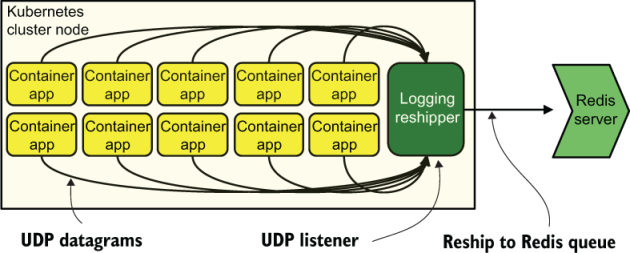

# 13 使用更多非文件发送技术

本章涵盖

- 使用套接字/数据报发送遥测数据
- 从容器或 FaaS 中获取遥测数据
- 通过数据报加密遥测

在本章中，我们将介绍使用文件（第 2.1.1 节）或标准输出（也称为控制台或 stdout；第 2.1.3 节）之外的其他方法来发出遥测数据。第 2 章和第 3 章介绍了也不是文件或标准输出的发射技术：

- 系统记录器，例如 Syslog 或 Windows 事件日志（第 2.1.2 节）。
- 队列和流（第 3.1.2 节），第 8 章给出了使用队列和流的完整示例架构。
- SaaS API（第 3.1.3 节），可用于将运输和演示阶段服务委托给第三方。对于需要使用 API 端点而不是其他技术（例如队列）的技术组织来说，相同的技术非常有用。
- 直接进入存储，无需任何进一步的运输阶段系统（第 3.1.1 节）。

本章将向我们的工具包添加更多的发射技术来处理其他情况。我们将研究容器和 FaaS（也称为无服务器）环境，其中写入文件是明确的反模式。一些无服务器平台缺少系统记录器，因此该方法不可用。尽管 Kubernetes 标准输出处理程序功能强大，但政治和遥测格式化标准可能会降低遥测交付服务的吸引力，而不是绕过它。

永远不要忘记政治在遥测系统设计中扮演的角色！第 10.3.2 节描述了假设的全球航空公司的忠诚度计划部门使用的遥测系统。该部门在航空公司的主网站上运营着一个子网站，该子网站由另一个部门维护。忠诚度计划是否使用其他部门的内置遥测系统（其工作方式完全不同），或者是否构建自己的遥测系统，该系统与该部门的其他系统更兼容？政治是大多数看似奇怪的技术选择背后的原因。

第 13.1 节介绍了基于套接字 (TCP) 和数据报 (UDP) 的发射器的设计。第 13.2 节深入探讨了在容器和无服务器生产代码中处理遥测。

## 13.1 基于套接字和数据报的发射器的设计

本节介绍如何构建使用直接 TCP 或 UDP 的 Shipping 阶段组件，而不是使用 HTTP、Redis 和 Kafka 等应用程序协议。我按照第 3 章中的方式将 Shipping 阶段用于生产代码中的组件，因为将遥测数据从生成它的盒子中移出是 Shipping 阶段的作用。根据我们在第 12 章中构建的结构化记录器，写入网络的写入器是一个 Shipping 阶段组件，尽管结构化记录器的记录器和格式化程序部分绝对是 Emitting 阶段组件。我们在图 12.1 中看到了这种分裂，这里再现为图 13.1。


图 13.1 结构化记录器的元素：记录器、格式化程序和编写器。记录器是结构化记录器的入口点，从生产代码中调用。格式化程序重新格式化遥测数据以供运输阶段接受。如果写入器在本地发出，例如发送到文件或系统日志，则它是发出阶段的一部分。如果编写器通过网络远程发送，例如发送到 Redis 服务器、Kafka 集群或 HTTP API，则它是 Shipping 阶段的一部分。

让你的编写器使用原始 TCP 套接字或 UDP 数据报使其成为 Shipping 阶段的一部分，即使它附加到 Emitting 阶段。这就引出了一个问题：当应用程序协议可能可以更好地处理网络问题时，为什么要使用 TCP 或 UDP？应用程序协议确实可以更好地处理网络问题，这就是我在第 1 部分的大部分章节中介绍它们的原因。但现代基础设施通常有许多容器、虚拟机、逻辑分区、切片和区域在同一物理计算硬件上运行。在这种情况下，诸如数据包丢失、乱序到达、路由失败和交换机重置等网络问题发生的可能性就会大大降低。更简单的网络允许更简单的网络协议工作，这意味着

- 你的生产软件将包含更少的专用于遥测系统使用的代码，从而更容易交付。
- 对于微服务，不必使用像 Kafka 这样昂贵（且扩展）的库，可以使可交付的二进制文件小得多。
- 不必支持遥测系统应用程序协议意味着你的生产软件中要包含的模块少了一个——跟踪依赖项的模块少了一个，处理安全漏洞的模块少了一个，以及包含错误的总体代码少了一个。

使用 TCP 或 UDP 进行遥测传输的好处在已经具有广泛软件依赖性的大型整体代码库中感觉较少，而在为做好一些事情而构建的小型和微服务系统中感觉更多。更简单的软件需要调试的边缘情况更少（理论上）。图 13.2 显示了如何使用简单网络进行遥测传输在实践中与 Kubernetes 和 UDP 配合使用。



图 13.2 Kubernetes 集群节点上的 10 个容器化应用程序将 UDP 数据报发送到在同一节点上运行的日志转发器。然后，转发器将遥测数据作为队列的一部分传递到 Redis 服务器。这种模式有一个专门用于特定元功能（如日志记录）的应用程序，有时称为 sidecar 模式。

图 13.2 显示了一个 Kubernetes 集群节点，其中包含一组容器应用程序和一个称为日志转发器的容器。应用程序容器通过内部 Kubernetes 网络将 UDP 数据包发送到日志转发器。然后，日志转发器重新打包遥测数据并将其发送到 Redis 服务器和更大的 Shipping 阶段。为实用程序或代理（例如像这样的日志记录功能）提供专用容器的模式称为 sidecar 模式。

然而，执行重新运输的服务不一定是另一个容器。转发器可以是 Kubernetes 节点本身上的一个进程。两者都可以，因为进程和另一个容器都可以访问同一内部网络。使用最适合你的服务发现系统的方法。此模式也适用于大型机上的逻辑分区 (LPAR) 以及 VMware ESX 主机上的虚拟机。

为了演示图 13.2 中的网络如何工作，我们将查看一对列表。清单13.1是一个简单的echo服务器，它通过UDP接收数据并将其打印到控制台。我们将使用这个 echo 服务器来测试清单 13.2。

清单 13.1 用于测试的简单 Python UDP 回显服务器

```python
import socket                                  ❶
                                               ❶
host = "127.0.1.2"                             ❶
port = 9201                                    ❶
 
telemetry_in = socket.socket(                  ❷
  socket.AF_INET,                              ❷
  socket.SOCK_DGRAM)                           ❷
 
telemetry_in.bind((host, port))                ❸
 
while 1:
  data, addr = telemetry_in.recvfrom(8192)     ❹
  try:
    value = data.decode('utf8')                ❺
    print(value)
  except:
    print("Invalid data received.")
 
 
telemetry_in.close()
```

❶ 导入socket库，并设置我们的服务器和端口

❷ 使用 IPv4 和 UDP 创建套接字对象

❸ 启动我们的脚本监听给定的地址和端口

❹ 将接收缓冲区设置为 8 KB，设置数据和地址变量

❺ 将数据解码为UTF-8

清单 13.1 是一个简单的 UDP 回显服务器。它所做的就是在确保接收到的数据是 UTF-8 格式后，将接收到的数据打印到控制台。使用 127.0.1.2 作为地址意味着服务器将侦听你计算机的本地主机网络。端口 9201 足够高，不被视为特权端口（特权端口为 1 到 1024），因此非特权用户可以使用它。如果你安装了 netcat（ `nc` 命令），你可以使用以下命令进行测试

```
echo -n "Hello there!" | nc -u 127.0.1.2 9201
```

此代码应导致清单 13.1 脚本打印 `"Hello` `there!"` 。使用 `-n` 表示 echo 意味着不发送换行，使用 `-u` 表示 nc 则告诉它使用 UDP 而不是 TCP。

现在我们有了查看 UDP 输出的方法，我们需要查看清单 13.2。清单 13.2 重写了清单 12.6，以包括通过 UDP 发送遥测数据。清单 12.6 演示了结构化记录器如何工作以及如何更新以发出任意与上下文相关的遥测数据。有关清单 12.6 的更多信息，请参阅第 12.2 节。清单 13.6 包含对 12.6 的一些更改，这些更改以粗体显示。

> 注意 要运行清单 13.2，你需要将清单 12.4 作为名为 `internalrenderer.py` 的文件保存在运行此脚本的同一目录中，并安装 `structlog` Python 模块。清单 13.2 的完整版本位于代码存储库中。

清单 13.2 结构化记录器更改为通过 UDP 发出

```python
import logging
import datetime
import sys
import socket                                       ❶
import os
import json
from internalrenderer import (InternalRenderer)     ❷
from structlog import (
  get_logger,
  configure,
)
from structlog.stdlib import (
  LoggerFactory,
  BoundLogger,
  add_log_level,
)
from structlog.processors import (
  JSONRenderer,
  UnicodeDecoder,
  TimeStamper
)
from logging.handlers import (                      ❸
  DatagramHandler,                                  ❸
)                                                   ❸
 
class PlainDatagramHandler(DatagramHandler):        ❹
  def emit(self, record):                           ❹
    try:
      s = record.msg                                ❺
      self.send(s.encode('utf8'))                   ❻
    except Exception:
      self.handleError(record)
 
logging.basicConfig(
  format="%(message)s",
  handlers=[
    PlainDatagramHandler('127.0.1.2', 9201)         ❼
  ],
  level=logging.INFO,
)
 
__release__ = "0.7.1"
__commit__ = "f0d00b1"
 
configure(
  processors=[
    TimeStamper(fmt="iso"),                         ❽
    UnicodeDecoder(),                               ❽
    add_log_level,                                  ❽
    InternalRenderer(),                             ❽
  ],
  context_class=dict,
  logger_factory=LoggerFactory(),
  wrapper_class=BoundLogger,
  cache_logger_on_first_use=False
)
 
logger = get_logger()                               ❾
 
[... functions defining the logger ...]
```

❶ 导入套接字库，以便我们可以使用 UDP

❷ 导入InternalRenderer（清单12.4）用于自定义日志格式

❸ 从structlog导入DatagramHandler，以便我们可以修改它

❹ 重写DatagramHandler中的emit()函数以不pickle输出

❺ 提取遥测数据以从 Python LogRecord 导出

❻ 通过 UDP 发送遥测数据，以 UTF-8 编码

❼ 告诉作者使用我们重写的类来发出

❽ 我们的记录器将使用的格式化程序列表，包括我们的内部格式

❾ 在记录器函数中使用的对象；实例化所有先前的配置

如果一切按计划进行，则运行清单 13.2，例如 `info("` 个人资料图像已更新 `",` `metadata,` `["` account_id `",` < b5> feature_flags `"])` 当你在同一台计算机上运行清单 13.1 时，应该在运行清单 13.1 脚本的窗口中获得如下输出：

```
2023-02-19T01:01:24.251261Z Profile image updated -- {"hostname": "k8s-
➥ 14.euc1.prod.internal", "pid": 11321, "release": "0.7.1", "commit": 
➥ "f0d00b1", "account_id": "1515323", "feature_flags": {"new_login": true, 
➥ "new_profile": false}, "level": "info"}
```

展示我们如何从 `info("` 个人资料图像更新 `",` `metadata,` `["` account_ id `",` `"` 要获得前面的结果，需要了解结构化记录器的工作原理。第 12 章详细介绍了该主题，但记录器、格式化程序和编写器组件都包含在此清单中。图 13.3 显示了这些组件和逻辑流程。


图 13.3 我们发出的遥测数据从进入记录器到通过 UDP 发出的逻辑流程。在记录器阶段， `__add_context()` 和 `__filter_metadata()` 函数提供额外的上下文。在格式化程序阶段，时间戳处理器添加 ISO-8601 格式的时间戳，确保字符串编码正确，添加日志级别 ( `Info` )，最后将遥测数据重新格式化为内部标准。在写入阶段，字符串被移动到我们的自定义处理程序中，并通过 UDP 套接字发送到 127.0.1.2。端口 9201。第 12.2 节更深入地介绍了该执行的格式化阶段。

由于 Pythonism，我们正在重写 Python 的 `structlog` 模块附带的 `DatagramHandler` 来制作我们的 UDP 发射器。股票 `DatagramHandler` 发出遥测 pickled，这是一种特定于 Python 的序列化格式，用于传递很少有其他系统支持的对象。我在清单 13.2 中构建的 `PlainDatagramHandler` 跳过了酸洗步骤，而是发出字符串。我这样做是因为发出纯字符串的系统与本身不运行 Python 的其他系统具有更好的互操作性。

另请注意，此处的 UDP 发射在传输过程中未以任何方式加密，因此它们最适合通过完全可信的网络发射。 sidecar 模式是一个很好的用例，其中排放完全发生在虚拟机管理程序或主机的内部网络上。

研究接收 UDP 事件流的方法是值得我们花时间的，所以让我们看看如何配置 Logstash 和 Fluentd 来使用 UDP 输入。首先是 Elastic 的 Logstash。在 Logstash 中，入站遥测在 `input` `{}` 块中配置；遥测丰富发生在稍后的 `filter {}` 阶段，并在第 1 部分中有更多介绍：

```
input {
  udp {
    host  => "172.28.5.128"
    port  => 9201
    type  => "metrics"
    codec => plain {
      charset => "UTF8"
    }
  }
 
  udp {
    host  => "172.28.5.128"
    port  => 9202
    type  => "exceptions"
    codec => plain {
      charset => "UTF8"
    }
  }
}
```

我们看到这里设置了两个单独的侦听器，一个在端口 9201 上设置了一个名为 Metrics，另一个在端口 9202 上设置了一个名为Exceptions。与清单 13.1 中的简单 UDP 回显服务器一样，我们将这些侦听器配置为期望 UTF8 编码的数据。我们通过两个侦听器上的编解码器定义来完成此任务。开源 Fluentd 类似地处理输入：

```
<source>
  @type udp
  tag metrics
  bind 172.28.5.128
  port 9201
</source>
 
<source>
  @type udp
  tag exceptions
  bind 172.28.5.128
  port 9202
</source>
```

Fluentd 不像 Logstash 那样期望 UTF-8，但我们确实看到设置了两个侦听器。当我们使用极其轻量级的托运程序将遥测数据转移到 sidecar 时，sidecar 可以使用更重的运输技术（就代码复杂性而言）来保护简单的函数和容器免受这种负担。图 13.4 重构了图 13.2，与 Kafka 流而不是 Redis 队列对话。


图 13.4 将遥测从简单的容器化应用程序转移到运输阶段。第一段传输通过 Kubernetes 集群节点内部网络上的 UDP 进行，传送到日志转发器 sidecar。然后，sidecar 将遥测数据重新发送到 Kafka 主题，其中 Shipping 阶段的日志解析器框订阅主题以进一步丰富遥测数据。这种架构允许容器化应用程序避免在每个应用程序上安装复杂的 Kafka 客户端库。

Kafka 客户端是相当复杂的代码块。尽管这种复杂性在已经具有大量代码复杂性的大型单体中可能并不重要，但将 Kafka 客户端添加为日志系统的一部分可能会大大增加微服务的大小。像 UDP 这样的传输需要将套接字库加载到微服务中，由于许多微服务架构的 API 驱动性质（无需更多库的遥测！），该库可能已经加载。

使用 UDP 发送日志数据的历史可以追溯到几十年前。互联网工程任务组 RFC 3164 于 2001 年 8 月定义，正式确定了事实上的 Syslog 标准，并将 UDP/514 设置为官方 Syslog 端口。在标准化工作之前，Syslog 已使用 UDP/514 多年。正如第 2 章中提到的，硬件供应商通常以 Syslog 格式发出，因为它是标准化格式，因此不太可能更改。使用 UDP 进行遥测有着悠久的历史。此外，在 HTTP/3 得到广泛采用后，HTTP API 也将使用 UDP。

直接 TCP 套接字的使用方式也与图 13.4 使用 UDP 数据报的方式类似。 TCP 对处理的影响更大，因为除非小心，否则建立 TCP 连接的行为可能会在发送遥测数据时阻塞生产代码。 UDP 是无连接的，因此可以安全地触发和遗忘，因此是非阻塞的。 AMQP (RabbitMQ) 和 Kafka 等应用程序协议的部分重量是由于 TCP 带来的网络堆栈造成的。

与 UDP 一样，如果你的遥测数据通过虚拟机管理程序、内核或大型机的内存网络进行发送，则网络问题导致 TCP 连接速度减慢的可能性就会大大降低。由于这种简单性，基于 TCP 的发射器不太可能需要额外的代码来处理重置连接等问题时的重试。

TCP 拥有而 UDP（很容易）缺乏的一件事是使用传输层安全性 (TLS) 的能力：加密。如果你的遥测系统甚至有可能处理隐私或健康信息等受监管信息，则监管要求对传输中的此类受监管信息进行加密。在遥测中添加 TLS 协商会减慢速度，但它也会使你的 TCP 遥测传输技术更容易向外部审计人员证明其合理性。

> 练习13.1
>
> 将 A 列中的协议与 B 列中的属性配对。
>
> | 协议 |               属性                |
> | :--: | :-------------------------------: |
> | TCP  |         无连接：即发即忘          |
> | TCP  |      面向连接：跟踪连接状态       |
> | TCP  |        如果网络故障会重试         |
> | TCP  |   在完全私有的内存网络上很有用    |
> | UDP  |   AQMP、Kafka 等应用协议的基础    |
> | UDP  | Syslog 和 SNMP 等服务器协议的基础 |
> | UDP  |      依赖操作系统来处理重试       |
> | UDP  |      依赖应用程序来处理重试       |

> 练习13.2
>
> 以下哪项是 Kubernetes 系统中 Sidecar 模式最正确的定义？
>
> 1. 集群主机上的一个服务，它将所有输出到 Containerd 的日志重新发送到 Kafka 流
> 2. 一个容器，充当集群节点中所有容器的日志转发器
> 3. 服务于实用目的的网络端点，例如代理、中继或服务发现
> 4. 服务于实用目的的容器，例如集群节点中所有容器的代理、中继或本地服务端点

## 13.2 发布和传送基于容器和无服务器的代码

本节介绍如何处理没有全套操作系统假设的平台的遥测：Kubernetes 和其他容器管理框架以及 FaaS（也称为无服务器）。无服务器是一种由 AWS Lambda 推广的计算方式；此后，Azure Functions 和 Google Cloud Functions 相继出现在各大公有云中。无服务器在云提供商托管的服务器和分配上运行函数，因此开发人员只需担心触发函数并消耗输出。	

容器和无服务器都认为小型、有针对性的应用程序能够很好地完成一件事，是在任一平台上运行的理想选择。小型应用程序更容易理解，因此也更容易调试。小型应用程序限制了故障域，因此当出现问题时错误不会传播。正如 13.1 节中所讨论的，小型应用程序需要考虑其遥测需求，并且需要像 Kafka 客户端这样的重型客户端可以使小型应用程序看起来更像中型应用程序。从基于容器和无服务器的系统中获取遥测数据与在服务器和虚拟机上运行的大型应用程序略有不同。

第 13.2.1 节深入介绍了 Kubernetes 和 containerd，以及从中获取遥测数据的多种方法。第 13.2.2 节研究了无服务器系统以及这些系统在遥测方面面临的挑战。

### 13.2.1 从基于containerd的代码发出和发送

本节介绍如何从基于 Kubernetes 的应用程序中获取遥测数据。 Kubernetes 在 Containerd 和 Kubernetes 平台的功能方面有很多优势。我们在4.2节中讨论了这个主题，注意到containerd能够通过Kubernetes将标准输出（stdout）发送到主机的journald系统（如果主机是Linux系统）。但 Kubernetes 能够将标准输出定向到很多地方：

- `json-file` ——默认值；将遥测数据存储在主机上的文件中。 （有关将日志文件中的遥测数据移动到遥测系统的其余部分的信息，请参阅第 3 章。）
- `syslog` — 将遥测数据发送到主机上的 Syslog，但不通过网络发送。 （有关 Syslog 和遥测的更多信息，请参阅第 2-4 章。）
- `journald` — 仅当主机是 Linux 计算机时才有效，但会将遥测数据发送到日志进程。 Journald 是 systemd 程序系列的一部分。
- `etwlogs` — 使用 Windows 事件跟踪发送遥测数据，这要求主机运行 Windows。
- `fluentd` — 将遥测数据发送到主机上运行的 Fluentd 守护进程。
- `gelf` - 将 Graylog 扩展格式遥测数据发送到网络端点，该端点可以是 Graylog、Fluentd、Logstash 或其他端点。
- `splunk` - 将遥测数据发送到 Splunk 端点，该端点可以是自托管或云托管的 Splunk。
- `awslogs` — 将遥测数据发送到 Amazon 的 CloudWatch Logs 服务。
- `gcplogs` - 将遥测数据发送到 Google 的云平台日志记录服务。

前面列表中的所有方法都需要在 Docker（针对开发环境）或 Kubernetes（针对生产环境）中运行的应用程序通过标准输出发送遥测数据。 （有关发送到 stdout 的详细信息，请参阅第 2.1.3 节。）如果 stdout 是发送集中式日志记录、指标和可观测性遥测数据的唯一方法，则你的遥测格式标准将需要能够对所有三种样式进行编码。图 13.5 稍微更新了图 7.7。


图 13.5 统一的遥测格式如何最终由解析每种遥测类型的适当系统实现。遥测将生产系统留在单一流中。然后，路由器查看遥测数据的每一项，并根据遥测数据中的详细信息确定如何路由遥测数据。路由后，遥测数据被解析并存储。

图 13.5 中所示的路由拓扑之所以成为可能，是因为遥测的格式（由生产系统本身编码的上下文相关遥测）允许路由器快速确定它正在查看哪种遥测。如果遥测格式是纯 JSON，则可能需要将名为 `style` 的顶级字段（示例如下）设置为三个值之一（日志、指标或跟踪 - 这三个值）可观察性的支柱）。

```json
{
  "style": "metrics",
  "metric_name": "pdf_pages",
  "metric_value": 3
}
```

我们的路由器反序列化 JSON 并查找单个字段，忽略其余字段。然后，路由器根据该字段的内容决定将该遥测数据发送到哪里。如果我们基于容器的应用程序通过同一通道发出指标和日志记录，只要应用程序正确设置样式字段，遥测就会最终出现在正确的位置。以这种方式使用路由器需要任何发送到遥测管道的程序都以通用格式（或几种常见格式之一；人类政治通常需要妥协）来执行此操作。

然而，Kubernetes 并不严格要求通过标准输出发出遥测数据。 2020 年代初使用的大多数分布式跟踪系统都强烈倾向于发送到 API（通常是 SaaS 提供商的 API），而不是编码为字符串并稍后解析。分布式跟踪系统对于遥测和小型服务来说是一个有趣的案例，因为跟踪需要与生产代码一起运行来完成它需要做的工作。在需要发出遥测数据时，代码复杂性费用已经支付。图 13.6 显示了这种性质的划分，跟踪遥测通过 API 传输到 Honeycomb.io，其余部分通过 stdout 进入 Kubernetes 系统。


图 13.6 在这里，containerd 应用程序分割了它们的遥测传输。跟踪被发送到 Honeycomb.io 上的 API，其中指标和日志遥测数据通过标准输出发出。标准输出由containerd和Kafka收集，然后发送到Kubernetes主机（Linux系统）上的journald。 Journalbeat 是 Elastic 的一个程序，它读取日志并将遥测数据发送到 Redis 服务器以供稍后处理。即使很小的容器也可以遵循这种模式，并且不会显着增加代码复杂性。

### 13.2.2 从基于无服务器的代码发出和传送

本节介绍如何从无服务器（也称为基于 FaaS 的代码）中获取遥测数据。随着 AWS Lambda 服务的推出，无服务器作为一种计算风格开始腾飞，该服务提供 API 驱动的方式来触发代码的执行。与 Kubernetes 等容器平台不同，无服务器系统在云提供商构建的平台中运行，并继承提供商的日志记录功能和首选项。三大主要无服务器系统将日志发送到：

- AWS Lambda 将标准输出记录到 CloudWatch 日志中，这是一项基于 API 和 S3（文件对象）的服务。
- Azure Functions 基于 Log Analytics 将标准输出记录到存储帐户或监视器日志服务中。
- Google Functions 将标准输出记录到 Cloud Console，你可以在其中查询日志。

这些默认日志目标的设计足够灵活，可以满足许多需求，但许多需求通常与你的需求并不重叠。对于一家希望避免维护 Kubernetes 集群复杂性的初创公司来说，无服务器看起来是一种令人惊叹的方式，可以专注于公司最擅长的事情：编写赚钱的代码。这样的初创公司可能会使用最新的软件开发技术，这意味着采用分布式跟踪。 Azure (Application Insights) 和 Amazon AWS (X-Ray) 现在都有 API 驱动的跟踪解决方案。这家使用无服务器的初创公司几乎肯定会在其跟踪系统中采用 HTTP API。此外，这样的初创公司可能会使用分布式跟踪作为其主要遥测方法、捆绑指标和集中式日志记录。图 13.7 显示了这种模式。


图 13.7 使用无服务器作为生产平台的初创公司的遥测流程。分布式跟踪遥测数据直接流向由分布式跟踪供应商管理的 HTTP API。其他所有内容（其中包含的内容）最终都会出现在云提供商的日志服务中。这种性质的初创公司可能会使用分布式跟踪来满足其所有遥测需求，并且可能更多地使用日志记录服务作为查找早期终止计算的异常的地方。

将这家最新、最伟大的初创公司与一家寻求采用新技术来完成其业务的老公司进行对比。这种类型的公司（老牌公司）拥有长期建立的计算和遥测模式。像这样的公司不会从根本上彻底改造一切，包括遥测技术，而是通过将其可以集成到现有遥测服务中来寻求加速新技术的采用。虽然这家初创公司付钱给其他人来处理遥测，但这家老公司可以使用现有的基础设施。

这家老公司还面临着我在本章中多次提到的代码复杂性问题。现有的系统不是无服务器的，可以安全地假设系统记录器在那里并配置为集中发送给它的所有内容。无服务器平台的系统记录器看起来与 Windows、Linux 或 Kubernetes 系统记录器完全不同，如果现有遥测系统假设正在使用事件日志 (Windows) 或 Syslog (Linux)，这将带来挑战。如果该公司通过使用其他技术（例如队列、流和 API）围绕系统记录器进行设计，那么它的状况会更好：

- 如果假设系统记录器存在而构建遥测，那么采用无服务器将要求公司创建新颖的遥测交付方法或设计一个新的解决方案来使用云提供商的无服务器日志日志存储。
- 如果它使用流、队列和 API 等技术构建遥测，则需要考虑无服务器函数中的代码复杂性。

功能越简单，仅仅为了发出描述成功交易的事件而拥有一组厚厚的库就变得越繁重。由于无服务器是云提供商的产品，因此可以更轻松地决定是保留该库还是添加抽象层以简化整体代码。所有主要的云提供商都有易于使用的方法将作业提交到队列（在某些情况下也提交到流）。图 13.8 显示了一种利用基于提供者的队列的便利性的方法。


图 13.8 两种形式的遥测交付，一种使用传统计算（左），另一种使用无服务器（右）。云提供商的服务有虚线边界。这种架构使基于无服务器的生产系统无需加载复杂的 RabbitMQ 客户端来发送遥测数据；相反，它使用更简单的云提供商挂钩。

图 13.8 显示了两种遥测流程，一种使用传统计算，另一种使用无服务器。为了解决将 RabbitMQ 客户端放入每个无服务器函数中的代码复杂性问题，该公司转而使用云提供商原生的简单易用的队列系统。它还构建了一个新的 Shipping-stage 系统，可将遥测数据从本地云提供商队列系统中弹出，并将事件推送到 RabbitMQ 系统中。从那里开始，遥测流程就像传统计算流程一样。遥测管道中的额外步骤增加了延迟（与传统计算相比，数据需要更长的时间才能到达存储并可搜索），但使相同的演示阶段系统能够支持传统和无服务器系统。

这种架构并非没有风险。例如，本机云提供商排队系统的作业大小限制可能比 RabbitMQ 的有效负载大小（最大可达 512 MB）小得多。 Azure 队列将作业限制为 64 KB，AWS 的简单队列服务将作业限制为 256 KB。如果我们的示例公司产生的事件有时超出云提供商本机队列的大小限制，则转发器将不得不处理来自多个作业（或可能是压缩/解压缩周期）的事件重组。

尽管无服务器缺乏类似于 Linux 和 Windows 运行的系统记录器，但 Syslog 协议可以通过网络运行。第 2.1.2 节重点详细介绍了发送到系统记录器的信息，但提醒一下，编程框架中的 Syslog 类允许将 Syslog 消息发送到远程服务器。由于 Syslog 通过 UDP 工作，因此不需要像 Kafka 和 RabbitMQ 那样加载执行服务发现来检测目标服务架构的复杂客户端。系统日志很小。如果我们的老公司已经在使用 Syslog，那么它向无服务器的转换可能会非常容易。图 13.9 显示了基于 Syslog 的无服务器如何与现有的基于 Syslog 的遥测运输系统集成。


图 13.9 涉及传统计算和无服务器计算的基于 Syslog 的遥测系统。这两种技术都通过 UDP 端口 514 发出遥测数据。它们还具有指标和日志解析器，用于侦听分别解析指标和日志记录遥测数据的专用主题，并将其存储在专用存储中。对于这家公司来说，无服务器并没有带来太大的遥测挑战。

有趣的是，与使用直接流或直接队列遥测技术的公司相比，基于 Syslog 等受限内容的公司更容易集成全新的计算技术。由于 Syslog RFC 没有统一描述如何支持加密，因此基于 Syslog 的遥测数据将不加密地发送。如果遥测系统甚至有可能包含受监管的信息（例如隐私和健康信息），那么这种纯文本传输就是一个主要问题，因为管理此类受保护信息的监管通常需要端到端加密。

> 练习13.3
>
> 在下面的列表中，FaaS（无服务器）环境中的遥测流程面临哪些限制？
>
> 1. 完全依赖通过标准输出发送遥测数据
> 2. 云提供商固执己见的存储系统，用于通过标准输出发出遥测数据
> 3. 缺乏队列或流支持
> 4. 缺乏系统记录器支持
> 5. 云提供商队列中作业的大小限制

## 13.3 加密基于UDP的遥测

参考第 13.1 节，我们如何构建一个基于 UDP 的遥测发射器，该发射器在不可信（对于不可信的监管值）网络上使用时是安全的？就代码复杂性而言，套接字库相对便宜，并且如果函数执行任何 API 工作，则通常已经加载加密库。清单 13.3 是一个 Python 格式化程序类（有关格式化程序在结构化日志记录中的作用的更多信息，请参阅第 12.2 节），我们可以将其与我们在第 13.1 节中使用的结构化记录器一起使用。

注意此清单直接在代码中使用加密密钥，这显然是一个坏主意。我在这里用它来演示这个概念。最佳实践是通过代码以外的渠道传递机密，例如环境变量或 Hashicorp Vault 等系统。要运行此代码，你需要安装 `cryptography` Python 模块，其中包括 `fernet` 。

清单 13.3 一个名为 `Encrypter` 的格式化程序，用 Python 编写

```python
from cryptography.fernet import Fernet                    ❶
import json
import base64
 
class Encrypter(object):
 
    def __init__(self):
        bkey = b'this is a bad key -- do not use.'        ❷
        self._key = base64.b64encode(bkey)                ❸
        self._key_version = '1.0'                         ❹
 
    def __call__(self, logger, name, event_dict):
        enc_event = { 'kver': self._key_version }
        cipher = Fernet(self._key)                        ❺
        safe_event = cipher.encrypt(
            event_dict.encode('utf8'))                    ❻
        enc_event['event'] =                              ❻
			base64.b64encode(safe_event).decode('utf8')   ❻
        return json.dumps(enc_event)                      ❼
```

❶ 从加密模块导入对称加密助手

❷ 要使用的加密密钥。不要使用这个。

❸ 通过对二进制密钥进行base64编码来设置Fernet密钥；在程序启动时运行

❹ 设置解密器使用的密钥版本

❺ 使用程序启动期间设置的密钥创建 Fernet 密码

❻ 使用 Fernet 密码加密我们的遥测数据，并设置“事件”属性

❼ JSON 序列化我们的遥测数据。

通过此格式化程序的遥测数据将被加密，并且应如下所示，

```
{"kver": "1.0", "event": "Z0FBQUFBQmZ[...cut for space...]MswzA"}
```

返回一个二元素 JSON 哈希，其中 `kver` 设置密钥版本， `event` 包含 Base64 编码的加密哈希。更新清单 13.2 中的脚本以使用这个新的格式化程序需要更改两行代码，如清单 13.4 所示。更改内容以粗体显示。我使用 Python 提供的 Fernet 对称加密助手，因为它使用安全的默认值；这可以避免我在选择加密算法、密码、密钥长度和初始化向量时犯下潜在的破坏安全的错误。 （Fernet 使用 CBC 模式下的 AES 和 128 位密钥、用于 HMAC 的 AES256 和随机初始化向量；相当安全，对于 2020 年代初期的“安全”值。）为了确保此列表将导入我们的加密器模块，请重命名清单 13.3 encrypter.py 与清单 13.4 位于同一目录中。

清单 13.4 更新清单 13.2 以使用加密器

```python
[...]
from internalrenderer import (InternalRenderer)
from encrypter import (Encrypter)
from structlog import (
    get_logger,
    configure,
)
[...]
configure(
    processors=[
        TimeStamper(fmt="iso"),
        UnicodeDecoder(),
        add_log_level,
        InternalRenderer(),
        Encrypter(),          ❶
    ],
[...]
```

❶ 将Encrypter()附加到处理器，加密InternalRenderer()格式

如果你运行清单 13.1 中的 UDP 回显服务器，然后运行清单 13.4，你将看到带有 `kver` 和 `event` 值的加密输出。在应用层而不是传输层以这种方式加密将使可能包含私人或健康信息的遥测更容易通过听觉审查。由于此列表不使用可识别的 TLS（有时称为 HTTPS），因此你应该会遇到更多有关加密方法的问题。但是，只要你正确进行密钥管理、使用正确的密钥大小并选择正确的密码，你就应该毫不费力地让审计员相信这条路径是安全的。图 13.10 显示了新的格式化程序如何适应结构化记录器。


图 13.10 我们的 `Encrypter` 格式化程序适合结构化记录器的位置。 `Encrypter` 位于 `InternalRenderer` 之后，因此 `Encrypter` 将加密格式化的遥测数据。正如我们在底部看到的，我们有 kver 密钥版本和事件加密文本哈希编码为 JSON。 UDP 接收器使用 `kver` 值来选择用于解密遥测数据的密钥。

为了提供解密，让我们更新简单的 UDP 回显服务器来解密并回显我们的遥测数据。清单 13.5 更新了清单 13.1，以解密我们在清单 13.4 中生成的遥测数据。与清单 13.3 一样，你需要安装 `cryptography` Python 模块，其中包括 `fernet` 。

清单 13.5 解密 UDP 回显服务器

```python
from cryptography.fernet import Fernet
import socket
import json
import base64
 
host = "127.0.1.2"
port = 9201
 
badkey = b'this is a bad key -- do not use.'              ❶
decrypter = Fernet(base64.b64encode(badkey))              ❶
telemetry_in = socket.socket(
  socket.AF_INET,
  socket.SOCK_DGRAM)
 
telemetry_in.bind((host, port))
 
while 1:
  data, addr = telemetry_in.recvfrom(8192)
  try:
    value = data.decode('utf8')
    print('Encrypted text: %s ' % value)
    enc_event = json.loads(value)                          ❷
    b64event = base64.b64decode(enc_event['event'])        ❸
    try:
      event = decrypter.decrypt(b64event).decode('utf8')    ❹
    except:
      print('Failed decryption')
    print('Clear text: %s' % event)
  except:
    print("Invalid data received.")
 
 
telemetry_in.close()
```

❶ 设置Fernet解密对象以供使用；在程序开始时运行

❷ 将 UDP 数据包中的 JSON 加载到哈希中。

❸ 从哈希值中进行 Base64 解码“事件”属性。

❹ 尝试解密事件属性。

要测试这对程序，请首先启动清单 13.5 代码，以便运行 UDP 侦听器。其次，运行清单 13.4 的代码。你应该得到与此类似的输出：

```
Encrypted text: {"kver": "1.0", "event": 
➥ "Z0FBQUFBQmZnMUZvbVlMZEVTcE5qTExVbTJLb2w4UHc3XzZVdEZ6MHVKNFI5cnBobVBKTD
➥ hVY3ZVcWc0SUZ2eWprdFZsbm90d0tKaHo4WlRick9xR29rU1pVWVdPeG1ORG05UnJ0UmN5d
➥ VE4enllTGZVaVFYZ2JCcFN0N2hFQWUwS08tUUhGQU0yaFItSjZ6anphcTBPLU1lZWYyLWZ4
➥ TXlDNDQ5N2dMcTNaTnRNaEw5TElXbHVlX2hBOGhHVTNvTTQ1MWstMGdRQ2d6U1Z2UUZSYjg
➥ 0V09hd0ZEYUFYWWQ2YVpFaU53eWh2cDM1SFlEZUFNUmJ3bm81VWhjNVVvZ2YydHhDMGg2R0
➥ dXYklWZ18yektfdmRGRG"} 
Clear text: 2023-02-19T18:39:36.090158Z Profile image updated -- {"hostname": 
➥ "k8s-14.euc1.prod.internal", "pid": 15815, "release": "0.7.1", 
➥ "commit": "f0d00b1", "account_id": "1515323", "feature_flags": 
➥ {"new_login": true, "new_profile": false}, "level": "info"}
```

由于加密函数越来越成为通过网络开展业务的成本，因此它们应该存在于你用于无服务器函数的运行时中。像 Python 这样的解释性语言可以随主语言一起提供，而无需导入更多模块。对于像 Go 这样的编译语言，添加加密函数会稍微增加最终的二进制大小，但函数本身是基础语言的一部分。

> 警告 我使用 Python 的 Fernet 是有原因的：它为我提供了一个易于使用的界面和安全的默认设置，因此我不必对当今哪些特定的加密选项是安全的进行大量研究。我当然可以使用基本加密函数对 Fernet 默认值进行编码，但这种方法只会增加错误的表面积。如果你决定尝试在自己的代码中进行加密，最好使用你的语言中存在的任何类似的安全默认接口。

如果你想了解更多关于加密在遥测系统中发挥的作用的信息，而不仅仅是在发射阶段，请参阅第 15.2 节进行更详细的介绍。

# 概括

- 发送到远程位置的结构化记录器编写器是运输阶段的一部分，因为它涉及将遥测数据移动到新位置。
- Kafka、AMQP（针对 RabbitMQ）等应用协议和其他分布式系统应用程序通常需要将大型库和客户端加载到你的生产代码中，这增加了生产代码的代码复杂性。
- 微服务对代码复杂性特别敏感。他们的工作是编写一小段可维护的代码；为遥测添加大量客户端可能会导致复杂性严重增加。
- 就代码而言，单体可能非常复杂，因此当选择重型应用程序协议来移动遥测时，它们受到的影响要小得多。
- 容器、虚拟机、逻辑分区、切片和区域具有基于其管理程序、内核或大型机的内存网络。这些网络比云或硬件网络可靠得多，允许你安全地使用更简单的协议来移动遥测数据。
- 通过内存网络将遥测数据传输到专用容器（或等效容器），该容器负责通过重型协议重新发送遥测数据，称为边车模式，是保护小型容器和功能免受复杂性影响的有效方法。
- 通过 TCP 套接字传输遥测数据或通过内存网络传输 UDP 数据报比使用通用网络安全得多，并且允许在容器和函数中使用更简单的代码。
- 如果你在遥测中使用结构化记录器（请参阅第 12 章），请使用编写器来构建基于 TCP 或 UDP 的记录器。某些日志记录框架具有内置的套接字 (TCP) 或数据报 (UDP) 编写器或可供你自定义。
- 基于 UDP 的编写器无法轻松访问 TLS，因此它们最适合内存中网络排放，以限制他们所经历的“明文”暴露。
- 基于 TCP 的编写器确实可以访问 TLS，这使得它们更适合在通用网络上使用。
- Syslog 协议按标准使用 UDP 端口 514（RFC 3164 August 2001），因此使用 UDP 进行遥测有着悠久的历史。
- HTTP/3 协议基于 UDP，因此预计 UDP 网络在 2020 年代会变得更加复杂。
- Kubernetes 提供了多种方法将标准输出从容器重新发送到更有趣的地方，例如 Syslog、Windows 事件跟踪以及 Splunk 等 SaaS 产品。
- 尽管 Kubernetes 具有很多运输功能，但你使用的遥测样式有时需要另一种方法。此要求导致遥测流分离，例如用于日志记录的 stdout 和用于指标的 Datadog API 调用。
- 分布式追踪系统（至少在 2020 年代初）对 API 驱动的遥测有着强烈的偏好。幸运的是，使用分布式跟踪意味着在发出时已经支付了代码复杂性费用。
- 如果通过 Kubernetes 记录器发出多种遥测样式，你需要将区分每种样式的方法编码到遥测格式本身中。这种方法使运输阶段组件能够将遥测的每个项目路由到正确的解析器。
- 所有无服务器框架都会将日志发送到特定于供应商的日志搜索框架，这并不适合所有遥测需求，但仍然比手动挖掘文件更好。
- 与 Kubernetes 一样，由于默认记录器的限制，无服务器会导致针对特定需求分割遥测流。一些组织将放弃使用默认记录器，转而使用 SaaS 平台。
- 当具有既定计算模式的老组织采用无服务器时，他们通常会尝试将无服务器集成到现有的遥测流程中。如果这些流程基于记录到文件或使用系统记录器，那么这些组织将需要想出新的方法将遥测数据纳入其现有系统。
- 由于无服务器框架是由云提供商创建的，因此它们通常提供简单的方法将数据获取到其他提供商系统（例如队列），这有助于解决代码复杂性问题。
- 基于 UDP 端口 514 的旧 Syslog 协议仍然可以在网络上运行。仍在使用 Syslog 的老公司可以继续在 Serverless 中使用 Syslog，只要注意遥测需要加密的内容即可。
- 尽管将 TLS 与 UDP 结合使用很棘手，但你仍然可以使用加密来包装遥测数据。编程语言中的一些密码模块具有方便的方法，可以使该过程减少危险；使用这些方法。如果正确使用，它们将解决审核员在处理和安全传输监管信息方面的问题。