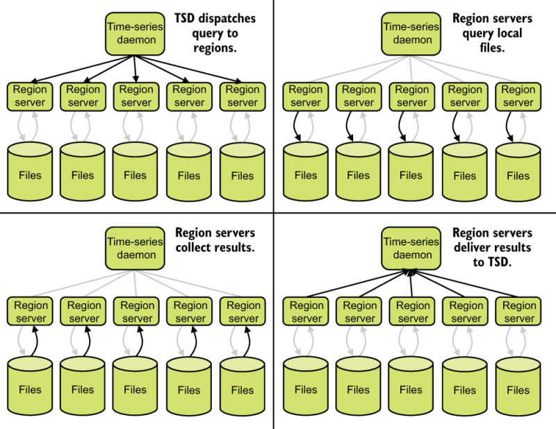
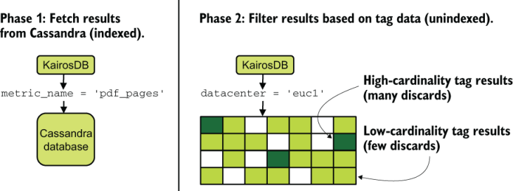
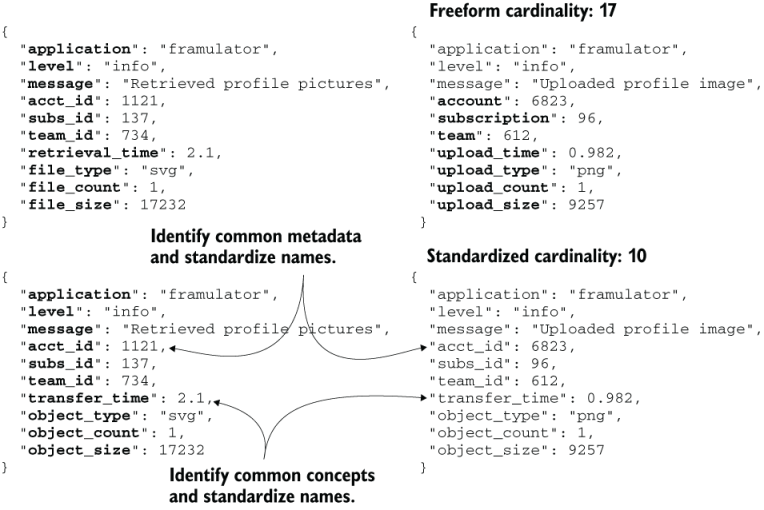
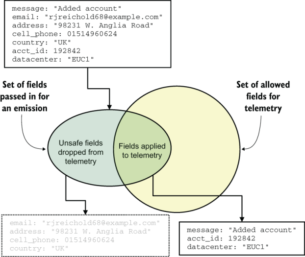
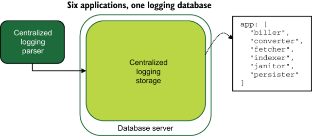
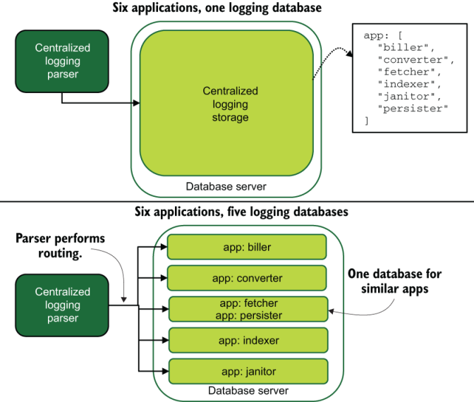
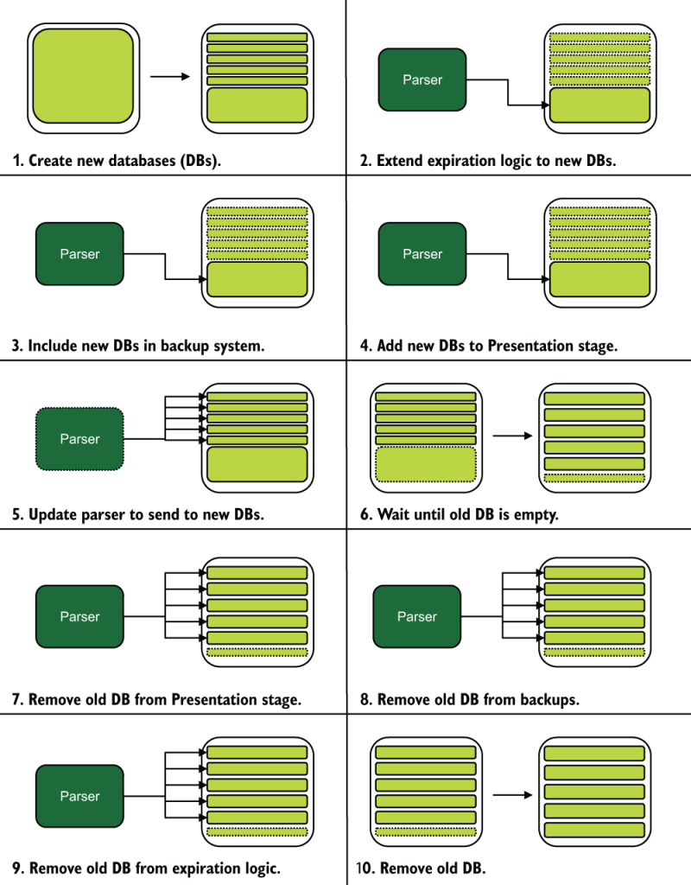
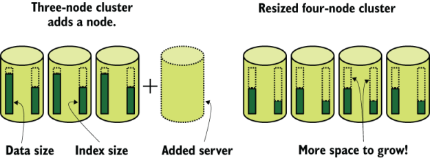

# 14 管理遥测中的基数

本章涵盖

- 基数如何影响遥测性能
- 识别基数问题的方法
- 管理基数的技术

本章深入探讨管理遥测系统的维护难题之一：存储系统中的基数。这是第一章中基数的定义：

> 定义 **基数**是索引复杂性的术语，具体来说，是索引中的字段可能产生的唯一组合的数量。如果有字段 A 和 B，其中 A 有两个可能的值，B 有三个可能的值，则该索引的基数为 A * B，或 2 * 3 = 6。无论数据存储系统是什么，基数都会显着影响搜索性能正在使用。

所有遥测样式都将搜索遥测作为关键功能；通过索引可以加快搜索速度，而索引基数会影响搜索性能。除了索引之外，搜索性能还受到许多因素的影响，例如搜索频率和数据的形状。然而，数据和索引的基数是迫使数据库制造商妥协的问题。由于这种妥协，每个存储系统以不同的方式处理索引和基数。每个存储系统的另一个不同之处在于基数对搜索性能和其他维护操作的影响程度。第 14.1 节详细介绍了基数如何影响用于遥测的常见存储系统。为了演示基数概念，让我们看一个示例指标表（表 14.1）。

表 14.1 包含字段定义的示例指标表

|    字段名称     |    字段类型     | 索引 |
| :-------------: | :-------------: | :--: |
|   account_id    |    long-int     |  *   |
| subscription_id |    long-int     |  *   |
|    timestamp    |    long-int     |  *   |
|   metric_name   | string(32 char) |  *   |
|  metric_value   |  double-float   |      |

表 14.1 是一个简单的表，有五个字段，其中四个有索引。作为指标表，它具有 `account_id` 和 `subscription_id` 字段形式的少量与上下文相关的遥测数据。我们还索引 `metric_name` 以方便搜索，但不索引 `metric_value` 。为了计算该表的基数，首先我们需要查看表 14.2 中每个字段存在多少个唯一值。

表 14.2 具有字段定义和唯一性的示例指标表

|    字段名称     |    字段类型     | 索引 |  唯一计数   |
| :-------------: | :-------------: | :--: | :---------: |
|   account_id    |    long-int     |  *   |   256,121   |
| subscription_id |       int       |  *   |     132     |
|    timestamp    |    long-int     |  *   | One per row |
|   metric_name   | string(32 char) |  *   |    1251     |
|  metric_value   |  double-float   |      |             |

马上，我们在表 14.2 中看到 `timestamp` 字段将成为一个问题，因为它有多少个唯一值。时间戳列通常会专门针对此问题获得专用索引，尤其是在度量系统中，其中几乎每个查询都会发生基于时间的搜索。因此，如果我们对 `timestamp` 列有一个索引，那么其他索引列的基数是多少？

```
256,121 accounts * 132 subscriptions * 1251 metric_names = 42,293,772,972 potential combinations
```

420 亿是一个令人难以置信的大数字，但它是复合（多字段）索引的理论最大值。因为每个帐户并不都有每个订阅，并且因为在这种假设情况下，每个帐户平均仅使用可能的总 `metric_ name` 值的 70%，所以我们可以重新表述我们的基数计算。如果你通过其他来源了解到随着时间的推移，帐户平均有 4.8 个与之关联的订阅，那么数学就变成了

```
256,121 accounts * 4.8 subscriptions * (1251 * .7) metric_names = 1,076,568,767 actual combinations
```

十亿是一个好得多的数字，但仍然相当高。但是，多少基数是一个问题呢？答案取决于你的存储系统。对于像 MS-SQL 或 Postgres 这样的关系数据库，像这样的索引是完全可以的；以 `account_id` 作为主键的“account”表可能与此指标表一样重要。对于时间序列数据库 InfluxDB 和 Prometheus 来说，这种基数是严重的。对于像 Honeycomb.io 这样的 SaaS 提供商，你并不关心这个基数，因为这是提供商的问题（如果基数对提供商来说是一个问题，它会让你通过其计费结构来关心它）。

搜索性能是索引、数据、使用模式和被搜索数据的形状之间复杂的平衡行为。如果你正在维护用于遥测的演示阶段系统，你会关心搜索性能。虽然我无法详细介绍每个遥测存储引擎并描述它对基数的反应（每个月都会有更多），但我可以为你提供工具来确定你是否遇到麻烦（第 14.1 节）以及技术摆脱和避免麻烦（第 14.2 节）。

## 14.1 识别基数问题

本节介绍如何识别遥测存储系统中的基数问题。可能存在基数问题的最广泛衡量标准是搜索性能缓慢，但这可能是由多种原因引起的。基数问题的症状取决于你的存储系统，但包括以下内容：

- 搜索性能缓慢——这种症状是大多数人注意到的，因为搜索性能是演示阶段系统的主要特征。不幸的是，除了基数问题之外，许多因素都可能导致搜索缓慢，但性能缓慢是寻找该问题的标志。
- 正常操作的内存使用量增加 - 许多存储系统将索引保存在内存中。随着这些索引的增长，内存使用量也会增加。如果内存不适合这些存储系统，大多数都允许从磁盘读取索引，这会大大降低搜索性能。 MySQL 等关系数据库因这种模式而闻名。
- 例行计划操作的内存使用量增加 - 某些存储系统中的计划优化过程受基数影响。 InfluxDB（从版本 2.0 开始）定期执行压缩操作，与其他时间相比，高基数会导致内存使用量增加（通常增加很多）。
- 插入新数据的能力下降——随着索引变大，它们需要更新。索引效率因存储引擎而异，并非所有存储引擎都擅长。对于某些系统，处理将新值插入到索引中的开销可能会随着唯一值计数的增加而增加，这反过来又会降低将新数据插入到系统中的能力。
- 启动数据库后允许查询的时间增加 - 某些存储系统需要将索引加载到内存中才能进行查询。索引越大，这个过程花费的时间就越长。因为像这样的有状态系统可能不会经常重新启动，所以这个问题可能会在不恰当的时候让你感到惊讶。
- 消耗的磁盘空间的增加超出了摄取速率 - 某些存储系统将索引与表数据保存在单独的文件中。每次插入具有新的唯一值的新数据时，存储系统都需要使用新值更新表数据，并更新所有索引及其文件。在其他系统中，例如 Elasticsearch，每条新数据都会获取所有字段，即使这些字段具有 `null` 值。因此，如果你有 10,000 个字段，并且插入了一个包含 15 个字段的新事件，则该新事件将具有 9,985 个空字段。

在本节中，我们将介绍两种主要类型的存储系统以及基数影响每种类型的方式。第 14.1.1 节介绍了时间序列数据库中的基数，第 14.1.2 节介绍了日志数据库中的基数。可观察性的第三个支柱——痕迹——目前由 SaaS 平台主导。占主导地位的自托管平台是 Jaeger，它位于 Cassandra 或 Elasticsearch 之上，并继承了这些平台的基数问题（此处介绍）。

### 14.1.1 时间序列数据库中的基数

时间序列数据库针对提供按时间组织的数据进行了优化，这就是为什么时间序列数据库构成了许多指标式遥测系统的基础。时间序列数据库的共同设计目标是能够快速搜索最近的数据（度量表示系统中最常见的搜索类型），并使随着时间的推移聚合数据变得更容易（第 17 章）。我将在这里介绍的四个时间序列数据库是

- OpenTSDB，第一个真正爆发的时序数据库，由StumbleUpon创建，基于Hadoop
- KairosDB，一个基于Cassandra的开源时序数据库
- Prometheus是一个更大的监控平台的一部分，因SoundCloud而闻名，并且是云原生计算基金会的成员
- InfluxDB，另一个独立的指标数据存储，现在是 InfluxData 推出的一套实用程序的一部分

OpenTSDB 对每个字段有 1600 万个唯一值的严格基数限制。尽管这个限制很大，但使用字段来存储高度唯一的信息（例如 Kubernetes pod 中的 IP 地址或容器 ID）将很快耗尽你的密钥空间。当你的指标中没有获得新值时，你会注意到这种情况发生。

OpenTSDB 基数发挥作用的另一个领域是查询本身。需要大量字段或涉及基数较多的字段的查询将比涉及基数较少的查询慢。你可以通过在 OpenTSDB 集群中使用多个区域服务器（Hadoop 概念）来加快速度，这允许 OpenTSDB 在多个区域服务器之间对数据进行分区或分片。当它们以这种方式拆分时，查询将被提交到每个区域，并行处理，然后重新组合。并行处理使查询速度更快，大多数分布式数据库都使用这种模式。图 14.1 演示了这个过程。



图 14.1 OpenTSDB 如何拆分高基数数据的查询。时间序列守护进程接收来自客户端的查询，然后将其重新分发到区域服务器。区域服务器查询其本地存储并将任何本地结果传递给守护程序。然后守护进程重新组合所有结果返回给客户端。通过并行处理，可以使执行缓慢的高基数查询变得更快。

KairosDB 没有任何明确的基数限制，但它的运行方式确实对基数提供了一些事实上的限制。指标有四个主要数据：

- 指标名称
- 时间戳
- 价值
- 与指标关联的任何键值对

使用 KairosDB 需要了解的一个关键点是键值对没有索引。在查询中使用它们会减慢查询速度，并且特定键中的唯一值越多，查询速度就越慢。为了使用 SQL 示例来说明所发生的情况，让我们看看 KairosDB 如何返回名为 `pdf_pages` 并设置了标签 `datacenter=euc1` 的指标的结果。 KairosDB 在处理用户查询时执行的类似于 SQL 的第一个查询是

```sql
SELECT metric_value, tags
FROM metrics_table
WHERE 
    metric_name = 'pdf_pages' AND
    timestamp > abc AND
    timestamp < xyz
```

它返回其中包含名称 `pdf_pages` 的所有指标的列表。然后 KairosDB 遍历整个结果集，查找包含 `datacenter=euc1` 的 `tags` 字段。标签字段中的唯一值越多，KairosDB 在返回结果之前必须丢弃的数据就越多，这反过来意味着查询会导致少量结果产生大量存储 I/O。图 14.2 显示了这个过程。



图 14.2 KairosDB 在使用标签响应查询时进行的两次传递。第一遍使用 Cassandra 及其索引，速度相当快。第二遍逐一检查结果集，查找具有正确标签的行。对于基数高（高唯一性）的标签，大部分结果集将被丢弃，只有很少的行会匹配。对于基数较低的标签，大部分返回的行将匹配。高基数查询和低基数查询的查询存储费用相同，但高基数查询将需要更多 I/O 容量来解析。

如果你的 KairosDB 基础设施消耗大量存储 I/O 容量并且感觉速度很慢，则你的标签中可能存在基数问题。一般来说，仅使用标签来指示低基数数据。我们的示例使用 `datacenter` 作为标签；对于该示例公司，此标签的值少于 10 个。请记住，在 Cassandra 上完成的查询的第一阶段有其自己的基数问题；太多的指标也会减慢查询速度。多少是太多了？密切关注查询性能是唯一的判断方法。

Prometheus 在其文档中表示，你不应该在其中放入太多指标，限制因素是 Prometheus 服务器上的内存。目前（2021 年），具有 200 万个时间序列（指标名称乘以每个键值）的 Prometheus 服务器需要 8 GB 内存来提取和处理查询。如果你发现 Prometheus 服务器内存不足，则可能存在基数问题。

InfluxDB（最高版本 2.0）具有必须设置的显式基数限制，并且此限制适用于每个数据库。当达到此基数限制时，InfluxDB 将不会接受尝试增加基数的指标。当你在受影响的数据库中看不到新数据时，你会注意到已达到此限制。设置高限制在一定程度上是有效的，但是当 InfluxDB 执行分片压缩（分片是一段固定时间长度的指标数据）时，所占用的内存量与数据库中的基数直接相关。

InfluxDB 允许你声明多个数据库，这是解决基数问题的一种方法。请记住，每个数据库都需要进行分片压缩，并且当这些事件重叠时，可能需要大量内存才能完成。当 InfluxDB 进程内存不足时，你可以看出你已经超出了数据库服务器支持 InfluxDB 数据库的能力。在 Linux 系统上，OOMKiller 将终止 InfluxDB 进程，除非你已配置内核来避免该进程。

> 练习14.1
>
> 下表显示了时间序列数据库表的索引字段，该数据库表用作支持 Kubernetes 环境的指标系统的一部分。 （字段值未编入索引。） `metric` 字段是指标名称；其他字段用于与上下文相关的详细信息。该表的基数超过 1200 万，这导致数据库出现问题。为了使表基数低于 100 万，并且仍然保留最大的上下文相关详细信息，我们应该删除哪个字段？
>
> |  字段名称   | 独特的价值 |                  Use                   |
> | :---------: | :--------: | :------------------------------------: |
> |   metric    |    309     |                指标名称                |
> |    host     |     19     |           发出的节点的主机名           |
> |     pod     |     78     |         发出的 Kubernetes Pod          |
> |   service   |     15     | 发出指标的服务（可能来自多个应用程序） |
> | environment |     2      |    部署环境： `prod` 或 `uat` 此处     |
>
> 选择要删除的字段：
>
> 1. host 
> 2. pod
> 3. service
> 4. environment

### 14.1.2 日志数据库中的基数

本节介绍用于托管集中式日志记录数据的数据库。这些数据库中最著名的是ELK Stack中的E：Elasticsearch。另一个大量使用集中式日志记录的面向文档的数据库是 MongoDB。我们将查看这两个数据库以显示相似之处。

Elasticsearch 中的基数的行为与 14.1.1 节中的时间序列数据库有很大不同。 Elasticsearch 中的索引包含字段列表，Elasticsearch 进一步为每个字段建立索引以实现搜索。由于 Elasticsearch 最初是为了搜索简单语言而构建的，因此可以创建高度独特的字段，因此与时间序列数据库相比，它较少受到单个字段基数的困扰。此外，Elasticsearch 默认对其数据库进行分片，因此在解决查询时可以使用并行化。 （该过程见图 14.1。）Elasticsearch 在两个方面遇到基数压力：

- 字段索引的磁盘空间消耗 - 每个字段的索引都会占用空间。根据为每个字段设置的映射类型和你选择的文本分析设置，消耗的存储量可能会有很大差异。由于需要筛选大量磁盘来组合结果，大文件会降低搜索性能。
- 平均文档大小 - 索引中的每个字段都存在于每个文档中，因此如果索引有 15,000 个字段，而文档仅定义了 15 个字段，则将有 14,985 个字段设置为 `null` 。如此小的记录（只有 15 个字段）可能其大部分空间都被所有这些空字段占用。大文档会降低搜索性能，因为 Elasticsearch 必须移动大文档。

当谈到Elasticsearch时，基数方面有两个指标需要注意：

- 平均文档大小 - 获取索引的总大小，并将其除以索引中的文档数。结果是每个文档的大小。即使你没有增加所输入文档的大小，缓慢增加的值也表明你存在蠕变索引问题。
- 字段计数 - 该指标是基数的直接度量，索引的最佳情况是所有文档都定义了所有字段。但是，如果你发现字段的数量在稳步增加，请检查你的输入，看看是否有人使用基数较高的内容作为字段键而不是字段值。

当 Elasticsearch 与基于时间的索引（例如每天或每周一个索引，这在集中式日志遥测系统中很常见）一起使用时，你可以轻松地随着时间的推移跟踪这两个指标。搜索性能通常会随着索引内分片的大小而变化，因此也要对其进行跟踪。基于时间的索引还可以让你看到解决问题所取得的进展。

> Elasticsearch 字段计数如何影响我的遥测系统
>
> 我们采用 Spinnaker (https://spinnaker.io) 来评估如何在我们的应用程序部署中使用它。 Spinnaker 是一组基于 Java 的微服务，其日志记录模式与我们系统的其他部分不同，但我们还是将日志流放入基于 Elasticsearch 的遥测系统中。 Spinnaker 使用基于 JSON 的日志格式，我们尽职尽责地采用了该格式。
>
> 然而，我们没有注意到的是，该过程引入了多少字段到我们将这些日志发送到的 Elasticseach 索引中。在连接 Spinnaker 之前，我们在索引中运行了 500 到 700 个字段。在我们连接 Spinnaker 后，字段数量激增至 3,000 左右。与此同时，索引中的平均文档大小显着增加。尽管 Spinnaker 约占该索引总流量的 0.05%，但该索引中其他 99.95% 的文档具有额外的 2,500 个空字段。这些字段几乎占了平均文档大小的所有增长。如果你共享一个索引，只需要一个有坏习惯的小系统就会造成大麻烦。 14.2 节展示了我们如何解决这个问题。
>
> MongoDB 是另一个面向文档的数据库。与 Elasticsearch 为每个字段提供索引不同，MongoDB 依赖于外部定义的索引。必须定义自己的索引意味着进入给定集合的所有数据（类似于 Elasticsearch 中的索引）看起来都差不多。这种设计使得 MongoDB 在面对可变输入时不太灵活，但可以让你更直接地控制搜索性能。与关系数据库一样，在未索引的字段中搜索内容会降低搜索性能。
>
> 不过，一切并没有失去。 MongoDB 支持为集合中的每个字符串类型字段创建单个索引。这种设计更接近 Elasticsearch 的设计，因为所有文本搜索都将通过索引完成。使用此功能进行集中式日志记录将使集合的索引明显大于集合本身。这个大索引并不总是坏事——它确实提高了搜索性能——但它确实改变了你查找问题的位置。
>
> MongoDB 支持分片，将集合分割到不同的数据库服务器上。这种拆分是允许更多写入容量的好方法，并且还可以减少每个给定分片服务器上索引和数据文件的绝对大小。分片允许 MongoDB 利用搜索并行化，类似于 OpenTSDB（见图 14.1）和 Elasticsearch 处理搜索的方式。
>
> 注意如果你正在设置新的遥测系统并希望使用 MongoDB，请确保从一开始就对数据库进行分片。这种方法将使水平扩展变得更加容易。在构建系统之后添加分片比从一开始就添加分片要复杂得多。你可以选择将分片数量设置为 1。

> 练习14.2
>
> 以下哪些是遥测系统遇到基数问题的症状？
>
> 1. 增加磁盘使用
> 2. 增加内存使用
> 3. CPU 使用率增加
> 4. 查询率提高
> 5. 增加存储 I/O
> 6. 增加搜索时间
> 7. 事件摄取率降低
> 8. 减少 CPU 使用

## 14.2 降低基数成本

本节介绍当你发现存在基数问题或希望避免将来出现基数问题时该怎么做。一般来说，管理基数是一种很好的做法，因此这些技术应该可以很好地服务于大多数遥测系统。务必查看第 14.1 节中基数问题的警告信号，它既可以警告你已经存在的问题，又可以指导你计划的或现有的系统如何遇到基数问题。本节涵盖管理基数成本的三个关键概念：

- 第 14.2.1 节描述了日志记录和遥测标准如何有助于减少生成的遥测数据的基数。
- 第 14.2.2 节介绍了两种减少基数损失的存储端方法。
- 第 14.2.3 节展示了何时将基数作为其他人的问题是个好主意。

### 14.2.1 使用日志记录标准来包含基数

本节介绍你的日志记录和遥测格式化标准如何帮助你减少基数。日志记录标准对于你内部开发的软件更有用，因为第三方应用程序和硬件是不灵活的遥测生产者。我们将介绍影响集中式日志记录（以及扩展 SIEM 系统）和指标遥测的基数。分布式跟踪目前以不灵活的格式为主，因此基数最好在存储方面（第 14.2.2 节）或由付费处理它的其他人（第 14.2.3 节）来解决。

#### 使用日志记录标准来控制集中式日志记录中的基数

我们在本书的几个地方介绍了日志记录标准——首先是在第 4.2 节，再次在第 6.1 节，最后在第 12 章中进行了详细介绍。这些标准具有灵活性，展示了如何向遥测添加任意与上下文相关的详细信息当需要分析生产系统中发生的情况时，提高其实用性。本节讨论的是当任意性太过时会发生什么。第 14.1.2 节描述了两种常用的集中式日志记录数据存储 Elasticsearch 和 MongoDB 如何对基数问题做出反应。

让我们看一下集中式日志记录系统的假设情况，该系统采用 JSON 作为其遥测传输格式，并且其架构中只需要三个字段： `app` 、 `level` 和 `message`

```json
{
    "application": "framulator",
    "level": "info",
    "message": "Retrieved profile pictures",
    "acct_id": 1121,
    "subs_id": 137,
    "team_id": 734,
    "retrieval_time": 2.1,
    "file_type": "svg",
    "file_count": 1,
    "file_size": 17232
}
```

我们看到三个必填字段和七个附加的与上下文相关的遥测数据。所有这些代码看起来都很棒；上下文与消息所说的发生的事情相关。现在让我们看另一个示例：

```json
{
    "application": "framulator",
    "level": "info",
    "message": "Uploaded profile image",
    "account": 6823,
    "subscription": 96,
    "team": 612,
    "upload_time": 0.982,
    "upload_type": "png",
    "upload_count": 1,
    "upload_size": 9257
}
```

我们看到相同的三个必填字段，但我们查看的是上传的个人资料图片而不是检索到的图片。但是，如果你查看第一个示例和第二个示例之间的差异，你将看到类似的概念以不同的方式编码。虽然检索到的个人资料图像的行使用 `file_type` 、 `file_count` 和 `file_size` ，但上传的个人资料图像的行使用 `upload_type` ， `upload_count` 和 `upload_ size` 。此外，这两行编码 `account-id` 、 `subscription-id,` 和 `team-id` 但各自使用不同的字段名称 - 相同的遥测思想，措辞不同。这种事情在拥有多个开发人员的代码库中经常发生（也比你希望的只有一名开发人员的代码库更常见），并且在基数方面是非常糟糕的。

我们这里需要的是遥测模式。图 14.3 显示了我们如何重写这两个示例来减少字段数量。

图 14.3 展示了我们的字段计数基数（对于 Elasticsearch 很重要）如何通过重新表述示例遥测发射以使其更加标准化而发生变化。最重要的是，通常添加的与上下文相关的遥测必须具有标准化的字段名称，这使得搜索该数据变得更加容易并提高搜索性能。图中还展示了我们将 `retrieval_time` 和 `upload_time` 统一为 `transfer_time` 作为一个通用概念。尽管 `retrieval` 和 `upload` 描述了该函数，但它们在基数上伤害了我们。该图还显示了将 `file_type` 和 `upload_type` （及其 `_count` 和 `_size` 兄弟姐妹）转换为 `object_ type` ，显示提供对常见概念进行编码的方法也将节省字段计数基数。



图 14.3 自由格式字段名称和标准化字段名称对基数的影响。顶部的一对语句具有自由格式的字段名称，底部的一对语句具有标准化的字段名称；粗体字段名称计入基数。通过标准化通常添加的上下文相关详细信息（ `acct_id` 、 `subs_id` 和 `team_id` ），你可以大幅节省字段数量。你可以通过提供一种对常见概念（在本例中为对象类型、计数和大小）进行编码的方法来找到更多信息。

如果你面临的代码库包含大量自然语言字段名称，导致基数蔓延，那么你可以采取几种方法来尝试敦促人们采用标准。困难的部分是首先同意该标准；必须与代码所有者进行协商。当你有了标准后，可以通过以下几个选项来促使人们遵守：

- 创建强制代码审查步骤，审查所有日志记录语句，以确保它们符合商定的架构。此选项是你的免自动化选项；它依赖于人类记住进行代码审查。但你可以在决定标准后立即进行此审查。
- 更新你的持续集成 (CI) 作业以进行检查，以确保新的日志记录语句仅使用允许列表中的字段。此选项需要为 CI 管道编写自动化，但比信任代码审查和人工更可靠。当包含不允许的字段名称的构建失败时，人们会收到消息。
- 提供新的记录器接口来强制实施架构，并将所有日志记录和指标排放移至新接口。如果你有一个大型代码库，则需要一些时间才能完成所有更改，但此选项是此列表中最长期可维护的选项。

我在第 12.2 节中演示了另一种可靠的技术：在执行时传递元数据哈希，并将元数据哈希和字段名称数组作为遥测发射的一部分传递。在你的生产代码中，该技术如下所示：

```python
context_fields = ['team_id', 'acct_id', 'region', 'datacenter']
counter('pdf_pages', 3, metadata, context_fields)
```

在这里，我们看到一个名为 `counter()` 的度量函数，它使用度量名称、度量值、元数据对象和数组进行调用。元数据对象是一个哈希，包含任意数量的元数据，并包含上面示例中的常见字段，例如 `acct_id` 和 `team_id` 。执行可以将更多项目添加到哈希中。重要的是 `counter()` 函数是使用其中允许的字段列表构建的，因此它将拒绝发出不允许的字段的尝试。

这段生产代码看起来相当无辜；它不包含任何受监管的信息，例如电子邮件地址、姓名、诊断代码或电话号码。基于记录器的过滤系统的优点在于，如果软件工程师编写以下内容，则不会导致数据清理事件：

```python
context_fields = ['team_id', 'email_address', 'region', 'datacenter']
counter('pdf_pages', 3, metadata, context_fields)
```

生成的遥测数据中不会包含 `email_address` 字段，或者包含看起来像电子邮件地址的占位符，例如 redacted@redacted.local。图 14.4 显示了你想要的最终结果。



图 14.4 使用允许的字段列表进行遥测以及传入遥测发射。当新的遥测发射出现时，将根据列表检查其字段。只有允许列表中的字段才会移至发货阶段。这种方法可以防止不安全的字段（例如包含个人或健康相关信息的字段）进入遥测系统并避免泄露的风险。

图14.4显示了纯过滤器；不在允许列表中的字段将被删除，而不会放置占位符。经过消毒的遥测数据进入遥测管道，进入运输阶段。作为记录器的一部分进行此过滤可以节省存储系统的基数，而且还可以提供重要的防御措施来防止泄露受监管的信息。

#### 使用日志记录标准来控制度量系统中的基数

指标作为一种遥测风格出现于 2010 年代初期，是为基于数字的遥测提供长期可搜索性的一种方式。集中式日志记录要保持在线和可搜索多年的成本非常昂贵，这就是为什么大多数组织不这样做的原因。度量系统及其基于数字的格式使得每个遥测项目的存储成本大大降低，这使得多年的在线搜索第一次变得经济。为了获得这种灵活性，2010 年代初的度量系统故意没有设置高基数。不幸的是，随着这十年的流逝，高基数指标的效用变得显而易见。本节适用于已经运行度量系统并正在寻找解决基数问题的方法的组织。

正如我们在第 14.1.1 节中看到的，大多数时间序列数据库中的基数与索引基数相关，而不是我们在日志数据库中看到的字段计数基数。具有 14,000 个唯一值的单个字段对于日志数据库来说基本上没什么大不了的，但在时间序列数据库中它会炸毁数据库。

> 警告 基数过多的度量系统是技术组织应该认真考虑分布式跟踪的一个症状。希望从度量系统中进行追踪的软件工程师将稳步增加基数，以了解有趣事件发生的确切情况（或一组特定情况的频率）。在分布式跟踪系统中，这种性质的故障排除要容易得多。度量系统可以用来近似地完成这项工作，但拟合效果很差，而且总体成本很难支付。

由于时间序列数据库对基数通常非常敏感，因此在每次遥测发射上抛出一堆与上下文相关的遥测数据的集中式日志记录模式是一种反模式。你需要一些与上下文相关的遥测，但大多数指标系统无法提供允许搜索者隔离来自特定函数执行的指标的遥测。指标系统旨在提供生产系统如何运行的广泛的、系统范围的视图，而不是特定执行的精细、详细的视图。

除了度量名称和度量值之外，我们还需要哪些类型的上下文相关信息才能获得上下文相关信息的好处，而不用基数杀死数据库？让我们看几个例子：

- 应用程序名称—在运行多个应用程序的生产系统中，存储应用程序名称是相当可行的。总的唯一计数可能很小，并且几乎每个查询都会使用它。
- 应用程序版本 - 当与保留期配对时，版本是一个有趣的概念，因为该字段中的唯一值总数将是保留期内存储的唯一版本的数量。 （有关保留期的更多信息，请参阅第 17 章。）如果你能够承受基数影响，应用程序版本将允许你跟踪指标相对于应用程序版本的变化情况。
- 类名 - 这个概念更多的是一种跟踪概念，但是如果你有一个 `metric_ name` 在多个类中用于多个目的，那么将类名作为一种度量将帮助你将二。在每个指标上放置一个类名是一种反模式，但是因为大多数 `metric_name` 可能不需要这种消歧，并且使用类名会爆炸你的基数。分隔两个相同的 `metric_name` 用途的更好模式是使用不同的 `metric_name` 值（ `class1_pdf_pages` 而不是 `class2_pdf_pages` ）。
- 集群——这个词对于不同的组织有不同的含义，但如果你需要关联错误率或与给定的一组机器/实例/节点等效的东西，集群非常有用。
- 主机名 - 对于某些组织，尤其是在物理硬件上运行的组织，主机名是一组足够小的唯一值，与用于关联行为的 `cluster` 一样有用。对于其他组织，例如在公共云中运行并使用大量自动缩放系统的组织，主机名可以是高度唯一的并且是明显的反模式。
- 数据中心或区域 - 如果你的组织在多个计算设施中运行，则对这些设施进行拆分很有用，特别是因为该值不太可能具有许多唯一值。

注意在大多数度量系统中， `metric_name` 值将以最高基数结束。你希望任何关联的上下文相关遥测数据的基数尽可能低，以最大化你的指标量。

此列表中的某些字段显然很有价值，例如应用程序名称。其他的，例如类名，在度量系统中的效用非常有限。当你查看指标系统中的字段时，问自己以下问题：

- 该字段是用于广泛了解系统的运行方式，还是以某种方式隔离执行？如果要隔离执行，除了指标之外，你还应该使用跟踪系统。
- 这个领域的独特性还有用吗？时间改变了模式，纯粹的增长可能将曾经有用的领域变成了噪音。

> 增长如何改变我们对指标遥测的使用
>
> 当我的公司第一次采用遥测的指标风格时，我们的规模还很小。出于这个原因，我们决定使用主机名作为衡量指标的有趣字段之一。当时我们运行的服务器很少，因此了解主机是否以某种方式出现故障是有用的信息。许多人构建仪表板来按主机划分指标。
>
> 快进几年，我们的规模变得更大了。过去我们只运行少量服务器，但现在我们运行许多服务器，而且这些服务器的生命周期要短得多。当指标系统开始使用时，服务器通常会持续使用几天才被回收。经过大量增长后，我们的平均服务器寿命以小时为单位。
>
> 我们一开始选择的主机名字段？没有人再用它了。它唯一被使用的时候是当有人需要查看每个主机的拆分以确定我们是否有坏服务器时。否则，就是噪音给我们的时间序列数据库添加了很多基数。
>
> 我从字段列表中删除了主机名。经过足够长的时间，我们的数据库完全采用新字段名称后，基数下降了 86%。仅该一个字段就比 `metric_name` 具有更多的基数！

当涉及到日志记录格式时，你希望你编写的类作为指标系统的入口点来限制每次发射上与上下文相关的遥测数据的数量。你不一定要遵循集中式日志记录示例中的元数据模式；相反，依靠添加一些与上下文相关的遥测作为生产软件调用的一部分，并将其余部分添加为指标类的一部分。为了进行演示，下面是一个示例入口点：

```python
counter('pdf_pages', 19)
```

此通话中未添加任何与上下文相关的详细信息！两段前列表中的遥测可能性将在执行进入 `counter()` 函数后添加，并添加一般上下文。 `counter()` 函数及其调用的函数与启动调用堆栈的生产代码在同一进程中运行，因此它们共享前面的所有遥测数据。这是另一个示例，它与你之前看到的略有不同：

```python
EXAM_LOG.info('metrics: converters c pdf_pages=19')
```

此示例使用集中式日志记录发射！在 Shipping 阶段的某个地方将有一个解析器寻找以 `metrics:` 开头的字符串，并将这些字符串视为指标语句。我们看到一个应用程序名称 `converters` 、一个指标类型（ `c` 表示计数器）和一个指标名称-值对。此发射将到达运输阶段指标解析器，其中包含集中式日志记录遥测事件的所有附加上下文相关遥测，但解析器知道要删除除感兴趣字段之外的所有内容。 （有关此类丰富的更多信息，请参阅第 6 章。）这种遥测在生产系统上很容易，并将复杂性留给了运输阶段。

> 练习14.3
>
> 以下哪一种与上下文相关的遥测类型不适合在时间序列数据库中使用？
>
> 1. 应用程序名称
> 2. 进程ID
> 3. 应用程序版本
> 4. 账户ID
> 5. 数据中心或区域
> 6. 函数或类名

### 14.2.2 使用存储端方法来控制基数

基数问题可以在应用日志标准的遥测管道的另一端解决：在运输阶段结束时的存储系统本身。本节介绍可用于通过修改存储方法来处理基数问题的技术。到目前为止，我们讨论的许多基数问题都是由于一个地方的基数过多而引起的。根据你使用的数据库类型，你可以使用多种选项来改变基数。

通过更改存储系统，你有两种主要方法来解决基数问题：

- 分区——创建额外的存储池（数据库、索引甚至服务器）并向所有内容发送不同的遥测数据。这种方法将高度重要的数据缩小到其自己的问题池中，同时让其他数据快速执行。
- 分片 - 将高基数数据分布在多个存储池中。并非每个存储系统都支持此技术，但如果你的存储系统支持此技术，则此方法非常强大。

#### 分区存储以解决基数问题

本节介绍如何使用分区来解决存储中的基数问题。如果你的存储系统不支持分片（例如 Prometheus），那么分区就是你最重要的工具。分区在大多数存储系统中都是可行的，尽管某些存储系统确实需要你创建整个新系统才能使用它。

考虑一个成长中的初创公司的例子。一开始，该公司将所有日志放入一个集中式日志系统中。这种方法很有效，因为该公司规模较小，并且只有单一的原木生产产品。随着公司的发展，其产品也变得越来越复杂。 （对于这个例子来说，这种复杂性是单个整体还是一组微服务并不重要。）生产系统产生的遥测数据比公司只有三个人有一个伟大想法时要多得多。

图 14.5 显示了该公司的单一集中式日志数据库如何随着组织的发展而增长，以存储六个应用程序的日志数据。如果所有六个应用程序在字段名称和内容方面都产生类似的遥测数据，则此方法可以正常工作；也许该公司过去在伐木标准化方面做出了很大的努力。但是，当应用程序的日志记录需求出现偏差时，这种架构就会开始失败，这可能是因为每个应用程序都是由不同的软件团队开发的。当发生这种情况时，这个单一的日志数据库可能会遇到基数问题。



图 14.5 我们的示例公司有六个生产应用程序，将集中式日志记录遥测数据发送到单个数据库。只要所有六个应用程序生成的日志记录在字段和字段内容方面相似，这种方法就有效，但当日志记录需要在应用程序之间更改时，它就会成为基数问题。

该公司可以通过遵循第 14.2.1 节中的建议并执行日志记录标准来解决其基数问题，作为减少影响数据库的基数的一种方法。但政治有时使这种标准化工作比在存储系统中寻找技术解决方案更具挑战性。为了解决问题而不涉及激烈的政治争论，公司需要采取分立的方式。图 14.6 显示了该解决方案的外观。



图 14.6 我们的示例公司拥有六个日志记录生成应用程序，重建了其集中式日志记录存储以解决基数问题。为了使这种方法发挥作用，集中式日志解析器执行路由（第 7 章）以将遥测数据发送到正确的数据库。

在图 14.6 中我们看到，我们公司将其存储系统分为五个数据库，用于六个应用程序。两个应用程序（获取器和持久器）共享数据库，因为它们执行相似的功能并生成高度相似的日志记录。无需对生产代码进行任何更改即可在存储系统中进行此更改，这可以防止有关日志记录标准的潜在冗长的政治争论。集中式日志解析器需要更新以将遥测数据（第 7 章）路由到正确的数据库，而不是简单地将所有内容放入单个数据库中。

做出这一改变需要一些工作，但该项目并不是一个主要项目。为了支持集中式日志系统，大多数遥测系统都会执行某种保留策略，以使系统中的旧日志过期，从而控制成本。 （有关设置集中日志记录保留策略的详细信息，请参阅第 17.1.1 节。）我们公司在这方面没有什么不同；所有这些新数据库意味着公司需要将过期逻辑扩展到这些数据库。由于系统具有高可用性，因此公司还需要将新数据库添加到正在实施的任何数据备份策略中。以下是迁移到新架构的项目阶段（如图 14.7 所示）：

1. 创建新数据库。
2. 将过期逻辑扩展到新数据库。
3. 扩展备份系统以包含新数据库。
4. 更新演示阶段系统以包含新数据库。
5. 更新集中式日志解析器以将数据发送到新数据库。此时，新数据库已上线。
6. 等到过期逻辑完全清空旧数据库。根据现行的过期策略，此过程可能需要数天、数周或数月。
7. 从演示阶段系统中删除旧数据库。
8. 从备份系统中删除旧数据库。
9. 从过期逻辑中删除旧数据库。
10. 删除旧数据库。



图 14.7 我们的示例公司将其单个日志数据库划分为五个数据库时遵循的 10 步流程。黑盒子是集中式日志解析器，带有黑色箭头指示它将遥测数据路由到哪里。虚线框是受该步骤更改影响的数据库。有时，技术流程比独立软件团队之间的政治流程更容易实现。

当遥测数据提供简单的分离点时，分区是一种有效的工具。当你没有像应用程序那样方便的属性时（就像我们的示例公司一样），会发生什么？我们需要研究分片。

> 分区如何使我们摆脱基数危机
>
> 第 14.1.2 节中的侧边栏讨论了如何将应用程序 (Spinnaker) 添加到我们的集中式日志记录中，从而解决了我们的集中式日志记录中的基数问题。尽管这个新应用程序只占我们总体日志记录的 0.05%，但它使我们的 Elasticsearch 索引中的字段数量从 500 到 700 增加到 3,000。由于每个文档中的所有字段都为空，平均文档大小急剧膨胀，并且集群消耗的磁盘空间增长得令人难以置信。
>
> 解决这场危机的方法是看看我们如何使用该指数。经过调查，我发现一个应用程序负责该数据库中 98% 的事件，并且这些日志条目创建了一小组字段（少于 200 个）。解决方案似乎很明显：将应用程序的所有事件发送到专用索引。
>
> 我们将应用程序的遥测数据拆分为一个新索引，并更新了演示阶段系统以默认指向该索引。占我们日志流量 0.05% 的微小应用程序进入“其他所有”索引，由于该索引现在很小，因此现场爆炸的危害要小得多。 Elasticsearch 集群中的整体磁盘消耗下降了很多。哇！
>
> 我们应该早几年就将一份申请发送到自己的索引，但这个例子是一家成长型公司的生活。直到我们研究了磁盘消耗为何激增如此之多之前，我们才注意到这个潜在的问题。分区救了我们！

#### 分片存储以解决基数问题

分片是一种直接在数据库中支持的分区形式，而不是依赖于外部进程（如图 14.6-14.7 中的集中式日志解析器）。对于直接支持分片的数据库，例如 KairosDB/Cassandra 和 MongoDB，你有一种内置的方法来解决基数问题。本节介绍如何使用此功能来提高搜索性能。

支持分布式（多节点）操作的数据库支持分片的方式有很多种，但常见的方式是选择一个字段（或一组字段）作为分片键。该分片键经过哈希处理并用于确定要写入或请求的物理数据库服务器。这样，具有相同分片键值的所有数据最终都位于同一服务器上。或者，如果你选择时间戳作为分片键，则读取和写入将均匀分布在数据库服务器组中。谨慎选择分片键对于设计可扩展的系统至关重要。以下是选择分片键的一些建议：

- 如果你使用 MongoDB 进行指标式遥测，则使用时间戳字段作为分片键将平衡服务器之间的读写操作。
- 如果你使用 KairosDB 作为指标，该数据库会为你处理 Cassandra 的分片设置。
- 如果你使用 MongoDB 作为集中式日志系统，使用时间戳作为分片键仍然可以平衡服务器之间的读写。然而，使用复合分片键（例如应用程序加年/月/日）将确保给定日期的所有应用程序写入都将写入同一节点，与真正的均匀写入相比，可能会减少该分片中的基数。
- 如果你使用 Cassandra 或 MongoDB 作为集中式日志系统，则使用应用程序作为分片键在功能上等同于分区（请参阅上一节），但不会给你带来水平扩展的好处。

分片解决基数问题的主要方法是提供水平扩展；问题被分割成更小的部分。如果你的索引变得太大，或者搜索结果太慢，则向集群添加更多服务器应该会使每台服务器的索引更小并提高搜索性能。图 14.8 显示了这个过程。



图14.8 分片数据库添加服务器时会发生什么。添加第四个节点后，数据库会在集群中的所有节点之间重新平衡数据和索引。尽管这种重新平衡操作会消耗网络、存储和 CPU 资源，但它减少了每个节点上的总数据和索引大小，从而创造了更多的增长空间。

然而，数据库集群越大，分片带来的回报就会递减。你添加的每个新服务器在每个现有分片中提供的新空间逐渐减少。但是，如果你的摄取率恒定，则添加分片会使每个分片的净空空间仍然持续更长时间，因为每个分片上的写入次数较少。

不要忽视结合分区和分片的可能性。对数据库进行分片使得使用单个数据库并不断向其中添加服务器变得很诱人。由于上一节中提到的所有原因，分区到多个数据库将减少基数。将其与分片结合将进一步减少高基数对性能的影响。

> 多少碎片太多？
>
> 分片并不提供无限扩展，尽管某些数据集和数据库可以让你接近无限扩展。不幸的是，“多少分片太多？”这个问题的答案是这样的。是“这取决于”。我听说过一个 Elasticsearch 集群配置为每天提供一个索引，有 200 个分片。如果任何一台分片服务器发生故障，恢复就会提供足够的中断来减缓整个集群的摄取速度。这种设置对于所涉及的组织来说效果很好。
>
> 分片是扩展处理写入能力的好方法。更多的服务器意味着更多的独立存储池，这意味着更多的写入能力。对于真正的大型遥测系统（每秒摄取 100 万个事件），大规模分片存储是跟上的唯一方法。
>
> 不过，分片并不是一种万能的解决方案。你需要重新检查分片配置的最大警告信号是添加分片后搜索没有改善。如果你发现搜索没有改善：
>
> - 检查你的查询端点的负载。
> - 考虑增加数据库/索引大小以减少分片数量。
>
> 当分片数量增加查询时间时，请考虑这种权衡。选择补救措施需要进行测试，但大型每个分片数据库/索引的性能影响有时小于必须合并大量分片结果所造成的影响。大规模是很棘手的。

### 14.2.3 让基数成为别人的问题

本节讨论的是当所有其他方法都失败时会发生什么。你可以选择通过花钱来解决基数问题（花钱请其他人来处理它）。各种各样的遥测 SaaS 供应商会很乐意接收你的事件并处理管理存储基数的所有麻烦，这样你就不必这样做。如今，大多数小型初创公司都优先选择 SaaS 供应商，并且只有当它们发展到足够大时才将遥测处理引入内部。 （有关此过程的示例，请参阅第 8 章。）这种类型的数据处理是一项昂贵的业务，大多数 SaaS 供应商按处理的数据量收费。

我之前提到过这一点，但值得重复：如果你在指标遥测系统中面临很大的基数问题，那么该问题表明你需要考虑采用分布式跟踪。你可以通过向指标遥测添加基数来获得分布式跟踪的一些好处，但对于工程师正在尝试解决的问题，这种方法仍然是一个糟糕的解决方案。分布式追踪目前由 SaaS 提供商主导，采用新的遥测方式是考虑走出去解决问题的主要途径。

如果你遵循了此处的指南，但仍然面临遥测系统中的基数问题，那么你显然需要在其他地方进行更改。也许你的问题就在这个列表中：

- 也许构建遥测系统的人几年前就离开了公司，没有人了解它是如何工作的，这意味着本章中的所有步骤都需要顾问。
- 也许构建遥测系统的人现在处于管理层，没有时间进行重大重建项目。
- 也许遥测系统中使用的软件太旧了，以至于扩展集群或重新设计日志记录模式就像再次犯同样的错误。
- 也许你是构建当前系统的人，并且厌倦了处理它。

不管是什么原因，当前的解决方案现在不起作用，而且看起来你也无法让它发挥作用。在这种情况下，你很可能会放弃现有系统而转向 SaaS 提供商。将遥测处理移至外部的主要挑战与将内部处理的内容移至外部处理的任何项目相同：

- 维护当前系统的员工成本通常很难用货币价值来衡量，这使得比较 SaaS 选项的成本变得更加困难。当你计算外部解决方案的成本时，这些隐性成本会感觉更大，直到你将隐性人员成本添加到当前解决方案中。
- 当前系统中涉及的硬件或云提供商资源的成本与其余基础设施成本一起摊销，因此这些成本感觉是隐藏的。与人员成本一样，如果你不考虑当前系统的托管成本，你将无法与外部解决方案的成本进行真正的比较。
- 从开源工具转向按月付费的提供商感觉就像是放弃。这种反应是一种情绪反应（做出决定的人类是情绪动物；忽视这一事实后果自负），但它对决策的阻碍并不亚于成本。关注理性成本和商业价值，克服情绪反应。

与任何重大的业务流程变革一样，获得预算批准和管理层支持完全是一个政治过程。你想要证明 SaaS 提供商能够更好地提供服务，并以成本中性或以新方式实现业务增长的方式提供服务。如果你不是经理，请找一位经理站在你这边来帮助宣传。一般来说，SaaS 提供商认为他们的演示阶段系统是销售产品的东西，因此它们的质量通常比开源或内部系统更高。

# 概括

- 所有遥测样式（集中式日志记录、指标、SIEM 和分布式跟踪）都将搜索作为核心功能，这使得搜索性能成为核心性能指标。
- 基数是索引中唯一值的数量。当基数变高时，不同的存储系统会以不同的方式做出反应。
- 基数会影响搜索性能，这是Presentation-stage系统的主要特征，因此如果你管理遥测系统，则必须注意基数。
- 每个数据存储系统都会以不同的方式对基数作出反应，因此我没有提供一刀切的建议。
- 表示阶段系统中出现基数问题的最明显方式是搜索性能不佳。
- 基数的增加通常会导致关键系统资源的增加，例如内存和磁盘空间。其中一些使用可能仅在维护操作期间发生。
- 时间序列数据库经过优化，可提供对基于时间的数据的快速搜索，但对其他类型的基数优化较少，例如来自上下文相关遥测的类型，如 `account_id` 。
- 当每个字段有太多唯一值（超过 1600 万个硬性限制）时，OpenTSDB 会遇到基数问题。如果你使用 OpenTSDB，请勿使用具有高度唯一值的字段。
- 当你使用具有高度唯一值的标签时，KairosDB 会遇到基数问题。当系统中有太多指标时，KairosDB 运行的 Cassandra 数据库也会出现基数问题，但唯一判断的方法是搜索性能何时变差。使用标签时，仅使用唯一值数量较少的标签。
- Prometheus 因每个唯一值需要更多内存而遇到基数问题。如果你的 Prometheus 服务器出现内存问题，那么你也可能遇到基数问题。不要使用具有大量唯一值的字段或使用太多字段。如果这些方法不可行，请考虑分区。
- InfluxDB 具有可配置的显式基数限制，并且在日常后台维护期间会遇到基数问题，这可能会导致 InfluxDB 服务器内存不足。与 Prometheus 一样，不要使用具有大量唯一值的字段，或使用太多字段。如果这些方法不可行，请考虑分区。
- 当索引中的字段太多时，Elasticsearch 会遇到基数问题，这会占用更多磁盘空间并导致搜索速度变慢。尝试在每个索引中存储看起来相似的遥测数据，并分离格式不同的遥测数据。
- MongoDB 在其索引大小方面遇到基数问题，该问题可能超出索引数据的大小。当你跟踪 MongoDB 中的资源使用情况时，请务必同时跟踪索引大小。
- 使用日志记录标准强制实施遥测字段名称模式对于处理字段计数基数问题非常有用。标准化共同价值观对于减少领域蔓延非常有用（令人沮丧）。
- CI 系统中的代码审查和自动化是执行遥测标准的两个地方，可以促使软件工程师改变他们的习惯。
- 提供（或更新）记录器库来编码修订后的标准是减少现场蔓延的一种高效方法。
- 使用在结构化日志格式化程序或运输阶段中强制执行的允许的遥测字段列表，可以有效减少基数并将受监管的信息排除在遥测系统之外。
- 指标数据库遇到基数问题主要是由于索引大小，而不是集中式日志数据库遇到的字段计数基数。
- 遇到大量基数问题的度量系统是你的技术组织应该考虑采用分布式跟踪的一个症状。指标可以代替追踪，但拟合度较差，且成本较高。追踪更好地解决了基地需求。
- 指标系统旨在提供生产系统的广泛的、全系统的视图，这与集中式日志记录不同，集中式日志记录在事件发生的上下文中查看特定事件。
- 在度量系统中，表示度量名称的字段应该是系统中时间戳字段之后基数最高的字段。这种方法最大限度地增加了给定数据库中可以存储的指标数量。
- 由于指标系统对基数敏感，你需要严格限制在发出每个指标时向每个指标添加多少与上下文相关的遥测数据。不要将指标系统视为集中式日志记录事件。
- 分区是一种数据库技术，其中不同的遥测数据被发送到其他存储池，从而减少每个池中的遥测基数。
- 分片是另一种数据库技术，它将遥测数据分布在多个存储池上，从而减少每个存储池的数据和索引大小。这项技术与分布式查询相结合，因此搜索通常比大型数据库更快。
- 分区允许你将有问题的遥测源隔离到自己的池中，从而使其余遥测系统更有效地运行。
- 当使用支持分片的数据库时，选择合适的分片键至关重要。对于大多数遥测系统，使用时间戳字段作为分片键会将遥测数据均匀地分布在存储池中。
- 使用另一个遥测字段（例如应用程序）作为分片键在功能上等同于分区。
- 将分区和分片结合起来绝对是你可以做的事情。该组合对于加快搜索性能和管理基数非常有用。
- 如果解决基数问题比你想要忍受的麻烦更多，那么将遥测数据转移到 SaaS 提供商将使基数成为提供商的问题，而不是你的问题。
- 分布式跟踪领域目前由 SaaS 供应商主导，因此，如果你的内部指标系统基数太多，采用基于 SaaS 的跟踪产品将有助于减轻你的指标系统的压力（如果不是彻底取代它的话）。
- 将遥测技术转移到 SaaS 提供商需要制定投资新平台而不是维护和升级现有平台的业务案例。