# 确保遥测完整性

本章涵盖

- 了解为什么应该捍卫遥测完整性
- 防御遥测免受外部攻击
- 保护遥测免受恶意内部人员的侵害
- 使遥测防篡改

本章是关于安全性的。你的遥测系统提供有关生产系统如何运行的详细信息，其中包括希望隐藏其踪迹的攻击者宁愿不出现的大量详细信息。外部攻击者试图阻止显示其存在的遥测数据进入系统。内部攻击者（邪恶的内部人员）删除或更改遥测数据以隐藏他们的活动。你的遥测系统需要能够抵御这两种攻击，这需要多种防御技术。

作为系统防御者，你的目标是尽可能防止更改，如果你做不到这一点，则使更改变得更加困难并减慢攻击者的速度。通过迫使攻击者花费更多时间或执行更多步骤，你可以增加在他们走得太远之前抓住他们的机会。当你加大更改难度时，攻击者会留下更多必须修改的痕迹，这会增加他们错过的机会。丢失的踪迹可能是检测攻击的关键。

监管和合规框架通常对遥测系统的完整性有针对性的要求。一个常见的要求是，设计必须确保有权访问遥测系统的人无法更改他们使用该系统的痕迹。这个要求虽然拗口，但这就是为什么集中式日志系统经常与 SIEM 系统共享遥测数据的原因。由于访问跟踪也保留在 SIEM 系统中，因此遥测操作员仍然可以修改集中式日志记录系统（并且操作员可以了解集中式日志记录系统内的安全措施）。不受监管或合规框架约束的组织很少会以这种方式努力保护其遥测系统，这就是为什么试图实现合规性迫使遥测系统发生如此彻底的变化的主要原因。

列出所有可能的遥测攻击是不可行的，但我觉得我需要分享一些，让你思考攻击遥测系统的方法（并且，通过扩展，考虑防御这些攻击的方法）：

- 强制生产代码使用 HTTP `POST` 转储环境变量，包括基于 SaaS 的遥测系统的 API 密钥。
- 通过远程代码执行，转储应用程序的配置文件，包括遥测系统的身份验证详细信息。
- 通过远程代码执行，更新日志传送软件以监视不同的日志文件，从而允许攻击者在真实应用程序的日志到达进入传送阶段的日志之前对其进行过滤。
- 访问访问控制设置不正确的演示阶段系统，例如 Kibana。
- 访问访问控制设置不正确的公共云存储系统，例如 AWS S3。
- 使用操作员的凭据，实时修补遥测解析器（以便没有 Git 或其他 VCS 提交跟踪）以删除特定程序中的遥测，从而允许操作员在生产系统上运行不留下任何痕迹的程序。
- 故意添加一个错误，将 SaaS 提供商的 API 令牌作为 API 回调上的 HTTP 标头发送。

安全性是一个深奥的话题，但如果你没有阅读本章的其他内容，则必须牢记以下两个要点：

- 生产系统应使用只写方法发出遥测数据。如果生产系统可以读取它们所写的内容，或者更糟糕的是，删除它们所写的内容，那么你就有一个漏洞。第 15.1 节介绍了使只写遥测成为现实的方法。
- 一旦发出，所有对遥测的访问（包括操作员/root/管理员访问）都必须可追踪，并且修改必须显而易见。此方法可确保已发出的遥测数据仍然是生产系统中发生的情况的真实记录，并使以后的篡改变得明显。 15.2 节介绍了这些方法。

## 15.1 让遥测技术远离攻击者

外部攻击者在尝试修改可能暴露其存在的遥测数据时资源有限；你的工作就是让他们尽可能地难以做到这一点。使隐藏踪迹变得更加困难的最佳技术之一是将遥测数据从快速产生遥测数据的系统中移出。这个过程就是本节的内容。攻击者可以从多个点进入你的生产系统，但生产代码是你可以稳健防御的区域之一。当涉及遥测运动时，你应该关注两个区域：

- 生产代码本身——当发生远程代码执行或服务器端请求伪造攻击时，生产代码是攻击者的入口点。
- 运行生产代码的服务器——该服务器可能位于 Kubernetes 的容器内，也可能位于用于 VM 和云服务的虚拟机内。具有合法访问权限并希望执行恶意操作的内部人员会使用此访问权限作为攻击的入口点。

直接到存储（第 3.1.1 节）、直接到队列（第 3.1.2 节）、直接到流（也是第 3.1.2 节）和直接到 SaaS（第 3.2 节）方法都涉及将遥测数据直接发送到其执行位置之外的某个地方的生产代码。这种技术使攻击者在进入运输阶段的其余部分之前修改遥测数据的机会极小。这些防御本地攻击者的方法很稳健，但第 15.2 节讨论了它们的完整性问题。

然而，使用直接排放方法并不总是可行。正如我们在第 2 章中讨论的那样，在本地发送遥测数据（第 2.1.1 节中的日志文件、第 2.1.2 节中的系统记录器以及第 2.1.3 节中的标准输出）使攻击者有更好的机会在之前修改或删除遥测数据。全面进入出货阶段。本节涵盖了降低本地发射遥测风险的三种主要方法：

- 第 15.1.1 节介绍了如何配置本地托运程序（例如摄取应用程序日志文件的 Filebeat 进程）以防御攻击。
- 第 15.1.2 节介绍了如何使用操作系统访问控制技术（例如 SELinux 和 NTFS 权限）来创建遥测发射的只写方法。
- 第 15.1.3 节介绍了针对基于 SaaS 的遥测系统的威胁，并讨论了如果你担心遥测完整性，你应该在遥测提供商中寻找什么。

### 15.1.1 遥测移动太快而无法捕捉

本节介绍了希望隐藏其踪迹的攻击者与希望将遥测数据从发射位置移动到更大的运输阶段的运输阶段系统之间的竞争。当你使用第 2 章中的一种技术在本地发出遥测数据并依靠运输阶段组件来移动它（第 4 章）时，你就面临着一场竞赛。理想情况下，一旦你的生产系统将某些内容发送到日志文件中，系统记录器、标准输出 (stdout) 或运输阶段组件（可以是很多东西，例如 Logstash 或 Fluentd）就会立即接收它并将其移到其他地方。图 4.1（此处再现为图 15.1）演示了日志文件和 Filebeat 的这种架构。

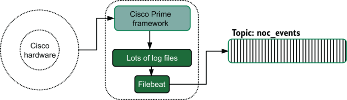

图 15.1 从 Cisco Prime 软件本地发出遥测数据的示例，依靠本地运输阶段组件 Filebeat 将遥测数据移至流主题中。获得此服务器访问权限的攻击者需要与 Filebeat 竞争以修改日志文件，然后才能将日志文件内的遥测数据发送到流。

我们需要讨论日志文件，因为它们是三种本地发射方法中暴露程度最高的。请记住，某些组织将其 Syslog 配置为发送到本地日志文件，因此对于这些组织来说，发送到系统记录器相当于直接发送到日志文件。发送到标准输出是 Kubernetes、containerd 和无服务器等框架的工作方式，在这些框架中，遥测在离开容器或函数后进入运输阶段。在其他系统中，例如在 Linux 上的 Systemd 下运行的系统，发送到 stdout 在功能上等同于发送到系统记录器，这仍然会导致创建日志文件。

4.1.1 节一般讨论从日志文件传送遥测数据。但是，如果完整性是你的遥测系统设计目标之一，那么你需要做的事情比该部分讨论的还要多：

- 遥测数据需要持续发送。某些遥测系统依赖 Cron 或 Windows Scheduler 任务将日志文件从服务器复制到中央 NFS 或共享驱动器。发出遥测数据和日志文件离开盒子之间的长延迟对于攻击者来说是一个巨大的窗口。
- 遥测在发射发生和发送到运输阶段的其余部分之间需要有较短的延迟。低延迟进一步减少了攻击者修改遥测数据的窗口。持续运送是不够的；你最近也需要发货。如果遥测完整性对你的组织非常重要，则需要针对过度的运输滞后创建警报。

> 我们如何经历运输滞后
>
> 几年前，我的公司进行了一项实验，以了解我们的生产代码在较大的云提供商实例上的行为方式。事实证明，我们有很好的垂直可扩展性；更多的处理器并没有让我们减慢太多！我们花了一段时间才注意到，并不是所有的东西都按我们希望的那样扩大了。
>
> 事实证明，我们的日志文件传送严重滞后。在处理了一天的繁重货物后，我们的一些托运人落后了一个半小时以上。随着白天负荷的减少，他们最终赶上了。我们将该问题追溯到我们的托运人中的单线程问题。生产代码在 16 个内核上运行，所有这些内核都写入同一组日志文件。另一方面，我们的日志文件传送程序有一个线程来监视该小组文件的更改。 16:1 的比率足以使日志文件传送器饱和。
>
> 这些信息确定了我们的生产代码的扩展上限，问题不在于生产代码本身；而是问题所在。这是遥测组件。我们将实例类型缩小了一级，这减少了核心数量，并且我们的日志传送程序表现良好。
>
> 我们能否优化日志文件传送器以使其性能更好？确实。但我们正在探索各种选择，因此我们对解决这个问题没有任何紧迫感。我们使用了更多、更小的实例，一切都运行良好。

你需要使用哪些技术来加速托运人的速度取决于你用于运输的方式。以下是有关一些最流行的日志文件传送包的提示：

- Filebeat是基于线程的。每个 `- input` 块处理多个收集器，因此在 `- input` 块之间分割文件将提高并行性。
- Fluentd 具有多进程工作程序功能，允许生成多个工作程序。虽然多个工作人员无法跟踪同一个文件，但如果你有一组文件，则可以专门将工作人员分配给文件以提供并行性。
- Logstash 也是基于线程的。每个 `input {}` 块都有一个线程。因此，如果你遇到我们看到的线程阻塞（请参见侧边栏），请将文件输入移动到许多 `input` `{}` 块中，以最大限度地提高并行性。
- Syslog-ng 默认情况下以多线程运行。如果你正在执行任何过滤器，请确保它们不依赖于 MSG 字段中的信息。

跟踪你的摄取延迟需要做一些工作，但如果你在遥测中跟踪 `hostname` 值，计算延迟的一个简单查询是询问每个主机最近收到的遥测数据有多长。如果该值稳步增加，则表明你的原木运输商存在摄取问题。

> 练习15.1
>
> 你使用的生产系统在快速将遥测数据从生产者手中转移出去方面有多有效？你能做些什么来加速这一运动吗？

### 15.1.2 使用 ACL 强制执行只写遥测

如果你的生产代码被允许修改或删除发出的遥测数据，那么攻击者的工作就会容易得多。使用只写技术发出遥测数据可以防御本地攻击者的修改攻击，并使攻击者更难访问队列和流系统。本节介绍防御此类攻击所需遵循的技术。它涵盖两个领域：

- 使用 ACL 为日志文件创建只写区域
- 使用 ACL 对队列和流进行只写访问

#### 使用 ACL 为日志文件创建只写区域

访问控制列表 (ACL) 对于操作系统来说并不是什么新鲜事，构建可防御的系统意味着你需要了解可用的 ACL 系统。 Windows、UNIX 和 Linux 提供 ACL 的方式不同，但一般技术相似。本节将介绍这些技术。

让我们从 Windows 开始，它具有功能丰富的权限系统。这种复杂性使得可以通过一种易于访问的方式来创建放置日志文件的只写位置。授予 `Write` 权限而不同时授予对目录的 `Modify` 或 `Read-only` 权限，允许程序创建文件，然后写入该文件。如果程序关闭并重新打开文件进行写入，ACL 将允许它这样做。图 15.2 提供了使用 icacls 实用程序配置只写目录的示例。

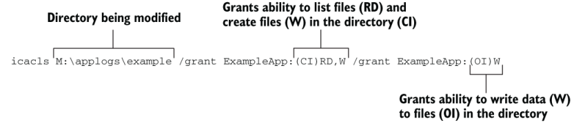

图 15.2 使用 `icacls` 命令为示例应用程序创建只写目录。第一个 `/grant` 参数允许 ExampleApp 用户读取文件列表并在目录中创建文件。第二个 `/grant` 参数允许ExampleApp写入目录中的文件。 （ `create-files` 并不意味着能够写入它们。）这些权限不允许读取或删除目录中的文件。

此示例授予 ExampleApp 用户列出 M:\applogs\ example 目录 ( `/grant` `ExampleApp:(CI)RD` ) 中的文件并在 M:\applogs\ example ( < b2> `ExampleApp:(OI)W` ）。因为我们使用 `CI` （容器继承）来设置列表文件权限（ `RD` ），所以创建的文件（是对象，而不是容器）不会继承 `RD` 许可。当对文件设置 `RD` 权限时，它授予读取该文件的能力。我们同时还设置了 `W` 权限；在容器上下文中， `W` 允许在目录中创建文件。

为了允许写入创建的文件，需要第二个 `/grant` 。此参数为创建的日志文件提供 `W` （写入）权限，允许写入文件。创建的文件不会继承允许读取文件的权限。我们授予 `OI` （对象继承）以确保写入在目录中的新文件上继承。

对于 UNIX，访问控制环境既简单又复杂。它更简单，因为标准 ACL 系统很简单；更复杂，因为（对于 Linux，无论如何）几个可选的 ACL 系统提供了更多的细化。 Windows 允许在给定目录或文件上设置许多访问控制语句，而 UNIX 系统允许一个（除非你使用可选系统之一；稍后会详细介绍）。图 15.3 显示了标准 ACL 系统如何在 Linux 和 UNIX 系统中工作。

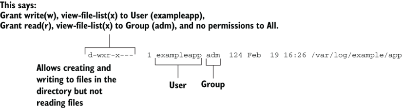

图 15.3 使用 UNIX 系统的内置 ACL 系统的示例，创建一个只写目录来放置示例应用程序的日志。不授予全局访问权限（在 ACL 末尾）。为了确保 exampleapp 用户无法读取文件，该用户不得位于 adm 组中。

将 ACL 设置为仅允许示例应用程序的用户在目录上写入和执行（在目录上，执行位允许列出目录内容），让该用户在目录中创建文件并写入它们。但任何创建的文件都将获得该用户的默认 ACL，其中几乎总是包含读取文件的能力。与 Windows 系统不同，系统操作员可以默认以安全的方式设置权限，而使用默认 ACL 系统的 UNIX 系统需要生产代码来创建具有安全设置的日志文件。

UNIX 和 Linux 中的 `open()` 系统调用允许设置创建的文件的权限，但并非所有编程语言都公开此功能；这个概念不是跨平台的，那为什么要跨平台呢？创建只写位置的困难是 UNIX 和 Linux 系统具有附加的可选 ACL 系统的部分原因。以下是 Linux 中最常见的系统：

- POSIX ACL - 默认 ACL 系统的此扩展允许对目录或文件执行类似于 Windows 的多个权限规范。但是，它需要文件系统支持以及特定的安装选项来启用它，因为重新安装是一个简单的操作，并且你可以使用不同的参数重新安装，因此从卷中删除 POSIX ACL 支持很容易。由于 ACL 强制可以很容易地关闭，因此大多数安全团队并不认为 POSIX ACL 真正可行。
- SELinux — 安全增强型 Linux 是编译到 Linux 内核中的强制访问控制 (MAC) 系统。与 POSIX ACL 不同，SELinux 可以在任何地方强制执行。 SELinux 的工作原理是为每个文件、对象、进程和其他一切提供一个标签，并定义每个标签如何与其他标签交互。此设置允许定义关系，例如允许 exampleapp 访问由logging_platform 创建的套接字，而无需指定文件级权限。 Red Hat 和 SLES 开箱即用地支持 SELinux。
- AppArmor——这个MAC系统也被编译到Linux内核中。它是在 SELinux 之后开发的，旨在提供 SELinux 的大部分优点，但管理接口的方法要简单得多。当进程启动时，它们会被分配一个 AppArmor 配置文件。由于 UNIX 理念是将所有内容视为文件，因此 AppArmor 配置文件定义每个配置文件可以访问哪些文件以及允许配置文件对这些文件执行哪些操作。 Ubuntu 和 SLES 开箱即用地支持 AppArmor。

SELinux 和 AppArmor 在默认权限下协同工作。如果默认权限允许访问，SELinux 或 AppArmor 仍然可以拒绝访问。同时，如果SELinux和AppArmor允许访问，默认ACL仍然会拒绝访问。让我们看一下创建只写日志文件的 SELinux 和 AppArmor 版本。首先是 SELinux（图 15.4）。

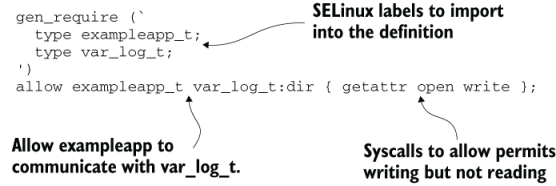

图 15.4 一个 SELinux 类型强制文件示例，它允许我们的示例应用程序在 /var/log 中创建和写入文件，但不能从中读取。此示例假定你已经为 exampleapp 定义了类型。即使文件被标记为允许读取，SELinux 也会阻止读取！

我们看到一个简短的单行定义，它允许 `exampleapp_t` 类型（在其他地方定义）使用三个系统调用之一与 `var_log_t` 类型进行通信。请注意，系统调用不包括 read！这种类型的强制策略允许我们的示例应用程序写入 /var/log，但不能读取或删除它（取消链接系统调用）。该策略与默认 ACL 策略配合使用。我们的示例应用程序仍然无法读取 /var/log/otherapp 中的文件，因为默认 ACL 策略拒绝它。但如果 /var/log/exampleapp/error.log 被标记为允许用户读取它，SELinux 将阻止我们的应用程序读取该文件。接下来，让我们看看 AppArmor 的等效项（图 15.5）。

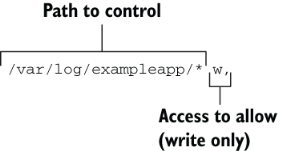

图 15.5 exampleapp 策略中的 AppArmor 策略语句。此示例授予配置文件写入 var/log/exampleapp 中的文件的能力，但不能读取或执行它们。即使默认 ACL 允许应用程序用户读取文件，AppArmor 也会阻止读取。

AppArmor 版本比 SELinux 版本短，部分原因是这个数字只是更大的 exampleapp 策略的一个组件。这一行将添加到ExampleApp AppArmor 策略中，以强制日志记录位置中的文件具有只写性质。在我们的 SELinux 示例中，即使文件被标记为允许示例应用程序用户读取，AppArmor 也会阻止这种情况发生。

使用 MAC 系统还有另一个好处：审计。如果你强制执行 SELinux 或 AppArmor，内核将报告在允许区域之外进行读取的尝试，这是攻击者正在探测边界的潜在迹象。我鼓励你将这些事件纳入系统遥测流中，并认真对待越界访问的报告。大多数时候，访问者将是开发人员在不咨询平台团队的情况下添加功能，但如果不是这样，你会非常高兴自己捕获了这些事件。

#### 使用 ACL 对队列和流进行只写访问

如果你的生产系统直接发送到队列和流，那么它们很可能已经针对队列/流服务进行身份验证以发布遥测数据。本节介绍你需要遵循的技术，以确保获得生产代码访问权限的攻击者无法修改队列或流系统中已有的遥测数据。

如果你的生产代码还使用队列/流系统作为其操作的一部分，则可以很容易地为你的遥测系统使用与生产操作相同的凭据。这种模式是一种明显的反模式，因为你的生产访问几乎肯定包括读/写访问，并且通常还包括配置访问以提供动态队列或流主题。将遥测队列/流视为由另一个团队拥有：你被授予发布事件的能力，但不能修改它们。

警告如果你的生产系统使用队列或流，请始终为生产和遥测使用提供不同的凭据。生产凭证几乎肯定比只写凭证拥有更多的访问权限，这使得它不适合遥测使用。遥测凭证应仅允许发布事件，并且必须明确拒绝生产操作凭证对遥测队列/流的访问。这种分离使得遥测技术更能抵抗攻击，并且来自队列/流系统的审核日志将能够区分生产操作和遥测操作。

Redis于2020年5月在版本6中添加了访问控制系统；早期版本有一个授予全局访问权限的单一密码。如果你使用 Redis 作为流或队列系统（它支持两者），我强烈建议你使用 ACL 系统。创建不同的用户用于生产和遥测使用，并将遥测用户限制为遥测密钥。这里，我们定义两个用户的权限：

```
ACL setuser telemetry_user ~appevents:*
 
ACL setuser prodops_user ~sessions:*
ACL setuser prodops_user ~locks:*
ACL setuser prodops_user ~shadowbans*
```

在这里，我们允许 `telemetry_user` 访问以 `appevents:` 开头的任何键，并为 `prodops_user` 添加对三个键前缀的访问。此代码片段仅适用于 Redis 6 及更高版本，但它是为基于 Redis 的访问设置不同 ACL 的示例。

同样的指南也适用于基于 AMQP 的系统，例如 RabbitMQ 和 Azure 事件中心。使用一个特权较高的凭据进行生产操作，使用另一个权限较低的凭据进行遥测操作。某些系统（例如 RabbitMQ）允许在 AMQP 集群中创建虚拟主机，这允许生产操作和遥测操作之间有更多的逻辑分离。更好的是，使用单独的集群进行生产和遥测使用！将这些故障域分开。

### 15.1.3 使用 SaaS 提供商时的持久遥测

如果你的遥测完全由 SaaS 提供商处理，你就无法避免持久遥测的只写要求。本部分介绍你希望从遥测 SaaS 提供商获得的功能以及安全使用 SaaS 提供商应遵循的使用模式。大多数提供商都意识到这些风险并支持安全使用。

选择用于遥测的 SaaS 提供商时，你想知道是否可以使用无法执行任何其他操作的方法或身份验证令牌向该提供商发送事件。如果攻击者进入你的应用程序（或者你的 API 密钥跟随前员工离开），这种方法可以最大限度地减少影响。泄露给攻击者的只写端点仍然使攻击者能够向你的端点发送垃圾，可能将他们的真正攻击隐藏在大量误导后面。为方便起见，以下是几个常见的遥测 SaaS 提供商及其 API 密钥和摄取端点处理方法：

- Datadog 采用双密钥模型，需要 API 密钥和应用程序密钥才能读取数据。如果你只有 API 密钥，则只能写入数据。不过要小心；你仍然可以使用 API+应用程序密钥写入数据，这将使攻击者在 Datadog 中获得更多访问权限。
- Honeycomb.io 允许创建多个 API 密钥，并可以为每个密钥分配不同的职责。这种设计有些不安全，因为创建一个可以执行所有操作的密钥并在应用程序中使用该密钥很容易。为了安全起见，请创建一个 API 密钥来使用事件 API（以插入遥测数据），并使用不同的 API 密钥来实现其他 API 功能。
- New Relic 提供五种 API 密钥。一种类型是插入键，用于提交遥测数据。最重要的是，New Relic 不提供“万能”密钥！当他们没有这样的密钥时，软件工程师必须有意识地选择他们将执行什么样的操作以及使用哪些密钥。
- Splunk 有一个 HTTP 事件收集器，需要使用收集器专用的令牌进行身份验证。该令牌仅用于将事件发送到 Splunk；它不能用于其他任何用途。
- Sumo Logic 提供只写 Webhook 端点来提交遥测数据，但不支持身份验证（通过模糊实现安全性）。向 Sumo Logic 发送 Webhook 的应用程序除了插入事件之外无法访问 Sumo。

如果你使用 SaaS 提供商进行遥测，请构建生产代码以尽可能仅使用提供商的摄取 API 端点和 API 密钥。在应用程序中混合 API 密钥以提供摄取和更高级的 API 使用是危险的，但在某些情况下是不可避免的，例如提供公开搜索遥测功能的管理门户。与所有安全性一样，请了解当你选择 SaaS 提供商访问方法时应用程序面临的风险。最少的特权是最好的。

> 练习15.2
>
> 如果你的生产系统以任何方式使用 SaaS 平台进行遥测，它们是使用只写密钥，还是为了方便而使用管理员凭据？你需要进行哪些更改才能使用只写密钥发送遥测数据？

## 15.2 让遥测更难被干扰

第 15.1 节介绍了从外部攻击者的角度来看使遥测更难以篡改的技术，而本节主要是关于防御内部攻击者。请记住，设法冒充可信内部资源的外部攻击者被视为内部攻击者，与恶意内部员工相同。我在这里谈论防御的攻击是针对遥测管道和存储本身的。

提醒一旦发出，所有对遥测的访问（包括操作员/根/管理员访问）都必须可追踪，并且修改必须显而易见。

尽可能防止更改，增加在其他地方进行更改的努力，使篡改变得明显，并确保跟踪和跟踪所有遥测访问，以便在事后重建事件。遥测系统是任何组织安全基础设施的核心部分，应该以这种方式对待。希望通过内部访问更改遥测数据的攻击者可以在多个地方进行此操作。图 15.6 显示了攻击集中式日志遥测管道的示例。

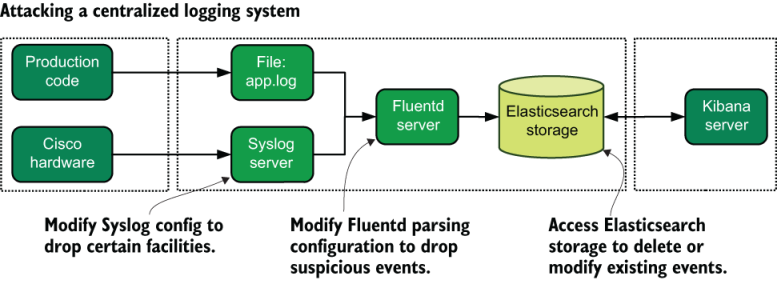

图 15.6 攻击集中式日志管道示例以隐藏可疑事件的三种方法。可以修改思科硬件前面的系统日志服务器来删除防火墙事件，隐藏探测活动。可以修改解析所有集中式日志记录事件的 Fluentd 服务器以删除可疑事件。最后，可以从 Elasticsearch 存储系统中删除可疑事件。如果授权用户正在进行这些更改，最好的防御措施是跟踪更改并确保手动更新的更改很快被授权配置覆盖。

我们涵盖三种防御攻击的广泛技术：

- 检查身份验证和访问控制在提供障碍和启用活动跟踪方面的作用（第 15.2.1 节）
- 捍卫遥测系统配置的完整性（第 15.2.2 节）
- 对遥测进行明显的修改（第 15.2.3 节）

### 15.2.1 使用访问控制要求来防御攻击

我们在 15.1.2 节中了解了操作系统和队列/流级访问控制技术；本节更系统地阐述 ACL 在防守中所扮演的角色。这些概念对于维护任何计算机系统（而不仅仅是遥测系统）的安全性至关重要。如果你从本节中没有学到任何其他内容，请了解两件事：

- 如果可能的话，所有系统都必须支持身份验证，并配置为需要它。
- 还必须跟踪显示这些身份验证尝试的日志（并且可能会分叉到安全团队的 SIEM 系统中）。

为了帮助构建概念，我们需要查看图 15.7 中的通用遥测管道。

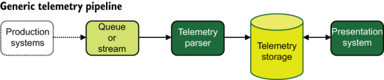

图 15.7 通用遥测管道。任何带有实线的东西都可能受到攻击。虚线框和线已在第 15.1 节中解决。实线和方框代表一般遥测管道中易受攻击的区域。值得注意的是，每个实心箭头代表不同的访问控制系统或需求。

如图所示，遥测数据流入队列或流，由解析器解析，然后注入存储。从那里，演示系统消耗存储空间来为寻求解决问题的人们显示遥测数据。我们花了本书的大部分时间来研究这样的事件流。现在让我们看看应该进行身份验证的区域：

- 遥测解析器需要对队列或流进行身份验证才能获取事件进行处理。它需要将事件从队列中弹出或从流中读取事件，这需要身份验证和授权才能执行这些操作。
- 遥测解析器需要对遥测存储进行身份验证才能插入新的遥测数据。
- 演示系统需要对遥测存储进行身份验证才能获取遥测数据进行显示。
- 如果遥测解析器不是容器或无服务器系统，它可能允许操作员通过 SSH 或其他远程方式登录。
- 如果遥测存储不是 Amazon Elastic search Service 等云提供商系统，则其高度状态特性意味着它也可能允许操作员通过 SSH 或其他远程方式登录。

图 15.7 中的每个实线箭头都是具有不同权限的不同身份验证。这些身份验证和权限集在功能上是应用程序用户，类似于应用程序运行所在的操作系统上的应用程序用户。遥测应用程序使用的用户不得被遥测系统操作员重复用于构建监控基础设施等目的，也不得被操作员自己重复使用。监控和操作员使用应通过不同的凭据来完成。以这种方式构建凭证使用（为单独的用例创建单独的凭证）可确保审核日志正确描述谁执行了哪些活动。

在理想的情况下，每个遥测系统操作员都将在他们可能需要访问的每个区域获得自己的个人帐户。如果你不使用共享管理员帐户，则可以向尝试从审核日志跟踪中重组事件的安全团队提供最多的详细信息。这种方法是最佳实践，但在某些情况下并不实用。

此外，遥测系统操作员不应经常获得可以修改遥测数据的帐户。是的，我们有时需要直接修改遥测数据，作为有毒数据泄漏后清理的一部分（有关该主题的更多信息，请参阅第 16 章），但该访问应该是临时的且有针对性的。同样，这种方法并不适用于所有情况，但它是最佳实践。

### 15.2.2 确保遥测系统中配置的完整性

正如我们在第 15.2 节开头的图 15.6 中看到的，一些攻击针对的是遥测管道中涉及的代码。遥测系统面临的问题与生产代码面临的问题相同：如何防御未经授权的更改。对于已经完成合规性框架认证过程的技术组织来说，最大的挑战之一是处理合规性的一大格言：

> 如果你编写了它，则无法在生产中对其进行编辑。

最重要的想法是为生产带来改变；它经过一系列自动和手动测试和批准，然后才部署到生产中。为了确保生产中运行的内容是经批准在生产中运行的内容，除了灾难响应团队之外，每个人都被锁定在生产系统之外。直接连接到服务器并手动更新代码违反了所有这些谨慎的工作，这就是为什么部署生产代码受到如此坚决的保护。 （所有那些破坏敏捷性的“无用开销”都是有原因的。）

不幸的是，遥测系统代码通常不会像生产代码那样得到同样严格的变更控制关注，部分原因是明显不同的团队可能会生成在遥测系统内运行的代码。但团队文化差异也是部分原因。具有丰富运营背景的团队可能不会考虑为他们的“纯粹的脚本”提供完整的测试套件。

如果你的组织在完整的软件开发生命周期策略下获取遥测系统代码时遇到困难，你可以使用一些其他技术来增加临时更改的难度。这些技术中的第一个是配置管理的概念；第二个是不变性，这是一个相互竞争的哲学。

配置管理因 CFEngine、Puppet 和 Chef 等工具而闻名。自第一代工具诞生以来，我们已经看到 Salt、Ansible 和 Rudder 等产品扩大了空间。你可以在计算基础设施上定义所需的系统状态，配置管理系统会强制执行该状态。如果有人手动更改了某些内容，则该更改将在下次强制执行状态时自动恢复。由于手部变化不会持续存在，因此人们摆脱了手部变化的习惯，并且整个系统变得更加一致。图 15.8 显示了步骤。

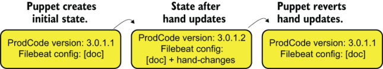

图 15.8 配置管理工作流程示例。操作员对代码版本和 Filebeat 进行手动更改后，在下次执行运行时，Puppet 将恢复手动更改。此方法可确保生产中运行的内容是经批准在生产中运行的内容。

图15.8中的第一个框是配置状态。我们在生产环境中运行特定的代码版本，并且 Filebeat 强制执行其配置文件。然后，遥测操作员介入并进行两项手动更改：更新生产代码并手动更新 Filebeat 配置。当 Puppet 接下来运行时，它将生产代码降级到批准的版本，并将手动更新恢复到 Filebeat 配置。对于对生产变更敏感的组织来说，Puppet 做出变更的事实可能会引起警报。

不变性是一个有点相关的概念，但它假设任何人都不允许进行本地更改。对于Linux服务器来说，这个概念意味着SSH被关闭。 Docker 和 FaaS 是不变性原则的著名应用，但同样的技术也可以应用于服务器。不变性假设配置管理根本不运行或仅针对操作系统级组件运行，因为推送更改的配置管理违反了服务器的不可变状态。

希望遵循不变性原则更改遥测管道的攻击者不会进行本地更改；他们将在部署管道的上游进行更改。如果本地攻击者可以推出遥测包的黑客版本，然后隐藏其部署痕迹，那么这就是你需要解决的漏洞。

请记住，不变性最适合无状态系统，例如遥测解析器和路由器，其中本地存储的状态量以秒为单位。对于保存大量状态的系统，例如运输阶段的流和存储系统，最好通过将这些系统的管理委托给云提供商来实现不变性。如果你无法委托给云提供商，配置管理原则更适合管理有状态系统。图 15.9 显示了 Shipping 阶段的无状态组件和有状态组件之间的区别。

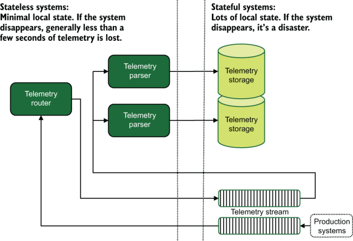

图 15.9 通用遥测管道的有状态和无状态组件。有状态系统包括遥测存储和用于传递数据的流系统。流系统被认为是有状态的，因为它们长期存储流数据。我们的遥测路由器和解析器是无状态的，因为它们只是处理遥测数据并移动它；本地状态最多保持几秒钟。

应使用配置管理来管理有状态系统的指导有一个例外：当有状态系统已构建为完全分布式数据库时。 Elasticsearch 和 MongoDB 就是两个这样的分布式数据库，其构建方式使得单个状态保存服务器的丢失不会造成太大的破坏。诸如此类的系统更能够通过不变的原则进行管理，但需要权衡：

- 如果你使用不可变原则来管理这些系统，则每次进行更改时，你都必须删除服务器并添加新服务器，因此你需要将整个服务器的数据重新复制到该服务器。在此重新复制期间，整个系统对其他故障的恢复能力较差。
- 如果你使用配置管理来管理这些系统，则每次进行更改时，状态仍在系统上；要重新复制的数据量仅限于正在更改的系统不可用时所做的更改。

你需要决定哪一个对你更重要：不变性及其带来的安全性，或在进行更改时最大限度地降低数据丢失的风险。每个组织的答案都会有所不同。

> 当遥测数据不是一成不变的时候
>
> 很容易看看我在这里所说的内容，并决定遥测应该写入一次，然后雕刻到数字石头中。整个遥测系统的构建都考虑到了遥测本身的不变性。作为 SIEM 系统一部分的安全团队处理的遥测类型可能属于这种类型。
>
> 不过，有一个主要的案例反对不可变日志记录。如果你的生产系统处理隐私或健康相关信息等受监管信息，那么受监管信息泄漏到遥测系统的可能性不为零。因此，在构建支持处理受监管信息的生产系统的遥测系统时，必须考虑到有毒数据的清理。清理意味着删除错误记录的数据或编辑记录数据中的信息。
>
> Grafana Labs 的 Loki 集中式日志系统等系统以不变性作为基本假设（至少截至 2021 年），并且它们的整个架构都是在考虑到该假设的情况下构建的。
>
> 返回删除或修改遥测是一个主要问题。第 16 章更详细地介绍了作为有毒数据泄漏一部分的编辑（第 16.2 节）和重新处理（第 16.3 节）日志记录，但我需要在这里提出不可变日志记录的含义。如果你的日志系统需要偶尔在泄漏后进行清理，那么使用不可变的日志模式是一个坏主意 - 至少在你对日志记录受监管信息的防御变得更加可靠之前是这样。

### 15.2.3 让改变变得明显

遥测防御的第三条腿是使遥测中的任何变化变得明显。本节介绍数字签名、校验和、加密以及以其他方式使遥测修改显而易见的技术。截至 2021 年，开源演示阶段系统在构建时通常不会考虑到对此类验证模型的支持，但如果你正在为你的组织开发演示阶段系统，你就有机会推进该领域的发展。我在本节中讨论两个广泛的主题：

- 加密哈希在遥测中的作用
- 加密如何与遥测结合使用以及基于加密的保证系统面临的挑战

#### 加密哈希在遥测中的作用

本节介绍遥测中加密哈希的使用。哈希为你提供了一种方法来检查自生成哈希以来遥测是否已更改。使遥测防篡改的一种常见模式是提供给定字段的加密哈希，如果哈希与字段内容不匹配，则以某种方式标记该不匹配。下一个代码片段显示了 `message` 字段以及一个 `message_256` 字段，其中包含 `message` 字段的 `sha256` 哈希值：

```
message: "This is telemetry"
message_256: "82ca206123ed9fddaf0574e6992d827ac51acf88ed2ec68e854b6469b5e722ed"
```

正如本节简介中提到的，开源表示系统目前没有开箱即用的方法来指示字段何时未通过哈希检查。如果是这样，为什么添加哈希是一种常见模式？有两个很大的原因：

- 当你进行安全调查时，使用散列字段可以更轻松地检测被篡改的事件。
- 由于运输阶段的工作是修改遥测（请参阅第 3、4 和 6 章），因此它处于验证来自生产系统（或另一个运输阶段组件）的哈希值和实时警报的主要位置如果它捕获到哈希失败。

图 15.10 显示了当结构化记录器创建遥测的哈希值时此过程如何工作，并由解析器在运输阶段进行检查。

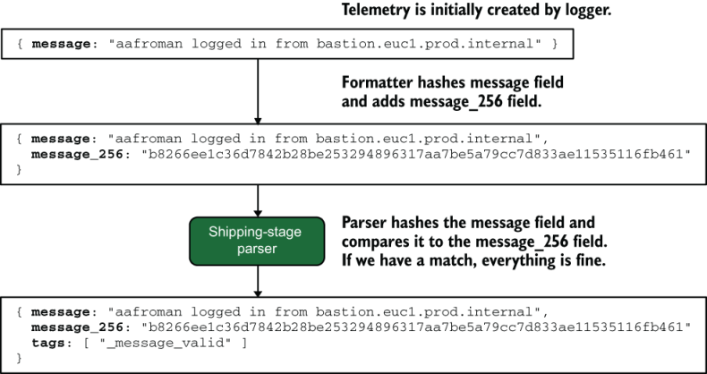

图 15.10 运输阶段如何检查结构化记录器格式化程序添加的哈希。遥测数据进入记录器，格式化程序添加一个新字段，其中包含消息字段的 `sha256` 哈希值。带有哈希值的遥测数据被发送到运输阶段。运输阶段解析器通过散列消息字段并将其与 `message_256` 字段进行比较来验证遥测数据。如果计算出的哈希值与 `message_256` 字段匹配，它会向消息添加一个标记，表明它发现遥测哈希值有效。如果后来的调查显示哈希值不匹配，则标签的存在表明遥测数据在运输阶段解析器看到它后被修改。

与所有标记和丰富（参见第 6 章）一样，散列可以应用于发出和运输阶段。当散列作为发射阶段的一部分完成时，如图 15.10 所示，它被认为是标记。 （我们在第 12 章中研究的结构化记录器将添加哈希字段作为格式化程序的一部分，与我们添加时间戳字段的方式相同。）如果运输阶段添加哈希，那么这更像是一个丰富步骤，因为遥测可能会已被合法修改。事实上，运输阶段可以根据遥测添加更多哈希字段，它从发射阶段接收到的信息丰富了！

> ***警告*** 对字段进行哈希处理时要小心字符串编码。对于人眼来说，以 UTF-16 编码的字符串看起来与以 UTF-8 编码的字符串相同，但它们计算的哈希值会不同。当你在优先使用 UTF-16 字符串的平台（例如 Java）中工作时，请确保你明确了解字符串编码，并且遥测管道的所有阶段都将保留你的标准格式。除非另有说明，像 Logstash 这样的平台将悄悄地重新转换为 UTF-8，这将破坏在不同编码的字符串上生成的哈希值。

为了向你提供此过程的简要示例，让我们看一个综合示例。清单 15.1 和 15.2 一起使用 Logstash 和 Ruby 脚本演示了哈希创建和验证过程。清单 15.1 是 Logstash 配置，它创建了三个事件。每个事件都应用了消息字段的哈希值；变异过滤器改变其中一个事件，使得消息字段与散列不匹配；调用 Ruby 脚本来验证哈希值；最后，事件被发送到日志文件。

清单 15.1 Logstash 配置演示哈希生成和检查

```json
input {
  generator {                                      ❶
    lines => [                                     ❶
      "This is an event",                          ❶
      "Another event",                             ❶
      "Changed event"  ]                           ❶
    count => 1                                     ❶
  }
}
 
filter {
  fingerprint {                                    ❷
    source => message                              ❸
    target => message_256                          ❹
    method => "SHA256"                             ❺
  }
 
  mutate {                                         ❻
    gsub => [ "message", "Changed", "Altered" ]    ❻
  }                                                ❻
 
  ruby {                                           ❼
    path => "/etc/logstash/hash_check.rb"          ❼
  }                                                ❼
}
 
output {
  file {
    path => "/tmp/filtered.log"
    codec => "json_lines"
  }
}
```

❶ 事件生成器，用于测试，创建三个事件。

❷ Fingerprint {} 生成我们将测试的哈希值。

❸ 哈希值是根据生成器 {} 创建的消息字段的内容生成的。

❹ 将生成的哈希值放入 message_256 字段中。

❺ 使用的哈希函数是SHA256。

❻ mutate {} 过滤器修改一个事件，以测试哈希匹配失败。数组是字段，要替换的文本，替换文本。

❼ 调用列出的 ruby 脚本（参见清单 15.2）来验证哈希匹配

运行此代码时，filtered.log 文件应如下所示：

```json
{
    "message_valid": true,
    "@timestamp": "2023-02-19T00:18:13.939Z",
    "message": "This is an event",
    "message_256": "b39d2a3411ed3575023b912a05f85172571022d93f65ad2b335450dcc5edc55e",
    "host": "parser.euc1.prod.internal",
    "sequence": 0,
    "@version": "1"
}
{
    "message_valid": true,
    "@timestamp": "2023-02-19T00:18:13.940Z",
    "message": "Another event",
    "message_256": "57fd7fd1e61b532b820e10dd315957d76a9ebe416a8c190885a8b1effd57370e",
    "host": "parser.euc1.prod.internal",
    "sequence": 0,
    "@version": "1"
}
{
    "message_valid": false,
    "@timestamp": "2023-02-19T00:18:13.943Z",
    "message": "Altered event",
    "message_256": "ef95a48a219c20cc432772ddd50bc21610093d886cc48958ec08f51e52dd93e5",
    "host": "parser.euc1.prod.internal",
    "sequence": 0,
    "@version": "1"
}
```

我们看到两个事件的 `message_valid` 设置为 `true` ，一个设置为 `false` 。 `message_ 256` 字段由 `fingerprint {}` 过滤器创建，这是你在运输阶段添加保证的技术。 `mutate` `{}` 过滤器更改的事件 - 将 `Changed event` 变为 `Altered event` - 被 `ruby {}` 过滤。为了了解我们是如何做到这一点的，让我们看看 `ruby {}` 过滤器调用的 Ruby 脚本（在清单 15.2 中）。 `ruby {}` 过滤器调用的任何脚本都需要为每个事件调用并执行过滤的 `filter()` 函数。

清单 15.2 清单 15.1 中 Logstash 配置的 Ruby 帮助程序脚本

```ruby
def filter(event)                               ❶
  msg  = event.get('message')                   ❷
  hmsg = event.get('message_256')               ❷
  Thread.current['message_check'] ||= OpenSSL::Digest::SHA256.new                ❸
  hasher = Thread.current['message_check']      ❸
  test = hasher.hexdigest(msg.to_s)             ❹
  if hmsg == test                               ❺
    event.set('message_valid', true)            ❺
  else                                          ❺
    event.set('message_valid', false)           ❺
  end                                           ❺
  return [event]
end
```

❶ 必需的函数filter()，为每个事件调用

❷ 获取message和message_256字段进行测试

❸ 线程安全地创建哈希检查函数（如果尚未创建）。

❹ 生成当前消息字段的 SHA256 哈希值

❺ 测试生成的哈希是否与存储的哈希匹配并适当设置 message_valid

过滤器的内容非常简单。我们从事件中获取 `message` 和 `message_256` 值，计算 `message` 字段内容的 SHA256 总和，然后检查计算出的哈希值是否等于 `message_256` 字段的内容。如果是，则将该事件标记为有效。如果不是，则将该事件标记为 false。我们在图 15.11 中看到了这个流程。

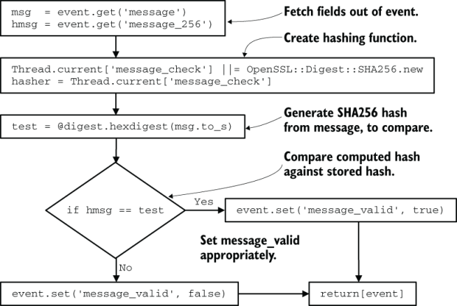

图 15.11 验证清单 15.1 中 Logstash 管道中的字段哈希时的执行流程。该执行来自清单 15.2。如果在计算存储的哈希值和我们尝试验证它之间消息字段的内容发生了变化，则该函数会将 `message_valid` 字段设置为 `false` ，指示潜在的篡改。

此示例显示验证管道内的哈希值。我使用 Logstash 是因为它是一个通用的 Shipping 阶段，专为移动遥测任务而构建，但这种方法带有一些性能和可维护性警告。在 Logstash 中使用 `ruby {}` 过滤器通常会减慢速度，因此如果性能很重要，请尽量减少使用该过滤器的频率。在像 Logstash 配置文件这样的特定领域语言和像 Ruby 这样的语言之间切换意味着负责维护此管道的任何人都必须足够流利地使用这两种语言才能维护这两种语言。 `ruby {}` 过滤器功能强大，但它增加了团队成功维护过滤器所需的基础知识。如果你必须使用 `ruby {}` 过滤器，这里有一些提示：

- 保持功能简单，以减少非你人员在可维护性方面的认知负担。
- 这些插件在 Logstash 的 Ruby 语言插件上下文中运行（从版本 7.13 开始，大多数插件都是 Ruby 语言插件），该上下文是多线程的，因此在构建脚本时请考虑线程安全。
- 尽量不要使用它。内置插件经过严格优化，因此如果你可以使用它们，就使用它们。
- 正如我们在第 11 章中讨论的正则表达式一样，将条件格式化为仅在确实需要它的遥测上运行 `ruby {}` 过滤器。这种方法将提高性能。

当涉及到将哈希应用于字段时，Logstash 并不是唯一具有开箱即用功能的运输阶段工具。以下是一些常见的：

- Elastic 的 Logstash 附带 `fingerprint {}` 过滤级插件，它可以创建任意遥测字段的哈希值。
- Elastic 的 Beat 工具套件（Filebeat、Journalbeat 和 Auditbeat 是本书中最重要的）有一个 `fingerprint` 处理器，其工作方式与 Logstash 指纹识别器类似。
- fluent-plugin-genhashvalue (http://mng.bz/2z7a) 是 Fluentd 的一个插件，它将为给定的键集创建一个哈希值。与 Elastic 产品的 `fingerprint {}` 不同，此插件只能在一个事件上运行一次。

到目前为止的示例都是简单的哈希值，即判断遥测数据已被篡改的方法。如果我们想使用更强大的东西，例如在遥测中提供数字签名来验证它是由受信任的一方创建的，该怎么办？对于这项任务，我们需要讨论加密。

#### 加密如何与遥测一起工作

每当将加密引入流程时，也会带来加密带来的所有可维护性问题。本节为你提供如何避免主要陷阱的指导。此警告适用于完全加密和加密数字签名。

为什么要在遥测系统中使用加密或数字签名？以下是几个原因：

- 将最初发出的遥测数据与未加密的遥测数据并排加密，可以为安全事件响应者提供有关遥测数据已更改的内容的提示。
- 加密提供了一种更安全的方式来处理有毒信息，例如隐私和健康相关信息。
- 与散列（参见上一小节）相比，数字签名遥测数据可以更强有力地保证遥测数据最后是由受信任方修改的。
- 数字签名通过使更改防篡改来提供散列的所有优点。

遥测系统加密的最大挑战是支持所需的保留期。安全团队使用的 SIEM 系统通常具有以年为单位的保留期限，其中七年是从财务会计法规继承而来的常见期限。集中式日志系统通常具有类似的保留期，尽管它们的大部分时间都花在离线存储上。区分损坏的加密和足够好的加密的门槛正在不断变化，七年的时间足以包括这样的举措。加密系统在设计上就很脆弱 - 如果有人更改了某些内容，你希望加密或验证失败 - 因此你必须在遥测系统设计中适应这种脆弱性。为了探索加密技术如何支持遥测系统，我将描述两种不同的加密使用模型：

- 使用公钥加密技术允许发射阶段的结构化记录器在源头对发射的遥测数据进行加密
- 在运输阶段使用公钥加密来验证接收到的遥测数据是否由受信任方最后修改

让我们看看从源头上加密遥测数据。在这里，公钥被发送到生产系统，以允许它们安全地加密遥测数据。此方法允许将发送的遥测数据的加密版本与纯文本版本一起发送，发送阶段将对其进行标记和丰富。图 15.12 显示了一个示例。

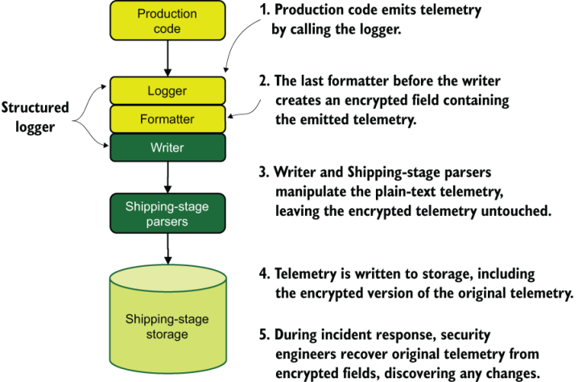

图 15.12 加密最初发出的遥测数据以支持以后的安全调查。这五个步骤会产生完全标记/丰富的遥测数据，这些遥测数据与完全加密的原始遥测数据一起存储。对于拥有私钥的安全调查员来说，解密原始遥测数据可以揭示自原始加密以来遥测数据发生了哪些变化。

图 15.12 中的过程创建并行遥测：将由运输阶段修改并可在演示阶段搜索的纯文本，以及只有拥有私钥的人才能读取的原始遥测的加密版本。值得注意的是，该模型中的加密数据仅由少数人使用。这种方法相对容易构建，因为在管道中只执行加密操作，这意味着解密、签名验证和安全处理私钥的麻烦不需要自动化。

当我们考虑在遥测管道中使用数字签名时，事情会变得更加复杂（并且更具防御安全性）。在这里，创建或修改遥测数据的每个进程在完成时都会对遥测数据进行加密签名。我们在图 15.13 中看到了这个过程。

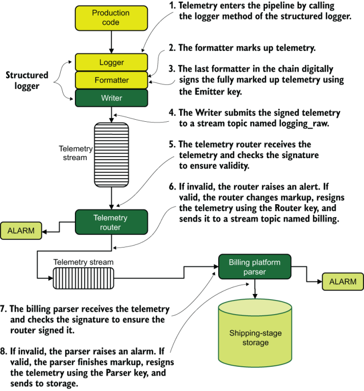

图 15.13 使用三个单独的签名密钥的集中式日志记录管道在管道的多个阶段提供保证。在这八个步骤中，遥测数据被签名三次：由生成遥测数据的发射器、由将其转发到解析器的路由器、最后由解析器签名。如果任何步骤未通过签名验证，则会发出警报。

图 15.13 中的过程比图 15.12 中的过程复杂得多，因为发生了更多的加密操作。我们看到数字签名被应用在三个不同的地方：

- 在步骤 3 中，当结构化记录器的最后一个格式化程序使用 Emitter key 签署遥测发射时
- 在步骤 6 中，当路由器使用路由器密钥签署标记的遥测数据时
- 在步骤 8 中，当计费平台解析器在存储遥测数据以供搜索之前使用解析器密钥对丰富的遥测数据进行签名时

由于以数字方式签署某些内容需要访问私钥，因此此遥测管道需要将私钥发送到系统中的三个位置，包括风险最大的位置：运行生产代码的网络边缘。安全地分发私钥是一个存在许多降低安全性的陷阱的过程。这种遥测方法提供了高度的保证，任何遥测篡改都将在飞行中立即检测到，并且提供了在存储遥测后检测篡改的可能性。

加密是一个故意脆弱的过程，这使得依赖于加密/解密周期的遥测管道更加脆弱。这种脆弱性意味着 Logstash 和 Fluentd 等现成的 Shipping 阶段引擎不具备对数字签名和加密的本机支持，因为加密边缘情况多种多样，以至于编写通用框架是有问题的。图 15.12 中的方法仅对原始遥测数据进行加密作为发射阶段的一部分，这是可支持的，因为在运输阶段不会发生解密或验证操作。图 15.13 中的方法具有多个签名/验证/签名周期，需要构建某种类型的自定义代码。如果你想建立一个像图15.13所示的方法那样的强保证系统，那么你需要解决以下痛点：

- 如果结构化记录器的编写者默默地重新编码字符串（例如将 ASCII 编码为 UTF-8），则格式化程序创建的任何数字签名都将被破坏。确保结构化记录器的格式化程序和编写器组件在字符串编码方面非常清晰。
- 如果你的队列、流或其他遥测传输方法默默地重新编码字符串，则任何数字签名都将被破坏。确保你构建的系统能够处理这些字符串转换。
- 如果你的存储系统默默地重新编码字符串或更改浮点数的精度，则最后一个数字签名将被破坏。
- 密钥过期会破坏你的遥测系统，就像忘记更新网站上的 SSL 证书会破坏你的网站一样。为了避免这种中断，你需要创建一个系统来安全地更新签名/加密密钥。此外，你需要将密钥更新传达给验证阶段，以便他们知道会发生更改。使用链接到证书颁发机构的公钥加密技术将有所帮助，但会将问题转移到过期的证书颁发机构。
- 私钥和公钥分发的任何失败都将导致至少部分遥测中断。将此失败案例构建到你的服务产品中（修改你的服务级别协议，以使用 SRE 术语），以便你的遥测用户更好地了解你的可用性承诺。

对遥测数据进行数字加密或签名并不是每个组织都需要做的事情，但在考虑更新遥测系统时，你应该就这些技术进行对话。当你需要强有力地保证遥测数据未被篡改时，你可以选择这些方法。初创公司可能还没有必要采取这一步骤的风险，而进入医疗保健市场的公司可能会发现自己突然不得不使用这些技术。由于这些技术至少需要一些自定义编码，因此它们更适合中型和大型组织。 （有关按规模和类型划分的组织细目，请参阅第 2 部分。）

> 练习15.3
>
> 防御遥测攻击者的两个关键原则是什么？
>
> 1. 生产系统应使用只写方法发出。
> 2. 遥测数据必须通过加密通道传输。
> 3. 一旦发出，所有对遥测的访问都必须可追踪，并且修改必须显而易见。
> 4. 避免使用日志文件，因为攻击者可以更改它们。

# 概括

- 遥测系统在安全事件中非常有用，这就是为什么攻击者试图破坏或颠覆它们以隐藏其踪迹。
- 作为遥测系统维护者，你的目标是尽可能防止遥测更改，并增加在其他地方进行更改的工作量。这种方法使攻击者的工作变得更加困难，并增加了你随后追踪他们的活动的机会。
- 合规性和监管框架通常需要系统设计，这使得内部人员更难进行更改。由于大多数成长型组织在创建产品（和遥测系统）后都会遇到这些框架，因此他们必须向现有系统添加保证功能。
- 生产系统应使用只写方法发出遥测数据，这使得攻击者更难利用生产系统来更改遥测数据。
- 一旦发出，对遥测数据的所有访问（包括操作员/管理员/根访问）都必须可追踪，并且修改必须显而易见，以确保记录的遥测数据仍然是生产中发生的情况的真实记录。
- 与其他方法相比，发送到日志文件使攻击者有更多机会更改遥测数据，因此计划尽快摄取和发送日志文件内容。
- 遥测数据需要不断地从日志文件中传送，而不是批量传送，这大大减少了攻击者的风险。
- 遥测在发射发生和发送到运输阶段的其余部分之间需要具有较低的延迟，从而进一步减少攻击者必须进行更改的时间。
- 创建一个只写的位置来放置日志文件通常可以通过操作系统权限来完成。授予写入权限，但不授予读取权限。
- 在 Windows 系统上创建只写目录是最简单的，因为访问控制系统允许 UNIX/Linux 系统通常缺乏的复杂性。
- SELinux 和 AppArmor 是 Linux 的强制访问控制系统，允许复杂的权限定义，从而为应用程序创建真正的只写目录。
- 当你使用队列或流系统进行遥测和生产访问时，请勿对生产工作和遥测工作使用相同的凭据。相反，请使用单独的凭据：将遥测凭据设为只写，并拒绝生产凭据对遥测通道的访问。
- 当你选择遥测 SaaS 提供商时，请确保提供商提供通过只写 API 令牌或方法提交遥测的方法。不惜一切代价避免使用管理令牌（如果提供）来发送遥测数据。
- 所有遥测系统（例如队列、流和 API）都必须支持身份验证，并且如果可能，必须配置为需要身份验证。还必须跟踪显示这些身份验证请求的日志，并可能将其传输到你的 SIEM 系统中。此方法为安全性提供了一种在事件期间跟踪事件的方法。
- 理想情况下，遥测系统操作员将在他们需要访问的每个系统上拥有单独的帐户，而不是使用共享帐户。这种方法可以为安全团队在事件期间重新组合事件时提供最高分辨率的详细信息。
- 出于许多相同的原因，遥测系统内的代码需要采用与生产代码相同的变更控制技术。
- CFEngine、Puppet 和 Chef 等配置管理工具对于强制执行遥测配置的批准状态非常有用，这使得临时更改更难实现。
- 不变性是一个相关的概念；你设计你的系统，这样就没有人可以改变。 Docker 和 FaaS 是这种模式的著名例子，但服务器和虚拟机也可以变得不可变。
- 攻击不可变系统可能需要攻击不可变系统的部署方法，因此也要保护这些系统。
- 遥测的加密散列对于使遥测的更改变得显而易见非常有用；存储的哈希值和新计算的哈希值不匹配。
- 安全团队可以在遥测中使用哈希来隔离可能被攻击者修改的遥测。
- 运输阶段组件可以使用散列来确保传入的遥测数据未被修改，并在修改时发送警报。
- 如果你使用哈希值，字符串编码就是地雷。许多系统会默默地重新编码字符串，例如从 UTF-16 重新编码为 UTF-8，这会默默地破坏使用先前编码生成的哈希。你需要在每个步骤中明确使用字符串编码，以确保你的哈希值将继续验证遥测数据。
- 加密和数字签名在遥测系统中很有价值，因为它们提供了强有力的保证，确保遥测数据的最后修改是由可信方修改的，而不是由某个发现你使用未加盐的 SHA256 哈希值作为校验和的黑客修改的。
- 遥测系统加密面临的最大问题是保留期；在某些情况下，你确实需要能够验证签名或解密长达七年的数据。
- 在遥测管道内使用数字签名来验证受信任方所做的更改需要安全地分发私钥，这很容易出错。