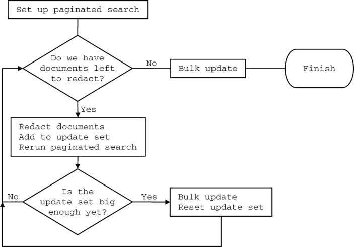

# 编辑和重新处理遥测数据

本章涵盖

- 识别有毒数据及其来源
- 有毒数据泄漏后的清理
- 减少有毒数据泄露的范围
- 对冷库进行再处理以提高可恢复性

你可能想要重写存储的遥测数据有两个重要原因：

- 受监管的信息（例如隐私和健康相关信息，有时还有财务信息）以某种方式进入你的遥测系统，需要在你的组织向客户和用户通知违规行为（编辑）之前将其删除。我将此类信息称为“有毒数据”，因为此类信息需要特殊处理，并且如果出错会受到严厉的处罚。
- 升级遥测存储系统通常意味着需要重新格式化备份或数据库以确保可恢复性，或者用另一种遥测系统替换一个遥测系统，必须将旧遥测数据导入新系统（重新处理）。

本章是关于处理这两个问题，这肯定会同时发生！升级/更换存储时，你有很好的机会编辑遥测系统中不需要的内容。尽管我在本章中讨论的大部分内容都集中在有毒信息清理上（这是一个更复杂的问题），但重新处理对于遥测系统的长期维护同样重要。

这些维护任务很容易被忽视，尤其是在规模较小但正在成长的公司中。合规性和监管框架迫使你关注这些问题，因此许多成长中的公司在试图实现合规性时必须偿还多年的技术债务。尽管针对健康信息的严厉处罚法规已经存在了几十年，但具有类似处罚措施的隐私法规相对较新，欧洲通用数据保护条例 (GDPR) 直到 2018 年才生效，其他法律此后也开始生效。这种监管的最新性意味着某些输入（姓名、地址、电子邮件、电话号码等）的默认安全处理尚未内置到编程语言和框架中。

尽管安全默认设置将在 2020 年代得到改善，但我们大多数人所使用的系统并非构建在安全处理隐私/健康信息的平台上。遥测系统是隐私和健康信息的主要泄漏点，因此预计遥测系统将开始采用功能来更好地处理它们。在此之前，请了解如何编辑和重新处理你的遥测数据以确保安全。

## 16.1 识别有毒数据及其来源

数据毒性是我对需要特殊处理、泄漏通知、清理要求以及不遵循这些程序的严厉处罚的数据的术语。直到 20 世纪 70 年代左右，环境法规基本上才开始对有毒物质进行监管，但 50 年后，有毒数据开始进入监管领域。本节介绍有毒数据的构成以及它如何进入遥测系统。有毒信息主要分为三种类型。

- 金融信息——几十年来，金融机构及其监管机构一直将第一种有毒数据视为此类数据，尽管支付卡行业需要在银行之外提供和执行处理标准。该标准称为支付卡行业数据安全标准（PCI/DSS）。
- 健康信息——第二种获得广泛接受的有毒数据，健康记录的计算机化（以及由此带来的共享便利性）推动了健康隐私监管，例如美国健康保险流通与责任法案（HIPAA）。该信息也称为 ePHI（电子受保护健康信息）。
- 个人身份信息 (PII)——PII 是第三种获得认可的有毒数据。欧盟的 GDPR 是第一个全面的法规，并在世界各地的州、省和国家启动了一系列其他法规。

随着监管机构根据对数据使用的更好理解来更新标准，定义这三种有毒数据之一的标准会随着时间的推移而发展。例如，在 GDPR 之前，用户用于访问服务的 IP 地址通常不被视为与家庭住址和电话号码相同的私人信息。如果你的组织处理三种受监管的有毒数据类型之一，请确保你的遥测系统无法轻松收集和显示新分类的信息类型。 （有关删除已处理的新分类信息的更多信息，请参阅第 16.2 节。）

第四种有毒数据与其他三种有所不同：安全信息。此类数据包括纯文本密码、私有加密密钥、密码哈希、API 密钥以及任何其他允许查看遥测数据的人冒充其他人或访问他们无权查看的内容的数据。政府机构不会因为安全信息处理不当而给你的组织带来麻烦（除非你正在处理政府机密；那么你会遇到比你想要经历的更多的麻烦），但需要将其视为有毒数据，与其他种类相同。此类有毒数据所带来的风险是声誉风险；如果全世界发现你没有安全地处理此类数据，每个人都会停止使用你的服务。

如果可能的话，不要在遥测系统中显示有毒数据。针对有毒数据的特殊处理规则使得访问遥测变得更加困难，这使得你的遥测系统整体上更难使用。当你难以访问你的遥测系统时，人们就会停止使用它们，或者更糟糕的是，他们会制作自己的遥测系统，而不受你构建的防御的影响，这会导致泄密和官方处罚。

图16.1显示了泄露有毒信息被抓的处罚，处罚非常严厉。处罚分为五种：

- 在一段时间内拒绝处理此类信息 — 如果严重违反 PCI/DSS，支付卡行业将禁止你处理信用卡和借记卡。这种处罚使几乎所有年轻公司破产或将它们转移到只接受直接银行转账和加密货币的利基市场。
- 巨额罚款——监管机构知道企业了解金钱，因此他们会让违规行为造成经济损失。更糟糕的是，此类罚款通常会公开，因此该组织的声誉也会受到重大打击。
- 公开承认发生了违规行为——强制披露法强制违规组织通知受影响的人或公开披露发生了违规行为。没有一家公司喜欢承认错误，这就是为什么监管机构强制采取这一步骤，以此来牢记“不违规”的教训。
- 明确分配民事责任——法规和法律明确规定，受泄露信息影响的各方有权提起损害赔偿诉讼，可能采取集体诉讼的形式。
- 加强监管审查——有时，违规行为意味着监管机构将在未来几年内格外严厉地审查你的组织，以确保不再发生违规行为。由于需要监管机构批准变更，这种额外的关注通常会减慢内部流程，有时会迫使内部流程发生变化，以在事件解决后很好地安抚监管机构。


图 16.1 对有毒数据处理不当的处罚是严厉的，可能会让你的组织破产。

人们绝对会因为违反（有意或无意）数据处理规则和法规而失去工作，并且在某些情况下，他们可能会被追究刑事责任。如果你的生产系统处理有毒数据，则你的遥测系统无意中处理有毒数据的可能性不为零。你需要害怕这些东西。

有毒数据通过两种主要方式进入遥测系统。第一种方法是编程异常。每种编程语言都会引发异常，其中大多数允许发出的不仅仅是“ `crashed :(` ”。事实上，堆栈转储很常见。不幸的是，发出导致异常的参数也是如此。参数对于诊断程序以这种方式终止的原因非常有用，但在安全处理有毒数据方面它们绝对是邪恶的。采取以下异常示例：

```
ExampleClass::VroomBoxFault at vroombox.vbr:192 with
[ speed = -999,
  firmware = "4.3.19.02",
  account_id = "0009121205",
  make = "Audi",
  model = "CRX-11",
  license = "US:NM:0000SU",
  owner = "John Rutherford",
  notification_email = "jruth73@example.com"
]
```

首先，速度是一个可疑的负数，这可能是抛出 `VroomBoxFault` 的原因。但此例外还包括两项隐私信息：全名和电子邮件地址。为什么会有这些信息？

有时，编程语言默认转储这些详细信息，并且由工程师决定异常转储中包含多少详细信息。有时，工程师会无条件序列化功能参数，并相信 PII/ePHI 不会出现在其中；更糟糕的是，他们不明白自 GDPR 以来，电子邮件地址就被视为 PII，如以下无条件转储所示：

```
catch ExampleClass::VroomBoxFault
  logger.warn("Broke my toe sending an email notice. Params: " + toJson(params))
```

意识到其中两个字段的特权性质的工程师可以重写此代码以使其更安全：

```
catch ExampleClass::VroomBoxFault
  safe_params = []
  safe_params.add(params["speed"])
  safe_params.add(params["firmware"])
  safe_params.add(params["account_id"])
  logger.warn("Broke my toe sending an email notice. Params: " + toJson(safe_params))
```

包括 `account_id` ，但汽车或车主的任何识别细节都没有促使我们的调试工程师使用生产系统及其所有访问保护措施来查找其他可能的参数。此方法是记录异常的更安全的方法，你可以立即执行。

一种更安全的模式是不要像我们上面所做的那样序列化为字符串，而是将哈希值传递给日志记录函数。这种方法允许你在记录器中创建中间件以自动排除有毒数据。第 12 章和第 14 章介绍了结构化记录器（第 12 章）以及通过使用结构化记录器限制最终出现在日志流中的数据类型（第 14 章）的方法。第 16.4 节讨论了在无法使用结构化记录器时安全处理高风险遥测的第二种技术。

除了例外情况之外，遥测流中有毒数据的另一个主要来源是无条件回显用户提供的输入作为遥测的一部分。与我刚才谈到的异常类似，了解用户提交的内容非常有助于调试出了什么问题。然而，如果用户提交的内容通常包含 PII，则他们的错误值可能会包含 PII。为了进行演示，请使用以下日志语句：

```
logger.warn("Invalid payload for API call. Got: " + api_payload.to_string)
```

该语句对于找出错误的 API 调用非常有用，但忽略了数据安全。如果错误的有效负载是一个 JSON 块，其中最后的 } 被删除，从而使 JSON 无效，则数据结构的其余部分会存在，并且现在位于你的遥测流中。如果 API 调用提交隐私或健康相关信息，你的遥测系统中就会包含该信息（图 16.2）。


图 16.2 无条件发出不良参数如何导致健康信息泄露。 API 调用没有有效的 JSON 结构，该结构会直接发送到日志中，包括所有麻烦的健康信息。不要这样做。

有更安全的方法来处理错误输入类型的日志记录，我将在 16.4 节中讨论它们。现在我们知道了这些东西是如何进入管道的，让我们来谈谈如何处理它。

> 练习16.1
>
> 以下哪一项不是有毒数据进入遥测流的最常见的两种方式之一？
>
> 1. 工程师记录参数作为正常记录的一部分
> 2. 包含参数的异常日志
> 3. 记录未经编辑的用户提供的输入

## 16.2 编辑有毒信息泄漏

第 16.1 节描述了什么是有毒数据，以及不安全处理数据的处罚（罚款、让你的组织难堪、诉讼，有时还有刑事诉讼）。本节介绍如何处理进入遥测系统的有毒数据（而不是隐藏在办公桌下直到律师离开）。编辑是删除或屏蔽信息的过程，如果你意外存储了有毒数据，则必须执行此操作。

在进行编辑之前，我们需要检查当你在遥测系统中发现有毒数据时会发生什么。也许其他人发现了它并来找你，想知道该怎么做。也许你找到了。无论来源如何，作为遥测系统操作员，你都有责任向适当的人员报告潜在的责任：

1. 向你的安全、合规或（如果你有的话）数据控制团队报告泄漏事件。这一步开始了这个过程，你等待的时间越长，你以后需要清理的混乱就越大。对于某些类型的有毒数据，在某些监管框架下，如果不及时报告泄漏，你个人可能会受到处罚。
2. 与团队合作以确定问题的普遍程度。此步骤确定问题的范围。你将担任遥测系统专家。与你合作的团队将尝试确定有多少人访问了有毒数据，评估风险，并判断是否应该触发更严格的事件响应。在大多数情况下，这一步进行得很快，很快就能追踪到一行代码，并且不会走得太远。
3. 与团队合作确定行动计划。响应会有所不同，但这是第一次要求你删除有毒数据。泄漏数据的代码将通过你的组织用来将代码推送到常规开发周期之外的任何修补程序或其他紧急错误修复方法来解决。根据修复生产代码所需的时间，你最终可能会多次执行修订步骤。
4. 堵塞泄漏后执行最终编辑。现在泄漏已修复，你可以执行最后一项编辑来清理泄漏的所有痕迹。你是否需要检查离线存储并在那里进行编辑（重新处理；请参阅第 16.3 节），你将与数据控制和安全团队进行对话。

为了演示这个过程是如何工作的，让我们看一个非常常见的例子。我们的示例组织在其网站上有一个用 JavaScript 编写的支持小部件，它与服务器上的 API 进行通信。我们不需要了解更多信息，只需知道 JavaScript 将数据发送到特定的 API 即可。 API 背后的代码被连接到一个集中式日志系统，如图 16.3 所示。


图 16.3 我们的编辑示例的遥测系统。 API 背后的代码将集中式日志记录遥测数据发送到日志文件中，该日志文件由 Filebeat 读取并传送到 Elasticsearch 中。从那里开始，Kibana 是演示阶段并消耗 Elasticsearch 存储。日志文件包含 JSON 格式的行，Filebeat 将其转换为哈希值，即此处执行的丰富程度。

此支持小部件获取登录用户提供的数据并将其发送到 API。 API 请求中的字段之一是 `username` 。与许多网站一样，对于我们的示例组织来说，用户名是电子邮件地址，现在根据欧洲标准，该地址被视为 PII。

有一天，支持小部件收到一个更新，该更新改变了它构建 API 请求的方式。无论出于何种原因，带有加号的电子邮件地址（例如 `jreichold63+techsupport@example.com` ）现在都会导致 API 服务器无法验证请求的格式。我们不在乎为什么会发生这种事；我们不在乎。我们关心的是 API 服务器如何响应无效请求。

我们的 API 服务器已经存在了一段时间，编写它的工程师在意识到电子邮件是需要特殊处理的敏感字符串之前就这样做了。之前的一次事件显示服务器正在记录每个事件，类似于以下代码：

```
logger.info("Opening ticket for #{username}")
```

此代码将电子邮件地址发送到每个 API 调用的日志中。当安全人员注意到发生的情况时，这是糟糕的一天，但工程人员进行了修补程序来记录帐户 ID 号。工程人员必须首先从用户名中查找 ID，但 ID 是一个可以安全记录的值，并且对于调试更有用（数据库表上的主键）：

```
logger.info("Opening ticket for #{account_id}")
```

然而，工程部门错过了异常处理程序。在支持小部件收到重大更新的那天，缓慢的 API 请求落在如下所示的日志语句上：

```
logger.error("Invalid API payload received: #{payload.to_string}")
```

该语句中没有任何内容表明执行时会发出 PII；所有细节都隐藏在 `payload` 内潜伏的内容中。在错误发布的这一天，记录器语句生成了一条日志记录语句，其中包含以下内容（危险值以粗体显示）：

```
Invalid API payload received: {"date":"2023-02-19T01:55:32+0600",
"subject":"Why are my pajamas \"in holding \" in Ireland?",
"username":"jreichold63+"techsupport@example.com",
"details": "They're pajamas for Pete's sake!" }
```

我们看到支持小部件在电子邮件地址中的加号后面插入了双引号而不进行转义，这使得该 JSON 块无效。重要的一点是，我们的遥测数据中再次有一个电子邮件地址。

支持人员致电工程部，询问愤怒的客户，他们从未收到确认其支持请求已收到的电子邮件。在深入研究日志后，我们的工程师注意到电子邮件隐藏在异常跟踪中。他们对早期从大部分日志记录中删除电子邮件地址的小危机记忆犹新，他们知道要联系他们的安全团队（“救命——这种情况又发生了”）。

安全和工程人员会调查并快速识别异常日志语句和支持小部件中的错误作为原因。错误的支持小部件代码已经存在了 22 小时，并且新行以每小时 3 条的速度生成——不是很大的泄漏，但仍然是泄漏，必须修复泄漏。工程人员为异常记录器创建了一个修补程序，以更改该事件的处理方式：

```
logger.warn("Invalid API payload received: #{exception_name}")
```

与此同时，安全部门向制作支持小部件的人员发送了一个错误，让他们修复在发行版中引入的解析和编码错误。到目前为止，一切都很正常。我们的遥测系统操作员的任务是从 Elasticsearch 系统中删除 PII。对于我们的操作员来说幸运的是，Elasticsearch 有一个方便的 API，他们可以使用它在单个 API 调用中删除不良数据（清单 16.1）。

清单 16.1 使用 Elasticsearch `delete_by_query` API

```
curl https://logger.es.prod:9200/filebeat-2023.02.19/_delete_by_query \
  -XPOST \                               ❶
  -H'Content-Type: application/json' \   ❷
  -d'
{ "query": {                             ❸
    "match": {                           ❸
      "message": "Invalid API payload"   ❸
    }                                    ❸
  }                                      ❸
}'
```

❶ 对 API 使用 HTTP POST 谓词

❷ 设置 Content-Type 标头，以便 Elasticsearch 知道需要 JSON

❸ API 调用的正文，删除其中包含“无效 API 有效负载”的所有文档

单个 API 将删除给定索引中的所有匹配文档。对 `filebeat-2023.02.18` 索引重复相同的调用以获取昨天的不良记录将完成清理。此技术还删除了该函数的所有异常跟踪，包括其中没有 PII 的异常跟踪。有时，这种附带损害是可以接受的；但有时，这种损害是可以接受的。也许工程部门已经审查了两天的异常情况，不再需要这些日志，或者工程师可能根本不关心它们，担心重写而不是删除。经过两次通话，问题得到了解决，每个人都回到了计划中的工作。不需要律师。

但是，如果这些行有数千行而不是少于一百行怎么办？你可以配置 `delete_by_query` API 调用来限制 Elasticsearch 在后台尝试的每秒删除请求的数量。如果删除活动会减慢新事件的摄取速度，则此技术非常有用。清单 16.2 显示了修改后的 API 调用，其中的更改以粗体显示。

清单 16.2 使用具有速率限制的 Elasticsearch `delete_by_query` API

```
curl https://logger.es.prod:9200/filebeat-2023.02.19/_delete_by_query \
  -XPOST \
  -H'Content-Type: application/json' \
  -d'
{ "requests_per_second": 200,     ❶
  "query": {
    "match": {
      "message": "Invalid API payload"
    }
  }
}'
```

❶ 将后台删除数量限制为每秒 200 个

如果我们的工程团队不愿意丢失这些日志怎么办？在这种情况下，简单的 `delete_by_query` 是不可行的，我们必须重写给定的事件，这需要更多的工作。为了解决这个问题，我们需要编写一个简短的脚本来获取不良事件，然后用删除的不良数据来更新它们。为了处理需要编辑数万或数十万个事件的情况，我们将使用分页搜索和批量更新操作。我们脚本的流程将是

1. 为我们的错误数据设置分页搜索，每次执行搜索时都会返回一个新的文档块。
2. 迭代返回的文档以构建更新集，编辑错误数据。
3. 当更新集的大小满足任意批量更新阈值时，将更新集作为批量操作发送到 Elasticsearch，并将更新集重置为空。
4. 重复步骤 2 和 3，直到分页搜索停止为我们提供文档。

清单 16.3 显示了一种获取和重写事件的方法，基于我在现实生活中使用过的脚本。该列表使用图 16.4 中的分页搜索和批量更新技术。从 Elasticsearch 7.10 开始，Elastic 添加了一种处理分页搜索的新方法，作为其付费 X-Pack 扩展的一部分。我在这里使用免费/OSS 版本，因为该版本更易于访问。此列表取自我在自己的编辑处理中使用的几个版本。



图 16.4 使用批量更新在 Elasticsearch 中编辑大量文档的流程。当没有更多与搜索匹配的尚未返回的文档时，分页搜索将返回零个文档。我们使用第二个循环来管理批量更新的大小以保持合理，而不是在一次调用中抛出潜在的数十万个更新。

注意清单 16.3 需要 `elasticsearch` gem。你安装的版本取决于你计划使用的 Elasticsearch 版本 ( `gem install elasticsearch -v [version]` )。有关详细信息，请参阅 gem 文档。

清单 16.3 在 Ruby 中编辑错误记录的 PII

```
require 'elasticsearch'
 
ES_HOST = 'logger.es.prod'
BULK_SIZE = 1000
 
esclient = Elasticsearch::Client.new host: ES_HOST    ❶
 
result_set = esclient.search(                         ❷
  index: 'filebeat-2023.02.19',                       ❸
  search_type: 'scan',                                ❹
  scroll: '2m',                                       ❹
  q: 'message:"Invalid API payload" AND message:"username"')                           ❺
 
doc_count = 0
update_set = []
loop do                                               ❻
  result_set = esclient.scroll(                       ❼
    scroll_id: result_set['_scroll_id'],              ❼
    scroll: '2m')                                     ❼
  break if result_set['hits']['hits'].empty?          ❽
  result_set['hits']['hits'].each do |doc|            ❾
    doc_count = doc_count + 1
    clean_mess = doc['fields']['message'][0].split(':')                                        ❿
    update_set.push( {                                ⓫
      update: {                                       ⓫
        _index: doc['_index'],                        ⓫
        _id: doc['_id'],                              ⓫
        data: {                                       ⓫
          message: clean_mess[0]                      ⓫
        }                                             ⓫
      } } )                                           ⓫
    end
  if doc_count >= BULK_SIZE                           ⓬
    esclient.bulk body: update_set                    ⓭
    doc_count = 0
    update_set = []
  end
end
esclient.bulk body: update_set                        ⓭
```

❶ 创建一个类来处理我们的 Elasticsearch 通信

❷ 为我们的文档搜索创建一个对象

❸ 指定要搜索的Elasticsearch索引

❹ 配置分页搜索，保留结果快照两分钟

❺ 我们的搜索查询

❻ 循环浏览我们的分页搜索

❼ 从我们的分页搜索对象中获取一批文档

❽ 如果我们没有得到任何文件，就打破循环！我们完成了。

❾ 如果我们有文档，请循环浏览每个文档。

❿ 在冒号上分割日志行，这就是我们编辑不良数据的方式

⓫ 将 Update 对象推送到 update_set 数组，消息设置为“无效的 API 负载”

⓬ 批量发送 BULK_SIZE 更新

⓭ 将更新集提交给批量更新程序

> 但是不可变日志记录又如何呢？
>
> 不可变日志记录（一次写入，多次读取样式日志记录 (WORM)）在保护日志记录免受以后修改的斗争中是一个明显的胜利。事实上，某些监管框架（尤其是金融）在某些情况下强制要求不可变的日志记录。但是，如果 PII 或 ePHI 最终出现在你的不可变日志中，而它不属于那里，那么你就遇到了真正的问题。
>
> 解决这个问题的方式因组织而异，但主要方法很简单：创建一个新的不可变日志集，并执行编辑，记录执行该工作的必要性以及到底做了什么新的日志集。更改不可变的工件必须包括大量的文书工作和跟踪。
>
> 所有这些都说明了这一点：不要将 WORM 技术应用于应用程序遥测，除非你完全有信心解决任何潜在的受监管信息泄漏问题或有能力实时编辑查询。

我们的示例使用 Elasticsearch 作为数据存储，但其他数据库通常用于集中式日志记录。另一个流行的选择是 MongoDB。以下是与清单 16.1 到 16.4 中使用的 Elasticsearch Ruby 和 shell 操作等效的 MongoDB Ruby 和 shell 操作：

- 与 Elasticsearch `delete_by_query` 等效的 shell 是 `db.collection .deleteMany()` ，它也接受过滤器，并在一次调用中删除文档。
- 分页搜索和更新如图 16.3 所示，可以通过在 `find` 函数之后执行 `update_many` 函数的 Ruby 单行代码来完成。然后 Mongo 在后台执行循环：

```
client = Mongo::Client.new(
  [logs.mongo.prod:27017]
)
documents = client.collection('documents')
 
documents.find({
  :message => "Invalid API Payload",
  :message => "username"
}).update_many({
  :message => "Invalid API Payload: [redacted]"
})
```

## 16.3 重新处理遥测数据以支持升级

重新处理是通过管道重新运行源遥测数据（有时是为了迁移到新平台）或从离线存储恢复旧遥测数据以重新格式化、重新排序或修改每个事件。并非每个存储系统都需要重新处理以进行存储升级，但足够多的系统需要重新处理，因此我想介绍该技术。本节介绍重新处理遥测数据以支持存储系统升级、迁移到新存储系统以及冷/离线存储的编辑（第 16.2 节）。

如果你使用 SaaS 提供商进行遥测数据，则仅当你决定从供应商迁移并需要导出所有遥测数据时才适用重新处理。你可以通过在保留期内维持 SaaS 提供商合同并且不向提供商发送任何新的遥测数据来避免此步骤。无论如何，大多数提供商都会按摄取率计费，因此保留提供商进行冷存储应该比将其用于主动存储便宜得多。

如果你要维护遥测系统的存储，请考虑将重新处理作为遥测系统设计的一部分。定期重新处理由以下几个因素驱动：

- 你的遥测存储系统更改了其格式，需要你重新处理以更新系统中已有遥测的存储格式。
- 你的遥测存储系统更改了其备份（离线）格式，要求你重新处理以确保可以恢复你的备份（或离线存储）。
- 你的演示系统改变了对遥测数据格式的期望，要求你重新处理旧的遥测数据以符合新的期望。

Elasticsearch 因用作遥测系统的一部分时需要重新处理而闻名。 Elasticsearch 支持快照——它是制作索引离线副本的方法，用于备份和离线存储目的。快照可以通过 Elasticsearch 的当前版本和加一版本来恢复。由于新的 Elasticsearch 版本每 12 到 18 个月就会发布一次，因此如果你想确保可以恢复旧快照，则需要每 12 到 18 个月重新处理一次旧快照。 Elastic 和 Open Search 提供了许多工具来构建此过程的自动化，但构建自动化取决于你。本节稍后将介绍此过程的一个版本。需要重新处理遥测数据也可能来自多种一次性原因：

- 发现的 PII 泄漏已经泄漏了足够长的时间，以至于你的离线存储也包含不良数据，需要你恢复、清理并重新离线你的冷数据。
- 你迁移到新的遥测存储系统，并希望将旧的遥测数据恢复到新系统中，这样你就不必保留两个存储系统，其中一个仅用于恢复。
- 你更改了隔离遥测的方式（例如从每周一个数据库改为每天一个数据库），并且还希望将更改向后移植到离线存储。
- 由于缺乏对存储系统早期工作方式的了解，你需要消除旧离线数据中存在的一些技术债务。

图 16.5 提供了重新处理的主要步骤。


图 16.5 重新处理遥测数据的主要步骤。首先，旧的遥测数据以不同的数据库名称恢复到在线系统。其次，遥测数据被复制（并在必要时进行编辑）到一个新数据库，该数据库的名称与原始数据库的名称相同。最后，复制完成后，你可以备份新数据库并删除旧数据库和新数据库。此方法允许将来的恢复继续使用预期的数据库名称。

重新处理对所涉及的数据库来说很困难，因为你要在短时间内重新插入数天或数周的遥测数据。当你恢复数据库时，负载很轻，因为你可能会恢复实际的数据库文件本身。但对于重新处理，你需要通过 `INSERT` 和 `UPDATE` 单个或批量事件来重建数据库，这需要从头开始构建数据库和索引文件。

当你设置重新处理旧遥测数据时，你需要了解它将对你的系统产生的影响。在最好的情况下（如果你的基础设施位于公共云中，则更容易做到这一点，其中添加新集群意味着花费更多的钱）你设置一个新的数据库集群来执行恢复/重新处理/备份过程；这种方法可以使你的生产遥测系统免受再处理压力。如果你别无选择，只能使用生产遥测系统进行重新处理，请务必测试一小部分旧数据的重新处理，以判断它将对你的遥测操作产生的影响。你想知道是否必须将该活动保留为非工作时间的活动，或者让它 24/7 运行直至完成是否安全。

让我们看一个现实世界的具体示例：我用来重新处理存储在 Elasticsearch 1.x 中的遥测数据以便在 Elasticsearch 2.x 集群中使用的过程。我开源了该框架（并不是说我认识其他人使用过它）；你可以在 https://github.com/hellosign/logstash-reindexer 找到它。这个框架是用 Ruby 2.x 编写的，因为那是我当时最熟悉的。我编写的重新处理框架包含三个组件：

- Redis 服务器，用于支持基于 Resque (https://github.com/resque/resque) 的队列服务。
- 一个名为 `snapper` 的基于 Ruby 的工作线程，负责恢复和拍摄快照。在 Elasticsearch 集群中，一次只允许执行一个快照操作，因此这个进程由单个工作线程控制。
- 一个名为 `reindexer` 的基于 Ruby 的工作线程，负责将事件复制到新索引，执行所需的任何转换，并触发下一个快照的恢复。你可以让其中多个工作线程并行运行。

该队列包含尚未处理的快照列表，以及快照程序和重新索引器工作线程侦听的队列。快照列表通过 `gen_snaplist.rb` 脚本启动，该脚本轮询快照存储库以查找与给定正则表达式匹配的快照，并将每个快照推入队列。图 16.6 说明了如何恢复、重新处理和重新拍摄快照：

1. `snapper` 恢复索引并将作业发送到 `reindexer` 队列。
2. `reindexer` 工作人员接手该作业并对源索引和目标索引执行任何编辑或其他修改。
3. `reindexer` 重新处理、创建并从旧索引填充新索引。
4. `reindexer` 从 `snaplist` 队列中弹出一个新快照。
5. `reindexer` 向 `snapper` 发送作业以拍摄刚刚重新处理的索引的快照。
6. `reindexer` 将作业发送到 Snapper 以使用从 `snaplist` 弹出的快照来恢复索引。
7. 转到 1，直到 `snaplist` 为空。


图16.6 重新处理索引的流程。此流程循环访问 Snaplist 队列，直至其为空。

只能运行一个 S `napper` 工作线程，但可以运行多个 `reindexer` 工作线程。对于 Elasticsearch 1.x 到 2.x 重新处理，重新索引速度仅限于运行重新索引器工作线程的节点上的 CPU 以及处理事件摄取的 Elasticsearch 数据节点上的写入 I/O 性能。

> 重新处理率和我们的 Elasticsearch 从 1.x 升级到 2.x
>
> 当我的公司决定将遥测系统从 Elasticsearch 1.x 升级到 2.x 时，我们必须重新处理遥测数据。这种重新处理并不是由于快照/备份格式不兼容（我们所有的快照都是 ES 1.x 格式，理论上可以在 ES 2.x 上运行），而是因为 Elasticsearch 2.x 改变了模式管理的工作方式：如果我们恢复旧索引，搜索就会中断。由于我们位于公共云中，因此我们决定启动第二个 Elasticsearch 集群来处理所有的后处理工作。
>
> 我们做了一件好事。当时，我们的生产集中式日志记录系统每秒处理 8,000 到 11,000 个事件。在相同大小的后处理集群上，我们达到了摄取限制（集群可以接受事件的最大速率），每秒处理 20,000 到 25,000 个事件。为了达到这个速度，我们必须同时重新处理三到四个索引。
>
> 即便如此，我们还是花了近三周的时间才使用该单独的集群重新处理多年的历史记录。如果我们必须在生产集群上执行重新处理，则需要花费两倍到三倍的时间才能不影响常规遥测处理并且仍然完成所有操作。

由于重新处理需要我们数周的 24/7 处理时间，因此重新处理框架必须适应生产环境。这种适应涉及建立暂停重新处理的能力，以便我们可以将修补服务器作为常规修补过程的一部分（logstash-reindexer 存储库中的 `pause_workers` 和 `unpause_workers` 脚本），以及其他触发针对索引重新运行重新处理的脚本，以防出现问题（存储库中的 `inject_reindexer` 脚本）。

如果你想要重新处理以迁移到新的遥测存储系统（例如 Grafana Labs 的 Loki）怎么办？我们在清单 16.3（第 16.2 节）中查看的修订脚本为我们提供了所需的大部分框架，因此让我们扩展它以写入 Loki `promtail` 服务器。我们需要进行一些更改：

- Promtail 期望每个事件的时间戳都比前一个事件更新，因此我们的搜索需要按时间排序。
- 我们不会写入另一个 Elasticsearch 服务，因此我们需要使用 HTTP `POST` 将事件发送到 Promtail。

这些变化对我们在图 16.4 中看到的流程影响不大。我们在图 16.7 中看到了一些变化。


图 16.7 通过 Promtail 客户端（Loki 的一部分）将 Elasticsearch 索引中的遥测数据迁移到 Grafana Loki 的重新处理流程略有不同。该图与图 16.4 类似。

代码的大小大致相同，但它包含处理到 Promtail 的 HTTP `POST` 的逻辑，如清单 16.4 中所示。在 Promtail 中摄取事件的 API 调用包含我们需要构建的有序两元素事件数组。内部数组的两个元素是时间戳，后跟事件文本。

注意 与清单 16.3 一样，清单 16.4 需要 `elasticsearch` gem。你安装的版本取决于你计划使用的 Elasticsearch 版本 ( `gem install elasticsearch -v [version]` )。有关详细信息，请参阅 gem 文档。还要安装 `rest-client` （用于 REST 接口）和 `json` gem。

清单 16.4 通过 Promtail 将 Elasticsearch 索引重新处理到 Grafana Loki 中

```ruby
require 'elasticsearch'
require 'rest-client'
require 'json'
 
ES_HOST = 'logger.es.prod'
PROMTAIL_HOST = 'logger.promtail.prod'
BULK_SIZE = 100                                            ❶
 
esclient = Elasticsearch::Client.new host: ES_HOST
 
def reindex(source_idx)
  result_set = esclient.search(                            ❷
    index: source_idx,                                     ❷
    search_type: 'scan',                                   ❷
    scroll: '2m',                                          ❷
    sort: ['_timestamp,asc'])                              ❷
 
  uri = "http://#{PROMTAIL_HOST}:8080/loki/api/v1/push"    ❸
  loki_base = { "streams": [ {                             ❹
    "stream": { "label": "exampleapp" },                   ❹
    "values": []                                           ❹
  } ] }                                                    ❹
  doc_count = 0
  update_set = []
  loop do
    result_set = esclient.scroll(                          ❺
      scroll_id: result_set['_scroll_id'],                 ❺
      scroll: '2m')                                        ❺
    break if result_set['hits']['hits'].empty?             ❻
    result_set['hits']['hits'].each do |doc|
      doc_count = doc_count + 1
      telemetry = doc['fields']
      # Redactions, if any, go here
      update_set.push = [                                  ❼
        doc['_timestamp'],                                 ❼
        JSON.dump(telemetry) ]                             ❼
    end
    if doc_count >= BULK_SIZE                              ❽
      loki_update = loki_base
      loki_update['streams'][0]['values'] = update_set     ❾
      RestClient.post(                                     ❿
        uri,                                               ❿
        JSON.dump( loki_update ),                          ❿
        :content_type => 'application/json' )              ❿
      update_set = []
      doc_count = 0
    end
  end
  loki_update = loki_base                                  ⓫
  loki_update['streams'][0]['values'] = update_set         ⓫
  RestClient.post(                                         ⓫
    uri,                                                   ⓫
    JSON.dump( loki_update ),                              ⓫
    :content_type => 'application/json' )                  ⓫
end
```

❶ 设置批量更新限制

❷ 设置分页搜索，按 _timestamp 对结果排序，升序

❸ 从 2.1.0 版本开始，Promtail 不支持 HTTPS。

❹ Loki API 调用的基本构造，稍后完成

❺ 从 Elasticsearch 获取一批新文档

❻ 如果我们返回零个文档，则搜索已找到所有内容；退出循环。

❼ 构建更新集：一个由二值数组组成的数组（时间戳和日志字符串）

❽ 如果更新集足够大，则将 API 调用发送到 Loki/Promtail。

❾ 使用我们的更新集构建 API 调用

❿ 通过 HTTP POST 的方式将 JSON 格式的遥测数据发送到 Promtail

⓫ 发送最后一批更新（如果有延迟）

清单 16.5 中的函数将被调用

```
reindex('logstash-2019.08.21')
```

并将以 100 个为一批的文档发送到 Promtail 服务器中。根据 Promtail 的解析执行方式，可以增加或减少批量大小。 Loki/Promtail 使用与 Elasticsearch 不同的遥测标记方法（参见第 6 章），更喜欢在查询时进行更多解析，以降低数据库的复杂性。因此，Elasticsearch 的大量标记将在查询时被消耗，搜索者将依赖 `loki_base` 变量中正确设置的“标签”来加速搜索。

> 你需要重新处理多久？
>
> 本边栏涉及第 17 章的主题，即有关保留和聚合策略的主题，但我现在可以给你一些指导。
>
> - 对于更注重安全性或合规性的遥测，例如你在 SIEM 系统中使用的遥测类型，你需要重新处理整个历史记录。这一历史可能长达七年或更长时间，但对于你的组织来说，遵守外部法规和合规制度非常重要。
> - 对于工程使用的应用程序遥测，我发现访问 13 个月以上遥测的请求极为罕见。由于应用程序遥测数据可能是系统中最大的遥测数据池，因此仅重新处理 13 个月的数据即可为你节省资金。

> 练习16.2
>
> 对于你的遥测存储系统，你是否曾经需要执行重新处理？是什么推动了决策过程？什么可以帮助你下次更好地处理这个过程？

## 16.4 隔离有毒数据以降低清理成本

编辑和重新处理是昂贵的过程：时间成本高昂，功能工作丢失成本高昂，如果需要启动额外的计算资源来完成它，则直接成本昂贵。如果你知道有毒数据（请参阅第 16.1 节了解该定义）从生产系统泄漏到遥测系统中，本节介绍你可以采取的步骤，以减少与清理活动相关的成本。纵深防御不仅仅适用于安全；当谈到有毒数据时，就是要更安全地失败。如果你从本节中没有学到任何其他内容，请记住以下几点：

- 当你需要处理泄漏时，将有可能包含有毒数据（例如 API 服务器事件）的遥测流与绝对不会包含有毒数据（例如网络硬件遥测）的流隔离开来，将为你节省金钱和时间。
- 如果你的生产系统处理有毒数据，那么将所有集中式日志记录放入单个系统中是一种明显的反模式，这可以最大化你的清理区域。
- 使用演示阶段系统中提供的访问控制列表 (ACL) 功能，将包含遥测数据的潜在有毒数据的访问权限限制为特别需要该访问权限的团队。该策略减少了泄漏的影响。
- 由于异常是包含有毒数据的遥测中风险最高的部分之一，因此需要花时间为异常设计单独的处理。此策略为你提供更好的实时编辑功能（在发布和运输阶段编辑有毒数据），允许你使用不同的 ACL 来审查异常，并允许你授予对应用程序日志记录的更广泛的访问权限。

隔离对可能包含有毒数据的遥测数据的访问对于组织的安全非常重要。可能查看有毒数据的眼睛越多，安全、合规或数据控制团队必须做的工作就越多，以判断泄漏的真实风险，这增加了泄漏可能成为官方违规行为的风险根据要求公开披露的法律。

> 为什么你永远不应该说“@security，我认为我发现了漏洞”
>
> 好吧，如果你是负责确定是否存在法律风险的法律团队的一员，你就可以这么说；否则，切勿使用 B 一词。几乎所有本书的读者都不是这样的人。 （如果你是，我会尽力提供帮助。）“违规”这个词的问题在于，它现在出现在足够多的法律中，并有法律定义，错误地使用这个词可能会让你的组织承担法律责任。开始练习不要使用“B”一词，除非你谈论的是其他组织已经宣布或发生的违规行为。
>
> 问题来自于这样的法律语言：”。 。 。应在发现违规行为后 48 小时内通知监管办公室。 。 ”。问题归结为何时检测到违规行为。几乎每个组织都希望尽可能推迟官方通知，因此不使用“B”一词可以更轻松地证明只有在数据控制者、法律部门或负责管理数据的其他实体确定存在违规行为后才进行官方通知。已经正式发生了。
>
> 如果你用“我认为我发现了漏洞”来刺激 Slack 的安全性，那么，如果在正确的情况下，在正确的法官的指导下，这可能会被视为启动官方通知时钟，以及因未按时执行通知而受到的处罚很严重。你如何解释规则并不重要；重要的是。那不是你的工作。不要使用“违规”一词等受监管的语言来为你的组织公开责任，除非你谈论的是已经宣布的责任。

图 16.8 显示了管理包含所有内容的单个大型遥测池与根据应用程序和使用情况隔离的遥测池之间的风险差异。大型共享池对泄漏造成的潜在影响要大得多，这可能会让组织承担法律责任。隔离的水池意味着泄漏的潜在影响要小得多，组织也减少了责任。


图 16.8 鉴于有毒数据泄漏所带来的问题，共享遥测系统与隔离遥测系统之间的风险差异。大型共享池易于管理（且成本低廉）；每个人都看到一切。隔离池管理起来比较棘手（而且可能更昂贵），但泄漏的问题范围因此要小得多。

我已经讨论过实现这种隔离的最佳方法：在演示阶段系统中使用 ACL：

- 第 5.2.1 节提供了一个功能列表，以限定与集中式日志记录一起使用的演示阶段系统。
- 第 7.2.2 节扩展了该列表以支持多租户，添加了角色和 ACL 概念。多租户的目的是让遥测数据不被不应看到的团队掌握，保护有毒数据也是同样的概念。

管理基于 ACL 的分离当然比让每个人查看所有内容需要更多工作，但如果你正在处理 PII 或 ePHI，简单性并不是你可以长期承受的奢侈。集中式日志记录是受 PII 和 ePHI 泄漏影响最大的遥测方式，尽管组织越来越多地使用分布式跟踪，而不是（而不是补充）集中式日志记录并使用其跟踪发送类似日志记录的语句。用于分布式跟踪系统的编辑工具仍在开发中；最好尽可能隔离。

另一种隔离技术是创建单独的遥测流并以不同的方式处理这些流。在第 16.1 节中，我讨论了一种处理错误输入式日志记录的方法，其中工程师需要知道函数的输入是什么，以确定它失败的原因。分离遥测是处理该用例的好方法。处理异常也可以这样做。

但还要考虑你环境中的不同应用程序及其不同的有毒数据处理需求。为了演示分离，图 16.9 显示了由同一团队管理的两个应用程序及其遥测系统。一款应用程序直接处理 PII，因此将有毒数据泄露到其遥测数据中的风险很高。另一个应用程序支持第一个，但仅处理匿名数据，例如帐户 ID（不是帐户名称）和以全局唯一标识符 (GUID) 命名的对象的对象路径。


图 16.9 针对可能包含 PII 的遥测数据的单独遥测处理。这两个应用程序都向流发送遥测数据，但主题不同。实时编辑器会监听来自有风险的应用程序的流，以充当过滤器，然后重新提交清理后的遥测数据进行写入。

让我们按照遥测在存储之前执行的步骤进行操作：

- 从应用程序 A（处理 PII）进行的日志记录会发送到 `unsafe_logging` 的流 topic-id 中。
- 实时编辑器订阅 `unsafe_logging` 并对任何有毒数据进行广泛的检测和自动编辑。
- 实时编辑器将清理后的遥测数据发送到 `logging` 主题。同时，应用程序 B（不是 PII 处理）直接发送到该主题。
- 日志解析器订阅 `logging` 主题并执行遥测丰富。
- 日志解析器将完全丰富的遥测数据发送到存储。

图 16.9 中的方法是处理潜在有毒数据的一种方法，但还有其他方法。如果 `unsafe_logging` 遥测最终位于不同的存储系统中，并由不同的（且限制性更强的）ACL 覆盖，你也可以获得隔离的大部分好处。设计你的遥测管道以包含如图 16.9 中所示的实时编辑器，使你的组织能够花费更少的时间来清理溢出。如果你将实时编辑器配置为标记需要编辑的遥测数据，则你可以通过一种简单的方法来指示泄漏代码，而无需经历清理操作的所有麻烦。

由于越来越多的组织使用分布式跟踪来代替集中式日志记录，因此更新图 16.9 的分布式跟踪是类似的，如图 16.10 所示。


图 16.10 分布式跟踪器的单独遥测处理。两个应用程序都会发出跟踪，但只有应用程序 B 直接发送到提供商的 API。应用程序 A 在发送给提供商之前先浏览一下实时编辑器！

让我们来看看我们的不安全追踪遥测所采取的步骤：

1. 跟踪从处理 PII 的应用程序 A 发出；因此，这些痕迹也可能包含 PII。这些跟踪将发送到 `unsafe_tracing` 主题上的流系统。
2. 实时编辑器订阅 `unsafe_tracing` 并对跟踪数据执行广泛的 PII 检测和编辑。
3. 实时编辑器将清理后的跟踪数据提交到 SaaS 提供商的摄取 API。同时，应用程序 B（根本不处理 PII）直接提交到摄取 API，而不需要处理流。

我们在图 16.10 中看到的系统比图 16.9 中的系统更简单，因为我们使用 SaaS 供应商进行遥测，因此应用程序 B 不需要先通过流。该示例提供了与图 16.9 中所示的集中式日志记录框架相同的优点。过滤器起作用了！

作为一个行业，我们正处于构建通用工具的早期阶段，该工具用于实时检测有毒数据，作为遥测管道的一部分。这个领域正在迅速发展，并且大量基于机器学习的产品（开源或非开源）来满足这一需求。每当新产品涌现时，五年或十年后，这个领域就会得到巩固，并且发生很大的变化。以下是主要公共云提供商推出的两种工具，这意味着这些工具很可能在 2025 年仍然存在：

- Microsoft Presidio (https://github.com/microsoft/presidio) - 一种可扩展的开源独立服务（如果你的 PII 可以以不同格式显示，则需要）。作为一个独立的服务，它可以水平扩展。
- Amazon Comprehend ( https://aws.amazon.com/comprehend) - AWS 提供的 API，用于接受文本并返回任何检测到的有毒数据。作为一个选项，它会自动编辑检测到的有毒数据，这样你就不必这样做。作为 AWS 产品，它绝对不是免费的，而是根据分析的数据大小收费。

> 我们需要防御有毒数据的演示阶段系统功能
>
> 演示阶段系统（参见第 5 章）是遥测公司赚钱的地方。开源前端越来越成为企业计划的损失领导者，但它们在减少功能就足够好的组织中得到广泛使用。然而，作为一个行业，我们需要采取更多措施来应对有毒数据给我们的组织和数据处理习惯带来的日益增加的风险。 Grafana、Jaeger 和 Kibana 等演示阶段系统需要开始在其界面中支持实时编辑，并且需要在其开源版本中支持它。
>
> 呈现阶段系统是数据进入人类眼球之前的最后一站，这意味着这些系统是保持私有数据私密性的最后机会。现代网络充满了使用电子邮件地址作为用户名的网站，而电子邮件地址现在被归类为 PII。因此，现代网络，从大型企业网站到单一开发者的业余爱好网站，都充满了处理 PII 的网站。让数据安全功能需要企业计划是灾难资本主义，确保只有企业才能安全地处理有毒数据；初创公司和小型组织将继续不安全地处理 PII 和 ePHI。在安全处理有毒数据方面，利润动机使整个行业整体安全性降低。
>
> 如果你正在开发一个演示阶段系统（也许是供内部使用，或者你正在开发一个新框架来挑战 Grafana 的开源蛋糕），请考虑如何在你的免费套餐中处理有毒数据。不要将该功能视为追加销售机会；这是不道德的。

为了帮助设计用于检测 PII 的系统降低误报率（并减少由于这些误报而必须处理的滋扰票据的数量），图 16.11 提供了一些应用程序设计技巧，让你的生活更轻松：

- 避免使用随机 16 位整数。信用卡号码为 16 位数字。尽管每个 16 位整数都不是有效的信用卡号，但如果你随机生成足够多的这些整数，绝对概率会创建通过定义信用卡号有效格式的 Luhn 算法的数字。一百万只猴子敲击打字机最终可以产生莎士比亚，但随机数生成器可以更快地产生可行的信用卡号码。省去一些麻烦；将这些整数改为 15 或 17 位数字。更好的是，将它们设为十六进制并完全避免整数。
- 避免使用随机的 10 到 13 位整数。大多数带有国家/地区代码的电话号码都在此范围内（或带有区号的美国电话号码）。如果前几个数字最终与国家/地区代码匹配，这些整数可能看起来像电话号码，并被检测器标记为 PII。
- 避免使用随机的 9 位整数。这些整数与美国社会安全号码的长度相同。美国在科技行业的中心主义意味着 PII 检测器关心这一事实，即使你不在美国开展业务。至于信用卡，存在某种验证算法，并且随机数生成器的命中率足以令人烦恼。
- 发出帐号，而不是帐号名称。通常，帐户名称是电子邮件地址（或看起来像电子邮件地址的名称），因此会被检测器标记。最好在帐户表的主键是什么中发出遥测数据，因为这可能是一个数字。 （也许在另一个基数中进行以避免整数问题。）
- 将 IP 地址保留在你的网络、Web 服务器、API 网关和负载均衡器日志中，并将其排除在应用程序遥测之外。现在许多隐私制度都将 IP 地址视为 PII。将 IP 地址存储在某处，并提供一种在管理门户中轻松查找它们的方法，但将实际地址排除在遥测之外。如果你仍然需要 IP 地址跟踪，请改用哈希值或其他代理值。
- 避免通过应用程序遥测发送地理 IP 数据 (GeoIP)。如果给出 IP 地址，一些图书馆和服务将返回城市、州、国家和大陆。付费服务进一步缩小了 GeoIP 分辨率，将 IP 地址与社区甚至特定建筑物隔离。因此，隐私监管机构将此类 GeoIP 数据视为私有数据。这些服务在欺诈和恶意使用调查以及遵守政府对其他国家/地区强制实施的制裁方面非常有用，但将这些数据放在每个应用程序遥测中会不必要地使你的组织面临法律风险。将 GeoIP 数据保存到你的 Web 服务器和网络遥测中。


图 16.11 避免遥测中的 PII/ePHI 检测的四项广泛建议。随机数生成器很酷，但它们有时会输出一些看起来不像的数字。

# 概括

- 进行编辑（重写在线遥测）和重新处理（重写离线遥测）有两个重要原因：在隐私或健康相关信息等受监管信息泄漏后进行清理，以及重新格式化遥测以应对存储系统升级或迁移到新的存储系统。
- 有毒数据是指因处理不当而受到严厉处罚的数据，包括健康信息、隐私信息和财务信息。处罚来自 HIPAA（美国）和 GDPR（欧盟）等监管框架。处理有毒数据会使你的组织受到这些法规的约束以及随之而来的对遥测系统的影响。
- 对有毒数据处理不当的处罚非常严厉，而且往往是公开的。人们会因此被解雇，所以你应该害怕这些东西。
- 随着法规的变化，有毒数据的定义也会发生变化。当法规发生变化时，你的遥测系统必须适应。有时，正如 GDPR 所发生的那样，你必须重新处理大量遥测数据才能摆脱新的有毒数据类型。
- 你希望避免在遥测系统中显示有毒数据，因为显示它意味着你必须将其封装在有毒数据处理带来的所有访问控制和开销中。以这种方式限制对遥测的访问会降低技术组织使用其遥测系统的能力，并降低整体决策能力。更糟糕的是，它会导致影子遥测系统（主要在 SaaS 提供商中）无法处理组织的数据。
- 程序抛出异常是泄露有毒数据的最大风险点之一。许多异常处理程序还会发出触发异常的参数，这就是泄漏发生的地方。如果你的生产系统处理有毒数据，请确保异常不会发出参数。
- 无条件泄露用户提供的数据是泄露有毒数据的第二大风险点。尽管此信息对于调试非常有用，但如果输入数据有可能有毒，则不应将该数据发送到遥测流中。
- 编辑遥测有两种类型：删除不良事件和重写事件以有选择地删除不良数据。删除更容易编写工具，而重写可以保留更多数据，但需要根据具体情况更改工具。
- Elasticsearch 和 MongoDB 是用于内部托管集中式日志记录的两个最流行的数据存储，它们具有按查询删除功能，允许你进行单个 API 调用来删除所有匹配的文档。
- 当你必须重写数十万个或更多事件时，请使用数据存储的分页搜索功能，并在可能的情况下进行批量更新。这种方法对你的数据存储来说更容易，并且会更少地阻止常规操作。
- 当你设计遥测存储系统时，请考虑再处理在定期维护中发挥的作用。作为版本升级的一部分或每当你更改数据库架构时，某些存储系统都需要重新处理。
- 日常操作可能会迫使你重新处理遥测数据（例如存储版本升级）。但不那么常规的事件也会迫使这种需求。如果有毒数据泄漏严重到你需要清理冷存储，如果你计划移动到新的存储系统并需要导入历史遥测数据，或者如果你的分离方式发生变化，你将需要重新处理历史遥测数据遥测需要向后移植。
- 就时间、金钱和推迟的功能工作而言，编辑和重新处理是昂贵的操作。你可以通过将可能包含有毒数据的遥测数据隔离给更少的人来限制中断的规模。这种方法可以缩小问题的范围，并且通常可以降低清理成本。
- 如果你的生产系统处理有毒数据，则将所有遥测数据放入单个数据存储中是一种反模式，这会最大化清理活动的成本。
- 在演示阶段系统中使用 ACL 功能将包含遥测数据的有毒数据与不包含遥测数据的有毒数据隔离开来。这种方法可以减少你的组织在发生泄漏时面临的风险。
- 为包含有毒数据的高风险的遥测构建单独的遥测管道（例如来自直接处理有毒数据的应用程序的异常跟踪和应用程序日志）。这种方法使你能够构建针对有风险的遥测流和基于 ACL 的分离的实时编辑功能。
- 一些组织正在使用分布式跟踪代替集中式日志记录来报告基于文本的事件。这里的编辑和重新处理技术不太受分布式跟踪的支持，因此，如果你的应用程序处理有毒数据，请确保你能够从跟踪系统进行编辑。