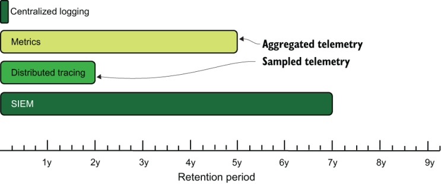
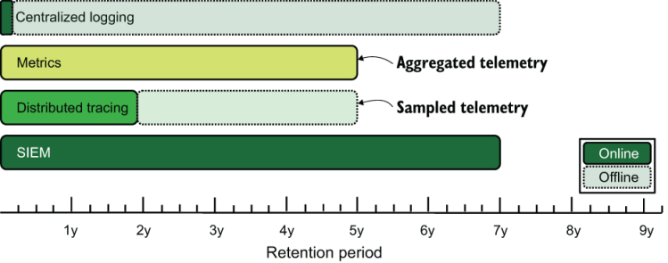
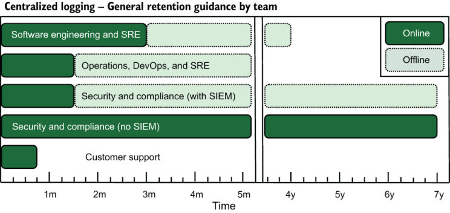
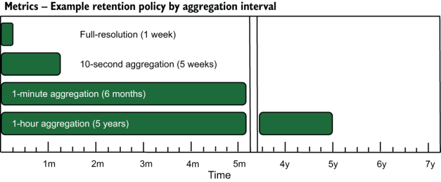
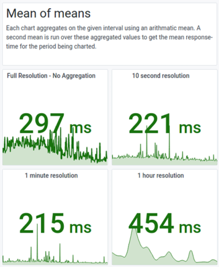
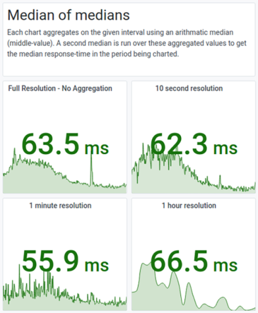
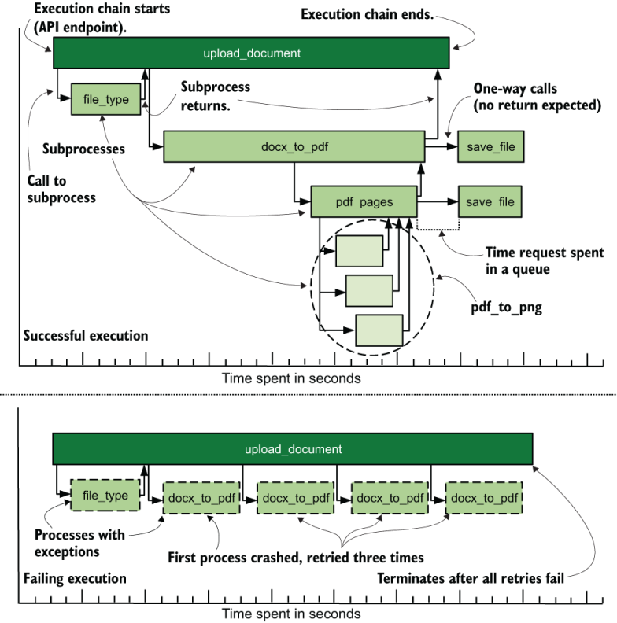

# 17 制定遥测保留和聚合策略

本章涵盖

- 为你的遥测创建保留策略
- 为你的指标创建聚合策略
- 了解采样在遥测和保留策略中的作用

保留策略（保留遥测数据多长时间）和聚合策略（如何总结遥测数据）是你将为遥测系统设置的一些最重要的策略。与聚合相关，采样技术使用统计方法来总结遥测数据，通常用于分布式跟踪。本章将介绍这些政策以及你在制定自己的政策时需要考虑的权衡。在大多数情况下，权衡是成本与功能——这是企业熟悉的平衡行为。

你的保留策略决定了你的遥测数据对人们支持他们需要做出的决策有用的时间。许多组织发现需要两个保留期：一个是在线保留期，此时所有内容都可以搜索，另一个是离线期（冷存储），此时遥测可以在需要时在线进行，但否则在不重新上线的情况下无法搜索。保留策略是将遥测系统的成本降低到你愿意支付的水平的最重要策略。

尽管保留策略是控制总体遥测成本的最重要策略（尤其是在集中式日志记录和分布式跟踪系统中），但聚合策略对于控制指标成本最为重要。成本的降低来自于事件的总结和细粒度解决方案的丧失。指标遥测数据的聚合通过减少需要存储的遥测数据量来提高成本；它还通过预先计算某些函数来提高性能，使演示阶段的活动更快。聚合作为一种技术主要有助于度量式遥测。

聚合策略是度量系统的成本控制策略，而采样是分布式跟踪的成本控制策略。对生产系统的整体运行情况进行采样，而不是深入研究单个事件，将使你在给定时间段内存储的遥测数据少得多。存储较少的遥测数据可以让你将遥测数据保持在线并可搜索的时间比不采样的时间更长。尽管某些指标实现（例如 StatsD）也使用了采样，但采样作为一种遥测技术随着分布式跟踪样式而出现。所有这三个策略代表了你在构建或更新遥测系统时需要做出的重要决策。

- 17.1 节讨论了构建保留策略以及每种遥测样式面临的权衡。
- 17.2 节是关于聚合策略的，主要影响指标遥测，以及你将遇到的一些隐藏问题。
- 17.3 节介绍了采样技术（与聚合相关），它主要影响分布式跟踪系统。

## 17.1 创建保留策略

保留策略决定你保留遥测数据的时间和格式。在线且可搜索的遥测是最有用的遥测，也是最昂贵的保留。本节涵盖的所有保留策略都是谨慎的平衡行为

- 在线和可搜索的遥测技术给决策者带来的优势。
- 保持遥测在线且可搜索的成本。
- 轻松将离线遥测带至线上。遥测系统越容易做到，就越便宜；如果可以轻松地将离线数据转移到线上，那么你的在线数据集可以更小。
- 遥测带来的法律风险可能包含隐私或健康相关信息或有毒数据。有关管理该风险的更多信息，请参阅第 16 章。

保留策略与聚合（第 17.2 节）和采样（第 17.3 节）紧密相关，但我首先讨论保留策略，因为你将进行的有关保留策略的权衡讨论与你将进行的讨论类似聚合和采样。为了演示这些概念之间的联系，图 1.12（此处复制为图 17.1）显示了本书中的四种遥测样式及其一般的在线和可搜索周期。



图 17.1 本书中的四种遥测样式及其一般在线和可搜索的保留期限。还标记了他们首选的降低成本的方法（不适用于 SIEM 和集中式日志记录）。

我们在图 17.1 中看到，一般在线保留期存在很大差异！集中式日志记录的周期最短，因为它是保持在线和可搜索的最昂贵的遥测方式；所有这些文本都很大，搜索它所需的索引也相当大。安全和合规团队使用的安全信息事件管理 (SIEM) 系统的保留期最长为七年，因为法规和合规框架通常要求某些类型的遥测数据具有最短保留期。指标和分布式跟踪都使用聚合或采样来减少存储的遥测数据量，以节省成本并增加其在线保留期限（请参阅第 17.2 和 17.3 节）。

图 17.1 显示了在线和可搜索的保留期，但保留策略还包括离线备份的保留时间，以防万一。如果备份很容易恢复到在线系统，或者更好的是，很容易实现自动化，这样就不需要人工执行恢复任务，那么在线保留期就会更短。图 17.2 显示了对图 17.1 的修改，以显示除在线期限之外的离线保留期限。



图 17.2 本书涵盖的四种遥测样式的在线保留期与离线保留期。离线存储允许集中式日志记录追溯到更早的时间。

我们看到，集中式日志记录的离线存储期与 SIEM 的在线存储期一样长。尽管这两种风格在技术上相似，但 SIEM 系统通过对存储在其中的遥测类型进行高度选择性来实现这一壮举。同时，指标根本没有离线期！缺乏离线时间更多地与大多数指标数据库的性质有关，而不是与其他任何因素有关。在度量系统使用的时间序列数据库中，新的遥测数据被插入到旧的遥测数据被删除的同一数据库中，而对于集中式日志记录，最常见的模式是每天或每周一个新的数据库，并且数据库会随着时间的推移而被删除。现在让我们看看四种遥测方式，并深入探讨每种遥测方式的在线存储成本的驱动因素：

- 集中记录没有选择性；它接受发送给它的任何内容。其主要格式是字符串和自然语言文本。字符串和自然语言文本的索引很复杂；因此，由于需要索引和搜索功能，这种风格的存储和呈现系统非常昂贵。
- 指标是有选择性的；它只接受数字和一小组基于文本的标签。它的主要格式是数字。一小组基于文本的标签使索引变得容易。因此，由于数据库的简单性，这种风格的存储和表示系统很便宜。这种廉价性就是指标成为继集中式日志记录之后第二种爆发的遥测类型的原因。
- 分布式追踪具有适度的选择性；它需要遥测采用特定的格式。它的主要格式是数字和文本的混合；它不必支持自然语言搜索。预定义的格式降低了索引成本，但允许任意标签会导致严重的基数问题。 （有关基数的更多信息，请参阅第 14 章。）分布式跟踪执行大量关联工作，这增加了存储系统的复杂性。因此，由于基数问题和索引，以及将事件与流程跟踪相关联的额外需求，这种风格的存储和表示系统非常昂贵。
- SIEM 系统对其接受的输入具有高度选择性，并且这些输入通常采用易于理解的格式。虽然它的主要格式是文本，并且确实需要进行一定程度的自然语言处理，但选择性大大减少了每天需要处理的原始数据量。因此，这种风格的存储和演示系统可能是一个 SaaS 系统，由于演示阶段系统需要大量的相关工作，因此按摄取率收费。

注意 所有四种风格都可以是 SaaS 服务，但很少有开源 SIEM 系统能够在功能方面与 SaaS 产品相媲美。我在这里的费用排名也适用于 SaaS 提供商的成本； Splunk 等集中式日志记录提供商每月的运行成本高于 Datadog 等指标提供商，这在很大程度上是由于你发送给它们的数据大小的差异。追踪提供商还很新，他们仍在研究定价模型，因此预计在 2020 年代可能会发生重大变化。

### 17.1.1 建立集中日志记录策略

在本节中，我们将讨论指导你为集中式日志记录式遥测系统构建保留策略的决策的因素。这些系统是许多组织中最大、最昂贵的，而且也是最古老的。集中式日志系统还支持组织中最广泛的决策，这使得它们最难选择策略。 （对不起。）

每个组织都是不同的，但广泛的团队使用集中式日志记录的方式略有不同。 （有关这些团队的定义，请参阅第 1.2 节。）团队的使用根据使用的一般性或具体性以及他们希望遥测的时间回溯到多远来进行排名：

- 软件工程和 SRE 团队编写日志语句，这些语句在集中式日志系统内生成大量数据；他们使用集中式日志记录来追踪错误、判断系统的运行情况并查找异常情况。他们还需要与历史记录进行比较，以挖掘错误何时开始并比较性能。它们的用途既具体又一般，并且需要最新数据和历史数据。一般来说，软件工程团队喜欢将几个发布冲刺的遥测数据放在网上并可搜索。
- 运营、DevOps 和 SRE 团队管理生成日志记录的系统，但在大多数情况下，他们本身并不控制日志记录语句。与软件工程团队使用遥测技术的方式类似，这些团队使用它来嗅出异常并追踪错误。不过，比较当前和历史遥测的动力较少。它们的用途既有特定的又有一般性的，但主要是在最近的遥测中。一般来说，这些团队喜欢将几周到几个月的遥测数据放在网上并可搜索。
- 安全和合规团队使用集中式日志记录取决于他们是否拥有 SIEM；如果他们缺乏 SIEM，那么集中式日志系统就是他们的 SIEM。无论是否存在 SIEM 系统，这些团队都会使用集中式日志记录来处理审核、支持安全调查并减少有毒数据的泄漏。它们的使用是特定的且最近的，但某些调查将需要旧数据，因此需要一种将离线遥测恢复在线的强大方法。
  - 对于拥有 SIEM 系统的团队来说，集中式日志系统只是该活动的备份。他们对集中式日志记录的使用主要限于事件响应和有毒数据防御。一般来说，他们喜欢上网一两个月并进行搜索。
  - 对于缺乏 SIEM 系统的团队，集中式日志系统必须是他们的 SIEM 系统。你需要为他们提供一种分离安全数据的方法，使你能够将可能多年的数据在线保存并可搜索。一般来说，他们希望拥有多年的在线时间并可搜索（如果不能的话，也可以轻松恢复）。
- 客户支持团队使用集中日志记录来解决客户和用户报告的问题，并为软件工程创建错误报告。让你的支持团队使用集中式日志记录对你的组织来说是一个重大好处，如果你还没有这样做，你应该这样做。他们的需求是具体且近期的。一般来说，他们希望过去几周的时间可以在线查看并可搜索。

图 17.3 说明了这些限制。



图 17.3 按团队保留期限的一般指南，显示了数据的新旧程度和成本之间的平衡。具有强烈新近偏好的团队（例如客户支持）不需要较长的离线保留期。与此同时，如果安全和合规等团队没有单独的 SIEM 系统，则需要多年的在线数据和可搜索数据。

软件工程和安全将是长期在线保留期的最大驱动力。只有你可以确定保持更长的在线时间的成本是多少，但是两个群体都会很乐意接受他们的保留期限的所有时间。只有像谷歌这样的公司才有机会支持无限期保留，即使他们有时也会反对。

离线保留期有所不同，因为它们的保存成本相当便宜。恢复的简便性以及必须保持离线遥测可恢复的辛苦程度（请参阅第 16.3 节）将指导你决定要将这些东西保留多长时间。

> 但 Loki 呢？
>
> Grafana Labs 的 Loki 对我在这里所做的一些假设提出了挑战，特别是因为它是为云原生编写的（使用云存储和云数据库）。不仅如此，Loki 的设计意味着它不会像历史上的集中式日志数据库（主要是 Elasticsearch 和 MongoDB）那样创建快速索引。
>
> Loki 是新人；它于 2018 年才上市。但 Loki 采用了 Sumo Logic 和 Splunk 等 SaaS 提供商中更常见的功能，即它比基于 Elasticsearch 和 MongoDB 的系统执行更多的查询时处理。 Loki 背后的存储系统很简单，但代价是演示系统需要更多的电量，并且愿意从存储中读取更多数量级的数据来提供查询。也就是说，技术进步的进步意味着这种权衡开始变得有意义。关注 2020 年代的这个空间，看看会发生什么！

### 17.1.2 建立指标策略

在本节中，我们将讨论为指标式遥测构建保留策略。当然，这种风格很大程度上受到聚合策略的影响（参见第 17.2 节）。即便如此，在 2020 年代，指标式遥测可能是你将支持的最便宜的遥测风格，因此你在这里有很大的自由度。保留方面最大的阻力不是空间，而是管理基数（参见第 14 章），尽管 2020 年代初出现的时间序列数据库正在采取很多措施来减少基数的影响。

在大多数情况下，指标系统（或监控系统，使用系统管理员和 2010 年前环境所熟悉的名称）已经支持多年保留，尽管它们是通过聚合来实现的。指标是第二广泛使用的遥测方式，仅次于集中式日志记录。因此，对于指标而言，两个保留策略至关重要：

- 全分辨率指标保留 - 全分辨率指标保留收到的每个数据点。这种指标是最有用的，但由于查询速度减慢，长期保留也很昂贵。
- 聚合指标保留（请参阅第 17.2 节）——聚合总结了全分辨率指标，并且规模要小得多。它可以为大多数系统提供多年的保留，并大大减少查询期间需要存储和排序的数据量。

每项保单的费用取决于你的具体情况。为了提供帮助，图 17.4 显示了我使用的指标保留策略。



图 17.4 按聚合间隔划分的指标保留策略示例。我已经使用了这个策略，关键驱动因素是每个时间间隔的搜索性能。无论如何，根据我的经验，即使是一周，对全分辨率数据的搜索也执行得最慢。你的体验可能会有所不同。

在我的示例保留期内，全分辨率数据保留了一周，但仍然是我们的指标系统中性能最慢的数据库。但对于“系统状态”和“该版本是否刚刚中断生产？”来说，一周就足够了。仪表板。对某些活动绩效的长期研究发生在聚合数据集中，分辨率随着时间的推移而降低。我们将在 17.2 节中详细讨论这个主题，但聚合集中的数据是直接从全分辨率数据得出的。

大多数支持指标的数据库也支持改变你对保留的想法。图 17.4 中的 10 秒保留显示了五周的保留期；该期限为 28 天，直到工程管理层要求能够搜索整个月以支持月末报告。支持该请求需要花费更多的备份时间和空间，但我们这样做是因为它给组织带来了好处。

还要考虑使用专用数据库的好处。 SRE 可以使用专用数据库来存储一段时间内的 SLO 指标，而不是进行聚合。该数据库的保留实际上可以是无限的！

### 17.1.3 建立分布式跟踪策略

本节介绍为分布式跟踪式遥测系统构建保留策略，该系统往往仅由软件工程（有时是 SRE）使用。参与的团队较少可以简化你的保留决策过程。这个领域由 SaaS 提供商主导，因此你的保留策略决策中的最大因素很可能是 SaaS 成本。

软件工程团队使用分布式跟踪系统来比较代码发布后流程行为的变化并隔离错误，并大致了解其生产系统作为一个整体是如何运行的。分布式跟踪专门帮助各个团队跟踪大型系统中的问题，其中没有一个团队管理整个产品。

一般来说，对于跟踪，你会发现较长的保留期更好，但较长保留期的好处会随着时间的推移而逐渐消失。 15 天保留率和 30 天保留率之间存在很大差异，但从 4 个月变为 8 个月并没有那么显着。跟踪采样的好处（请参阅第 17.3 节），以减少你必须支付的获取和保留数据量。关于保留策略和抽样策略的关系，有两点：

- 足够长的保留期可以比较多个软件发布期，让你可以观察不同版本之间的行为变化。
- 采样可以降低摄取成本，但存在丢失错误的风险。跟踪系统通常假设，如果错误发生一次，那么它会更频繁地发生，因此样本会捕获它。

对于那些使用 OpenTelemetry 兼容数据库的人，我还没有太多要说的。在我撰写本章时，OpenTelemetry 仍在开发中，因此在 2021 年初，我们对于这些系统的实际使用方式还没有很多行业经验。因此，我提供有关设置保留策略的一般建议：

- 搜索性能是任何遥测系统（包括跟踪）的关键细节。当搜索性能下降时，人们会变得暴躁，而暴躁的人不会获得良好的体验。脾气暴躁的用户表明你需要缩短保留期。
- 离线备份的成本与在线存储的成本一样重要，因此在计算时要考虑这两种成本。

### 17.1.4 制定 SIEM 系统策略

本节介绍为 SIEM 系统选择保留策略的过程。除了安全和合规性之外，这些系统很少被其他团队使用，而且它们通常受到外部合规性和关于某些类型的数据需要保留多长时间的监管。因此，为 SIEM 系统制定策略非常容易；大部分工作已经为你完成。

七年保留期继承自某些长期的财务会计实践，并因此出现在多个合规框架中。对于 SIEM 系统和保留策略，更大的挑战是根据组织设定的保留目标（根据合规性和法规而设定）来验证 SIEM 供应商产品的资格。预算在这些谈判中绝对发挥着作用。

每个组织都是不同的，你的组织所遵循的合规性和监管框架也不同，这使得提供通用指导变得困难。即使是这样：

- 计划以年为单位的保留期。
- 为了控制成本，请在发送到 SIEM 的遥测数据中严格选择。

> 练习17.1
>
> 将遥测样式与其处理长期保留策略的方法相匹配。
>
> |  集中记录  |              聚合               |
> | :--------: | :-----------------------------: |
> |    指标    | 重写 telem 离线档案，可快速上线 |
> | 分布式追踪 |   对存储的内容有高度的选择性    |
> |    SIEM    |            统计抽样             |

## 17.2 创建聚合策略

聚合策略定义了如何汇总指标式遥测，并且是可用于该式遥测的最大成本控制工具。本节介绍聚合策略的工作原理以及如何保持系统中的聚合指标在统计上有效。如果你想在三年、五年甚至七年内保留指标，这些考虑因素就很重要。

注意：如果你以前没有遇到过聚合函数，我强烈建议你查看第 5.1.2 节和第 5.1.3 节，其中介绍了几个聚合函数以及它们讲述的有关遥测数据的故事类型。该材料将使本节中的概念更加清晰。

聚合策略定义你想要保留哪种类型的预先计算的聚合函数输出。聚合使你可以在指标数据库中存储更少的数据，这使得长时间存储的成本大大降低。我们在图 17.4 中看到了时间尺度的示例，此处再现为图 17.5。


图 17.5 指标系统的保留策略示例，显示了四个聚合系列：未执行聚合的全分辨率系列、在 10 秒存储桶上聚合的系列、在 1 分钟存储桶上聚合的系列，最后是系列聚合在 1 小时的桶上。时间桶越大，聚合序列可以保留的时间越长。

图17.5展示了聚合策略的关键概念之一：时间桶的使用。我们看到四个桶正在使用。第一个是全分辨率存储桶，它没有聚合，包含从遥测系统接收到的每个数据点。第二个是从全分辨率存储桶中聚合每 10 秒间隔内的所有数据，这可以将数千个数据点减少为单个数据点。对于 1 分钟间隔和 1 小时间隔也执行相同的操作。

为了理解聚合本身，让我们看一下模拟这些系统中发生的情况的 SQL 语句。此语句聚合了六个函数的一系列 `pdf_pages` 和 `docx_pages` 指标：

```sql
SELECT metric_name,
  min(metric_value)    AS min,
  mean(metric_value)   AS mean,
  median(metric_value) AS median,
  max(metric_value)    AS max,
  sum(metric_value)    AS sum,
  count(metric_value)  AS count
FROM metrics_fullresoltuion
WHERE
  (timestamp >  "2023-02-19T16:44:20.000") AND
  (timestamp <= "2023-02-19T16:44:30.000")
GROUP BY metric_name
```

该语句返回的行看起来像这样：

```
---------------------------------------------------------
| metric_name | min | mean | median | max | sum | count |
---------------------------------------------------------
| pdf_pages   |   1 |  1.2 |      2 |  19 | 392 |   157 |
| docx_pages  |   1 |  1.4 |      3 |  28 | 451 |    93 |
---------------------------------------------------------
```

此示例使用常见的聚合函数，但还有更多函数（我在 5.1.3 节中介绍了其中的几个函数）。你选择什么聚合函数取决于你正在处理的数据类型。你可以在 StatsD 指标类型页面 (http://mng.bz/PaRR) 上找到指标类型的详细概述。以下是与指标最相关的：

- 计数器——这些指标跟踪某件事发生的次数。 `pdf_pages` 是计数器的示例。这种类型的指标最常被添加以获得单个数字，但也可以受到人口指标（例如百分位数）的影响。
- 计时器——这些指标报告某件事花费了多长时间。这种类型的指标通常需要对总体进行聚合，例如计算百分位数和标准差。 `pdf_pages` 指标可以轻松地与 `pdf_convert_time` 指标配对，跟踪这些页面的管理时间。
- 仪表——这些指标是给定时间点事物的状态，例如水位或瞬时 RAM 使用值。仪表与计数器不同，因为添加它们不会为你提供有用的信息。这些指标通常不通过数值方法聚合，更可能使用选择函数，例如 `first` 、 `median` 或 `last` 。需要诸如 `derivative` 之类的花哨的聚合函数来获取这些指标的变化率。

我的建议是分离不同类型的遥测以简化聚合工作，但分离不是必需的。此类聚合的问题在于，你需要在提出问题之前几周、几个月甚至几年就知道要对数据提出哪些类型的问题。如果你有可用的全分辨率遥测，你可以在其上运行任何你想要的功能，并且它仍然在统计上有效。对于已经聚合的函数来说，情况并非如此。

假设我们有收集 `min` 、 `mean` 、 `median` 和 `max` 值以及一组百分位数的计时指标：第 2 个百分位 (p2)、第 10 个百分位 (p10)、第 25 个百分位 (p25)、第 75 个百分位 (p75)、第 90 个百分位 (p90) 和第 98 个百分位 (p98)。请记住， `min` 相当于 p0 值， `median` 相当于 p50 值， `max` 相当于 p100 值。

一年过去了，SRE 希望了解将服务级别目标从 p98 值更改为 p95 是否更适合可用性目标。仅当你拥有全分辨率数据时，SRE 判断适合度的能力才会恢复，因为这是唯一能够提供正确 p95 值的数据。

由于 SLO 是移动目标，因此你将 p95 添加到通过聚合生成的百分位数列表中，然后等待几个月。两个月后，SRE 检查其拟合假设是否合理。许多组织并不擅长“设置并在几个月后检查”工作流程，但聚合是你必须做出更改的领域之一。

这个例子是分割指标的一个很好的例子！如果你使用指标来确定 SLO 合规性，则将服务级别指标（告诉你是否满足 SLO 的指标）发送到 SLO 内容的专用数据库是一个可行的策略。这种拆分使全分辨率指标的可用时间更长，因此 SRE 可以更轻松地测试不同模型的拟合情况。

你需要意识到构建聚合策略的一个主要问题，它与你如何构建更大的时间段有关。图 17.4 和 17.5 显示了全分辨率之外的三个存储桶：

- 一个聚合在 10 秒的桶中，保留五周
- 一个聚合在 1 分钟的桶中，保存六个月
- 一次聚合在 1 小时桶中，保存五年

我之前说过，这些存储桶需要直接从全分辨率存储桶生成（在我的示例中为一周保留），现在我需要解释一下原因。不要从下一个较小的桶生成较大的桶聚合，因为你会得到谎言。第 5 章包含此警告：

> ***警告*** 谨防进一步聚合聚合数据，因为这种技术几乎总是会导致谎言。尽可能使用原始值，因为它们会告诉你准确的信息。如果你正在处理的数据已经聚合过一次，除非你小心选择合适的函数，否则后续函数会将你看到的数据变成谎言。对已运行过 `sum` 的数据运行 `sum` 函数将是准确的，但对已运行过 `mean` > 函数将是谎言。如果你正在使用预先聚合的数据，则危害最小的方法是对已经通过聚合函数处理的数据使用相同的聚合函数。对总和进行求和是安全的，但其他任何东西都将是谎言——这些谎言看起来有点像你的数据，但在统计上不有效。我已经记不清必须修复的图表数量了，因为他们在 `sum` 上使用了 `mean` 函数，而寻求帮助的人想知道为什么要扩展图表从一周到一个月，图表中的数字没有增加。 17.2 节更详细地讨论了这个问题。

我会用视觉来揭露谎言。接下来的两个图显示了相同的 24 小时内的网站响应时间，但指标来自上面列出的四个存储桶。这些图表是使用 Grafana 构建的，它在指标系统执行隐藏聚合之后应用了第二次聚合。图 17.6 显示了平均响应时间的四个版本。请注意数字如何变化。



图 17.6 询问“过去 24 小时内该站点的平均响应时间是多少？”的结果以及四个不同指标桶为你提供的答案。全分辨率是最准确的答案；它拥有所有数据点。其他三个图表显示了 10 秒、1 分钟和 1 小时平均值的平均值，它们给出了不同的数字。

差异相当显着！全分辨率、无聚合的数字是实数，因为它是根据响应时间的完整数据集计算的，并且执行的唯一聚合是由 Grafana 在构建图表时完成的。请注意 10 秒、1 分钟和 1 小时聚合答案有多么不同。 10 秒聚合数据最接近真实数据，但也有 25% 的偏差。

这一结果的解释与人口有关。每个图表都有一条线显示区间内的数字。此图表是全天的网站响应时间图表，曲线的左半部分跟踪高使用时间，右半部分跟踪低使用时间。 10 秒、1 分钟，尤其是 1 小时时段在高峰期聚合的数据点远多于隔夜低谷期。然而，当我们尝试聚合聚合数据点时，Grafana 会以与低谷时间相同的权重对待高峰时间。将每个小时的人口数量视为相同的做法在统计中是错误的，因为在平均计算中，聚合 1,000 个点击的 03:00 数据点与聚合 10,000 个点击的 13:00 数据点的权重相同。

为了计算在统计上更加正确的平均值，我们需要包含间隔中每个桶的数据点计数，并将其包含在加权平均值中。 Grafana 尚不支持这种计算方式，因此获取此值需要你自己在脚本中运行数字。表 17.1 使用示例值显示了 1 小时聚合系列的计算结果：

- 权重系数是一小时内的总点击数除以一天内的总点击数 (114,300)。
- 加权响应是平均响应时间乘以权重因子。
- 原始平均值是平均响应列的未加权平均值。
- 加权平均值是加权响应列的总和。

表 17.1 从 1 小时聚合系列导出真实平均响应时间

|      Hour      | 点击次数 | 平均响应 |     权重系数      |     加权响应     |
| :------------: | :------: | :------: | :---------------: | :--------------: |
|      0-1       |   1200   |   150    | 0.010498687664042 | 1.5748031496063  |
|      1-2       |   1100   |   155    | 0.009623797025372 | 1.49168853893263 |
|      2-3       |   1000   |   145    | 0.008748906386702 | 1.26859142607174 |
|      3-4       |   1000   |   150    | 0.008748906386702 | 1.31233595800525 |
|      4-5       |   1000   |   150    | 0.008748906386702 | 1.31233595800525 |
|      5-6       |   1100   |   150    | 0.009623797025372 | 1.44356955380577 |
|      6-7       |   1200   |   150    | 0.010498687664042 | 1.5748031496063  |
|      7-8       |   1800   |   160    | 0.015748031496063 | 2.51968503937008 |
|      8-9       |   2500   |   165    | 0.021872265966754 | 3.60892388451444 |
|      9-10      |   4500   |   172    | 0.039370078740158 | 6.77165354330709 |
|     10-11      |   5700   |   199    |  0.0498687664042  | 9.9238845144357  |
|     11-12      |   8000   |   230    | 0.069991251093613 | 16.0979877515311 |
|     12-13      |   9100   |   250    | 0.079615048118985 | 19.9037620297463 |
|     13-14      |  10000   |   275    | 0.087489063867017 | 24.0594925634296 |
|     14-15      |  11000   |   275    | 0.096237970253718 | 26.4654418197725 |
|     15-16      |  10000   |   275    | 0.087489063867017 | 24.0594925634296 |
|     16-17      |   9700   |   250    | 0.084864391951006 | 21.2160979877515 |
|     17-18      |   8500   |   240    | 0.074365704286964 | 17.8477690288714 |
|     18-19      |   7700   |   210    | 0.067366579177603 | 14.1469816272966 |
|     19-20      |   6200   |   160    | 0.05424321959755  | 8.67891513560805 |
|     20-21      |   4900   |   155    | 0.042869641294838 | 6.64479440069991 |
|     21-22      |   3200   |   150    | 0.027996500437445 | 4.1994750656168  |
|     22-23      |   2200   |   150    | 0.019247594050744 | 2.88713910761155 |
|     23-24      |   1700   |   140    | 0.014873140857393 |  2.082239720035  |
|    点击次数    |  114300  |          |                   |                  |
| **原始平均值** |  187.75  |          |                   |                  |
|  **加权平均**  |   221    |          |                   |                  |

我们发现原始平均值和加权平均值之间存在显着差异。如果你查看加权响应列，你会发现 14-15 小时迄今为止对加权平均值的输入最大，而 2-3 小时几乎没有任何输入。在原始平均值（取平均响应列的平均值）中，两个小时具有相同的权重。这就是为什么未加权的均值会产生谎言——这个谎言看起来很接近图表上的真实情况，但不是一个你想要视为高度真实的数字。

下一张站点响应时间图表根据我们在图 17.6 中看到的相同数据计算中位数或第 50 个百分位数。中位数与平均值有不同的问题（图 17.7）：

- 我们可以在图表中看到白天/夜晚的划分，而在均值图表中我们看不到它。
- 我们的中值远低于我们的平均值，这告诉我们某个地方有很多高延迟。 （有关使用聚合来了解数据形状的更多信息，请参阅第 5.1.3 节。）
- 我们看到 10 秒聚合图表非常接近全分辨率图表中的真实结果。



图 17.7 查找网站 24 小时内平均响应时间的四种方法。真正的答案是全分辨率、非聚合数，因为它正在计算整个数据集的中位数。尽管其他三个图表中的差异不如该图表的均值版本（图 17.6）那么深刻，但它们很明显。

解释为什么此处的方差不如均值显着，这是由于中位数的性质所致。中位数是周期内排序值的确切中间值，因此它对周期内值的数量不太敏感，就像均值一样。在 24 小时内，10 秒桶系列将有 8,640 个值（每分钟 6 个，每小时 60 分钟，24 小时），这是一个非常大的集合，而且粒度也很细（很多值）并且分布均匀跨时期。

解释为什么 1 分钟聚合比任何其他聚合都少与此特定数据的性质有关，其中包括 API 流量。 API 流量通常由 cron 作业驱动，因此 API 会在每分钟的最高点获得点击。 :00 到 :09 秒的时间段获得大量点击，响应时间较长，而一分钟的其余时间段响应时间较短。如果 10 秒聚合会在 1 分钟内产生一个高值和 5 个较低值，那么 1 分钟聚合会产生一个通常较低的值，因为在 60 秒内，更多的命中发生在响应时间较短的 50 秒内。 10 秒的更高响应时间。

出于类似的原因，1 小时的时段是最高的：人口。由于一天只有 24 小时，因此流量较高的慢速时段与流量较低的快速时段的计数相同，从而使结果偏差更大。 1 分钟的桶没有那么严重的问题，因为一天有 1,440 分钟——需要排序和计算中位数的数据点多了两个数量级。

这已经足够吓到你了。现在给出一些建议：

- 始终确保指标系统执行的预计算聚合是针对全分辨率数据完成的。由于大多数演示阶段系统的工作方式（它们需要为每个像素获取一个值，如果一个像素中存在更多数据点，它们需要将其减少到一个），双重聚合是难以避免的。因此，你希望第一个聚合在统计上尽可能有效。
- 如果可能，请将全分辨率数据保留至少 7 天。此保留期允许遥测用户构建显示“过去一周”的仪表板，并能够使用全套统计方法，而不必担心隐藏的基于聚合的准确性问题。
- 当你规划聚合时，请找出人们感兴趣的间隔。10 秒和 1 分钟的间隔通常用于跟踪快速变化的变化，而 1 小时和 1 天的间隔则通常用于跟踪数月和数年的变化。 1 小时和 1 天聚合间隔的存储成本较低，但执行聚合本身的成本可能很高。
- 百分位非常有用，除非你没有足够的数据。 10 秒存储桶中的 p98 值仅当该存储桶包含大量值时才有意义。仅发生两个事件的存储桶的 p98 值不是 p98 值。只有当有超过 100 个数据点需要汇总时，细粒度的百分位数才有意义。当你选择要聚合的百分位时，请了解事件的频率；你可能需要增加聚合间隔才能收集足够的数据。
- 了解指标数据库对基数的反应，并相应地规划聚合。第14章直接讨论了基数，但是这个话题需要再提一下。尽管较新的指标数据库开始解决基数问题，但成熟的指标数据库（例如 Prometheus 和 InfluxDB）通常不能很好地容忍基数。因此，不要根据频繁变化的数据来规划聚合。例如，如果你在公共云中并进行了大量自动缩放，或者如果你运行 Docker 群，则不要在主机名或 Docker-ID 上进行聚合。
- 建立有关如何使用聚合数据从较长时间范围的仪表板中获取有效数据的培训。我已经记不清有多少次使用演示系统的 `mean()` 函数对我们的指标系统使用 `sum()` 的数据绘制图表，然后又问为什么要缩小全年的数据量远低于人们的预期。我还发现一些图表使用演示系统的百分位数函数聚合超过一分钟的 10 秒聚合数据，这意味着百分位数函数对六个值进行操作。帮助其他人了解如何正确处理聚合数据将有助于你的组织实现其使命。

> 但是 StatsD 呢？
>
> 对于那些还没有听说过的人来说，StatsD 是一个由 Etsy 推出的指标收集流程，并在引起轰动后被广泛采用。 StatsD 的一个很酷的因素是它实时执行聚合，这样指标存储系统就不需要这样做。此外，它还可以使用 UDP 来防止指标记录器在报告指标时被阻塞。它提供了一个快速、无阻塞、足够准确的指标系统，这在它爆发的 2011-13 时代非常重要。
>
> 我不是它的粉丝，尽管我已经运行了好几年了。我在运行 StatsD 时所经历的创伤让我能够写下过去的几页内容。我发现 StatsD 风格的指标存在问题，原因有二：
>
> - 你无法选择完整分辨率的指标，这意味着指标系统的用户需要了解他们所得到的内容，但大多数人都没有。这种缺乏理解导致仪表板充满了隐藏的谎言，我厌倦了纠正它们。
> - 如果你有低频指标，例如每分钟仅触发一次或两次的事件，则需要设置以 1 分钟或更长时间间隔聚合的不同 StatsD 端点。这些 StatsD 实例携带大量本地状态，当它们重新启动时，该状态以及它们所持有的指标都会丢失。
>
> 这两点非常严重，以至于我厌倦了处理它们，并用另一个系统替换了基于 StatsD 的指标，该系统使用简短的全分辨率指标池作为聚合的基础。完成这项工作后，我们的仪表板变得更加准确，尤其是较长时间范围的项目。代价是需要花费更多的 CPU 来派生聚合存储桶，但到 2021 年，技术已经足够先进，“投入更多计算”对我们来说是一个可行的选择。
>
> 我的观点是，在 2010-15 年时期，在指标进入存储之前对其进行预聚合是一种可行的权衡，但从那时起，指标数据库的状态已经足够先进，我们不再需要这样做了。 2020 年代初出现的时间序列数据库看起来正在消除聚合的需要，并开始解决基数问题。
>
> 我唯一认为预聚合是个好主意的时候是当你运行一个真正的大型基础设施时，例如 20,000 台服务器，每台服务器每秒生成 200 个指标，这意味着指标数据库必须每秒摄取 400 万个数据点。预聚合是减轻数据库写入负担的一种方法。
>
> 另一种有点新颖的方法是使用架顶指标数据库（或 Kubernetes 集群中的指标数据库边车）来托管该机架/集群的全分辨率指标，然后将聚合数据提交到中央指标存储。这种方法允许你安全地生成更长的时间段，例如 1 小时和 1 天，这是 StatsD 等服务无法做到的。不过，大多数人并不在真正的大型基础设施上工作。对于较小的运营商来说，中央全分辨率存储桶是完全可行的，并且使你的指标比预聚合更有用。

> 练习17.2
>
> 我使用 Grafana 和聚合指标数据库制作了图 17.6 和 17.7 中的图表。如果你在组织中使用 Grafana，请使用你自己的聚合数据重现平均值和中位数图表。聚合间隔看起来有何不同？有多少仪表板依赖于类似的汇总？

## 17.3 使用抽样来降低成本并提高保留率

抽样是一种统计技术，用于检查代表性数据子集以发现整体的真相。当谈到遥测系统时，分布式跟踪从采样中获益最多。抽样给你带来两大好处：它允许你以更少的钱在线保存更多数据，并且它仍然可以让你跟踪长时间范围内的人口水平变化。本节介绍如何正确进行采样以及解决采样给遥测系统带来的一些问题的方法。

从表面上看，采样很容易解释：将随机百分比的跟踪或指标发送到存储中。这个百分比可以是1%、10%，甚至50%。百分比越小，你可以在存储系统中保留指标的时间就越长。随机化是关键，因为这使你的指标在统计上有用。只要你还存储了采样率，你就可以推断出 100% 版本的样子。

选择采样率的关键概念是允许你有多个采样率。你的技术系统不是一个统一的群体，而是一个充满错误流程的混乱群体，几乎永不失败的几乎无懈可击的流程，第一次进入生产的流程，在生产中两年没有变化的流程，只运行的流程每小时运行几次，每分钟运行数百次的进程，以及仅在内部用户按下按钮时发生的进程。真实数据是混乱的，一种采样率无法将所有数据统一起来。

良好的分布式跟踪系统可以让你将不同的采样率附加到不同的进程。采用两个不同的 API 端点：

```
/v2/upload_document
/v3/upload_document
```

`v2/upload_document` 端点已经很成熟，但 `v3/upload_document` 端点是此版本中的新端点。 v3 端点从未投入生产，因此还没有人信任它。一个好的跟踪系统将允许你为旧的且经过实战检验的 v2 端点设置较低的采样率（可能低至 0.1%），并为新端点设置相当高的采样率（甚至可能在短时间内设置为 100%）。无论如何，旧端点可能仍在大量使用，因此低采样率将为你节省摄取费用，而新的 v3 端点在功能测试期间可能仅获得测试版流量。

选择采样率取决于几个因素：

- 你对流程了解得越多，采样率就越低。如果你理解了它，你就不需要对其进行大量监控。
- 你对流程的了解越少，采样率就越高。你需要通过在多种条件下观察流程来建立信任（和理解）。
- 过程发生的频率越高，采样率就越低。如果你的人口规模很大，你可以采用 0.0001% 等采样率。想象一下，如果 Twitter 试图追踪每一条推文。
- 如果你发现了需要捕获的低频错误，那么短时间内提高采样率将有助于你实时捕获它。
- 生产系统采样率允许与负载测试和持续集成采样率不同。是的，通过对负载测试和预生产环境进行采样，你可以与生产环境进行比较，以了解这些工具是否是有效的测试。
- 100% 的采样率可以让你以最低的成本获得最高质量的数据。

采样率很像功能标志，事实上，许多分布式跟踪 SDK 都可以通过功能标志来设置采样率，因为它们允许你对生产代码执行实验。那么客户打电话来说，当他们做了这种奇怪的事情时，代码就中断了？当客户的数据通过时，通过功能标志提高采样率。这是一些非常强大的东西。

也就是说，分布式跟踪系统有两个相反的用例：

- 了解整个系统如何对变化做出反应。
- 了解为什么这一跟踪出错。

我将这些用例称为对立用例，因为第一种情况从采样中受益匪浅，而第二种情况则大部分被采样破坏。整个系统用例是关于通用性的，而错误跟踪用例是关于特殊性的。抽样是关于普遍性的。还记得我说过必须提高采样率才能捕获低频错误吗？你这样做是为了注意到错误。如果支持人员来找你，询问为什么这一件事失败了——客户脾气暴躁，而且是合同价值排名前 20 的客户——无法解决这个糟糕的流程会让你大汗淋漓。

要知道为什么获取错误跟踪是一件好事，让我们再看一下图 5.19 和 5.20，它们合并在一起如图 17.8 所示。该图显示了两条跟踪：一条成功执行，一条有错误。



图 17.8 `upload_document` 的两个版本。顶部跟踪显示执行成功。底部跟踪显示执行出错。虚线框是记录异常的进程。我们在底部跟踪中看到 `upload_document` 从未收到 `docx_to_pdf` 的返回，并在完成之前重试了 3 次。我们还看到 `file_type` 抛出了异常，但还是返回了一个值。此行为是否与 `docx_to_pdf` 行为有关？

顶部跟踪显示 `upload_document` 的成功执行，它调用了一些其他的东西，这些东西导致了一堆进程，然后最终成功返回。另一方面，底部走线看起来有所不同。我们看到我们在 `file_type` 和 `docx_to_pdf` 中记录了异常。查看 `file_type` 跟踪，我们发现异常与无法确定文件类型有关，因此跟踪返回默认类型：docx。当 `docx_to_pdf` 进程运行时，它遇到了致命异常，因为它正在处理的文件绝对不是 .docx 文件。 `upload_document` 进程再重试 `docx_to_pdf` 进程三次，以防出现故障。查看此跟踪有助于工程人员确定默认文件类型行为不安全，并修改 `file_type` 处理不良检测的方式。

错误很有趣。如果你的分布式跟踪系统允许，提高错误采样率将改善生产工程师的生活。对于遥测系统操作员来说，更好的是，你不必为了捕捉那些讨厌的罕见错误而提高所有内容的采样率，并最终花费大量金钱。如果你的跟踪平台支持任意采样率，它将安全地处理同一进程的可变采样率。

如果你的跟踪系统不支持更改采样率，则集中式日志记录系统可以提供帮助。将异常放入集中式日志记录管道中。这种技术与在跟踪中包含错误不同，但它比根本不捕获错误要好得多。遥测系统相互支持。

> 指标是数字；统计是关于数字的；因此，你可以对指标进行采样。量子ED。
>
> 这句话是真的！事实上，Etsy 的 StatsD 已将采样功能内置到协议中，而且从一开始就存在。你将指标发射器配置为仅发出特定的采样率，并将该采样率放入指标中。这是 StatsD 线路协议，其中包括采样率。翻译后， `pdf_pages:5| c|@0.1` 表示指标名称 ( `pdf_pages` ) 是一个值为 `5` 的计数器 ( `c` )，并且正在运行10% 样本 `(@0.1` ）。当 StatsD 将汇总指标报告回指标数据库时，它将利用此信息执行正确的操作，因此看起来好像你没有对数据进行采样。
>
> 也就是说，除了 StatsD 之外，我还没有遇到过许多在摄取时提供采样支持的指标系统。 StatsD 是在数据库很小、空间宝贵、写入 I/O 仍然依赖于旋转磁盘而不是固态磁盘的时代构建的。简而言之，StatsD 经过优化以最大限度地减少写入。正如我在第 17.2 节末尾的侧边栏中提到的，除了最大的组织之外，不再需要这种写入减少；技术已经足够先进，大多数组织不需要进行如此深入的优化。然而，如果你正在使用真正的全球规模的指标系统，那么除了聚合之外，采样也是减少写入负载的好方法。

> 练习17.3
>
> 将遥测样式从最长默认在线保留期到最短排序。
>
> 1. 集中记录
> 2. 指标
> 3. 分布式追踪
> 4. SIEM

# 概括

- 保留策略定义了遥测数据的保留时间和形式。遥测系统的成本与你需要保持在线的遥测数据直接相关。较长的周期给决策者带来更多的优势；较短的周期可以省钱。

- 聚合策略定义了如何以数字方式汇总遥测数据，并大大减少需要保持在线和可搜索的数据量。这些政策使得存储遥测数据变得更加便宜。

- 采样是一种与分布式跟踪系统（有时是指标）一起使用的统计技术，可以保留了解整个系统的能力，而无需保留每个数据点，从而降低存储成本和 SaaS 提供商的账单。

- 从离线存储快速恢复数据的能力可以减少你保持遥测在线和可搜索的需求，并降低总体成本。

- 如果有毒数据处理（参见第 16 章）不充分，较长的保留期会使你的组织面临法律风险。

- 集中式日志记录的默认在线保留期最短，因为数据庞大且索引复杂，因此每天保持在线和可搜索的成本最高。

- 由于监管和合规框架需要更长的时间范围，SIEM 系统具有最长的默认在线保留期。

- 指标具有第二长的默认在线保留期，因为主要数据类型数字的存储和索引成本较低。与聚合策略配合使用时，多年的保留期非常经济。

- 分布式跟踪每天的成本不如集中式日志记录那么昂贵，但比 SIEM 和指标更昂贵。通过使用采样来实现更长的保留期，从而使存储成本易于管理。

- SIEM 系统通常是 SaaS 系统，其关键的扩展问题是每年或每月的订阅成本。

- 由于技术组织中的每个团队都使用这些系统，因此为集中式日志系统设置保留策略很复杂。保持至少几周的在线支持，以帮助工程，轻松恢复离线遥测，并适应工程决策周期，例如每月报告。

- 在 2020 年代，对于度量系统来说，基数是比空间更大的扩展问题，这会影响搜索性能。较长的时间范围往往会使索引中的基数更大。当你设置指标的保留期时，请考虑搜索性能。

- 保留一个简短的全分辨率指标池（未汇总/聚合），你可以从中导出聚合池。使用 7 天的全分辨率池可以让你的技术组织以最高的精度构建“过去一周”的仪表板。

- 分布式跟踪系统通常由软件工程和 SRE 使用。更长的时间范围允许比较多个代码版本的性能，这对于工程来说非常有价值。

- 聚合策略定义了你在指标存储中保留的预先计算的聚合类型，这使你可以在存储中存储数量级较小的数据。此策略可降低成本并提高搜索性能。

- 聚合策略通常定义多个按不同时间间隔聚合的数据系列，例如在 10 秒存储桶上聚合的一系列数据，在 1 分钟存储桶上聚合的另一个系列，以及在 1 小时存储桶上聚合的第三个数据系列。存储桶越大，长时间存储和绘制图表的成本就越低。

- 拥有一个简短的全分辨率指标池可以让你计算聚合系列中的完整聚合数组，同时保持统计有效性。

- 聚合系列的缺点是你需要提前知道你对哪些聚合感兴趣。当你丢失了全分辨率指标池时，在以前没有的情况下计算第 75 个百分位数是不可能的。不过，向新聚合添加一个很容易。

- 根据用例拆分聚合策略是完全可能的！如果你的 SRE 团队需要长期保持 SLO 相关信息在线且可搜索，你可以将这些（比系统的其余部分小得多）指标发送到专用保留策略。

- 当你在 Grafana 等演示阶段系统中处理预聚合数据时，你必须了解演示阶段系统使用的聚合函数如何与你的数据交互。做错事会导致仪表板充满谎言。图 17.6 和 17.7 提供了对聚合指标系列重新聚合所产生的各种谎言的直观描述。

- 采样是一种统计技术，用于检查数据的代表性子集以发现整体的真相，这使得采样成为分布式跟踪的关键成本节省技术。

- 采样率是将发送到分布式跟踪提供程序的事件的百分比，通常可以在函数和程序级别进行设置。

- 良好的分布式跟踪系统本身支持给定程序中的可变采样率，这使你可以使用较高的速率来捕获异常，并使用较低的速率来捕获众所周知的高度可靠的易于理解的进程。

- 在负载测试和其他预生产系统中使用采样可以让你将性能与生产进行比较，以确定这些预生产系统的测试是否有用。

- 许多分布式跟踪 SDK 允许你根据功能标志设置采样率，这是一项有用的功能，允许你为高价值客户使用更高的采样率。

- 错误通常比常规操作更有趣，因此构建采样以便捕获的错误始终发送到分布式跟踪提供程序。这种方法保证你将有有趣的事件可供回顾。

  