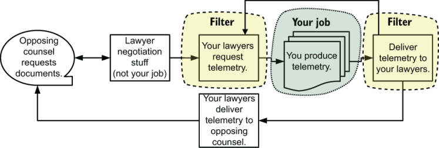
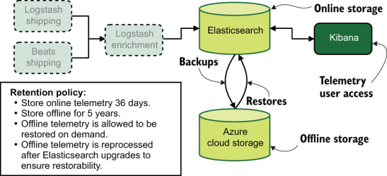
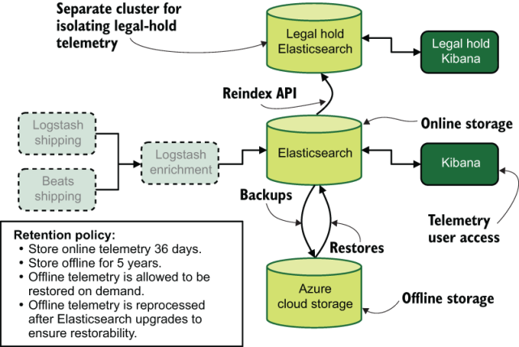
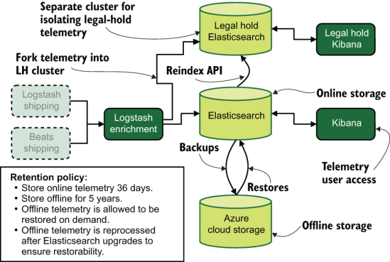
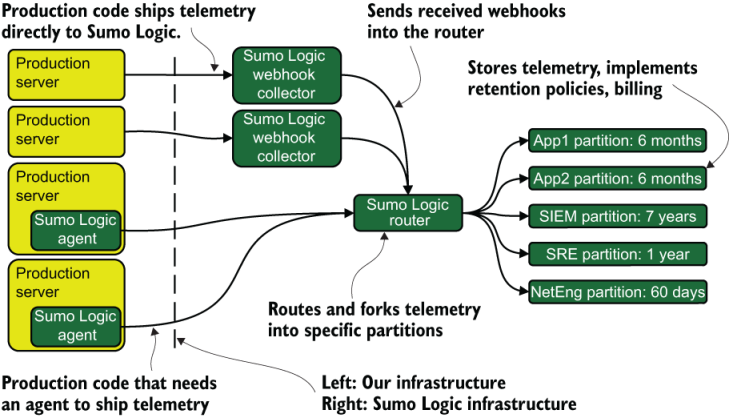
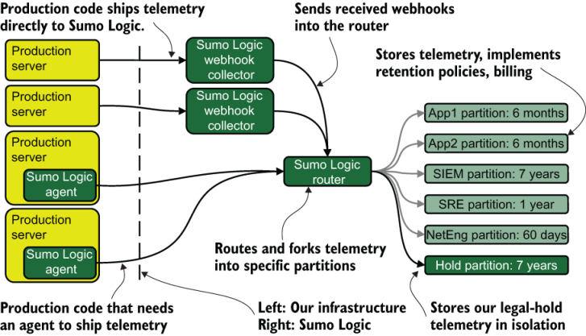
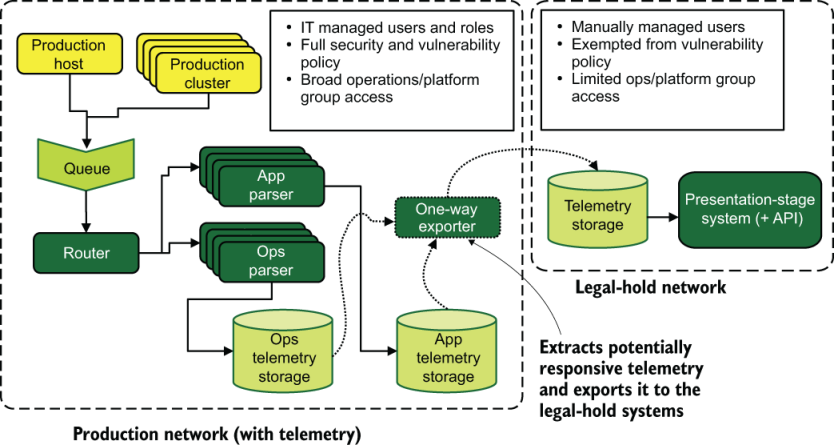

# 18 现行法律程序

本章涵盖

- 法律发现的过程
- 遥测在法律电子取证中的作用
- 如何与律师成功合作

本章与本书中的其他章节不同，因为它不是关于冷静的技术或制定内部政策的虚拟扳手腕。本章讲述的是大多数技术人员在职业生涯中不会遇到的事件——使他们成为现场专家的法律程序——因此当这种情况发生在他们身上时，他们毫无准备。我想让你为这次事件做好准备，这样，如果不太可能发生的事情发生，你会做出有能力的反应，而不是震惊和反应性的惊讶。

> ***警告*** 本章并不是要让你成为一名律师；而是要让你成为一名律师。本章旨在帮助你支持组织的律师。你的法律意见并不重要；这不是你被雇用的目的。本章是关于如何处理法律程序，这些程序比法律意见有更好的记录。

组织可能陷入的法律麻烦是无限的，但只有其中的一部分可能会让你的遥测系统成为对方律师的瞄准目标。这让我想到了许多定义中的第一个：电子数据展示。

> 定义 电子取证（名词）：电子取证的简称。与电子邮件一样，它不再用连字符连接。证据开示是从诉讼当事人处获取证据的审前程序，具有法院命令的效力。电子取证使用计算机文件而不是纸张。如果一方被要求提供文件，该方（你的组织）必须这样做，除非满足某些条件（你的律师将为你确定这些条件）。

电子取证是影响遥测系统的法律程序，本章将向你介绍它是什么、如果你必须参与它会发生什么，以及如何与相关律师交谈。如果你的遥测系统与法律事务相关，则一定发生了某些事情，使你的生产系统的运行遥测与案件相关。以下是一些示例，包括假设的和取自现实生活的示例，以激发你的想象力，以及电子取证希望回答的问题：

- 你的组织被发现通过可公开访问的 API 泄露健康信息。
  - 开放 API 是如何实现的？可用多久了？有多少人的信息被盗？两年前，一位工程经理积压了一张本来可以解决这个问题的票；为什么？
- 你的客户成功团队成员被发现向暗网经纪人出售私人信息以获取巨额报酬。
  - 付款什么时候开始？有多少人的信息被出售？其他人也参与同一个计划吗？是否允许远程访问以方便私人信息的传输？
- 你的一位顶级客户因一个广为人知的漏洞而发生信息泄露，该漏洞据称在六个月前已修复，这与你的合规审计报告相矛盾。
  - 为什么在这种情况下没有遵循漏洞管理流程？为什么没有检测到这个漏洞？受影响系统的补丁历史记录是什么？
- 你的软件工程组织的一名成员受雇将 NodeJS 模块固定到包含敌对国家设置的后门的特定版本。
  - 谁编写了固定版本的代码？谁批准了该代码？为什么库漏洞扫描过程没有识别出有漏洞的模块？是否还植入了其他植入物？三年来，受贿工程师做了什么、什么时候做、如何做的？
- 你的组织希望对你的一家 SaaS 供应商提起重大过失诉讼，因为最近发生的一系列中断不仅超出了其服务级别协议，而且还导致你的组织损失了大量收入。
  - 停电导致了哪些具体问题？ SaaS 提供商的支持提出了哪些解决方法，以及部署后效果如何？部署这些缓解措施和解决方法后，你的组织的用户遭受了怎样的影响？

所有组织都存在一定的法律风险，但某些类型的组织风险较高。所有遥测系统运营商都应至少在纸面上考虑如何响应遥测数据的电子取证请求。通过保持你的审议假设性，类似于灾难规划者使用的桌面练习，你可以找出最明显的问题。你应该为以下两个主要请求制定计划：

- 保留文档的要求——你不能删除任何可能与案件相关的内容，即使你的保留政策（第 17 章）规定应将其删除，或者你将对其进行编辑（第 16 章）。该请求首先出现在法律案件中，并且法律保留（该请求是什么）可以持续数年。我们将在 18.2 节中详细讨论这个主题。
- 要求提供文件——你与律师合作，捆绑与案件相关的遥测数据。处理这种事情有几种方法；我将在 18.3 节中详细介绍它们。

我在本书中讨论了四种不同风格的遥测技术，但每种风格都有不同的法律程序风险。以下是他们的曝光排名：

1. SIEM 系统——这些系统从一开始就构建为支持安全调查并足够安全地处理信息，以便在审判和起诉中幸存。
2. 集中式日志记录系统——集中式日志记录系统是继 SIEM 系统之后暴露程度最高的系统，它包含有关生产系统中发生的事件的大量详细信息，这使得它们成为法律流程的重要目标。
3. 分布式跟踪系统——如果你有集中式日志系统，则分布式跟踪系统就不易受到攻击。但是，如果你使用分布式跟踪系统代替集中式日志系统，它们就像集中式日志系统一样暴露：如果你缺乏集中式日志系统，那么你可能会跟踪这些系统中的不仅仅是简单的功能状态，并且这些额外功能通常与法律事务有关。
4. 指标系统——这些系统是你拥有的最少暴露的遥测系统，主要是因为这种风格都是关于数字的。如果法律问题与绩效相关，并且你的绩效数据位于指标系统中，你可以看到指标遥测请求。在极端情况下，你的聚合政策（请参阅第 17.2 节）的统计有效性可能会在法庭上受到质疑，试图将你的遥测数据视为无效。

> ***警告*** 除非你已经使用过电子数据展示，否则我强烈建议你先阅读第 18.1 节，然后再阅读本章的其他内容。该部分定义了此处涉及的法律流程，并提供了我在后面部分中使用的许多定义。例如，“生产”一词对于律师来说具有特定的含义。你想知道它与第 1-17 章中这个词的含义有何不同。

## 18.1 定义电子取证流程

电子取证是诉讼各方用来收集电子证据的法律程序。一般意义上的发现（论文）是从英国普通法演变而来的，并沿袭大英帝国及其所有殖民地（包括美国）。随着各个国家获得独立，他们非常需要协调合同法和其他开展业务的法律框架，因此保留发现的概念具有很大的意义——也就是说，发现的概念存在于大多数欧洲国家和地区。那些曾经是他们殖民地的国家。

图 1.13 为我们提供了电子取证的简化阶段。让我们在图 18.1 中稍微更新一下。

图 18.1 电子取证生命周期以及你在其中的角色（除非你是律师）。你的工作是生成遥测数据或使其他人（可能是你组织的律师）能够生成遥测数据。你的律师可能会在准备向对方律师提供遥测数据之前反复向你提出请求。你所做的一切都将经过你所在组织的律师的过滤，这对所有参与者来说都是最安全的。

尽管图 18.1 看起来像是一个无尽的循环（如果你处于其中，你肯定会感觉像是一个循环），但它代表了敏捷迭代的一种形式。当案件开始时，对方律师（另一方的律师）不太了解他们将要求的数据的形式。他们的第一个请求将是广泛的，并将被你组织的律师驳回（“法官大人，这是一次钓鱼探险！”，用一个电影例子）。然而，随着时间的推移，他们开始了解你的数据是如何形成的，因此请求开始变得非常具体，这给我们带来了下一个定义：响应式。

> 定义 响应式（形容词）：与发现请求匹配的文档（或遥测事件）被认为是响应式的。没有回应的文件将不会交付给对方律师。如果文档是部分响应的，则在交付之前将对其进行编辑。确定文档是否具有响应性是你组织律师的工作。

从根本上讲，诉讼的发现阶段是发现与当前法律事务相关的响应记录、文件和事件。这一阶段可能会非常快，也可能会持续数年，适用于此事的所有各方。当收集到响应记录时，问题（至少在理论上）可以进入和解谈判或进一步的法律争论。

此过程不是在提起诉讼时开始，而是在你组织的律师决定可能提起诉讼时开始。该诉讼可能受到威胁或计划进行。你组织的律师有义务保存（防止任何更改）可能响应的记录、文件和事件，并将命令你保存遥测数据。该命令称为合法保留，第 18.2 节对此进行了详细介绍。

> 定义 合法保留（名词）：保护业务记录（在我们的例子中为遥测）不被删除或修改的要求。受合法保留的记录不受保留政策的约束，如果需要编辑，则将在副本上进行编辑。修改或删除受合法保留的记录（或记录的元数据）可能会导致法院和你的组织的制裁。处理不当这些东西可能会让你被解雇。

法律保留可以在发现阶段的任何时间到达。人们没有意识到可能包含潜在响应记录的记录类型和存储库可以被发现，然后进行合法保留。除非问题从一开始就明显涉及遥测系统，否则遥测系统更有可能受到这些迟到的保留命令的影响。管理记录系统（遥测系统是记录系统）的人称为保管人，是执行保留命令的人。

> 定义 保管人（名词）：需要提供记录或以其他方式管理记录系统的人员。换句话说，你。托管人（通常）不是法律专业人士。托管人的示例包括电子邮件管理员、Google 应用帐户管理员和遥测系统管理员。

当法律保留到位后，一些组织将开始进行早期案例评估 (ECA) 过程。

> 定义 早期案件评估（名词）：当一个组织预计会发生诉讼时，它会审查潜在的响应记录，以确定其手上有多少问题；此评论是 ECA。 ECA 推动法律战略的制定。它还适用于计划提起诉讼的组织，其目标是确定是否有足够的实质内容来支持法律事务。

ECA 是遥测系统操作员要参与的第二个地方。你组织的律师或其顾问将根据法律保留命令开始通过遥测技术进行深入研究。在此阶段可能会发生很多事情，特别是如果法律团队希望能够将数据从遥测系统导出到专业文档审查系统中。或者你的法律团队可能依赖你和你的团队从你的系统中搜索并提取遥测数据。较小的组织更有可能期望你成为 ECA 的关键参与者；较大的组织更有可能期望你为关键参与者提供支持。查看潜在响应文档的行为称为审核。

> 定义 审查（或文件审查）（名词）：评估记录以确定它们是否对法律问题作出反应的阶段。律师和律师助理对作为法律保留的一部分收集的数据进行审查。你会听到法律工作人员使用“审核的截止日期为 8 月 5 日”和“我们正在对五个请求进行审核”等短语来进行审核。

提起诉讼后，ECA 可以在后台继续运行，但你组织的律师将开始处理（并发出）证据开示请求。在接收端，发现请求看起来很像 ECA 请求，但有一些区别：

- 提出请求的可能是不同的法律团队。组织聘请外部顾问（咨询律师）来帮助处理案件是很常见的，因此你可能会与新人一起工作，他们不像组织自己的律师那样了解你的组织。有时，这些外部律师会带着自己的技术人员（称为“法律支持”）前来。
- 你可能会被要求提供与 ECA 期间使用的格式不同的记录。法院喜欢查看特定格式的记录（PDF 和 TIFF 是最常见的），理想情况下，你的律师将负责重新编码。然而，并非所有律师都这样做。
- 与 ECA 请求不同，证据开示请求的截止日期由主审法官设定，并且不受你的待命、儿童预约或运动日程的影响。如果你运气不好，你会发现为什么律师（及其律师助理）经常工作怪异且延长工作时间（参见第 18.3 节末尾的侧边栏）。

上述所有要点都会导致向对方律师提供所要求的文件。完全格式化的记录包称为文档生成。

> 定义 Production（名词）：在法律领域，Production 是 Document Production 的缩写，是一个单数名词。你可能会听到你的法律团队说：“我们审核了 1 月 29 日的制作。”在我们的世界中，生产是一个形容词，在这里修饰系统（“这张图表描绘了我们的生产系统”）。产品是由你组织的律师根据你提供的遥测数据创建的。

发现请求通常是对包含某些关键字的文档的请求。如果律师知道你正在使用哪种记录存储系统，则请求有时会以你的存储系统支持的任何语言直接查询。这些关键字列表可能很庞大，随着时间的推移，关键字已经排除和包含，并且类似于一些相当粗糙的逻辑语句。

不过，修改记录时要小心！律师和法院既关心数据又关心元数据，因此你必须注意保护两者。什么算作元数据取决于你的存储系统以及你组织的律师决定算作元数据的内容，但它可能包括遥测中特定事件的访问日志。如果你最终确实更改了数据（可能是因为你删除了某个字段或意外编辑了 PII），那么你就会破坏它。

> 定义 Spoliate（动词）：在程序之外修改业务记录的行为。受到法律保留并随后修改的遥测数据称为 spoliated。泄露数据是一个严重的问题，可能会对法律问题和你的工作造成严重后果。如果你认为需要更改合法保留范围内的数据，请在进行更改（任何更改）之前咨询你组织的律师。

## 18.2 处理记录保留请求

法律问题第一次可能影响你的遥测系统是当你组织的法律团队提出保留记录的请求（合法保留；请参阅第 18.1 节）时。此请求是保留特定遥测数据并防止其进一步修改的要求。第 17 章是关于建立保留和聚合策略的，而法律保留是所有这些出色工作的巨大例外。本节是关于调整你的程序以应对处理法律保留的可能性，以及一些减轻痛苦的技术。

处理合法保留的最佳方法是在必须处理它们之前就制定计划。当法律团队向他们提出保存请求时，太多的遥测系统操作员完全没有计划，这意味着他们的反应是出乎意料的，并且不知道他们的答案将如何影响组织的法律选择。第 18.4 节是关于与一般律师合作的内容，但你可以通过制定法律保留计划来为自己和你的团队减轻很大的压力。

该计划不必是一个完全充实和经过实践的操作手册，并支持积极维护和更新的自动化。拥有这样的操作手册固然很好，但对于大多数组织来说，这应该是一场极其罕见的灾难，这需要付出很大的努力。当我说“制定计划”时，我所说的是：你已经考虑了遥测系统设计中合法保留的可能性，并制定了处理该计划的大致程序。

考虑这些问题的最佳时机是当你计划对遥测系统进行重大更改时。也许你正在考虑升级关键组件或迁移到新的组件。无论原因是什么，你都需要回答以下问题：

- 如果我们被要求保存遥测数据的一部分，是保存该部分更容易还是保存当时的所有内容更容易？在考虑问题之前了解存储部分数据集还是完整数据集更容易，这样可以节省每个人的精力。
- 我们如何保护所保存的数据免遭例行编辑和重新处理？你需要能够防止合法保留数据发生更改。如果你当前的系统使该任务变得困难，请花时间缓解它。
- 我们将如何保护我们的未编辑/未重新处理的合法持有数据免受我们的普通客户的侵害？如果你需要执行编辑，则需要保持未编辑的遥测数据仅对律师可见。如果法律问题进展到发现阶段，律师将进行任何编辑。此外，如果你需要为所保存的数据运行第二组系统（需要免除组织补丁策略的系统），你可以将对潜在易受攻击的系统的访问权限隔离给所涉及的律师和最少数量的遥测系统操作员需要保持系统运行。
- 我们如何允许我们的律师审查我们保存的数据？除非保留令适用于所有内容，否则你所在组织的律师很有可能希望确保你保存正确的内容。让他们。无论如何，当 ECA 启动时，你都需要进行此检查（第 18.1 节）。
- 如果合法保留要求我们保留仍在生成的遥测数据，那么我们需要做出哪些更改来确保保留此类遥测数据？并非所有请求都只是为了获取历史信息；有些保留可能要求你保留当前生成的部分或全部遥测数据。如果你被要求这样做，那么了解你需要进行哪些更改来支持保留实时遥测将使编写更改变得更加容易。
- 在我们当前的软件版本中是否可以查看最古老的遥测数据？如果保留策略的一部分涉及将遥测数据离线存储一段时间，则你需要尽早了解最旧的遥测数据是否可以恢复到当前系统中，或者是否需要第二个系统进行恢复。设置第二个系统需要资源，因此提前知道需要请求多少资源可以节省每个人的时间和精力。
- 如果我们必须在保留期内升级存储软件，我们是否需要避免升级合法保留系统？随着诉讼的进展，保留订单可能会持续数年。了解升级保留订单中涉及的资源是否安全将有助于你遵守所遵守的任何法规。如果升级不安全，尽早了解可以让你在补丁和漏洞管理策略中专门针对这种边缘情况设置例外。

接下来的两节研究两种不同的集中式日志系统并回答前面的问题。 18.2.1节展示了一个自托管的、基于Elasticsearch的集中式日志系统；第 18.2.2 节展示了 SaaS 托管的集中式日志系统。尽管你的情况可能有所不同，但这些示例之一应该足够接近，可以作为你自己查询的起点。

### 18.2.1 检查基于 ELK 的集中式日志系统

ELK 是集中式日志系统的实际名称，该系统使用 Logstash 作为 Shipping 阶段、Elasticsearch 作为 Shipping 阶段存储、Kibana 作为演示阶段。如今，ELK 环境通常包含 Elastic.co 遥测托运人的 Beats 框架的元素，有时你会看到 Fluentd/Fluentbit 而不是 Logstash，但细节对于我们在本节中的回顾并不重要。

图 18.2 描绘了该架构。与前面章节中的类似数字不同，该图包括有关遥测在线和离线保留时间的保留策略详细信息。请记住，合法保留更多地关注运输阶段的存储，而不是标记和丰富。

图 18.2 我们的基于 ELK 的集中式日志系统示例，具有保留策略。虚线框是运输阶段的元素，在我们评估该系统是否适合处理合法保留请求时不考虑这些元素。我们最感兴趣的是 Elasticsearch（在线）和 Azure Cloud Storage（离线）遥测存储系统。

现在我们已经有了架构，让我们提出 18.2 节中的问题，该系统如何响应记录保留请求。

> 如果我们被要求保存遥测数据的一部分，是保存该部分更容易还是保存当时的所有内容更容易？

Elasticsearch 有很多功能，但与此问题相关的一个功能是 Reindex API。最简单的是，Reindex API 将整个索引复制到另一个索引中，但它也支持使用查询来限制将哪些文档复制到新索引中。你可以通过单个命令执行此操作，然后只需等待它完成即可。如果该系统遵循 ELK 环境的常用模式并基于日、周或月模式创建索引，则你可以使用 Reindex API 将多源索引复制到单个合法保留索引中。

看起来在 Elasticsearch 中，恢复所有内容和选择性复制同样容易。要打破平局，请选择资源更便宜的方法！

> 我们将如何保护所保存的数据免遭例行编辑和重新处理。

常规索引中需要继续对隐私和健康相关数据（有毒数据）进行例行编辑。这种情况不会改变。但是，如果将合法保留的数据保留在不属于例行操作一部分的专用索引中，则可以保护它们免遭修改。看起来屏蔽所保存的数据非常容易。

> 我们将如何保护我们的未编辑/未重新处理的合法持有数据免受我们的普通客户的侵害。

在此示例中，你使用的是 Kibana。如果你使用的是企业版或 OpenSearch 版本，则可以获得完整的访问控制支持，这使你可以编写访问控制规则，使普通用户远离合法保留索引。

但是，如果你使用的是 Kibana 的开源版本，它没有强大的访问控制支持，则不会太多阻止你的常规用户访问单独的索引，这使得答案变得更加复杂。解决这个问题可能需要使用单独的 Elasticsearch 集群来存储合法保留的数据，并专门为此用途提供第二个 Kibana，从而使普通用户远离第二个 Kibana。

除了设置它的资源成本之外，支持该集群并没有那么糟糕。 Reindex API 绝对可以将文档复制到不同的集群。不同之处在于在 API 调用中提供目标主机。你可以在图 18.3 中看到单独的集群的样子。

图 18.3 添加第二个 Elasticsearch 集群，因为开源 Kibana 无法阻止普通用户访问合法持有的索引。如果合法保留索引包含未编辑的信息，例如你的遥测系统不适合保存的隐私或健康相关信息（有毒数据），则分离访问很重要。

> 我们如何允许我们的律师审查我们保存的数据。

如果你使用的是 Kibana 的付费版本，此过程就像为你的律师创建一个新的 ACL 组并引导他们了解如何使用该系统一样简单。但如果你使用开源的，则必须设置第二个 Kibana。在这种情况下，你必须设置网络隔离或使用包装技术将 Kibana 服务器屏蔽在单点登录 (SSO) 提示内。然后，你将使用 SSO 系统仅授予律师（和遥测系统操作员）访问第二个 Kibana 的权限。

> 如果合法保留要求我们保留仍在生成的遥测数据，那么我们需要做出哪些更改来确保保留此类遥测数据。

如果当前遥测受保留命令的约束，你需要一种方法来保护遥测免受密文的影响，同时提供执行密文的方法。遥测的双重用途性质（常规操作和合法保留）强烈表明你的遥测将分叉（有关分叉和路由主题，请参阅第 7 章）到多个索引或多个集群，具体取决于你的版本中可用的 ACL 功能基巴纳。 Logstash 浓缩盒需要更新才能处理分叉，如图 18.4 所示。

图 18.4 如果实时遥测受到合法保留，你需要一种方法将遥测分叉到常规集群和合法保留集群中。 Logstash 丰富系统已更新，可将完整的遥测流写入常规 Elasticsearch 集群，并将任何受保留命令约束的遥测数据写入合法保留集群。这样，你可以继续从常规集群中编辑有毒数据，同时向你的法律团队提供未经修改的遥测数据。

> 在我们当前的软件版本中是否可以查看最古老的遥测数据。

你从保留策略中看到，脱机存储会被重新处理，以确保它始终可以通过当前集群进行恢复，因此答案是“根据策略，是的”。如果合法保留请求的数据长达五年，那么你将其恢复到在线状态应该没有问题。

> 如果我们必须在保留期内升级存储软件，我们是否需要避免升级合法保留系统。

这个问题有点深入人心。如果需要保留的数据量相对较小，那么你很可能为此目的而在线保留单独的索引。 Elasticsearch 将支持当前版本和以前版本的索引，因此在线索引应该可以（可能）长达 24 个月。当你到达 +2 版本时，该索引将需要移动到单独的系统或重新处理为更新的格式。询问你的律师是否允许重新处理。

如果保留的数据量很大，则仅为合法保留的数据运行第二个集群是有意义的。如果你已经这样做了，因为你正在使用开源 Kibana，那么将第二个集群保留在旧版本会更容易。通过保留第二个集群，你不需要要求律师判断进行索引升级是否会破坏数据（第 18.1 节）。

### 18.2.2 检查基于 Sumo Logic 的集中式日志系统

本节将介绍 Sumo Logic SaaS 产品，以了解你可能需要进行哪些更改来适应律师发出的保留令。尽管我在这里研究了特定的 SaaS 服务，但本节旨在指导你在 SaaS 提供商是你的遥测存储和演示系统的情况下思考这些问题。图 18.5 显示了基于 Sumo Logic 的遥测系统示例，该系统比我们之前了解的更详细一些，因为 SaaS 提供商的内部详细信息对于此分析很重要。

生产环境通过两种方法之一将所有遥测数据发送到 Sumo Logic：直接发送到 SaaS（第 3.1.3 节）或使用本地代理发送到 SaaS（第 4.1 节）。从那里，遥测数据最终进入路由器，该路由器决定遥测数据最终将进入哪些分区。遥测数据可以落在多个分区中。由于计费与分区中的摄取率相关，因此位于多个分区中的遥测数据的每一项遥测数据的成本高于单分区遥测数据的成本。分区是我们定义保留策略的地方，如图 18.5 所示。该图显示了正在使用的五个分区：两个用于应用程序，一个用于安全，另外两个用于 SRE 和网络工程。

图 18.5 使用 Sumo Logic SaaS 平台进行集中日志记录和 SIEM 工作的示例遥测系统。分区是存储遥测数据和定义保留策略的地方，它们是计费的关键。出于计费目的，位于多个分区的遥测数据会多次计数。

现在我们有了架构，让我们回答 18.2 节中的问题。

> 如果我们被要求保存遥测数据的一部分，是保存该部分更容易还是保存当时的所有内容更容易？

Sumo Logic 允许你简单地更改分区的保留策略，因此如果你想将分区中的所有内容保留更长时间，这项工作很容易完成（如果更昂贵）。部分保存需要更多工作，因为 Sumo Logic 不提供单一的重新索引 API，而 Elasticsearch 则提供这种方式（第 18.2.1 节）。它提供的是一个导出 API，可让你使用查询并将结果导出到 CSV 文件中。从那里开始，你就可以用它做一些事情了。

如果你想将保存的遥测数据保留在 Sumo Logic 中，以下是一种可能的方法：

1. 为保存的遥测数据设置一个新分区，并使用规则更新路由器以将重新处理的遥测数据发送到其中。
2. 导出 CSV。
3. 编写一个脚本将每个事件发送回 Sumo Logic，其中路由器将其发送到分区。

综合考虑，“全部保存”绝对是更简单的选择；只需增加保留期限。但如果成本成为问题，你可以使用更复杂的方法来省钱。该方法如图 18.6 所示。

图 18.6 显示添加合法保留分区后图 18.5 的变化。可能涉及响应式遥测的遥测流是带箭头的黑线；较浅的线条显示常规遥测流。此示例还演示了遥测路由；可能响应的传入遥测数据被发送到其常用分区以及保留分区。

> 我们将如何保护所保存的数据免遭例行编辑和重新处理。

你在这里状态很好； Sumo Logic 不需要常规重新处理，因此无需担心重新处理。目前，密文需要打开支持案例，在这种情况下，密文的详细信息将不受你的控制。为了使 Sumo Logic 支持变得更容易，创建专用分区应该可以让你向法庭证明你没有进行更改。

> 我们将如何保护我们的未编辑/未重新处理的合法持有数据免受我们的普通客户的侵害。

与第 18.2.1 节中的 ELK 系统一样，如果你对常规遥测执行了编辑，你将不会对所保存的数据执行编辑，这意味着你需要防止所保存的数据被访问。如果你知道响应式遥测不受编辑影响，则可以根据需要安全地扩展现有分区的保留策略，而不必担心。但如果你要执行编辑，则需要一个专用的合法保留分区，它使你能够构建 ACL 以防止某些组查询合法保留分区。

> 我们如何允许我们的律师审查我们保存的数据。

Sumo Logic 是一个 SaaS 遥测平台，因此即使在最低层也配备了 ACL 系统。该系统允许你创建一个角色，允许我们的律师根据你的需要在遥测系统中读取遥测数据。幸运的是，这部分很简单。

> 如果合法保留要求我们保留仍在生成的遥测数据，那么我们需要做出哪些更改来确保保留此类遥测数据。

这就是你拥抱路由器的地方。如果你保留了一切，那么你什么都不用做；分区的保留策略会为你完成所有工作。但是，如果你必须创建保留分区，则需要更新路由器中的规则，以将潜在的响应遥测数据发送到合法保留分区及其通常位置。这些更改可以在 Sumo Logic 平台中轻松设置。

> 在我们当前的软件版本中是否可以查看最古老的遥测数据。

你使用的是SaaS平台，所以这个问题不适用！

> 如果我们必须在保留期内升级存储软件，我们是否需要避免升级合法保留系统。

因为你使用的是 SaaS 平台，所以软件版本是你向 SaaS 供应商付费需要担心的事情之一。如果你的 SaaS 供应商提供具有更好功能的新产品，你可能会遇到问题。你会转向该产品，还是法律保留的要求会迫使你将保留的数据保留在旧平台中？只有你所在组织的律师才能告诉你哪条道路是正确的。大多数 SaaS 供应商不会提前宣传重大变更，因此你必须将此问题视为已知风险，并计划在发生时进行处理。

## 18.3 处理文件制作请求

在第一次法律保留到位后，律师开始挖掘你的遥测数据。首先是 ECA（参见第 18.1 节），你组织的律师通过遥测来决定法律策略。 ECA 后，当法律事项提交后，该事项进入发现阶段，此时对方律师开始请求记录。本节涉及处理你自己的律师 (ECA) 和其他律师（证据开示）提出的文件制作请求。图 18.1 说明了发现过程。我们再看一下图18.7。

图 18.7 电子取证生命周期以及你在其中的角色（除非你是律师）。你的工作是生成遥测数据或使其他人（可能是你组织的律师）能够生成遥测数据。这项工作可能需要你的律师在准备向对方律师提供遥测数据之前反复向你提出请求。你所做的一切都将经过你所在组织的律师的过滤，这对所有参与者来说都是最安全的。

当 ECA 或证据开示开始时，你需要允许律师查看你作为合法保留的一部分而搁置的遥测数据。 （第 18.2 节介绍了处理合法保留令。）理想情况下，你可以让律师访问演示阶段系统，他们将处理其余的任务，因此你只需关心让他们获得遥测数据。第一步可能由你所在组织的律师完成，但在大型案件中聘请外部律师很常见，因此后来的请求可能来自不了解你的组织或你的律师。第 18.4 节更详细地介绍了与律师合作的情况，但简而言之，当你对外部法律顾问的要求有疑问时，请询问你所在组织的律师。律师是你在此过程中的向导，也是负责将需求和要求传达给各方的各方。如果你要进入 ECA 或 Discovery，那么与你所在组织的律师交朋友是一个非常好的主意：你们将长期合作。

任何发现请求都分为三个阶段：

- 收集——审查保存的数据以查看哪些数据可能响应并将其提取到新的存储库中。
- 审核 - 律师和律师助理审核每个文档以确定响应性并对部分响应的文档进行编辑。
- 制作——所有响应文件及其修订内容均以协商的格式导出，发送给对方律师。

对于试图节省法律成本的小公司来说，通过本机工具而不是专用审核软件进行审核可以降低审核平台的成本。这种廉价的方法意味着你（遥测系统操作员）可能会被要求编写自动化程序，将响应式遥测转换为法庭标准格式（可能是 PDF 或 TIFF，但偶尔会使用其他格式）。全方位服务审查平台使审查大型文档集变得容易，并提供将文档转换为法庭标准格式的预定义方法。你不会使用这些系统，但可能会被要求为它们生成出口。

在糟糕的情况下，你将参与所有三个阶段，但你的法律团队（及其保留的律师事务所）拥有的资源越多，你必须做的工作就越少。在接下来的三个部分中，我将介绍每个阶段并解释它可能如何影响遥测系统操作员。

### 18.3.1 收集阶段的遥测

发现请求的收集阶段是律师或其代表识别可能响应的文档存储库并将其导出到新存储库的阶段。此阶段与合法保留不同，因为这个新存储库不再由你的组织控制。对于非遥测记录，这些活动使法律团队能够深入挖掘并导出合法保留系统中的遥测数据，这就是本节的内容。重要提示：收集阶段启动监管链。

> 定义 监管链（名词）：完整的传输记录和记录副本，包括谁执行了操作以及谁拥有记录的任何变化。通过不记录副本或进行更改来打破监管链可能会破坏记录，这可能会导致法院的制裁。

为了减少收集阶段对你和你的日常工作的影响，你能做的最好的事情就是让律师能够收集他们自己的遥测数据并授予他们 API 访问权限。你和你组织的律师必须与组织的安全和 IT 团队合作才能启用此收集，但由于不参与收集工作流程，你将节省大量工作。你可能会被要求编写自动化程序，将 Elasticsearch 查询之类的内容转换为充满 JSON 文档的存档，但如果你编写得足够好，则不必参与每个文档集合。如果你能够设法向你的法律团队授予此访问权限，那么你在催收中的角色就基本完成了。

如果你出于某种原因无法授予此访问权限，你可能最终会与律师或其代表之一配对，而他们会要求你使用你的凭据和访问权限来搜索可能响应的文档。这种监督对于维持监管链非常重要。你将识别揭示潜在响应遥测的查询，深入研究它们以查看它们是否会导致其他潜在响应遥测。当你有这些查询时，系统会要求你导出它们。此过程可能需要相当长的时间，对于小型组织来说可能是不可避免的。

向不直接受雇于组织的人员（聘请的外部顾问）授予对遥测系统的 API 访问权限可能是正常访问控制策略的计划外例外。你将必须与管理公司身份的人（可能还包括你组织的安全团队）协商，以构建一个框架来授予此访问权限。如果你遇到强烈阻力，提供此访问权限可能需要你构建一个完全隔离的网络来托管这些与法律事务相关的遥测系统。建立一个孤立的网络会感觉工作量很大，但如果法律问题可能会持续很长时间（询问你组织的律师），那么前期工作将意味着你其余时间的日常工作此事看起来会更加平常，而不是异常合法。图 18.8 显示了一种可能的隔离网络图。

图 18.8 两个隔离网络；一个具有完整遥测系统的生产网络，以及一个仅包含遥测存储和演示阶段系统的合法持有网络。常规遥测流程用带箭头的直线表示。单向导出器从生产网络的遥测存储中提取潜在响应的遥测数据，并将其注入合法保留网络的遥测存储中。提取流程用带箭头的虚线表示。通过比生产网络更严格地限制合法持有网络中的授权访问，你可以更轻松地向安全团队证明宽松的安全策略（例如使合法持有遥测系统免受漏洞管理策略的约束）。此外，授予外部访问这些合法持有系统的权限更容易向你的安全团队证明：授予的访问权限非常有限。

图 18.8 中的完全隔离网络使你有更好的机会说服安全和 IT 团队允许外部人员访问组织系统。对于不习惯与律师合作并且不太了解规则是什么或何时可以安全地说“不”的团队来说，拥有一个隔离的网络尤其重要。拥有这个选项将使每个人的谈判变得更加容易。

如果你必须收集文件，你将在监督下进行，你的律师会告诉你他们会接受什么格式。迄今为止最常见的格式是 PDF，但 TIFF 也很常见。考虑到当今大多数遥测系统都乐意输出 JSON 数据结构，而这些数据结构不会以任何漂亮的方式转换为页面，这些格式可能看起来很不寻常。然而，你的律师将使用的审查系统有自己的可接受格式列表，几乎肯定比 PDF 或 TIFF 更广泛。

如果你必须自己执行文件收集，你将需要编写一个实用程序来获取遥测系统生成的任何内容并将其转换为律师需要的任何内容。将此过程视为一种批处理模式和临时运输阶段，因为你将转换格式，就像遥测系统在运输阶段所做的那样。在某些情况下，你的律师可能已经拥有这样的工具。

收集文件意味着你参与了监管链。确保你所在组织的律师对你进行正确处理程序的培训，并严格遵守这些程序。你不想破坏记录。

### 18.3.2 审核阶段的遥测

证据开示请求的审核阶段是指你组织的律师和律师助理审核在收集（第 18.3.1 节）阶段收集的遥测数据。收集阶段识别出任何可能响应的遥测数据；在审查阶段，每个遥测数据都被明确确定为响应或不响应。一些糟糕的律师助理可能会逐一查看事件（通常具有重复数据删除支持）并将每个事件标记为响应或不响应。

在最好的情况下，你无需担心此阶段。如果你已设法将收集委托给法律团队，那么现在审查就是他们的问题。审查是在你的组织不管理的系统中进行的，幸运的是这不是你的问题。

对于较小的问题，或者在试图省钱的组织中，你可能必须支持审查。你不会亲自进行审核，但你将为参与其中的人员提供帮助。正如我在收集阶段（第 18.3.1 节）所述，你将需要提供对保存潜在响应遥测数据的遥测系统的访问权限。收集和审核阶段之间的最大区别是审核者将寻找特定事件而不是事件组。

进行手动审核将监管链扩展到遥测系统本身，而不仅仅是收集到的文档。该扩展限制了你可以在这些系统中进行的更改，包括修补和漏洞修复等常规更改。你需要与相关法律团队合作以确定安全措施。

进行手动审核的人员将存储记录。此任务很可能涉及打印为 PDF 或类似的内容。除了提供技术支持之外，你不太可能参与此阶段。处理电子数据的律师通常会聘请技术专家，因此你将成为你的律师的其中一员或与他们一起工作。

### 18.3.3 生产阶段的遥测

证据开示请求的制作阶段是指贵组织的律师将所有响应文件打包并将其交付给对方律师的阶段。在 2000 年代的前十年，这项任务通常需要联邦快递将硬盘寄给对方的律师。在第二个十年中，随着互联网速度的增长，这种交付过程越来越多地通过安全上传门户在线进行。随着 SaaS 产品获得更多市场份额，这种共享越来越多地涉及向系统上的其他用户授予对产品的访问权限。

在最好的情况下，你甚至不会知道制作正在进行，因为你没有以任何方式参与。如果你成功地摆脱了审核过程，那么你也就摆脱了制作过程。专门构建的审查系统附带了制作作品的方法，因此你的法律团队无需你参与。

如果你参与其中，制作看起来很像收集阶段，但对格式有更严格的限制。遥测系统操作员应仅在小问题或减少文件集的情况下参与生产阶段。此过程是监管链的关键部分，因此如果你正在制作产品，则必须接受培训。理想情况下，你组织的律师将拥有技术专家来帮助你提取响应事件并将其转换为正确的格式。这个领域不是一个你可以花十分钟在谷歌上研究然后决定你知道自己在做什么的领域；你的律师需要帮助你确定可接受的格式。如果律师没有帮助，请告诉可能有影响力的人。

> 发现和律师助理的生活
>
> “成为一名律师，”他们说。 “赚很多钱，”他们说。相反，我会在晚上 9:30 审阅文件。周六上午 9 点的生产截止日期，因为律师玩游戏惹恼了法官。
>
> 在电子证据开示被裁定为可接受之前，你必须在纸上进行证据开示。 20 世纪 80 年代，当哥伦比亚广播公司新闻 (CBS News) 宣布克莱斯勒以数百万页的文件回应诉讼时，这些文件实际上是纸质文件，可能需要不止一辆半卡车才能运送给对方律师。然后，律师和律师助理必须逐页审查每一页，以确保响应能力。正如你可以想象的那样，这个过程花了很多很多个月。将另一面埋在纸里是一个长期存在的法律传统。
>
> 20 世纪 90 年代末，当办公自动化发展到大多数办公室都拥有装满 Microsoft Office（或者较少见的 WordPerfect 或 Lotus 1-2-3）文件的文件服务器时，法院仍然需要纸质文件。
>
> 这种电子存储信息 (ESI) 是不可接受的，因此响应发现请求的律师必须将其打印出来（这个过程称为“吹”，以用于此目的的高速打印机命名）。因为律师事务所进行审核是按页面收费的，而且让对方支付更多的法律费用是个好主意，所以每封打印的电子邮件都打印了完整的回复链。审阅者必须检查以确保一路上没有人编辑该链。这是一项糟糕的工作。
>
> 在允许电子证据披露后，审查过程越来越多地转移到网上。电子取证在 SaaS 游戏中姗姗来迟，因为问题极其复杂：你理所当然地需要以多种语言正确处理自 1985 年以来使用的任何 Office 文件格式，并正确呈现字体；有很多边缘情况（例如 Unicode 之前的 20 世纪 90 年代中期的日本商业系统）。当尝试为 eDiscovery 制作 SaaS 产品时，MVP 中的 V 是一个更高的标准，因此你不会让初创公司直接转向 SaaS（至少不成功）；你看到成熟的参与者正在转向 SaaS。
>
> 2011 年至 2013 年，我曾在其中一家公司工作，我可以证明处理如此多文档类型的复杂性。但我们向市场推出了一款能够完成这项工作的产品，尽管需要做一些工作才能获得正确的界面。 （那份工作是我做过的最有趣的分布式处理工作。）自 2012 年以来，人工智能一直是法律技术领域的热门话题，早在它成为行业其他领域的流行词之前。在法律界，人工智能通常被称为预测编码；这是另一个可以减少审核工作量的工具。
>
> 这些天，可怜的律师助理在晚上 9:30 做审查。在周六上午 9 点赶上周一上午 9 点的生产截止日期很可能是在家里而不是在办公室（或者在电子取证之前，在装满纸张的仓库中）进行的，并且具有自动标记的优点，可以加快标记响应文档的过程。

## 18.4 与律师合作

本节讲述的是很少有技术人员需要培养的一项技能：与律师有效合作。我希望其他人能够完成所有这些工作，这样你就不必这样做，但如果你必须这样做，本节中的建议将对你很有帮助。律师是有自己专业的专业人士，很多人在网上搜索了一下后似乎认为他们可以做得足够好。你知道我们的专业是如何进行的。

关于律师，首先要了解的是，他们有许多不同的类型。你去清理你父母对他们的遗产造成的混乱的律师与你处理房地产交易的律师不同。软件工程师最有可能遇到的律师就是我们在提出这个问题时需要咨询的律师：“我想在我们的产品中使用这个软件模块，但它是 GPL3 许可的。我们可以使用它吗？”

回答此类问题的律师大多并不可怕。他们的工作是评估新许可证和最终用户协议的法律风险，这确实意味着他们会时不时地告诉你“不”。

我们软件处理人员遇到的第二种最常见的律师类型更多地与高级 IC 和经理合作，作为与新服务和产品提供商进行合同谈判的一部分。企业协议有很多变化的部分，整个过程中需要涉及法律。你的角色取决于你在谈判过程中的核心地位。这些律师通常并不可怕，因为他们指向的是另一方。

参与导致证据开示请求的各种事务的律师是完全不同的类型。为了解释如何做，我需要在软件工程师面前放一面镜子。我们的工作包括了解我们用来生产我们受薪生产的产品所使用的语言的细节。我们工作中“注重细节”的特点意味着我们中的一些人很难关掉它；我们总是注重细节。

我们都遇到过这样的工程师，他们需要深入研究所有细节，并指出任何不精确的地方都是不可行的歧义。当你进行代码审查时，迂腐是一件好事。当你尝试为五口之家计划假期时，情况就没那么好了。这个人不是我们所有人，但他们已经足够我们了。

律师——特别是出庭律师——也有类似的特征。这个词在法庭上争论是有原因的。虽然我们为细节而苦恼，但出庭律师很早就了解到，当你需要的只是低轨道时，你总是会要求月球。正如我们在计划假期时过于详细一样，出庭律师有时也很难摆脱“求月”的心态。他们要求一切，以体验可能发生的事情，并且他们完全希望你能够反击。鉴于这一事实，以下是与参与贵组织事务的出庭律师合作的一些技巧：

- 你自己组织的律师比你更擅长讲律师。如果你不确定审判团队在谈论什么，请要求你所在组织的律师进行澄清。 （顺便说一句，即使这些事件不会影响你，这条提示也适用于解释事件中发生的情况。）与外部法律顾问不同，你所在组织的律师可能是拿薪水的，而不是按分钟计费。
- 成本管理是贵组织律师的主要职责。外部顾问需要花钱；他们对每次互动收费，并在他们关注你的案件时随时找到计费方式。如果你认为请求过于宽泛（即可能过于昂贵），请向你所在组织的律师寻求建议。他们的职责就是提供建议。
- 外部审判律师通常会配备技术专家。使用它们。如果你不清楚请求的含义，即使在询问了自己的律师之后，审判律师的技术人员也可能可以将请求从律师翻译为工程师。他们的收费率也远低于实际律师的收费率。
- 如果你必须推迟技术细节，请与技术专家一起进行。外部团队的专家比你更熟悉发现过程，因此他们对于确定可行的方案非常有价值。他们也不太可能成为“问明月”类型。

如果你阅读该清单并认为“我真的不应该与出庭律师交谈”，那么你就做出了正确的选择。你的反应能力不适合那份工作；你只是一台大机器上的一个小技术员。整个法律团队随时为你提供支持。尽早与你所在组织的律师交朋友；你会更快乐。

# 概括

- 可能影响遥测系统的一个法律程序是审前证据开示。如果遥测系统中的记录被确定为可能对试验做出响应，你的遥测系统将受到法律保留，外部人员可能会开始挖掘你的记录。
- 诉讼的外部威胁或你的组织决定对另一个组织提起诉讼可能会触发发现。这两个事件都可能影响你的遥测系统。
- 在发现过程中，你所在组织的律师将成为你参与整个过程的界面，这对所有参与者来说都是最安全的。如果你与律师建立了良好的关系，你在法律事务中的工作将会容易得多。
- 法律保留意味着你不得对属于保留范围的遥测执行保留和编辑政策。你需要一个计划（最好提前制定好），以将保留的遥测数据从这些常规过程中免除。通过在保留订单到达之前至少制定一个粗略的计划，你将节省处理订单的时间和痛苦。
- 组织聘请外部律师（聘请外部律师）来帮助诉讼是很常见的，这意味着你可能会在发现阶段与陌生人和非雇员合作。
- 允许非员工查看组织遥测数据将会引起安全团队的担忧，我强烈建议你支持授予该访问权限。当律师可以自行访问所保存的遥测数据时，你在发现过程中的作用就会大大减少。
- 当法律问题达到发出发现请求的程度时，无法保证你对保存所持有数据的系统进行例行更改（例如修补和例行软件版本升级）的能力。在继续操作之前，请务必咨询你所在组织的律师，因为你可能需要支持运行旧的且不安全的软件一段时间。
- 法律问题通常需要数年时间才能解决，并且可能多次进入和退出发现。没有人喜欢这个过程，但你仍然需要做好准备，避免在整个事件期间破坏记录。
- 发现请求分为三个阶段：收集、审查和生产。收集收集潜在响应的遥测数据并启动监管链。审查由法律专业人员进行，以确定准确的响应性（并进行编辑）。生产是指将响应式遥测数据发送给对方律师。你在这三个阶段中的角色取决于你的律师所做的选择以及你在让律师直接访问合法保留遥测数据方面的成功程度。
- 如果你的安全组不满意授予外部人员访问遥测系统的权限，或者你需要将合法持有的遥测系统与漏洞管理程序隔离，一种有效的方法是将合法持有的遥测系统置于隔离的网络中。这个孤立的网络只能由法律团队和遥测系统操作员访问，其他人都不能访问。由于这种方法可以减少发生安全事件时的爆炸半径，因此你可以说服安全部门授予法律团队直接访问权限。
- 授予对合法持有遥测系统的直接访问权限允许法律团队执行自己的收集，这意味着你不必担心监管链。如果你无法授予此访问权限，你将负责建立馆藏，并且必须由受过监管链培训的人员监督。
- 如果法律团队可以自行收集，你将不会参与审核过程。对于小问题，你的法律团队将直接通过你的遥测系统进行审查。你的工作将是技术支持，帮助律师浏览遥测系统并帮助他们建立标记响应式遥测的方法。
- 如果法律团队可以自己进行收集，那么你也不会参与生产过程。对于你的法律团队正在执行直接审查的小问题，你可能会被要求构建导出实用程序，以将遥测数据从你的本机系统转移到律师指定的格式（可能是 PDF）。
- 与律师合作时，请记住，你所在组织的律师了解你的组织并站在你一边。他们是你解决与法律团队（可能包括外部法律顾问）冲突的最佳资源。他们的意见是你组织中唯一重要的意见。
- 外部法律顾问几乎总是配备非常熟悉法律程序的技术专业人员（法律支持）。他们在将律师转变为工程师方面非常有用，而且他们的小时费率比律师好。