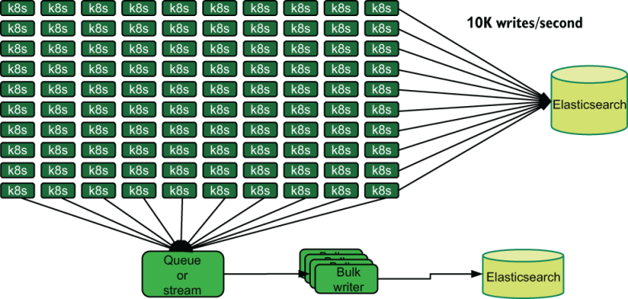
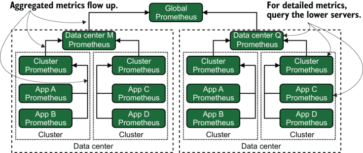

# 附录 A. 遥测存储系统

存储系统与演示阶段系统竞争，成为遥测系统最重要的技术组件。如果你不选择使用 SaaS 平台进行遥测，那么在设置或更新遥测系统时，选择和指定存储系统应该是你的首要任务之一。在本附录中，我将向你提供有关这些存储系统的优点和挑战的指导。尽管第 14 章介绍了基数，并触及了多个存储系统，但需要考虑的不仅仅是每个存储系统处理基数的情况。

如果你使用 Kubernetes，则有一些合格的默认系统可供选择。如果你的生产系统是中小型，这些选项将带你走得更远。此列表中的系统有大量用于与基于 Kubernetes 的基础设施集成的文档：

- 使用 Prometheus 进行度量。这个云原生计算基础产品是 Kubernetes 部署的事实上的标准。
- 使用 Grafana Labs 的 Loki 或 Elasticsearch 来记录日志。 Grafana Labs 正试图让 Loki 成为伐木界的普罗米修斯，并且可能会成功！ Elasticsearch 用于集中式日志记录已近十年，因此该用例有大量文档。
- 使用 FluentD 或 Fluentbit 作为运输阶段日志移动器。该系统不是存储系统，但 Kubernetes 部署对该平台有强烈的偏好，因为它也是云原生计算基础产品。它具有对发送到 Elasticsearch 的本机支持，并且 Grafana Labs 提供了一个可以发送到 Loki 的插件。
- 使用 Jaeger（位于 Elasticsearch 或 Cassandra 之上）进行跟踪。该过程完成后，该云原生计算基础产品可能是第一个完全支持新兴 OpenTelemetry 标准的产品。

在本附录中，我将介绍这些系统以及在容器化环境之外使用的其他一些系统。无论你选择什么产品，你都需要了解三个概念来讨论遥测存储系统。这些概念在通用数据库讨论中很常见，但与遥测系统同样相关：

- 摄取率 - 存储系统在给定时间段内必须写入的事件（单个指标、日志行或跟踪）数量，通常以秒为单位指定。该速率定义了你的写入吞吐量。我讨论影响给定系统摄取率的因素。
- 查询率——来自展示阶段系统的查询。你必须支持的查询越多，你的存储系统就越需要针对只读工作流程以及编写大量遥测数据进行优化。该速率定义了你的读取吞吐量。
- 基数——第 14 章的主题，所以我不会在这里详细介绍。

无论你使用哪种存储系统，如果你可以批量写入，那么所有系统的性能都会更好。不必将每个日志、指标或跟踪作为单独的插入发送，而是将它们捆绑到一个组中，这样你就可以在遇到问题之前获得更高的摄取率，如图 3.4 所示，此处再现为图 A.1。



图 A.1 批量写入与单独写入的优点。两个 Elasticsearch 集群每秒处理的事件数（摄取率）相同，但在任何给定时间，由批量写入器写入的集群中正在进行的写入事务较少。因此，批量写入器 Elasticsearch 集群将能够处理更高的摄取率。

## A.1 分析 Elasticsearch

Elasticsearch 也许是最著名的遥测存储系统，作为 ELK Stack（代表 Elasticsearch（存储）、Logstash（运输自动化）和 Kibana（演示）——早期出现的集中式日志系统）的一部分而声名鹊起。 2010 年代并在整个十年中有所改进。 Jaeger 跟踪平台可以使用 Elasticsearch 作为其存储系统，其他鲜为人知的遥测系统也构建在 Elasticsearch 之上。

Elasticsearch 的构建是为了优化一件事：极快的文本搜索。这种速度使得 Elasticsearch 非常适合用作集中式日志系统。多年来，Elasticsearch 增加了更多功能，这使其成为分布式跟踪甚至指标遥测的可行平台。 Elastic.co 的 X-Pack 插件允许你将 Elasticsearch 用于可观察性的所有三个支柱：日志、指标和跟踪。

Elasticsearch是一个分布式数据库，默认分片。这种水平扩展允许 Elasticsearch 扩展到高摄取率和存储量。 Elasticsearch 具有允许你针对服务层优化集群的功能，其中一层针对摄取高速率数据进行了优化，另一层针对保存大量数据进行了优化以支持搜索。这种灵活性允许 Elasticsearch 从 2 个数据节点扩展到 500 个。

2021 年初，Elasticsearch 的制造商 Elastic.co 更改了 Elasticsearch 的许可证，试图阻止云服务提供商转售 Elasticsearch 服务。 AWS 多年来一直这样做，作为回应，将 Elasticsearch 分叉为 OpenSearch，并承诺保留 Elastic.co 版本留下的 Apache 2.0 许可证。这场斗争仍在继续，只有未来才能告诉我们哪家公司将获得 Elasticsearch（或 OpenSearch）的实际控制权。

### A.1.1 Elasticsearch 擅长什么

Elasticsearch 是存储集中式日志遥测数据的最佳数据库之一。很多集中式日志记录都是字符串，而字符串处理是 Elasticsearch 最擅长的。 Elasticsearch 可以轻松处理高度丰富的遥测数据，每个事件都定义了许多字段。这种现场灵活性使 Elasticsearch 成为构建分布式跟踪系统的有用平台。

Elasticsearch 的两个重要概念是分词器和分析器。分词器识别字段的部分（例如字符串的哪些部分是单词），以加快对这些组件的搜索速度。分析器更进一步，对字符串进行更深入的分析，以提供特定于语言（人类语言，而不是计算机语言）的字符串索引。分词器和分析器允许高度可定制的搜索。

对于摄取率，Elasticsearch 通过分片可以很好地水平扩展。索引的分片越多，其写入能力就越大。不过，索引中的字段数量也很重要。如果你有很多字段（数千个），但并非每个事件都有，你将看到更多的写入 I/O，因为你正在写入大量空字段而不是事件内容。

对于查询率，Elasticsearch 旨在为生产应用程序提供搜索，因此它是为处理大量并发查询而构建的。即便如此，你仍希望将分片大小保持在 50 GB 或更小，以最大限度地提高查询性能。每个数据节点的分片数量也很重要，因为一个地方的分片过多会给 JVM 带来内存压力并降低查询速度。

### A.1.2 Elasticsearch 面临的挑战是什么

由于 Elasticsearch 的编写目的是为另一个系统中托管的文本提供搜索引擎，因此它的编写目的并不是具有高度的写入完整性；你始终可以从主存储重新加载它。在某些情况下，它会丢弃写入，因此，如果你需要 100% 的遥测数据存储在存储中，则需要更加努力以确保 Elasticsearch 不会达到丢弃写入的条件。

虽然Elasticsearch确实支持大分片数量（我听说在2.4版本时代有200个分片的集群），但不支持更改索引的分片。对于遥测用例来说，缺乏支持并不是一个主要问题，因为大多数遥测系统都使用基于天、周或月的基于时间的索引；等待下一个周期获取新的分片计数。如果需要对现有索引进行重新分片，则必须使用新分片设置将整个索引重新创建为新索引，这是一个 I/O 和 CPU 密集型过程。

Elasticsearch 作为指标数据库有一些支持，但 Prometheus 和 InfluxDB 等专门构建的时间序列数据库拥有真正一流的指标系统所需的更广泛的统计和分析功能。

## A.2 分析 Apache Cassandra

Apache Cassandra 是一个数据库，旨在高度水平可扩展，并且对模式不严格。 Cassandra 有一个有趣的功能，允许你选择写入一致性级别，从最高（“在所有节点都确认写入已刷新之前不要确认写入”）到最宽松（“始终确认写入”） ）。作为遥测数据存储，它可用于

- 作为 KairosDB 的后备存储的指标
- 再次通过跨国公司的定制指标系统进行指标
- 通过成为 Jaeger 的一个可能的后备存储来进行追踪
- 定制日志系统的集中日志记录

Cassandra 允许高度水平扩展，这就是前面的列表提到定制系统的原因。大型软件生产公司（参见第 8 章）通常拥有足够的工程人才，可以证明构建自己的遥测管道而不是用开源部件组装它们是合理的。

### A.2.1 Cassandra 擅长什么

卡桑德拉最擅长的第一件事是什么？规模。你选择 Cassandra 是因为你希望存储和摄取大量遥测数据。如果你希望达到 PB 的存储量，Cassandra 可以处理；只需向集群添加更多节点即可。

对于摄取率，Cassandra 随集群中的节点数量线性扩展，这就是全球规模的公司使用 Cassandra 来处理跨多个数据中心的数据集的原因。如果你所在的公司正在成长，摄取率每 18 个月翻一番，Cassandra 可以帮助你完成增长曲线，而无需强迫你重新设计整个遥测系统。

对于查询率，Cassandra 线性扩展，就像摄取率一样。

### A.2.2 Cassandra 面临的挑战是什么

尽管 Cassandra 为你的基础设施带来了很大的规模，但它发现丰富的搜索是一个挑战。 Cassandra 的查询语言是一种查询语言，它擅长支持精确字段内容的查询。它不容易做的是搜索部分字段。因此，Cassandra 大量用于指标和跟踪，但很少用于日志记录。指标和跟踪有模式，很少使用子字段搜索；而对于日志记录来说，子字段搜索是非常好的。 Elasticsearch 是为子字段搜索（使用所有这些分词器）而构建的，并且做得非常好，但 Cassandra 不是为该任务而构建的，并且执行得不好。

当你确实看到 Cassandra 用于集中式日志记录时，它是针对已严格格式化的日志记录数据。在第 3 部分中，我提出了一种使用结构化日志记录来处理隐私和健康相关信息泄漏的方法，该方法使用静态字符串以及一系列上下文详细信息。下面是一个示例，发送静态字符串和上下文哈希：

```
logger.info("Added account to team", {"team": 1597682, "account_id": "A881821"})
```

像这样的结构可以在 Cassandra 数据库上运行，因为搜索者会查找确切的字符串 `"Added` `account` `to` `team"` 并将其配对以及一些上下文细节。更典型的日志语句通常效果不佳：

```
logger.info("Added account A881821 to team 1597682")
```

使用 Elasticsearch，你可以像这样表达搜索并获得你想要的一切：

```
"Added account" AND "1597682"
```

使用 Cassandra，获取团队 1598682 的添加帐户列表将需要非常低效的搜索。 Cassandra 从结构中受益匪浅。

## A.3 分析 Grafana Labs 的 Loki

Grafana Labs 的 Loki 是一个相当新的集中式日志系统，于 2018 年才发布。它的年轻意味着它仍在 2021 年组装，因此预计未来几年会发生许多变化。我提到 Loki 是因为 Grafana Labs 直接针对 Kubernetes 和云原生计算基金会市场，其目标是打造一个高度可扩展的集中式日志记录系统——这是基金会所缺少的，类似于 Cassandra，但适合集中式日志记录用例。

Loki 在存储方面有两个主要组成部分：

- 托管键值块的服务，可以是多种类型，例如 AWS DynamoDB、AWS S3、Cassandra、Google Cloud Storage 或 Google Bigtable。
- 托管键值块索引的服务，可以是 AWS DynamoDB、Cassandra 或 Google Bigtable。

Loki 还采用了一些 SaaS 日志记录供应商（例如 Splunk 和 Sumo Logic）使用的后处理概念，其中演示阶段系统在用户进行查询时执行大量丰富操作。 Elasticsearch 在将遇到的每个字段提取到存储中时对其进行索引和标记化，而 Loki 只对你已知需要的主要字段（称为标签）执行这些操作，并依赖演示阶段来处理较小的字段。这种方法减轻了运输阶段组件的一些负担。以下查询查找特定应用程序的遥测数据，然后使用演示阶段丰富来进一步深入了解特定团队的遥测数据：

```
{datacenter="euc1",app="account-maint"} | json | team="A881821"
```

此查询从 EU Central 1 数据中心（特别是从帐户维护应用程序）提取遥测数据，并通过 JSON 反序列化器运行获取的遥测数据（大量），以将更多字段带入查询中。最后，它返回团队属性为 A881821 的任何遥测数据。在依赖预处理的遥测系统中，Shipping 阶段将在 Presenter 阶段介入之前执行 JSON 反序列化并创建团队字段。

Loki 为 Cassandra 这样的数据存储带来的关键创新是查询前端。这些前端执行 Cassandra 不擅长的搜索，这使得该产品作为集中式日志系统与 Elasticsearch 相比更具竞争力。

最后，与 Elasticsearch（Elastic.co 版本）、MongoDB 和 InfluxDB 一样，Loki 是一个开放核心产品。

### A.3.1 Loki 擅长什么

Loki 的诞生就是为了一件事：大规模处理日志。通过使用 AWS S3 和 Google Cloud Storage 等云提供商存储桶，你可以不再考虑扩展存储。当你使用 Cassandra 和 DynamoDB（Cassandra 的灵感来源）等技术作为索引时，主要的技术问题就简化为保持索引满意，而不是保持 PB 级存储服务器满意。

通过扩展分发节点以提高其接受传入遥测数据的能力，并通过扩展摄取节点以处理将块写入存储和索引，摄取速率可线性扩展。如果你没有配置足够的容量，则可能会遇到索引器服务的瓶颈。

对于查询速率，Loki 依赖一层查询前端节点来处理排队查询、跨集群分发查询以及执行转换（例如前面示例中的 JSON 转换）。当索引器服务容量耗尽时，用户查询可能会再次成为索引器服务的瓶颈。

### A.3.2 Loki 面临的挑战是什么

Loki 很年轻，也有年轻的问题。也就是说，它正在积极开发中，因此这些问题可能不会存在太久。三大问题是

- 不支持无序到达 - 每个日志都应具有比前一个日志更新的时间戳。如果你的遥测工作流程包括偶尔处理旧数据集（也许你的业务涉及移动遥测，有时由于飞行模式而延迟数小时到达），Loki 可能不适合。
- 不支持定向删除——保留策略是全局设置的；一切都有一个单一的策略，不同的系统不可能有不同的策略。此外，如果你出于某种原因需要删除一组特定的遥测数据（也许你需要清理泄漏的隐私或健康相关信息），那么最好在存储中进行删除，而不是直接在 Loki 中进行。
- 不支持重写——如果你的日志记录可能包含隐私或健康相关信息，Loki 不支持重写。为了处理此类数据的溢出，你需要删除旧的流并重新处理整个数据集。

## A.4 分析 MongoDB

MongoDB 是第一个获得广泛关注的 NoSQL 存储引擎之一。该项目早年做出了一些有争议的设计决策，让 MongoDB 在那些不注意细微差别的人中受到了很多蔑视，并被烧伤了。十二年后，MongoDB 版本 4 及更高版本取消了那些有争议的设计选择，并消除了许多令早期采用者烦恼的隐藏问题。

MongoDB 是顶级文档存储引擎，与 Elasticsearch 搜索引擎略有不同。 MongoDB 被设计为一个主存储系统； Elasticsearch 则不然。当涉及到维护系统和防止系统故障时，这种差异很重要。

由于 MongoDB 处理基于文本的数据的方式，它有时被用作集中式日志存储系统。它不像 Elasticsearch 那样专注于基于文本的搜索，但它具有比 Cassandra 更好的文本搜索功能，并且已经在许多地方用于应用程序内搜索。由于这些功能，一些公司选择 MongoDB 作为定制集中式日志系统的基础。

与 Elasticsearch 类似，MongoDB 采用分片和副本方法来扩展存储。分片将数据库分割成更小的部分，使你能够扩展存储性能。副本重复分片，让你能够更好地应对中断。

与 Elasticsearch 不同，你必须具体定义想要使用的索引，因此在设计 MongoDB 系统时需要知道数据是什么样的。对于现有的生产系统，你已经有了这些详细信息，因此任务应该不会太难。但是，当你设置新系统时，可能需要多次重做才能适应。

最后，MongoDB 是一个开放核心产品，就像 Elasticsearch（Elastic.co 变体）和 InfluxDB 一样。尽管你可以使用免费版本执行很多操作（包括贡献代码），但你可能需要付费许可证才能使用某些功能。

### A.4.1 MongoDB 擅长什么

MongoDB 非常擅长集中式日志记录，并且可以高度保证写入保真度。 Elasticsearch 在某些罕见的情况下会丢弃写入，但 MongoDB 不会（或者可以配置为不这样做）。与 Loki 不同，MongoDB 并不是作为专用遥测引擎构建的，但它是文档存储的事实使其非常适合遥测用例。如果你已经在生产系统中使用 MongoDB，那么使用 MongoDB 进行遥测对你来说应该非常容易。

对于摄取率，MongoDB 根据分片跟上写入量的能力进行扩展，因此如果写入变得高度潜在，请添加更多分片。此外，你希望使用许多集合（数据库；将其想象为分区）来进一步增强水平扩展的能力。 MongoDB 还知道位置（称为区域），例如数据中心或云提供商区域，它通过将读取和写入定向到本地分片来增强性能。

对于查询速率，MongoDB 受索引的存在控制，但它也受益于演示阶段系统中的查询优化。与 Elasticsearch 不同，你必须专门定义所需的索引。 MongoDB 在一个集合中最多可以有 64 个索引，因此如果你需要更多索引，请考虑将集合拆分为多个集合。

### A.4.2 MongoDB 面临的挑战是什么

使用 MongoDB 作为遥测存储系统的最大挑战是其管理复杂性以及缺乏支持它的现成演示阶段系统。与本附录中讨论的大多数其他日志记录存储系统相比，你需要更大程度地主动管理 MongoDB 存储遥测数据的方式。如果你已经对生产系统进行了这种管理，那么这种额外的管理不应成为障碍。

## A.5 分析 Prometheus

Prometheus 是一个时间序列数据库和指标系统，是 Kubernetes 环境的默认平台。这个云原生计算基金会项目是完全开源的。 Prometheus 提供了专门为处理时间序列数据而设计的查询接口，并包含各种转换和汇总函数，这对于从指标中获取价值非常重要。

Prometheus 可以作为独立的单节点系统运行，易于设置和运行。 Prometheus 在 Kubernetes 领域的流行使得 Prometheus 协议成为传输指标的事实上的标准。 Prometheus 产品通过允许使用其他存储系统（例如 InfluxDB，以及各种云提供商特定的系统）作为 Prometheus 的主要存储，同时仍然向消费者提供相同的接口来拥抱这种流行。

Prometheus 存储层的可交换性质使得讨论存储性能变得更加棘手，但如果你达到了本机存储引擎的限制，请评估迁移到新引擎的可能性。在本节中，我将研究本机存储引擎。

### A.5.1 Prometheus 擅长什么

Prometheus 擅长度量，任何东西（假设它在容器化环境中运行）都可能被构建为假设它会与 Prometheus 对话。开始超越 Prometheus 的组织将创建多个 Prometheus 服务器，而不是考虑不同的平台。

与本附录中讨论的其他存储系统不同，Prometheus 采用分层扩展方法。 Prometheus 没有像 Elasticsearch、Cassandra、MongoDB 和 InfluxDB（付费）那样水平分割单个数据存储，而是创建一棵树来汇总指标（图 A.2）。



图 A.2 Prometheus 扩展模型。与本附录中讨论的大多数其他存储系统不同，Prometheus 不提供单一的大规模存储系统。相反，它依赖于在树上滚动聚合并查询特定区域（数据中心、集群、应用程序等）Prometheus 服务器以获取详细指标。

Prometheus 使用聚合（参见第 5.1.1 和 17.2 节）来提供更广泛范围内发生的情况的视图。演示阶段系统（可能是 Grafana）将配置多个数据源：使用顶级 Prometheus 来获取聚合视图，使用较低级别的 Prometheus 来获取狭窄区域的详细视图。这种方法使 Prometheus 能够实现高度扩展。

对于摄取率，各个 Prometheus 服务器根据服务器本身的存储性能进行扩展，但受到数据库中基数的限制。作为 Prometheus 生态系统，摄取完全取决于你将指标路由到各个服务器并配置聚合汇总的能力 - 不像添加分片那么容易，但比设置单个服务器更具可扩展性。

对于查询率，Prometheus 的拆分性质意味着你的顶级聚合服务器将看到大量流量，除了通常的仪表板流量之外，可能还来自运行自动查询的警报系统以提供待命轮换。较低级别、范围较窄的服务器将看到来自工程人员寻找详细信息的流量，并且查询大多不频繁。 Prometheus 还限制数据库基数的查询速率，这使得 RAM 的查询成本更高。

### A.5.2 Prometheus 面临的挑战是什么

Prometheus 在以下两种情况下成为一个具有挑战性的平台：

- 大型环境或大型单体产品——在这种情况下，Prometheus 的扩展技术比 InfluxDB 或 Cassandra 等可分片数据存储需要更多的部署工作。 Prometheus 成长于容器和微服务领域，在该领域，将指标遥测数据手动分片到不同的 Prometheus 服务器中要容易得多。与流行的开源产品一样，许多 SaaS 产品和咨询服务可以帮助你处理复杂性。
- 基数——我在第 14 章中讨论过这个主题。时间序列数据库通常在处理高基数时存在问题，Prometheus 也不例外。 Prometheus 的文档很清楚，你需要注意基数，不注意基数的代价是查询速度慢和 RAM 使用率高。

## A.6 分析 InfluxDB

InfluxDB 是另一个时间序列数据库，这使其成为存储指标的好地方。 InfluxDB 的创建者 InfluxData 已将该数据存储作为整个指标管道的核心，以此与 Prometheus 和 Grafana 组合竞争。作为数据存储，InfluxDB 和 Prometheus 有很多共同点，但 InfluxDB 的商业版本提供了出于水平规模和基数原因对数据库进行分片的能力。

InfluxDB 的商业版本 InfluxDB Enterprise 允许你创建多个数据和元数据服务器的集群。集群允许节点之间的复制以容忍故障（以及修补周期等例行操作）和可配置的写入一致性级别。集群内的分片通过将基数成本分散到多个数据服务器来增加数据库的有效基数限制。

### A.6.1 InfluxDB 擅长什么

InfluxDB 旨在很好地处理低基数指标。 InfluxData 知道 Prometheus 是自托管指标市场的主导者，因此 InfluxDB 拥有与 Prometheus 兼容的 API 端点以及几个不太受欢迎的指标传输，包括 StatsD 和 Graphite。 InfluxDB 代表了一种付费的自托管选项，它附带一种大型老企业认为是关键任务组件的最低要求的支持合同。

对于摄取率，InfluxDB 主要受到存储性能（如果使用固态硬盘，则不是主要问题）和更新索引所需的 CPU 的限制。也就是说，InfluxDB 强制每个数据库的最大基数，并拒绝增加基数的写入。

对于查询速率而言，InfluxDB 受到保存索引的 CPU 和内存的限制，因为 CPU 和内存使用的增加是基数问题的表现。 Prometheus 在查询基数方面也有类似的问题。

### A.6.2 InfluxDB 面临的挑战是什么

InfluxDB 的主要问题是免费版本中的扩展：你必须遵循 Prometheus 模型并创建一个离散服务器树，将指标从较低层服务器聚合到较高层服务器。使用单个数据库进行扩展是一项企业计划功能，因此如果你的组织已经很大，请计划为分片和集群功能制定预算。

与大多数时间序列数据库一样，InfluxDB 存在高基数指标的问题。该公司计划在 2.x 系列的整个生命周期内解决该问题，因此请密切关注未来几年的进展。整个行业对高基数指标有着深刻的需求，这是一个根本性的难题。

## A.7 分析 Jaeger

Jaeger 是一个自托管的跟踪系统，这使其在 SaaS 厂商主导的市场中脱颖而出。 Jaeger 也是云原生计算基金会的成员，因此它是完全开源的。 Jaeger 很可能成为第一个在新兴的 OpenTelemetry 跟踪标准（也是 CNCF 项目）最终确定后完全支持的自托管跟踪数据存储。

与 Grafana Labs 的 Loki 一样，Jaeger 位于其他存储系统之上来提供数据存储。对于 Jaeger 来说，你可以使用 Elasticsearch 或 Cassandra 来提供存储层。 Jaeger 的其余部分位于顶部，接收来自 Shipping 阶段的跟踪并为 Presenter 阶段提供查询层。由于 Jaeger 位于其他存储技术之上，因此扩展 Jaeger 对 Cassandra 或 Elasticsearch 的依赖程度与对 Jaeger 自身组件的依赖程度一样。

Jaeger 可以使用 Kafka（一种流服务）作为其内部操作的一部分。这样做的原因有很多，我在第 1 部分中谈到过：使遥测操作异步、提高面对错误时的恢复能力，以及在遥测处理备份时处理背压。

### A.7.1 Jaeger 擅长什么

Jaeger 是自托管分布式跟踪领域的主导者，并且是为横向扩展而构建的。当在 Elasticsearch 之上使用时，Jaeger 可以让 Elasticsearch 承担一些索引负载，并为每个摄取工作人员编写更多遥测数据。如果你已经使用 Elasticsearch 进行集中式日志记录或作为生产应用程序的一部分，那么 Jaeger 是一种更易于部署的产品。

对于摄取率，Jaeger 水平扩展得相当好。它需要一个摄取器工作人员将遥测数据插入到存储系统中，但该摄取器可以水平扩展到足以使存储系统饱和。 Jaeger 建议在 Cassandra 上运行 Elasticsearch，因为 Elasticsearch 可以承担一些索引工作。

对于查询率，Jaeger 提供了用于获取跟踪和跨度的 UI 和 API。性能取决于查询服务可用的存储性能和 CPU。由于跟踪的性质，存储处理的写入量将远远多于读取量。 UI 和 API 服务是水平可扩展的，尽管它们不一定支持跨离散查询服务的浏览器会话存储。其他服务（例如 Grafana）将使用 API 进行查询。

### A.7.2 Jaeger 面临的挑战是什么

Jaeger 被设计为在 Kubernetes 中运行，如果你不是 Kubernetes 商店，Jaeger 的部署对你来说将是一个挑战。一些组织开始使用分布式跟踪系统代替集中式日志系统，Jaeger 对此有一些支持。专门构建的集中式日志系统仍然可以为你提供更好的服务。