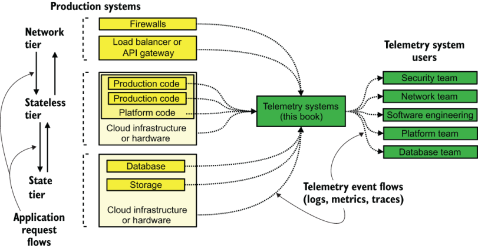

## 前言

我以我们大多数人的方式进入软件遥测：作为生产者通过在代码中使用打印语句，作为消费者通过阅读我正在使用的代码生成的日志和指标。尽管我拥有计算机科学学位，但我大学毕业后并没有立即进入软件工程领域。不，我进入了当时所谓的 IT 或运营领域，一直呆在那里直到积累了 14 年的经验。这把我带到了 2011 年，从很多方面来说，那都是一个新时代。

那一年，我辞去了高等教育工作，加入了一家拥有 20 名员工的法律科技初创公司，成为其唯一的运营人员。那一年也正处于软件遥测革命的中期，运营团队和系统管理员长期使用的监控系统开始扩展为直接由软件使用。遥测的度量风格诞生了。在接下来的十年中，随着数据库的功能变得足以支持它们，我们看到了另外两种遥测风格的出现：可观察性（它本身并没有持续很长时间）和分布式跟踪。

当我在 2019 年产生写这本书的想法时，我目睹了软件工程师使用的反馈在二十年半的时间里不断演变。最初，开发人员通常在生产中直接查看 telnet 会话内的日志文件，到 2019 年，所有遥测数据都改为通过基于浏览器的应用程序访问。遥测（工程师用来了解其环境的反馈）是一个以可观察性的三个支柱为中心的理解概念：日志、指标和跟踪。而我，当时仍在基础设施的系统或平台方面，意识到所有这些新的遥测方法都具有相同的核心概念 - 以及相同的核心漏洞。我寻找并发现了有关特定技术的大量资源，例如 Kafka、Prometheus、应用程序监控以及如何进行集中式日志记录。但没有任何资源讨论可用的遥测系统的生态系统。

这种缺乏是可怕的。遥测系统是软件开发组织高效运作的基础，因为这些系统可以告诉你代码（以及运行代码的系统）的运行情况。现在我们的遥测系统有很多相互竞争的需求。我打算写一本书来帮助你解决这些相互竞争的问题，改进成本管理，并更好地操作这些关键任务系统。本书旨在改进你已经在做的事情，并更好地适应新出现的遥测技术。

这本书是关于改进你已有的东西，因为每个软件生态系统的核心至少有一些遥测技术。无论你是在开发全球规模的软件即服务 (SaaS) 应用程序（作为金丝雀部署流程的一部分，部署到更广泛的全球数据中心），还是为你更新的市政府的考勤卡输入系统每隔几个月，你就会使用遥测技术。本书既适用于以软件为业务的公司，也适用于软件仅实现使命的组织。

如果你的生态系统是在云提供商平台上运行的一组无服务器功能，或者如果你正在大厅运行 VMware ESX 集群，则你需要以大致相同的方式进行软件遥测，即使你使用的工具完全不同。遥测是一个广泛的话题，没有一种产品（甚至技术）能够满足每个人的需求。读完这本书后，我希望你能够更好地了解自己的需求以及如何满足这些需求。

图 FM.1 遥测系统与生产系统的配合情况。所有生产系统都会发出遥测数据；遥测是我们了解它们是否正常工作的方式。本书介绍的是处理遥测数据并对其进行转换以便人们可以查看的系统。

作为一个行业，我们从数字时代的开始已经走了很长一段路，当时房间大小的计算机上闪烁的指示灯是我们唯一的反馈，表明它实际上正在处理某些事情。 （闪烁太快或太慢意味着出现了问题。）该图显示了遥测系统适合现代 Web 开发堆栈的位置，该堆栈与一切相连。

我们的反馈系统创新还没有结束——还远远没有完成。预计未来 10 年市场上将会出现有趣的产品。本书应该帮助你在这些系统到达时进行操作。

## 致谢

如果没有我妻子艾米的牺牲，这本书的写作时间可能要长得多。写作是一项孤独的工作，尤其是当它不是你的主要工作时。她对这项工作的贡献是接受了许多孤独的夜晚和周末，当时我只是在那里做家务和吃饭，她值得认可。太感谢了。我们已经在一起20多年了；我想我们可以继续下去。

感谢乔什建议我为这本书提出提案。你有一个孩子要来，没有时间做一个大项目，但你怀疑我可能有时间。事实证明我做到了。你给了我将这本书变成现实所需的动力。

感谢 Alex、Corrine 和 Jake 教我企业 IT 如何与 Apple 硬件配合使用。苹果革命发生在我从事 IT 工作之后，所以我需要这个例子！

感谢我的开发编辑玛丽娜，她当然必须做一些开发工作。第 1 章到第 5 章的最初版本与你现在看到的有很大不同。你和我在一起，我们写了一本书。

必须进一步感谢第一轮审稿人，他们给了我所需的反馈，让我看到第一章的所有问题。当第三轮评审到来时，我已经掌握了窍门。

感谢我的技术开发编辑 Miloš 和我的技术校对员 Serge，他们一起让我对所有代码保持诚实。我可能拥有计算机科学学位，但这并不能让我成为一名软件工程师。你实际的软件工程观点使我的代码示例对读者来说比其他情况更有用。他们中的大多数人实际上都在跑步！

我还要感谢 Manning 的其他员工：Deirdre Hiam，我的项目编辑； Keir Simpson，我的文案编辑；还有我的校对员克里·海尔斯 (Keri Hales)。

感谢所有审稿人：Aleksandr Novomlinov、Andres Sacco、Andrew Bovill、Clifford Thurber、Conor Redmond、Frederick Price、Joel Holmes、Karthik Sirasanagandla、Krishna Aerabati、Lokesh Kumar、Matthew Farwell、Mike Jensen、Milorad Imbra、Richard Vaughan、Rob Pacheco 、Sander Zegveld、Serge Simon、Sergiu Raducu、Steven K. Makunzva、Sushant Bhadkamkar、Tim Wooldridge 和 Warren Myers。你的建议有助于使这本书变得更好。

我还必须向数百万人死于 COVID-19 表示感谢。本书是一本流行病书籍。我签署协议写这本书的时候，全世界都在听说中国武汉和那里的问题，而我在疫苗分发正在加速到真正令人振奋的水平时完成了写作。因为2020年和2021年初是可怕的时期，我觉得那个时期创作的任何作品都必须向死者致敬。所有的关闭和封锁无疑给了我更多的时间来写作，而这本书并不小，所以它欠那些我们失去的人和那些仍在受苦的人一份情。

## 关于本书

软件遥测教你所有遥测系统的一般架构，同时为你提供许多现实世界遥测系统设计的示例作为灵感。尽管每个组织使用遥测技术的方式不同，但遥测技术仍然支持每个组织中的相同决策。本书提出了操作这些关键决策支持系统的系统方法。

架构是一回事，但遥测系统操作员需要熟悉某些技术，以降低成本并更好地完成组织的使命。当你的组织发展到足以让每个人都看到所有遥测不再是一个好主意时，你需要采用多租户概念。当你在遥测系统中使用大量正则表达式时，提高这些表达式的效率将提高遥测系统的性能。当你的生产代码在本地文件访问有问题的平台（例如容器或函数即服务 (FaaS)）上运行时，你需要不同的方式来传送遥测数据。本书涵盖了这些技术以及更多内容。

全球范围内的数据法规越来越要求对隐私和健康相关信息采取特殊处理程序，这些信息很容易泄漏到我们的遥测系统中。十年前，除了健康信息外，我们大多不关心，但欧盟《通用数据保护条例》(GDPR) 等法规迫使我们关心。我们的遥测系统需要像生产系统一样处理这些变化。本书详细介绍了可用于防止受保护数据泄露并使泄露后的清理变得更容易的技术。

在第 1 部分结束时，你应该对遥测系统的架构有一个可靠的心智模型，这将帮助你推理新系统并改进你已有的系统。第 2 部分通过为你提供三种不同类型的组织中遥测架构的 11 个真实示例，帮助你巩固在第 1 部分中学到的知识。在第 3 部分结束时，你将拥有一套可用于解决当前遥测系统中的问题并使其整体上更易于操作的技术。

注意本书旨在帮助专门使用容器的组织、仅使用容器作为其运营一部分的组织以及尚未感受到容器存在的组织。正如作家威廉·吉布森所说：“未来已经到来，只是分布不均。”容器和无服务器技术也是如此。我谈论的抽象原则适用于所有计算类型，无论是否基于容器，而我用来教授这些原则的具体示例来自不同的计算风格。如果我没有像你想要的那样完整地涵盖你的风格，请知道另一位读者正在享受他们的啊哈！片刻。

## 谁应该读这本书

本书适合那些希望改进现有遥测系统或正在考虑重新设计已在使用的遥测系统的人——支持集中式日志系统的系统工程师、编写供内部使用的可观察性系统的软件工程师、寻求提高合规性的安全工程师以及更多的。本书不是以代码为中心，但我确实使用代码来说明示例。

我假设你具有编写代码的基本能力，其中包括常见的数据结构和条件逻辑以及读写文件，并且你了解堆栈转储告诉你什么。你还应该熟悉直接（如使用 SQL）或间接（通过查询构建器）编写搜索。我不假设你拥有详细的数据库知识，但你应该知道表、列和行之间的差异，并且应该广泛地了解 MS-SQL 和 PostgreSQL 等关系数据库与 Elasticsearch 和 MongoDB 等 NoSQL 系统有何不同。

如果你使用或维护过如下遥测系统，你将从本书中获得更多信息：

- Datadog、New Relic、Splunk、Sumo Logic 和 Honeycomb.io 等 SaaS 提供商
- 专用日志传送系统，例如 Fluentd、Fluentbit 和 Logstash
- Grafana、Kibana 和 Jaeger 等遥测审核平台
- 遥测存储平台，例如 KairosDB、Elasticsearch、MongoDB、Cassandra、Loki 和 Prometheus

## 本书的结构：路线图

本书分为三个部分。

第 1 部分为你提供了所有遥测系统都遵循的一般架构，你应该在阅读其他两部分之前阅读它。

- 第 1 章介绍了遥测系统，并提供了我在本书中介绍的四种遥测风格的定义：集中式日志记录、安全信息事件管理、指标和分布式跟踪。即使你每天都在使用这些东西，本章也会为你提供我在整本书中使用的术语。
- 第 2 章至第 5 章描述了遥测管道的三个主要阶段（发送、运输和呈现）以及在每个阶段中移动遥测所使用的技术。
- 第 6 章介绍了在三个阶段的每个阶段中对遥测执行的转换和标记的类型。
- 第 7 章介绍了多租户概念、为什么有时需要多租户以及它如何改变遥测系统设计。

第 2 部分着眼于三种不同类型的组织，并跟踪其遥测使用的变化。关于你不熟悉的组织的章节，请随意跳过；如果你愿意，他们可以为你提供更多示例供你参考。

- 第 8 章讲述了一家编写 SaaS 应用程序的示例云公司中遥测技术的演变。本章从小型阶段开始，此时遥测完全包含在云提供商的仪表板中，结束于企业阶段，此时公司将大部分遥测引入内部。
- 第 9 章介绍了在编写仅供内部使用的软件的组织中如何使用遥测技术（如果他们确实编写软件的话）。本章详细介绍了如何在办公室 IT 环境中使用遥测技术（随着组织规模的增加，遥测技术会发生显着变化），以及当内部开发到来时遥测技术的使用如何扩展。
- 第 10 章介绍了如何在传统计算环境（大型机）中使用遥测技术。不要被吓跑；大型机只是基础设施的组件，它们的遥测使用会让人感觉很熟悉。

第 3 部分包含可用于优化和改进遥测系统操作的具体技术，各章都是为了单独阅读而编写的。

- 第 11 章介绍了如何优化正则表达式的使用。许多遥测系统依赖正则表达式来提取和转换遥测数据，因此优化它们可以提高性能。
- 第 12 章讨论标准化遥测格式并引导你构建结构化记录器。结构化记录器是涉及内部代码的遥测系统的关键组件。
- 第 13 章深入探讨了非文件遥测发送技术，并详细介绍了如何在容器和 FaaS 环境中使用遥测。
- 第 14 章深入探讨了基数问题，并展示了管理基数如何迫使遥测系统发生变化。
- 第 15 章介绍了遥测完整性以及确保遥测不被更改的方法，即使在不能容忍不变性的环境中也是如此。
- 第 16 章讨论通过实时和事后编辑有毒数据泄漏来处理遥测管道中的受监管信息（有毒数据）。本章还介绍了重新处理（重新摄取遥测数据）以处理存储系统升级或迁移到新平台。
- 第 17 章介绍如何构建保留策略来确定在线和离线存储遥测数据的时间、如何创建保持统计有效性的指标聚合策略，以及采样如何提高分布式跟踪的保留期。
- 第 18 章将带你了解法律发现过程对遥测的影响，以及在必须处理发现问题时可以采取的早期步骤，以减少恐慌。
- 附录 A 讨论了七个遥测存储系统，展示了每个系统的优点以及其使用可能存在的挑战。
- 附录 B 是我在各章中构建的所有建议清单的参考。
- 附录 C 包含全书练习的答案和指导。

## 关于代码

遥测系统涵盖了广泛的软件，因此没有一个代码框架适合一本关于软件遥测的书籍。对于用通用语言编写的示例，我使用 Python 3，因为它相对普遍。在较小程度上，我使用 Ruby，因为它可以更好地处理某些边缘情况，并且因为两个主要的遥测运输系统（Fluentd 和 Logstash）都是用 Ruby 编写的，Ruby 是它们的扩展语言。

注意 有关 Fluentd（云原生计算基金会的一部分）的完整指南，请参阅 Phil Wilkins 所著的《操作中的日志记录》（Manning，2021 年；http://mng.bz/VGlW）。

本书还包括来自多个框架的配置文件示例。我不希望你运行这些文件，但它们是为了说明要点并提供具体示例。我最常用的配置文件格式是Logstash (http://mng.bz/xGvg)。

注意本书的 Gitlab 存储库包含大多数 Python 列表的 Java 版本。你可以在 http://mng.bz/RKxv 找到 GitLab 存储库。

本书包含许多源代码示例，包括编号列表和内联普通文本。在这两种情况下，源代码都采用 `a fixed-width font like this` 格式，以将其与普通文本分开。有时，代码也 `in bold` 来突出显示与本章前面的步骤相比发生更改的代码，例如当新功能添加到现有代码行时。

很多情况下，原来的源代码已经被重新格式化；我们添加了换行符并重新设计了缩进，以适应书中可用的页面宽度。在极少数情况下，这还不够，列表中包含行继续标记 (➥)。此外，当在文本中描述代码时，源代码中的注释已从列表中删除。许多清单都附有代码注释，突出显示了重要的概念。

## 讨论论坛

购买软件遥测包括免费访问由 Manning Publications 运营的私人网络论坛，你可以在其中对本书发表评论、提出技术问题并获得作者和其他用户的帮助。要访问论坛，请访问 http://mng.bz/2zDa。你还可以访问 https://livebook.manning.com/#!/discussion 了解有关 Manning 论坛和行为规则的更多信息。

曼宁对读者的承诺是提供一个场所，让读者之间以及读者与作者之间可以进行有意义的对话。这并不是对作者参与任何具体数量的承诺，作者对论坛的贡献仍然是自愿的（且无偿的）。我们建议你尝试向作者提出一些具有挑战性的问题，以免他们的兴趣偏离！只要该书还在印刷，就可以从出版商的网站访问论坛和之前讨论的档案。

并非每个遥测系统都使用正则表达式 (regexes)，但如果你的遥测系统使用正则表达式，那么 https://regex101.com 及其对正则表达式执行方式的详细分析将为你提供良好的服务。每种语言处理正则表达式的方式都有所不同，但如果你的语言不在 regex101 上，它仍然会帮助你通过编写一般正则表达式进行推理。

AWS 和 Azure 等主要公共云提供商开始提供遥测系统的托管版本，因此现在他们的文档涵盖了这些遥测样式的维护和操作。如果你的生产系统位于公共云提供商中，则托管遥测系统及其文档值得一看。

Monitorama 会议 (https://monitorama.com) 的视频档案包含有关指标、分布式跟踪和一般系统可观察性的演示。遥测 SaaS 提供商举办的供应商会议，例如来自 Honeycomb.io 的 o11ycon（https://o11ycon-hnycon.io；o11y 是可观察性的数字名称，以 o 开头和 y 结尾之间有 11 个字符）和来自 New 的 {Future}Stack Relic (https://newrelic.com/futurestack) 是关于我在本书中讨论的主题的演示和演讲的其他来源。更重要的是，这些会议为你提供了“如何使用遥测技术”的指导，除了这本书之外，这些指导还值得一本书。

## 关于作者

Jamie Riedesel 是 Dropbox 的一名高级工程师，负责 HelloSign 产品的开发。她在技术领域拥有 20 多年的经验，从办公室 IT 开始，转向系统管理和工程，最近从事 DevOps。自 2015 年以来，她一直在技术会议上发表演讲，主题包括 Logstash 优化、监控系统重构以及克服工作场所造成的创伤等。你可以在 https://sysadmin1138.net/mt/blog 找到她的博客。

## 关于封面插画

《软件遥测》封面上的人物标题为“Catalanne”，即来自加泰罗尼亚的女性。我选择这张照片是因为它展示了一个女人在两个地方之间：市场和家庭。这本书是关于我们的生产系统（市场）和我们做出决策的地方（家庭）之间的空间。必须有人建造和维护这条道路，就像必须有人建造和维护让我们了解生产系统如何运行的系统一样。

插图取自雅克·格拉塞·德·圣索沃尔（Jacques Grasset de Saint-Sauveur，1757-1810 年）收集的各国服饰集，题为《Costumes de Différents Pays》，于 1797 年在法国出版。每幅插图均由手工精心绘制和着色。 Grasset de Saint-Sauveur 丰富多样的藏品生动地提醒我们，200 年前世界各地的城镇和地区在文化上是多么不同。人们彼此隔离，讲着不同的方言和语言。无论是在街道上还是在乡村，仅凭着装就很容易辨别出他们住在哪里、从事什么行业或生活地位。

从那时起，我们的着装方式发生了变化，当时如此丰富的地区多样性已经消失。现在很难区分不同大陆的居民，更不用说不同的城镇、地区或国家了。也许我们已经用文化多样性换取了更加多样化的个人生活——当然是为了更加多样化和快节奏的技术生活。

在很难区分一本计算机书籍和另一本计算机书籍的时代，曼宁以两个世纪前丰富的地区生活多样性为基础的书籍封面来庆祝计算机行业的创造性和主动性，这些封面由格拉塞·德·圣 (Grasset de Saint) 复活。索沃尔的照片。